| Field | Details |
|-------|---------|
| **Room** | Compromised Windows Analysis |
| **Platform** | TryHackMe |
| **Path** | Advanced Endpoint Investigations |
| **Module** | Windows Endpoint Investigation |
| **Difficulty** | Easy |
| **Category** | Digital Forensics / IR |
| **Room Link** | [tryhackme.com/room/compromisedwindowsanalysis](https://tryhackme.com/room/compromisedwindowsanalysis) |
| **Author** | [OPT4RUN](https://tryhackme.com/p/OPT4RUN) |

---

## Overview

This room walks through a real-world Windows incident response scenario involving a compromised employee workstation at a tech startup. The attacker gained initial access via RDP, disabled Windows Defender, dropped a malicious RAR archive, executed a payload, and established persistence via a scheduled task that beaconed out to a C2 server over SSH every minute.

The investigation uses a combination of Eric Zimmerman's tools and Windows built-in utilities to reconstruct the attack chain from initial access to persistence — covering scheduled tasks, LNK files, prefetch files, Amcache, and Windows Event Logs.

From a SOC/DFIR perspective, this room is valuable for understanding how to:
- Identify attacker persistence mechanisms on Windows endpoints
- Correlate artifacts across multiple forensic sources to build a timeline
- Use EZ Tools for rapid triage of Windows artifacts

---

## Task 1 — Introduction

The scenario: TKM startup employee **Aashir's** workstation was generating repeated SSH connection attempts to a malicious IP every minute. Windows Defender was found disabled. Joe (junior security engineer) contained the host and escalated for investigation.

**Q: What is the user's name whose system generated suspicious SSH traffic to a malicious IP?**
```
Aashir
```

---

## Task 2 — Lab Setup

RDP credentials provided for the lab machine:

| Field | Value |
|-------|-------|
| Username | Administrator |
| Password | compromise@333 |

---

## Task 3 — Timeline Explorer for Visualization

Timeline Explorer is an Eric Zimmerman tool for viewing and filtering CSV files. It's used throughout this room to visualize parsed artifact output from LECmd, PECmd, and AmcacheParser.

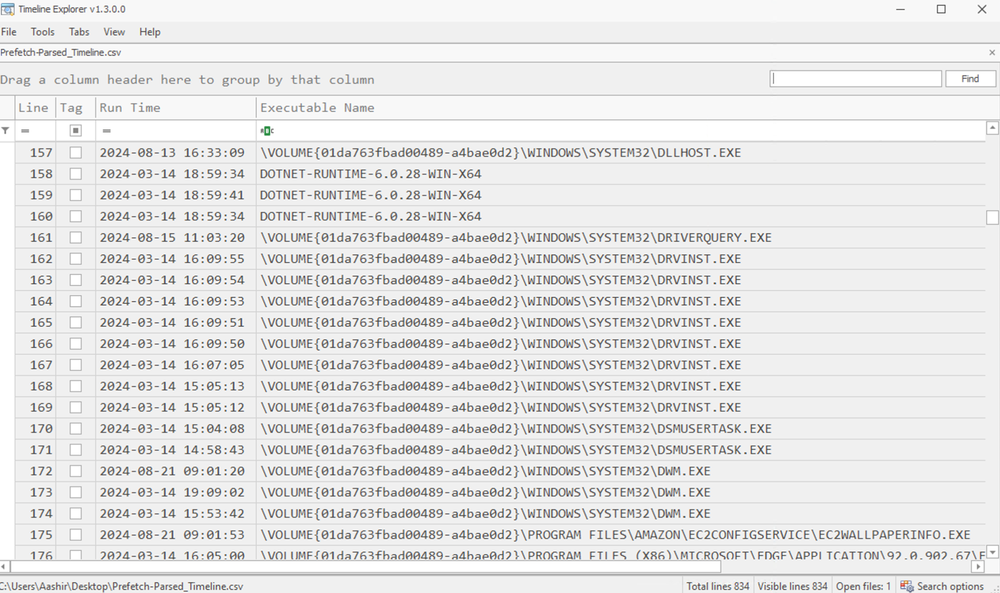

**Q: Which tool makes it easier to analyze CSV files?**
```
Timeline Explorer
```

---

## Task 4 — Investigating Persistence

### Scheduled Tasks

Scheduled tasks are a common persistence mechanism. Threat actors abuse them to ensure their payloads execute automatically at defined intervals — in this case, every minute to maintain a C2 channel.

**Investigation path:** Task Scheduler UI or `C:\Windows\System32\Tasks`

The attacker created a scheduled task at **10:29** that initiated an SSH connection to a malicious C2 server at regular one-minute intervals.

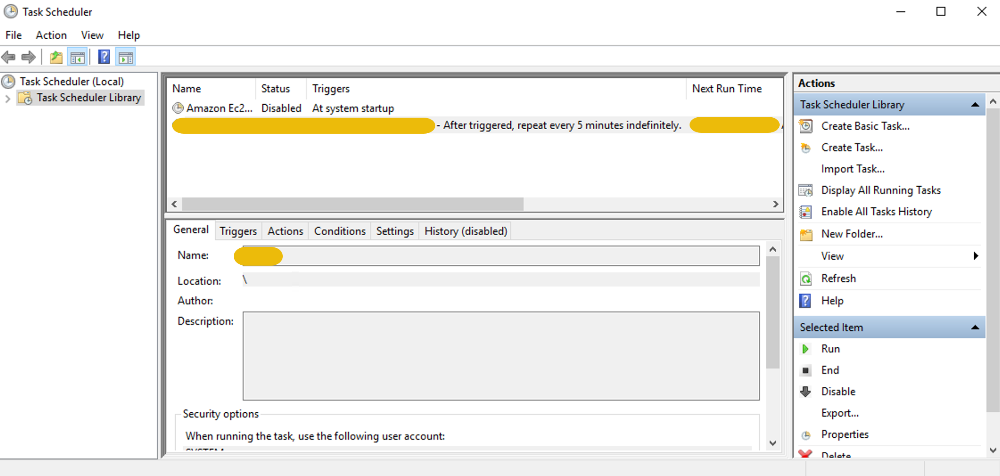

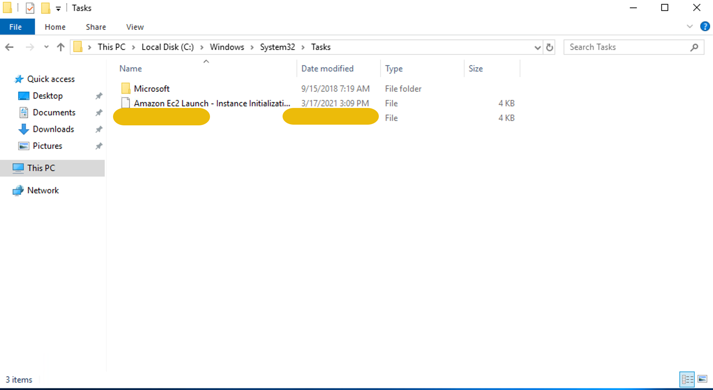

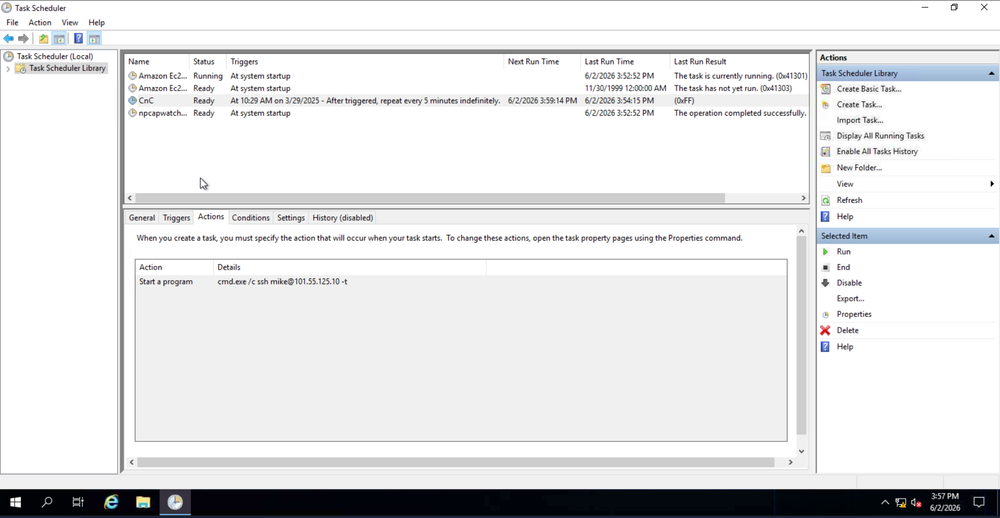

**Q: What is the name of the scheduled task created by the attacker?**
```
CnC
```

**Q: What is the IP of the malicious server to which SSH requests are made?**
```
101.55.125.10
```

---

## Task 5 — Investigating Recently Accessed Files

### LNK Files

LNK (shortcut) files are created by Windows when a file is accessed and stored in `%APPDATA%\Microsoft\Windows\Recent Items`. They retain metadata about the target file even after the original has been deleted — making them critical for identifying attacker-dropped files.

**Tool:** LECmd (Eric Zimmerman)

```
.\LECmd.exe -d C:\Users\Administrator\AppData\Roaming\Microsoft\Windows\Recent --csvf Parsed-LNK.csv --csv C:\Users\Administrator\Desktop
```

The LNK for a RAR file was found created **2 minutes before** the scheduled task, indicating it was accessed as part of the attack workflow. The original file had been deleted.

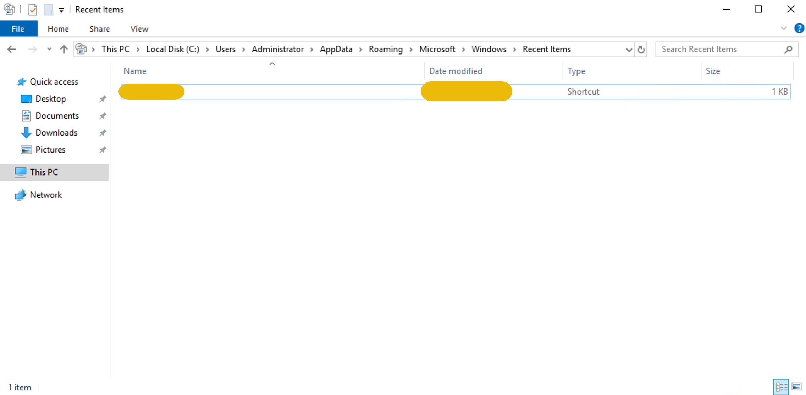

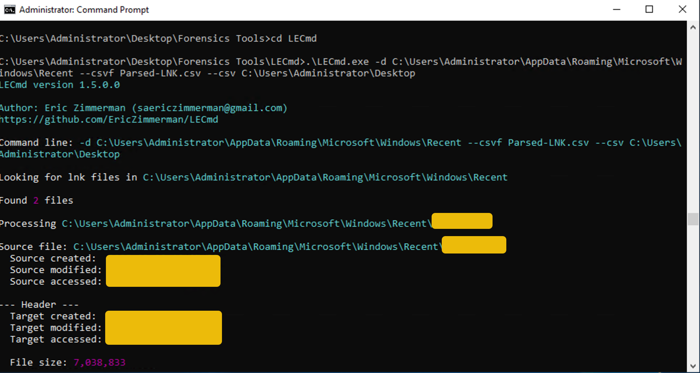

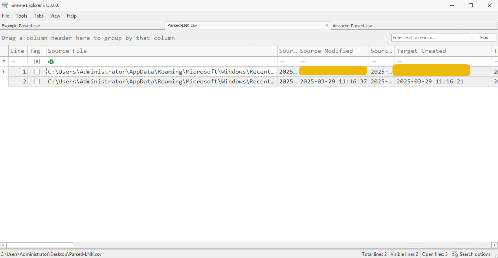

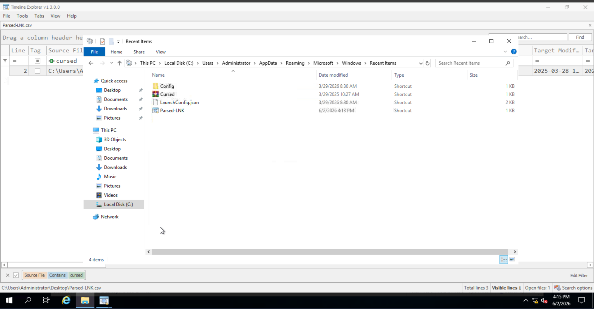

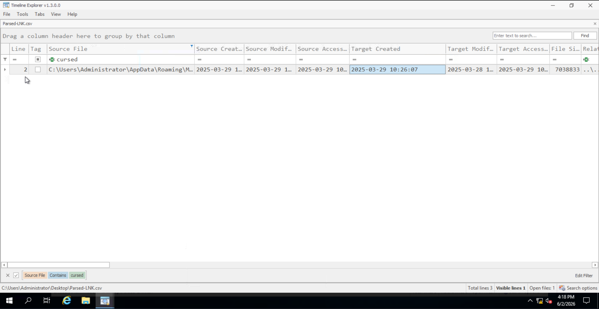

**Q: What is the name of the RAR file created during the attack?**
```
Cursed.rar
```

**Q: When was the RAR file created in the system? (YYYY-MM-DD HH:MM:SS)**
```
2025-03-29 10:26:07
```

---

## Task 6 — Investigating File Execution

### Prefetch Files

Windows creates prefetch files (`C:\Windows\Prefetch`) each time an executable runs. They store the executable name, run count, last run time, and referenced files. For incident response, they confirm whether a suspected malicious binary was actually executed and how many times.

> 💡 **Tip:** Prefetch is disabled by default on Windows Server editions. It's primarily a desktop/workstation artifact.

**Tool:** PECmd (Eric Zimmerman)

```
.\PECmd.exe -d "C:\Windows\Prefetch" --csv C:\Users\Administrator\Desktop --csvf Prefetch-Parsed.csv
```

A prefetch entry for the malicious executable was found with execution occurring shortly after the RAR file access time established in the previous task.

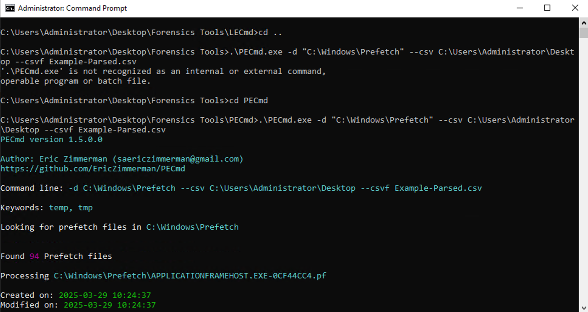

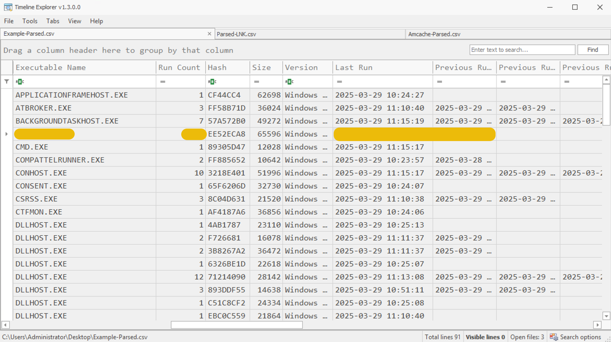

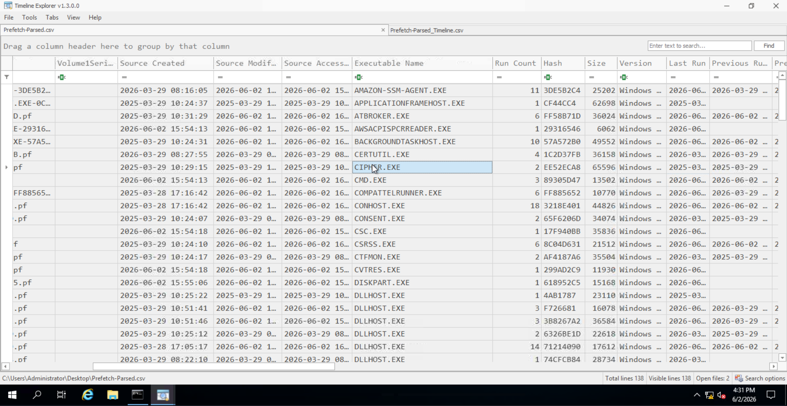

**Q: What is the name of the malicious executable file?**
```
Cipher.exe
```

**Q: How many times was this file executed?**
```
2
```

**Q: When was the last time that this file was executed? (YYYY-MM-DD HH:MM:SS)**
```
2025-03-29 10:29:12
```

---

## Task 7 — The Dig of Executable

### Amcache

Amcache (`C:\Windows\appcompat\Programs\Amcache.hve`) stores metadata about installed and executed applications — including the full file path and SHA1 hash. It persists longer than Shimcache/AppCompatCache, making it more reliable for post-incident analysis.

> 💡 **Tip:** Amcache refreshes on restart. In live investigations, export it before rebooting the host or you'll lose the attack-session data.

**Tool:** AmcacheParser (Eric Zimmerman)

```
.\AmcacheParser.exe -f "C:\Windows\appcompat\Programs\Amcache.hve" --csv C:\Users\Administrator\Desktop --csvf Amcache_Parsed.csv
```

> 🔴 **Malware relevance:** The SHA1 hash extracted here can be directly submitted to VirusTotal or used in threat intel pivoting to identify the malware family and associated campaigns.

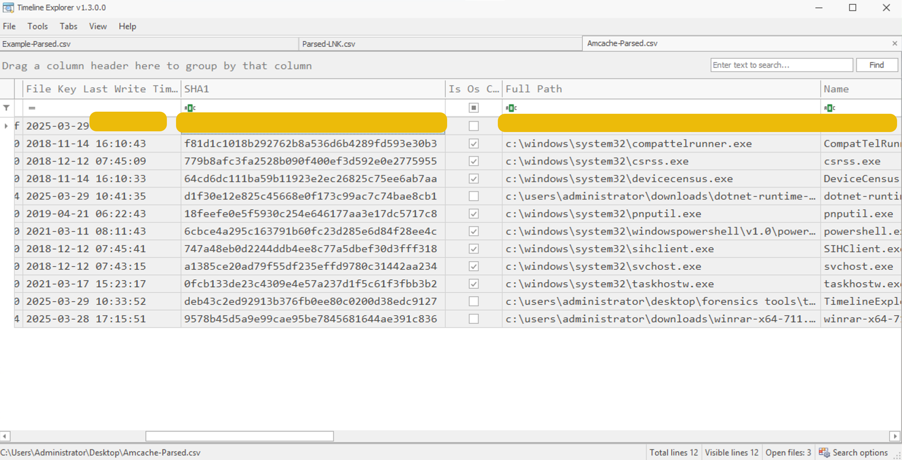

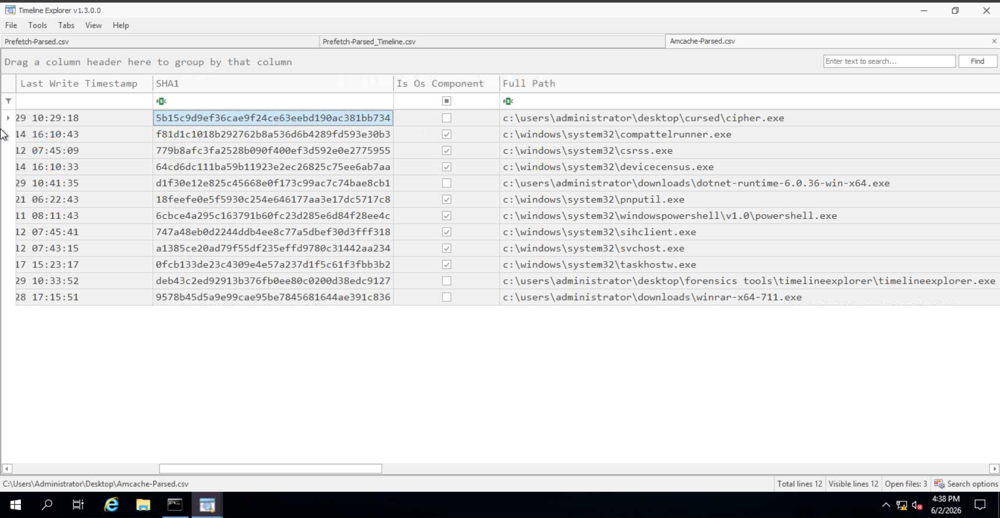

**Q: What is the full path of the malicious file?**
```
c:\users\administrator\desktop\cursed\cipher.exe
```

**Q: What is the SHA1 hash of this file?**
```
5b15c9d9ef36cae9f24ce63eebd190ac381bb734
```

---

## Task 8 — Windows Event Log Analysis

### Windows Event Logs

Event Viewer provides visibility into user sessions, security events, and application/service activity. Key log locations used here:

| Log Path | Purpose |
|----------|---------|
| `Applications and Services Logs > Microsoft > Windows > Terminal-Services-RemoteConnectionManager > Operational` | RDP session tracking |
| `Applications and Services Logs > Microsoft > Windows > Windows Defender > Operational` | Defender state changes |

**Event IDs of interest:**

| Event ID | Meaning |
|----------|---------|
| 1149 | RDP — successful authentication (pre-session) |
| 5001 | Windows Defender real-time protection disabled |

An RDP successful login (Event ID 1149) was recorded a few minutes before the RAR file was dropped — establishing the attacker's initial access vector. Shortly after, Defender was disabled (Event ID 5001) to remove detection capability before payload execution.

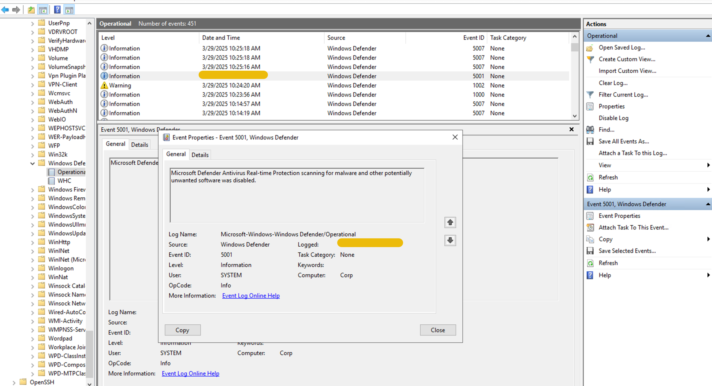

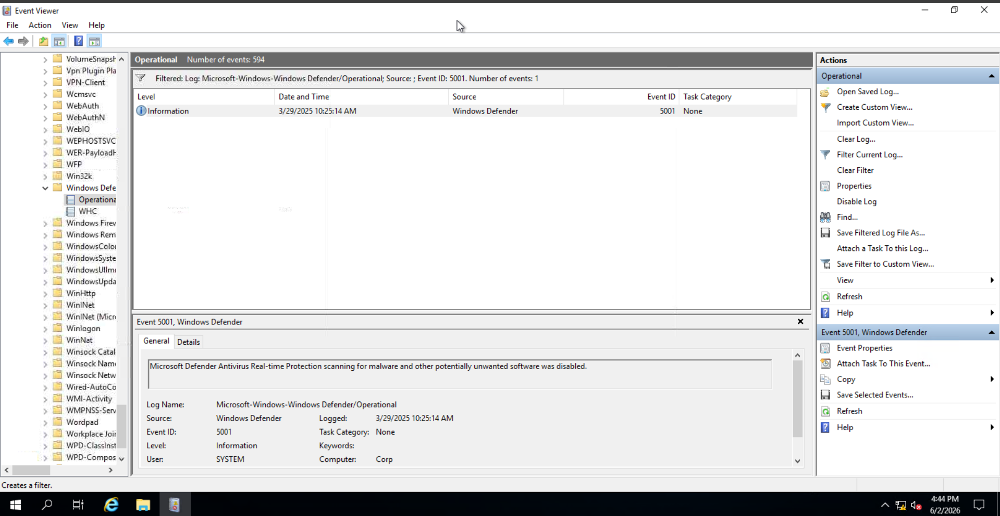

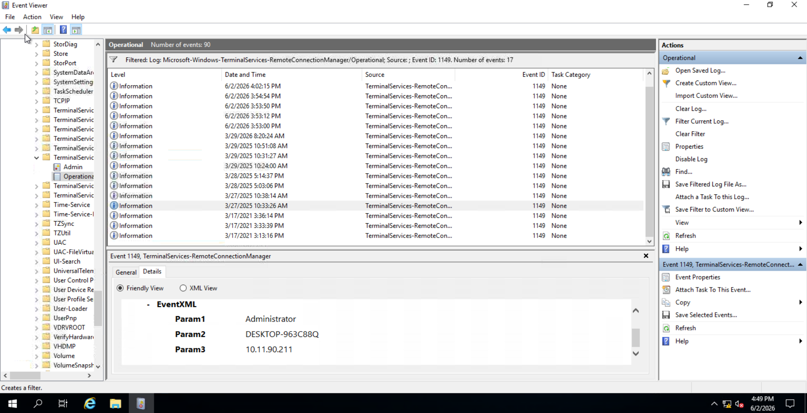

> 🔴 **Malware relevance:** Disabling AV/EDR before payload execution is a standard defense evasion technique (MITRE ATT&CK T1562.001). Correlating Event ID 5001 with the execution timeline is key to confirming intentional evasion vs. accidental misconfiguration.

**Q: When was Defender disabled? (12-hour clock format)**
```
10:25:14 AM
```

**Q: What is the IP address of the attacker's system?**
```
10.11.90.211
```

---

## Task 9 — Chronological Order of Attack

Full reconstructed attack timeline:

| Time | Activity | Artifact Source |
|------|----------|-----------------|
| ~10:2x | RDP session initiated by attacker | Event ID 1149 |
| 10:25:14 AM | Windows Defender disabled | Event ID 5001 |
| 2025-03-29 10:26:07 | `Cursed.rar` dropped on system | LNK / Amcache |
| 2025-03-29 10:27:xx | RAR file opened / decompressed | LNK (Source Created) |
| 2025-03-29 10:29:12 | `Cipher.exe` executed (last run, 2x total) | Prefetch / Amcache |
| 2025-03-29 10:29 | Scheduled task `CnC` created for SSH C2 beaconing | Task Scheduler |
| Post-execution | `Cursed.rar` and `Cipher.exe` deleted | Absence in file system; LNK orphaned |

---

## Key Takeaways

- **Scheduled tasks** are a primary Windows persistence mechanism — always check `C:\Windows\System32\Tasks` during endpoint triage
- **LNK files** survive file deletion and reveal recently accessed files with timestamps — invaluable when an attacker cleans up dropped files
- **Prefetch files** confirm execution of binaries with run count and last execution time — pair with Amcache for full file metadata
- **Amcache** provides SHA1 hashes for executed binaries even after deletion, enabling direct threat intel lookups
- **Event ID 1149** (RDP auth) + **Event ID 5001** (Defender off) are high-signal indicators of an active intrusion when correlated together
- The attack followed a classic sequence: Initial Access → Defense Evasion → Execution → Persistence — mapping cleanly to MITRE ATT&CK

---

*Write-up by [OPT4RUN](https://tryhackme.com/p/OPT4RUN)*