# Diskrupt

| Field      | Details                                                                 |
|------------|-------------------------------------------------------------------------|
| **Platform**   | [TryHackMe](https://tryhackme.com)                                  |
| **Path**       | Advanced Endpoint Investigations — File System Analysis             |
| **Room**       | [Diskrupt](https://tryhackme.com/room/diskrupt)                     |
| **Difficulty** | Hard                                                                |
| **Category**   | Digital Forensics                                                   |
| **Author**     | [OPT4RUN](https://tryhackme.com/p/OPT4RUN)                         |

---

## Overview

Diskrupt is a capstone challenge for the File System Analysis module. It presents a realistic insider threat scenario where a forensic image of a suspect's workstation must be triaged from the ground up — starting with a corrupted boot sector and working through partition analysis, NTFS artefact recovery, USN journal investigation, and manual file carving.

No guided tasks. No hints. Just a damaged disk image and 12 questions.

From a SOC and DFIR perspective this room covers the full chain of evidence recovery: disk repair → partition enumeration → filesystem artefact analysis → deleted file recovery → hex-level file carving. The kind of workflow that appears in actual insider threat and data exfiltration cases.

**Scenario:** An underground research group, NexgEn e-Corps, suspects a newly joined intern named Fatima of stealing a quantum-resistant cryptography research paper and wiping her traces. An unexpected system failure on her workstation left behind fragments of evidence. Your job is to recover them.

**Evidence:** `challenge.001` — a forensic disk image located in the `Evidence` folder on the Desktop.

**Toolset available on the VM:** HxD, FTK Imager, Autopsy, MFTECmd, MFTCmd, Timeline Explorer, Eric Zimmerman tools.

---

## Task 1 — Challenge Scenario

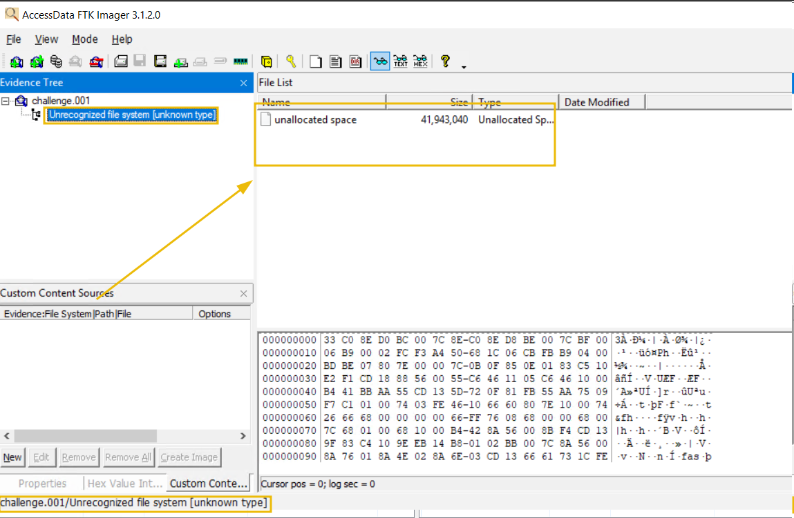

The objectives as stated in the room:

- Fix the damaged disk
- Examine the partitions
- Find evidence of access to sensitive research documents
- Identify deleted or tampered files
- Locate hidden files on the disk
- Carve out deleted files from the disk

The disk image is an MBR-partitioned drive with two partitions:
- **Partition 1** — NTFS (boot partition, ~30 GB)
- **Partition 2** — FAT32 (~9.7 GB)

---

### Step 1 — Identifying and Fixing the Corrupted Boot Sector

Open `challenge.001` in **HxD** and navigate to offset `0x1FE` (bytes 510–511). This is the MBR boot signature, which should always be `55 AA`. On this disk, those bytes are corrupted.

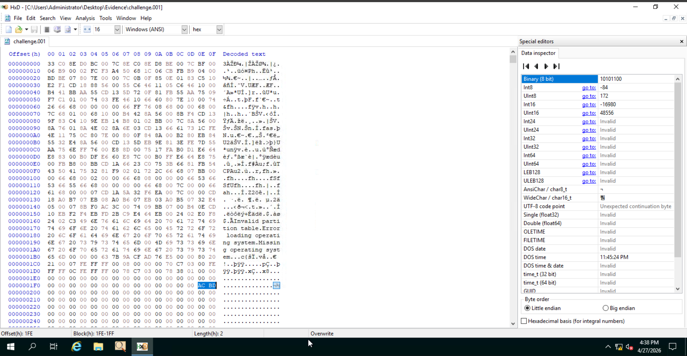

Once identified, overwrite the corrupted bytes with `55 AA` and save — this repairs the MBR and allows the disk to be properly loaded in forensic tools like FTK Imager.

> 💡 **Tip:** The first 446 bytes of an MBR contain bootloader code. The partition table occupies bytes 446–509. Bytes 510–511 are the boot signature. If the signature is not `55 AA`, most tools will fail to parse the partition table correctly.

**Q: What are the corrupted bytes in the boot sector that caused the disk to be damaged?**
```
ACBD
```

---

### Step 2 — Partition Analysis

With the MBR repaired, open the image in **FTK Imager** or inspect the partition table directly in HxD. Each MBR partition entry is 16 bytes and begins at offset `0x1BE`. The relevant fields for size are:

- **Relative Sectors** (4 bytes, offset +8 in entry) — starting LBA
- **Total Sectors** (4 bytes, offset +12 in entry) — sector count

Size in bytes = Total Sectors × 512 (standard sector size). Convert to GB (here the room accepts GiB — 1 GiB = 1,073,741,824 bytes).

**Q: What are the bytes representing the total sector count of the second partition? (Little Endian)**
```
0x01387800
```

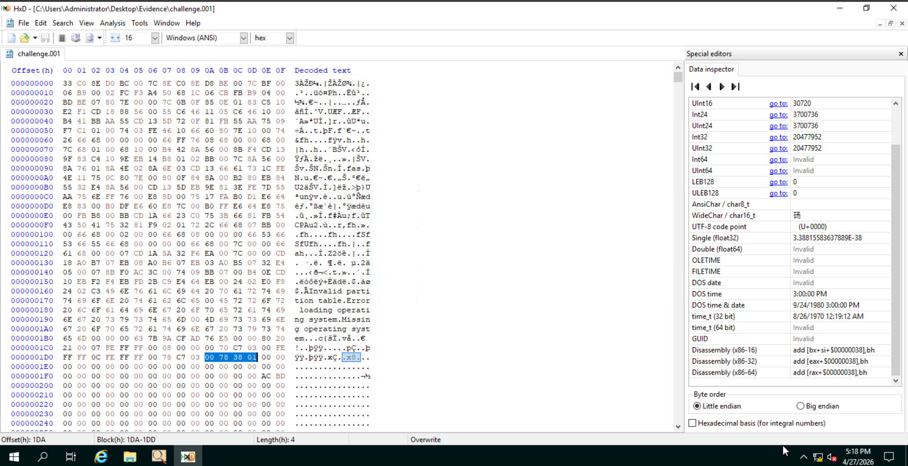

**Q: What is the size of the first partition in GB? (up to 2 decimals)**
```
30.23
```

First partition total sectors: `63,401,984` × 512 = 32,461,815,808 bytes ÷ 1,073,741,824 = **30.23 GiB**

**Q: What is the size of the second partition in GB? (up to 2 decimals)**
```
9.76
```

Second partition total sectors: `20,477,952` (decoded from `0x01387800` in little endian) × 512 = 10,484,711,424 bytes ÷ 1,073,741,824 = **9.76 GiB**

> 🔴 **Forensic note:** Partition sizes calculated from the MBR match independently of what the OS would report. This is useful for detecting volume manipulation — if the declared size doesn't match actual data extent, that's a red flag.

---

### Step 3 — NTFS Partition: Password File Timestamp

With the MBR fixed, FTK Imager can now parse both partitions. Export the `$MFT` from the NTFS partition root.

Parse the MFT using **MFTECmd**:

```
MFTECmd.exe -f ..\Evidence\$MFT --csv ..\Evidence --csvf ..\Evidence\MFT_record.csv
```

Open `MFT_record.csv` in **Timeline Explorer** and filter for files containing "password" in the filename. The creation timestamp for the password-related text file is visible in the `Created0x10` column.

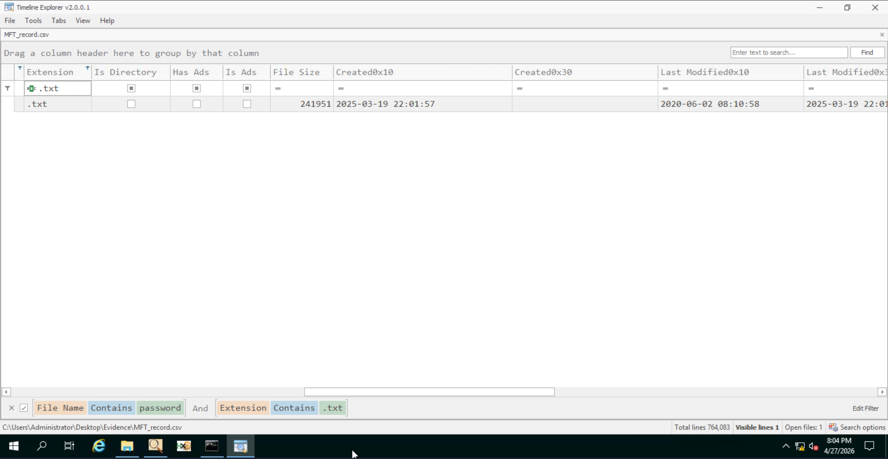

**Q: In the NTFS partition, when was the text file related to the password created on the system?**
```
2025-03-19 22:01:57
```

---

### Step 4 — Sensitive PDF on FAT32 Partition

Switch to the FAT32 partition in FTK Imager and browse the directory structure. The research paper is present in the partition's file listing.

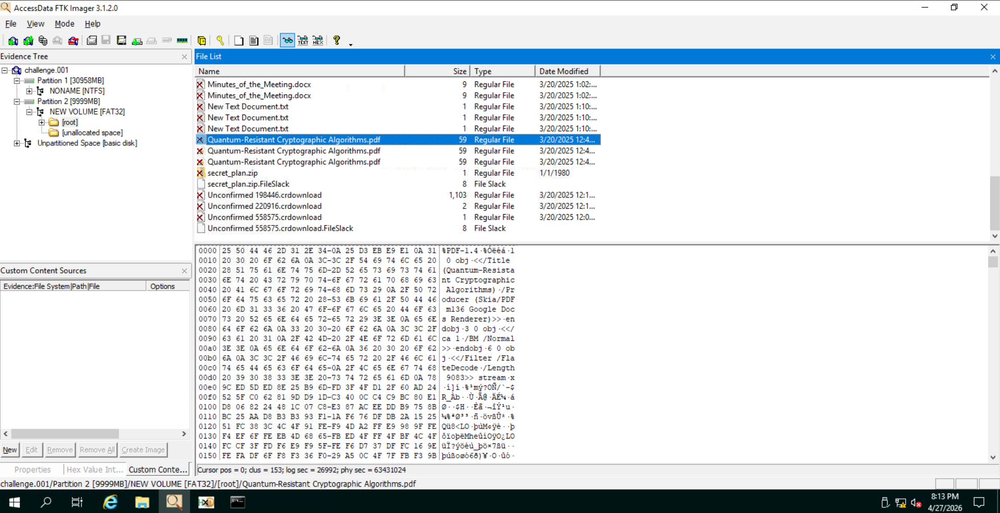

**Q: What is the full name of the sensitive PDF document accessed on this disk?**
```
Quantum-Resistant Cryptographic Algorithms.pdf
```

---

### Step 5 — USN Journal Analysis

To determine when the PDF first appeared on the disk, analyse the NTFS USN Journal. Extract `$J` from `$Extend\$USNJrnl` within the NTFS partition using FTK Imager.

Parse the journal with MFTECmd:

```
MFTECmd.exe -f ..\Evidence\$J --csv ..\Evidence --csvf ..\Evidence\Journal_record.csv
```

Open the output in Timeline Explorer and search for the PDF filename. The earliest journal entry for that file gives the first-seen timestamp.

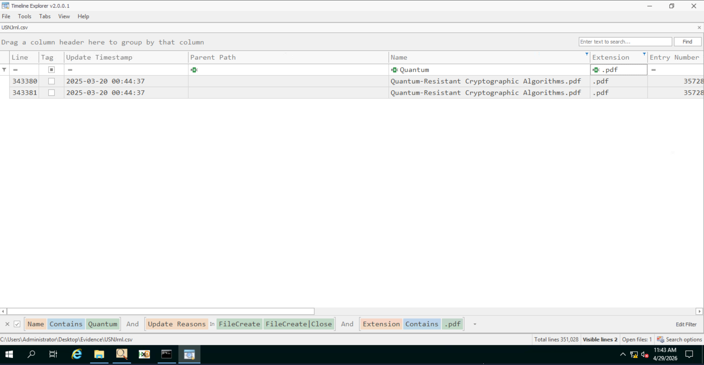

**Q: When was this file first found on this disk?**
```
2025-03-20 00:44:37
```

> 🔴 **Forensic note:** The USN Journal (`$UsnJrnl:$J`) records every file system change — creates, deletes, renames, overwrites. Unlike MFT timestamps which can be modified, the journal provides a chronological audit trail. Critical for establishing timeline in exfiltration cases.

---

### Step 6 — Deleted Exfiltration Directory in Journal

Still in the parsed journal CSV, search for a directory entry that was created and subsequently deleted. This directory was likely used to stage files for exfiltration. The MFT entry number is the `EntryNumber` field in the journal record.

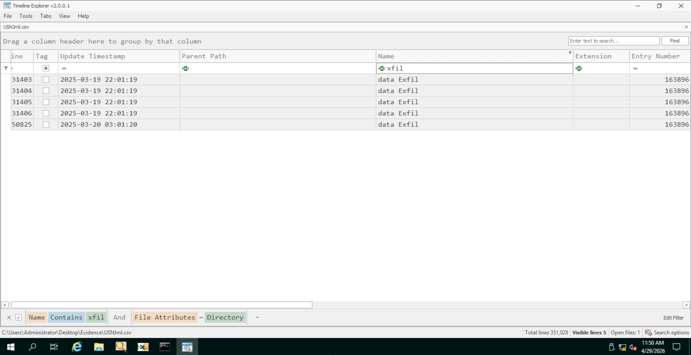

**Q: What is the entry number of the directory in the Journal that was created and then deleted for exfiltration purposes?**
```
163896
```

---

### Step 7 — File Carving: Locating the ZIP File

The room asks you to locate the first ZIP file found after offset `0x4E7B00000` in the raw disk image.

Open `challenge.001` in HxD and jump to offset `4E7B00000`. Search forward for the ZIP magic bytes (file header signature):

```
50 4B 03 04
```

The first match after the specified offset is the start of the carved ZIP file.

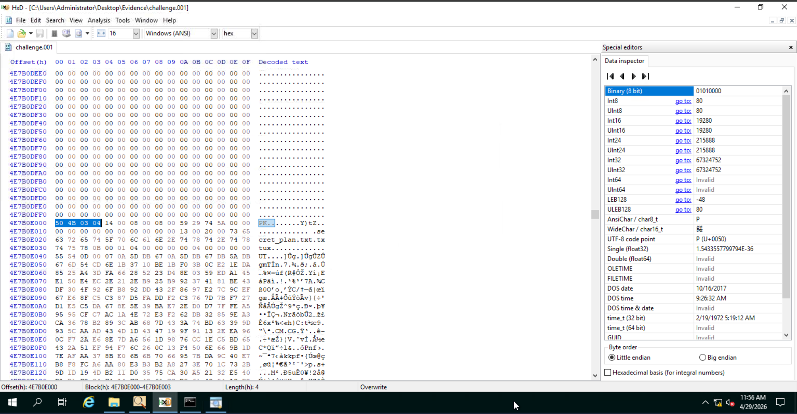

**Q: What is the starting offset of the first ZIP file found after offset 4E7B00000?**
```
4E7B0E000
```

---

### Step 8 — File Carving: ZIP End Offset

To find the end of the ZIP archive, search forward from the starting offset for the ZIP end-of-central-directory record signature:

```
50 4B 05 06
```

The end-of-central-directory record is 22 bytes total (4-byte signature + 18 bytes of fields). The ending offset is therefore the position of `50 4B 05 06` plus 21 bytes (to include the full 22-byte record).

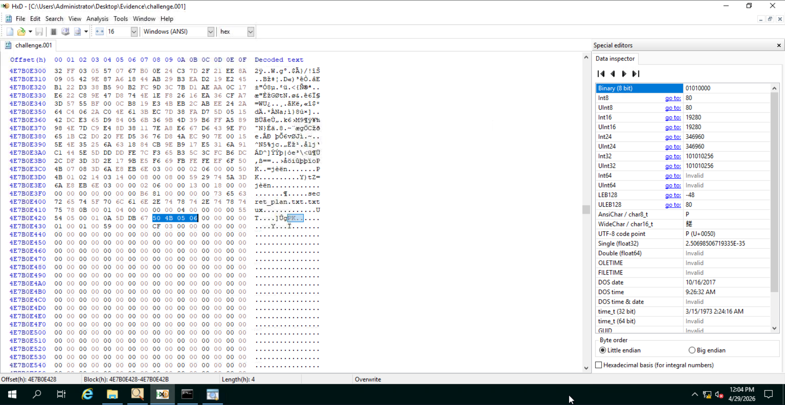

**Q: What is the ending offset of the ZIP file?**
```
4E7B0E43D
```

> 💡 **Tip:** Standard ZIP footer is `50 4B 05 06` followed by 18 bytes — 22 bytes total. If a ZIP comment is present, additional bytes follow, but the EOCD record itself still ends at signature + 18 bytes. Always account for the full EOCD record when calculating ending offset.

---

### Step 9 — Extracting the Flag from the Carved ZIP

Select all hex bytes between the starting offset (`4E7B0E000`) and the ending offset (`4E7B0E43D`) inclusive in HxD. Paste them into a new file, save it with a `.zip` extension, and open it to access the contents inside.

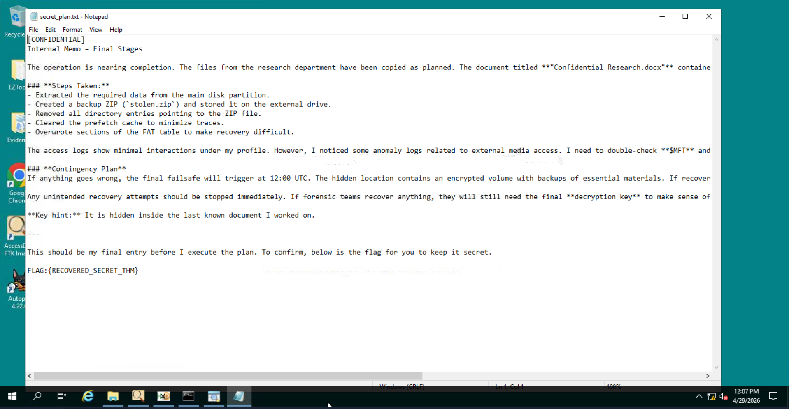

**Q: What is the flag hidden within the file inside the ZIP?**
```
FLAG:{RECOVERED_SECRET_THM}
```

---

### Step 10 — Disk Wiping Tool on FAT32 Partition

Examine the FAT32 partition in Autopsy or FTK Imager, including deleted file entries. FAT32 marks deleted files by overwriting the first byte of the filename entry with `0xE5` — the file metadata including the original name remains recoverable until overwritten.

Look for an executable that matches the profile of a disk wiping utility.

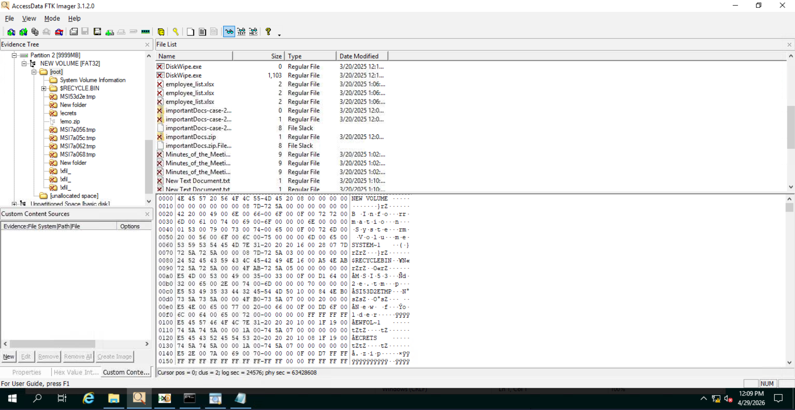

**Q: In the FAT32 partition, a tool related to disk wiping was installed and then deleted. What is the name of the executable?**
```
DiskWipe.exe
```

> 🔴 **Forensic note:** The presence of a disk wiping tool on a suspect's drive is strong anti-forensics evidence. Even if the tool was deleted, its recovery from FAT32 via the `0xE5` marker is a significant artefact — it demonstrates intent to destroy evidence, which has legal implications in both incident response and legal proceedings.

---

## Key Takeaways

- **MBR signature corruption** (`55 AA` at bytes 510–511) is a trivial but effective way to prevent casual forensic analysis — always verify the boot sector before declaring a disk unreadable.
- **Partition sizes** can be independently verified from MBR sector counts — discrepancies between declared and actual size can indicate manipulation.
- **MFT + USN Journal together** tell the full story: MFT gives current state, the journal gives chronological history including deleted entries. Neither alone is sufficient.
- **USN Journal entry numbers** are stable identifiers — even after file deletion, the entry number in the journal ties back to the MFT record, enabling correlation.
- **ZIP file carving** is purely signature-based: `50 4B 03 04` (header) and `50 4B 05 06` (EOCD). The ending offset must include the full 22-byte EOCD record.
- **FAT32 deleted file recovery** via the `0xE5` marker remains reliable until the cluster is reallocated — exfiltrators who delete tools on FAT32 drives often underestimate how recoverable those entries are.
- The combination of the deleted staging directory (journal entry `163896`), the recovered ZIP, and the `DiskWipe.exe` artefact together paint a clear picture of the exfiltration chain: copy → stage → exfiltrate → wipe.

---

*Write-up by [OPT4RUN](https://tryhackme.com/p/OPT4RUN)*