# EXT Analysis

| Field | Details |
|-------|---------|
| **Room** | EXT Analysis |
| **Platform** | TryHackMe |
| **Path** | Advanced Endpoint Investigations |
| **Module** | File System Analysis |
| **Difficulty** | Medium |
| **Category** | Digital Forensics |
| **Room Link** | [tryhackme.com/room/extanalysis](https://tryhackme.com/room/extanalysis) |
| **Author** | [OPT4RUN](https://tryhackme.com/p/OPT4RUN) |

---

## Overview

This room covers forensic analysis of the EXT4 Linux file system — the default file system across most Linux distributions. Starting from the raw kernel structures (`ext4_super_block`, `ext4_inode`) and working up to GUI-based triage with Autopsy, the room builds a practical framework for investigating Linux storage artifacts.

From a blue team perspective, understanding EXT4 internals is essential for Linux incident response. Inodes, journals, and timestamps are primary evidence sources during investigations — and they are also primary targets for attacker anti-forensic techniques like **timestomping** and deliberate file deletion. This room covers both the artifact and the evasion technique.

---

## Task 1 — Introduction

The room focuses on EXT4 analysis to gather evidence of file creation, deletion, and manipulation using native Linux tools and forensic software.

**Learning Objectives:**
- Understand EXT4 file system structure
- Recognize forensic artifacts in EXT4
- Analyze timestamps and detect tampering
- Use tools to analyze EXT4 file systems

**Prerequisites:** Linux File System Analysis, MBR and GPT Analysis, Autopsy

> No questions — start the VM before proceeding.

---

## Task 2 — EXT File System Structure

### Background

The Extended File System (EXT) was the first file system built specifically for Linux, introduced in April 1992 with support for 2 GB volumes. It has evolved through EXT2, EXT3, and EXT4, each sharing a core set of structures:

| Structure | Role |
|-----------|------|
| **Superblock** | File system metadata — size, state, block count |
| **Inodes** | Per-file metadata — permissions, ownership, timestamps, block pointers |
| **Block Groups** | Contiguous groupings of fixed-size data blocks |
| **Bitmaps** | Track allocation state of blocks and inodes |
| **Directory Entries** | Map file names to their inode numbers |

Key differences across versions:

| Feature | EXT2 | EXT3 | EXT4 |
|---------|------|------|------|
| Max File Size | 2 TiB | 2 TiB | 16 TiB |
| Max Volume Size | 32 TiB | 32 TiB | 1 EiB |
| Journaling | No | Yes (metadata) | Yes (with checksums) |
| Backward Compat | N/A | Mounts EXT2 | Mounts EXT2 & EXT3 |

EXT4 divides the file system into equal-sized blocks (1024, 2048, or 4096 bytes). Consecutive blocks are grouped into block groups, all of equal size except the last.

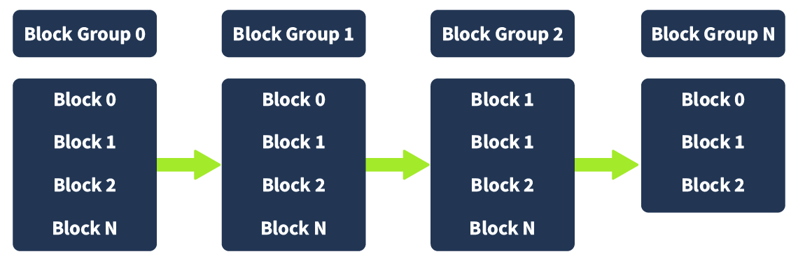

The partition used throughout the room is mounted at `/mnt/ext4_partition` on `/dev/loop0`, verified with:

```bash
sudo lsblk
```

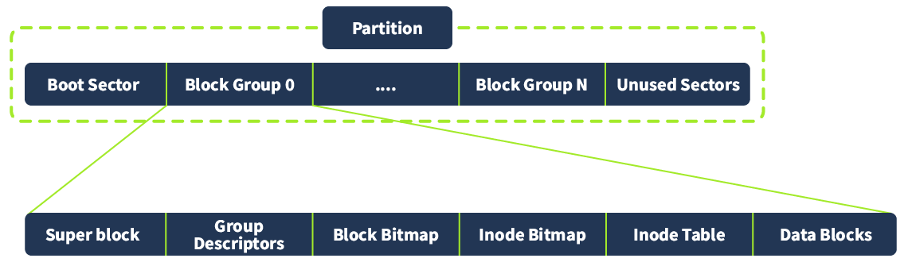

### Superblock Analysis

The superblock is defined in the Linux kernel as `ext4_super_block`. It holds critical file system parameters including block size, inode count, and mount timestamps. The struct begins at offset `0x400` (1024 bytes) on disk.

```c
struct ext4_super_block {
/*00*/  __le32  s_inodes_count;         /* Inodes count */
        __le32  s_blocks_count_lo;      /* Blocks count */
        __le32  s_r_blocks_count_lo;    /* Reserved blocks count */
        __le32  s_free_blocks_count_lo; /* Free blocks count */
/*10*/  __le32  s_free_inodes_count;    /* Free inodes count */
        __le32  s_first_data_block;     /* First Data Block */
        __le32  s_log_block_size;       /* Block size */
        ...
};
```

To inspect the superblock directly on disk:

```bash
sudo dd if=/dev/loop0 bs=1024 count=1 skip=1 | hexdump -C
```

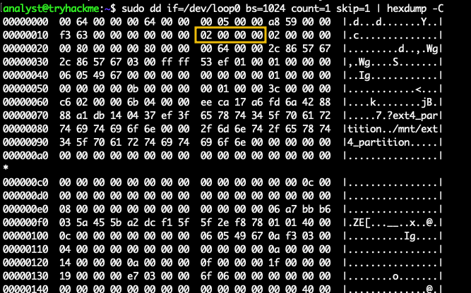

The `s_log_block_size` value is `0x02000000` in little-endian, which resolves to `2`. Block size is calculated as `2^(10 + s_log_block_size)` = `2^12` = **4096 bytes**.

For a human-readable superblock dump:

```bash
sudo dumpe2fs /dev/loop0
```

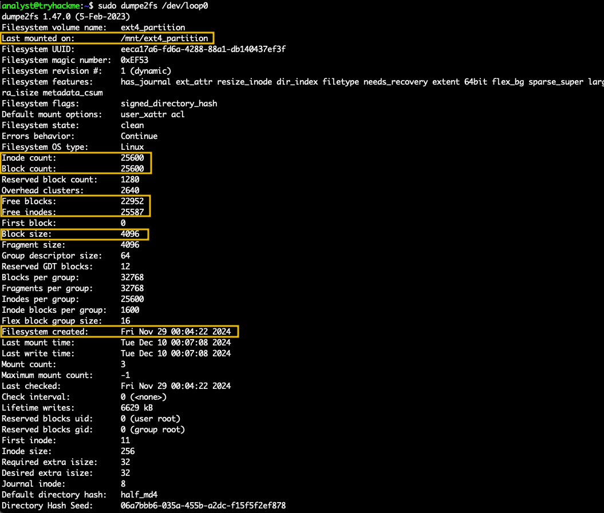

Inodes can be inspected interactively using `debugfs`:

```bash
sudo debugfs /dev/loop0
debugfs: stat .
```

```
Inode: 2   Type: directory    Mode:  0755   Flags: 0x80000
Generation: 0    Version: 0x00000000:00000003
User:     0   Group:     0   Project:     0   Size: 4096
 ctime: 0x675789e1:914449a4 -- Tue Dec 10 00:22:57 2024
 atime: 0x675789e2:9c794070 -- Tue Dec 10 00:22:58 2024
 mtime: 0x675789e1:914449a4 -- Tue Dec 10 00:22:57 2024
crtime: 0x67490506:00000000 -- Fri Nov 29 00:04:22 2024
Inode checksum: 0xdad691c3
```

💡 **Tip:** Inode 2 is always the root directory in EXT file systems. It is a fixed, well-known reference point during triage.

### Questions

**Q: What is the member of the `ext4_super_block` struct that holds the offset value to the first data block?**
```
s_first_data_block
```

**Q: What is the offset where we can find the member `s_blocks_count_lo` in the `ext4_super_block` struct? (decimal format)**
```
4
```

---

## Task 3 — Forensic Artifacts in EXT

### Inode Metadata

Each file and directory is assigned an inode, defined by the `ext4_inode` struct (typically 256 bytes). Key forensic fields include:

| Field | Description |
|-------|-------------|
| `i_mode` | File type and permissions |
| `i_uid` / `i_gid` | Owner and group |
| `i_size_lo` | File size in bytes |
| `i_atime` | Last access time |
| `i_mtime` | Last modification time |
| `i_ctime` | Last metadata change time |
| `i_dtime` | Deletion time |
| `i_crtime` | File creation time (EXT4 only) |
| `i_block` | Pointers to data blocks |

Use `stat` to surface inode metadata for a specific file:

```bash
sudo stat /mnt/ext4_partition/test_file2.txt
```

Then pull the raw inode struct via `debugfs` using the inode number:

```bash
sudo debugfs /dev/loop0
debugfs: stat <11>
```

Changing file permissions updates `ctime` but not `mtime` — this distinction is forensically significant. An attacker modifying permissions leaves a `ctime` trail even if they attempt to hide content changes.

🔴 **Malware relevance:** Malware dropping files to disk will update inode timestamps. Analysts should correlate `crtime` (creation time) against known-good baselines and system event logs to identify unexpected file creation.

### Recovering Deleted Files

EXT4 marks blocks as free in the bitmap when a file is deleted but does not zero the data. Recovery is possible until the blocks are overwritten.

Manual recovery workflow using a known byte pattern:

```bash
# Find the byte offset of the target pattern
sudo strings -t d /dev/loop0 | grep -i "AAAAAAAA"
# Output: 100671488 AAAAAAAA

# Calculate the block number
echo $((100671488 / 4096))
# Output: 24578

# Extract the block
sudo dd if=/dev/loop0 bs=4096 skip=24578 count=1 of=/tmp/recovered_file

# Read the recovered content
cat /tmp/recovered_file
```

💡 **Tip:** `extundelete` automates this process by scanning inodes with a non-zero `i_dtime` field, which EXT4 populates when a file is deleted.

### Questions

**Q: What is the inode number for the file `/etc/passwd` in the VM?**

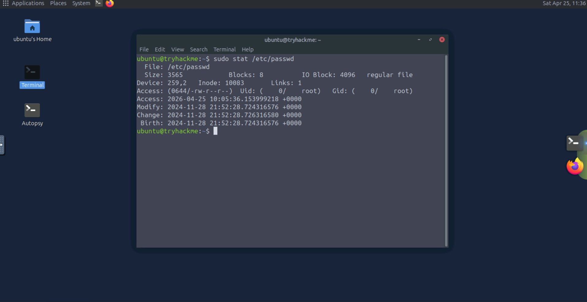

```
10083
```

---

## Task 4 — Analyzing File System Timestamps

### EXT4 Timestamp Types

| Timestamp | Field | Description |
|-----------|-------|-------------|
| Access Time | `atime` | Last time file content was read |
| Modification Time | `mtime` | Last time file content was modified |
| Change Time | `ctime` | Last time file metadata was changed |
| Deletion Time | `dtime` | Time the file was deleted (inode field) |
| Birth Time | `crtime` | Original creation time — EXT4 only |

### Detecting Timestomping

Timestomping is an anti-forensic technique where an attacker manually sets `atime`, `mtime`, and sometimes `ctime` to a fake date — typically to blend a malicious file in with legitimate ones in the same directory.

The detection technique relies on the fact that `ctime` and `crtime` are harder to fake: `ctime` updates on any metadata change, and `crtime` is recorded at inode creation.

Listing files shows the tampered `mtime`:

```bash
ls -l /mnt/ext4_time
```

```
-rw-rw-r-- 1 analyst analyst 22 Jan  5 06:33 normal_file.txt
-rw-rw-r-- 1 analyst analyst 31 Jan  1  2016 timestomped_file.txt
```

Running `stat` on the suspicious file reveals the inconsistency:

```bash
stat timestomped_file.txt
```

```
Access: 2016-01-01 12:00:00.000000000 +0000   ← fake
Modify: 2016-01-01 12:00:00.000000000 +0000   ← fake
Change: 2025-01-05 06:33:55.001578638 +0000   ← real
Birth:  2025-01-05 06:33:42.401109261 +0000   ← real
```

Use `find` with `-newerct` to hunt files by actual `ctime` regardless of displayed `mtime`:

```bash
sudo find /mnt/ext4_time -newerct "2025-01-01" ! -newerct "2025-01-06" -ls
```

This surfaces the timestomped file alongside legitimate files created in the same window.

🔴 **Malware relevance:** Timestomping is explicitly listed in MITRE ATT&CK as T1070.006. On Linux, tools like `touch -t` or direct `utime()` syscalls are used. Always validate `ctime` and `crtime` against displayed timestamps — discrepancies between `mtime` and `ctime` are a reliable indicator.

### Questions

**Q: What is the `btime` for the file `/etc/passwd`?**


```
2024-11-28 21:52:28.724316576
```

---

## Task 5 — Tools for EXT Forensics

### Tool Overview

While CLI tools like `debugfs`, `dumpe2fs`, `stat`, and `extundelete` provide granular control, forensic suites wrap these capabilities into a structured workflow with case management, timelines, and reporting.

Key CLI tools for EXT forensics:

| Tool | Purpose |
|------|---------|
| `debugfs` | Interactive inode and file system inspection |
| `dumpe2fs` | Human-readable superblock and block group dump |
| `extundelete` | Automated deleted file recovery |
| `strings` + `dd` | Manual pattern-based carving |
| `find` | Timestamp-based file hunting |

### Autopsy Workflow

Autopsy is an open-source forensic suite built on The Sleuth Kit. For EXT analysis it provides metadata browsing, deleted file detection, timestamp viewing, and timeline generation through a GUI.

Launch:

```bash
cd /home/ubuntu/autopsy/autopsy-4.21.0/bin
./autopsy --nosplash
```

Case setup flow: **New Case** → set case name and working directory → fill investigator info → **Generate new host name based on data source name** → select **Disk Image or VM File** → load `ext4_case.img`.

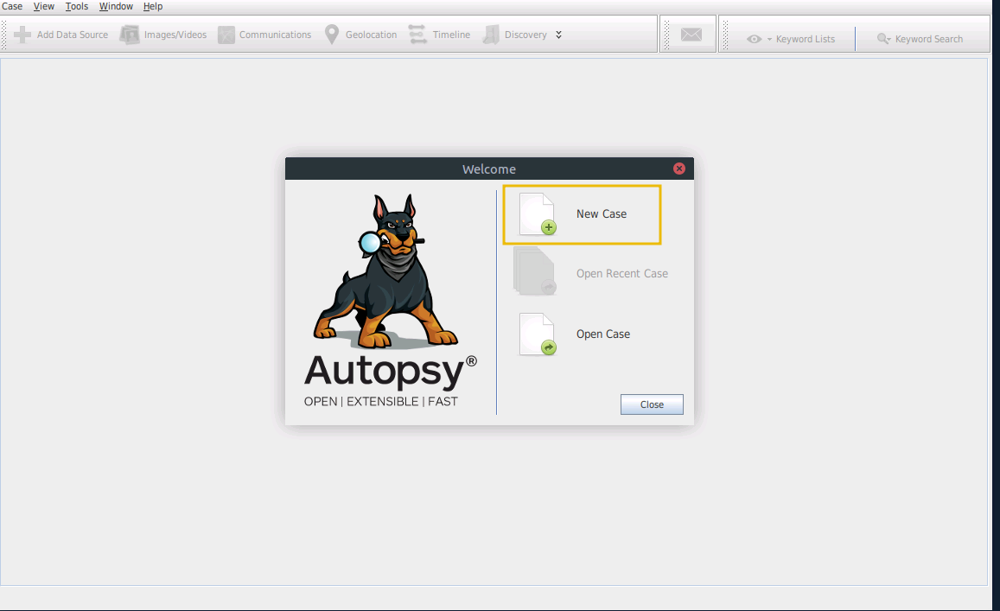

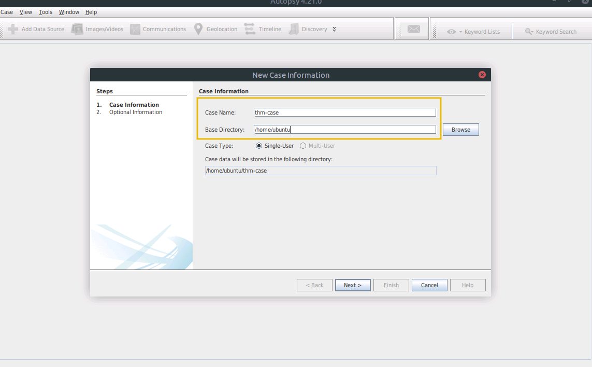

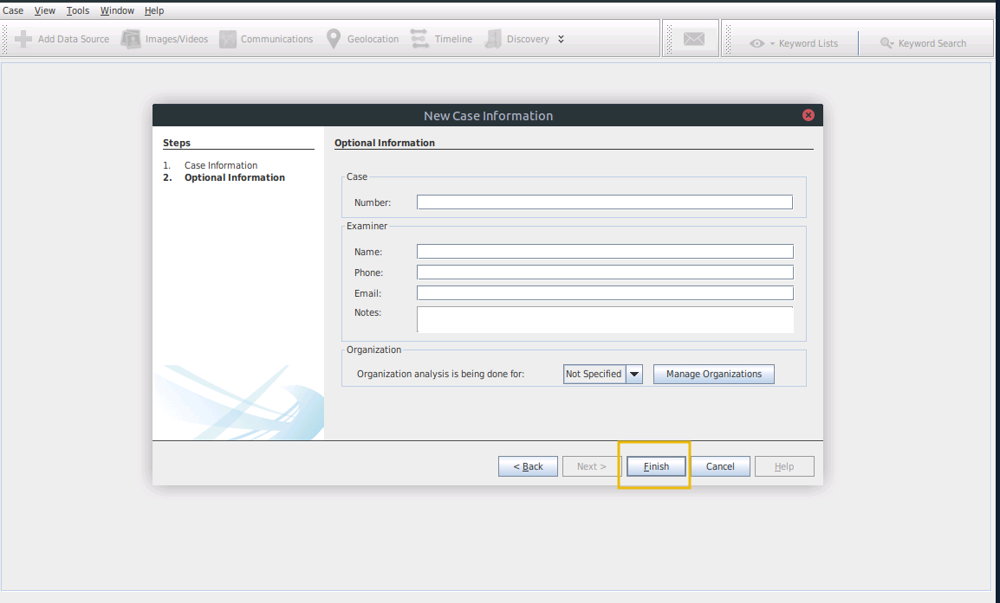

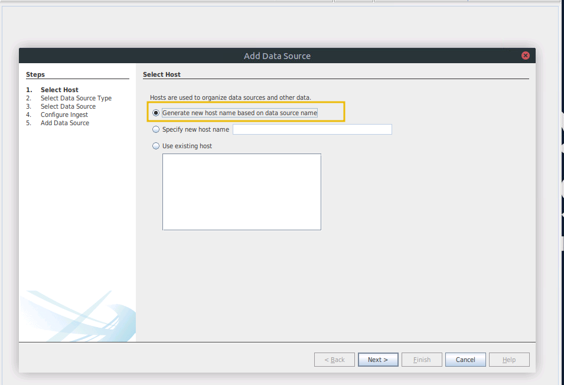

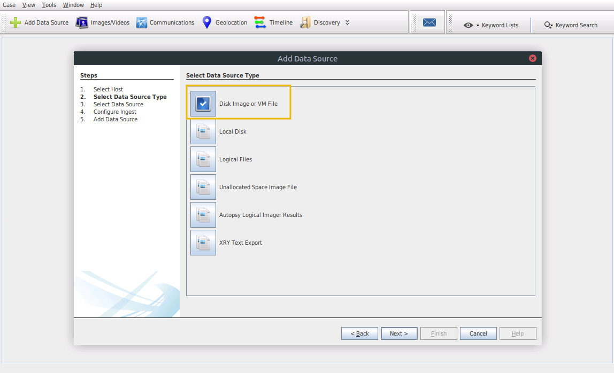

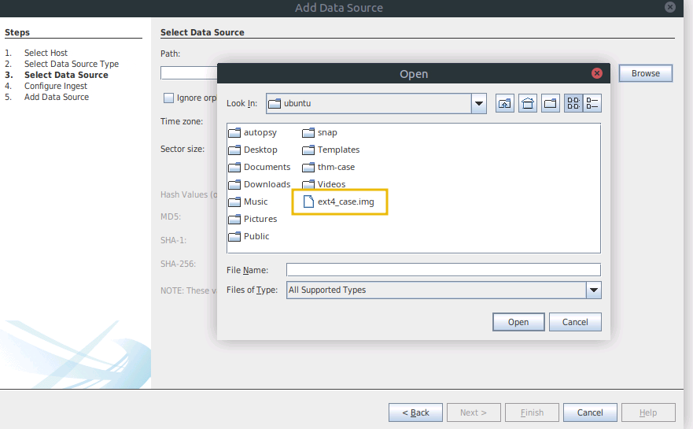

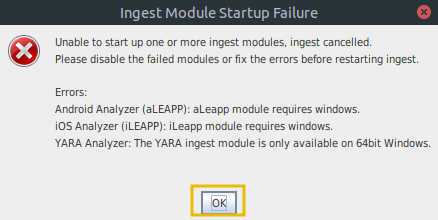

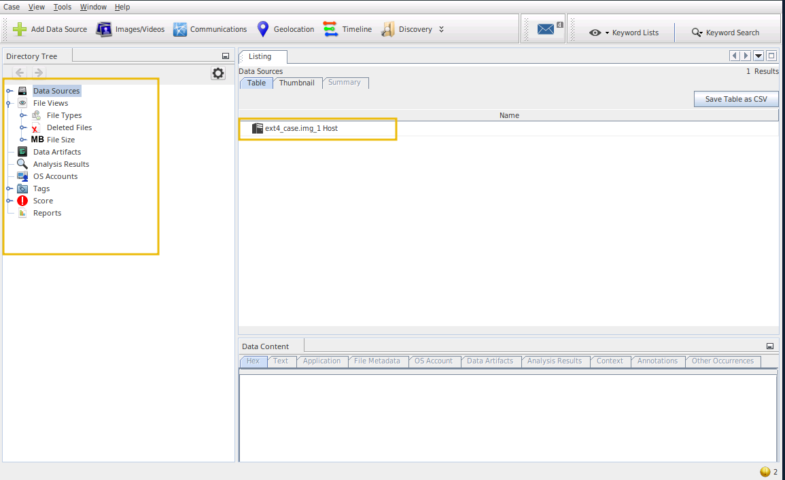

Navigate to `Data Sources > ext4_case.img_1 Host > ext4_case.img` to browse the file system.

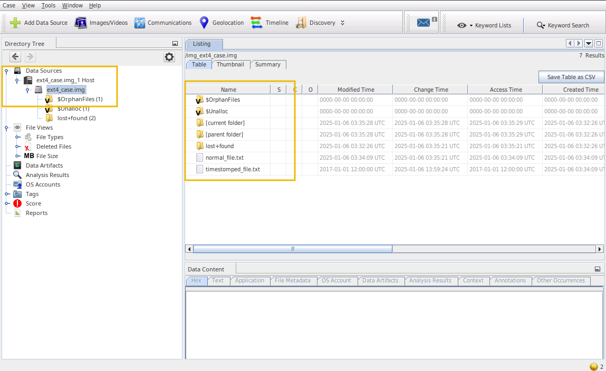

The file listing surfaces `normal_file.txt` and `timestomped_file.txt`. The timestamp anomaly on the timestomped file is immediately visible in the metadata columns.

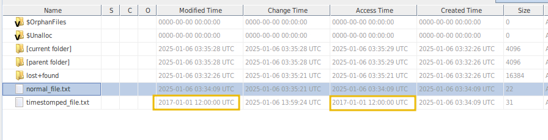

Deleted files are surfaced in their own view — Autopsy parses inode `dtime` values to identify them.

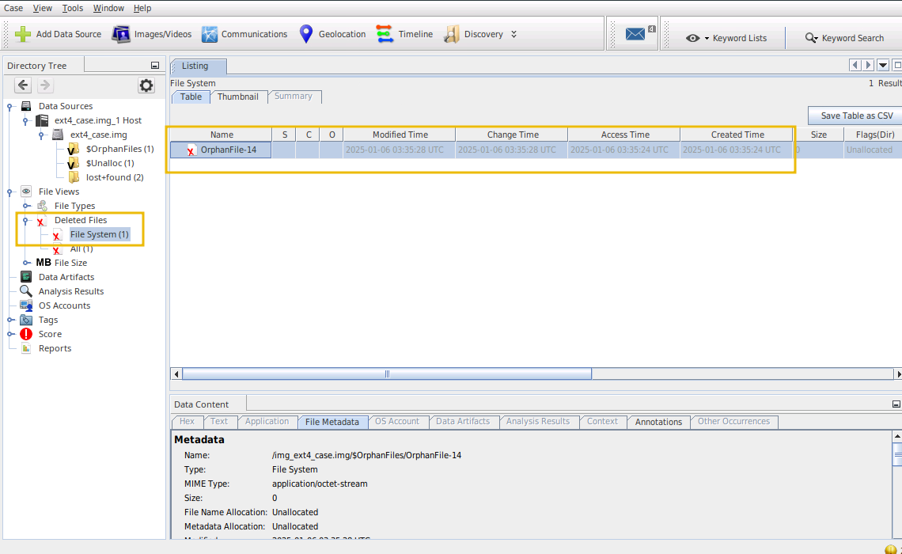

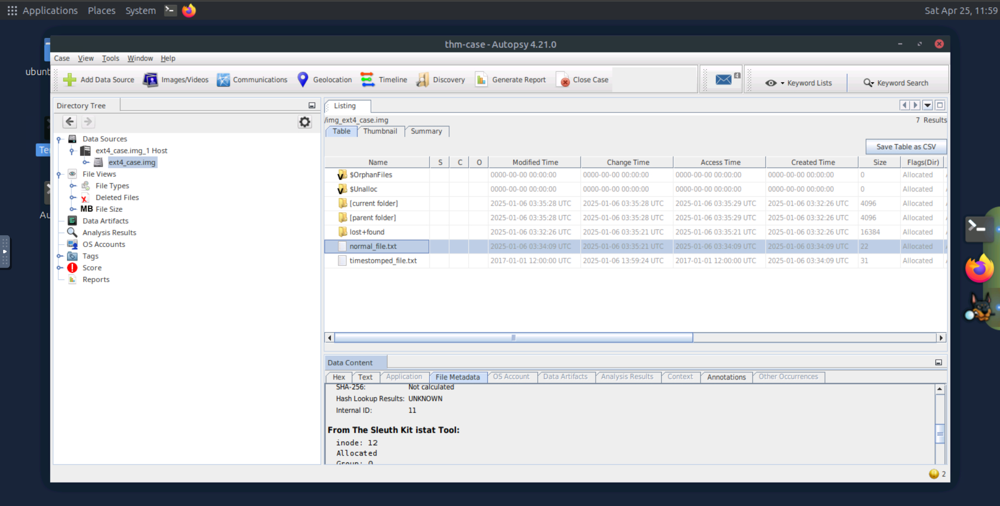

### Questions

**Q: Select `Data Sources > ext4_case.img_1 Host > ext4_case.img` and select the file `normal_file.txt`. What is the inode number of the file?**
```
12
```

**Q: What is the creation time of the file `timestomped.txt`? (Format: YYYY-MM-DD hh:mm:ss)**
```
2025-01-06 03:34:09
```

---

## Task 6 — Practical

Hands-on investigation of the file system mounted at `/mnt/ext_exercises`.

### Timestomped File

Use `stat` on files in `/mnt/ext_exercises` and compare `mtime` against `ctime`/`crtime`. A mismatch between the displayed modification date and the birth/change times confirms timestomping.

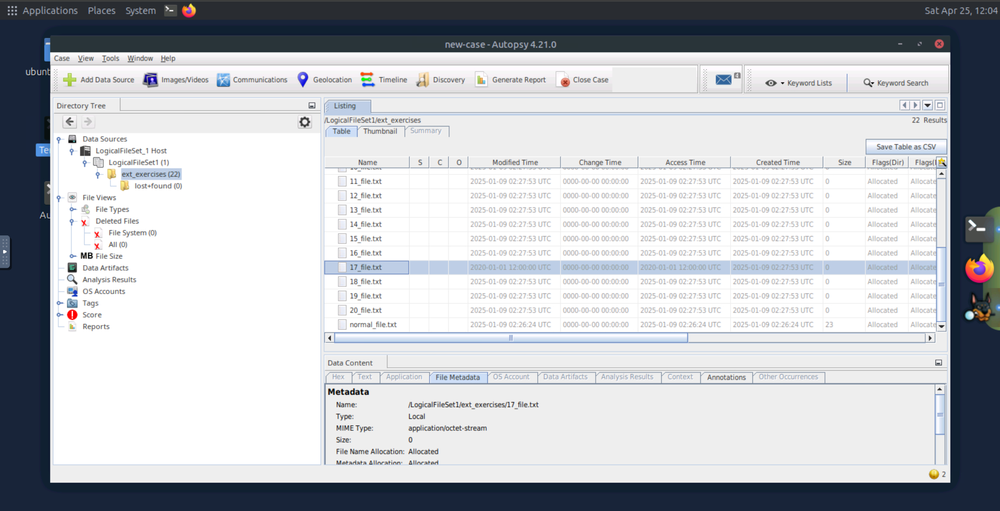

**Q: What is the original creation date of the timestomped file? (Format: YYYY-MM-DD hh:mm:ss)**
```
2025-01-09 02:27:53
```

### Deleted File Recovery

Search the raw device for the known byte pattern `FFFFFFFFFF`:

```bash
sudo strings -t d /dev/loop0 | grep -i "FFFFFFFFFF"
```

Calculate the block offset, extract with `dd`, and read the recovered content.

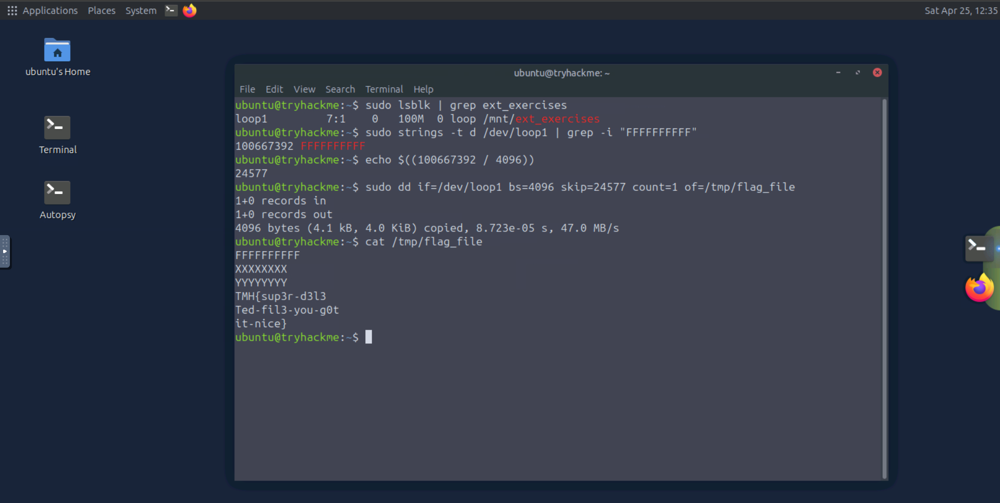

**Q: What is the flag in the deleted file that starts with the characters `FFFFFFFFFF`?**
```
TMH{sup3r-d3l3Ted-fil3-you-g0tit-nice}
```

---

## Task 7 — Conclusion

This room built out the Linux forensics side of the File System Analysis module. The core skills — reading kernel structs directly on disk, using `debugfs` for inode interrogation, detecting timestomping via `ctime`/`crtime` discrepancies, and recovering deleted files through block-level carving — map directly onto real-world Linux incident response workflows.

---

## Key Takeaways

- EXT4 organizes data into **superblocks**, **inodes**, **block groups**, **bitmaps**, and **directory entries** — each a source of forensic evidence
- The `ext4_super_block` and `ext4_inode` structs are readable directly on disk via `hexdump`/`dd`; `debugfs` and `dumpe2fs` provide human-readable access to the same data
- EXT4 tracks five timestamps per file: `atime`, `mtime`, `ctime`, `dtime`, and `crtime` — `ctime` and `crtime` are the hardest for attackers to fake, making them the primary indicators of timestomping
- **Timestomping** (MITRE T1070.006) manipulates `atime` and `mtime` to hide malicious files; `find -newerct` hunts files by `ctime` to bypass the deception
- Deleted files persist in EXT4 until their blocks are overwritten — manual recovery uses `strings -t d` to locate patterns and `dd` to extract the containing block
- `extundelete` and Autopsy automate both deleted file detection (via `i_dtime`) and timestamp analysis at scale
- EXT4's **journaling** (with integrity checksums) means metadata changes are logged — journal analysis can surface events even after file deletion

---

*Write-up by [OPT4RUN](https://tryhackme.com/p/OPT4RUN)*