# FAT32 Analysis

| Field | Details |
|-------|---------|
| **Platform** | TryHackMe |
| **Path** | Advanced Endpoint Investigations |
| **Module** | File System Analysis |
| **Difficulty** | Hard |
| **Category** | Digital Forensics |
| **Room Link** | [tryhackme.com/room/fat32analysis](https://tryhackme.com/room/fat32analysis) |
| **Author** | [OPT4RUN](https://tryhackme.com/p/OPT4RUN) |

---

## Overview

This room covers forensic analysis of the FAT32 filesystem — a filesystem that remains highly relevant in modern investigations due to its widespread use in USB drives, IoT devices, embedded systems, and legacy hardware. Despite being nearly 30 years old, FAT32's lack of permissions, lightweight design, and broad OS compatibility make it a frequent target and tool for threat actors.

The room walks through the full FAT32 filesystem structure (Reserved Area → FAT Area → Data Area), then applies that knowledge against three MITRE ATT&CK defense evasion techniques: hidden files and directories (T1564.001), timestomping (T1070.006), and file deletion/clearing persistence (T1070.004 / T1070.009). The room concludes with a challenge image that integrates all techniques.

Tools used: **HxD** (manual hex analysis) and **Autopsy** (automated forensic analysis).

---

## Task 1 — Introduction

FAT32 forensics focuses on understanding how the filesystem tracks file storage, metadata, deletion markers, and attributes — all of which attackers actively abuse. The room covers:

- FAT32 filesystem structure
- Forensic analysis and data recovery techniques specific to FAT32
- Detection of defense evasion techniques on FAT32 partitions

No questions.

---

## Task 2 — Environment and Setup

The room uses a **Windows Server 2019** VM. All analysis images are located at `C:\FAT32_analysis\`. Tools pre-installed: HxD and Autopsy (allow up to 2 minutes for Autopsy to fully load).

RDP credentials if needed:
- **Username:** `Administrator`
- **Password:** `TryH@cKMe9#21`

No questions.

---

## Task 3 — FAT32: Relevancy in Cyber Security

FAT32 was introduced with Windows 95 SR2 in August 1996. Its continued relevance stems from:

- **Lightweight and compatible** — works across Windows, Linux, macOS, and embedded OSes without drivers
- **No permission system** — unlike NTFS, FAT32 has no ACLs, so any user or process can read/write/execute any file on the volume
- **File size limit:** 4 GB | **Volume size limit:** 2 TB — sufficient for most USB and IoT use cases

### MITRE ATT&CK Techniques Applicable to FAT32

| Technique | Description |
|-----------|-------------|
| T1006 | Direct Volume Access |
| T1564.001 | Hidden Files and Directories |
| T1564.005 | Hide Artifacts: Hidden File System |
| T1070.004 | Indicator Removal: File Deletion |
| T1070.006 | Indicator Removal: Timestomp |
| T1070.009 | Clear Persistence |
| T1027.001 | Binary Padding |

### USB-Based Threat Actor Activity

The task highlights three notable USB-based attacks where FAT32 compatibility was a likely factor:

- **Stuxnet** — Worm targeting Iran's air-gapped nuclear facility via USB. FAT32's broad OS compatibility ensured execution without admin privileges.
- **Mustang Panda** (2024) — Chinese state-sponsored APT reviving USB-based initial access as a primary infection vector.
- **UNC4990** (2024) — Financially motivated threat actor using `.LNK` files on USB drives — a file type commonly associated with FAT32 partitions.
- **Rubber Ducky** — A FAT32-formatted USB that emulates a keyboard for Keystroke Injection attacks, capable of script execution, data exfiltration, and slack space abuse.

**Q: What is the name of the attack that targeted the Iranian nuclear program?**
```
Stuxnet
```

**Q: What category of tactic is MITRE ATT&CK TA0005?**
```
Defense Evasion
```

---

## Task 4 — FAT32 Structure: Reserved and FAT Areas

### FAT32 Structure Overview

A FAT32 volume is divided into three major areas:

```
[ Reserved Area ] → [ FAT Area (FAT1 + FAT2) ] → [ Data Area (Root Dir + Data Region) ]
```

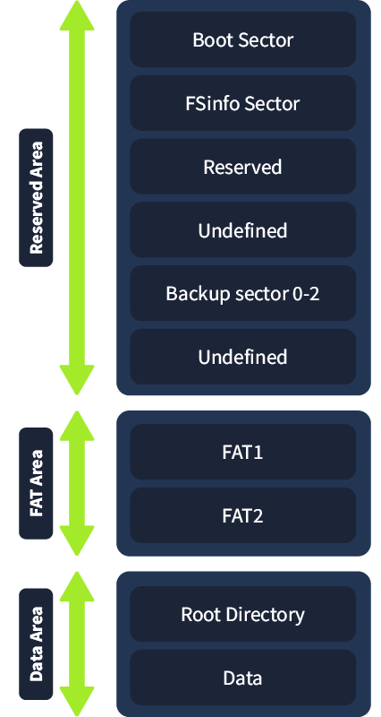

### Reserved Area

The reserved area starts at sector 0 and contains the metadata structures required for the volume to function:

| Sector | Content |
|--------|---------|
| 0 | Boot Sector (Volume Boot Record) |
| 1 | FSInfo Sector |
| 2–5 | Reserved |
| 6 | Backup Boot Sector |
| 7+ | Additional reserved sectors until FAT1 |

### Boot Sector

The boot sector is the forensic analyst's roadmap — it tells you exactly where everything else is. Key fields and their values from the `FAT32_structure.001` image:

| Field | Offset | Value | Meaning |
|-------|--------|-------|---------|
| OEM Name | 0x03–0x0A | `MSDOS5.0` | Formatted using MS-DOS 5.0 tooling |
| Bytes per Sector | 0x0B–0x0C | `0x0200` | 512 bytes per sector |
| Sectors per Cluster | 0x0D | `0x01` | 1 sector per cluster |
| Reserved Sectors | 0x0E–0x0F | `0x187E` → **6270** | FAT1 starts after sector 6270 |
| Number of FATs | 0x10 | `0x02` | FAT1 + FAT2 (backup) |
| Media Descriptor | 0x15 | `0xF8` | Fixed disk |
| Sectors per FAT (Extended) | 0x24–0x27 | `0x000003C1` → **961** | FAT1 and FAT2 are each 961 sectors |
| Cluster Root Directory | 0x2C | `0x00000002` | Root directory starts at cluster 2 |
| Backup Boot Sector | 0x32–0x33 | `0x0006` | Sector 6 |

> 💡 **Tip:** FAT32 uses **Little Endian** byte order (inherited from x86). Always reverse multi-byte fields before converting — `02 00` reads as `0x0002` = 2, not `0x0200` = 512.

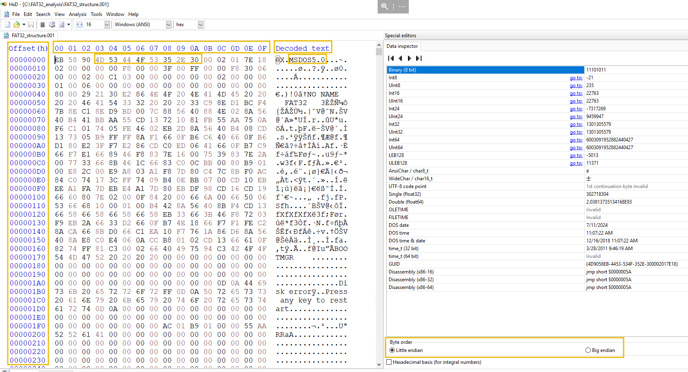

### FAT Area

The **File Allocation Table** tracks cluster allocation across the data region. Each FAT entry is 4 bytes (32 bits), though only 28 bits are used — hence the name FAT**32**.

FAT1 starts immediately after the Reserved Area:
```
FAT1 offset = Reserved Sectors × Sector Size = 6270 × 512 = 3,210,240 = 0x0030FC00
```

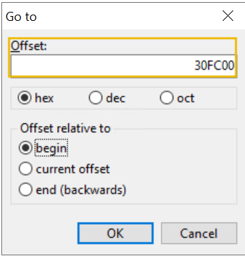

Common FAT entry values:

| Value | Meaning |
|-------|---------|
| `00 00 00 00` | Free cluster |
| `00 00 00 02` – `0F FF FF F6` | Used — next cluster in chain is XX |
| `0F FF FF F7` | Bad cluster |
| `0F FF FF F8` – `0F FF FF FF` | End of File (EOF) |
| `FF FF FF FF` | End of File (simplified, non-standard) |

Example cluster chain from the image (`FAT32_structure.001`):

| Cluster Index | Value (corrected endianness) | Meaning |
|---------------|------------------------------|---------|
| 0 | `0F FF FF F8` | Reserved |
| 1 | `FF FF FF FF` | Reserved |
| 2–6 | `0F FF FF FF` | Single-cluster chains (EOF) |
| 7 | `00 00 00 08` | Points to cluster 8 |
| 8 | `0F FF FF FF` | EOF — chain: clusters 7→8 |
| 9 | `00 00 00 0A` | Points to cluster 10 |
| 10 | `00 00 00 0B` | Points to cluster 11 |
| 11 | `00 00 00 0C` | Points to cluster 12 |
| 12 | `0F FF FF FF` | EOF — chain: clusters 9→10→11→12 |

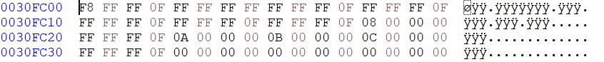

### Locating FAT2

FAT2 (backup) starts immediately after FAT1:
```
FAT2 offset = (Reserved Sectors + Sectors per FAT) × Sector Size
            = (6270 + 961) × 512
            = 7231 × 512
            = 3,702,272
            = 0x00387E00
```

**Q: Hypothetical file B — cluster chain starts at cluster `F`, ends at cluster `10`. What is the FAT entry value at cluster `F` as read in HxD?**

Cluster `0x10` in Little Endian = `10 00 00 00`, which in HxD reads as `10000000`.
```
10000000
```

**Q: At which offset does the FAT2 table start?**
```
00387E00
```

---

## Task 5 — FAT32 Structure: Data Area

### Data Area Overview

The data area contains:
- **Root Directory** — an index of all files and directories, using 32-byte SFN and LFN entries
- **Data Region** — actual file content stored in clusters

The first two cluster indices (0 and 1) are virtual/reserved. The root directory begins at cluster **2** of the data region.

### Long File Name (LFN) Entry

LFN entries store the full file name in UTF-16. A file with a long name may span multiple LFN entries, each identified by a sequence number in byte 0. The first nibble indicates if it's the last entry or a deleted entry; the second nibble is the sequence number.

| Offset | Size | Description |
|--------|------|-------------|
| 0x00 | 1 | Sequence number + flags |
| 0x01 | 10 | First 5 characters (UTF-16) |
| 0x0B | 1 | Attributes (always `0x0F` for LFN) |
| 0x0D | 1 | Checksum of corresponding SFN |
| 0x0E | 12 | Next 6 characters (UTF-16) |
| 0x1C | 4 | Last 2 characters (UTF-16) |

### Short File Name (SFN) Entry

The SFN entry is the core metadata record for a file or directory. Every LFN entry has exactly one corresponding SFN entry.

| Offset | Size | Field | Description |
|--------|------|-------|-------------|
| 0x00 | 11 | File Name | 8.3 format (8 name + 3 extension) |
| 0x0B | 1 | Attributes | READ_ONLY(01) HIDDEN(02) SYSTEM(04) DIRECTORY(10) ARCHIVE(20) |
| 0x0D | 1 | Creation Time (Tenths) | Additional precision in 10ms units |
| 0x0E | 2 | Creation Time | Bits 0–4: seconds/2, 5–10: minutes, 11–15: hours |
| 0x10 | 2 | Creation Date | Bits 0–4: day, 5–8: month, 9–15: years since 1980 |
| 0x12 | 2 | Last Access Date | Date only (no time) |
| 0x14 | 2 | High Word of First Cluster | Combined with Low Word for FAT32 cluster address |
| 0x16 | 2 | Last Modification Time | Same bit layout as Creation Time |
| 0x18 | 2 | Last Modification Date | Same bit layout as Creation Date |
| 0x1A | 2 | Low Word of First Cluster | Combined with High Word for cluster address |
| 0x1C | 4 | File Size | In bytes |

### Example — `about_THM.txt`

LFN at `0x00400100` → name decoded as: `about_THM.txt`
Corresponding SFN at `0x00400120`:

| Field | Value | Meaning |
|-------|-------|---------|
| Short Name | `ABOUT_~1TXT` | Truncated 8.3 format |
| Attributes | `0x20` | ARCHIVE |
| Creation Time | `F4 84` | 16:39:40 |
| Creation Date | `83 59` | 2024-12-03 |
| First Cluster | `0x0007` | Cluster 7 |
| File Size | `0x0222` | 546 bytes |

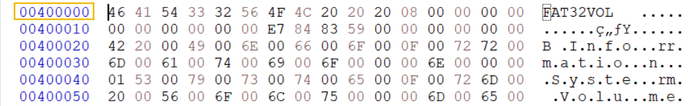

To find the file at cluster 9, locate the root directory SFN entry where the Low Word of First Cluster reads `09 00`. The first 11 bytes give the filename.

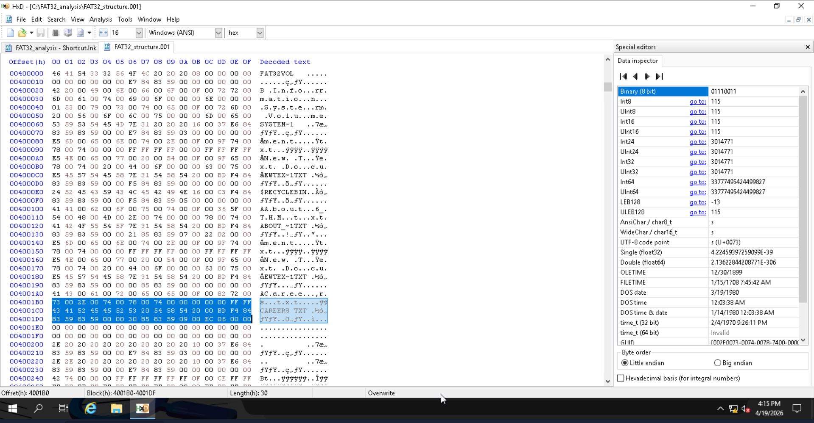

**Q: What is the filename of the file that starts at cluster 9?**
```
careers.txt
```

**Q: What is the creation time of the file that starts at cluster 9? (Hexadecimal value of the Creation Time field)**
```
F484
```

---

## Task 6 — FAT32: Analysis Techniques and Tools

### Filesystem Integrity and Structural Analysis

| Technique | FAT32 Fields | Purpose |
|-----------|-------------|---------|
| Cluster Chain Analysis | FAT, Root Directory | Reconstruct fragmented files, detect allocation anomalies |
| Directory Structure and File Name Analysis | Directory Entries (Name, Attributes, First Cluster) | Find hidden or deleted files |
| Volume Serial Number and Boot Sector Analysis | Boot Sector (BPB), Volume Metadata | Detect tampering or inconsistencies in volume metadata |
| FAT Table Corruption/Manipulation Analysis | FAT, Backup FAT, Root Directory | Compare FAT1 vs FAT2 for discrepancies |
| System Volume Information Analysis | Reserved Metadata, Root Directory | Windows-specific activity or tampering evidence |
| Corruption and Tampering Detection | FAT, Boot Sector, Directory Entries | Verify filesystem structural integrity |

### Data Recovery and Content Analysis

| Technique | FAT32 Fields | Purpose |
|-----------|-------------|---------|
| File Carving | Unallocated Clusters, Data Area | Recover files by header/footer signatures |
| Slack Space Analysis | Data Clusters, Directory Entries | Find residual or hidden data in cluster slack space |
| Deleted File Recovery | Directory Entries (Status Byte, First Cluster), FAT | Recover files marked with `0xE5` deletion marker |
| Keyword and Pattern Search | Unallocated Clusters, Data Area | Search for IOCs across allocated and unallocated space |
| Timeline Analysis | Last Access Date, Creation Date/Time, Last Modified Date/Time | Build file activity timeline from directory entry timestamps |

**Q: Which analysis technique can we use to look for hidden files and directories?**
```
Directory Structure and File Name Analysis
```

---

## Task 7 — T1564.001: Hidden Files and Directories

Attackers set files and directories as hidden on FAT32 to evade casual detection. Because FAT32 has no permission system, the `Hidden` attribute can be set or cleared by any process — no admin rights required. A standard user with default OS settings won't see hidden entries when browsing the volume.

The relevant SFN attribute byte (offset `0x0B`) values:

| Value | Meaning |
|-------|---------|
| `0x01` | READ_ONLY |
| `0x02` | HIDDEN |
| `0x04` | SYSTEM |
| `0x10` | DIRECTORY |
| `0x20` | ARCHIVE |

Attributes combine additively — `0x13` = READ_ONLY + HIDDEN + DIRECTORY.

### Manual Analysis — `FAT32_HIDDEN.001`

Navigate to the root directory at offset `0x00400000`. The root directory entries are split across multiple non-contiguous clusters — always check the FAT to determine if the root directory spans multiple clusters before concluding analysis.

**Hidden Directory: `M@LL0V3`**

SFN entry at `0x004000A0`:

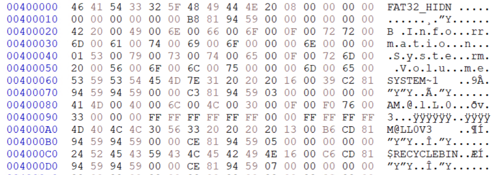

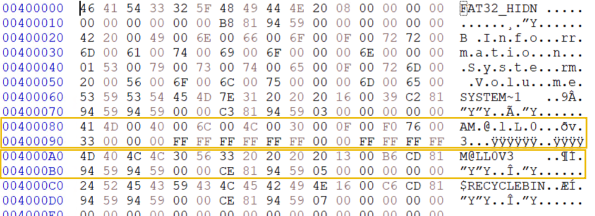

| Field | Value | Meaning |
|-------|-------|---------|
| File Name | `4D 40 4C 4C 30 56 33 20` | `M@LL0V3` |
| Attributes | `0x13` | READ_ONLY + HIDDEN + DIRECTORY |
| Creation Date | `94 59` | 2024-12-20 |
| First Cluster | `05 00` | Cluster 5 (actual: 3, subtract 2 virtual clusters) |
| File Size | `00 00 00 00` | 0 bytes — confirms this is a directory |

**Hidden File: `BeMyValent1ne.txt`**

SFN entry at `0x00400680`:

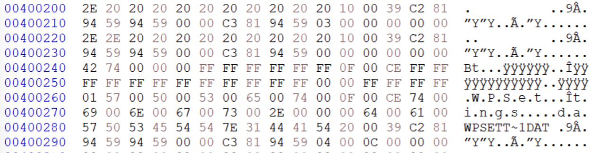

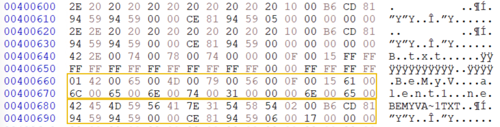

| Field | Value | Meaning |
|-------|-------|---------|
| Short Name | `BEMYVA~1.TXT` | Truncated from `BeMyValent1ne.txt` |
| Attributes | `0x02` | HIDDEN |
| Creation Date | `94 59` | 2024-12-20 |
| Last Modified | `CE 81` | 16:14:28 |
| First Cluster | `06 00` | Cluster 6 (actual: 4) |
| File Size | `17 00 00 00` | 23 bytes |

### Automated Analysis — Autopsy

Load `FAT32_HIDDEN.001` as a new case in Autopsy. Under **Data Sources → FAT32_HIDDEN.001_1 Host → FAT32_HIDDEN.001**, the directory tree will show the `M@lL0v3` directory and its contents.

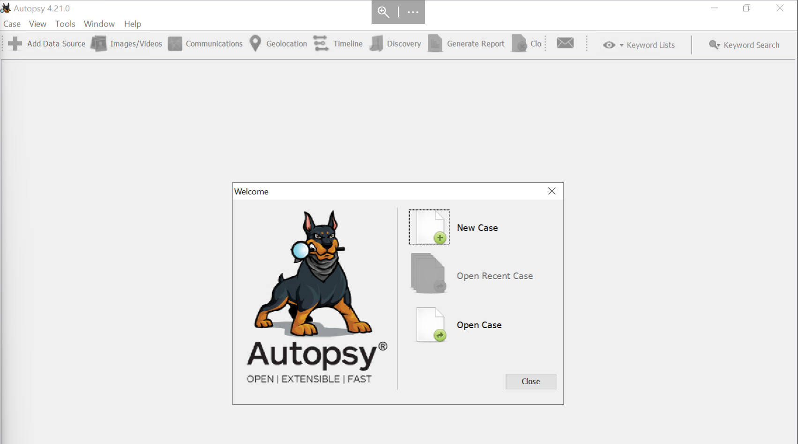

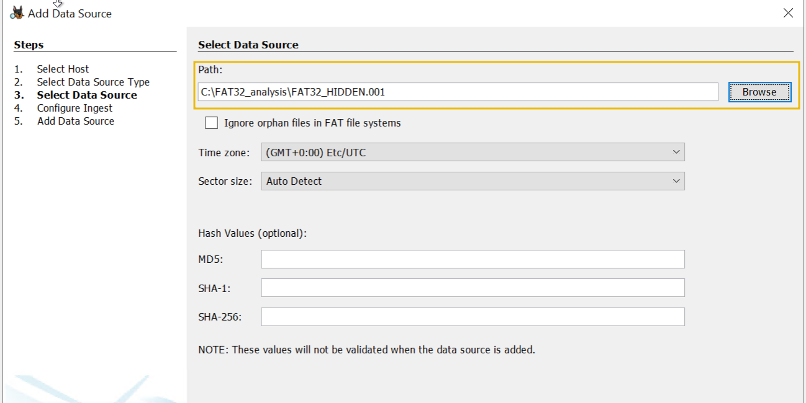

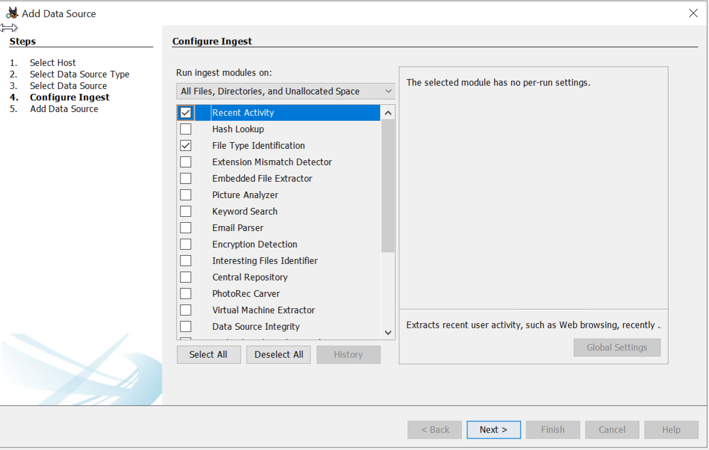

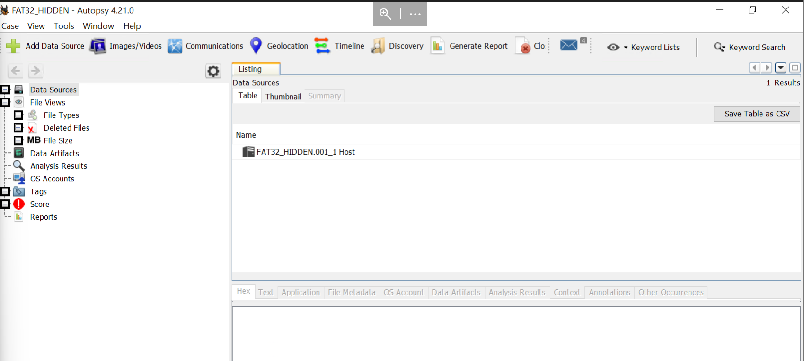

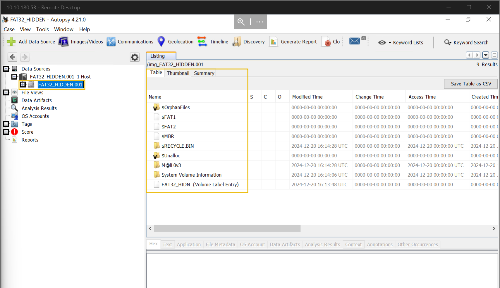

Clicking the `M@lL0v3` directory reveals its metadata in the lower panel:

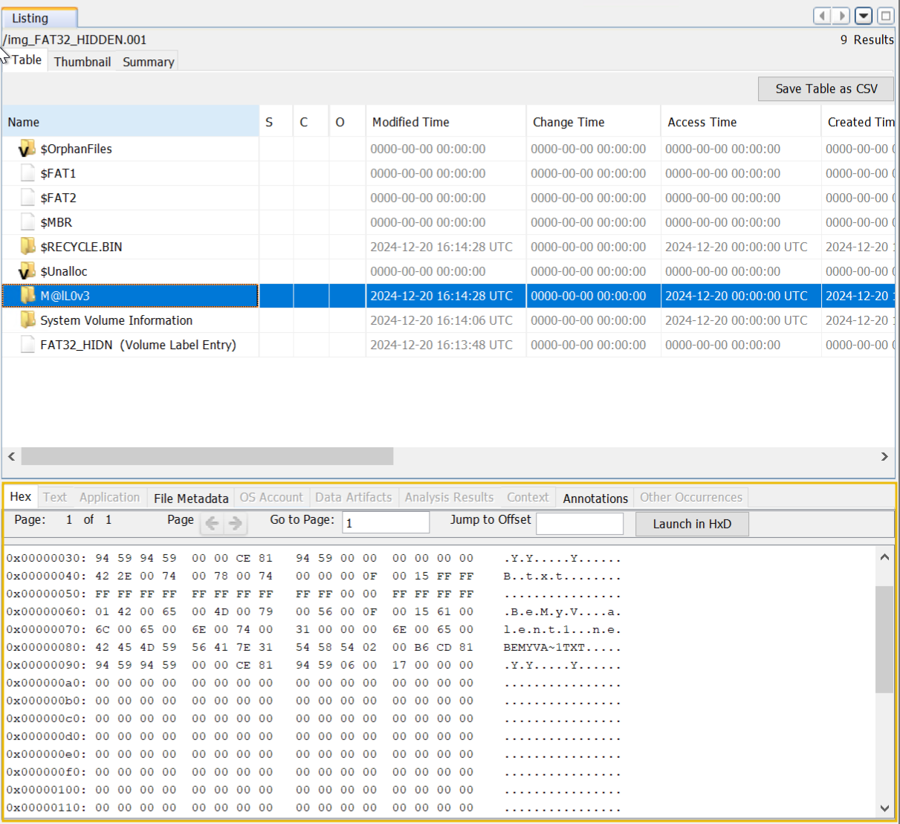

The **File Metadata** tab (under the Sleuth Kit istat output) confirms:
- Attributes: **Directory, Read Only, Hidden**
- Located at sector **8195** → offset: `8195 × 512 = 4,195,840 = 0x00400600`

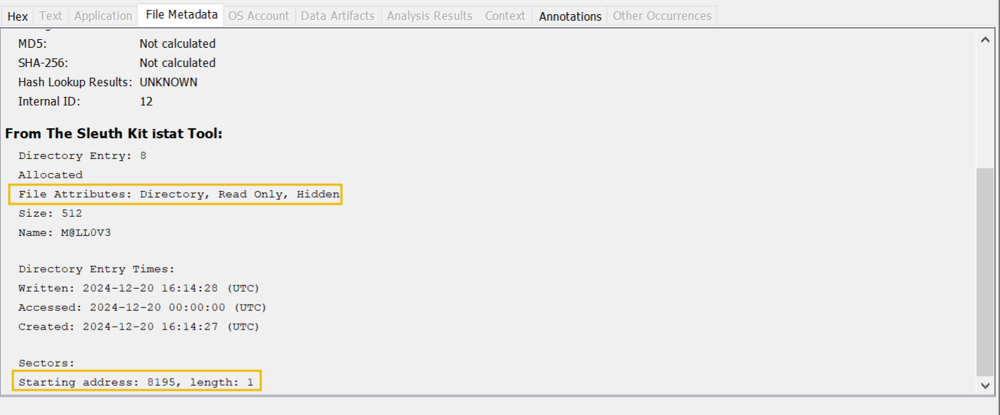

Navigating into `M@lL0v3` shows `BeMyValent1ne.txt`. The file's **Text** tab reveals the flag.

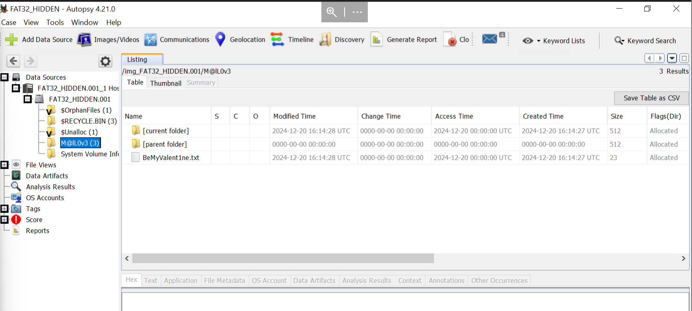

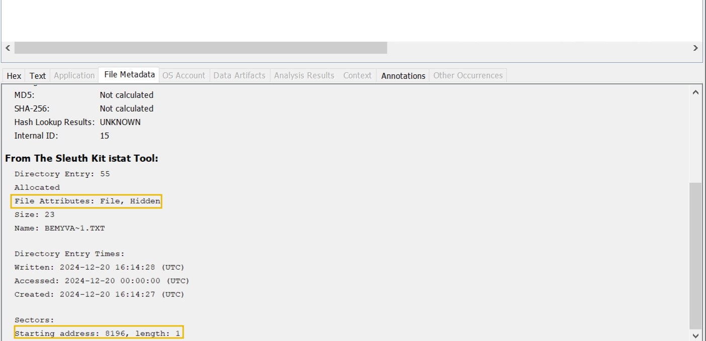

**Q: What is the short file name of the hidden file in the M@lL0v3 directory?**

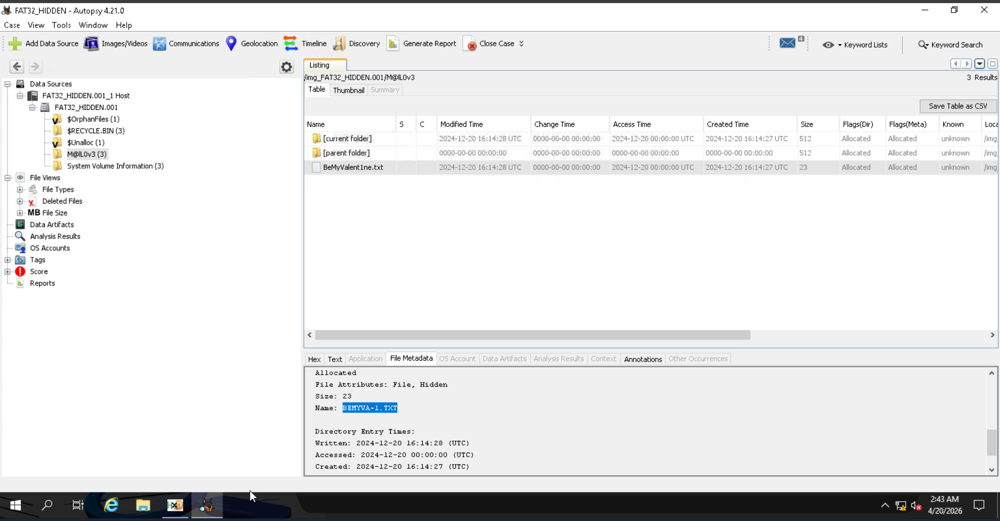

```
BEMYVA~1
```

**Q: What is the flag found during automated analysis?**

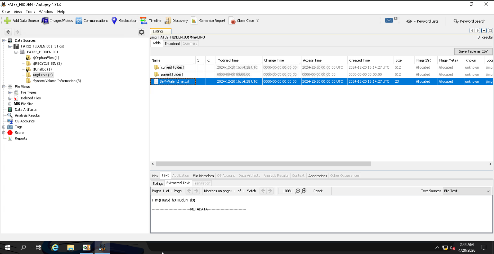

```
THM{F0uNdTh3H!Dd3nF1l3}
```

---

## Task 8 — T1070.006: Indicator Removal: Timestomp

Attackers alter file timestamps to blend malicious files into the surrounding filesystem noise or to break timeline-based detection. FAT32 stores four timestamp values per file: **Creation Time**, **Creation Date**, **Last Modification Time/Date**, and **Last Access Date**. Unlike NTFS, FAT32 has no journaling — there's no built-in change log to cross-reference. Detection therefore relies on:

- Cross-referencing with external log sources (Windows Event Logs, SIEM)
- Timeline inconsistencies — e.g., creation timestamp is *later* than modification timestamp, or accessed timestamp predates creation
- Identifying timestamp manipulation tools (e.g., `timestamp.exe`)

### Manual Analysis — `FAT32_TIMESTOMP.001`

Extracting timestamps from all SFN entries in the root directory:

| Filename | Modified Date | Modified Time | Last Access Date | Creation Date | Creation Time |
|----------|--------------|---------------|-----------------|--------------|---------------|
| [current folder] | 2024-11-27 | 17:02:30 | 2025-01-07 | 2025-01-07 | 10:38:50 |
| _EWCOM~1.ZIP | 2025-01-07 | 10:39:26 | 2025-01-07 | 2025-01-07 | 10:39:25 |
| changelog.txt | 2021-01-10 | 16:06:00 | 2025-01-07 | 2025-01-07 | 10:38:50 |
| HxD.exe | 2021-02-10 | 22:20:12 | 2025-01-07 | 2025-01-07 | 10:38:50 |
| **install.txt** | **2021-01-10** | **16:04:00** | **2018-01-10** | **2025-01-07** | **10:39:33** |
| license.txt | 2021-01-10 | 16:03:02 | 2025-01-07 | 2025-01-07 | 10:38:50 |
| readme.txt | 2021-01-10 | 16:06:56 | 2025-01-07 | 2025-01-07 | 10:38:50 |
| unins000.dat | 2024-11-27 | 17:02:32 | 2025-01-07 | 2025-01-07 | 10:38:50 |

**Anomaly:** `install.txt` has a **Last Access Date of 2018-01-10** — three years before the file was modified in 2021 and seven years before it was created. A last access timestamp that predates creation is not possible under normal conditions and is a strong indicator of timestomping.

> 🔴 **Malware relevance:** When files are copied from one location to another (e.g., from a USB to a host), Windows preserves the *Modified* timestamp but updates *Created* and *Accessed*. This means a modified timestamp older than creation is often expected and not suspicious. The anomaly to look for is *Access* or *Modify* timestamps that are **earlier** than *Created*, or timestamps that exist in isolation without a matching creation event.

### Automated Analysis — Autopsy Timeline

Load `FAT32_TIMESTOMP.001` in Autopsy. Open **Timeline** from the toolbar.

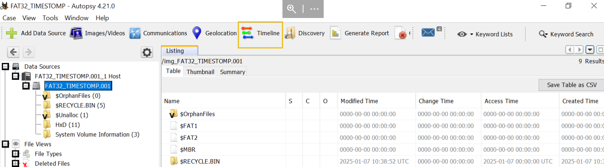

Set the date range and switch Scale to **Linear** to clearly compare event frequency per year:

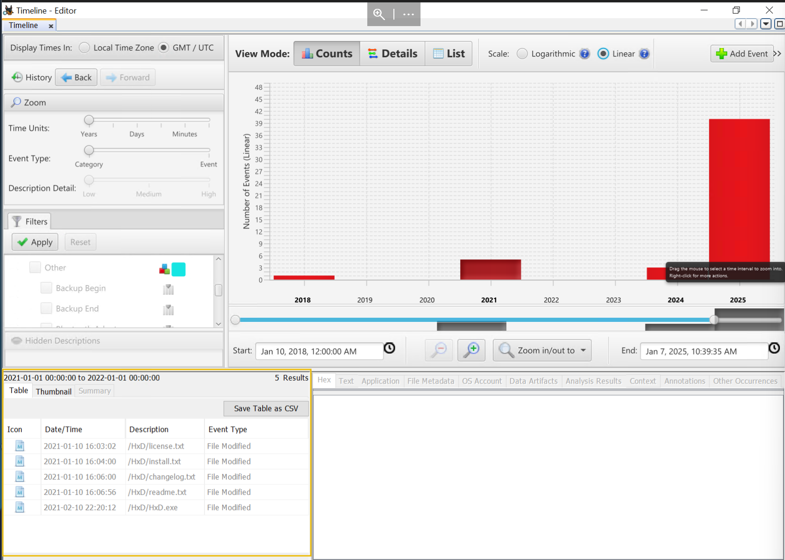

Events cluster around 2021 (file modifications) and 2025 (creation/access on copy). The isolated 2018 bar is immediately visible and worth drilling into.


Clicking the 2018 bar shows a single **File Accessed** event for `install.txt` with no prior creation event — confirming the anomaly found in manual analysis.

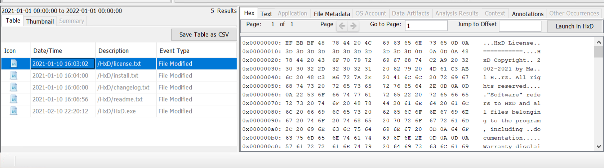

**Q: What is the `Accessed` timestamp of the discovered suspicious file?**

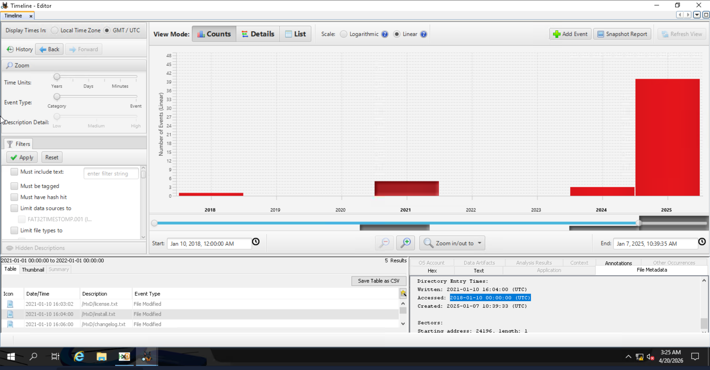

```
2018-01-10 00:00:00
```

**Q: What is the flag found during the automated analysis?**

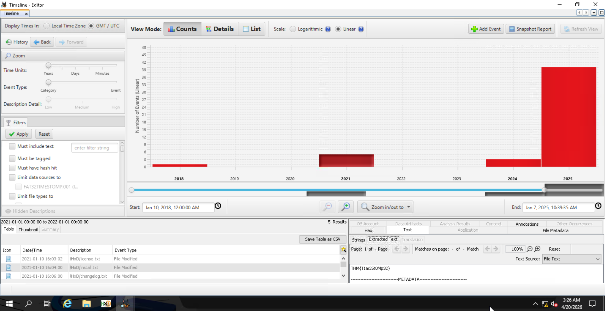

```
THM{T1m3St0Mp3D}
```

---

## Task 9 — T1070.004 File Deletion & T1070.009 Clear Persistence

When a file is deleted on a FAT32 partition, the OS does **not** zero out the file's data clusters. Instead, it:
1. Replaces the first byte of the SFN entry with `0xE5` (deletion marker)
2. Marks the corresponding FAT cluster entries as free (`0x00000000`)

The file's content remains on disk until those clusters are overwritten by new data. This is the basis for deleted file recovery.

> 🔴 **Malware relevance:** Attackers delete persistence mechanisms (scheduled tasks, startup scripts, malicious binaries) to cover their tracks after an operation. Recovery of deleted files can expose the full attack chain — scripts, payloads, and C2 configurations — even after the attacker believes they've cleaned up.

### Manual Analysis — `FAT32_DELETED.001`

Scanning all SFN entries in the root directory (including the non-contiguous continuation at offset `0x00401E00`, located via the FAT entry for the root directory pointing to cluster 17):

The deleted entries are identified by the `0xE5` first byte:

| Entry | First Byte | Notes |
|-------|-----------|-------|
| `?.1` (LFN) | `E5` | Deleted LFN entry |
| `Cstrikepers.ps1` (LFN) | `E5` | Deleted LFN — full name: `CstrikePers.ps1` |
| `STRIKE~1.PS1` (SFN) | `E5` | Deleted SFN — corresponding to above LFN |

SFN entry analysis for `STRIKE~1.PS1`:

| Field | Value | Meaning |
|-------|-------|---------|
| File Name | `E5 53 54 52 49 4B 7E 31 50 53 31` | `_STRIKE~1.PS1` (E5 = deleted) |
| Attributes | `0x20` | ARCHIVE |
| Creation Date | `29 5A` | 2025-01-09 |
| First Cluster | `0x001C` | Cluster 28 → offset `0x00403400` |
| File Size | `0xEC` | 492 bytes |

Navigating to `0x00403400` recovers the complete PowerShell script content:

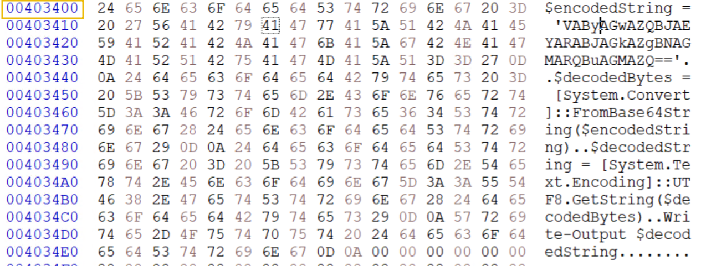

Executing the recovered script in a sandboxed PowerShell window produces the flag.

### Automated Analysis — Autopsy

Load `FAT32_DELETED.001` in Autopsy. Deleted files are shown in the listing view with a distinct icon. The deleted `CstrikePers.ps1` file appears directly in the root of the image.

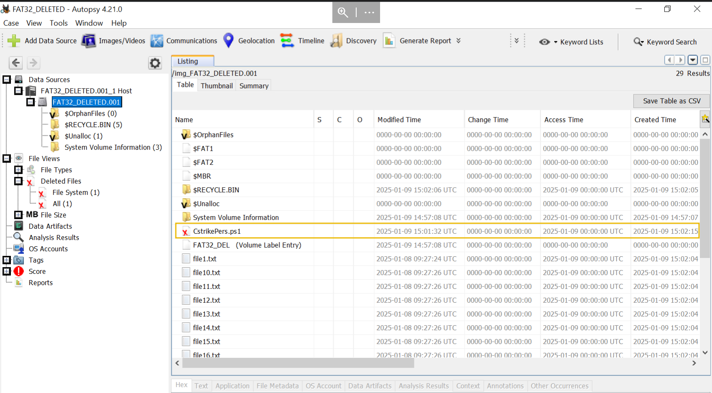

Right-click → **Extract File(s)** to recover the file for execution or further analysis:

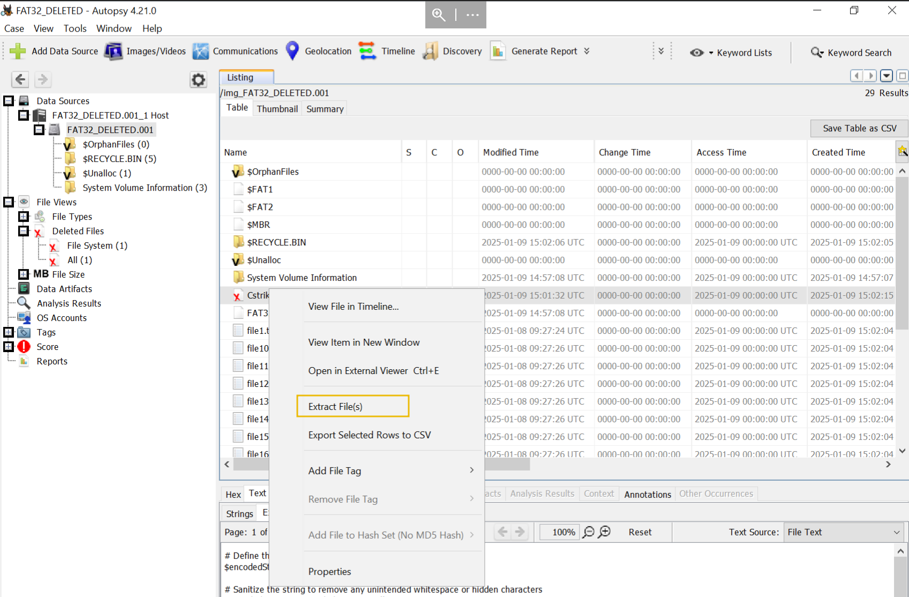

The `$RECYCLE.BIN` directory also contains the LFN and SFN entries for `CstrikePers.ps1`, confirming the deletion path.

**Q: Which hexadecimal sequence identifies a deleted file?**
```
E5
```

**Q: What is the output of the deleted PowerShell script after executing it?**

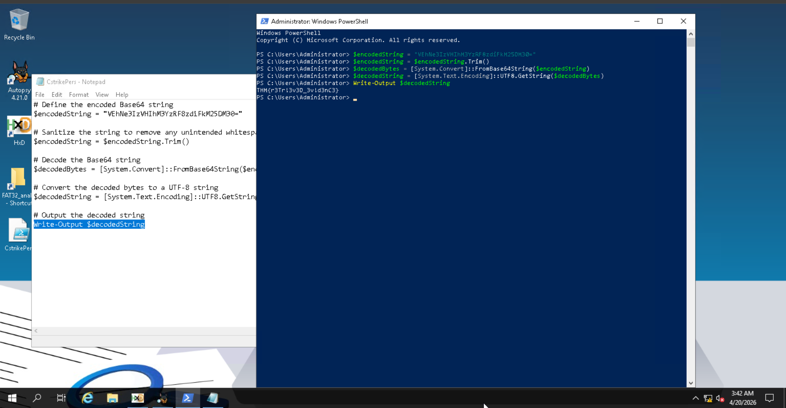

```
THM{r3Tr!3v3D_3v!d3nC3}
```

---

## Task 10 — Challenge

Full investigation of `FAT32_CHALLENGE.001` using all techniques covered in the room.

**Q: At which offset does the FAT1 table begin?**

Reserved sectors = 4222. FAT1 offset = `4222 × 512 = 2,161,664 = 0x0020FC00`.

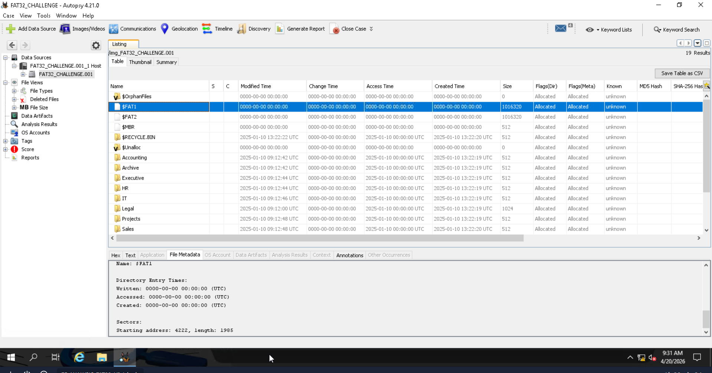

```
0020FC00
```

**Q: What is the name of the hidden directory on the image? (Excluding System Volume Information and Recycle Bin)**

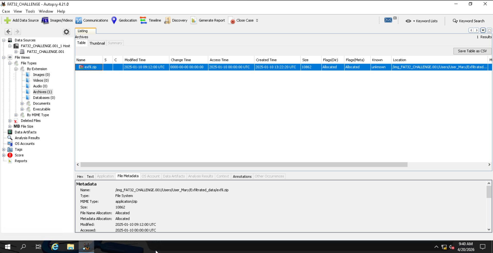

```
Exfiltrated_data
```

**Q: What is the flag found in the hidden directory?**

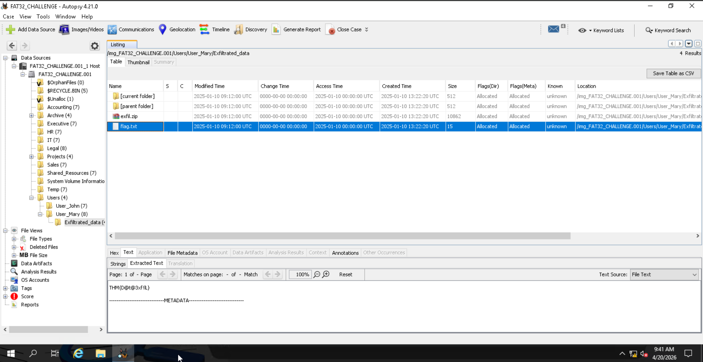

```
THM{D@t@3xf!lL}
```

**Q: What is the size (bytes) of the archive file in the hidden directory?**

Visible in the Autopsy listing for the hidden directory (same screenshot as above):

```
10862
```

**Q: What is the name of the deleted file that is present on the image?**

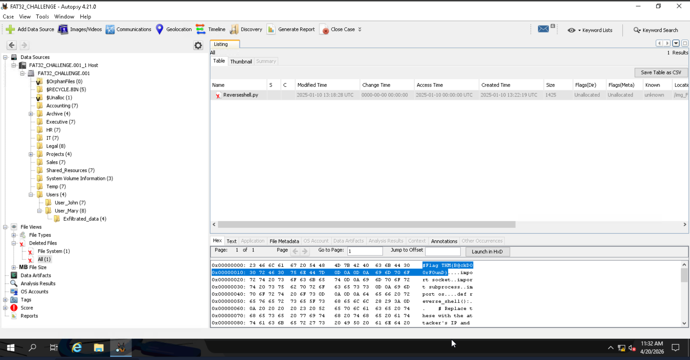

```
Reverseshell.py
```

**Q: What is the flag included in the deleted file?**

```
THM{B@ckD00rF0unD}
```

**Q: What is the name of the file that has suspicious timestamp(s)?**

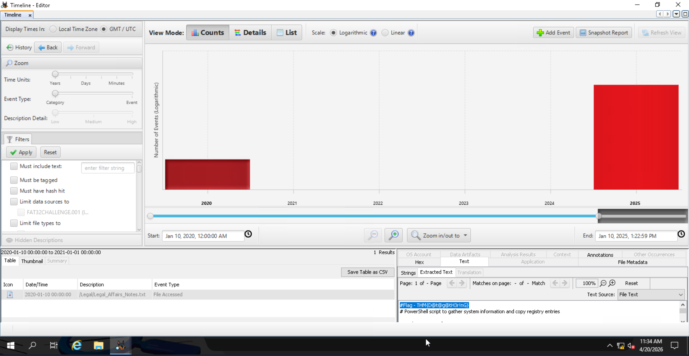

```
Legal_Affairs_Notes.txt
```

**Q: What is the flag included in the file with suspicious timestamps?**

```
THM{D@t@g@tH3r!nG}
```

---

## Task 11 — Conclusion

No questions.

---

## Key Takeaways

- **FAT32 is still forensically relevant** — its ubiquity in USB drives, IoT, and embedded systems means it frequently appears in investigations, even in 2025.
- **No permissions = no barrier for attackers** — FAT32's lack of ACLs makes it trivial for any process to set files as hidden, modify timestamps, or delete entries without elevation.
- **Deletion ≠ erasure** — the `0xE5` marker only removes the directory entry reference. Data persists in clusters until overwritten, making recovery straightforward with tools like Autopsy or manual HxD analysis.
- **Timestomping leaves logical inconsistencies** — a `Last Access` timestamp predating `Creation` is physically impossible under normal conditions and is a reliable anomaly to hunt for.
- **Boot sector is the forensic roadmap** — Reserved Sectors and Sectors per FAT values from the BPB are the only inputs needed to calculate the exact offsets of FAT1, FAT2, and the data area.
- **Manual HxD analysis builds deep understanding** but is slow and error-prone at scale — Autopsy's Timeline feature is essential for efficient timestamp anomaly detection in real investigations.
- **FAT32 maps directly to MITRE ATT&CK TA0005** — most abuse techniques (hidden files, timestomping, file deletion) are defense evasion sub-techniques applicable to any FAT32-formatted media used as an attack vector.

---

*Write-up by [OPT4RUN](https://tryhackme.com/p/OPT4RUN)*