# File Carving

| Field | Details |
|-------|---------|
| **Room** | File Carving |
| **Platform** | TryHackMe |
| **Path** | Advanced Endpoint Investigations |
| **Module** | File System Analysis |
| **Difficulty** | Medium |
| **Category** | Digital Forensics |
| **Room Link** | [tryhackme.com/room/filecarving](https://tryhackme.com/room/filecarving) |
| **Author** | [OPT4RUN](https://tryhackme.com/p/OPT4RUN) |

---

## Overview

File carving is the technique of extracting files from raw storage media based purely on file structure and content — no file system metadata required. This room covers the full spectrum of carving: from understanding magic bytes and file signatures, to hands-on manual carving with a hex editor, to automated recovery using **Foremost** and **Scalpel**. The scenarios are grounded in a corporate forensics investigation, making the exercises directly applicable to real-world incident response and digital forensics workflows.

🔴 **Malware relevance:** Threat actors routinely delete, wipe, or conceal files to destroy evidence. File carving is one of the primary techniques used to recover artefacts from compromised hosts, even after deliberate anti-forensic actions.

---

## Task 1 — Introduction

The room is framed around a corporate acquisition scenario. **IntegriTech Inc.** has acquired **DataSyncTHM Solutions** and suspects the R&D department intentionally mishandled proprietary data during the transition — including deliberate file deletion, data hiding in slack space, and unconventional storage practices. As the forensic investigator, all tasks feed into this investigation narrative.

**Learning objectives:**
- Recap file system structures and identify file signatures
- Understand the role of file carving in forensic investigations
- Perform manual and automated file carving from identified signatures
- Recover files from slack space, deleted partitions, and formatted drives

**Q: I am ready to embark on a file carving quest.**
```
No answer needed
```

---

## Task 2 — Basis of File Carving

### File Systems Recap

File carving operates across all file system types, but the underlying structure of each affects recovery complexity:

| File System | OS | Key Structure | Forensic Relevance |
|-------------|-----|--------------|-------------------|
| FAT32 | Windows | Boot sector, FAT, data region | Simple structure; deleted entries persist until overwritten |
| NTFS | Windows | MFT, data runs, system files ($MFT, $DATA) | MFT entries often survive deletion; data runs reveal file locations |
| ext2/3/4 | Linux | Inodes, blocks, indirect references | Inode metadata survives deletion; blocks persist in unallocated space |

### File Headers and Footers (Magic Bytes)

Every file type begins with a known byte sequence — the **file header** (also called magic bytes) — and often ends with a **footer**. File carving tools scan raw storage for these patterns to reconstruct files without any file system assistance.

| File Type | Header (Hex) | Footer (Hex) | Notes |
|-----------|-------------|-------------|-------|
| JPEG | `FF D8 FF E0` | `FF D9` | Common image format |
| PNG | `89 50 4E 47 0D 0A 1A 0A` | `49 45 4E 44 AE 42 60 82` | Uses chunks |
| PDF | `25 50 44 46` (`%PDF`) | `25 25 45 4F 46` (`%%EOF`) | Portable Document Format |
| DOCX | `50 4B 03 04` | `50 4B 05 06` | ZIP archive of XML files |
| GIF | `47 49 46 38 39 61` (GIF89a) | `00 3B` | Semicolon end marker |
| ZIP | `50 4B 03 04` | `50 4B 05 06` | General archive format |

💡 **Tip:** [GCK's File Signatures Table](https://www.garykessler.net/library/file_sigs.html) is the go-to reference for magic bytes across hundreds of file types.

### Metadata

Metadata provides context that raw file content alone cannot — creation timestamps, camera model, GPS coordinates, author names. In forensic carving, even after file system references are gone, embedded metadata (e.g., EXIF in JPEGs) can survive and become key evidence.

Three types of metadata matter in forensics:

- **Embedded** — stored inside the file itself (e.g., EXIF in images)
- **Extended** — stored by the OS as file attributes (permissions, access times)
- **External** — stored separately (log entries, database records)

### File Carving vs. Data Recovery

| | Data Recovery | File Carving |
|--|--------------|--------------|
| **Relies on** | File system metadata (FAT, MFT, inodes) | Raw byte patterns (headers/footers) |
| **Works when** | File system is intact | Metadata is missing, corrupt, or wiped |
| **Handles fragmentation** | Poorly | Better with advanced carving techniques |

🔴 **Malware relevance:** Attackers using anti-forensic tools like `sdelete` or `shred` destroy file system metadata but often leave raw file data in unallocated space — exactly what carving recovers.

**Q: What file signature is used to identify JPEG files?**
```
FFD8FFE0
```

**Q: What file signature is used to identify Windows Shortcut files? Answer with no spaces.**
```
4C00000001140200
```

---

## Task 3 — Carving Tools

Six primary tools cover the carving workflow, from low-level manual inspection to enterprise-grade automation:

| Tool | Type | Strength | Limitation |
|------|------|----------|------------|
| **Hex Editor** (Okteta) | Manual | Direct byte-level inspection and editing | Time-consuming at scale |
| **Binwalk** | Automated | Identifies embedded files/signatures in binaries; great for memory dumps | Ineffective with highly fragmented or encrypted data |
| **Scalpel** | Automated | Lightweight, fast, config-driven; 2-pass carving | Limited with fragmented/complex structures |
| **Foremost** | Automated | Flexible config; forensic-grade precision per signature | Slower than Scalpel on large datasets |
| **PhotoRec** | Automated | Supports 480+ file types in one pass | High noise — recovers many irrelevant files |
| **EnCase** | Commercial | Full forensic suite — acquisition, carving, analysis, reporting | Proprietary; expensive |

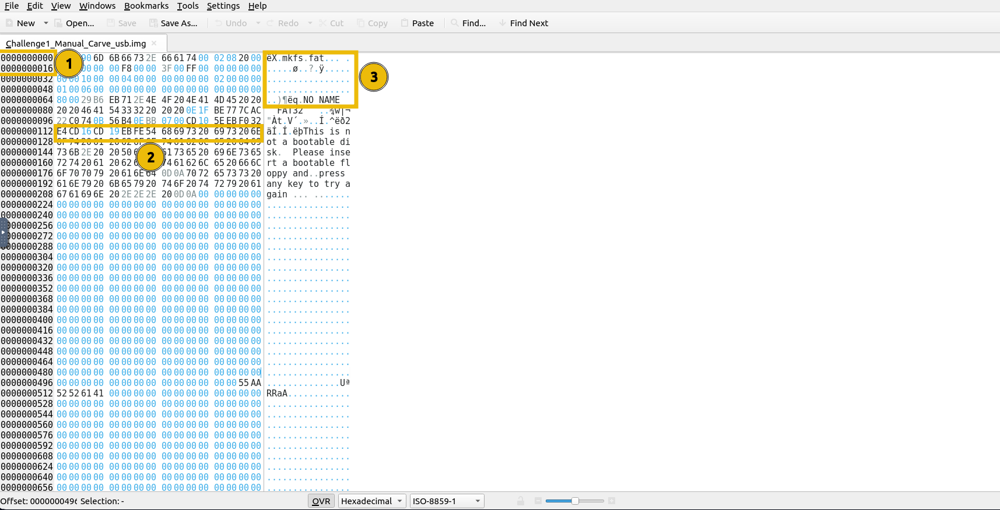

💡 **Tip:** Foremost and Scalpel both use config files (`/etc/foremost.conf` and `/etc/scalpel/scalpel.conf`) where you can define custom headers, footers, and max file sizes per type — essential for hunting proprietary or non-standard formats.

**Q: Time to put some of the tools to action.**
```
No answer needed
```

---

## Task 4 — Manual Carving

All challenge files are located at `/home/ubuntu/Desktop/Carving_Challenges/`.

### Scenario 1: USB Drive Wipe Recovery (`Challenge1_Manual_Carve_usb.img`)

The disk image shows an MBR with an empty partition table — a sign of deliberate formatting. However, raw data fragments remain. Using **Okteta**, we scan for known file headers.

Searching for the PNG header `89 50 4E 47` reveals a hit at offset `0001069056`. Scrolling forward, the PNG footer `49 45 4E 44 AE 42 60 82` appears, marking the file boundary.

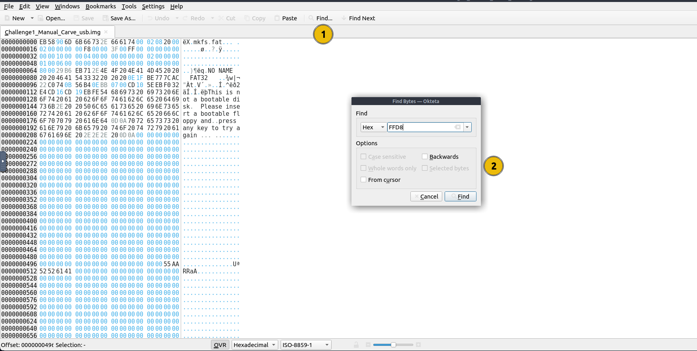

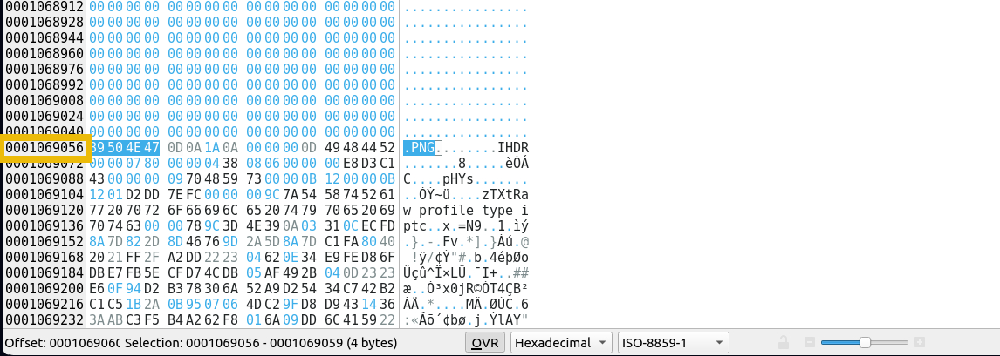

Once the start and end offsets are confirmed, the range is selected, copied to a new file, and saved with a `.png` extension. Alternatively, `dd` can carve it out directly:

```bash
# Subtract end offset from start offset to get byte count, then extract
dd if=Challenge1_Manual_Carve_usb.img of=Image.png bs=1 skip=<start_offset> count=<byte_count>
```

After extraction, **ExifTool** reveals embedded metadata — including any hidden flags:

```bash
exiftool Challenge1_Image.png
```

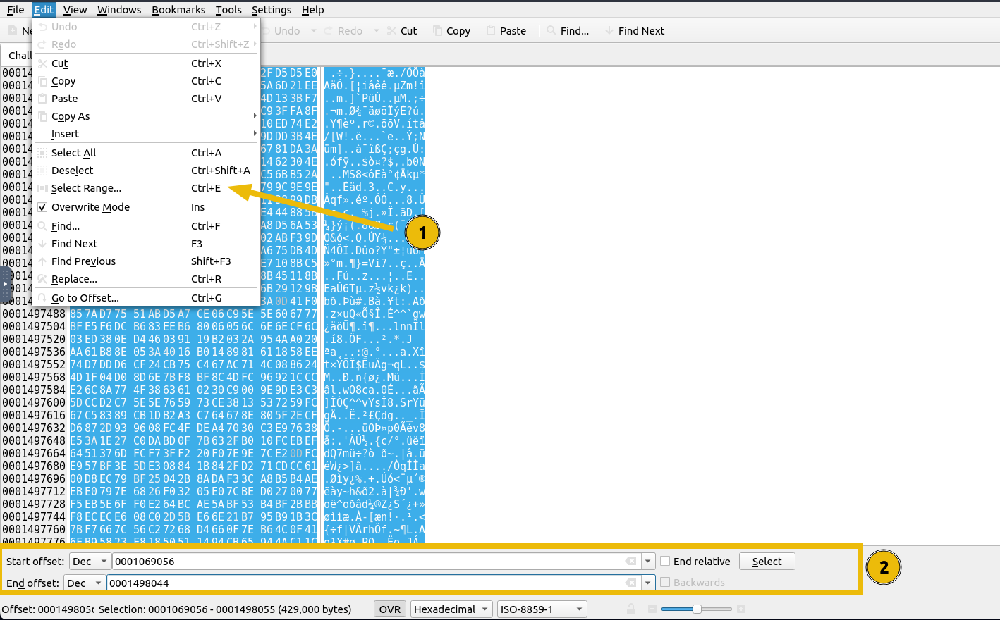

**Q: What is the ending offset address of the PNG file in `Challenge1_Manual_Carve_usb.img`?**
```
0001526426
```

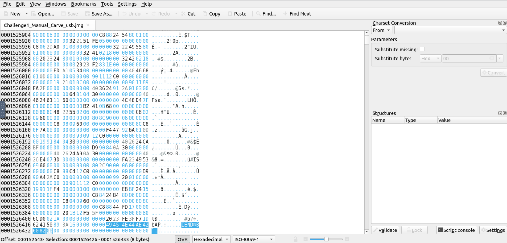

**Q: From the disk file `Challenge1_Manual_Carve_usb.img`, what is the flag hidden within the recovered file?**
```
THM{F1le_Carving_1s_FuN}
```

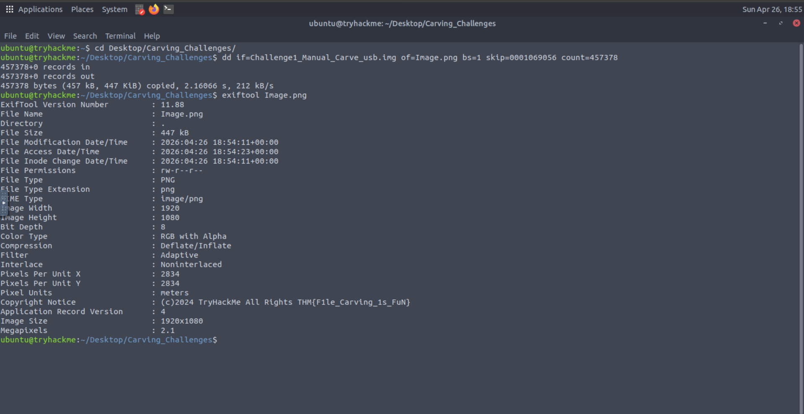

---

### Scenario 2: Recovering Files from Slack Space (`Challenge2_slack_space.img`)

**Slack space** is the unused storage within a cluster after a file's data ends — residual data from previously stored files can persist here. **Binwalk** is used to map the image structure:

```bash
binwalk Challenge2_slack_space.img
```

```
DECIMAL       HEXADECIMAL     DESCRIPTION
--------------------------------------------------------------------------------
0             0x0             Linux EXT filesystem ...
268782594     0x10054C02      MPEG transport stream data
269403916     0x100EC70C      TROC filesystem ...
...
```

The MPEG transport stream data at `268782594` is fragmented across the image. Rather than tracing it manually in Okteta, Binwalk's extraction mode handles recovery:

```bash
binwalk -e Challenge2_slack_space.img
```

This populates a `_Challenge2_slack_space.img.extracted/` directory:

```bash
ls _Challenge2_slack_space.img.extracted/
# 0.ext  17FFFC00.ext2  27FFFC00.ext2  ext-root
```

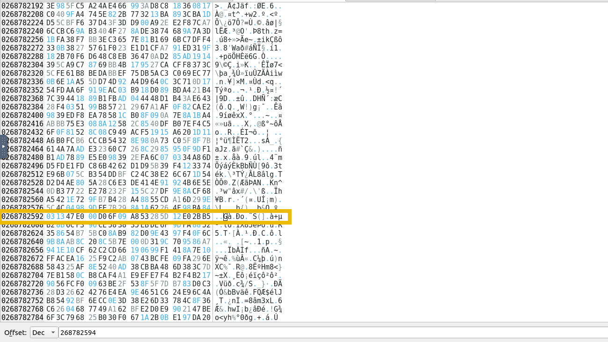

Navigating into `ext-root` reveals the carved files — including one with no extension. Running ExifTool against the recovered PNG yields the embedded flag.

**Q: What is the file size of the recovered image file in KB from `Challenge2_slack_space.img`?**
```
31
```

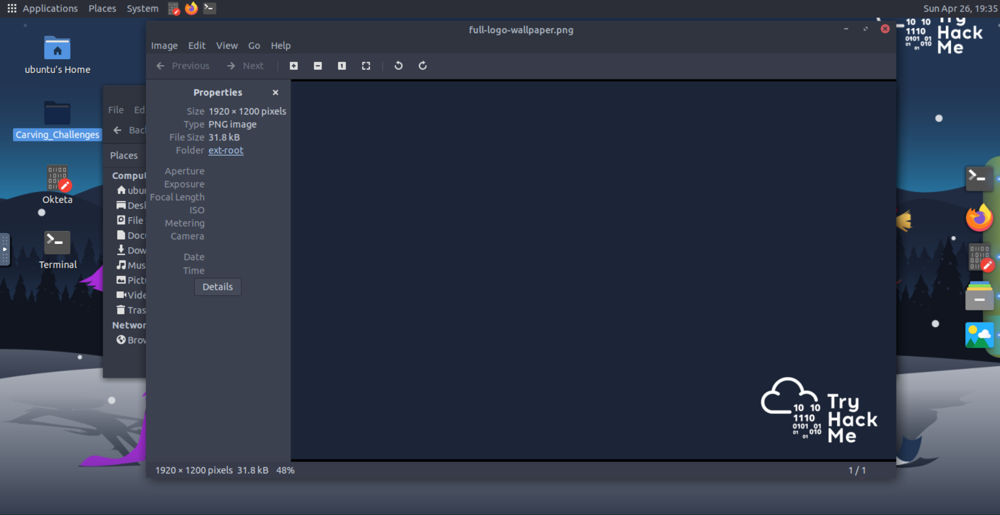

**Q: What is the name of the extracted file that has no extension from `Challenge2_slack_space.img`?**
```
randomstuff
```

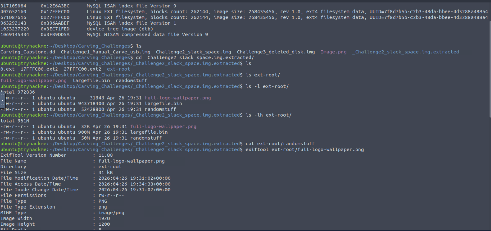

**Q: What is the flag hidden within the recovered file from `Challenge2_slack_space.img`?**
```
THM{Fragm3nt_C@rv1ng}
```

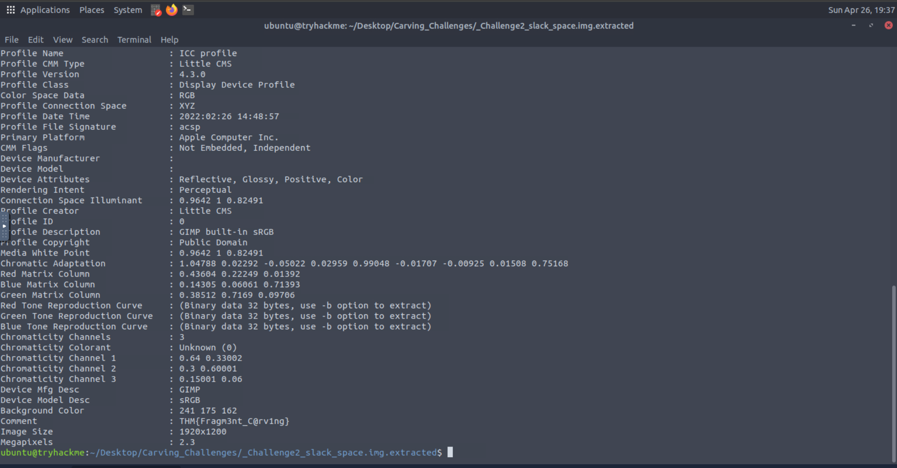

---

## Task 5 — Automated Carving

### Scenario 3: Recovering Deleted Files (`Challenge3_deleted_disk.img`)

Mounting the image confirms the file system is empty — only `lost+found` is visible:

```bash
sudo mount Challenge3_deleted_disk.img /mnt/tmp
ls /mnt/tmp
# lost+found
```

The files were deleted, removing file system references, but the raw data remains in unallocated space. **Foremost** scans the entire image byte-by-byte for known signatures:

```bash
foremost -i Challenge3_deleted_disk.img -o Challenge3_files -c /etc/custom_foremost.conf
```

Foremost's config (`/etc/foremost.conf` or a custom variant) defines per-type rules:

```
gif     y       155000000       \x47\x49\x46\x38\x37\x61        \x00\x3b
jpg     y       20000000        \xff\xd8\xff\xe0\x00\x10        \xff\xd9
```

Extracted files are sorted into subdirectories (`jpg/`, `pdf/`, `png/`) under the output folder. To target specific types only:

```bash
foremost -t pdf,jpg,png -i Challenge3_deleted_disk.img -o Challenge3_files -c /etc/custom_foremost.conf
```

**Scalpel** offers a performance-optimised alternative with a two-pass approach:

```bash
scalpel Challenge3_deleted_disk.img -o ScalpelOutput -c /etc/scalpel/scalpel.conf
```

> **Note:** Both tools error on non-empty output directories — delete or rename the output directory before re-running.

The recovered PDF reveals its original filename in its title metadata. The recovered PNG contains a flag in its EXIF data, extracted via ExifTool.

**Q: What is the original name of the recovered PDF file?**
```
DataSyncTHM_project_phoenix.txt
```

**Q: What is the flag in the file?**
```
THM{ProjectPhoenix_123}
```

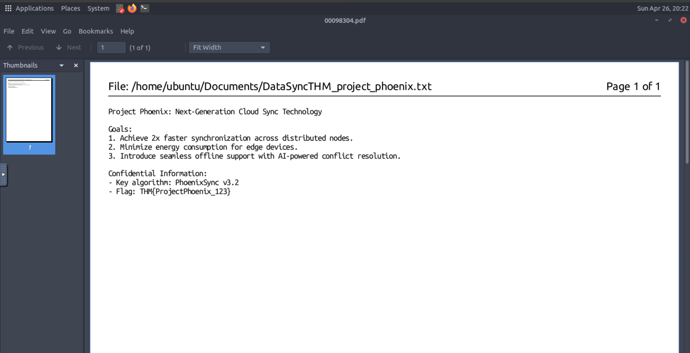

**Q: What is the flag in the image file recovered?**
```
THM{Aut0mat3d_C@rv1ng}
```

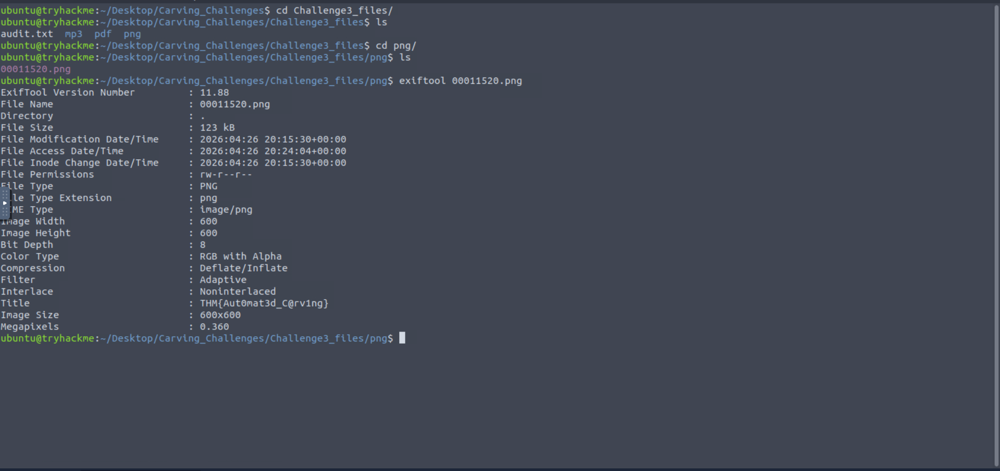

---

## Task 6 — Carving Capstone

Unguided challenge using `Carving_Capstone.dd` — a disk image suspected to contain concealed proprietary data.

### Identifying the XML/SVG File

First, Binwalk maps out the image structure:

```bash
binwalk Carving_Capstone.dd
```

An XML-type signature is identified. Cross-referencing [GCK's File Signatures Table](https://www.garykessler.net/library/file_sigs.html), the XML header is `3C 3F 78 6D 6C 20 76 65 72 73 69 6F 6E 3D`. Binwalk confirms the starting offset as **134946816**.

In Okteta, using `Edit > Go to Offset...` (decimal mode) and searching for `3C3F786D6C207665` confirms the beginning offset. Closer inspection of the content reveals the file is actually an **SVG** (`<svg` tag, UTF-8 encoded). The SVG footer (`</svg>` → `73 76 67 3E`) is located by searching forward for the closing tag bytes.

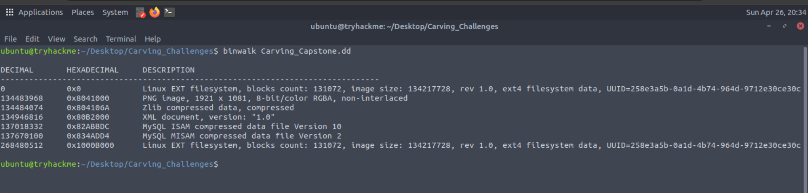

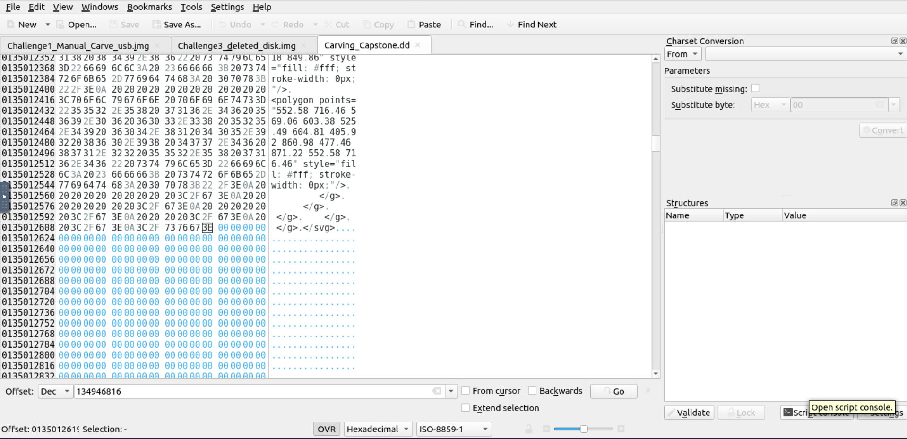

**Q: Using Binwalk and the hex editor, what is the beginning and ending offset of the XML file in the disk image? Answer: Starting,Ending**
```
134946816,135012619
```

**Q: What is the actual file type of the file found in Question 1?**
```
svg
```

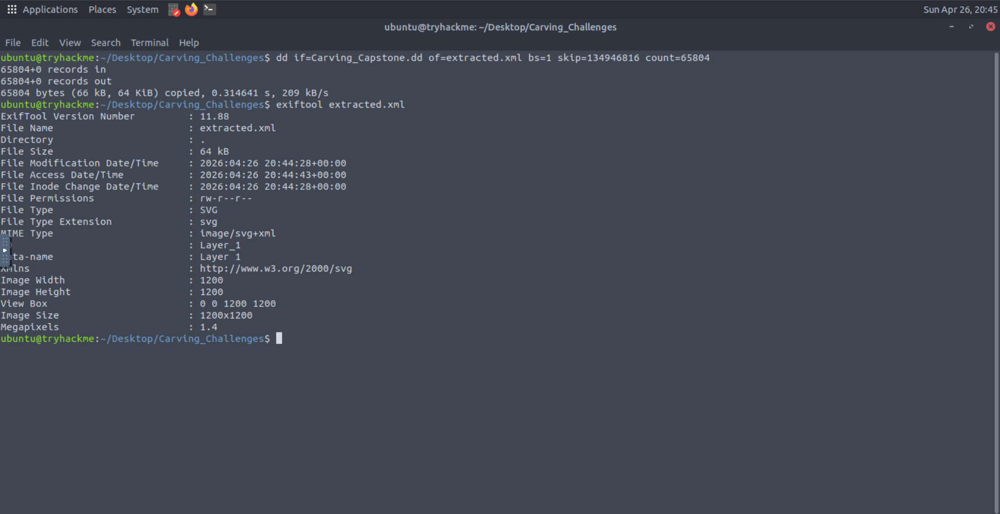

### Recovering the Audio File

Foremost carves all recoverable files from the capstone image:

```bash
foremost -i Carving_Capstone.dd -o Capstone_Files -c /etc/custom_foremost.conf
```

Three directories are created: `mp3/`, `png/`, `wav/`. ExifTool against the WAV file reveals playback duration:

```bash
exiftool <carved_file>.wav
```

**Q: How long is the playback from the audio file? (Answer is in seconds)**
```
18.29
```

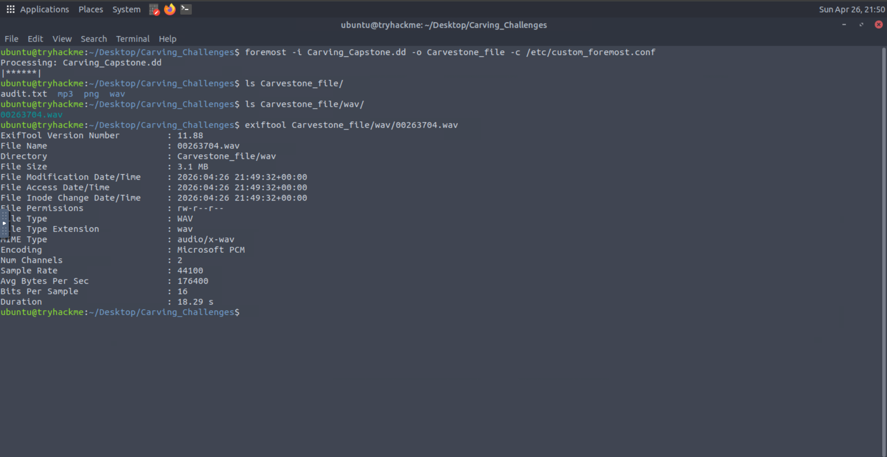

### Flag in the Recovered Image

ExifTool against the carved PNG reveals a flag embedded in its metadata:

```bash
exiftool <carved_file>.png
```

**Q: What flag is hidden in the image file found?**
```
THM{D4t3_0f_D3l3t10n_2024-12-10}
```

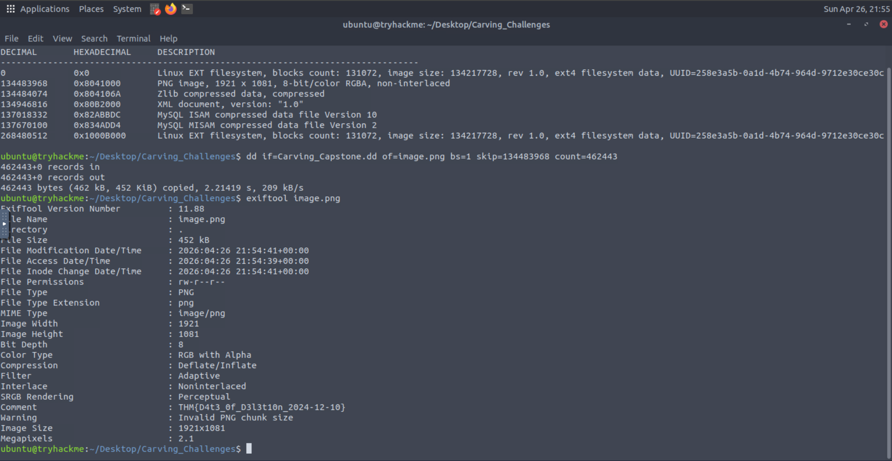

---

## Task 7 — Conclusion

**Q: Time to conclude.**
```
No answer needed
```

---

## Key Takeaways

- **File carving bypasses the file system entirely** — it recovers data based on raw byte patterns (headers/footers), making it effective even when metadata is wiped, corrupted, or reformatted away
- **Magic bytes are the foundation** — every file type has a known signature; mastering common ones (JPEG `FFD8FF`, PNG `89504E47`, PDF `25504446`) is essential for manual carving
- **Slack space is a goldmine** — unused cluster space retains residual data from previously stored files long after deletion; Binwalk is the right tool to surface these fragments
- **Foremost and Scalpel are complementary** — Foremost excels at forensic-grade precision with flexible config; Scalpel's two-pass approach offers speed advantages on large images
- **ExifTool is indispensable post-carving** — embedded metadata in recovered files provides timestamps, authorship, camera data, and sometimes flags or other investigator-relevant artefacts
- **Binwalk + hex editor = manual capstone workflow** — Binwalk identifies candidate offsets, Okteta confirms and refines boundaries for precise extraction

🔴 **Malware relevance:** Malware droppers frequently embed payloads inside legitimate file formats (images, audio, documents) — file carving and signature analysis skills are directly applicable to detecting steganographic hiding techniques and recovering dropped payloads from disk artefacts

---

*Write-up by [OPT4RUN](https://tryhackme.com/p/OPT4RUN)*