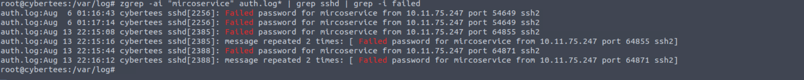

# IronShade

| Field | Details |
|-------|---------|
| **Platform** | TryHackMe |
| **Path** | Advanced Endpoint Investigations |
| **Module** | Linux Endpoint Investigation |
| **Difficulty** | Medium |
| **Category** | Digital Forensics / IR |
| **Room Link** | [tryhackme.com/room/ironshade](https://tryhackme.com/room/ironshade) |
| **Author** | [OPT4RUN](https://tryhackme.com/p/OPT4RUN) |

---

## Overview

IronShade is a hands-on Linux compromise assessment challenge. A honeypot server was deliberately exposed with weak SSH and open ports to attract an APT group known as IronShade. The server was compromised, and your job is to perform a thorough post-compromise investigation — identifying backdoor accounts, persistence mechanisms, malicious processes, hidden files, rogue services, and attacker infrastructure indicators.

This room consolidates skills from Linux Live Analysis, Linux Logs Investigation, and Linux Process Analysis into a realistic incident response scenario.

**From a blue team perspective**, this room reinforces the full compromise assessment workflow: starting from system identity, moving through persistence mechanisms (cron, services, backdoor users), runtime artefacts (hidden processes, in-memory files), and finally pivoting to log-based evidence for timeline reconstruction and attacker attribution.

---

## Task 1 — Linux Challenge

### Incident Scenario

An APT group called **IronShade** has been observed targeting Linux servers. A honeypot was stood up with intentionally weak SSH and open ports. The compromised server is provided for analysis. Threat intel indicates the group creates backdoor accounts for persistence — this is the starting thread to pull on.

---

### Q1 — Machine ID

**Command used:**
```bash
hostnamectl
```

The `hostnamectl` output includes the machine's static hostname, OS, kernel version, and importantly the **Machine ID** — a persistent unique identifier stored in `/etc/machine-id`.

**Q: What is the Machine ID of the machine we are investigating?**
```
dc7c8ac5c09a4bbfaf3d09d399f10d96
```

---

### Q2 — Backdoor Account

**Command used:**
```bash
cut -d: -f1 /etc/passwd | tail -n 5
```

Listing the last few entries in `/etc/passwd` surfaces recently created accounts. The attacker created a user named **mircoservice** — note the deliberate misspelling of "microservice", a common attacker technique to blend in with legitimate service accounts at a glance. Cross-referencing with crontab confirmed this account's involvement in persistence.

**Q: What backdoor user account was created on the server?**
```
microservice
```

> 💡 Always check `/etc/passwd` for accounts created outside your normal provisioning process. Misspelled service-sounding names (`mircoservice`, `systemd-updater`, etc.) are a red flag.

---

### Q3 — Attacker Cronjob

**Command used:**
```bash
crontab -l
```

The `@reboot` directive executes a command every time the system starts, making it a reliable persistence mechanism. The attacker registered a job under the backdoor account to launch a binary called `printer_app` from the backdoor user's home directory.

**Q: What is the cronjob that was set up by the attacker for persistence?**
```
@reboot /home/mircoservice/printer_app
```

> 🔴 **Malware relevance:** `@reboot` cron entries are a classic low-noise persistence mechanism. During incident response, always enumerate crontabs for all users (`crontab -u <user> -l`) and check `/etc/cron.*` directories, not just the current user's crontab.

---

### Q4 — Hidden Process from Backdoor Account

**Command used:**
```bash
ps -eFH | grep mircoservice
```

Filtering process output by the backdoor account's username revealed a hidden process. The leading dot in the process name (`.strokes`) is a deliberate naming convention used by attackers to obscure processes — in some contexts, dotfiles/directories are hidden from default directory listings, and similarly named processes can be harder to spot in a busy process list.



**Q: Examine the running processes on the machine. Can you identify the suspicious-looking hidden process from the backdoor account?**
```
.strokes
```

---

### Q5 — Process Count from Backdoor Directory

**Command used:**
```bash
ps -eFH | grep mircoservice
```

The same process listing that revealed `.strokes` showed two processes running from the backdoor account's home directory.

**Q: How many processes are found to be running from the backdoor account's directory?**
```
2
```

---

### Q6 — Hidden File in Memory from Root Directory

**Command used (osquery):**
```sql
SELECT filename, path, directory, size, type FROM file WHERE path LIKE '/.%';
```

Using `osqueryi` to query the filesystem for dotfiles directly in `/` (root directory) revealed a hidden file named `.systmd` — another typosquatting attempt mimicking the legitimate `systemd` binary name.

**Q: What is the name of the hidden file in memory from the root directory?**
```
.systmd
```

> 💡 `osqueryi` is extremely useful for forensic queries — it lets you treat the OS like a database. Querying for dotfiles in unusual locations (like `/`) is a reliable method for surfacing attacker-planted hidden artefacts.

---

### Q7 — Suspicious Services

Navigating to `/etc/systemd/system/` and reviewing installed unit files revealed two services that were not part of the standard installation and were directly tied to the backdoor account (`mircoservice`).

**Q: What suspicious services were installed on the server? (Format: service a, service b alphabetical)**
```
backup.service, strokes.service
```

> 🔴 **Malware relevance:** Attackers frequently install malicious systemd services for persistence — they survive reboots, run as root or a specified user, and can restart on failure. Always audit `/etc/systemd/system/` and cross-reference unit file `[Service]` blocks for unexpected `ExecStart` paths.

---

### Q8 — Backdoor Account Creation Timestamp

**Command used:**
```bash
zgrep -ai "mircoservice" /var/log/auth.log* | grep useradd
```

Auth logs record `useradd` events when new user accounts are created. Using `zgrep` against all rotated `auth.log` archives (`auth.log`, `auth.log.1`, `auth.log.2.gz`, etc.) ensures no log rotation boundary is missed.

**Q: When was the backdoor account created on this infected system?**
```
Aug  5 22:05:33
```

---

### Q9 — Attacker SSH Source IP

**Command used:**
```bash
zgrep -ai "mircoservice" /var/log/auth.log* | grep sshd
```

SSH login attempts and successes are recorded in `auth.log` by the `sshd` service. Filtering for the backdoor account's username across all log archives revealed a single source IP making repeated SSH connection attempts.

**Q: From which IP address were multiple SSH connections observed against the suspicious backdoor account?**
```
10.11.75.247
```

---

### Q10 — Failed SSH Login Attempts

**Command used:**
```bash
zgrep -ai "mircoservice" /var/log/auth.log* | grep sshd | grep -i failed
```

Counting failed authentication events against the backdoor account: 4 individual failed attempt entries plus 2 entries each containing 2 error messages — totalling **8 failed login attempts**.

**Q: How many failed SSH login attempts were observed on the backdoor account?**
```
8
```

> 💡 When counting failed SSH logins, be careful with log entries that report aggregate failure counts (e.g., "2 failures") — these need to be added to the single-event failure lines, not just counted as one event.

---

### Q11 — Malicious Package

**Command used:**
```bash
grep " install " /var/log/dpkg.log
```

`dpkg.log` records all package installation, removal, and upgrade events with timestamps. Reviewing installs surfaced a non-standard package called `pscanner` that has no business being on a server.

**Q: Which malicious package was installed on the host?**
```
pscanner
```

---

### Q12 — Secret Code in Package Metadata

**Command used:**
```bash
dpkg -l | grep pscanner
```

`dpkg -l` displays installed package information including the package description field, which is stored in the package metadata. The attacker embedded a flag in the description of the malicious package.

**Q: What is the secret code found in the metadata of the suspicious package?**
```
{_tRy_Hack_ME_}
```

---

## Key Takeaways

- **Machine ID** (`/etc/machine-id` via `hostnamectl`) is a reliable unique identifier when scoping an investigation to a specific host
- **Backdoor accounts** in `/etc/passwd` often use typosquatted service-sounding names — check recently added entries with `tail`
- **`@reboot` cron entries** are a simple, persistent, and often overlooked attacker technique — enumerate all user crontabs during IR
- **Hidden processes** (leading dot in process name) can be surfaced by filtering `ps -eFH` output by suspected usernames
- **`osqueryi`** provides a powerful SQL interface to the OS — ideal for hunting dotfiles in unusual directories like `/`
- **`/etc/systemd/system/`** is a prime location for attacker-planted persistence services; always audit unit files for unexpected `ExecStart` paths
- **`zgrep`** across all rotated log archives ensures log rotation boundaries don't create blind spots during timeline reconstruction
- **`dpkg.log`** and `dpkg -l` can expose malicious package installations and embedded attacker metadata

---

*Write-up by [OPT4RUN](https://tryhackme.com/p/OPT4RUN)*