| Field | Details |
|-------|---------|
| **Room** | Linux Incident Surface |
| **Platform** | TryHackMe |
| **Path** | Advanced Endpoint Investigations |
| **Module** | Linux Endpoint Investigation |
| **Difficulty** | Easy |
| **Category** | Digital Forensics / Incident Response |
| **Room Link** | [tryhackme.com/room/linuxincidentsurface](https://tryhackme.com/room/linuxincidentsurface) |
| **Author** | [OPT4RUN](https://tryhackme.com/p/OPT4RUN) |

---

## Overview

This room introduces the **Linux Incident Surface** — the collection of system areas where security incidents either originate or leave detectable traces. It draws a clear distinction between the *attack surface* (potential entry points for adversaries) and the *incident surface* (where defenders hunt for forensic footprints post-compromise).

The room uses an Alice (red team) / Bob (blue team) scenario to walk through attack actions and their corresponding defensive detection points across five key areas:

- Running processes and network communication
- Persistence mechanisms (accounts, cron jobs, services)
- On-disk forensic artefacts (config files, installed packages)
- Log analysis

This is the entry room to the Linux Endpoint Investigation module — foundational before the deeper dives into live analysis, log investigation, and process analysis.

---

## Task 1 — Introduction

No questions. Sets up the Alice/Bob scenario and outlines learning objectives:

- Understanding the Linux Attack Surface vs. Incident Surface
- Translating attacker actions into forensic footprints
- Covering key incident surface areas: processes, services, persistence, disk, logs

---

## Task 2 — Lab Connection

Connect to the lab VM and examine the activity directory.

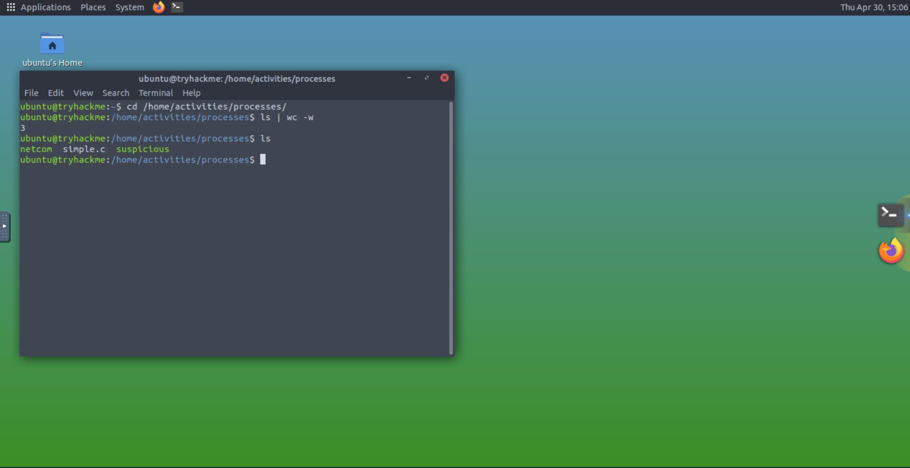

**Q: How many files and folders are in the `/home/activities/processes` directory?**
```
3
```

---

## Task 3 — Linux Incident Surface: An Overview

No questions. Defines and contrasts the two core concepts:

**Linux Attack Surface** — entry points an adversary can exploit:
- Open ports, running services, vulnerable software, network-exposed interfaces
- Goal: reduce the number of exploitable entry points

**Linux Incident Surface** — areas where defenders detect and respond to breaches:
- System logs (`auth.log`, `syslog`, `kern.log`), network traffic, running processes and services, file integrity
- Goal: hunt, detect, respond, recover

---

## Task 4 — Processes and Network Communication

Processes — especially those with active network connections — are a primary investigation focus. This task demonstrates how to compile and run a suspicious process, then locate its forensic traces.

### Investigating Processes

The `ps aux` command provides a full snapshot of running processes across all users, including background daemons not attached to a terminal.

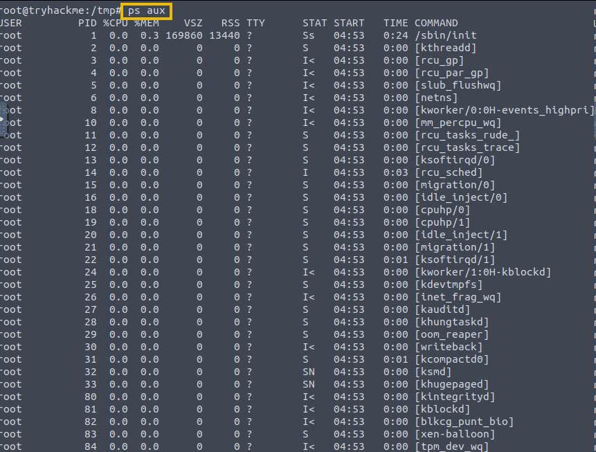

Filtering for a specific process:

```bash
ps aux | grep simple
```

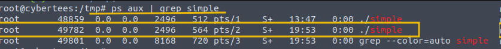

Key fields in `ps aux` output:

| Field | Meaning |
|-------|---------|
| USER | Owner of the process |
| PID | Process ID |
| %CPU / %MEM | Resource usage |
| VSZ / RSS | Virtual and resident memory size |
| TTY | Terminal (or `?` for background) |
| STAT | Process state: `R` running, `S` sleeping, `Z` zombie |
| START | When the process started |
| COMMAND | Command that launched it |

`lsof -p <PID>` reveals all files and shared libraries open by the process:

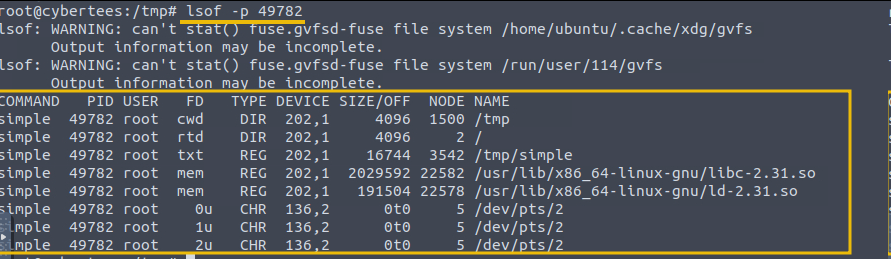

💡 **Tip:** A process running from `/tmp` with open file descriptors to unusual paths is a strong indicator of malicious activity. The `/tmp` directory is world-writable, making it a common staging ground.

### Process with Network Connection

Running `netcom` establishes an outbound network connection — a pattern frequently seen with C2 beaconing or reverse shells.

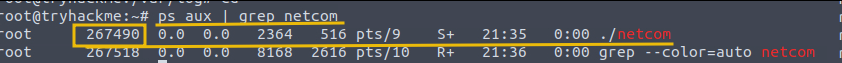

`lsof -i -P -n` lists all open network connections with raw IPs and port numbers (no hostname resolution):

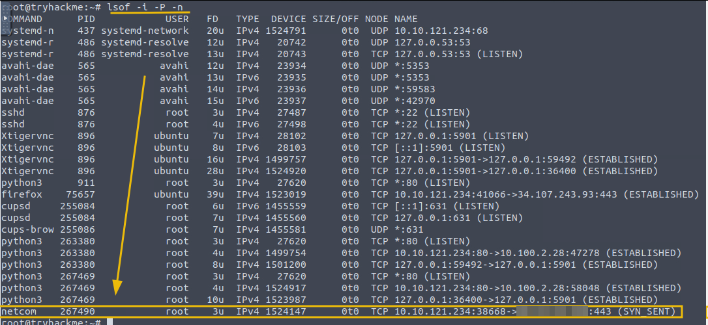

### Using Osquery

Osquery provides a SQL-like interface for querying OS state — useful for scoping a specific PID's network activity:

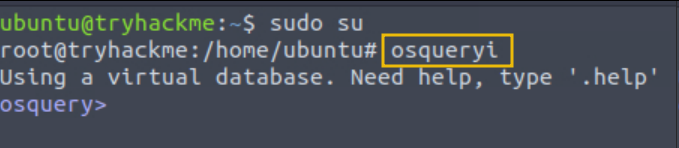

```sql
SELECT pid, fd, socket, local_address, remote_address FROM process_open_sockets WHERE pid = 267490;
```

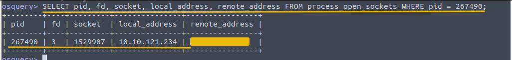

🔴 **Incident Relevance:** Processes communicating outbound to unexpected IPs — especially on ports like 443 to non-CDN infrastructure — warrant immediate investigation. Common indicators: processes spawned from `/tmp`, unexpected parent-child relationships, orphan processes.

**Q: What is the remote IP to which the process `netcom` establishes the connection?**
```
68.53.23.246
```

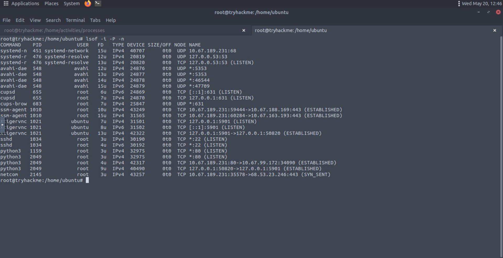

**Q: Update the osquery command. What is the remote port the `netcom` process is communicating to?**
```
443
```

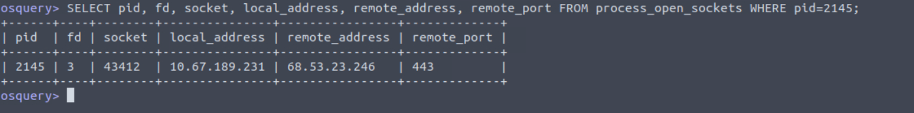

---

## Task 5 — Persistence

Post-exploitation, maintaining persistent access is typically an adversary's next priority. This task covers three persistence mechanisms and how to detect each.

### Activity 1 — Backdoor Account Creation

Creating a backdoor user with sudo privileges:

```bash
sudo useradd attacker -G sudo
sudo passwd attacker
echo "attacker ALL=(ALL:ALL) ALL" | sudo tee -a /etc/sudoers
```

**Detection in `auth.log`:**

```bash
cat /var/log/auth.log | grep useradd
```

Key log entries include: `useradd` invoked via `sudo`, new group creation, new user creation with assigned UID/GID/home/shell.

**Detection in `/etc/passwd`:**

The new `attacker` entry appears at the bottom with shell `/bin/sh` — note the non-standard shell (not `/bin/bash`) which is a low-noise indicator sometimes used to avoid attention.

### Activity 2 — Malicious Cron Job

Cron jobs execute commands on a schedule without requiring user interaction — ideal for periodic callback or persistence after reboot.

Common malicious cron entries:
```
@reboot /path/to/malicious/script.sh       # runs every reboot
* * * * * root /path/to/script.sh          # runs every minute as root
```

Per-user crontabs are stored at `/var/spool/cron/crontabs/<username>`:

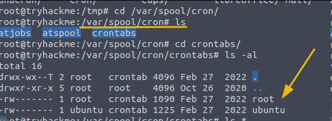

### Activity 3 — Malicious Service

Installing a systemd service ensures the malicious process restarts automatically on failure and survives reboots.

```bash
sudo systemctl daemon-reload
sudo systemctl enable suspicious.service
sudo systemctl start suspicious.service
```

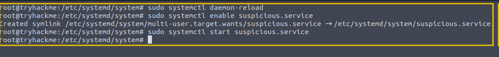

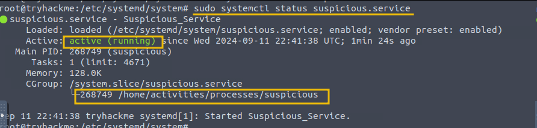

**Detection — Reviewing `/etc/systemd/system`:**

All enabled services are installed here. Unexpected `.service` files are worth examining:

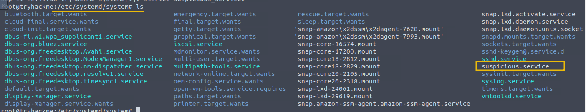

**Detection — Syslog:**

```bash
cat /var/log/syslog | grep suspicious
```

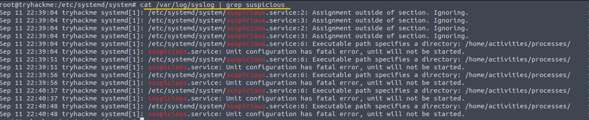

**Detection — Journalctl:**

```bash
sudo journalctl -u suspicious
```

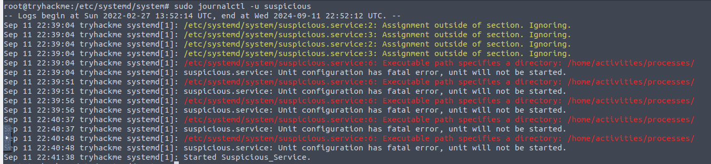

💡 **Tip:** `journalctl` output also captures failed start attempts — useful for reconstructing an adversary's trial-and-error when installing persistence.

---

**Q: What is the default path that contains all the installed services in Linux?**
```
/etc/systemd/system
```

**Q: Which suspicious service was found to be running on the host?**
```
benign.service
```

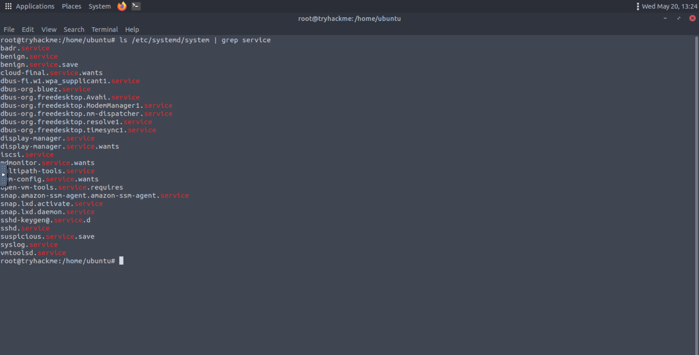

**Q: What process does this service point to?**
```
benign
```

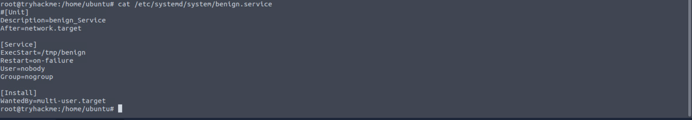

**Q: Before getting this service stopped on 11th Sept, how many log entries were observed in the `journalctl` against this service?**
```
7
```

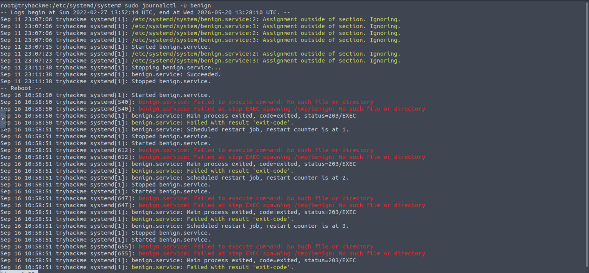

---

## Task 6 — Footprints on Disk

Key configuration files that attackers frequently target and that defenders should baseline:

| File | Contents |
|------|----------|
| `/etc/passwd` | User accounts, UID/GID, home dirs, shells |
| `/etc/shadow` | Hashed passwords |
| `/etc/group` | Group memberships and permissions |
| `/etc/sudoers` | Sudo privilege assignments |

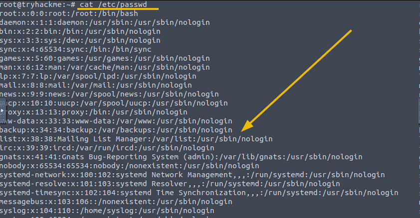

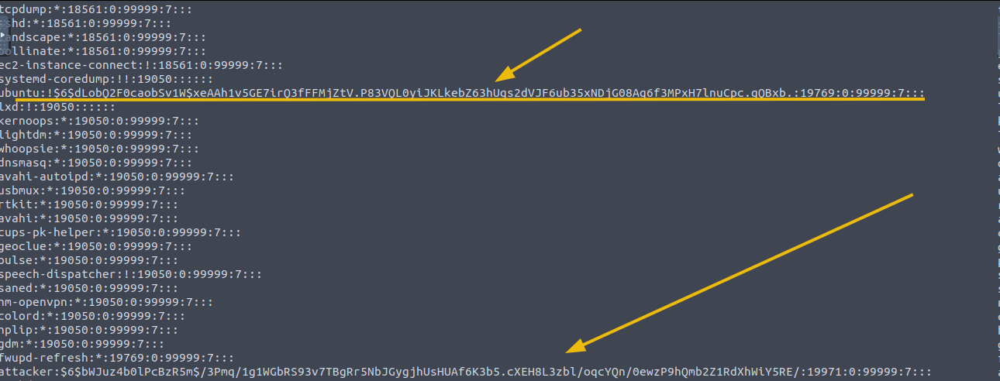

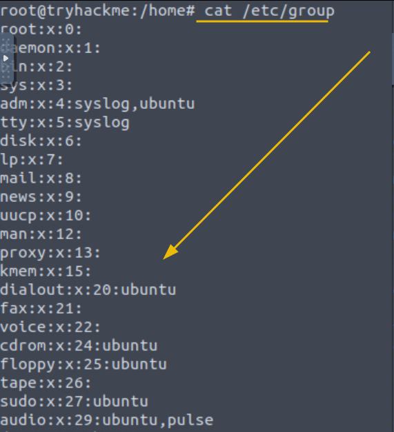

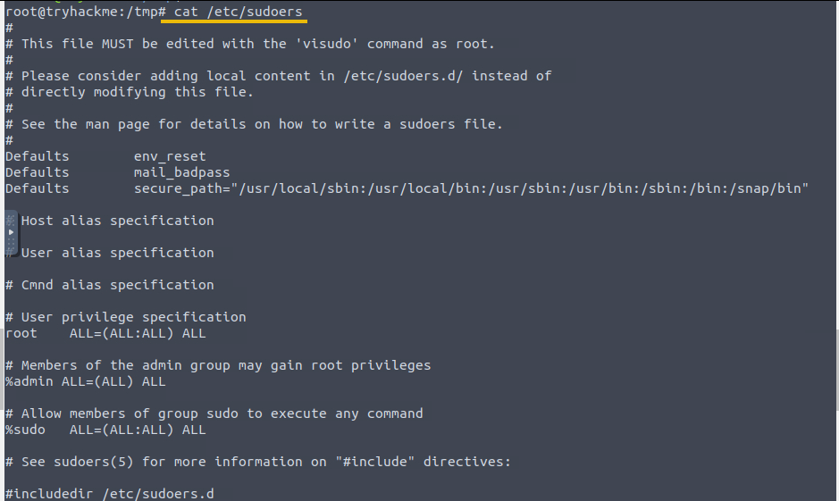

### Investigating Malicious Debian Packages

Attackers can package and install malicious `.deb` files to deploy tools or backdoors with a degree of legitimacy on the system.

**Detection — Listing installed packages:**

```bash
dpkg -l
```

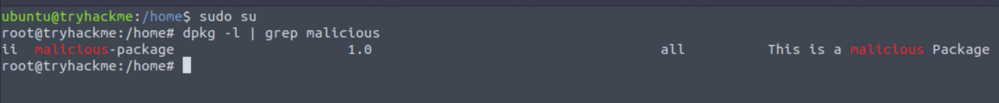

**Detection — `dpkg.log`:**

```bash
grep " install " /var/log/dpkg.log
```

The log records a timestamp, action (`install`), package name, and version for every package installation event.

---

**Q: Create a suspicious Debian package on the disk by following the steps mentioned in the task. How many log entries are observed in the `dpkg.log` file associated with this installation activity?**
```
6
```

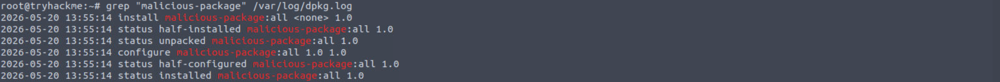

**Q: What package was installed on the system on the 17th of September, 2024?**
```
c2comm
```

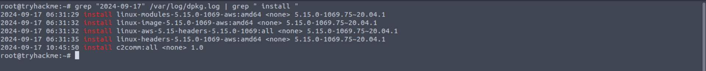

🔴 **Incident Relevance:** Package names like `c2comm` are an obvious indicator in a lab, but in real incidents look for packages with generic names, unknown maintainer emails, or installations timestamped outside change-management windows.

---

## Task 7 — Linux Logs

Logs are the primary evidence trail for incident reconstruction. Key log files:

| Log | Location | What to Look For |
|-----|----------|-----------------|
| Syslog | `/var/log/syslog` | System-wide events, service errors, daemon activity |
| Messages | `/var/log/messages` | Kernel messages, hardware errors, system activity |
| Auth log | `/var/log/auth.log` | Login attempts (success/fail), sudo usage, SSH events |

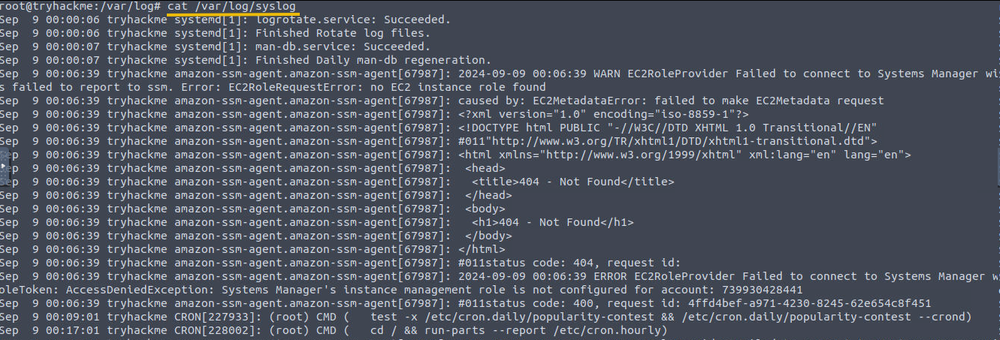

**Authentication Log Analysis:**

`auth.log` is the first stop for detecting unauthorized access. Key incident indicators:

- Multiple failed logins from an unfamiliar IP → brute-force
- Successful login at unusual hours → compromised credentials
- `sudo` usage by unexpected users → privilege escalation
- SSH login from an external IP to a server that shouldn't be externally accessible

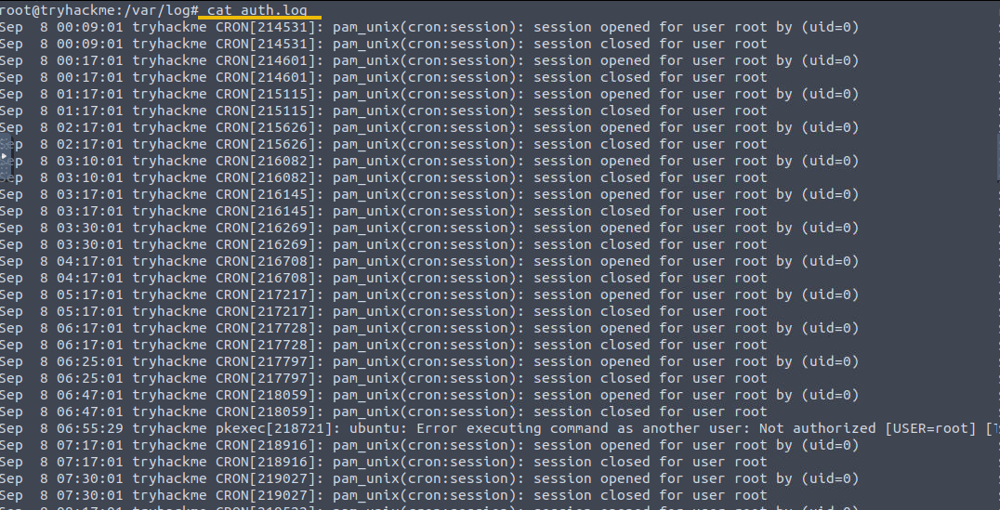

---

**Q: Examine the `auth.log` files. Which user attempted to connect with SSH on 11th Sept 2024?**
```
saqib
```

**Q: From which IP was this failed SSH connection attempt made?**
```
10.11.75.247
```

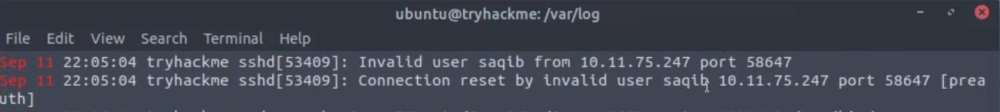

---

## Task 8 — Conclusion

No questions. Points to the deeper rooms in the module:

- [Linux Live Analysis](https://tryhackme.com/r/room/linuxliveanalysis)
- [Linux Logs Investigation](https://tryhackme.com/r/room/linuxlogsinvestigations)
- [Linux File System Analysis](https://tryhackme.com/r/room/linuxfilesystemanalysis)
- [Linux Process Analysis](https://tryhackme.com/r/room/linuxprocessanalysis)

---

## Key Takeaways

- The **Linux Incident Surface** covers all areas where post-compromise traces can be found — processes, services, logs, disk artefacts, and network connections
- **`ps aux`** + **`lsof`** + **`osquery`** together give a complete picture of a running process: resource usage, open files, and network sockets
- Processes communicating outbound — particularly from `/tmp` — are a high-priority investigation target
- Persistence mechanisms (backdoor accounts, cron jobs, services) all leave traces in `auth.log`, `/etc/passwd`, `/var/spool/cron/crontabs/`, `/etc/systemd/system/`, and `syslog`/`journalctl`
- **`dpkg.log`** records every package installation with a timestamp — baseline your systems and flag any installs outside change windows
- `auth.log` is the primary log for detecting unauthorized access; SSH brute-force, unusual login times, and unexpected `sudo` usage are key indicators

---

*Write-up by [OPT4RUN](https://tryhackme.com/p/OPT4RUN)*