# Linux Live Analysis

| Field      | Details                                                                 |
|------------|-------------------------------------------------------------------------|
| **Platform**   | TryHackMe                                                           |
| **Path**       | Advanced Endpoint Investigations                                    |
| **Module**     | Linux Endpoint Investigation                                        |
| **Difficulty** | Medium                                                              |
| **Category**   | Digital Forensics / Incident Response                               |
| **Room Link**  | [Linux Live Analysis](https://tryhackme.com/room/linuxliveanalysis) |
| **Author**     | [OPT4RUN](https://tryhackme.com/p/OPT4RUN)                         |

---

## Overview

This room covers live forensics on a compromised Linux machine — the kind of investigation you'd perform when you can't take the system offline and need to extract volatile evidence before it disappears. Unlike disk imaging scenarios, live forensics is about capturing the state of memory, processes, and network connections right now.

From a SOC/IR perspective, this matters because volatile data — running processes, open files, active network connections, in-memory structures — is destroyed the moment the machine powers off. This room walks through a realistic scenario: a Linux server compromised by a red team, requiring a systematic investigation using built-in Linux tools and osquery.

---

## Task 1 — Introduction

Linux dominates the server landscape — web servers, cloud infrastructure, HPC clusters. Its ubiquity makes it a high-value target. This room simulates a SOC analyst being handed a compromised Linux machine with the task of performing live forensics to determine the blast radius and identify attacker TTPs.

---

## Task 2 — Lab Connection

Connect to the lab VM via VNC using the credentials below:

| Field    | Value         |
|----------|---------------|
| Username | Ubuntu        |
| Password | TryHackMe!    |

---

## Task 3 — Live Forensics: An Overview

Live forensics focuses on volatile data — artifacts that exist only while the machine is running. The key data types of forensic interest on a live Linux system:

| Data Type                  | Forensic Value                                                    |
|----------------------------|-------------------------------------------------------------------|
| Running Processes          | Identifies malicious or unexpected executables in memory          |
| Open Files                 | Reveals what data is being accessed or modified                   |
| In-Memory Data Structures  | May contain encryption keys, passwords, or exploitation evidence  |
| Network Connections        | Exposes C2 communication or active exfiltration                   |
| Listening Services         | Identifies unauthorized backdoors or compromised services         |
| Logged-in User Sessions    | Correlates user activity with observed events                     |
| User Activity / Shell History | Traces attacker command execution                             |
| In-Memory Logs             | Real-time snapshot before logs are flushed to disk                |
| Interface Configurations   | Network changes that may indicate malicious reconfiguration       |
| Temp Files and Cache       | Scripts, dropped payloads, or transient sensitive documents       |

---

## Task 4 — Tool of the Trade: osquery

osquery, developed by Facebook, allows you to query the operating system as a relational database using SQL-like syntax. It's one of the most effective tools for endpoint investigation because it normalises OS data into tables you can query, join, and filter.

Launch the interactive shell:

```bash
osqueryi
```

> 💡 **Tip:** Always run osquery as root, or queries against privileged tables will return empty or incomplete results.

### User Accounts

```sql
SELECT username, uid, description FROM users;
```

### Running Processes

```sql
SELECT pid, name, parent, path FROM processes;
```

### osquery Table Schema

The official schema reference is at [osquery.io/schema/5.12.1](https://osquery.io/schema/5.12.1/) — useful for discovering available tables and columns before writing queries.

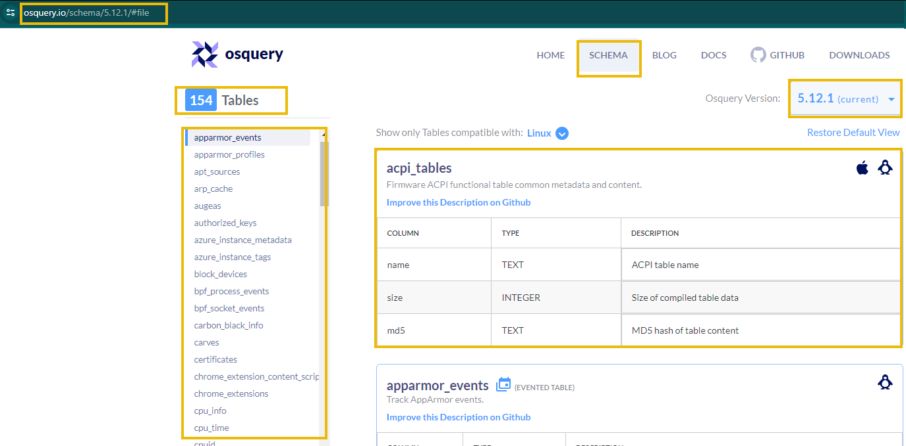

---

**Q: What hostname is returned after running the following query?**
`select * from etc_hosts where address = '0.0.0.0';`
```
attacker.thm
```

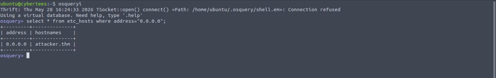

**Q: On the official website, how many tables are listed for Linux OS?**
```
154
```

---

## Task 5 — System Profiling

System profiling is the first step of any investigation — establishing a baseline of what the machine looks like, what's installed, and what its current state is.

### Basic System Info

```bash
uname -a
```

Returns kernel version, hostname, architecture, and compile date. Key fields:

| Field              | Meaning                              |
|--------------------|--------------------------------------|
| `cybertees`        | Hostname                             |
| `5.15.0-1063-aws`  | Kernel version                       |
| `x86_64`           | 64-bit architecture                  |
| `SMP`              | Multi-processor kernel               |

### Hostname Details

```bash
hostnamectl
```

Provides Machine ID, Boot ID, OS version, and virtualisation type — all useful for asset identification and correlating logs across systems.

### Uptime

```bash
uptime
```

### Hardware Info

```bash
lscpu
```

### Disk Usage

```bash
df -h
lsblk
```

### Memory

```bash
free -h
```

### Installed Packages

```bash
dpkg -l
apt list --installed
```

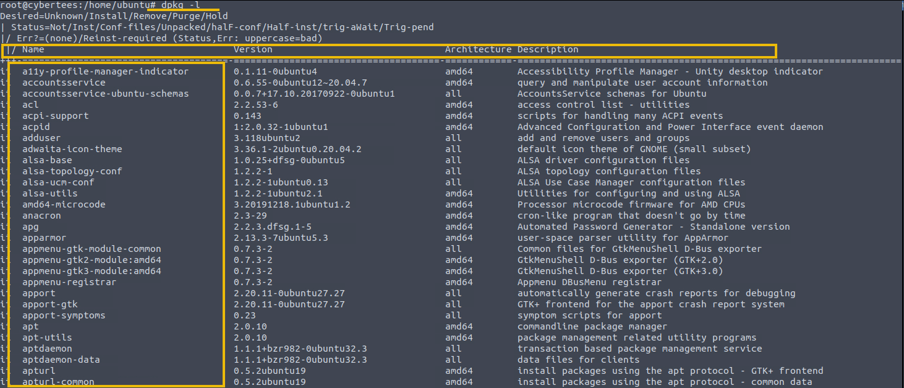

> 💡 **Tip:** Package lists are a goldmine for finding adversary-installed tools. Look for packages that are out of place for the server's purpose.

### Network Profiling

```bash
ip a           # Interface configuration
ip r / route   # Routing table
ss / netstat   # Active connections and listening ports
```

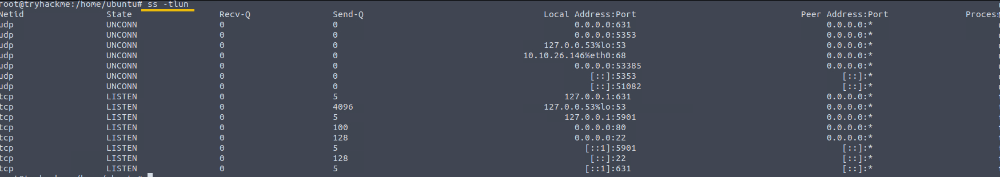

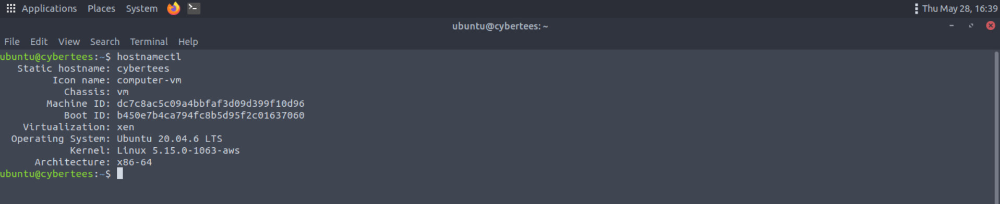

---

**Q: What is the Machine ID of the machine we are investigating?**
```
dc7c8ac5c09a4bbfaf3d09d399f10d96
```

**Q: What is the architecture of the host we are investigating?**
```
x86_64
```

---

## Task 6 — Hunting for Processes

Identifying suspicious processes is a core live forensics task. The goal is to find processes that don't belong — running from unusual paths, missing from disk, or orphaned.

### Common CLI Tools

| Command   | Use Case                                                     |
|-----------|--------------------------------------------------------------|
| `ps`      | Snapshot of running processes                                |
| `top`     | Real-time process monitor                                    |
| `htop`    | Enhanced top with colour coding                              |
| `pstree`  | Parent-child process relationships                           |
| `pidof`   | Find PID by process name                                     |
| `lsof`    | List open files and associated processes                     |
| `netstat` | Network connections per process                              |
| `strace`  | Trace system calls — deep-dive into what a process is doing  |

### Osquery: List All Processes

```sql
SELECT pid, name, path, state FROM processes;
```

### Processes Running from /tmp

Adversaries frequently stage and execute malware from `/tmp` or `/var/tmp` since these are world-writable and often excluded from monitoring.

```sql
SELECT pid, name, path FROM processes WHERE path LIKE '/tmp/%' OR path LIKE '/var/tmp/%';
```

### Fileless Malware Detection

```sql
SELECT pid, name, path, cmdline, start_time FROM processes WHERE on_disk = 0;
```

`on_disk = 0` means the binary is executing in memory but the file no longer exists on disk — a strong indicator of fileless malware or deliberate cleanup after execution.

### Orphan Process Detection

Every legitimate process has a parent. Orphan processes — those whose parent PID doesn't exist — can indicate attacker activity designed to detach from the normal process tree.

```sql
SELECT pid, name, parent, path FROM processes WHERE parent NOT IN (SELECT pid FROM processes);
```

### Processes Running from User Directories

On a server, processes running from `/home/` are unusual and worth investigating.

```sql
SELECT pid, name, path, cmdline, start_time FROM processes WHERE path LIKE '/home/%' OR path LIKE '/Users/%';
```

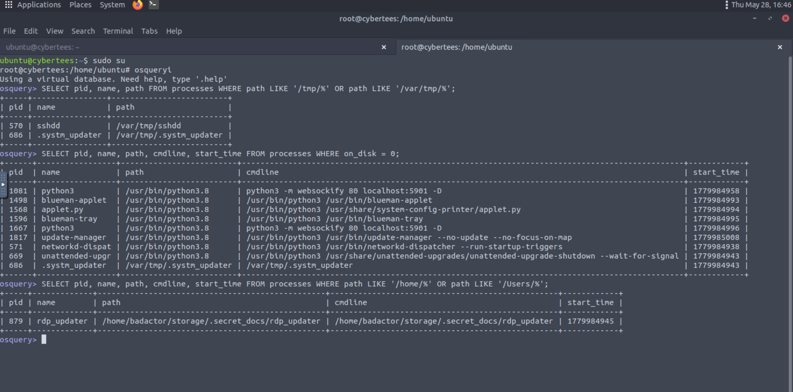

---

**Q: What is the name of the process running from the tmp directory? (Note: Not Hidden one)**
```
sshdd
```

**Q: What is the name of the suspicious process running in the memory of the infected host?**
```
.systm_updater
```

**Q: What is the name of the process running from the user directory?**
```
rdp_updater
```

---

## Task 7 — Investigating Network Connections

With suspicious processes identified, the next step is correlating them with network activity — C2 communication, exfiltration, or backdoor listening ports.

### Common Network CLI Tools

| Command      | Use Case                                          |
|--------------|---------------------------------------------------|
| `netstat`    | Active connections and routing tables             |
| `ss`         | Faster, more detailed socket statistics           |
| `tcpdump`    | Live packet capture                               |
| `lsof`       | Files and network sockets per process             |
| `iptables`   | Firewall rules and traffic monitoring             |
| `nmap`       | Network scanning                                  |
| `dig`        | DNS queries                                       |
| `arp`        | ARP table — IP to MAC mapping                     |

### Osquery: All Network Connections

```sql
SELECT pid, family, remote_address, remote_port, local_address, local_port, state
FROM process_open_sockets LIMIT 20;
```

### Remote Connections Only

```sql
SELECT pid, fd, socket, local_address, remote_address, local_port, remote_port
FROM process_open_sockets WHERE remote_address IS NOT NULL;
```

### DNS Resolvers

```sql
SELECT * FROM dns_resolvers;
```

### Network Interfaces

```sql
SELECT interface, address, mask, broadcast FROM interface_addresses;
```

### Listening Ports

```sql
SELECT * FROM listening_ports;
```

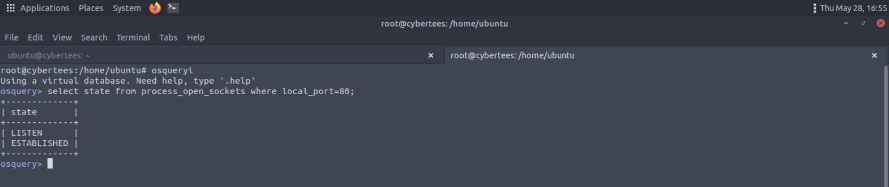

---

**Q: What is the state of the local port that is listening on port 80?**
```
established
```

---

## Task 8 — TTP Footprints on Disk

Beyond volatile memory, attackers leave footprints on disk: dropped files, modified binaries, hidden executables, installed packages, and log files created by their tooling.

### All Open Files

```sql
SELECT pid, fd, path FROM process_open_files;
```

### Files Open from /tmp

```sql
SELECT pid, fd, path FROM process_open_files WHERE path LIKE '/tmp/%';
```

Cross-reference a suspicious PID back to its process:

```sql
SELECT pid, name, path FROM processes WHERE pid = '556';
```

> 🔴 **Malware relevance:** Process masquerading — naming malware to resemble legitimate system binaries (e.g. `sshdd` mimicking `sshd`) — is a common evasion technique seen in APT tooling.

### Hidden Files in Root Directory

```sql
SELECT filename, path, directory, size, type FROM file WHERE path LIKE '/.%';
```

### Recently Modified Files in /etc

```sql
SELECT filename, path, directory, type, size FROM file
WHERE path LIKE '/etc/%' AND (mtime > (strftime('%s', 'now') - 86400));
```

### Recently Modified Binaries in /opt or /bin

```sql
SELECT filename, path, directory, mtime FROM file
WHERE path LIKE '/opt/%' OR path LIKE '/bin/' AND (mtime > (strftime('%s', 'now') - 86400));
```

### Suspicious Installed Packages

```bash
grep " install " /var/log/dpkg.log
```

Then verify with:

```bash
dpkg -l | grep <package_name>
```

> 💡 **Tip:** `/var/log/dpkg.log` timestamps package installations — useful for correlating attacker activity with a timeline.

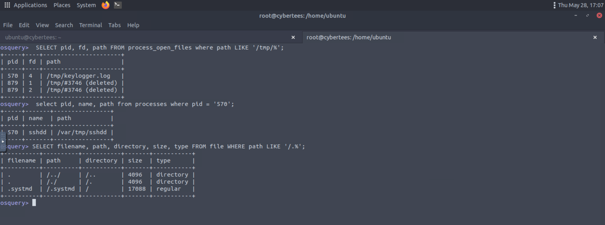

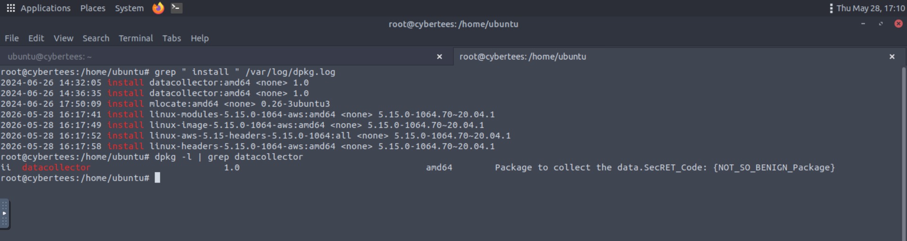

---

**Q: Investigate the opened files. What is the opened file associated with the suspicious process running on the system?**
```
keylogger.log
```

**Q: What is the name of the process that is associated with the suspicious file found in the above question?**
```
sshdd
```

**Q: What is the name of the hidden binary found in the root directory?**
```
.systmd
```

**Q: What is the name of the suspicious package installed on the host?**
```
datacollector
```

**Q: The suspicious package contains a secret code. What is the code hidden in the description?**
```
{NOT_SO_BENIGN_Package}
```

---

## Task 9 — Persistence: Establishing Foothold

After gaining access, attackers establish persistence to survive reboots and maintain control. This task covers the most common Linux persistence mechanisms.

### Systemd Services

Malicious services are commonly dropped into `/etc/systemd/system/`. Review the directory for anything that doesn't belong:

```bash
ls /etc/systemd/system/
```

Read the content of any suspicious service file:

```bash
cat /etc/systemd/system/<suspicious>.service
```

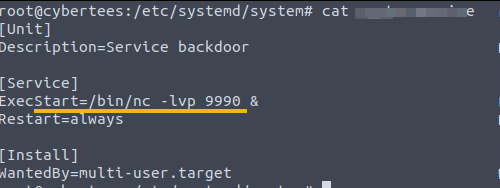

> 🔴 **Malware relevance:** Using `nc` (netcat) in a systemd service to open a persistent listening port is a classic backdoor technique — simple, effective, and surprisingly common in real-world incidents.

### Backdoor Accounts

```sql
SELECT username, directory FROM users;
```

Also check `/etc/passwd` directly:

```bash
cut -d: -f1 /etc/passwd
```

Accounts with home directories in `/home/` that don't correspond to legitimate users are immediate IOCs.

### Cron Jobs

```bash
crontab -l
```

Malicious cron jobs — particularly `@reboot` entries — ensure persistence across reboots by re-executing payloads each time the system starts.

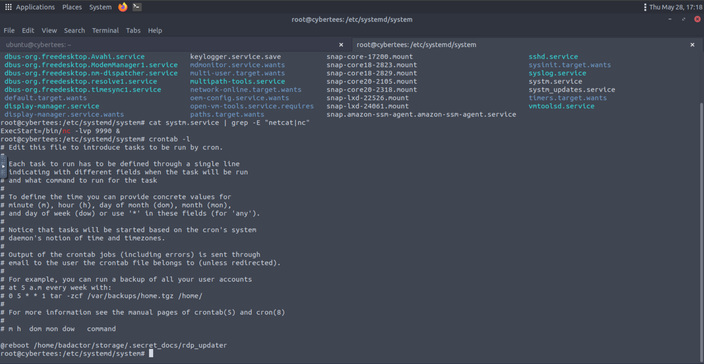

---

**Q: Which suspicious service was observed to be installed on this infected machine using netcat?**
```
systm.service
```

**Q: What is the full path of the process found in the cron table?**
```
/home/badactor/storage/.secret_docs/rdp_updater
```

---

## Task 10 — Conclusion

This room demonstrated a full live forensics workflow against a compromised Linux server. The attacker's TTPs uncovered during the investigation:

- **Backdoor account created** — `badactor` user added to the system
- **Persistence via systemd** — malicious services (`systm.service`) using netcat to open backdoor ports
- **Cron job persistence** — `@reboot` entry executing a hidden payload from the backdoor account's directory
- **Malware staged from /tmp** — `sshdd` running from `/var/tmp/`, masquerading as a system binary
- **Fileless process** — `.systm_updater` executing in memory with no on-disk binary
- **Keylogger active** — `sshdd` maintaining an open handle to `keylogger.log`
- **Hidden binary** — `.systmd` planted in the root directory
- **Suspicious package installed** — `datacollector` installed via dpkg

---

## Key Takeaways

- **Volatile data first** — processes, network connections, and open files vanish when the machine goes down; collect them before anything else
- **osquery is powerful** — SQL-like queries against OS tables make it easy to filter, join, and hunt across processes, files, users, and network state
- **Tmp directories are red flags** — processes executing from `/tmp` or `/var/tmp` are a consistent attacker pattern worth automating detection for
- **`on_disk = 0` is a strong signal** — fileless execution is designed to evade file-based detection; memory-resident processes with no backing file deserve immediate investigation
- **Masquerading is common** — `sshdd` vs `sshd`, `.systmd` vs `systemd` — attackers exploit name similarity to blend into process lists
- **Persistence is multi-layered** — check systemd services, cron jobs, and user accounts together; attackers often use multiple mechanisms simultaneously
- **Package logs don't lie** — `/var/log/dpkg.log` provides timestamped evidence of attacker-installed tooling

---

*Write-up by [OPT4RUN](https://tryhackme.com/p/OPT4RUN)*