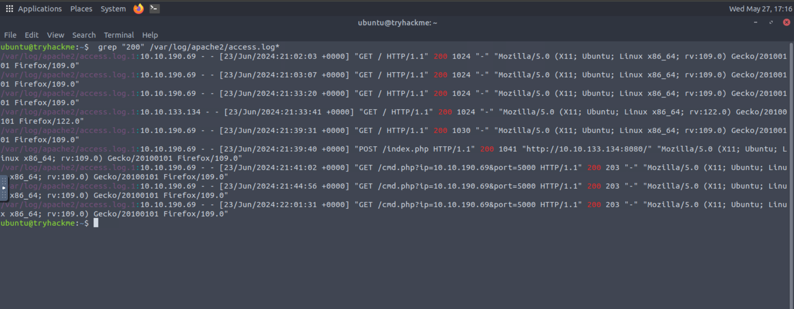
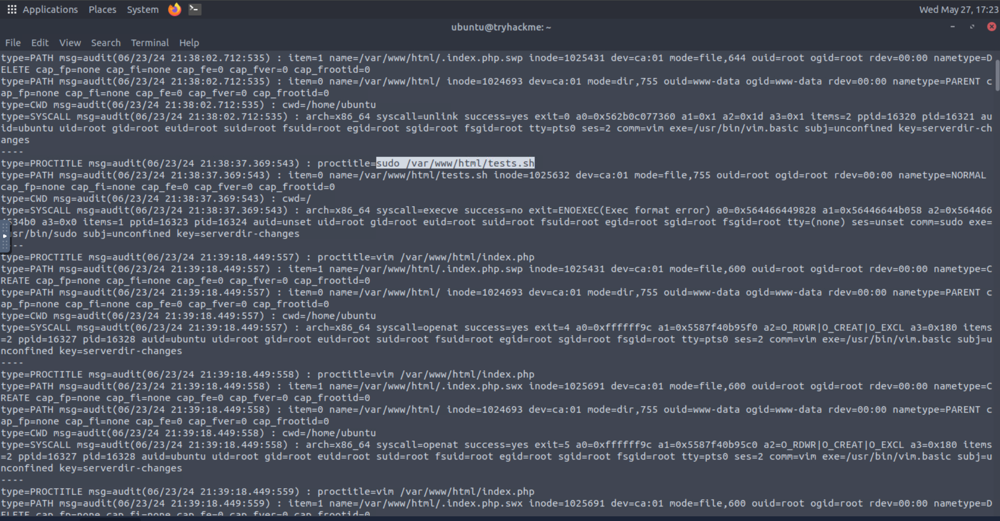
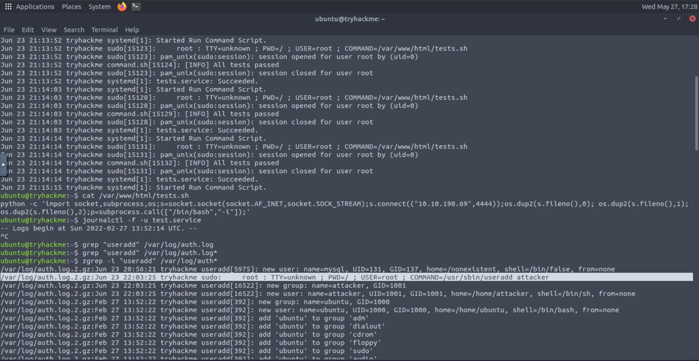

| Field | Details |
|-------|---------|
| **Room** | Linux Logs Investigations |
| **Platform** | TryHackMe |
| **Path** | Advanced Endpoint Investigations |
| **Module** | Linux Endpoint Investigation |
| **Difficulty** | Medium |
| **Category** | Digital Forensics / Incident Response |
| **Room Link** | [tryhackme.com/room/linuxlogsinvestigations](https://tryhackme.com/room/linuxlogsinvestigations) |
| **Author** | [OPT4RUN](https://tryhackme.com/p/OPT4RUN) |

---

## Overview

This room covers the Linux logging ecosystem from a DFIR perspective — not just where logs live, but how to extract meaningful signal from them during an investigation. It walks through the major log sources: kernel logs via `dmesg` and `kern.log`, user authentication via `auth.log`, syslog infrastructure, the `journalctl` interface for systemd journals, and `auditd` for granular syscall and file-access auditing. The room closes with a hands-on IR capstone involving initial access through a vulnerable Apache web app, privilege escalation via a compromised script, persistence through a malicious service, and backdoor account creation — all reconstructed purely from logs.

For blue teamers, this is core IR tradecraft: being able to reconstruct attacker activity from artifacts already present on the system, without needing EDR or a SIEM.

---

## Task 1 — Introduction

No questions. Sets up the room objectives: understanding log types, forensic log analysis for malicious processes/services/scripts, and a hands-on IR scenario.

---

## Task 2 — Logging Levels and Kernel Logs

### Logging Levels

Linux log messages are assigned severity levels that determine priority and filtering:

| Level | Description |
|-------|-------------|
| EMERGENCY | System unusable / crash |
| ALERT | Immediate action required |
| CRITICAL | Critical hardware or software errors |
| ERROR | Non-critical errors (failed drivers, etc.) |
| WARNING | Non-imminent errors — **the default display level** |
| NOTICE | Events worth reviewing |
| INFO | Informational system messages |
| DEBUG | Verbose output for troubleshooting/development |

### Kernel Logging

The kernel logs to a fixed-size in-memory **kernel ring buffer** during boot to avoid data loss. Once full, older entries are overwritten. Use `dmesg` to read it live, or `/var/log/kern.log` for the persistent on-disk version managed by `rsyslog`.

```bash
sudo dmesg              # read ring buffer
sudo dmesg -T           # human-readable timestamps
sudo dmesg -T | grep 'custom_kernel'   # hunt for specific module loads
```

> 💡 **Tip:** `dmesg -T | grep` is useful for hunting unsigned/out-of-tree kernel module loads — a classic rootkit indicator. Look for `loading out-of-tree module taints kernel` and `module verification failed`.

**Q: Which type of logs provide messages related to hardware events and system errors?**
```
kernel
```

**Q: What is the memory space used to store system messages?**
```
Kernel ring buffer
```

**Q: What is the default log level used to inform about non-imminent errors?**
```
warning
```

---

## Task 3 — Exploring the /var/log Directory

### Key Log Files

| File | Purpose |
|------|---------|
| `/var/log/kern.log` | Persistent kernel messages (managed by rsyslog) |
| `/var/log/dmesg` | Kernel messages from last boot |
| `/var/log/auth.log` | Authentication events — logins, sudo, SSH |
| `/var/log/syslog` | Catch-all for system-wide events (cron, daemon messages, etc.) |
| `/var/log/btmp` | **Failed** login attempts only (binary — read with `last -f`) |
| `/var/log/wtmp` | All login/logout activity (binary — read with `last -f`) |

```bash
sudo last -f /var/log/wtmp     # login/logout history
sudo last -f /var/log/btmp     # failed login attempts
grep 'CRON' /var/log/syslog    # cron job executions
grep 'Accepted password' /var/log/auth.log   # successful SSH logins
grep 'sudo' /var/log/auth.log               # elevated command executions
```

> 🔴 **Malware relevance:** Attackers often attempt SSH brute-force or credential stuffing as initial access. High volumes of entries in `/var/log/btmp` followed by a success in `auth.log` is a strong indicator of compromise.

**Q: Which log file can be used to record failed login attempts only?**
```
btmp
```

---

## Task 4 — User Logging with Syslog

### Syslog Evolution

| Daemon | Notes |
|--------|-------|
| `syslogd` | Original — basic capabilities |
| `syslog-ng` | Content-based filtering, TCP transport |
| `rsyslog` | Current standard — TLS, database output, modular |

Config is in `/etc/rsyslog.conf` and `/etc/rsyslog.d/50-default.conf`. Rules map facility.severity pairs to destination log files.

### Syslog Severity Levels

| Value | Severity | Keyword |
|-------|----------|---------|
| 0 | Emergency | emerg |
| 1 | Alert | alert |
| 2 | Critical | crit |
| 3 | Error | err |
| 4 | Warning | warning |
| 5 | Notice | notice |
| 6 | Informational | info |
| 7 | Debug | debug |

### Syslog Facility Codes (Selected)

| Code | Keyword | Facility |
|------|---------|----------|
| 0 | kern | Kernel messages |
| 1 | user | User-level messages |
| 3 | daemon | System daemons |
| 4 | auth | Authentication |
| 9 | cron | Cron subsystem |
| 10 | authpriv | Private auth messages |
| 16–23 | local0–local7 | Third-party/custom use |

### Message Format (RFC 5424)

Syslog messages consist of three parts:
- **PRI** — priority value (facility × 8 + severity)
- **Header** — timestamp, hostname, app name, process ID, message ID
- **MSG** — the actual event content

**Q: What severity level keyword is used to indicate immediate action is needed in a syslog message?**
```
alert
```

**Q: What facility code is used for cron jobs?**
```
9
```

---

## Task 5 — journalctl

### The systemd Journal

`journald` is the binary logging backend for systemd-based systems. Unlike traditional flat text logs, it stores structured, indexed entries — making filtering significantly faster. By default, journals are **volatile** (lost on reboot). To make them persistent, set `Storage=persistent` in `/etc/systemd/journald.conf` and restart the journal daemon.

### Common journalctl Flags

| Flag | Description | Example |
|------|-------------|---------|
| `-f` | Follow journal in real time | `journalctl -f` |
| `-k` | Kernel messages only | `journalctl -k` |
| `-b` | Specific boot | `journalctl -b -1` |
| `-u` | Filter by service unit | `journalctl -u apache2.service` |
| `-p` | Filter by priority level | `journalctl -p crit` |
| `-S` | Since a specific time | `journalctl -S "2024-06-01 00:00:00"` |
| `-U` | Until a specific time | `journalctl -U "2024-06-01 23:59:59"` |
| `-r` | Reverse order (newest first) | `journalctl -r` |
| `-n` | Limit output lines | `journalctl -n 50` |
| `--no-pager` | Disable pager for piping | `journalctl --no-pager` |

### Time Filtering

Supports both absolute and relative formats:

```bash
# Absolute range
sudo journalctl -S "2024-02-06 15:30:00" -U "2024-02-17 15:29:59"

# Relative
sudo journalctl -S "2 hours ago"
sudo journalctl -S "yesterday"
```

> 💡 **Tip:** Omitting the date defaults to today; omitting the time defaults to `00:00:00`. Use `-S today` to scope to current day fast.

**Q: To configure the persistence of journal logs, which parameter has to be modified within the journald configuration file?**
```
Storage
```

---

## Task 6 — Leveraging auditd for Security

### Overview

`auditd` is the user-space component of the Linux Audit System. It enables granular, rule-based monitoring of system calls, file access, user activity, and more. Rules defined in `/etc/audit/audit.rules` are persistent; rules added with `auditctl` are temporary (lost on reboot).

### Defining Rules

**Watch a file for read/write/attribute changes:**
```bash
sudo auditctl -w /etc/passwd -p wra -k users
```

**Monitor all execve syscalls (program execution):**
```bash
sudo auditctl -a always,exit -F arch=b64 -S execve -k execve_syscalls
```

Flags breakdown:
- `-w` — watch path
- `-p wra` — watch for write, read, attribute changes
- `-k` — tag events with a searchable key
- `-a always,exit` — audit context allocated at syscall start, filled at exit
- `-F arch=b64` — 64-bit architecture filter
- `-S execve` — target the execve syscall

### Querying Audit Logs

Audit logs are stored in `/var/log/audit/audit.log`. Query with `ausearch`:

```bash
sudo ausearch -k users                  # search by key
sudo ausearch -k execve_syscalls
sudo ausearch -i -k serverdir-changes   # -i decodes hex proctitle to ASCII
```

> 🔴 **Malware relevance:** The `-i` flag is essential — without it, `proctitle` values are hex-encoded and unreadable. Decoding them reveals the exact command the attacker ran.

### Generating Reports

```bash
sudo ausearch -k users | aureport -f user-logs
```

**Q: Which utility is used to search for auditd logs?**
```
ausearch
```

---

## Task 7 — Examining Auth Logs

### Structure

`/var/log/auth.log` records all authentication events: SSH logins, sudo executions, PAM session open/close, `su` attempts. Format per entry: `timestamp hostname service[pid]: message`.

Rotated logs are stored as `auth.log.1`, `auth.log.2.gz`, etc. Use `auth.log*` with grep or `zgrep` to cover historical logs including compressed archives.

### Key Filters

```bash
# Failed authentication attempts
sudo grep -i "failure" /var/log/auth.log*

# Session open events
sudo grep -i "session opened" /var/log/auth.log*

# Sudo usage
sudo grep "sudo" /var/log/auth.log*

# Successful SSH logins
grep 'Accepted password' /var/log/auth.log

# Filter by relative time
sudo grep "$(date --date='2 hours ago' '+%b %e %H:')" /var/log/auth.log*

# Filter by date range (awk)
sudo awk '/2024-06-04 15:30:00/,/2024-06-05 15:29:59/' /var/log/auth.log
```

> 💡 **Tip:** Grep for `Accepted password` + an unusual source IP or off-hours timestamp is a quick triage check for unauthorized SSH access.

**Q: What command can be used to search logs related to a session opened for a user?**
```
sudo grep -i "session opened" /var/log/auth.log
```

---

## Task 8 — Analysing Application Logs

### Apache2 Log Structure

Apache2 logs live in `/var/log/apache2/` with two primary files:

| File | Contents |
|------|----------|
| `access.log` | Client IP, method, URL, response code, user-agent, referrer |
| `error.log` | Server errors, PHP warnings, config issues |

Config is managed in `/etc/apache2/apache2.conf` or per virtual host in `/etc/apache2/sites-available/`.

### Filtering Access Logs

```bash
# All entries from a specific IP
grep "10.10.24.106" /var/log/apache2/access.log*

# All 404 responses
grep "404" /var/log/apache2/access.log*

# Request count per IP (descending)
awk '{print $1}' /var/log/apache2/access.log* | sort | uniq -c | sort -nr

# HTTP status code summary
awk '{print $9}' /var/log/apache2/access.log* | sort | uniq -c | sort -nr

# Error log grep
grep "error" /var/log/apache2/error.log*
```

> 🔴 **Malware relevance:** Access logs are critical for initial access reconstruction. Look for POST requests to `.php` files, unusual query parameters (e.g. `?cmd=`, `?ip=&port=`), and 200 responses to suspicious endpoints — these are common web shell and reverse shell indicators.

**Q: Which folder contains Apache2 logs?**
```
/var/log/apache2
```

---

## Task 9 — Linux Logs Capstone

IR scenario: A development server running Apache was exposed to the internet. Goal is to reconstruct the full attack chain from logs alone.

### Initial Access — Apache Access Logs

Filtering the Apache access logs for POST requests and suspicious PHP endpoints revealed a web shell (`cmd.php`) being used to initiate a reverse shell connection.



**Q: What is the IP address from which the application was exploited?**
```
10.10.190.69
```

**Q: What file contains the reverse shell?**
```
cmd.php
```

**Q: At which port was the reverse shell running?**
```
5000
```

---

### Privilege Escalation — auditd

Anna's `auditd` rule (`serverdir-changes`) was watching `/var/www/html` for changes. Querying it with `ausearch -i -k serverdir-changes` revealed that `tests.sh` — a script in the web root — was being executed with `sudo` by the web server process (`www-data`). This script had been backdoored by the attacker to achieve privilege escalation.



**Q: What is the file name that was being executed with sudo privileges?**
```
tests.sh
```

---

### Persistence — Malicious Service + New Account

Journal logs for `tests.service` confirmed the service was executing the compromised `tests.sh` on a schedule, providing persistent execution as root. The attacker then used this root access to create a backdoor user account via `useradd`, set a password, and added the account to the `sudo` group.

Auth log reconstruction using `zgrep` (to cover rotated/compressed logs) showed the full account creation sequence:

```
useradd attacker → passwd attacker → usermod -aG sudo attacker
```



**Q: What is the name of the user created using the service?**
```
attacker
```

**Q: Was the new account ever logged in to? (y/n)**
```
n
```

> No `session opened` events for user `attacker` were found across `auth.log*` — the account was created but never used before the server was isolated.

---

## Task 10 — Conclusion

No questions.

---

## Key Takeaways

- The **kernel ring buffer** (`dmesg`) is volatile and fixed-size — `kern.log` is the persistent equivalent managed by rsyslog. Unsigned module loads tainting the kernel are a rootkit indicator.
- `/var/log/auth.log` is your primary source for authentication forensics — SSH logins, sudo usage, su attempts, and PAM session events. Always include rotated logs (`auth.log*`) and use `zgrep` for compressed archives.
- **syslog** facility and severity levels together define message routing. Understanding PRI values helps when parsing raw syslog streams or SIEM ingestion pipelines.
- **journalctl** is the modern interface for structured systemd logs. The `-S`/`-U` time filters and `-u` unit filters make scoping investigations to specific services fast and precise.
- **auditd** provides kernel-level telemetry that user-space logs can't: syscall monitoring, file access attribution, and process lineage. The `-i` flag on `ausearch` is essential for decoding hex-encoded proctitle values.
- In incident response, the Apache access log + auditd + auth.log combination is often sufficient to reconstruct the full attack chain: initial access → execution → privilege escalation → persistence → account creation.
- `btmp`/`wtmp` are binary files — always use `last -f` to read them. Don't `cat` them directly.

---

*Write-up by [OPT4RUN](https://tryhackme.com/p/OPT4RUN)*