# MBR and GPT Analysis

| Field | Details |
|-------|---------|
| **Platform** | TryHackMe |
| **Path** | Advanced Endpoint Investigations |
| **Module** | File System Analysis |
| **Difficulty** | Medium |
| **Category** | Digital Forensics |
| **Room Link** | [tryhackme.com/room/mbrandgptanalysis](https://tryhackme.com/room/mbrandgptanalysis) |
| **Author** | [OPT4RUN](https://tryhackme.com/p/OPT4RUN) |

---

## Overview

Every disk has a map. Before the OS loads, before drivers initialize, before a single user process runs — the firmware reads either an MBR or a GPT from the very first sector of the disk to understand the partition layout and locate the bootloader. This makes the boot record one of the most forensically significant and attack-targeted areas of any endpoint.

This room covers the full boot process from power-on to OS handoff, the byte-level structure of both MBR and GPT, the threat landscape targeting each (bootkits, ransomware, wiper malware), and two hands-on practical scenarios: recovering a corrupted MBR and analyzing a tampered UEFI bootloader file.

From a SOC/endpoint forensics perspective, understanding these structures is essential for:
- Identifying bootkit infections that survive OS reinstallation
- Recovering systems with deliberately corrupted boot records
- Recognizing tampered `.efi` files in UEFI environments
- Conducting partition-level data carving from raw disk images

---

## Task 1 — Introduction

A disk is logically divided into **partitions** — isolated sections each serving a specific purpose (OS files, user data, recovery, etc.). In Windows these appear as drive letters (C:, D:, etc.). The computer needs a map to understand where each partition starts and ends, and what it contains. This map is either the **MBR** (Master Boot Record) or the **GPT** (GUID Partition Table), both located in the first sector of the disk.

Because the MBR/GPT executes before the OS, it is an attractive target. Malware that embeds itself here — known as a **bootkit** — can survive full OS reinstallation and evade most endpoint security tools.

**Q: What are the separate sections on a disk known as?**
```
partitions
```

**Q: Which type of malware infects the boot process?**
```
bootkits
```

---

## Task 2 — Boot Process

The boot process follows a fixed sequence before any OS code runs. Understanding this sequence is fundamental to understanding where MBR/GPT fits in and why tampering at this level is so impactful.

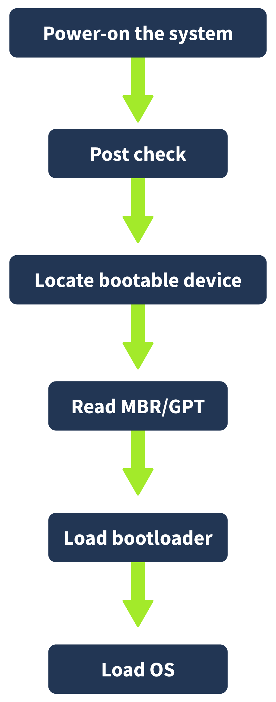

### Power-On

When the power button is pressed, the CPU immediately fetches and executes instructions from the **BIOS** or **UEFI** firmware chip on the motherboard.

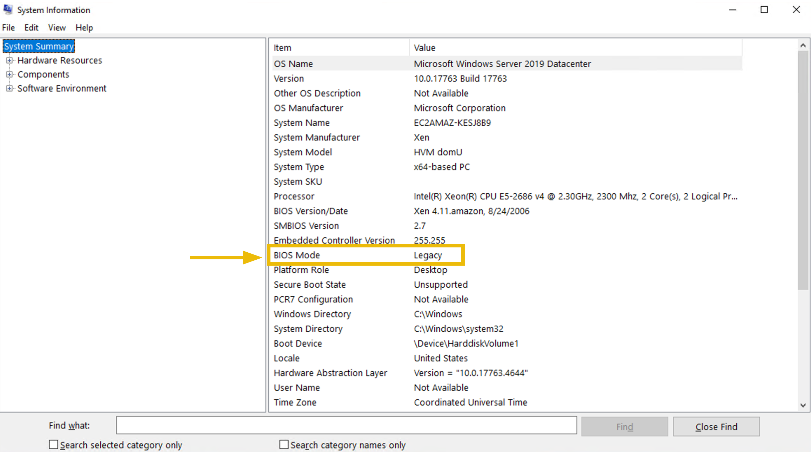

| Firmware | Mode | Max Disk Size | Partitioning Scheme |
|----------|------|--------------|---------------------|
| **BIOS** | 16-bit | 2 TB | MBR |
| **UEFI** | 32/64-bit | 9 ZB | GPT |

To check which firmware your Windows system uses: `Win+R` → `msinfo32` → look at **BIOS Mode** (Legacy = BIOS, UEFI = UEFI).

### POST (Power-On-Self-Test)

BIOS/UEFI runs a hardware diagnostic to verify all components are functional. Errors are communicated via beep codes or on-screen messages.

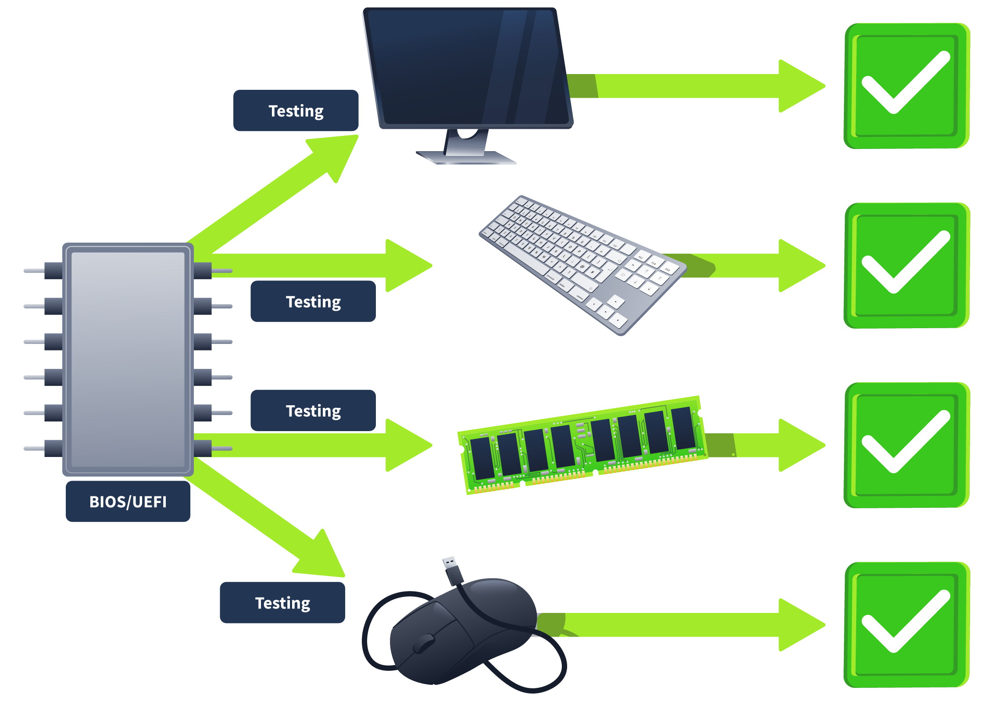

### Locate the Bootable Device

Once POST passes, BIOS/UEFI scans configured boot devices (HDD, SSD, USB) for a bootable disk. The first sector of the located device will contain either the MBR or GPT, which then takes over the rest of the boot process.

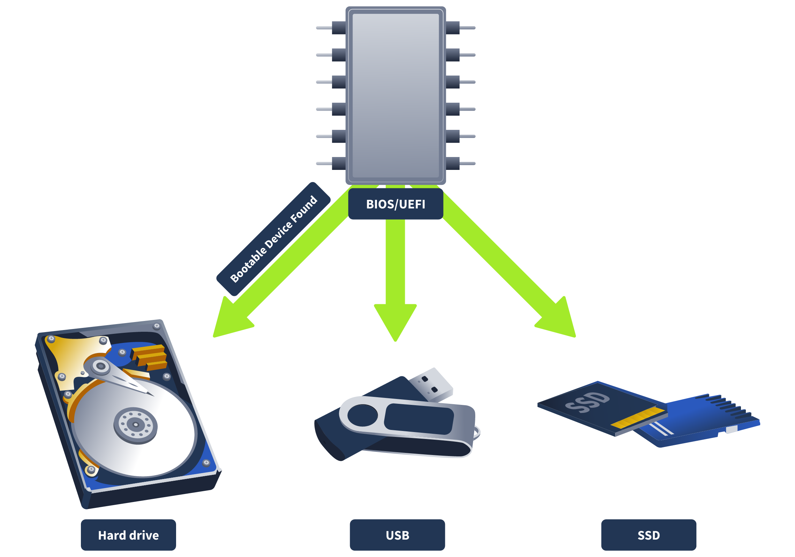

> 💡 **Tip:** To check your disk's partition scheme in Windows PowerShell: `Get-Disk`

**Q: What is the name of the hardware diagnostic check performed during the boot process?**
```
Power-On-Self-Test
```

**Q: Which firmware supports a GPT partitioning scheme?**
```
UEFI
```

**Q: Which device has the operating system to boot the system?**
```
bootable device
```

---

## Task 3 — What if MBR?

### Opening the MBR in HxD

The MBR file is extracted from the disk image and located at `C:\Analysis\MBR`. Open it in HxD via `File → Open`.

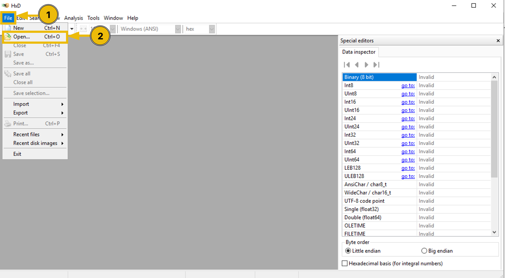

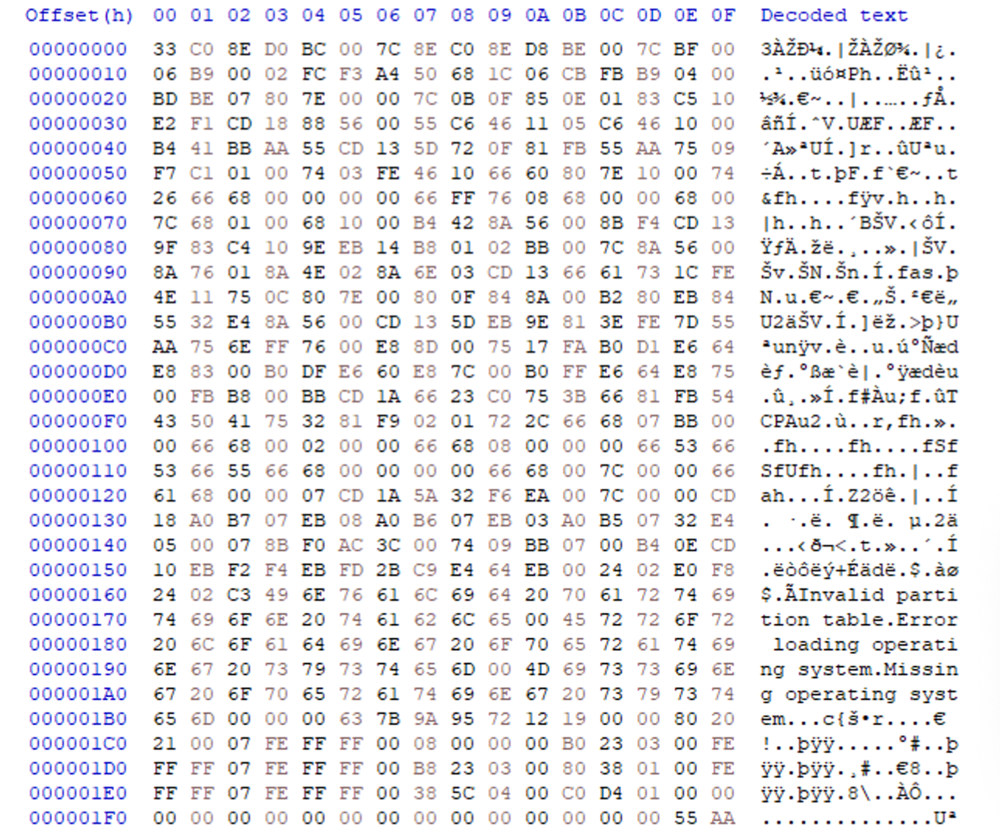

The MBR occupies exactly **512 bytes** — the first sector of the disk. In HxD, that's the first **32 rows** (16 bytes per row). The end of the MBR is always marked by the signature `55 AA`.

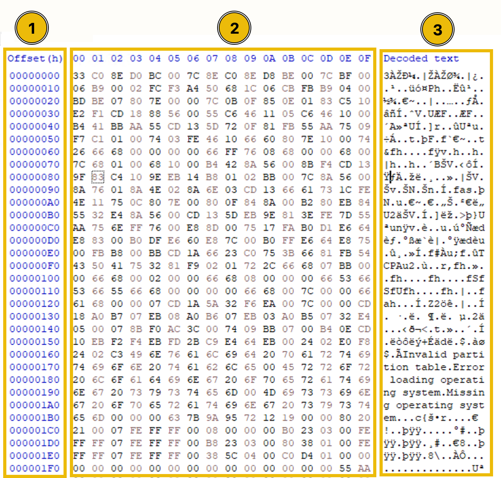

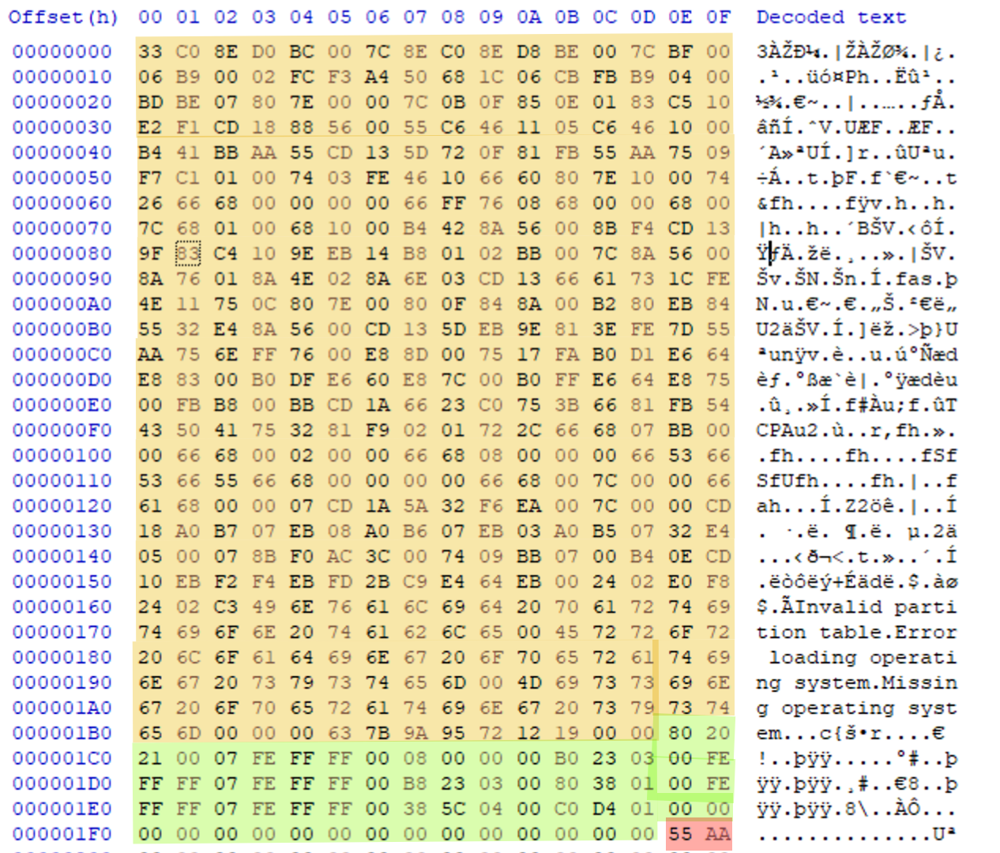

### MBR Structure

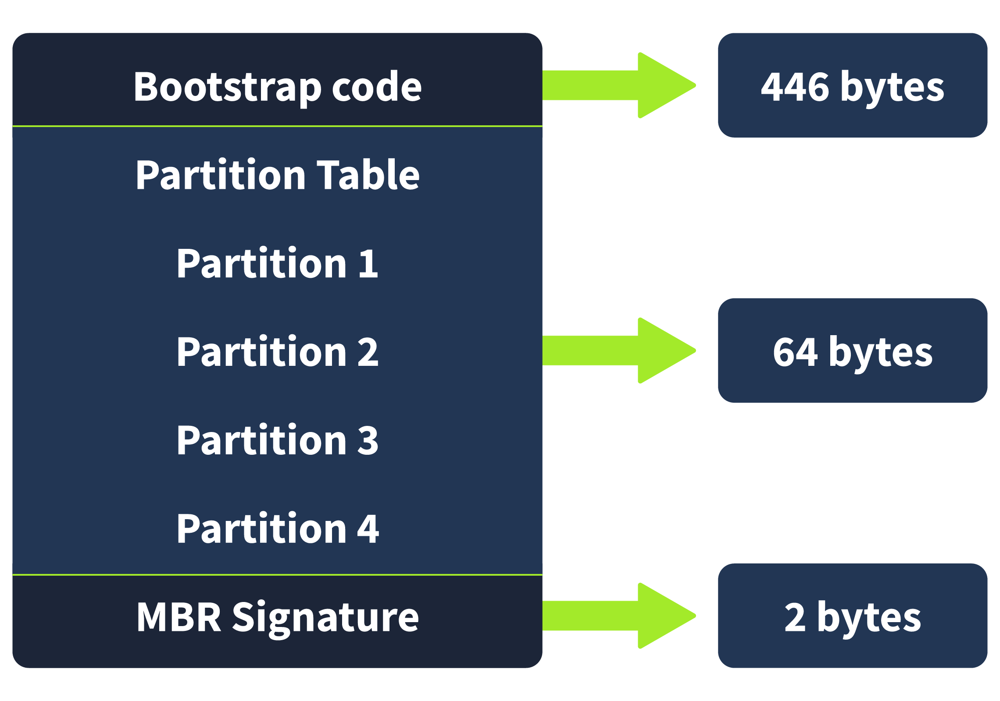

The 512 bytes are split into three sections:

| Section | Bytes | Size |
|---------|-------|------|
| Bootloader Code | 0–445 | 446 bytes |
| Partition Table | 446–509 | 64 bytes |
| MBR Signature | 510–511 | 2 bytes |

---

### 1. Bootloader Code (Bytes 0–445)

The first 446 bytes contain the **Initial Bootloader** — the first code executed by the CPU from the disk. Its job is to locate the bootable partition in the partition table and hand execution off to the second-stage bootloader stored there.

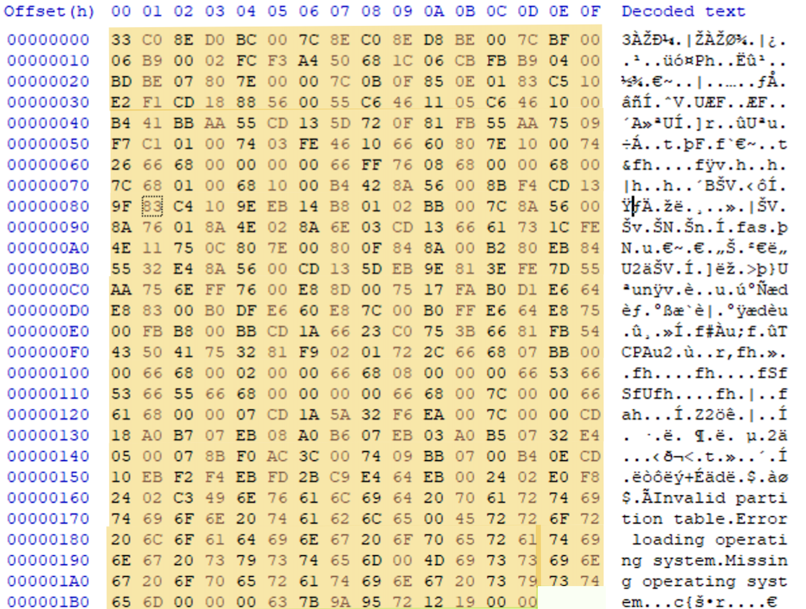

> 🔴 **Malware relevance:** Bootkits and wiper malware (e.g., Shamoon, Bad Rabbit) overwrite or replace this section. Since it executes before the OS, any code placed here runs outside the reach of AV/EDR tools.

---

### 2. Partition Table (Bytes 446–509)

64 bytes divided into **4 × 16-byte entries**, one per partition.

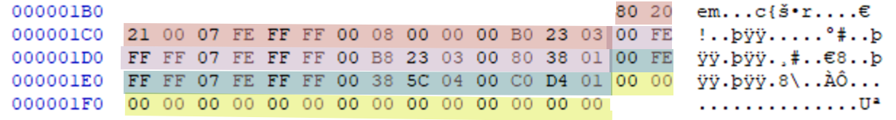

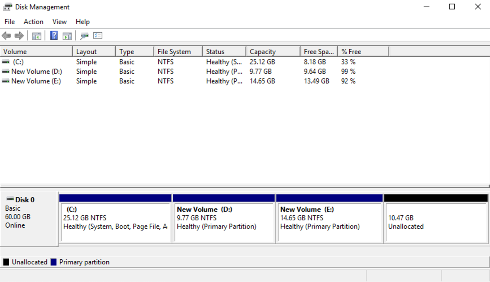

#### Partition Entry Structure

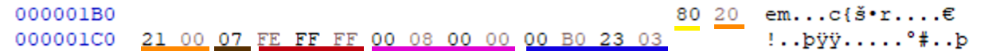

| Bytes | Length | Example Value | Field |
|-------|--------|--------------|-------|
| 0 | 1 | `80` | Boot Indicator |
| 1–3 | 3 | `20 21 00` | Starting CHS Address |
| 4 | 1 | `07` | Partition Type |
| 5–7 | 3 | `FE FF FF` | Ending CHS Address |
| 8–11 | 4 | `00 08 00 00` | Starting LBA Address |
| 12–15 | 4 | `00 B0 23 03` | Number of Sectors |

**Key fields explained:**

- **Boot Indicator:** `80` = bootable (typically C: on Windows), `00` = not bootable.
- **Partition Type:** Single byte filesystem identifier. `07` = NTFS. Reference: [MBR/GPT cheatsheet](https://www.writeblocked.org/resources/MBR_GPT_cheatsheet.pdf)
- **Starting LBA:** Logical address of partition start. Used to locate the partition in the hex editor.
- **Number of Sectors:** Used to calculate partition size.

#### Locating a Partition via Starting LBA

Starting LBA bytes are stored in **little-endian** format — reverse them first.

`00 08 00 00` → reversed → `00 00 08 00` → decimal: **2048**

`2048 × 512 = 1,048,576` (byte offset to jump to in HxD via `Search → Go to`)

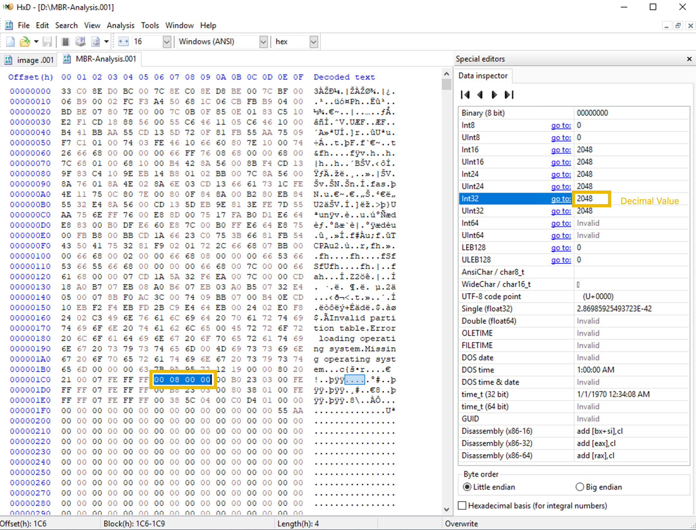

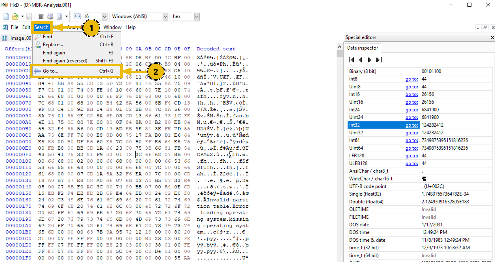

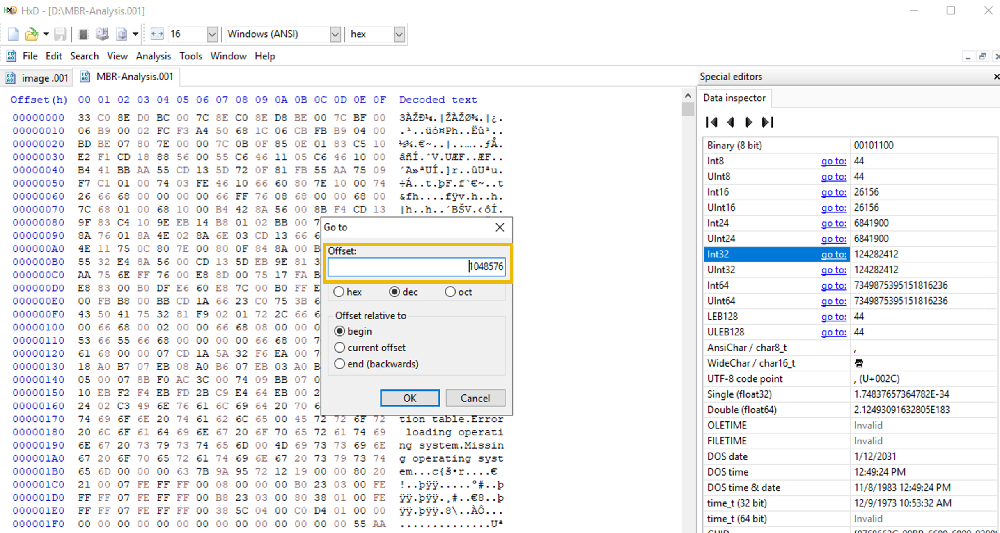

#### Calculating Partition Size

Number of Sectors bytes: `00 B0 23 03` → reversed → `03 23 B0 00` → decimal: **52,670,464**

`52,670,464 × 512 = 26,967,277,568 bytes (~27 GB)`

---

### 3. MBR Signature (Bytes 510–511)

The final two bytes of every valid MBR are `55 AA` — also called the **Magic Number**. If these bytes are altered or corrupted, the system will not boot.

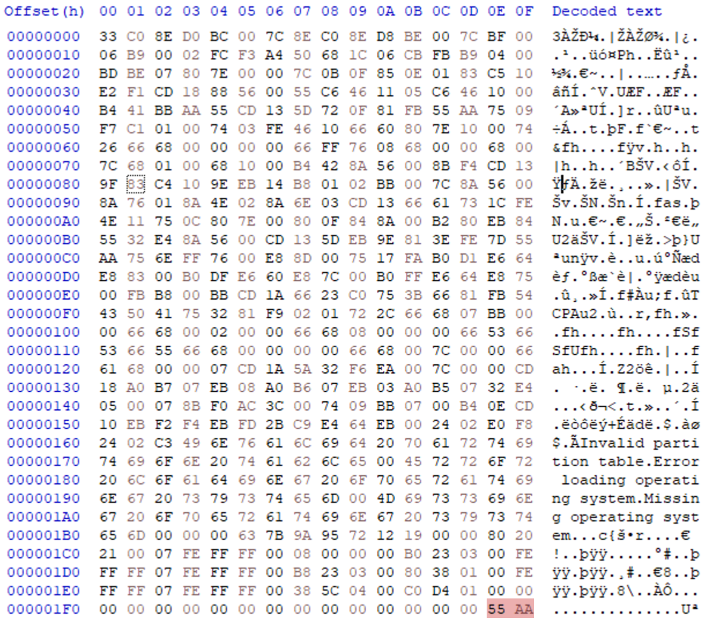

> 🔴 **Malware relevance:** Corrupting the MBR signature is a trivial denial-of-service attack on the boot process. It's one of the two corruptions investigated in Task 5.

#### Task 3 Practical — Size of 2nd Partition

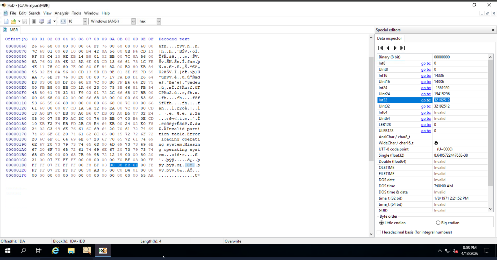

Locate the second 16-byte partition entry in the table, extract the Number of Sectors bytes, reverse (little-endian), convert to decimal, multiply by 512, and convert to GB.

**Q: Which component of the MBR contains the details of all the partitions present on the disk?**
```
partition table
```

**Q: What is the standard sector size of a disk in bytes?**
```
512
```

**Q: Which component of the MBR is responsible for finding the bootable partition?**
```
bootloader code
```

**Q: What is the magic number inside the MBR?**
```
55 AA
```

**Q: What is the maximum number of partitions MBR can support?**
```
4
```

**Q: What is the size of the second partition in the MBR file found in `C:\Analysis\MBR\`? (rounded to the nearest GB)**
```
16
```

---

## Task 4 — Threats Targeting MBR

The 512 bytes of the MBR are one of the highest-value targets on any disk. Three primary malware categories exploit this:

| Malware Type | Technique | Examples |
|-------------|-----------|---------|
| **Bootkit** | Embeds malicious code into bootloader section; executes before OS loads; survives reinstallation | TDL4, Rovnix |
| **Ransomware** | Overwrites MBR with custom bootloader that displays ransom note; system unusable without paying | Petya (2016), Bad Rabbit |
| **Wiper Malware** | Overwrites MBR with random/null bytes to permanently brick the system | Shamoon, HermeticWiper |

> 🔴 **Malware relevance:** Petya is a landmark case — instead of encrypting individual files (slow, detectable), it encrypted the MBR and displayed a ransom note on boot. This approach encrypts the entire disk's access point in seconds.

---

## Task 5 — MBR Tampering Case (Practical)

### Scenario

A database server became unbootable after an employee opened a malicious email attachment. The malware corrupted two components of the MBR:
1. The **Starting LBA address** of the first partition (should be `00 08 00 00`)
2. The **MBR Signature** (should be `55 AA`)

The task requires identifying and fixing both corruptions in HxD, then verifying the fix in FTK Imager.

### Workflow

**Step 1 — Open corrupted disk image in HxD**

`C:\Analysis\MBR_Corrupted_Disk.001`

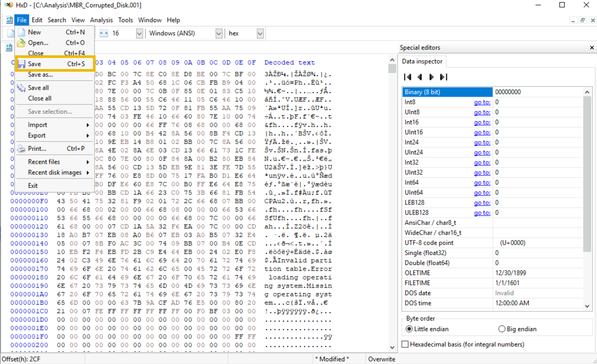

**Step 2 — Fix in HxD, save changes**

After correcting both corrupted byte sequences, save via `File → Save`. If HxD reports insufficient space for backup, click **Yes** to save anyway.

**Step 3 — Load in FTK Imager to verify**

`File → Add Evidence Item → Image File → C:\Analysis\MBR_Corrupted_Disk.001`

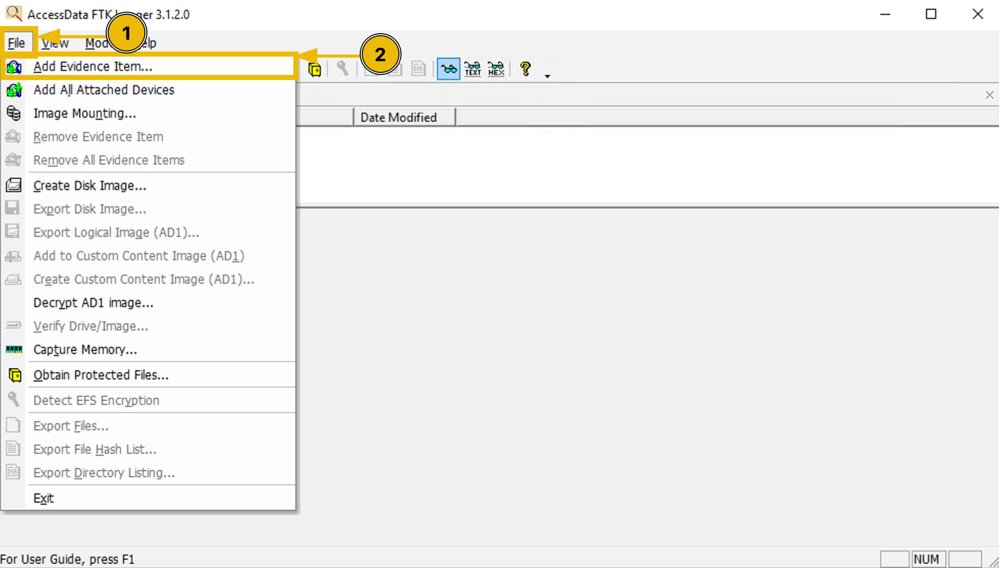

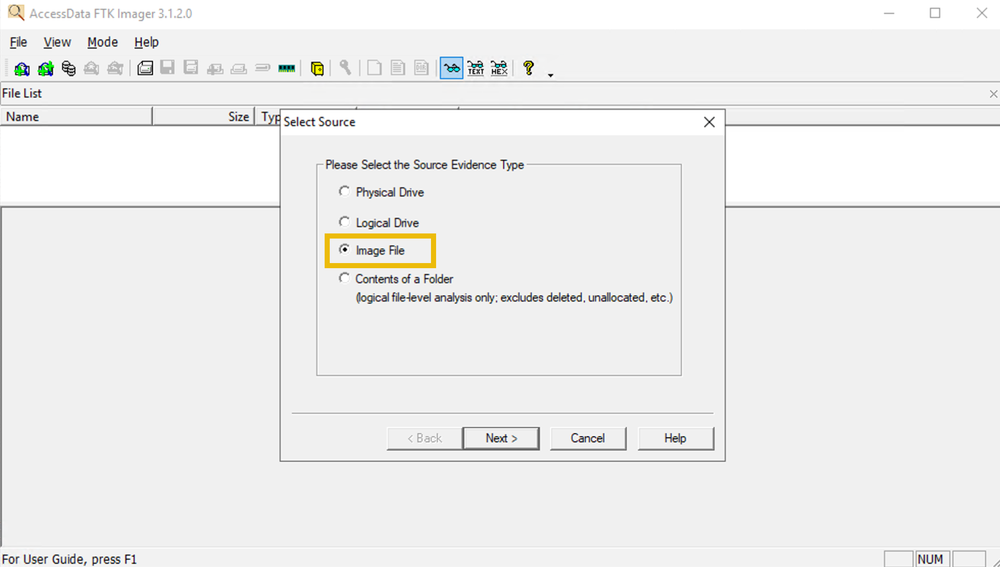

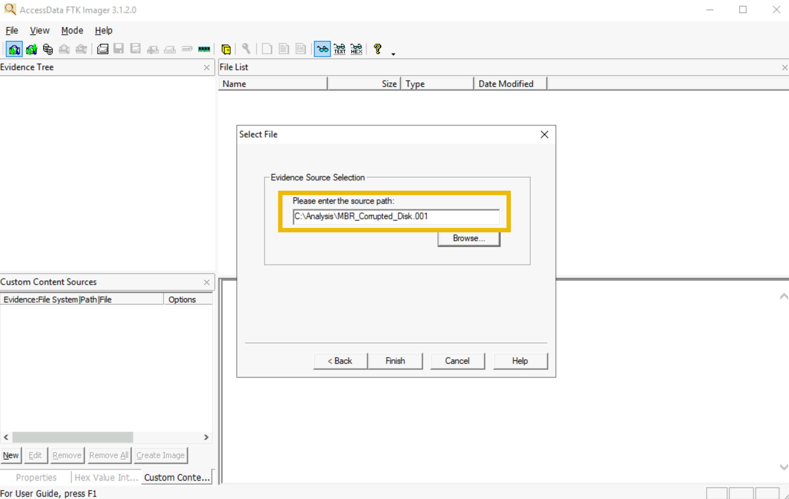

Before the fix: FTK Imager shows **"Unrecognized file system"**. After fixing both corruptions and reloading, the partition contents become accessible.

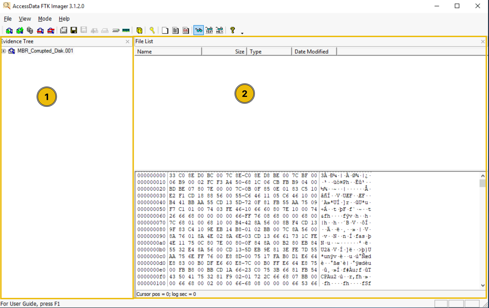

---

### Analysis Results

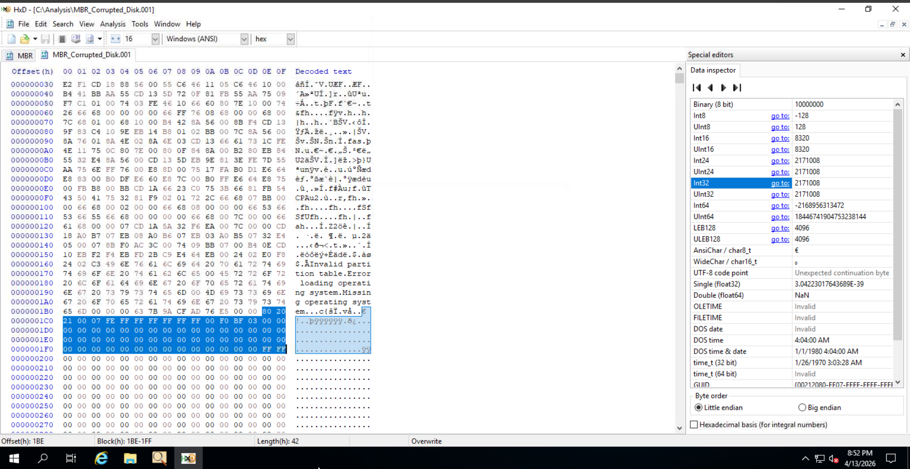

Only one partition entry contains non-zero values — the other three entries are all zeros, confirming a single-partition disk. The partition type byte is `07` (NTFS). The Number of Sectors field, reversed from little-endian, converted to decimal, and multiplied by 512 yields ~32 GB.

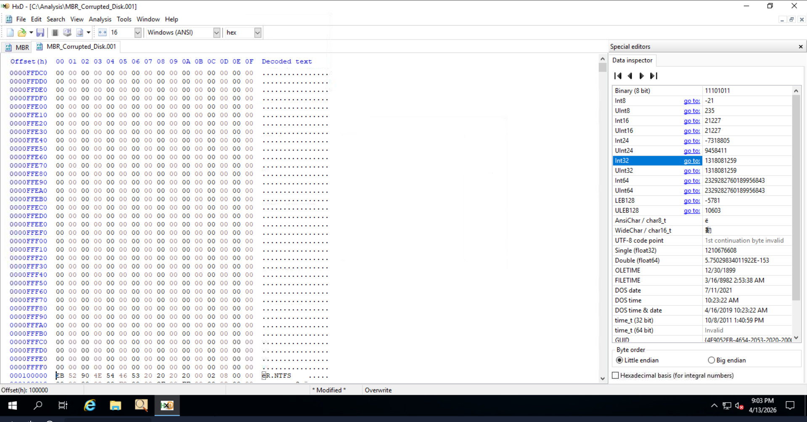

After jumping to the Starting LBA offset (using the corrected `00 08 00 00` → 2048 × 512 = 1,048,576), the first byte visible is `EB` — the standard x86 jump instruction that begins the NTFS boot sector.

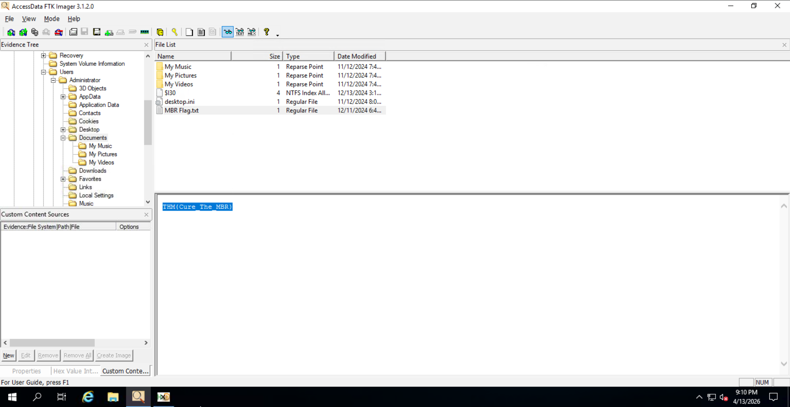

After the MBR is repaired and the disk loads in FTK Imager, navigating to `Administrator\Documents` reveals the flag.

**Q: How many partitions are on the disk?**
```
1
```

**Q: What is the first byte at the starting LBA of the partition? (represented by two hexadecimal digits)**
```
EB
```

**Q: What is the type of the partition?**
```
NTFS
```

**Q: What is the size of the partition? (rounded to the nearest GB)**
```
32
```

**Q: What is the flag hidden in the Administrator's Documents folder?**
```
THM{Cure_The_MBR}
```

---

## Task 6 — What if GPT?

GPT replaced MBR as the standard partitioning scheme on modern systems using UEFI firmware. Key improvements:

| Property | MBR | GPT |
|----------|-----|-----|
| Max disk size | 2 TB | 9 ZB |
| Max partitions | 4 | 128 |
| Redundancy | None | Backup header + backup partition array |
| Firmware | BIOS | UEFI |
| Bootloader location | MBR bootloader code | EFI System Partition (.efi files) |

The GPT file for this task is at `C:\Analysis\GPT`.

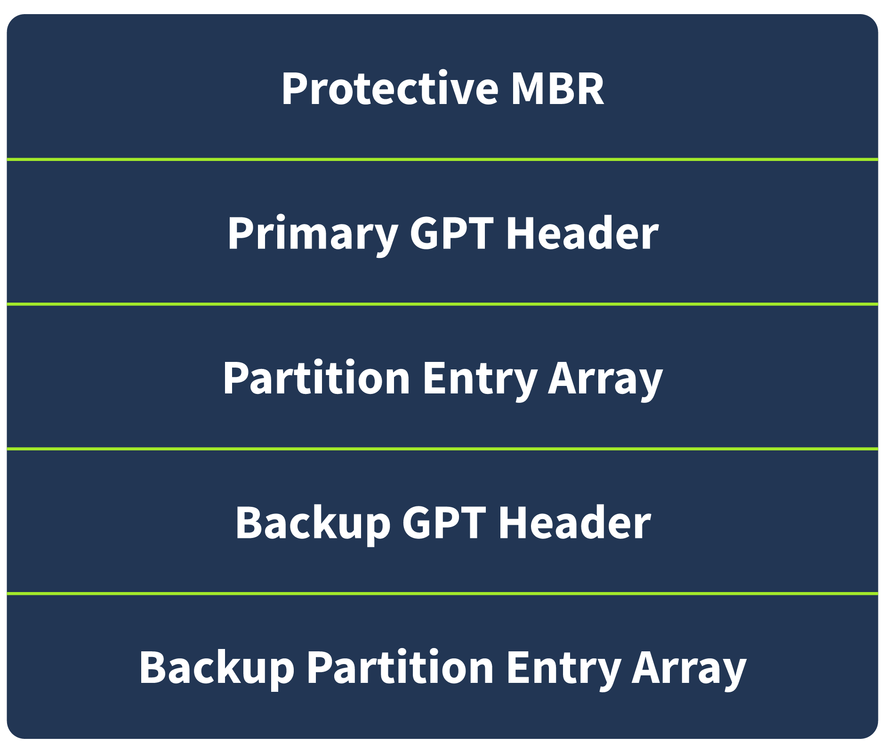

### GPT Structure (5 Components)

```
Sector 0   → Protective MBR
Sector 1   → Primary GPT Header
Sectors 2+ → Partition Entry Array
...
Last -1    → Backup Partition Entry Array
Last       → Backup GPT Header
```

---

### Component 1: Protective MBR (Sector 0)

Occupies sector 0 — exists solely for backward compatibility with BIOS systems.

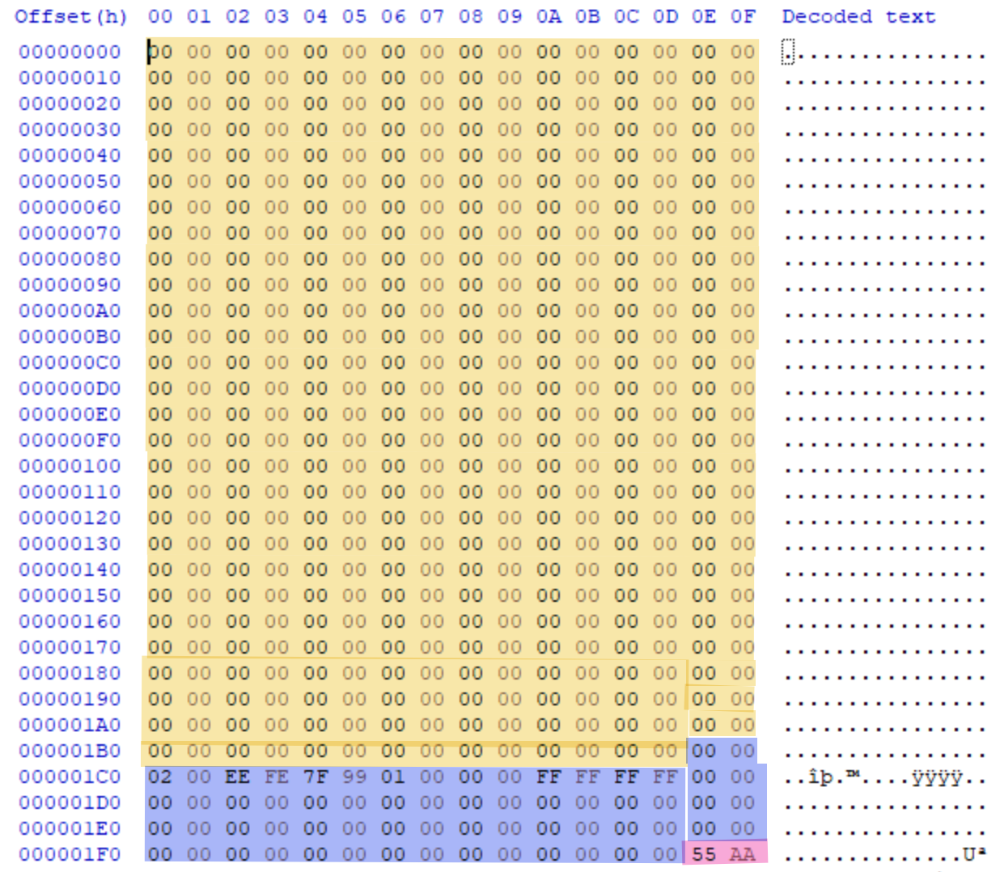

The structure mirrors the standard MBR (bootloader code, partition table, `55 AA` signature) but with critical differences:
- **Bootloader code** is non-functional (all `00`s or legacy placeholder)
- **Partition table** has only one entry; the remaining three are zeroed
- The **4th byte of that single partition entry** is set to `EE` — this signals to any BIOS firmware that the disk is GPT-formatted and should not be treated as MBR

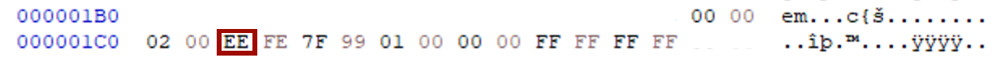

---

### Component 2: Primary GPT Header (Sector 1)

92 bytes of meaningful data, padded with `00`s to fill the 512-byte sector.

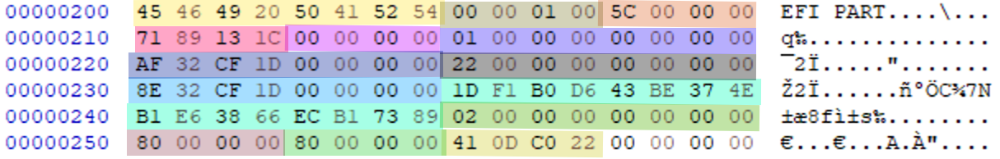

| Bytes | Length | Example | Field |
|-------|--------|---------|-------|
| 0–7 | 8 | `45 46 49 20 50 41 52 54` | Signature ("EFI PART") |
| 8–11 | 4 | `00 00 01 00` | Revision (1.0) |
| 12–15 | 4 | `5C 00 00 00` | Header Size (92 bytes) |
| 16–19 | 4 | `71 89 13 1C` | CRC32 of Header |
| 20–23 | 4 | `00 00 00 00` | Reserved |
| 24–31 | 8 | `01 00 00 00 00 00 00 00` | Current LBA |
| 32–39 | 8 | `AF 32 CF 1D 00 00 00 00` | Backup LBA |
| 40–47 | 8 | `22 00 00 00 00 00 00 00` | First Usable LBA |
| 48–55 | 8 | `8E 32 CF 1D 00 00 00 00` | Last Usable LBA |
| 56–71 | 16 | `1D F1 B0 D6 ...` | Disk GUID |
| 72–79 | 8 | `02 00 00 00 00 00 00 00` | Partition Entry Array LBA |
| 80–83 | 4 | `80 00 00 00` | Number of Partition Entries (128) |
| 84–87 | 4 | `80 00 00 00` | Size of Each Partition Entry (128 bytes) |
| 88–91 | 4 | `41 0D C0 22` | CRC32 of Partition Array |

> 🔴 **Malware relevance:** The CRC32 fields are forensic integrity indicators. A modified CRC32 of Header or Partition Array immediately signals tampering or corruption.

**Disk GUID conversion example:**
Bytes `1D F1 B0 D6 43 BE 37 4E B1 E6 38 66 EC B1 73 89` → `1DF1B0D6-43BE-374E-B1E6-3866ECB17389`

---

### Component 3: Partition Entry Array (Sectors 2+)

128 partition entries × 128 bytes each. Unused entries are zeroed.

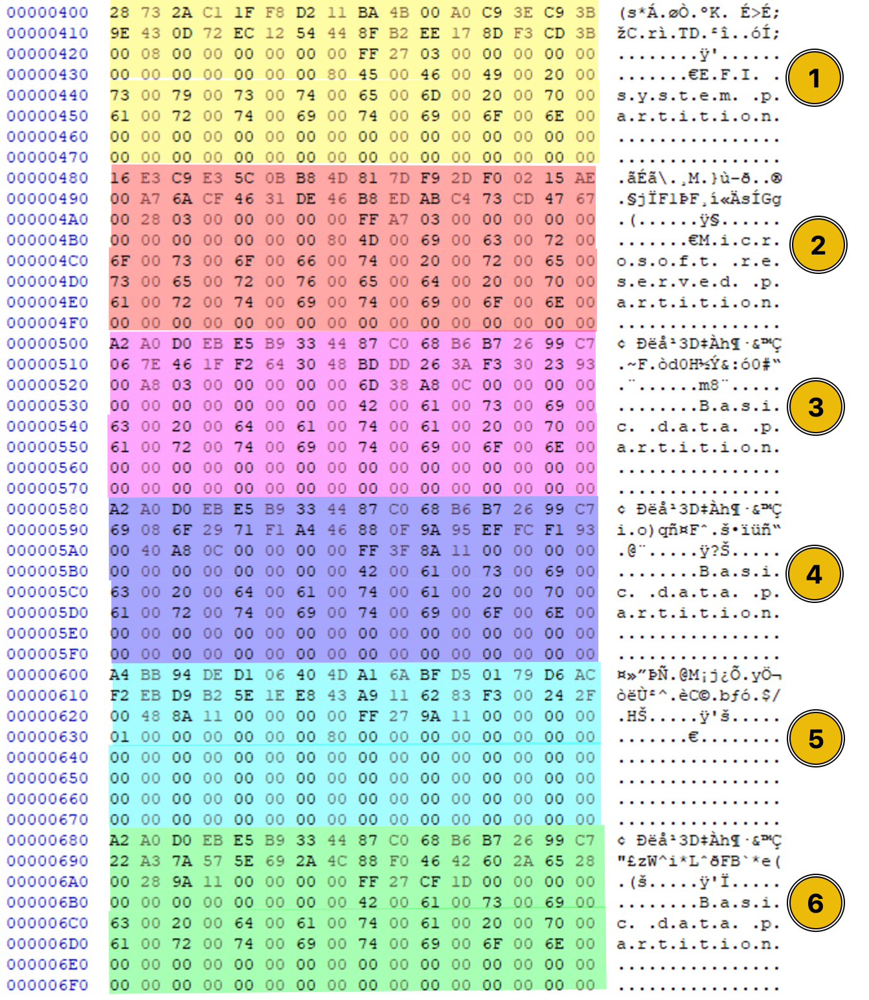

#### Partition Entry Structure

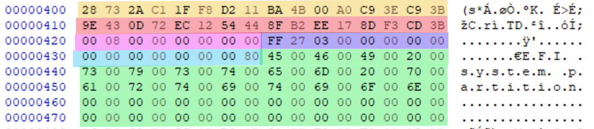

| Bytes | Length | Field |
|-------|--------|-------|
| 0–15 | 16 | Partition Type GUID |
| 16–31 | 16 | Unique Partition GUID |
| 32–39 | 8 | Starting LBA |
| 40–47 | 8 | Ending LBA |
| 48–55 | 8 | Attributes |
| 56–127 | 72 | Partition Name (UTF-16) |

**Partition Type GUID decoding (mixed-endian):**

For bytes `28 73 2A C1 1F F8 D2 11 BA 4B 00 A0 C9 3E C9 3B`:
1. Reverse bytes 0–3: `28 73 2A C1` → `C1 2A 73 28`
2. Reverse bytes 4–5: `1F F8` → `F8 1F`
3. Reverse bytes 6–7: `D2 11` → `11 D2`
4. Keep bytes 8–9 as-is: `BA 4B`
5. Keep bytes 10–15 as-is: `00 A0 C9 3E C9 3B`

Result: `C12A7328-F81F-11D2-BA4B-00A0C93EC93B` → **EFI System Partition (ESP)**

> 🔴 **Malware relevance:** The EFI System Partition is where all UEFI bootloaders (`.efi` files) live. This is the primary bootkit target in UEFI systems — see Task 8.

**Components 4 & 5 — Backup GPT Header + Backup Partition Entry Array:**

Stored at the last two locations of the disk. Identical copies of the primary components — GPT's key reliability advantage over MBR.

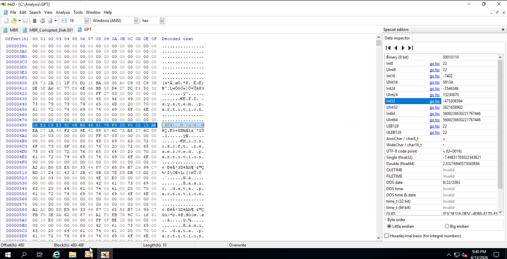

**Q: How many partitions are supported by the GPT?**
```
128
```

**Q: What is the partition type GUID of the 2nd partition given in the attached GPT file?**
```
E3C9E316-0B5C-4DB8-817D-F92DF00215AE
```

---

## Task 7 — Threats Targeting GPT

GPT's redundancy (backup header + backup partition array) makes it harder to permanently corrupt compared to MBR. However, sophisticated attackers have adapted:

| Malware Type | GPT Attack Vector | Mitigation |
|-------------|-------------------|------------|
| **Bootkit** | Replaces `.efi` bootloader files in ESP with malicious versions | UEFI Secure Boot (verifies digital signatures of `.efi` files) |
| **Ransomware** | Encrypts the EFI System Partition to block boot | Secure Boot; monitored ESP access |
| **Wiper Malware** | Targets both primary AND backup GPT header + partition array simultaneously | Offline backups; integrity monitoring |

> 🔴 **Malware relevance:** Secure Boot is the frontline defence against ESP-targeting bootkits. In a DFIR context, a disabled Secure Boot setting on a UEFI system is a significant red flag and should always be noted during initial triage.

---

## Task 8 — UEFI Bootkit Case (Practical)

### Background

In UEFI systems, the bootloader lives in the **EFI System Partition** as `.efi` extension files (`bootmgr.efi`, `bootx64.efi`, etc.). If Secure Boot is disabled, an attacker can replace these files with malicious versions — a UEFI bootkit. Unlike MBR bootkits, UEFI bootkits can survive firmware updates and are exceptionally difficult to remove.

### Scenario

A bootkit was detected on a Windows server. Before full execution, it embedded an encoded string in the unused header space of `bootmgr.efi`. The file is at `C:\Analysis\bootmgr.efi`.

### Analysis

Open `bootmgr.efi` in HxD. The initial unused bytes before the actual EFI code begins contain anomalous data. The embedded content is Base64-encoded.

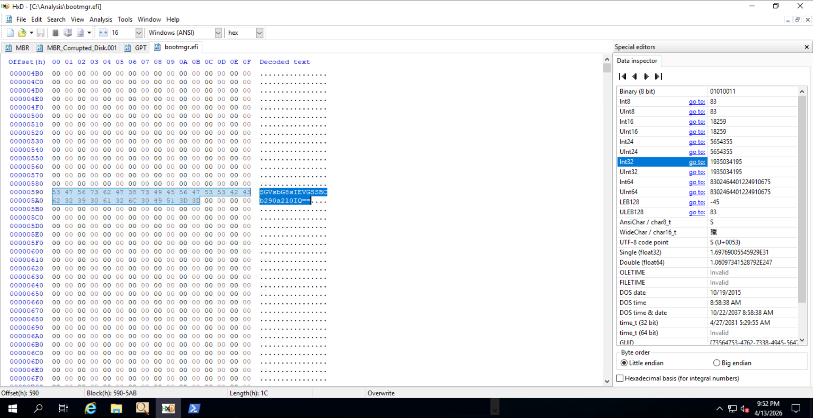

Decoding the Base64 string reveals the plaintext malicious string embedded by the bootkit.

**Q: Which partition has the bootloader in it?**
```
EFI System Partition
```

**Q: What is the malicious string embedded in the bootloader?**
```
Hello, EFI Bootkit!
```

---

## Key Takeaways

- **MBR** occupies the first 512 bytes of a disk, split into: bootloader code (446B), partition table (64B, max 4 entries), and MBR signature `55 AA` (2B). BIOS firmware reads MBR.
- **GPT** spans multiple sectors: Protective MBR (sector 0), Primary GPT Header (sector 1), Partition Entry Array (sectors 2+), with backup copies at the disk's end. UEFI firmware reads GPT.
- Partition Table entries use **little-endian** byte ordering for LBA addresses and sector counts — always reverse before converting to decimal.
- The formula for locating a partition: `LBA_decimal × 512 = byte_offset`
- The formula for partition size: `number_of_sectors × 512 = bytes`
- **MBR attack surface:** 512 bytes control the entire boot process. Corrupting the LBA address or the `55 AA` signature renders the system unbootable.
- **GPT attack surface:** The EFI System Partition holds the bootloader. Replacing `.efi` files with malicious versions produces a UEFI bootkit — only preventable with UEFI Secure Boot enabled.
- **Forensic indicators of MBR tampering:** corrupted `55 AA` signature, zeroed or incorrect LBA values, anomalous bootloader code bytes.
- **Forensic indicators of UEFI tampering:** invalid `.efi` digital signatures (Secure Boot violation), unexpected data in bootloader file header space, modified CRC32 values in the GPT header.

---

*Write-up by [OPT4RUN](https://tryhackme.com/p/OPT4RUN)*