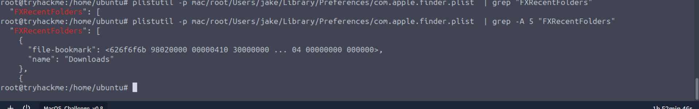
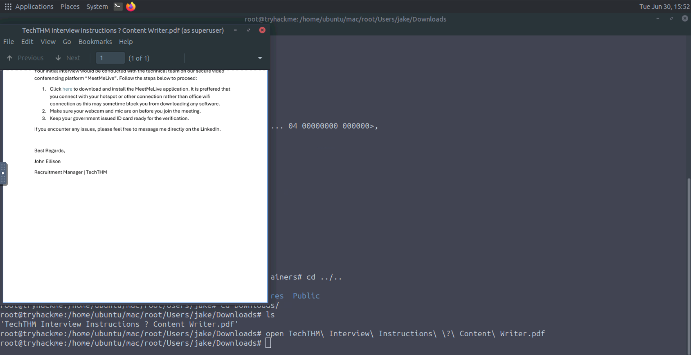
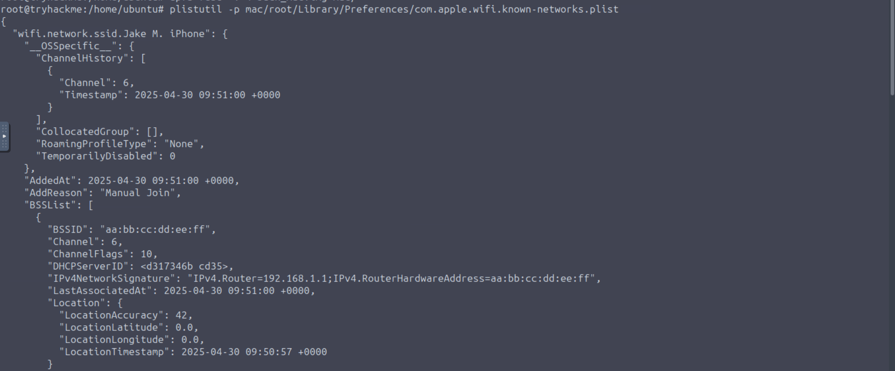
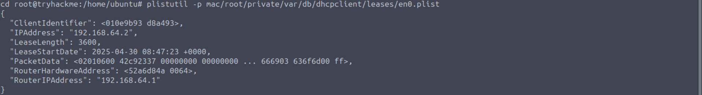
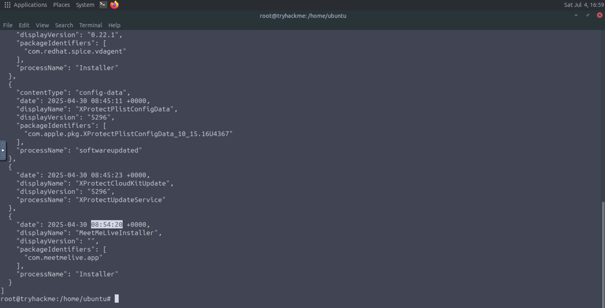
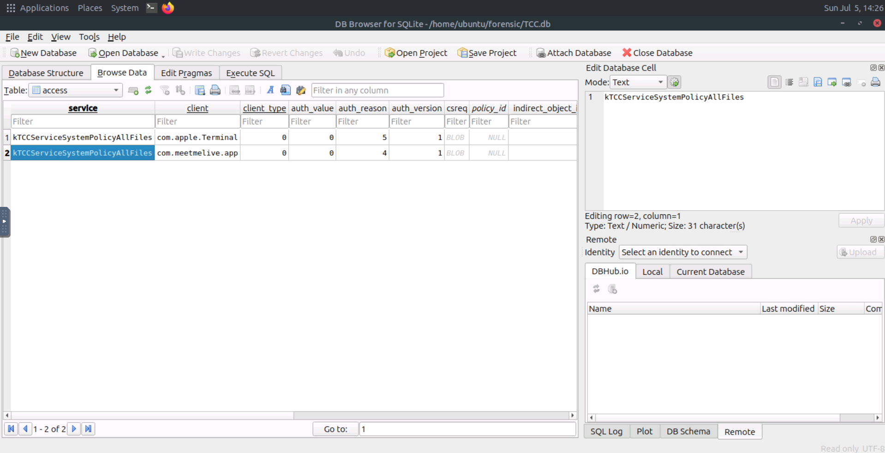
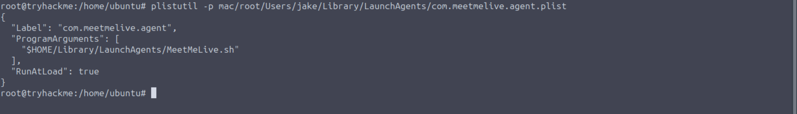
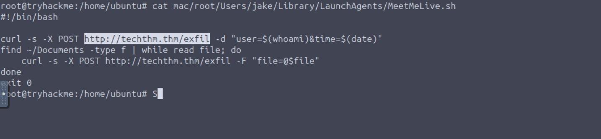

| Field | Details |
|-------|---------|
| **Room** | [Mac Hunt](https://tryhackme.com/room/machunt) |
| **Platform** | TryHackMe |
| **Path** | Advanced Endpoint Investigations |
| **Module** | macOS Forensics |
| **Difficulty** | Medium |
| **Category** | Digital Forensics / IR |
| **Author** | [OPT4RUN](https://tryhackme.com/p/OPT4RUN) |

## Overview

Mac Hunt is a single-task, CTF-style capstone that ties together everything covered across the macOS Forensics module — file system artefacts, application installation records, permission grants (TCC), and persistence mechanisms. The scenario centers on Jake, a job-seeker targeted by a fake recruiter on LinkedIn who delivers a malicious PDF, socially engineers him into installing a trojanized application (`MeetMeLive`), and establishes persistent access with data exfiltration.

From a SOC/blue-team perspective, this room is a good exercise in **full attack chain reconstruction** on macOS: initial access via social engineering, delivery infrastructure, defense-evasion through user-granted permissions, and persistence via `LaunchAgents`. Recognizing this chain end-to-end is directly transferable to real-world macOS incident response — particularly cases involving fake job offers, a increasingly common initial access vector against developers and engineers.

🔴 **Malware relevance:** The abuse of `LaunchAgents` for persistence and the social-engineering delivery via a trusted platform (LinkedIn) mirror real-world macOS malware campaigns (e.g., fake crypto/job recruiter lures used by DPRK-linked threat actors).

**Setup note:** The provided disk image (`Jack_Mac.img`) is mounted using `apfs-fuse` before analysis:
```
sudo apfs-fuse -v 4 /home/ubuntu/Jack_Mac.img /home/ubuntu/mac
sudo su
```

## Task 1 — Job Phish

Jake, a game developer, was targeted by a fake recruiter through a convincing job offer. Investigating his Mac reveals the full sequence of compromise: phishing delivery, malicious payload installation, permission abuse, persistence, and exfiltration.

**Q: What is the name of the most recently accessed folder by the user?**
```
Downloads
```


💡 The `Downloads` folder being the most recently accessed location is a strong early indicator — it's the typical landing zone for phishing payloads and installer packages.

**Q: Which social platform did the attacker use to deliver the document?**
```
LinkedIn
```


🔴 LinkedIn is a common initial-access vector in fake job-offer campaigns, since it lends the phishing pretext inherent legitimacy and directly targets job-seeking professionals.

**Q: What link did the attacker craft for the victim to download the MeetMeLive application?**
```
http://files.techthm.careers.thm:8080/MeetMeLiveInstaller.pkg
```


The link was embedded inside the phishing PDF itself, directing Jake to a `.pkg` installer hosted on attacker-controlled infrastructure using a deceptive subdomain (`careers.thm`) designed to look legitimate.

**Q: Which network did Jake connect to after reading the instructions in the PDF?**
```
Jake M. iPhone
```


💡 The PDF instructed the victim to switch networks — likely a social-engineering step to bypass corporate network protections/monitoring before installing the payload.

**Q: What was the IP address assigned to Jake's system?**
```
192.168.64.2
```


**Q: When did the application get installed into the system? (YYYY-MM-DD HH:MM:SS)**
```
2025-04-30 08:54:20
```


This timestamp anchors the beginning of the compromise on the host and is a key pivot point for building a timeline across the rest of the artefacts (permission grants, persistence creation, network connections).

**Q: What is the human-friendly name for the permission the user explicitly granted for the application?**
```
Full Disk Access
```


🔴 Full Disk Access is one of the most sensitive TCC permissions on macOS — it grants the application unrestricted read access to protected locations including Mail, Messages, browser data, and other applications' containers, making it a high-value grant for attackers.

**Q: Which feature of the OS did the attacker use to run their application at startup persistently?**
```
LaunchAgents
```


🔴 `LaunchAgents` (typically under `~/Library/LaunchAgents/` for user-level persistence) is one of the most common macOS persistence techniques, since it runs automatically at user login without requiring elevated privileges — a pattern seen consistently across the macOS Forensics module (also flagged in Artefacts and Applications).

**Q: What was the URL to which the application was exfiltrating data?**
```
http://techthm.thm/exfil
```


The exfiltration channel confirms the final stage of the attack chain — data leaving the compromised host to attacker infrastructure, closing the loop from initial phishing lure to data loss.

## Key Takeaways

- Fake job-offer phishing via professional networking platforms (LinkedIn) remains a highly effective initial access vector, particularly against developers and technical job-seekers.
- Attackers may instruct victims to switch networks mid-attack to move them off monitored/corporate networks before payload execution.
- `LaunchAgents` continues to be the go-to macOS persistence mechanism for user-level, no-privilege-required execution at login — a recurring theme across this module.
- TCC permission grants (like Full Disk Access) made by unsuspecting users during "installation" prompts can hand attackers broad access to sensitive data without needing further exploitation.
- Reconstructing the full attack chain — delivery platform → payload link → install timestamp → permission abuse → persistence → exfiltration — is the core skill this room reinforces, tying together every artefact category covered across the macOS Forensics module.

---
*Write-up by [OPT4RUN](https://tryhackme.com/p/OPT4RUN)*