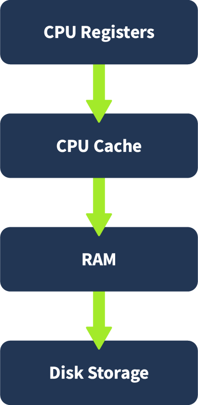
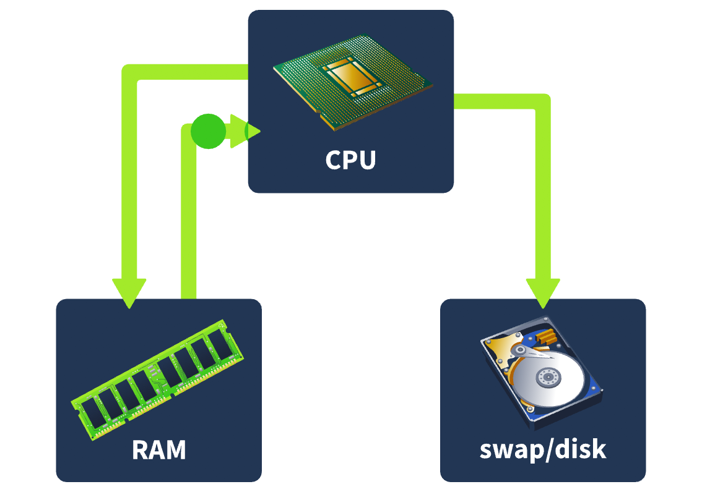
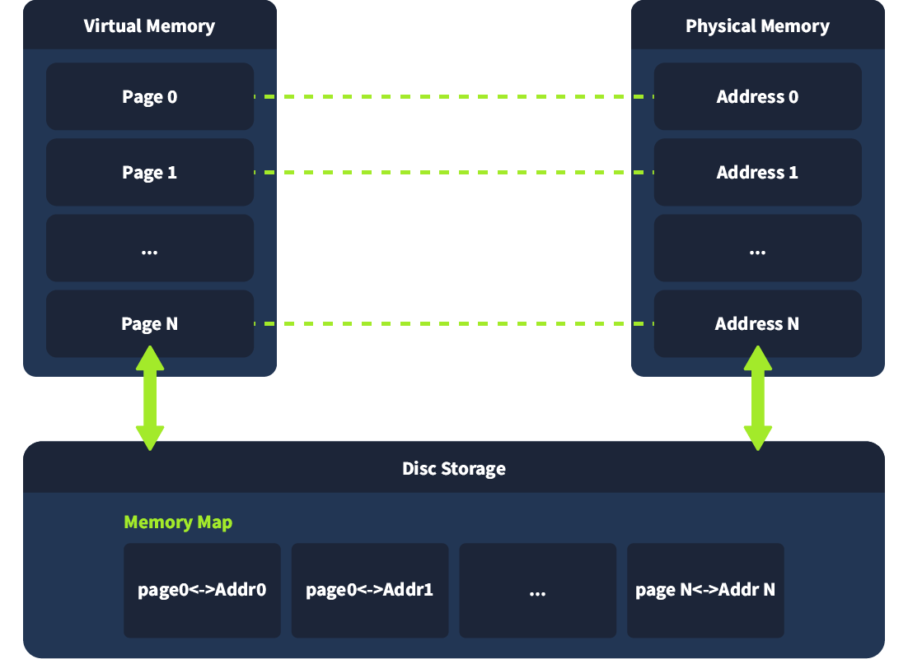
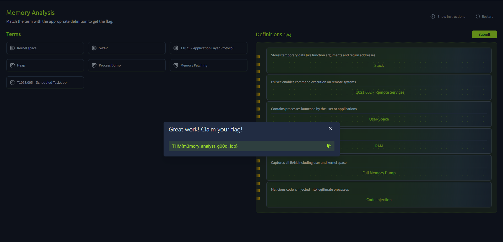

| Room | Platform | Path | Difficulty | Category | Room Link | Author |
|------|----------|------|------------|----------|-----------|--------|
| Memory Analysis Introduction | TryHackMe | Advanced Endpoint Investigations | Easy | Digital Forensics / IR | [Room Link](https://tryhackme.com/room/memoryanalysisintroduction) | [OPT4RUN](https://tryhackme.com/p/OPT4RUN) |

## Overview

This room introduces memory (RAM) forensics as a discipline distinct from disk forensics. From a SOC/blue team perspective, memory analysis is often the only way to catch fileless malware, injected code, and in-memory credential theft — none of which necessarily touch disk. The room covers the memory hierarchy, RAM structure, how memory dumps are acquired on different OSes, and the attack techniques/MITRE ATT&CK techniques that leave fingerprints in RAM.

🔴 Memory analysis is critical for detecting threats that deliberately avoid writing to disk — DLL injection, process hollowing, in-memory PowerShell, and C2 beacons all rely on RAM-resident execution to evade disk-based detection.

## Task 1 — Introduction

Covers the room's learning objectives: understanding the role of memory analysis in investigations, RAM structure/hierarchy, how memory dumps are created and their acquisition challenges, and recognizing common attack fingerprints in memory.

**Prerequisites:** DFIR Introduction, Windows Internals, Linux Fundamentals.

## Task 2 — Volatile Memory

Volatile memory (RAM) holds system and user-level data only while the system is powered on — it's lost on shutdown/restart, which is why investigators prioritize capturing it early.

**Memory hierarchy** (fastest → slowest): CPU registers/cache → RAM → disk storage. Faster tiers trade off capacity for speed.



**Virtual memory** maps a process's virtual addresses to physical RAM or, when RAM is full, to disk-based **swap** space. This matters for forensics because artifacts may live in RAM or be temporarily paged out to swap.



**RAM structure** splits into kernel space (OS, drivers, low-level services) and user space (per-process, isolated). Within a user process:

| Region | Purpose |
|--------|---------|
| Stack | Temporary data — function args, return addresses |
| Heap | Dynamic allocation at runtime (e.g., encryption keys) |
| Executable (.text) | Actual code the CPU runs |
| Data sections | Global variables and other required data |

💡 Encryption keys are commonly found on the heap; shell commands may surface on the stack — knowing where to look speeds up triage.



RAM analysis for forensic analysts can reveal: running processes/loaded executables, open network connections/ports, logged-in users and recent commands, decrypted content including encryption keys, and injected code or fileless malware.

**Q: What type of memory is prioritized because its data disappears after shutdown?**
```
RAM
```

**Q: What is the slowest component in the memory hierarchy?**
```
disk
```

**Q: Which memory region typically contains dynamically allocated data like encryption keys?**
```
heap
```

**Q: What disk-based area temporarily stores RAM data when memory is full?**
```
swap
```

## Task 3 — Memory Dumps

A memory dump is a point-in-time snapshot of RAM — processes, active sessions, network activity, and sometimes credentials in plaintext. 🔴 Tools like Mimikatz are used by attackers/red teamers specifically to pull credentials straight out of memory, which is why memory dumps are a key defensive focus.

**Acquisition by OS:**
- **Windows:** built-in crash dumps, Sysinternals RAMMap, WinPmem, FTK Imager. Kernel dumps land at `%SystemRoot%\MEMORY.DMP`; hibernation data at `%SystemDrive%\hiberfil.sys`.
- **Linux/macOS:** LiME (Linux Memory Extractor) or `dd` against `/dev/mem` or `/proc/kcore`, depending on kernel protections.

**Types of dumps:**
- **Full memory dump** — all RAM (user + kernel space); best for complete investigations.
- **Process dump** — single process; useful for reverse engineering/isolating malicious behavior.
- **Pagefile/swap analysis** — `pagefile.sys` (Windows) or swap partition/file (Linux) can retain fragments of data once in RAM.
- **Hibernation file** (`hiberfil.sys`) can also be parsed to recover RAM contents saved at hibernation.

**Acquisition challenges (anti-forensics techniques):**

| Technique | Description |
|-----------|-------------|
| Unlinked/hidden modules | Malware unlinks itself from process lists to evade standard OS queries |
| DKOM | Direct Kernel Object Manipulation — alters kernel structures to hide processes/threads/drivers |
| Code injection | Malicious code injected into legit processes (explorer.exe, svchost.exe) to blend in |
| Memory patching | Runtime modification of memory/APIs to disrupt forensic tools or return false data |
| API/syscall hooking | Intercepts calls like `ReadProcessMemory`, `ZwQuerySystemInformation` to hide activity |
| Encrypted/packed payloads | Kept encrypted/compressed until execution, complicating static analysis |
| Trigger-based payloads | Only unpack/execute under specific conditions, limiting what's captured during routine acquisition |

🔴 These techniques mean analysts can't rely on default tooling alone — memory carving, kernel-level inspection, and behavior-based analysis are required to surface hidden activity.

**Q: What tool is commonly used by attackers to extract credentials from memory?**
```
Mimikatz
```

**Q: What type of memory dump captures all RAM, including user and kernel space?**
```
full
```

**Q: What Linux tool can be used to extract memory for forensic purposes?**
```
lime
```

**Q: Which file on Windows systems stores memory during hibernation?**
```
hiberfil.sys
```

**Q: What anti-forensics technique hides processes by altering kernel structures?**
```
DKOM
```

## Task 4 — Memory Analysis Attack Fingerprints

Memory reveals threats that never touch disk. Key artifacts analysts hunt for: processes with no corresponding file on disk, DLL injection, process hollowing, API hooking, and kernel-space rootkits. These often produce identifiable signatures — unusual memory regions, mismatched PE headers, or code execution in writable memory.

**MITRE ATT&CK techniques with memory-resident fingerprints:**

| Technique ID | Name | Memory Artifact |
|--------------|------|------------------|
| T1003 | Credential Access | — |
| T1071 | Application Layer Protocol (C2) | Decrypted C2 configs, IPs, beacons not logged elsewhere |
| T1086 | PowerShell (in-memory execution) | Full script contents, encoded commands, runtime artifacts |
| T1053.005 | Scheduled Task/Job | `schtasks.exe` process, task name/payload path strings |
| T1543.003 | Windows Service persistence | Unusual service names/binaries/configs under `services.exe` |
| T1547.001 | Registry Run Keys/Startup Folder | `HKCU\...\Run` values cached in RAM or registry hives |
| T1021.002 | SMB/Windows Admin Shares (PsExec) | PsExec-related services/command-line args |
| T1021.006 | WinRM | `wsmprovhost.exe`, remote session initialization references |
| T1059.001 | PowerShell (remote) | Base64-encoded/obfuscated commands in process memory |
| T1047 | WMI | `wmic process call create` strings, class references |

🔴 Fileless C2 and in-memory PowerShell (T1071, T1086) are especially high value to hunt for since they leave no disk artifacts at all — memory is the only place to catch them.

**Q: What technique involves replacing a trusted process's memory with malicious code?**
```
Process hollowing
```

**Q: Which Windows service provides PowerShell remoting?**
```
WinRM
```

**Q: What MITRE technique ID is associated with in-memory PowerShell execution?**
```
T1086
```

**Q: What command-line tool enables remote execution and is linked to lateral movement (T1021.002)?**
```
PsExec
```

**Q: Which MITRE technique involves setting tasks that persist through reboots (e.g., schtasks.exe)?**
```
T1053.005
```

## Task 5 — Practical

Interactive exercise placing memory forensics terms into their proper definitions.

**Q: What is the value of the flag?**
```
THM{m3mory_analyst_g00d_job}
```



## Task 6 — Conclusion

The room ties together why RAM is prioritized during incident response: it holds the memory hierarchy and structure necessary to locate artifacts, the acquisition methods and challenges analysts face when capturing it, and the specific attack techniques — credential dumping, DLL injection, in-memory script execution, persistence, lateral movement — that memory analysis is uniquely positioned to catch.

## Key Takeaways

- RAM is prioritized in IR because its contents are lost on shutdown — capture early.
- Memory hierarchy (registers → cache → RAM → disk) trades speed for capacity; virtual memory bridges RAM and disk via swap.
- User-space process memory splits into stack, heap, .text, and data sections — know where artifacts like keys (heap) and commands (stack) tend to live.
- Full, process, pagefile/swap, and hibernation dumps each serve different investigative goals.
- Anti-forensics techniques (DKOM, hooking, injection, encrypted payloads) mean default tools aren't enough — expect to carve and inspect at the kernel level.
- Fileless techniques (C2 over T1071, PowerShell via T1086) are prime reasons memory forensics exists — disk forensics alone would miss them entirely.

---
*Write-up by [OPT4RUN](https://tryhackme.com/p/OPT4RUN)*