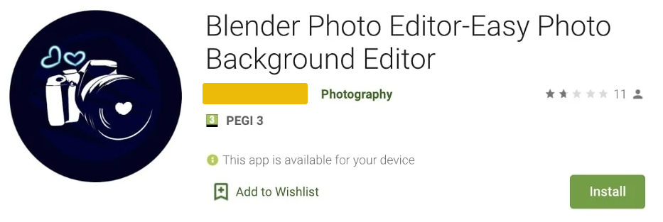
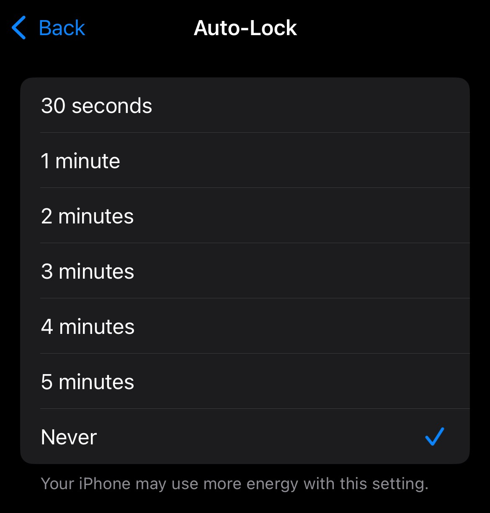
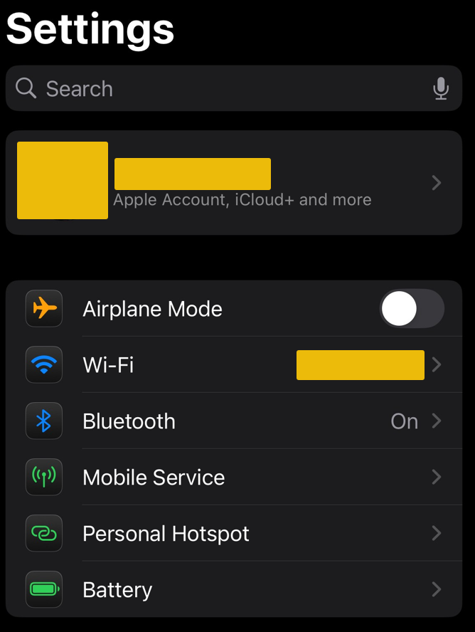
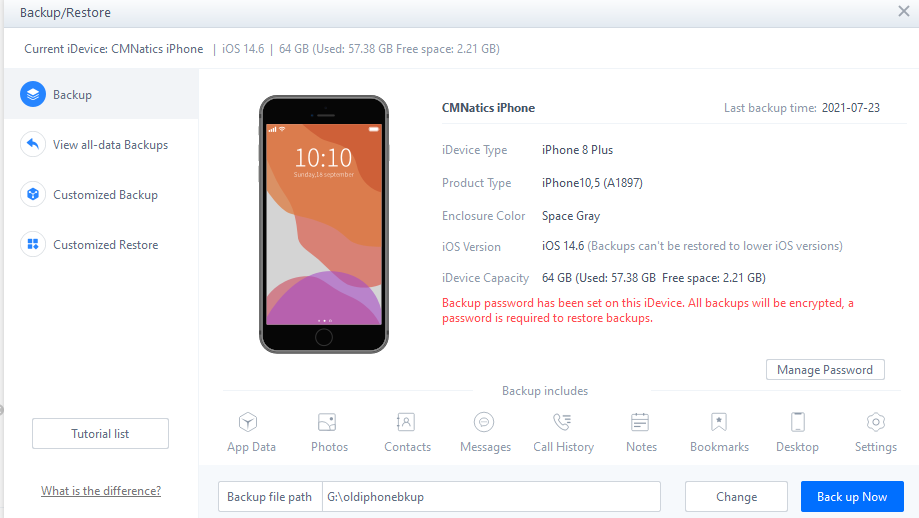
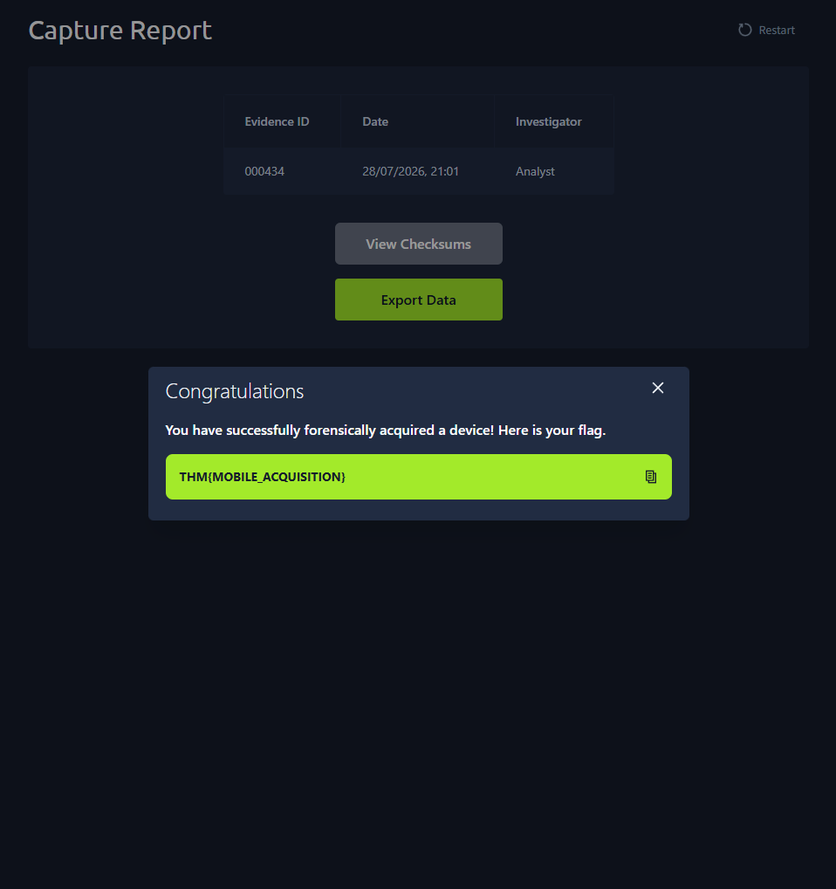

| Room | Platform | Path | Difficulty | Category | Room Link | Author |
|------|----------|------|------------|----------|-----------|--------|
| Mobile Acquisition | TryHackMe | Advanced Endpoint Investigations → Mobile Analysis | Easy | Digital Forensics | [tryhackme.com/room/mobileacquisition](https://tryhackme.com/room/mobileacquisition) | [OPT4RUN](https://tryhackme.com/p/OPT4RUN) |

## Overview

Mobile Acquisition kicks off the **Mobile Analysis** module by covering the acquisition side of mobile device forensics — the depth and method by which data is pulled off a phone before analysis ever begins. From a SOC/blue-team lens, mobile devices are a growing initial access vector: they hop between corporate, home, and public networks, often carry business data, and are comparatively under-monitored versus a managed workstation. Understanding acquisition levels (manual → logical → file system → physical) directly informs what evidence is realistically recoverable during an incident involving a compromised or lost device, and where legal/procedural constraints (chain of custody, cross-border data law) start to bite.

## Task 2 — Mobile Devices within Digital Forensics

Mobile devices carry an outsized share of personal and behavioural evidence: call/chat logs, GPS data, browsing and WiFi history, and app-specific artefacts. Android holds roughly 72% global market share per StatCounter, spread across manufacturers like Samsung, Google, and Xiaomi.

🔴 **Malware relevance:** phones are a strong initial access vector precisely because they roam across trust boundaries — home WiFi, cafés, corporate networks — giving an attacker a foothold that a locked-down corporate laptop wouldn't provide. A device used this way is referred to as an **entrypoint**.

**Q: In what country was it where there is a famous example of mobile devices being used within investigations?**
```
South Africa
```

**Q: What is the technical term for a device that has become the initial access method of an attacker?**
```
Entrypoint
```

## Task 3 — Challenges with Mobile Device Forensics

Modern devices ship with layered protections that make acquisition difficult:

| Mechanism | Purpose |
|---|---|
| Full disk & file-based encryption | Blocks forensic analysis unless authenticated/bypassed |
| Isolated encryption keys | Stored in dedicated hardware (akin to a TPM) |
| Secure boot process | Only manufacturer-signed code is allowed to load |
| Sandboxing | Isolates apps from one another |
| Lockout wiping | Wipes device after N failed auth attempts |
| Remote wiping | e.g. "Find My" — wipes a lost/stolen device remotely |

💡 **Tip:** data readability also depends on device state — Before First Unlock (BFU) data is the hardest to access, versus data available after repeated or one-time authentication.

The room also flags a live legal tension: Apple withdrew Advanced Data Protection in the UK after government pressure to provide law-enforcement access, removing iCloud end-to-end encryption there entirely rather than build in a backdoor — illustrating the ongoing privacy vs. investigatory-powers debate analysts have to navigate, especially cross-border.

🔴 **Malware relevance:** mobile EDR/monitoring maturity still lags behind endpoint tooling, and users tend to trust mobile UX more readily — a combination that makes mobile malware harder to detect and easier to socially engineer.

**Q: Which manufacturer protection prevents untrusted code from loading during boot?**
```
Secure boot process
```

**Q: Are encryption keys stored in software or hardware?**
```
hardware
```

## Task 4 — APTs Meet Mobile Devices



App stores aren't a perfect filter — malicious apps disguised as legitimate utilities have made it onto Google Play, typically harvesting contacts, call logs, and clipboard data for underground resale, though some go further with overlay attacks to steal credentials.

🔴 **Malware relevance:** **Pegasus** is the standout example of sophisticated mobile spyware — capable of reading emails/messages, GPS tracking, recording calls/mic/camera, and harvesting credentials, largely without user awareness. It leveraged the **BLASTPASS** exploit chain for one-click and zero-click delivery via vulnerabilities in apps like Messages and WhatsApp. Other notable mobile banking trojans include Anubis, Cerberus, and Exodus.

**Q: What app store was found to have malicious applications available to users?**
```
Google Play
```

**Q: What is the name of the sophisticated malware that used a combination of "one click" and "zero click" attacks?**
```
Pegasus
```

## Task 5 — Acquisition Techniques

Four acquisition levels, ordered by depth of access:

| Method | Description | Level of Access |
|---|---|---|
| Manual | Physically interacting with the device (scrolling, photographing screens) | Minimal |
| Logical | Uses OS-level features (APIs, backups) to extract data | Partial |
| File System | Full copy of the device's file system, usually needs privileged/root access | Substantial |
| Physical | Bit-for-bit image, enables deleted-data recovery | Full (unencrypted devices) |

💡 **Tip:** preserving access matters as much as acquiring data — disabling the lock-screen timer keeps an unlocked device unlocked, and enabling airplane mode prevents remote wipe (e.g. "Find My") and blocks any data modification in transit.




Manual acquisition is fast but breaks non-repudiation/authenticity — it can render evidence inadmissible. Logical acquisition is safer for evidence integrity since nothing is overwritten, typically done via backup features:



```
idevicebackup2 backup --full ./backup
```
iOS full backup via `libimobiledevice`.

```
adb backup -apk -shared -all -f backup.ab
```
Android backup via ADB.

File system acquisition goes further, pulling OS data directly and enabling deleted-data recovery, but requires privileged/root access — often via exploited vulnerabilities. Specialist toolkits like Cellebrite UFED are built for this.

```
adb pull /data /mnt/android_backup
```
Filesystem-level pull from a rooted Android device via ADB.

**Q: If I wanted to recover deleted data, what acquisition method would I try?**
```
Physical
```

**Q: Which acquisition method involves using features of the Operating System to extract data?**
```
Logical Acquisition
```

**Q: What is the name of the utility used to perform a full backup of an iPhone via the CLI?**
```
idevicebackup2
```

**Q: What is the name of the tool that can be used to perform a backup of an Android, via the CLI?**
```
ADB
```

## Task 6 — Special Acquisition Techniques

| Technique | Notes |
|---|---|
| Cellebrite UFED / Oxygen Suite | Specialist hardware/software, restricted to law enforcement/gov |
| Jailbreaking | Exploits a known OS vulnerability for root access; permanently modifies device — **not** forensically sound |
| Custom Boot Loading | Boots into a temporary custom OS for low-level access without permanent modification — forensically sound, but defeated by modern Secure Boot chains |
| JTAG | Physical hardware-level extraction; largely obsolete for modern devices |
| Brute-forcing | Viable only if lockout/rate-limiting isn't configured; can take an impractically long time |
| Cloud Extraction | Legal requests to manufacturers/app developers for cloud-held data — often more fruitful than bypassing device security |

🔴 **Malware relevance:** the same Secure Boot chain that stops attackers from loading unsigned code is exactly what blocks custom boot loading during legitimate forensic acquisition — a good reminder that platform security features cut both ways.

**Q: What is the name of the technique that boots the device into a temporary Operating System, often bypassing security mechanisms?**
```
Custom Boot Loading
```

**Q: What is the name of the technique that exploits a known vulnerability within the device? Granting it full or "root" access?**
```
Jailbreaking
```

## Task 7 — Practical

Acting as Investigator "Analyst" at TryAnalyseMe, the practical involved creating a case, adding an iPhone as evidential item (IMEI `358240051111112`, Silver, iOS), running the data capture, and exporting the report to retrieve the flag.



**Q: After creating the case and adding the iPhone as evidence, perform the data capture. What is the flag displayed once the capture is complete?**
```
THM{MOBILE_ACQUISITION}
```

## Key Takeaways

- Mobile devices are both a rich evidence source and a growing initial-access vector — their constant network-hopping makes them attractive entrypoints for attackers.
- Acquisition method choice is a trade-off: manual is fast but breaks evidence integrity; physical recovers the most (including deleted data) but is the hardest to achieve on modern encrypted devices.
- Hardware-backed encryption keys, Secure Boot, and sandboxing are the core manufacturer defenses analysts have to work around or through.
- Jailbreaking and custom boot loading both bypass security mechanisms, but only custom boot loading is forensically sound since it avoids permanent device modification.
- Legal/cloud-based acquisition is increasingly relevant as on-device bypass techniques get harder against modern security architectures — and the Apple UK ADP case shows this tension playing out in real time.
- Mobile-specific threats (Pegasus/BLASTPASS, banking trojans, malicious app store listings) reinforce that mobile EDR maturity still lags behind traditional endpoint monitoring.

---
*Write-up by [OPT4RUN](https://tryhackme.com/p/OPT4RUN)*