| Field | Details |
|-------|---------|
| **Room** | NTFS Analysis |
| **Platform** | TryHackMe |
| **Path** | Advanced Endpoint Investigations |
| **Module** | File System Analysis |
| **Difficulty** | Medium |
| **Category** | Digital Forensics |
| **Room Link** | [tryhackme.com/room/ntfsanalysis](https://tryhackme.com/room/ntfsanalysis) |
| **Author** | [OPT4RUN](https://tryhackme.com/p/OPT4RUN) |

---

## Overview

NTFS (New Technology File System) is the default Windows file system and a goldmine for forensic investigators. Unlike FAT32, NTFS maintains rich metadata for every file and directory — including full MACB timestamps, permissions, and journaling — meaning file activity leaves a far deeper trail.

This room covers the structure of NTFS from a forensic standpoint: how the Master File Table (MFT) tracks every file on disk (including deleted ones), how the journaling subsystem (`$LogFile` and `$UsnJrnl`) records file system changes over time, and how the `$I30` index attribute can surface files that no longer appear in the live directory listing. The primary toolchain is FTK Imager for artifact extraction and EZ Tools (MFTECmd + Timeline Explorer) for parsing and analysis.

> **Prerequisites:** [MBR and GPT Analysis](https://tryhackme.com/room/mbrandgptanalysis) · [FAT32 Analysis](https://tryhackme.com/room/fat32analysis)

---

## Task 1 — Introduction

NTFS organizes data in a way that is both operationally efficient and forensically rich. The room focuses on four core learning objectives:

- Understanding NTFS structure and its key components
- Analyzing the Master File Table (MFT) and the metadata it holds
- Identifying deleted files through MFT and `$I30` slack
- Tracking file system activity via NTFS journals

**Q: No answer needed.**

---

## Task 2 — Lab Connection

The lab runs on a Windows VM accessible via split-screen. Credentials:

| Field | Value |
|-------|-------|
| Username | `administrator` |
| Password | `thm_4n6` |

The VM comes pre-loaded with all required tools: FTK Imager, MFTECmd.exe, and Timeline Explorer.

**Q: No answer needed.**

---

## Task 3 — NTFS Overview

NTFS has been the default Windows file system since Windows NT 3.1 (1993). Beyond just storing files, it functions as a **journaling file system** — recording changes to a log before committing them to disk. This design protects against corruption from crashes and power failures, and from a forensics perspective, leaves an auditable trail of file system activity.

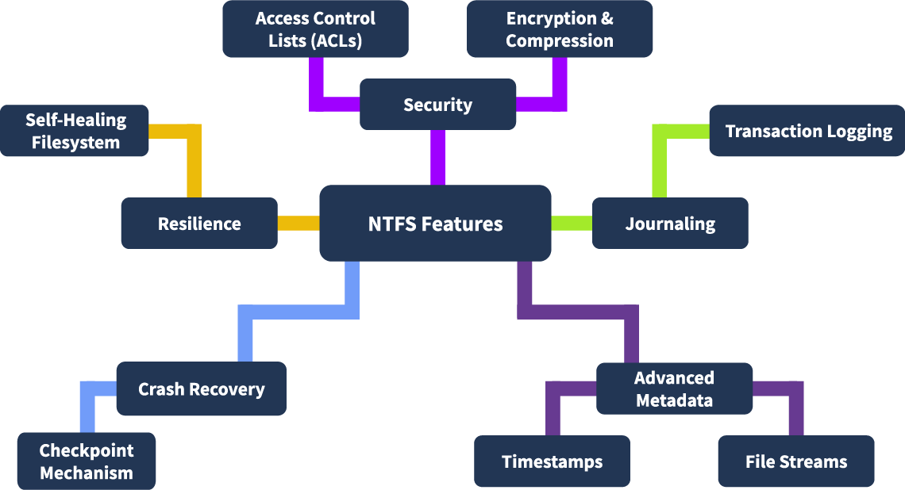

### Key Features

| Feature | Description |
|---------|-------------|
| Advanced Metadata | Per-file creation, modification, and access timestamps |
| Journaling | Pre-commit log of all changes (`$LogFile`, `$UsnJrnl`) |
| Security | EFS encryption + ACL-based permissions |
| Large Volume Support | Up to 256 TB volumes and files |
| Resilience | Recovery mechanisms reduce corruption risk |
| Compression | Built-in transparent file compression |
| Compatibility | Primarily Windows; readable on Linux/macOS with third-party tools |

### NTFS vs. Other File Systems

| Feature | NTFS | FAT32 | exFAT |
|---------|------|-------|-------|
| Max Drive Size | 256 TB | 2 TB | 128 PB |
| Max File Size | 256 TB | 4 GB | 16 EB |
| Crash Recovery | ✅ Yes | ❌ No | ❌ No |
| Encryption | ✅ Yes | ❌ No | ❌ No |
| Compression | ✅ Yes | ❌ No | ❌ No |
| File Permissions | ✅ Yes | ❌ No | ❌ No |
| Best For | Modern Windows systems | Legacy/small USB drives | Flash drives & SD cards |

**Q: Which feature does NTFS use to keep track of the changes within the file system?**
```
journaling
```

---

## Task 4 — NTFS Components

NTFS volumes are organized into several key components. Each serves a specific operational role, and most carry significant forensic value.

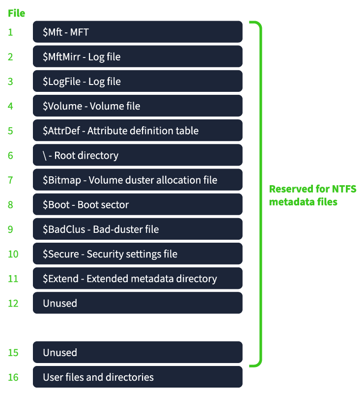

### Partition Boot Sector (PBS)

The first sector of any NTFS volume. Contains the BIOS Parameter Block (BPB), which defines disk layout parameters (sectors per cluster, MFT location, etc.), and ends with the `0x55AA` end-of-sector marker.

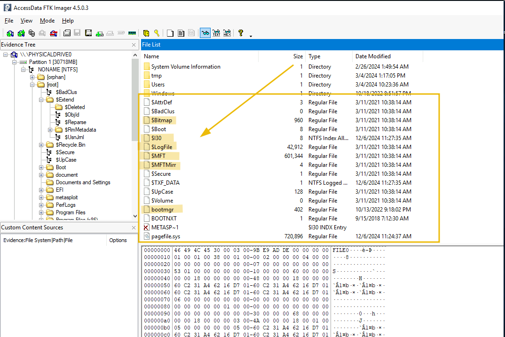

> 🔴 **Malware relevance:** Bootkits and rootkits frequently tamper with the PBS. Forensic analysis of this sector can confirm whether the boot code has been replaced or the BPB modified to redirect MFT location.

### Master File Table (MFT)

The backbone of NTFS — a database of fixed 1 KB records, one per file and directory on the volume. Stores all file attributes: timestamps, permissions, data pointers, and more. Covered in depth in Task 5.

### $MFTMirr

A redundant copy of the first few MFT records stored in a separate disk location. Useful forensically to cross-verify MFT integrity if the primary is damaged or tampered.

### System Files

| File | Purpose |
|------|---------|
| `$MFT` | Master File Table |
| `$MFTMirr` | MFT backup (first records) |
| `$LogFile` | Transactional journal for crash recovery |
| `$Bitmap` | Tracks allocated vs. free clusters |
| `$Boot` | Boot sector data |
| `$BadClus` | Tracks bad sectors |
| `$UpCase` | Uppercase mapping for case-insensitive comparisons |

> 🔴 **Malware relevance:** `$BadClus` abuse is a known anti-forensics technique — marking sectors as bad to deliberately hide data in regions the OS won't read.

### File Data Area

Where actual file content lives — either **resident** (stored directly inside the MFT record for small files) or **non-resident** (stored in external clusters, with the MFT record holding a pointer). Slack space in this area can contain residual data from previously deleted files.

### Alternate Data Streams (ADS)

NTFS allows multiple data streams to be attached to a single file. The primary stream holds the visible content; ADS can store hidden data without affecting the reported file size.

> 🔴 **Malware relevance:** ADS is a classic living-off-the-land technique. Malware payloads and scripts can be hidden in ADS and executed without appearing in standard directory listings.

### Extracting Artifacts with FTK Imager

Open FTK Imager → `File` → `Add Evidence Item` → `Physical Drive` → select the first drive.

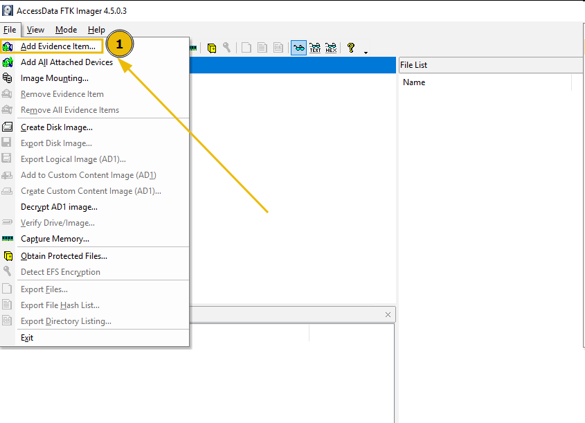

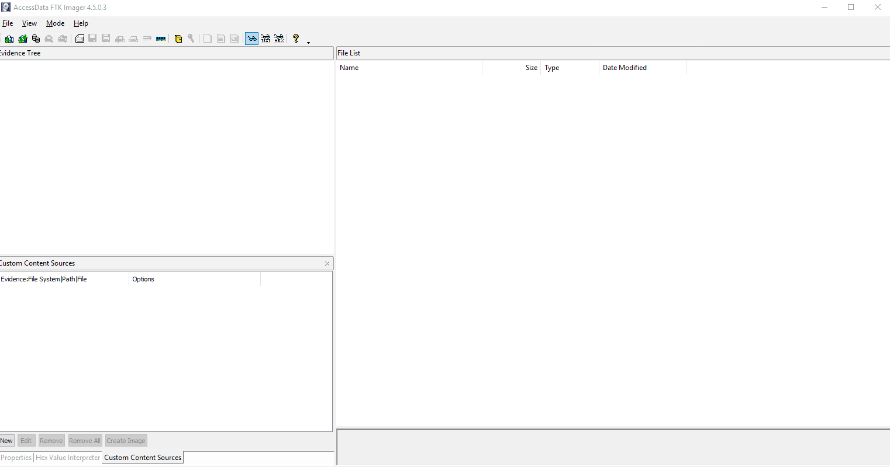

Navigate to `Partition` → `NONAME [NTFS]` → `[root]` to view all NTFS components.

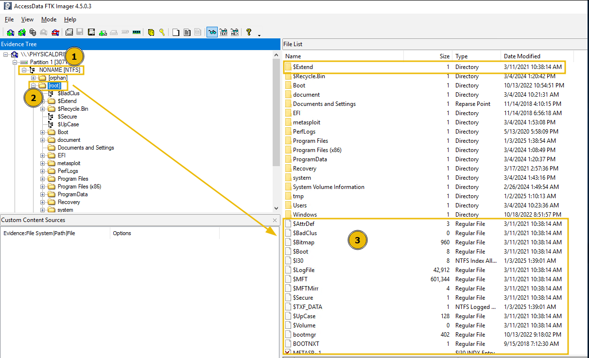

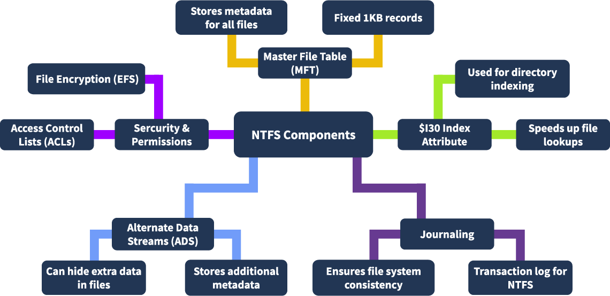

Export the following artifacts to `Desktop\Evidence\` for analysis:

- `$MFT`
- `$LogFile`
- `$I30`
- `$Extend`
- `$UsnJrnl`

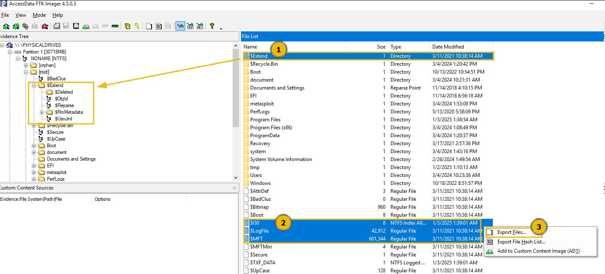

**Q: Double-click on the `$UsnJrnl` file in the `$Extend` folder; what is the first evidence file you find?**
```
$J
```

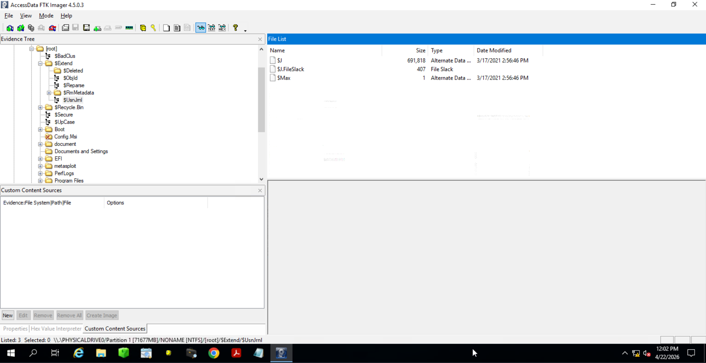

---

## Task 5 — MFT Record Analysis

The MFT is the single most important artifact on an NTFS volume. Every file and directory — past and present — has a corresponding MFT record. Even after deletion, the record persists until it is overwritten by a new entry.

### MFT Record Structure

Each 1 KB record is composed of attributes:

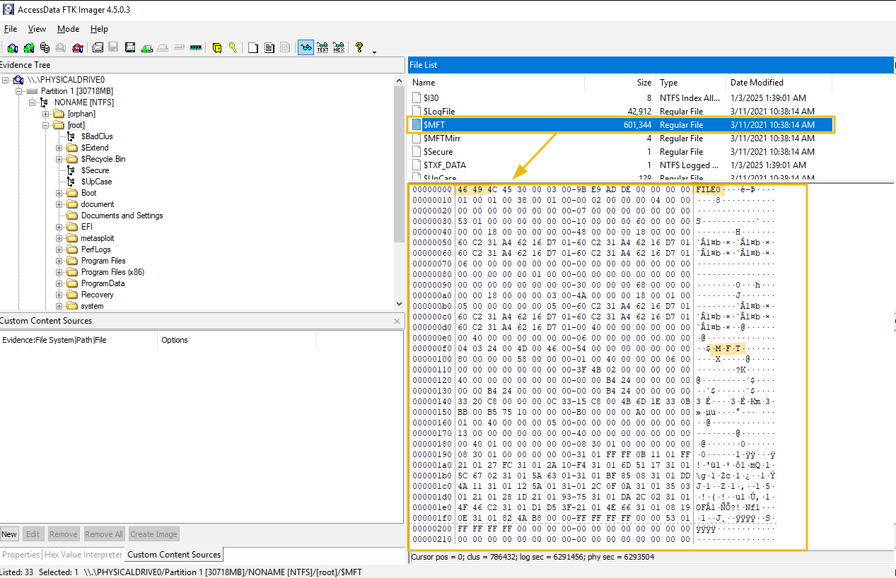

| Attribute | Contents |
|-----------|----------|
| File Name | Name of the file or directory |
| Standard Information | Link count, timestamps, file attributes |
| Attributes | MACB timestamps, Read-only, Hidden flags |
| File Data | Actual data (if resident) or cluster pointers (if non-resident) |
| File Index | Pointers to child files/directories |
| Security Information | ACL defining access permissions |

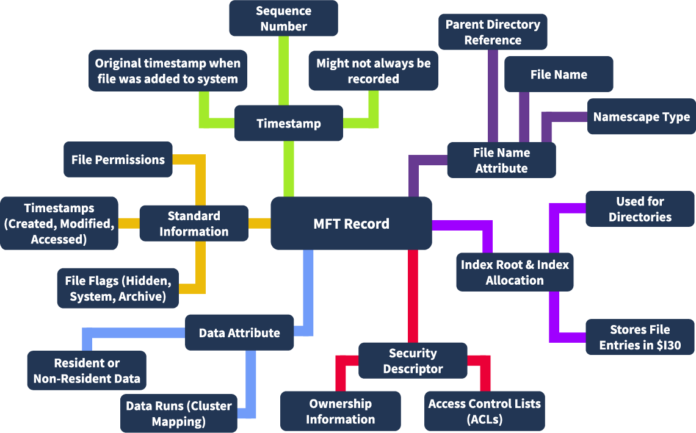

### Parsing the MFT with MFTECmd

```
MFTECmd.exe --help
```

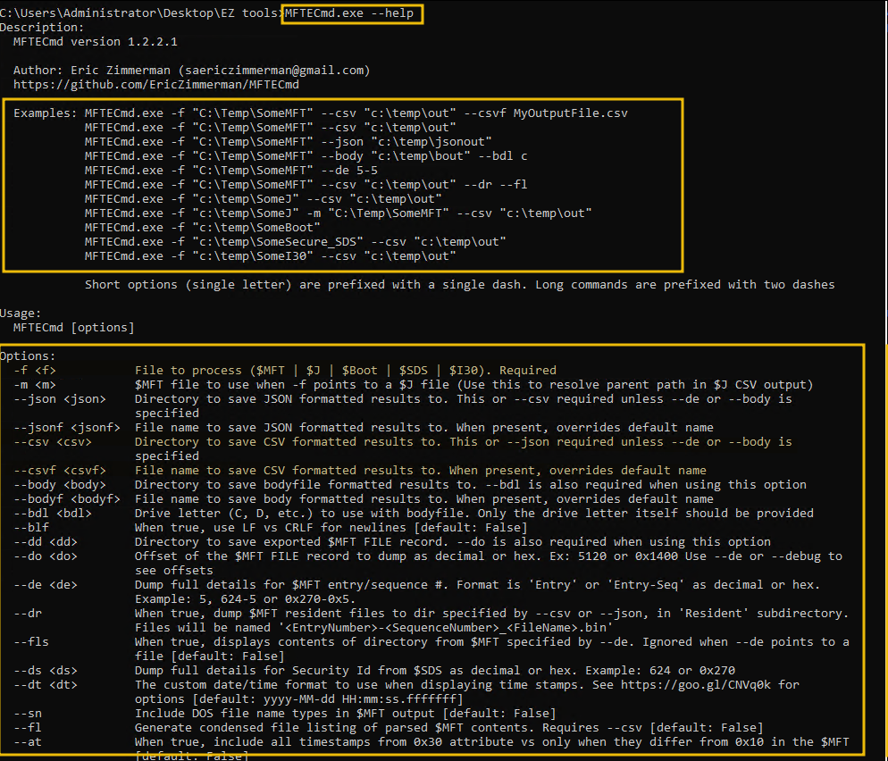

Extract MFT records to CSV:

```
MFTECmd.exe -f ..\Evidence\$MFT --csv ..\Evidence --csvf ..\Evidence\MFT_record.csv
```

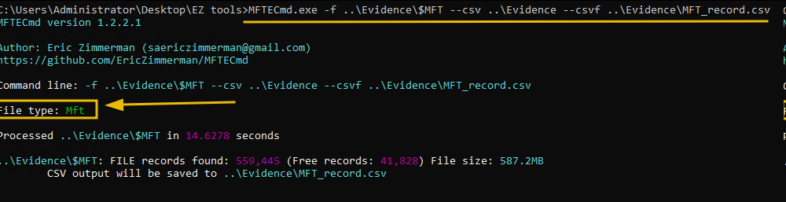

The output CSV loads automatically into Timeline Explorer for filtering and analysis.


### Key MFT Columns

| Column | Description | Forensic Relevance |
|--------|-------------|-------------------|
| Entry Number | Unique MFT record ID | Maps records to files; tracks record reuse |
| Parent Entry Number | Entry number of parent directory | Reconstructs directory hierarchy |
| Sequence Number | Increments on MFT record reuse | Differentiates old vs. new files at same entry |
| File Name | File or directory name | Matches files to user/attacker activity |
| Timestamps | Creation, Modification, Access, MFT Modified | Timeline analysis |
| Flags | File / Directory / Unused | Activity status |
| Entry Flags | Read-only, Hidden, System | Identifies malware-favored file attributes |
| **In Use** | Active file vs. deleted | Deleted files retain their MFT record — this flag distinguishes them |
| Logical Size | Actual data size | Detect anomalies (empty file with data, etc.) |
| Physical Size | Allocated disk space | Identify slack space and fragmentation |

### MACB Timestamps

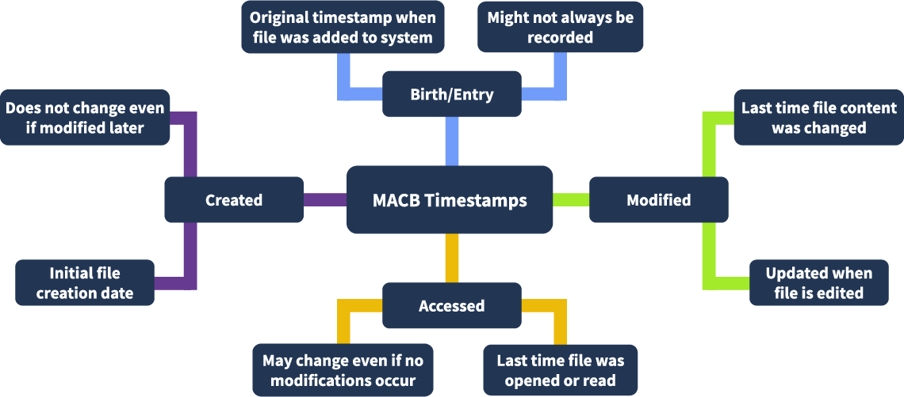

| Letter | Meaning | What Changed |
|--------|---------|--------------|
| **M** | Modified | File content was altered |
| **A** | Accessed | File was read or opened |
| **C** | Changed (Metadata) | Permissions, ownership, or metadata updated |
| **B** | Birth (Creation) | File was first created |

> 🔴 **Malware relevance:** **Timestomping** — the deliberate manipulation of MACB timestamps — is a common anti-forensics technique. Comparing `$STANDARD_INFORMATION` timestamps against `$FILE_NAME` timestamps can expose this: the OS updates both, but many timestomping tools only modify `$STANDARD_INFORMATION`, leaving `$FILE_NAME` timestamps intact as ground truth.

---

**Q: Which column indicates that the file is no longer present on the disk?**
```
In Use
```

**Q: Examine the MFT record; what is the network sniffer installed on this system in the `\Program Files\` directory?**
```
wireshark
```

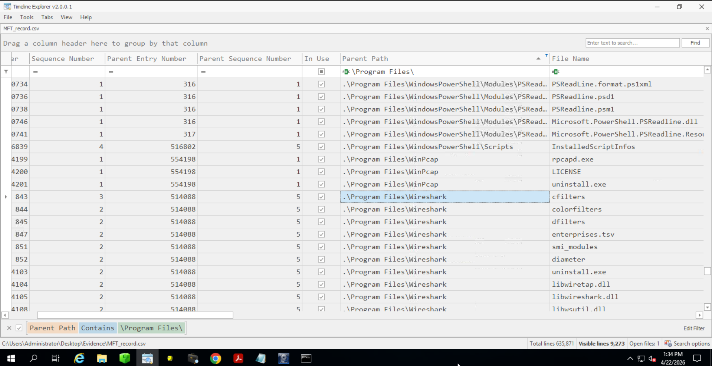

**Q: An anti-forensics tool responsible for wiping out an attacker's traces was installed in the `\Downloads\Tools` folder. What is the name of the tool?**
```
DiskWipe.exe
```

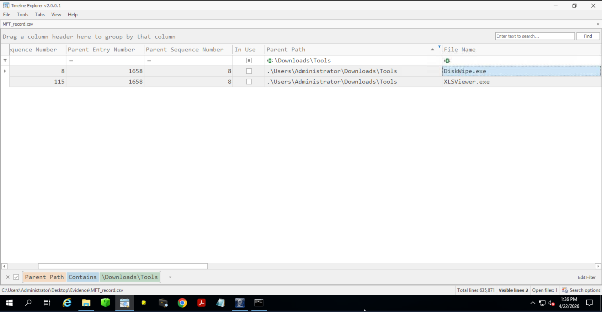

**Q: According to the MFT record, is the anti-forensics tool currently present on the disk? (yay or nay)**
```
nay
```

> The `In Use` field is unchecked for the `DiskWipe.exe` entry — the record exists in the MFT but the file has been deleted.

**Q: Examining the MFT record, there is a record of a `flag.txt` file. What is the parent path of the file?**
```
.\tmp\secret_directory
```

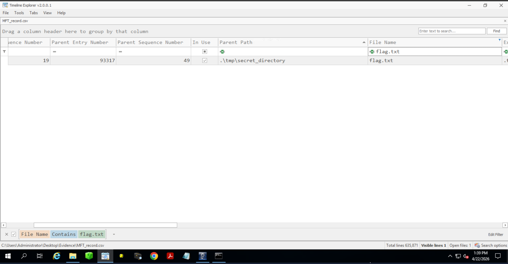

**Q: What is the content of the `flag.txt` file?**
```
WelDone_You_F0und_M3
```

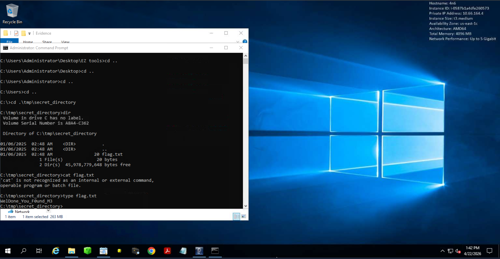

**Q: What is the file name associated with MFT entry number `584574`?**
```
SharpHound.ps1
```

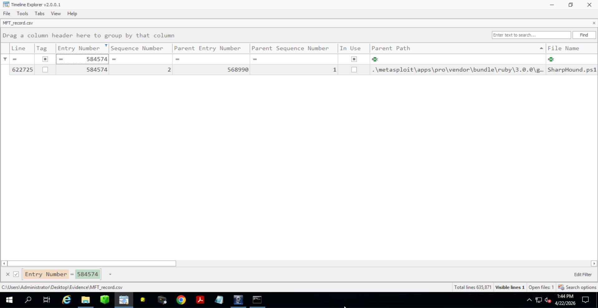

> 🔴 **Malware relevance:** SharpHound is the BloodHound ingestor — used for Active Directory enumeration during post-exploitation. Its presence in the MFT (even if deleted) confirms the attacker ran AD reconnaissance on this host.

---

## Task 6 — NTFS Journaling

NTFS maintains two separate journals that record file system changes. These are distinct in scope and forensic utility.

### Journal Types

**`$LogFile`** — Metadata journal used for crash recovery. Records MFT-level changes (file creation, deletion, metadata updates) before they are committed to disk. Located in `[root]`.

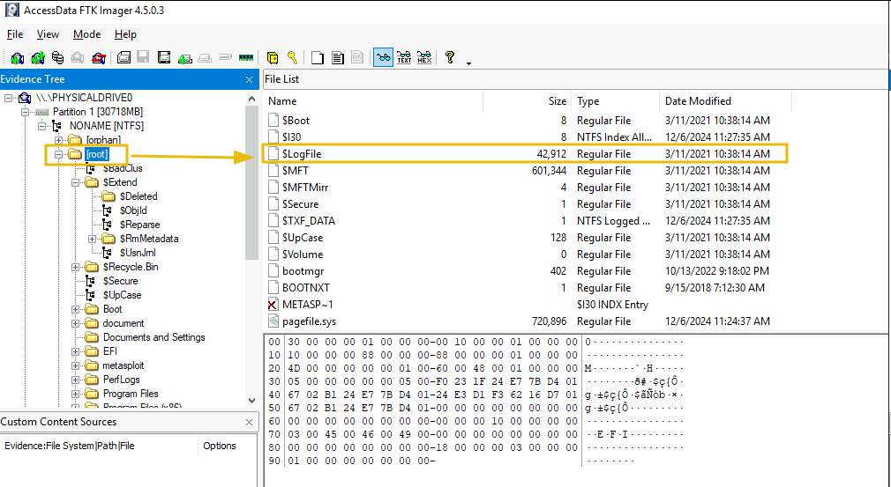

**`$UsnJrnl` (USN Journal)** — Update Sequence Number journal. Records a historical log of changes to files, directories, and their attributes. Used by Windows services (indexing, backup, AV) to monitor file activity. Located in `$Extend`.

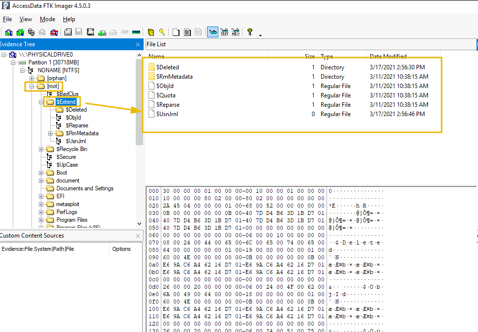

> 💡 **Key distinction:** `$LogFile` tracks MFT metadata changes for recovery. `$UsnJrnl` tracks file-level change events for historical audit — it's the more forensically useful of the two.

### $UsnJrnl Structure

Double-clicking `$UsnJrnl` reveals two components:

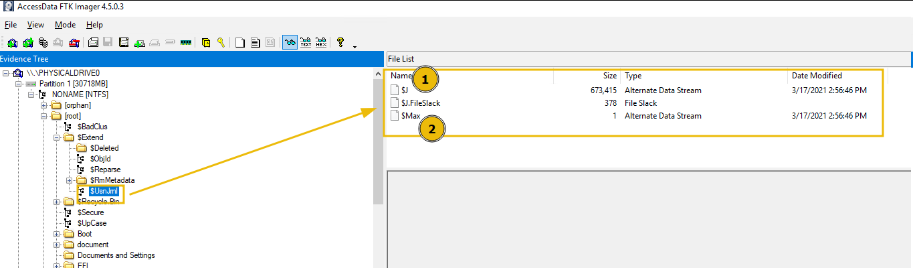

| Component | Purpose |
|-----------|---------|
| `$Max` | Defines maximum journal size and allocation policy |
| `$J` | Stores the actual change records — the primary forensic target |

`$J` is implemented as an Alternate Data Stream (ADS) within NTFS.

### Extracting and Parsing `$J`

Export `$J` from FTK Imager to `Desktop\Evidence\`.

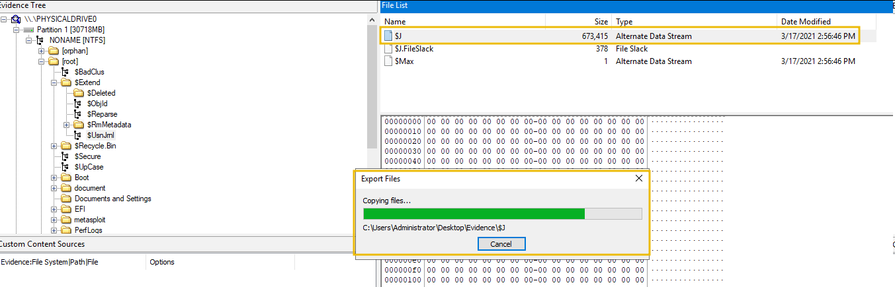

Parse with MFTECmd:

```
MFTECmd.exe -f ..\Evidence\$J --csv ..\Evidence --csvf USNJrnl.csv
```

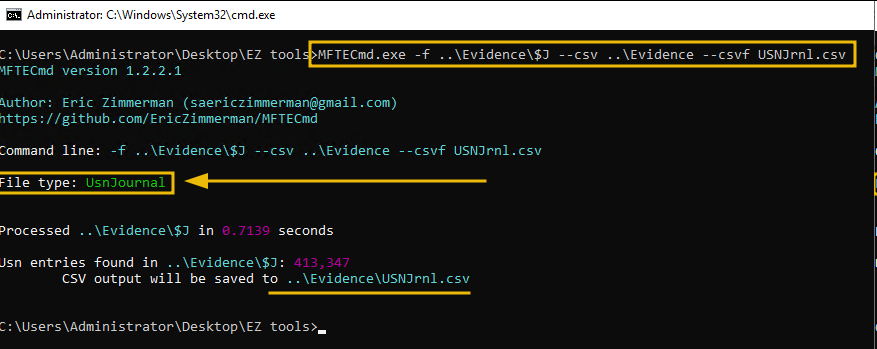

Open `USNJrnl.csv` in Timeline Explorer.


### Update Reason Opcodes

| Opcode | Description |
|--------|-------------|
| `USN_REASON_FILE_CREATE` | New file or directory created |
| `USN_REASON_FILE_DELETE` | File or directory deleted |
| `USN_REASON_DATA_OVERWRITE` | File data overwritten |
| `USN_REASON_DATA_EXTEND` | File size increased |
| `USN_REASON_DATA_TRUNCATION` | File size decreased |
| `USN_REASON_RENAME_OLD_NAME` | File renamed — old name recorded |
| `USN_REASON_NAMED_DATA_OVERWRITE` | Alternate data stream overwritten |
| `USN_REASON_NAMED_DATA_EXTEND` | Alternate data stream extended |
| `USN_REASON_CLOSE` | File handle closed after changes |

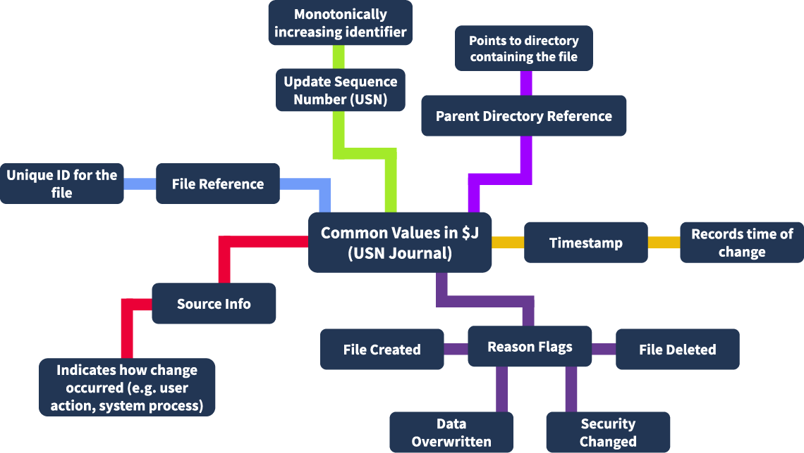

---

**Q: What is the text file name associated with entry number `95071` before renaming it?**
```
New Text Document.txt
```

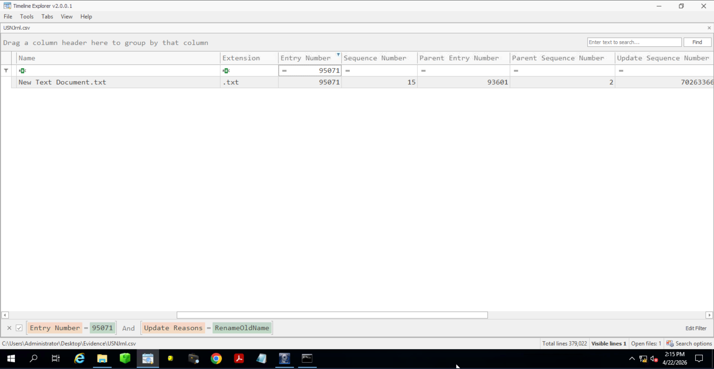

**Q: According to the record, what is the first operation performed on the file in the question above?**
```
FileCreate
```

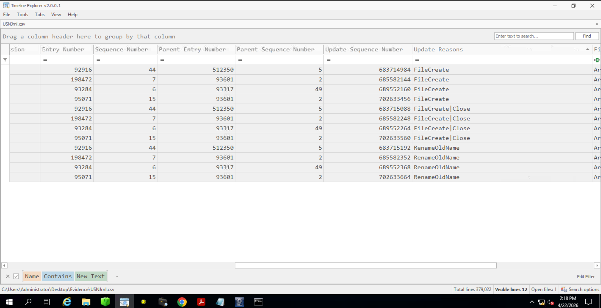

**Q: According to the record in `$J`, what is the count of the rename operation found against `secret_code.txt`?**
```
2
```

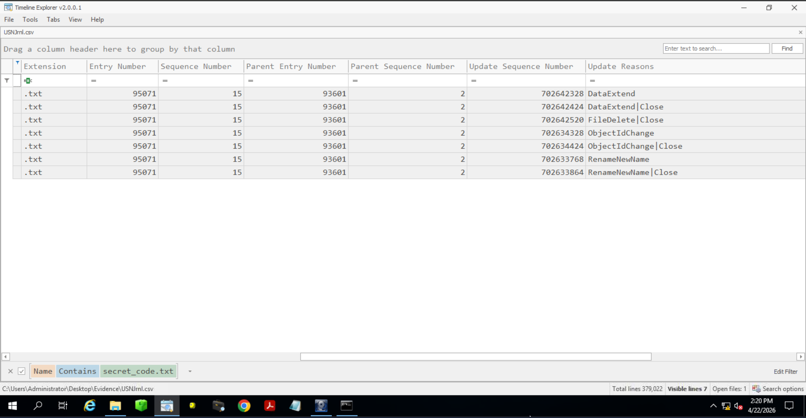

**Q: According to the record, when was the `secret_code.txt` file deleted?**
```
2025-01-15 08:10:04
```

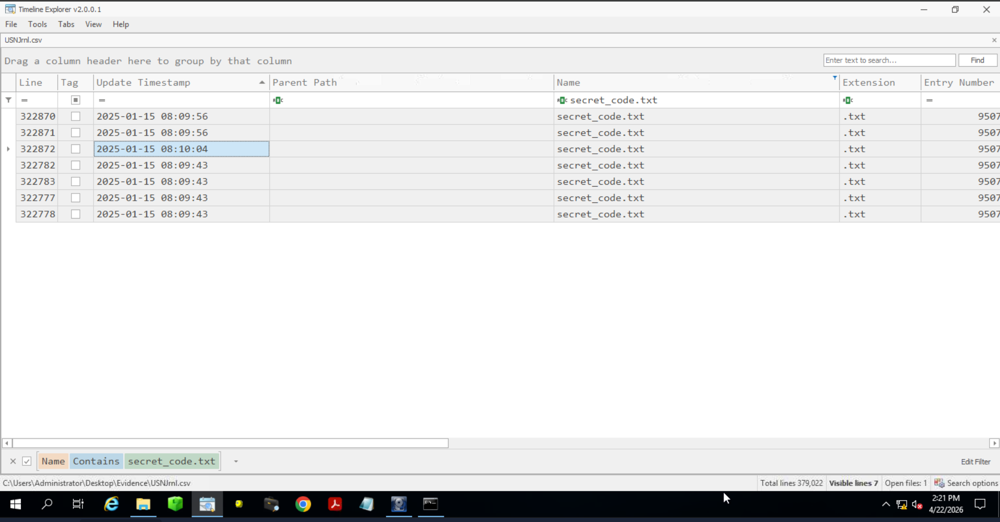

---

## Task 7 — Index Allocation Attribute (`$I30`)

The `$I30` is a per-directory index attribute that NTFS maintains to store and retrieve information about directory entries. It contains metadata — filenames, timestamps, and attributes — for all files and subdirectories within a given directory, **including those that have been deleted or moved**.

### Slack Space in `$I30`

When a file is deleted from a directory, its entry is removed from the active index but residual data often remains in the `$I30` slack space until it is overwritten. FTK Imager surfaces these stale entries with a red cross icon.

Navigate to `[root]\metasploit` in FTK Imager to find the `$I30` file:

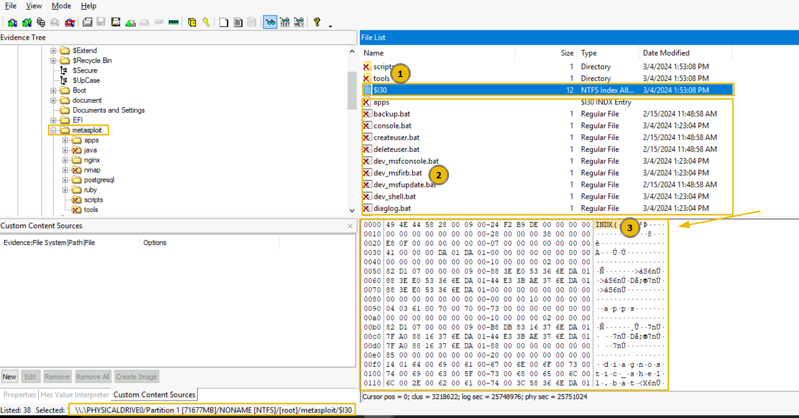

Compare against the live `C:\metasploit` directory — only four folders visible, while `$I30` reveals far more historical entries:

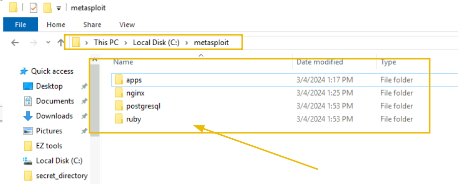

### Forensic Value of `$I30`

| Use Case | Detail |
|----------|--------|
| Deleted Files | Entries persist in slack space after deletion |
| Renamed / Moved Files | Old names and paths remain until overwritten |
| Hidden Files | File attribute flags expose hidden entries |

### Parsing `$I30` with MFTECmd

Export `$I30` from `[root]\metasploit` via FTK Imager, then parse:

```
MFTECmd.exe -f ..\Evidence\$I30 --csv ..\Evidence\ --csvf i30.csv
```

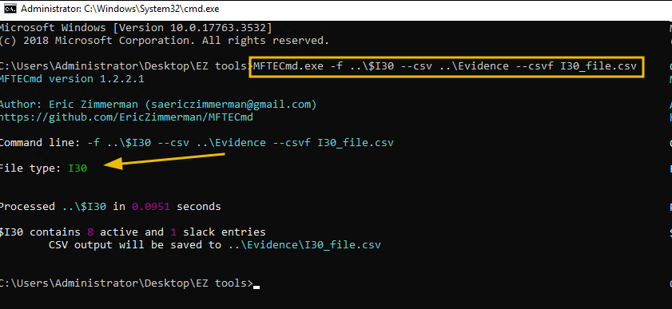

Open in Timeline Explorer. Filter on the `From Slack` column to isolate deleted entries:

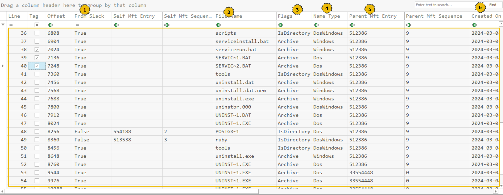

### Key `$I30` Columns

| Column | Description |
|--------|-------------|
| Filename | File or directory name |
| From Slack | `True` = entry recovered from slack (deleted/moved) |
| File Size | Reported size at time of entry |
| Parent Directory | Parent MFT entry reference |
| Timestamps | MACB timestamps for the entry |
| File Attributes | Read Only, Hidden, System, Archive, Directory flags |

---

**Q: How many deleted files or folders are present in the `$I30` attribute file extracted in this task?**
```
52
```

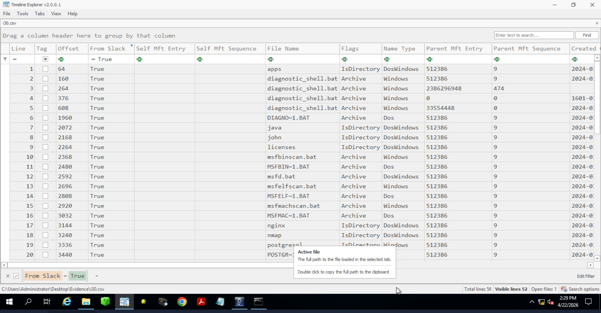

**Q: What is the parent MFT entry of the `nmap` directory?**
```
512386
```

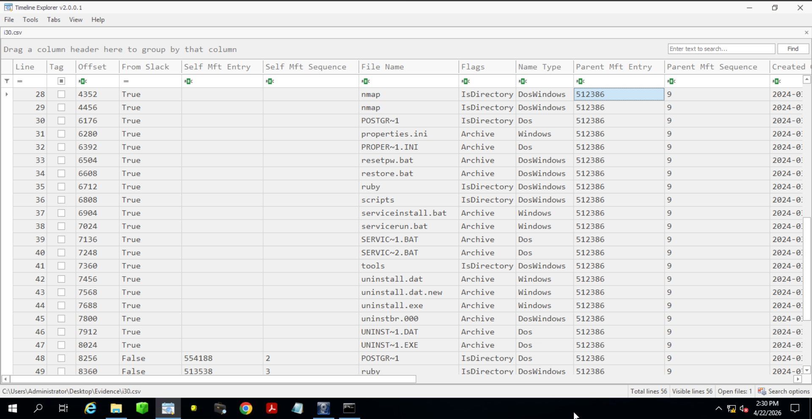

---

## Task 8 — Conclusion

**Q: No answer needed.**

---

## Key Takeaways

- **NTFS is forensically rich by design** — journaling, per-file metadata, and persistent MFT records mean file activity leaves a deep trail even after deletion
- **MFT records outlive their files** — the `In Use` flag distinguishes active entries from deleted ones; records persist until the slot is reused
- **MACB timestamps are critical for timeline analysis** — but watch for timestomping; compare `$STANDARD_INFORMATION` vs `$FILE_NAME` attributes to detect manipulation
- **`$UsnJrnl:$J` is the forensic journal of choice** — it provides a historical record of file creates, deletes, renames, and data changes that `$LogFile` doesn't retain long-term
- **`$I30` slack surfaces deleted directory entries** — files invisible in the live filesystem can still be recovered via the directory index attribute
- **ADS is both a feature and a threat vector** — `$J` itself is an ADS; attackers abuse the same mechanism to hide payloads without altering visible file sizes
- **Tool chain for this room:** FTK Imager (extraction) → MFTECmd.exe (parsing) → Timeline Explorer (analysis)

---

*Write-up by [OPT4RUN](https://tryhackme.com/p/OPT4RUN)*