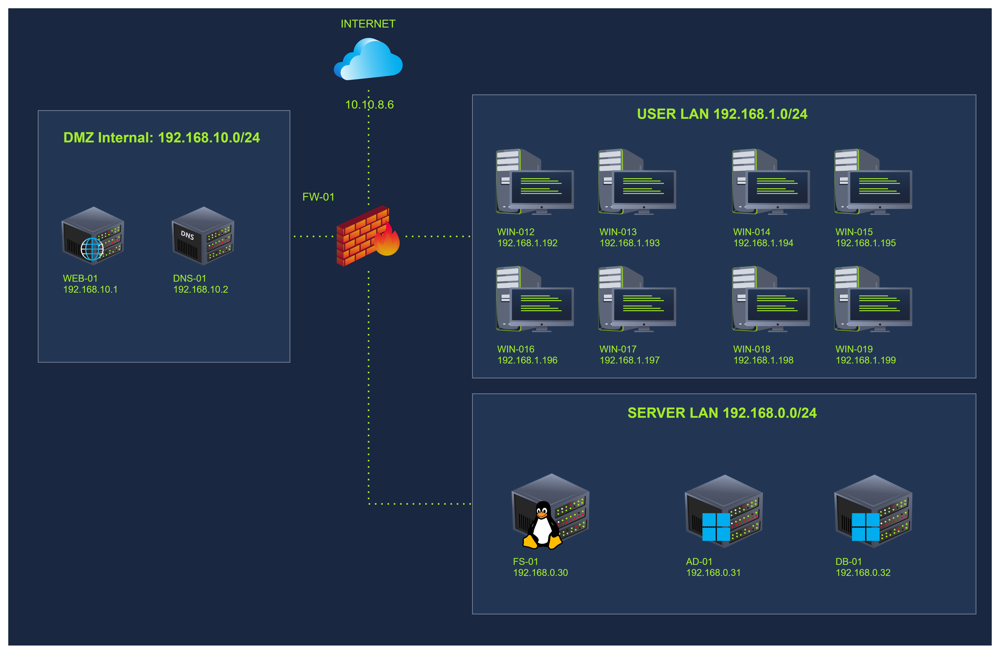
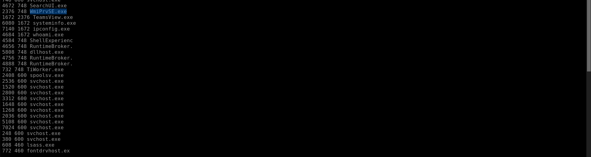
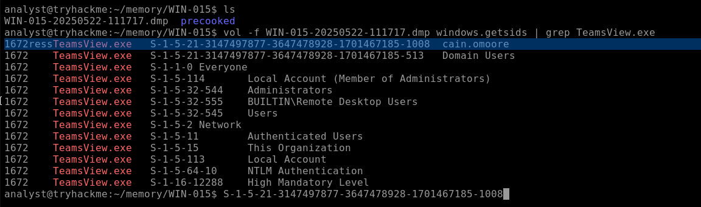
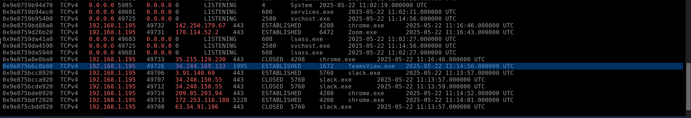
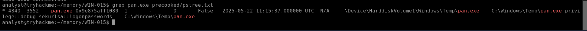
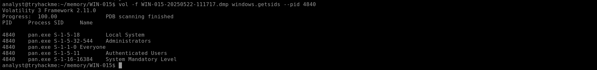

# Supplemental Memory

| Field | Details |
|---|---|
| **Room** | Supplemental Memory |
| **Difficulty** | Medium (60 min) |
| **Link** | [tryhackme.com/room/supplementalmemory](https://tryhackme.com/room/supplementalmemory) |
| **Path** | Advanced Endpoint Investigations |
| **Module** | Memory Analysis |

---

## Overview

This room closes out the TryHatMe breach storyline from a memory-only perspective. After the CEO's host **WIN-001** was compromised and Cain Omoore's cached Domain IT Admin credentials were stolen, the suspicion is that the attacker moved laterally to Cain's workstation **WIN-015**, which stores access keys to the factory control system.

For SOC L2/L3 analysts, the room shows how a single Windows memory image can answer the questions triage teams face during an incident:

- Was there **lateral movement**, and by which technique?
- What **discovery** commands ran, and where did the implant call back to?
- Was there **privilege escalation** and **credential dumping**?

**Learning objectives:** uncover the TryHatMe breach from a memory dump, identify suspicious processes and network connections, explore traces of execution and discovery, and detect potential lateral movement and credential dumping.

**Prerequisites (suggested):** Windows Memory & Processes, Windows Memory & User Activity, Windows Memory & Network.

---

## Task 1 – Introduction

Introduces the DFIR scenario: analyse a Windows workstation image suspected of compromise. No questions.

---

## Task 2 – TryHatMe Attack Scenario

### Scenario

The attacker obtained credentials of **Cain Omoore** (Domain IT Administrators member) from WIN-001. Given those privileges, the internal security team suspects lateral movement to other systems, including Cain's host **WIN-015**. Priority one: look for lateral movement and data exfiltration traces on WIN-015.



### Memory dump details

| Attribute | Value |
|---|---|
| File name | `WIN-015-20250522-111717.dmp` |
| MD5 | `15fd7b30b20b53e7374aa8894413c686` |
| Location | `/home/analyst/memory/WIN-015` |
| Pre-cooked plugin output | `/home/analyst/memory/WIN-015/precooked` |
| Framework | Volatility 3 (`vol` command) |

```bash
vol -f WIN-015-20250522-111717.dmp windows.psscan
```

> 💡 The first run of a Volatility plugin is slow due to caching; subsequent runs are much faster.

No questions in this task.

---

## Task 3 – Lateral Movement and Discovery

The room gives reference process-tree patterns for common lateral movement methods, viewed with `windows.pstree`:

| Technique | Telltale parent → child chain |
|---|---|
| PsExec | `services.exe` → `psexesvc.exe` → payload |
| WMI | `services.exe` → `svchost.exe` → `wmiprvse.exe` → payload |
| PowerShell Remoting | `services.exe` → `svchost.exe` → `wsmprovhost.exe` → `cmd.exe` → payload |

### Q1. The IR team suspects lateral movement to this host. Which executed process provides evidence of this activity?



```
WmiPrvSE.exe
```

### Q2. What is the MITRE technique ID associated with the lateral movement method used by the threat actor?

```
T1021.006
```

### Q3. Which other process was executed as part of the lateral movement activity to this host?


```
TeamsView.exe
```

🔴 `TeamsView.exe` executed as part of the lateral movement activity; its name resembles a legitimate application, so verify its path and parent process.

### Q4. What is the SID of the user account under which the process was executed on this host?



```
S-1-5-21-3147497877-3647478928-1701467185-1008
```

### Q5. What is the name of the domain-related security group the user account was a member of?


```
Domain Users
```

### Q6. Which discovery processes were executed by the threat actor on this host? (alphabetical order)


```
ipconfig.exe, systeminfo.exe, whoami.exe
```

### Q7. What Command and Control IP address did the threat actor connect to from this host? (IP:Port)



```
34.244.169.133:1995
```

### Task 3 summary

| Finding | Value |
|---|---|
| Lateral movement evidence | `WmiPrvSE.exe` |
| Technique ID (per room) | T1021.006 |
| Dropped/executed process | `TeamsView.exe` |
| Executing account SID | `S-1-5-21-3147497877-3647478928-1701467185-1008` (member of Domain Users) |
| Discovery | `ipconfig.exe`, `systeminfo.exe`, `whoami.exe` |
| C2 | `34.244.169.133:1995` |

---

## Task 4 – Privilege Escalation and Credential Dumping

The room recommends two approaches to spot privilege escalation in memory:

- **Inspect service-related processes:** attackers abuse misconfigured services to elevate.
- **Check the privilege level of the account running each process:** unusual accounts on unusual processes are a red flag.

Reference example from the room (APT41-style dump):

```bash
vol -f apt41.dmp windows.pstree
vol -f apt41.dmp windows.getsids --pid 1612
```

In the example, `543mal.exe` ran as `michael.brown` (Domain Users), while `up.exe`, spawned under `services.exe`, ran as `svc_backup` (Service Accounts), showing escalation through service manipulation.

### Q1. Identify another suspicious process on the host. Provide the full path.



```
C:\Windows\Temp\pan.exe
```

### Q2. Which account was used to execute this malicious process?



```
Local System
```

### Q3. What was the malicious command line executed by the process?


```
privilege::debug sekurlsa::logonpasswords
```

🔴 `privilege::debug` followed by `sekurlsa::logonpasswords` is the classic credential-dumping sequence against LSASS.

### Q4. Given the command line, which well-known hacker tool is the process most likely to be?

```
Mimikatz
```

### Q5. Which MITRE ATT&CK technique ID corresponds to the method used to evade detection?

```
T1036
```

💡 The binary is named `pan.exe` and sits in `C:\Windows\Temp`, not under its real tool name. Renamed tools and odd install paths are a quick hunting pivot.

### Task 4 summary

| Attribute | Value |
|---|---|
| Path | `C:\Windows\Temp\pan.exe` |
| Account | Local System |
| Command line | `privilege::debug sekurlsa::logonpasswords` |
| Tool | Mimikatz |
| Evasion technique | T1036 |

---

## Task 5 – Conclusion

The investigation confirmed the adversary:

- moved laterally to WIN-015,
- escalated privileges,
- dumped credentials.

The attacker likely exfiltrated the factory control system access keys, but confirming this needs deeper forensic analysis of the host. The compromise is more severe than first thought, and significant scoping and remediation work remains.

---

## Key Takeaways

1. **Process trees expose lateral movement.** Parent/child chains around `services.exe` and `svchost.exe` (WMI, PsExec, PowerShell Remoting) are the first thing to check.
2. **Discovery leaves footprints.** `whoami.exe`, `ipconfig.exe` and `systeminfo.exe` right after an implant lands are typical early recon.
3. **Check the SID, not just the process name.** `windows.getsids` shows which account and groups ran a suspicious process.
4. **Network artefacts tie it together.** The C2 endpoint `34.244.169.133:1995` links the implant to attacker infrastructure.
5. **Credential dumping is visible in memory.** A `Local System` process in `C:\Windows\Temp` with Mimikatz arguments is high-confidence evidence.
6. **A memory image alone can reconstruct the kill chain,** from lateral movement through discovery, C2, and credential theft.

📌 This room completes the TryHatMe memory-analysis storyline: Windows Memory & Processes → User Activity → Network → Linux Memory Analysis → Supplemental Memory.

---

*Write-up by [OPT4RUN](https://tryhackme.com/p/OPT4RUN)*