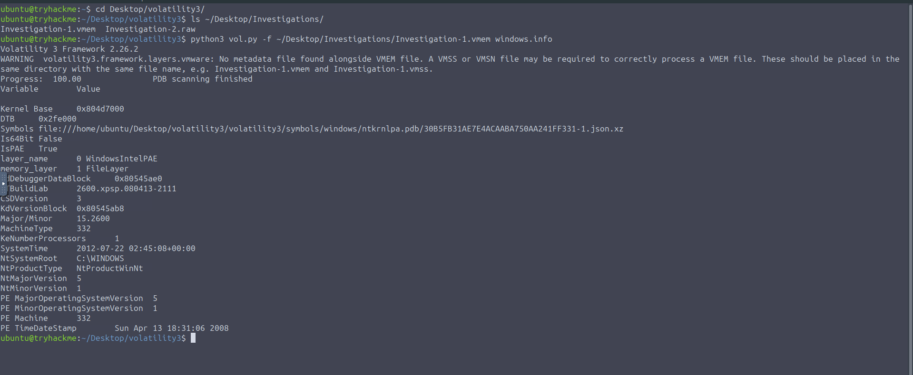
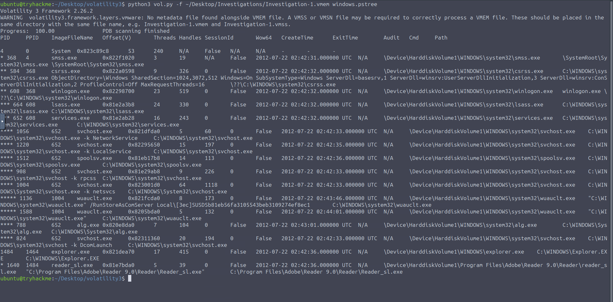
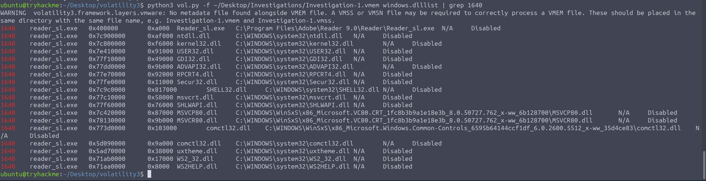
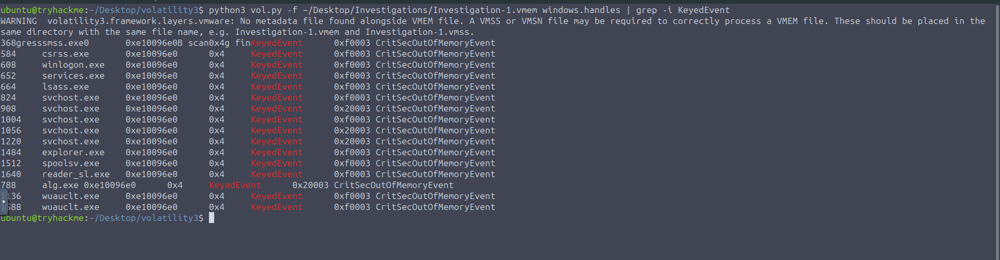
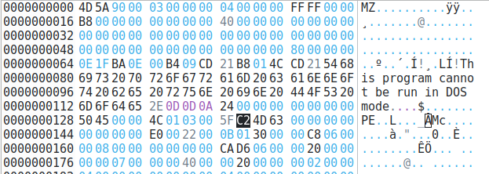
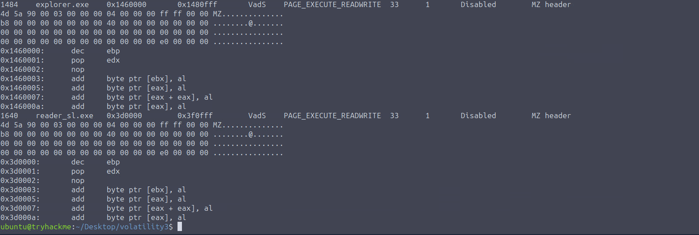
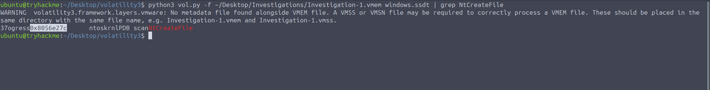
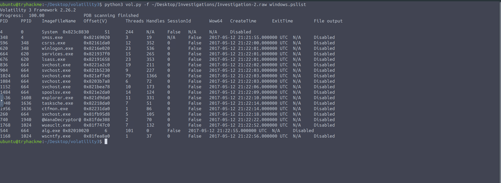
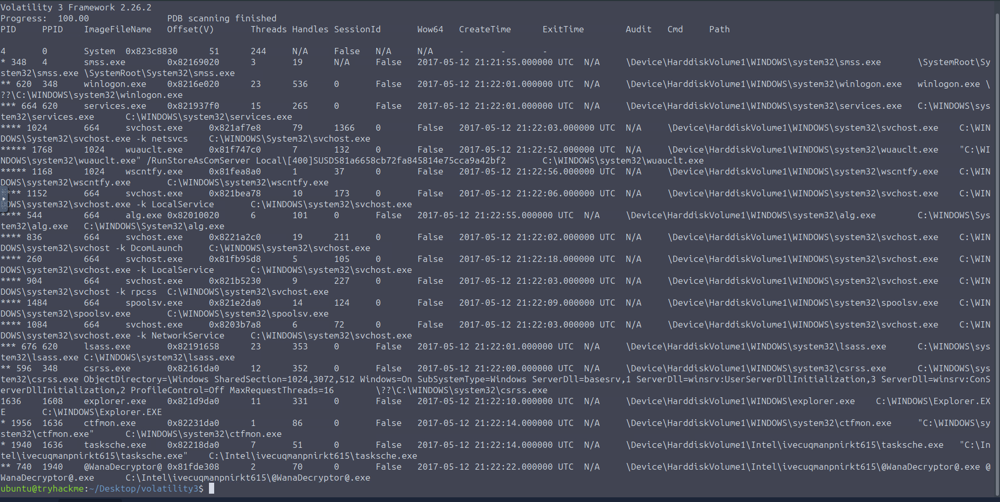

# Volatility Essentials


| | |
|---|---|
| **Room** | [Volatility Essentials](https://tryhackme.com/room/volatilityessentials) |
| **Difficulty** | Medium |
| **Path** | Advanced Endpoint Investigations |
| **Module** | Memory Analysis |


## Overview


Memory Analysis Introduction covered the *why* of memory forensics; this room is the first hands-on pass at the *how*, using **Volatility 3** as the analysis engine. For a SOC/blue team analyst, this is the tool that turns a raw memory dump into actionable artifacts — running processes, DLLs, network connections, injected code, and kernel-level manipulation. The room builds up plugin-by-plugin, then applies them across three cases: a banking trojan disguised as an Adobe document, a ransomware post-incident review, and a rootkit-style SSDT hook exercise.


## Task 1 — Introduction


No questions. Recaps Memory Analysis Introduction and sets objectives: get familiar with the Volatility Framework, use basic commands/plugins, and identify key artifacts like running processes and loaded DLLs.


## Task 2 — Volatility Overview


[Volatility](https://volatilityfoundation.org/the-volatility-framework/) is an open-source, cross-platform, modular memory forensics framework. Volatility 3 replaced the old static OS-profiling approach with **dynamic symbol resolution**, giving it better support for newer OSes, memory layouts, and full runtime-state insight.


Volatility 3's architecture is built on three layers:


- **Memory layers** — the hierarchy of address spaces, from raw memory to virtual address translations
- **Symbol tables** — OS-specific debugging symbols that let kernel/process structures be interpreted
- **Plugins** — modular routines that use the memory layers and symbol tables to extract forensic artifacts


Requires Python 3.6+, plus libraries like `pefile`, `capstone`, and `yara-python` for PE parsing, disassembly, and YARA rule matching respectively.


```bash
ubuntu@tryhackme:~/Desktop$ git clone https://github.com/volatilityfoundation/volatility3.git
ubuntu@tryhackme:~/Desktop$ cd volatility3
ubuntu@tryhackme:~/Desktop/volatility3$ python3 vol.py -h
```


💡 Volatility was pre-installed on the lab machine under `Desktop/volatility3`.


## Task 3 — Memory Acquisition and Analysis


### Acquisition tooling recap


**Windows:**


| Tool | Notes |
|---|---|
| DumpIt | Full physical memory image, 32/64-bit, auto-hashes output |
| WinPmem | Driver-based, RAW/ELF output, embeds chain-of-custody metadata |
| Magnet RAM Capture | GUI-driven, minimal footprint |
| FTK Imager | Commercial, memory + selected logical artifacts + disk imaging |


**Linux/macOS:**


| Tool | Notes |
|---|---|
| AVML | Lightweight Microsoft CLI, compressed ELF, no kernel module needed |
| LiME | Loadable kernel module, full volatile memory over disk/network, ARM/x86 |
| OSXPmem | macOS fork of Pmem, raw images on Intel Macs |


**Virtual environments** — memory is pulled from the host's virtual memory file. Format depends on hypervisor:


| Hypervisor | File |
|---|---|
| VMware | `.vmem` |
| Hyper-V | `.bin` |
| Parallels | `.mem` |
| VirtualBox | `.sav` (partial memory file only) |


### Case 001 — Adobe banking trojan


🔴 SOC has flagged a quarantined endpoint suspected of compromise by a banking trojan masquerading as an Adobe document. A suspicious IP, `41.168.5.140`, is tied to the memory dump `Investigation-1.vmem`.


Core plugins for this task: `windows.info`, `linux.info`, `pslist`, `pstree`.


`imageinfo` (OS profiling) is deprecated in Volatility 3 in favor of individual info plugins:


```bash
ubuntu@tryhackme:~/Desktop/volatility3$ python3 vol.py -f ~/Desktop/Investigations/Investigation-1.vmem windows.info
Volatility 3 Framework 2.26.2
WARNING  volatility3.framework.layers.vmware: No metadata file found alongside VMEM file. A VMSS or VMSN file may be required to correctly process a VMEM file...
Progress:  100.00               PDB scanning finished


Variable        Value


Kernel Base     0x804d7000
DTB             0x2fe000
Symbols file:///home/ubuntu/Desktop/volatility3/volatility3/symbols/windows/ntkrnlpa.pdb/30B5FB31AE7E4ACAABA750AA241FF331-1.json.xz
```


This yields system version, architecture, symbol tables, and available memory layers.


### Q&A


**What is the build version of the host machine in Case 001?**
```
2600.xpsp.080413-2111
```


**At what time was the memory file acquired in Case 001?**
```
2012-07-22 02:45:08
```


## Task 4 — Listing Processes and Connections


⚠️ Not every plugin will return results from every memory file — the capture may not have included the processes/services a given plugin targets.


| Plugin | Purpose |
|---|---|
| `windows.pslist` | Enumerates active processes via the doubly-linked process list (equivalent to Task Manager); includes terminated processes and exit times |
| `windows.psscan` | Locates `_EPROCESS` structures directly — surfaces processes rootkits have unlinked from the list; more prone to false positives |
| `windows.pstree` | Same enumeration as `pslist`, organized by parent PID for a full process hierarchy view |
| `windows.handles` | Inspects file, registry, and thread handles |
| `windows.netstat` | Identifies network connections active at extraction time — 🔴 noted as unstable on older Windows builds; `bulk_extractor` can pull a PCAP from memory as a fallback |
| `windows.netscan` | Memory-pool scanning for active/closed TCP/UDP sockets, PIDs, local/remote ports and IPs |
| `windows.dlllist` | Lists DLLs associated with each process at extraction time |


```bash
ubuntu@tryhackme:~/Desktop/volatility3$ python3 vol.py -f ~/Desktop/Investigations/Investigation-1.vmem windows.pslist
ubuntu@tryhackme:~/Desktop/volatility3$ python3 vol.py -f ~/Desktop/Investigations/Investigation-1.vmem windows.psscan
ubuntu@tryhackme:~/Desktop/volatility3$ python3 vol.py -f ~/Desktop/Investigations/Investigation-1.vmem windows.pstree
ubuntu@tryhackme:~/Desktop/volatility3$ python3 vol.py -f ~/Desktop/Investigations/Investigation-1.vmem windows.handles
ubuntu@tryhackme:~/Desktop/volatility3$ python3 vol.py -f ~/Desktop/Investigations/Investigation-1.vmem windows.netstat
ubuntu@tryhackme:~/Desktop/volatility3$ python3 vol.py -f ~/Desktop/Investigations/Investigation-1.vmem windows.netscan
ubuntu@tryhackme:~/Desktop/volatility3$ python3 vol.py -f ~/Desktop/Investigations/Investigation-1.vmem windows.dlllist
```


### Q&A


**What is the absolute path to the active Adobe process?**
```
C:\Program Files\Adobe\Reader 9.0\Reader\Reader_sl.exe
```


**What is the parent process of this process in Case 001?**
```
explorer.exe
```


**What is the PID of the parent process?**
```
1484
```


**How many DLL files are used by the Adobe process that are outside the system32 directory?**
```
3
```


**What is the name of the one KeyedEvent associated with the process's handles?**
```
CritSecOutOfMemoryEvent
```



## Task 5 — Volatility Hunting and Detection Capabilities


🔴 Advanced threats can run entirely in memory, leaving no disk artifacts — this is the hunting layer for injected code, malware, and custom YARA-based detection.


**`malfind`** — detects injected processes: PID, offset address, and Hex/ASCII/Disassembly views of the infected region. It scans the heap for memory regions with the executable bit set (RWE/RX) and/or no backing file on disk (fileless malware indicator). An **MZ header** in the flagged region indicates a Windows executable; otherwise it may be raw shellcode requiring further analysis.



```bash
ubuntu@tryhackme:~/Desktop/volatility3$ python3 vol.py -f ~/Desktop/Investigations/Investigation-1.vmem windows.malfind
```

**`vadinfo`** — detailed Virtual Address Descriptor info, useful for manually inspecting suspicious memory regions and heap allocations.


```bash
ubuntu@tryhackme:~/Desktop/volatility3$ python3 vol.py -f ~/Desktop/Investigations/Investigation-1.vmem windows.vadinfo
```

### Q&A


**What processes in the Case 001 memory file contain a header that points to a Windows executable file?**
```
explorer.exe,reader_sl.exe
```



## Task 6 — Advanced Memory Forensics


🔴 Kernel-mode rootkits conceal processes, files, and drivers by modifying kernel structures directly — this task covers detecting that manipulation.


**Hooking** lets malware intercept/redirect system-level functions for evasion or persistence. Hooks aren't inherently malicious (AV and debuggers use them too) — the analyst's job is judging whether a hook matches expected behavior or represents interference.


**SSDT hooks** — the System Service Descriptor Table resolves addresses for system calls; rootkits overwrite entries to redirect calls like `NtCreateFile` to malicious code.


```bash
ubuntu@tryhackme:~/Desktop/volatility3$ python3 vol.py -f ~/Desktop/Investigations/Investigation-1.vmem windows.ssdt
```


💡 Run SSDT inspection after spotting suspicious kernel modules or abnormal process behavior.


**`windows.modules`** — lists loaded drivers/kernel modules with base address, size, and file path.


```bash
ubuntu@tryhackme:~/Desktop/volatility3$ python3 vol.py -f ~/Desktop/Investigations/Investigation-1.vmem windows.modules
```


**`windows.driverscan`** — scans raw memory for `DRIVER_OBJECT` structures that `windows.modules` would miss if unlinked from standard lists.


```bash
ubuntu@tryhackme:~/Desktop/volatility3$ python3 vol.py -f ~/Desktop/Investigations/Investigation-1.vmem windows.driverscan
```


💡 Use `driverscan` when DKOM (Direct Kernel Object Manipulation) or rootkit behavior is suspected.


### Q&A


**What is the address for the NtCreateFile system call?**
```
0x8056e27c
```



## Task 7 — Practical Investigations


### Case 002 — Ransomware post-incident analysis


🔴 A corporation was hit by a ransomware chain affecting organizations internationally; the team has already recovered via backups. The task is post-incident: identify the threat actors and what occurred, using a raw memory dump (`Investigation-2.raw`).


### Q&A


**What suspicious process is running at PID 740?**
```
@WanaDecryptor@
```


**What is the full path of the suspicious binary in PID 740?**
```
C:\Intel\ivecuqmanpnirkt615\@WanaDecryptor@.exe
```


**What is the parent process of PID 740?**
```
tasksche.exe
```


**From our current information, what malware is present on the system?**
```
WannaCry
```


**What plugin could be used to identify all files loaded from the malware working directory?**
```
windows.filescan
```


## Task 8 — Conclusion


Closes out with a list of further plugins worth knowing:


| Plugin | Purpose |
|---|---|
| `windows.callbacks` | Inspects registered callback functions (process/image/thread creation) for unknown driver associations |
| `windows.driverirp` | Examines driver IRP dispatch tables for suspicious drivers with no/abnormal IRP functions |
| `windows.modscan` | Scans for loaded kernel modules without relying on linked lists — catches stealth drivers |
| `windows.moddump` | Extracts suspicious drivers/modules from memory for static analysis (e.g. Ghidra, IDA) |
| `windows.memmap` | Deeper extraction of memory regions from specific processes for injected code/artifact analysis |
| `yarascan` | Searches memory for strings, patterns, and compound rules via a YARA file or inline rule |


📌 The room's own conclusion points to Memory Acquisition as the "next room" — that room has already been completed and documented in this repo, so it's being tracked out of the platform's suggested order here.


## Key Takeaways


- Volatility 3 dropped static OS profiling for dynamic symbol resolution — use `windows.info`/`linux.info` instead of the deprecated `imageinfo`
- Cross-check `pslist` against `psscan` when rootkit-style process hiding is suspected — the two use fundamentally different enumeration techniques
- `malfind` is the go-to for fileless/injected malware: RWE/RX memory with no backing file, or presence of an MZ header, are the key signals
- SSDT hook inspection (`windows.ssdt`) is a targeted follow-up once kernel modules or process behavior already look abnormal — not a first-pass plugin
- `driverscan` catches what `modules` can miss: unlinked/hidden drivers indicating DKOM or rootkit activity
- Real-world case patterns held up: an Adobe-masquerading banking trojan surfaced through parent/child process and DLL analysis, and WannaCry was identifiable purely from process path and parent process (`tasksche.exe` → `@WanaDecryptor@.exe`)


---
*Write-up by OPT4RUN*