| Room | Platform | Path | Difficulty | Category | Room Link | Author |
|------|----------|------|------------|----------|-----------|--------|
| Windows Applications Forensics | TryHackMe | Advanced Endpoint Investigations — Windows Endpoint Investigation | Medium | Digital Forensics / IR | [Room Link](https://tryhackme.com/room/windowsapplications) | [OPT4RUN](https://tryhackme.com/p/OPT4RUN) |

## Overview

This room focuses on live forensic analysis of common enterprise applications on a compromised Windows workstation. Threat actors frequently abuse built-in applications (scheduled tasks, services), browsers, and Microsoft 365 office applications (Outlook, Teams, OneDrive) to establish persistence, deliver phishing payloads, and exfiltrate data.

🔴 From a SOC/blue team perspective, this room is significant because it demonstrates how to pivot across multiple application artefacts — scheduled tasks, services, browser history/cookies, email, chat, and cloud sync logs — to reconstruct a complete attack chain from initial access (phishing) through persistence and potential data exfiltration.

**Scenario:** Swift Spend Logistics LLC, a startup, triggered a critical alert on a shared customer support workstation used by three rotating employees. With centralised SIEM logging still incomplete, the investigation requires live triage of the host while disk/memory artefacts are collected separately.

## Task 2 — Log Insights: Scheduled Tasks and Services

Scheduled tasks and services are common persistence mechanisms abused by threat actors. Windows Event Logs provide visibility into their creation/modification:

- **Event ID 4698** — Scheduled task created
- **Event ID 4702** — Scheduled task updated
- **Event ID 7045** — New service installed (System channel)
- **Event ID 4697** — Service installed (Security channel)

```powershell
# System Channel = Event ID 7045
Get-WinEvent -FilterHashTable @{LogName='System';ID='7045'} | fl

# Security Channel = Event ID 4697
Get-WinEvent -FilterHashTable @{LogName='Security';ID='4697'} | fl
```

🔴 Key indicators of malicious scheduled tasks/services: unusual command execution paths, non-administrative user context, privileged execution context, suspicious trigger intervals, and deviations from baseline deployments across the fleet.

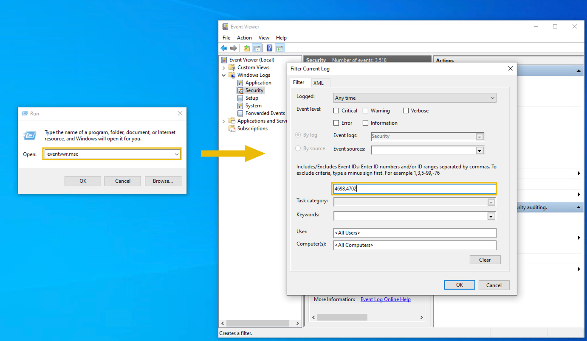

**Q: Who created the malicious scheduled tasks?**
```
mike.myers
```

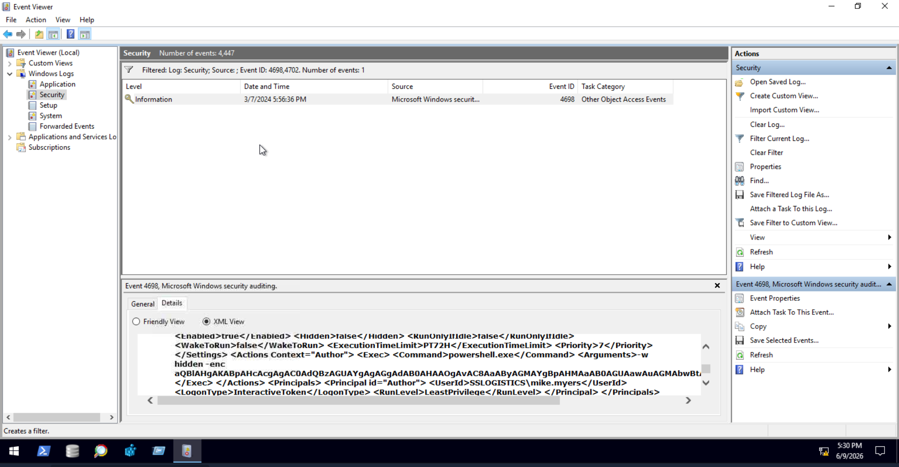

**Q: Based on the ones discovered from the logs, what URL is accessed by this malicious scheduled task? (format: defanged URL)**
```
hxxp[://]hrcbishtek[.]com/a
```

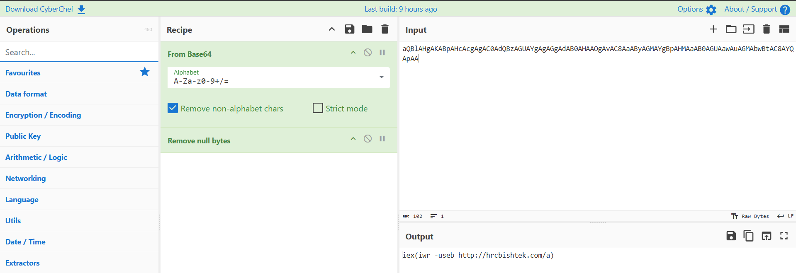

**Q: Based on the logs, what is the name of the malicious service?**
```
server power
```

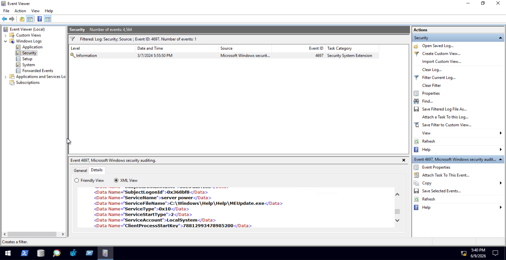

> ⚠️ Note: source notes reference this screenshot as `tas2-04.png`. Corrected to `task2-04.png` to match the project's naming convention — verify the file is named accordingly before uploading.

## Task 3 — Manual Inspection: Scheduled Tasks

When advanced audit policies are not enabled, scheduled tasks must be reviewed manually using `taskschd.msc` or PowerShell.

### GUI Methodology

1. Sort Active Tasks by **Next Run Time** and inspect the soonest-to-execute first.
2. Compare **Task Name** naming conventions for outliers.
3. Check **Location** — tasks created without a specified location default to `\`.

**Example walkthrough — Office ClickToRun Service Monitor:**
- Runs at 4:00 AM daily, with a post-trigger condition
- Runs as `SYSTEM`, regardless of logon state
- Runs with highest privileges
- Action executes `OfficeC2RClient.exe` from a known Office directory

🔴 Settings abused by threat actors for persistence/stealth:
- **Run task as soon as possible** — ensures execution even if the schedule was missed
- **Task failure setting** — re-attempts execution on failure
- **Stop after a specific time** — limits the window of malicious activity to evade detection
- **Auto deletion** — self-cleans the task after execution

### Filesystem & Command-Line Methodology

Scheduled tasks are stored as XML at `C:\Windows\System32\Tasks`, mirroring the Task Scheduler's location hierarchy. File system metadata (Last Modified, Created) can reveal task tampering.

```powershell
# List all enabled scheduled tasks
Get-ScheduledTask | Where-Object {$_.State -ne "Disabled"}

# Alternative using schtasks.exe
schtasks.exe /query /fo CSV | findstr /V Disabled

# List enabled tasks sorted by creation date with author info
Get-ScheduledTask | Where-Object {$_.Date -ne $null -and $_.State -ne "Disabled"} | Sort-Object Date | select Date,TaskName,Author,State,TaskPath | ft
```

```powershell
# Combined script: scheduled tasks with full execution context, sorted by creation date
$tasks = Get-ScheduledTask | Where-Object {$_.Date -ne $null -and $_.State -ne "Disabled" -and $_.Actions.Execute -ne $null} | Sort-Object Date

foreach ($task in $tasks) {
    $taskName = $task.TaskName
    $taskDate = $task.Date
    $taskPath = $task.TaskPath
    $taskAuthor = $task.Author
    $taskCommand = $task.Actions.Execute
    $taskArgs = $task.Actions.Arguments
    $taskRunAs = $task.Principal.UserId

    Write-Host "Task Name: $taskName"
    Write-Host "Task Author: $taskAuthor"
    Write-Host "Creation Date: $taskDate"
    Write-Host "Task Path: $taskPath"
    Write-Host "Command: $taskCommand $taskArgs"
    Write-Host "Run As: $taskRunAs"
    Write-Host ""
}
```

**Q: Aside from the scheduled tasks from Windows Event Logs, what does the second malicious scheduled task execute?**
```
C:\Users\Public\pagefilerpqy.exe
```

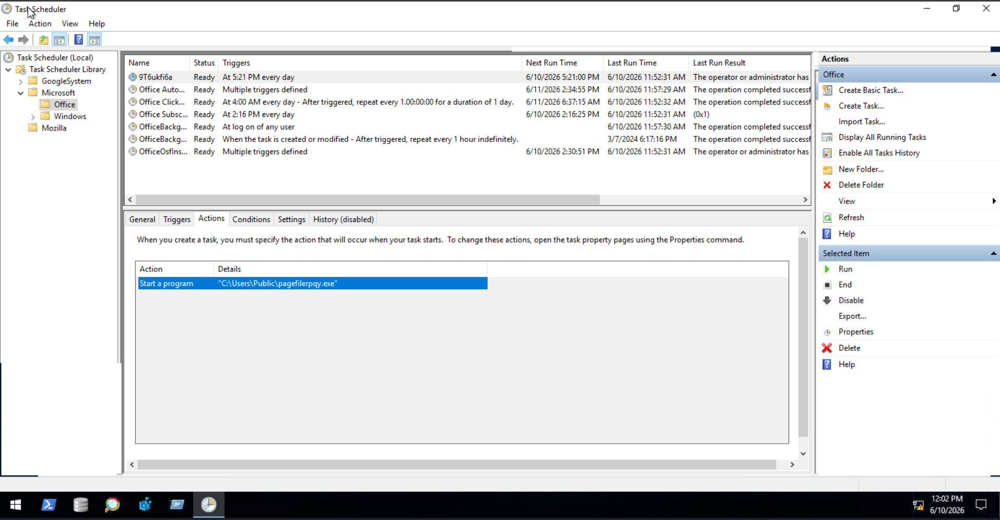

**Q: Based on Q1, what time does the second malicious task execute daily? (format: HH:MM)**
```
17:21
```


## Task 4 — Manual Inspection II: Services

Similar to scheduled tasks, services can be reviewed manually via `services.msc`, the registry, and PowerShell when event logging is unavailable.

### GUI Methodology

Focus on services with **Status: Running** and **Startup Type: Automatic** — threat actors favour these for boot persistence.

🔴 The **Recovery** tab can be abused:
- Run an alternate (malicious) program on first failure
- Restart the service on subsequent failures to maintain persistence
- Restart after a delay to keep the implant alive

Use Task Manager's **Services** tab to correlate service names with their PIDs and underlying processes.

### Registry & Command-Line Methodology

Service configuration is stored at `HKLM\SYSTEM\CurrentControlSet\Services`. The registry key's **Last Write Time** can approximate the service's creation/modification date (export the key to a `.txt` file via Registry Editor to view it).

```powershell
# List running services set to start automatically
Get-Service | Where-Object {$_.Status -eq "Running" -and $_.StartType -eq "Automatic"}
```

```powershell
# Add executable path and execution context
$services = Get-Service | Where-Object {$_.Status -eq "Running" -and $_.StartType -eq "Automatic"}

foreach ($service in $services) {
    $serviceName = $service.Name
    $serviceDisplayName = $service.DisplayName
    $serviceStatus = $service.Status
    $serviceWMI = (Get-WmiObject Win32_Service | Where-Object { $_.Name -eq $serviceName })
    $servicePath = $serviceWMI.PathName
    $serviceUser = $serviceWMI.StartName

    Write-Host "Service Name: $serviceName"
    Write-Host "Display Name: $serviceDisplayName"
    Write-Host "Service Status: $serviceStatus"
    Write-Host "Executable Path: $servicePath"
    Write-Host "User Context: $serviceUser"
    Write-Host ""
}
```

```powershell
# Include registry key Last Write Time using Get-RegWriteTime.ps1 (C:\Tools\)
powershell.exe -ep bypass

Import-Module C:\Tools\Get-RegWriteTime.ps1;
$services = Get-Service | Where-Object {$_.Status -eq "Running" -and $_.StartType -eq "Automatic"}

foreach ($service in $services) {
    $serviceName = $service.Name
    $serviceWMI = (Get-WmiObject Win32_Service | Where-Object { $_.Name -eq $serviceName })
    $serviceDisplayName = $service.DisplayName
    $serviceStatus = $service.Status
    $servicePath = $serviceWMI.PathName
    $serviceUser = $serviceWMI.StartName
    $serviceLastWriteTime = Get-Item HKLM:\SYSTEM\CurrentControlSet\Services\$serviceName | Get-RegWriteTime | Select LastWriteTime

    Write-Host "Service Name: $serviceName"
    Write-Host "Display Name: $serviceDisplayName"
    Write-Host "Service Status: $serviceStatus"
    Write-Host "Executable Path: $servicePath"
    Write-Host "User Context: $serviceUser"
    Write-Host "Last Write Time: $serviceLastWriteTime"
    Write-Host ""
}
```

🔴 Stopped services with **Automatic** start type should also be reviewed — a malicious service may stop itself after process injection/migration into another process.

```powershell
# Review stopped services set to Automatic start
Import-Module C:\Tools\Get-RegWriteTime.ps1;
$services = Get-Service | Where-Object {$_.Status -eq "Stopped" -and $_.StartType -eq "Automatic"}
# ... (same enumeration logic as above)
```

**Q: Aside from the service determined through logs, what is the full path of the binary executed by the second malicious service?**
```
C:\Windows\Temp\aKzjdD.exe
```

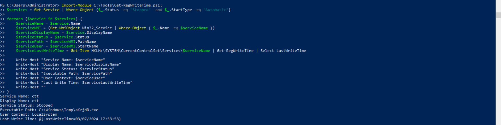

**Q: What is the last write time of the second malicious service? (format: MM/DD/YYYY HH:MM:SS)**
```
03/07/2024 17:53:53
```


## Task 5 — Dissecting Browser Artefacts I: Mozilla Firefox

Browser artefacts are stored under `AppData\Roaming\Mozilla\Firefox\Profiles\[a-z0-9]{8}\.default.*`.

```powershell
ls C:\Users\ | foreach {ls "C:\Users\$_\AppData\Roaming\Mozilla\Firefox\Profiles" 2>$null}
```

| File / Directory | Contents | Type |
|---|---|---|
| `places.sqlite` | Browsing history and bookmark metadata | SQLite |
| `logins.json` / `key4.db` | Saved credentials | JSON / SQLite |
| `cookies.sqlite` | Cookies from accessed sites | SQLite |
| `extensions.json` / extensions dir | Extension artefacts | JSON / Folder |
| `favicons.sqlite` | Favicon metadata indicating sites accessed | SQLite |
| `sessionstore-backups` | Session/tab metadata | Folder (jsonlz4) |
| `formhistory.sqlite` | Form input data | SQLite |

### Scenario: Phishing Link Access

In `places.sqlite`, the **moz_places** table provides URL, title, visit count, last visit date (epoch), and `typed` flag. Correlating `place_id` with **moz_historyvisits** reveals all visit timestamps and `visit_type` (e.g. `1 - TRANSITION_LINK`, `2 - TRANSITION_TYPED`, `7 - TRANSITION_DOWNLOAD`).

The **moz_annos** table (correlated via `place_id`) contains download metadata, including the storage location of downloaded files.

🔴 In `cookies.sqlite` (**moz_cookies** table), session cookies such as Microsoft Entra/O365's `ESTSAUTH` (transient) and `ESTSAUTHPERSISTENT` (persistent) can indicate successful authentication to a phishing site mimicking O365 — a strong indicator of an evilginx2-style MITM phishing attack.

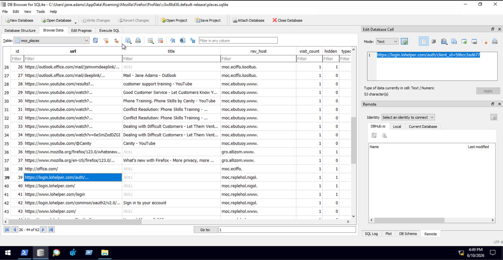

**Q: What is the first URL accessed by the user related to the phishing website? (format: defanged URL)**
```
hxxps[://]login[.]lohelper[.]com/auth/client_id=59bcc3ad677
```

**Q: Based on Q1, what time did the user access this URL in the UTC timezone? (format: MM/DD/YYYY HH:MM:SS)**
```
03/04/2024 20:53:32
```

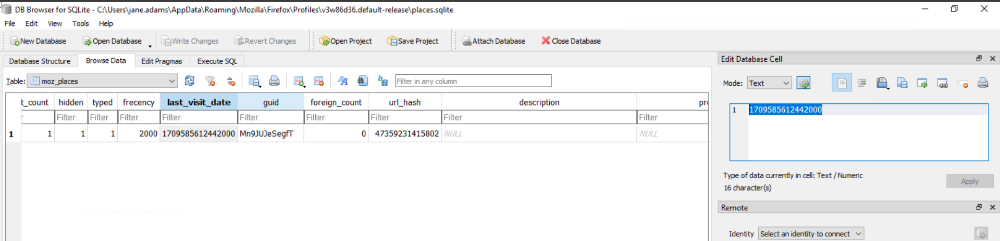

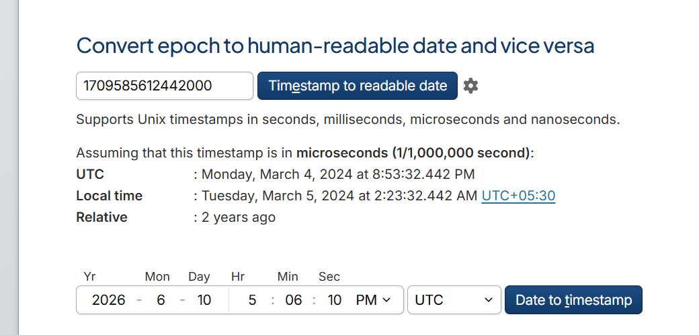

**Q: Which O365 cookie containing user session information was seen on the phishing website?**
```
ESTSAUTHPERSISTENT
```

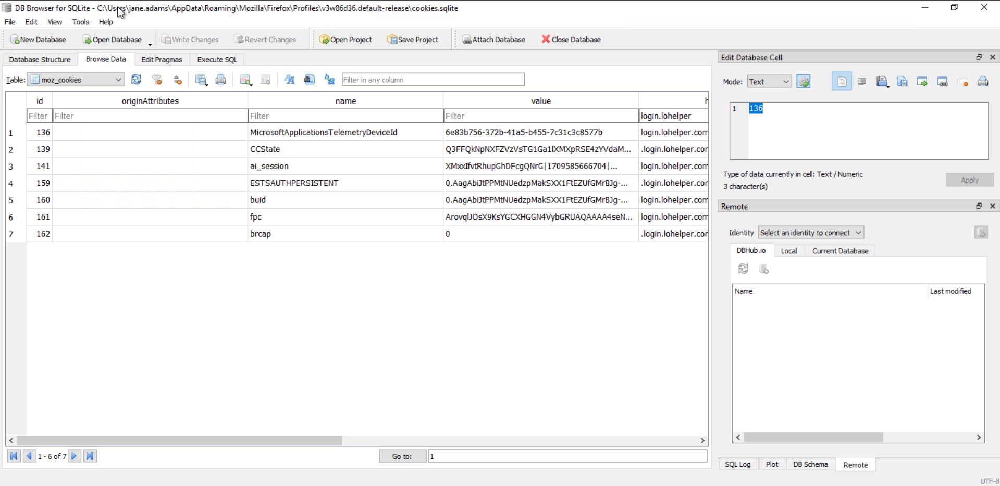

## Task 6 — Dissecting Browser Artefacts II: Google Chrome

Chrome artefacts are stored under `AppData\Local\Google\Chrome\User Data\Default`.

```powershell
ls C:\Users\ | foreach {ls "C:\Users\$_\AppData\Local\Google\Chrome\User Data\Default" 2>$null | findstr Directory}
```

| File / Directory | Contents | Type |
|---|---|---|
| `History` | Browsing history and download metadata | SQLite |
| `Login Data` | Saved credentials | SQLite |
| `Extensions` | Extension artefacts | Folder (JS/meta) |
| `Cache` | Cached files | Folder |
| `Sessions` | Session/tab metadata | Folder |
| `Bookmarks` | Bookmark metadata | JSON |
| `Web Data` | Form input data | SQLite |

### Scenario: Malicious Browser Extension

Extension artefacts are stored under `Extensions\<extension-id>\<version>\`, with behaviour defined in `manifest.json`.

```powershell
cd 'C:\Users\mike.myers\AppData\Local\Google\Chrome\User Data\Default\Extensions\nchfdofnmealimhgfkncdfkionopnanf\1.0_0\'
cat manifest.json
```

The extension, named **"Keystroke Harvester"**, declared a `background` service worker (`background.js`) and a `content_scripts` entry (`script.js`) injected into all visited sites (`*://*/*`).

🔴 Reviewing `script.js` revealed:
- An `XMLHttpRequest` POST to a remote domain on page load, exfiltrating the current site's URL
- A `document.onkeydown` listener capturing keystrokes into a `keys` variable
- A `setInterval` loop POSTing collected keystrokes to the same remote domain at fixed intervals

This confirms the extension is a malicious keylogger exfiltrating browsing context and keystrokes via HTTP POST.

**Q: What URL does the malicious Chrome extension report to? (format: defanged URL)**
```
hxxps[://]kamehasuitens[.]info/track
```

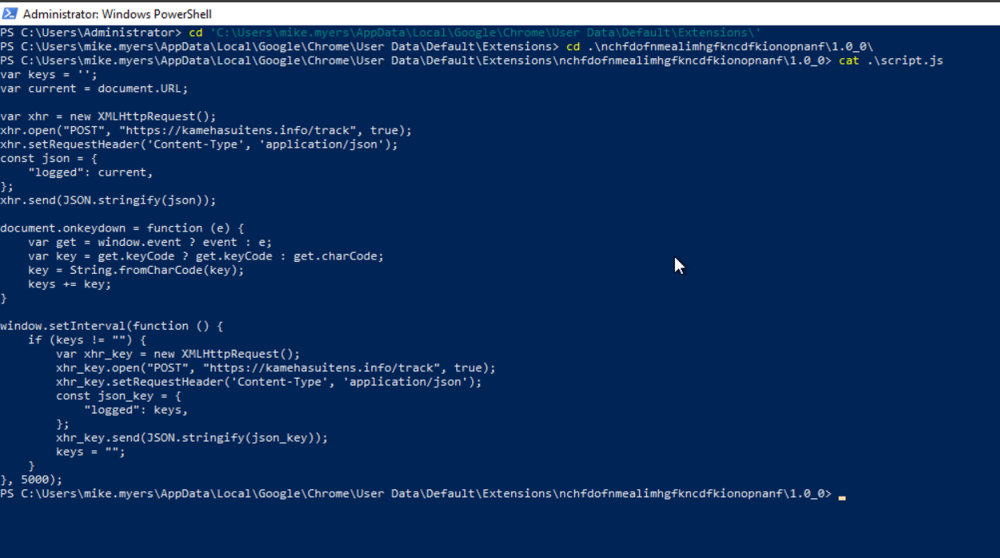

## Task 7 — Dissecting Browser Artefacts III: Microsoft Edge

Edge (Chromium-based) artefacts share Chrome's structure, stored under `AppData\Local\Microsoft\Edge\User Data\Default`.

```powershell
ls C:\Users\ | foreach {ls "C:\Users\$_\AppData\Local\Microsoft\Edge\User Data\Default" 2>$null | findstr Directory}
```

**ChromeCacheView** can be repointed to Edge's cache directory (e.g. for user `suzy.chen`) to reveal Last Accessed timestamps, cached URLs, originating Web Site, and Content Type — useful supporting evidence for browsing activity.

💡 For deeper analysis, **Hindsight** parses Chromium-based browser artefacts (history, downloads, cookies, extensions) into a queryable SQLite database via its GUI at `http://localhost:8080`.

```sql
-- URLs visited with visit metadata
SELECT timestamp,url,title,visit_duration,visit_count,typed_count FROM 'timeline' WHERE type = 'url' LIMIT 0,30

-- Download attempts
SELECT timestamp,url,title,value FROM timeline WHERE type = 'download' LIMIT 0,30

-- Cookie/storage metadata
SELECT type,origin,key,value FROM 'storage' LIMIT 0,30
```

💡 Saving Hindsight's output as a standalone SQLite DB (rather than viewing in-browser) avoids truncated column values and allows analysis in DB Browser for SQLite.

**Q: What is the first URL the Microsoft Edge user accessed related to the malicious domain? (format: defanged URL)**
```
hxxps[://]login[.]dxsupport[.]net/mmTQJpka
```

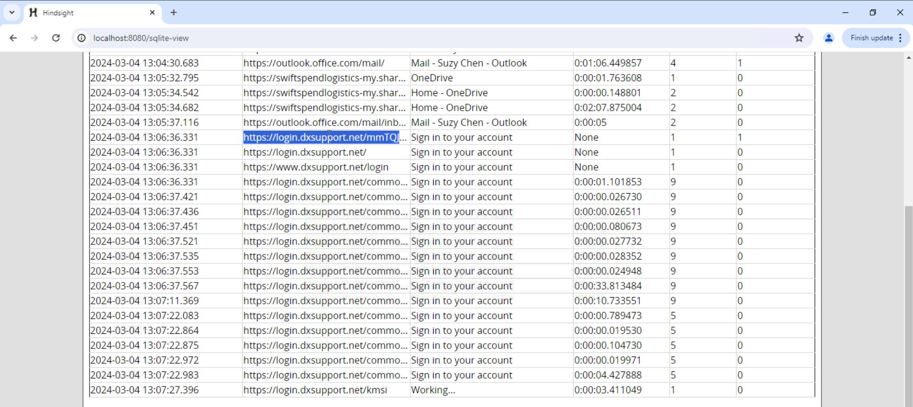

## Task 8 — Deep-Diving on Office Applications I: Microsoft Outlook

Outlook artefacts are located at `AppData\Local\Microsoft\Outlook\`, containing an OST file (`user_email@domain.com.ost`) — a local synchronised mailbox copy.

```powershell
ls C:\Users\ | foreach {ls "C:\Users\$_\AppData\Local\Microsoft\Outlook\" 2>$null | findstr Directory}
```

**XstReader** is used to open and browse the OST file's mailbox tree (`Root - Mailbox > IPM_SUBTREE > Inbox / Sent Items / Deleted Items / Junk Email`).

### Scenario: Phishing Emails

Investigation methodology:

1. **Emails with attachments** — identified via the paperclip indicator. 🔴 Focus on archives (`.zip`, `.7z`), documents (`.doc`, `.xls`), and HTML files for code execution or credential-harvesting indicators.
2. **Evidence of opened attachments** — check `AppData\Local\Microsoft\Windows\INetCache\Content.Outlook\<random>\`, which temporarily caches files opened directly from Outlook (cleared on client termination).
3. **Emails with links** — verify whether the displayed text matches the actual hyperlink (masquerading), and correlate with browser history to confirm if the link was clicked.
4. **Email headers** — reviewed via the **Properties** dialog, focusing on `Date`, `From`, `Received` (delivery path), and `X-Mailer`.

**Q: What email is used by the phishing email sender?**
```
julianne.westcott@hotmail.com
```

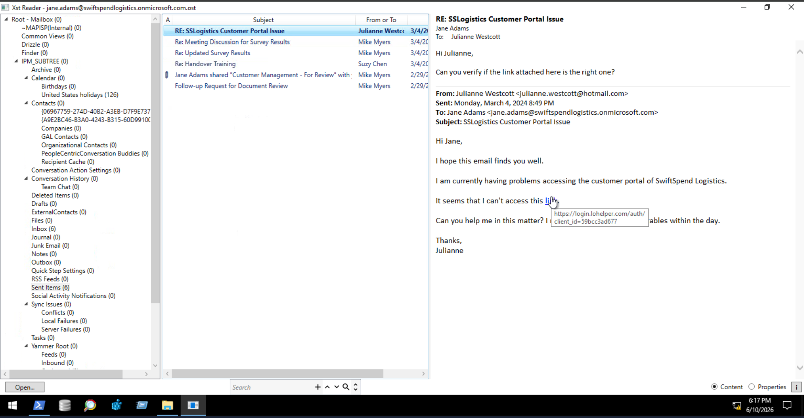

## Task 9 — Deep-Diving on Office Applications II: Microsoft Teams

Teams metadata is stored at `AppData\Roaming\Microsoft\Teams\IndexedDB\`, specifically within `.leveldb` directories.

```powershell
ls C:\Users\ | foreach {ls "C:\Users\$_\AppData\Roaming\Microsoft\Teams" 2>$null | findstr Directory}
ls C:\Users\mike.myers\AppData\Roaming\Microsoft\Teams\IndexedDB\
```

The **forensicsim** (`ms_teams_parser.exe`) tool converts the LevelDB store into JSON:

```powershell
C:\Tools\ms_teams_parser.exe -f C:\Users\mike.myers\AppData\Roaming\Microsoft\Teams\IndexedDB\https_teams.microsoft.com_0.indexeddb.leveldb\ -o output.json
```

| Record Type | Key Fields |
|---|---|
| `contact` | `displayName`, `email`, `mri`, `userPrincipalName` |
| `message` | `conversationId`, `composetime`/`createdTime`, `content`, `creator` (MRI), `isFromMe`, `properties` (attachments/edits) |

A correlation script builds a `mri → userPrincipalName` lookup table from `contact` records, groups `message` records by `conversationId`, and renders sorted conversation threads with sender, direction, content, and any file attachment details (`fileName`, `fileUrl`, `fileType` from `properties.files`).

### Scenario: Phishing via Microsoft Teams

🔴 Reviewing the `properties.files` field of message records identified a malicious file attachment delivered via Teams chat. The attachment was correlated with its embedded payload URL — pivot points for further filesystem and execution-evidence analysis (Downloads/Desktop/Documents directories, execution artefacts).

**Q: What is the file name of the malicious attachment sent via Microsoft Teams?**
```
system_update.zip
```

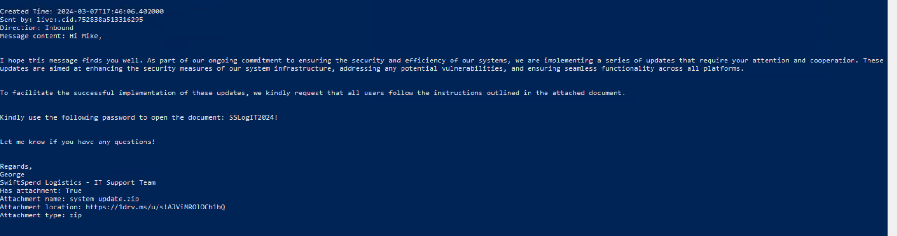

**Q: What is the URL found inside the malicious attachment? (format: defanged URL)**
```
hxxp[://]cdn[.]nautilusco[.]net/a[.]ps1
```

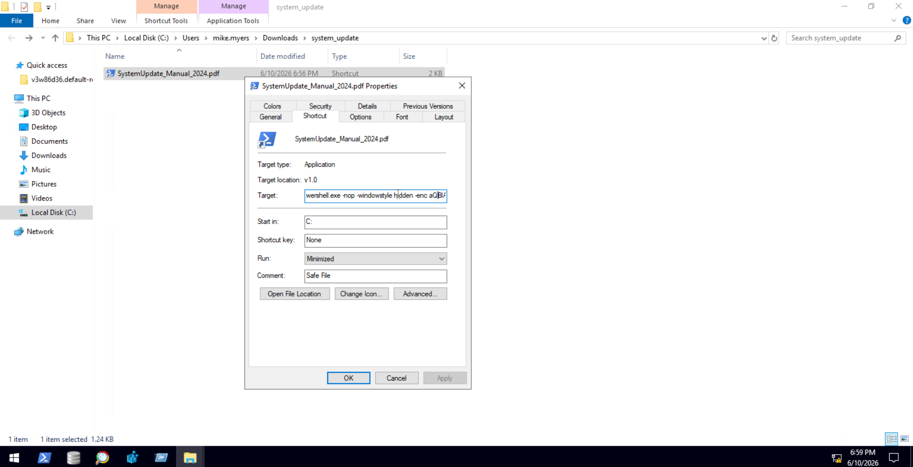

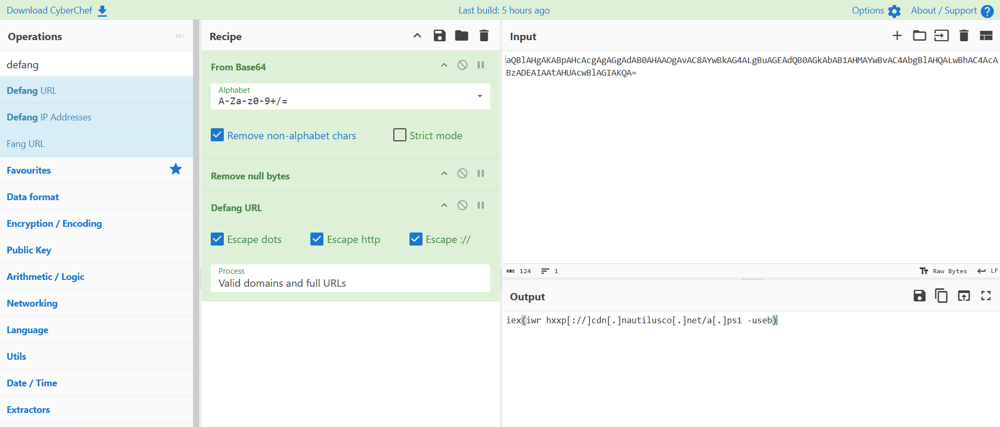

## Task 10 — Deep-Diving on Office Applications III: Microsoft OneDrive

OneDrive artefacts are stored at `AppData\Local\Microsoft\OneDrive\logs`, under `Business*` and/or `Personal` subdirectories (enterprise environments typically use `Business`).

| File | Contents |
|---|---|
| `SyncEngine.odl` (and `.odlgz`) | All sync operations, including per-file processing details |
| `SyncDiagnostics.log` | Sync diagnostics — upload/download progress, byte counts, file counts |

**OneDriveExplorer** (run as administrator) parses ODL files via **File > Live system**, traversing every user's OneDrive AppData directory.

Key properties surfaced:
- `name` — file name
- `lastChange` — last modification timestamp
- `status` — cloud-only vs. locally stored
- `size` — file size

🔴 The main OneDrive folder's properties expose the **associated OneDrive/SharePoint link** and local sync path — useful for spotting unauthorised personal/external OneDrive folders synced for data exfiltration. The tool also surfaces **deleted files** with deletion timestamps and original locations, useful for identifying anti-forensic cleanup.

**Q: What is the URL of the unusual SharePoint site synced by the user?**
```
https://swiftspendlogistics.sharepoint.com/sites/ProjectManagement
```

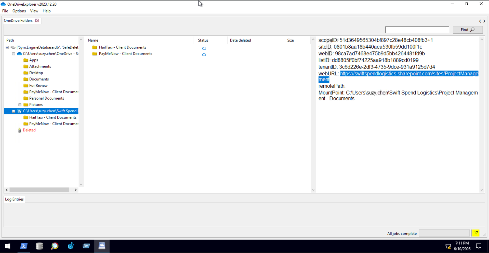

## Key Takeaways

- **Scheduled tasks and services** remain prime persistence vectors; absence of audit logging requires manual review via `taskschd.msc`/`services.msc`, the Tasks directory (`C:\Windows\System32\Tasks`), and the `HKLM\SYSTEM\CurrentControlSet\Services` registry hive.
- Registry key **Last Write Time** can approximate (but not confirm) service creation/modification dates.
- **Browser artefacts** (Firefox `places.sqlite`/`cookies.sqlite`, Chrome/Edge `History`/extensions) provide a timeline of phishing link access, session cookie theft (e.g. `ESTSAUTHPERSISTENT`), and malicious browser extensions exfiltrating data via simple unobfuscated JavaScript.
- **Hindsight** is a strong tool for parsing Chromium-based (Chrome/Edge) artefact databases into queryable SQLite output.
- **Office application artefacts** — Outlook OST files (via XstReader), Teams IndexedDB/LevelDB stores (via forensicsim), and OneDrive sync logs (via OneDriveExplorer) — extend the investigation to email phishing, chat-based malware delivery, and cloud exfiltration vectors.
- **Cross-artefact correlation** (browser history ↔ email links ↔ Teams attachments ↔ OneDrive sync) is essential to reconstruct the full attack chain from initial phishing access through persistence and exfiltration.

---

*Write-up by [OPT4RUN](https://tryhackme.com/p/OPT4RUN)*