# Windows Incident Surface

| Field | Details |
|-------|---------|
| **Platform** | TryHackMe |
| **Path** | Advanced Endpoint Investigations |
| **Module** | Windows Endpoint Investigation |
| **Difficulty** | Medium |
| **Category** | Digital Forensics / IR |
| **Room Link** | [tryhackme.com/room/winincidentsurface](https://tryhackme.com/room/winincidentsurface) |
| **Author** | [OPT4RUN](https://tryhackme.com/p/OPT4RUN) |

---

## Overview

This room covers the Windows incident surface from a live analysis perspective — building a systematic triage workflow rather than an exhaustive forensic deep-dive. The focus is on **efficient artefact hunting with high ROI**: environment integrity checks, system profiling, user/session analysis, network scope, startup/registry persistence, services/scheduled tasks, and process/directory analysis.

From a SOC/IR perspective, this room is important because it mirrors the first-response workflow on a live compromised Windows endpoint — where time is critical and the analyst needs actionable findings fast. The VM is intentionally infected, and several connected artefacts from different investigation areas link back to the same attack chain.

---

## Task 1 — Introduction

The room establishes the investigation philosophy: **efficient triage over exhaustive analysis**. The goal is to identify artefacts with the highest signal-to-noise ratio during a live Windows investigation. Key prerequisites include Windows Fundamentals and Windows Internals knowledge, plus comfort with PowerShell and CMD.

The VM is live and infected — session disconnects are expected behaviour due to the running malware. The RDP credentials for manual connection are:

- **Username:** Administrator  
- **Password:** 3xPl0reR!

---

## Task 2 — Reliability of System Tools

### Concept

Before running any investigation tooling, the integrity of the environment itself must be validated. Attackers can hijack execution flow via modified environment variables (ATT&CK: T1574.007) — most dangerously through a malicious **PowerShell profile**, which executes automatically every time PowerShell launches.

The room introduces a **BYOT (Bring Your Own Tools)** approach: using a trusted CMD binary (`CMD-DFIR.exe`) from the analyst's own toolbox at `C:\Users\Administrator\Desktop\tools\shells` to avoid relying on a potentially compromised shell environment.

### Environment Variable Inspection

Key fields to audit for tampering:

| Variable | Risk |
|----------|------|
| `ComSpec` | Points to `cmd.exe` — hijacking redirects shell execution |
| `Path` | Prepending malicious paths causes DLL/binary hijacking |
| `PSModulePath` | Injecting malicious PS modules |
| `TEMP` / `TMP` | Redirecting temp writes to attacker-controlled paths |
| `Public` | Shared directory abuse |

### PowerShell Profile Locations

| Scope | Path |
|-------|------|
| Current User / Current Host | `$HOME\Documents\WindowsPowerShell\profile.ps1` |
| All Users / Current Host | `$PSHOME\Microsoft.PowerShell_profile.ps1` |
| Current User / All Hosts | `$HOME\Documents\profile.ps1` |
| All Users / All Hosts | `$PSHOME\profile.ps1` |

On the compromised host, the **All Users / All Hosts** profile (`C:\Windows\System32\WindowsPowerShell\v1.0\profile.ps1`) was found to exist and contained several red flags:

```powershell
Set-PSReadlineOption -HistorySaveStyle SaveNothing
Remove-Item (Get-PSReadlineOption).HistorySavePath -ErrorAction SilentlyContinue
Write-Host "Less Murphy Ventures  Co. Ps-History-Shredder Profile" -ForegroundColor Green
wevtutil el | ForEach-Object {wevtutil cl $_}; Stop-Service -Name "eventlog" -Force
New-ItemProperty -Path "HKLM:\SYSTEM\CurrentControlSet\Control\SecurityProviders\WDigest" -Name "UseLogonCredential" -Value 1 -PropertyType DWORD -Force
```

**ATT&CK mappings:**
- `T1070.003` — Indicator Removal: Clear Command History
- `T1070.001` — Indicator Removal: Clear Windows Event Logs (`wevtutil`)
- `T1562.002` — Impair Defenses: Disable Windows Event Logging (stops `eventlog` service)
- `T1552.002` — Unsecured Credentials: Credentials in Registry (WDigest plaintext creds)

🔴 **Malware relevance:** WDigest credential harvesting (`UseLogonCredential = 1`) is a classic post-exploitation step — it forces Windows to cache plaintext credentials in LSASS memory, making them extractable with Mimikatz.

The clean profile (`PS-DFIR-Profile.ps1`) from the toolbox was restored before proceeding with PowerShell-based analysis:

```cmd
ren PS-DFIR-Profile.ps1 profile.ps1
ren C:\Windows\System32\WindowsPowerShell\v1.0\profile.ps1 profile.bak
copy profile.ps1 C:\Windows\System32\WindowsPowerShell\v1.0\
```

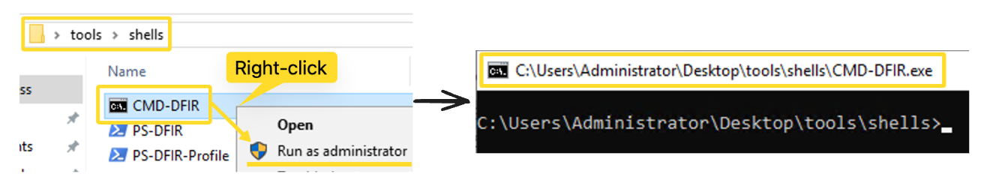

**Q: What tool did the adversary use to delete the logs?**
```
wevtutil
```

**Q: What was the registry path used by the adversary to store and steal the login credentials?**
```
HKLM:\SYSTEM\CurrentControlSet\Control\SecurityProviders\WDigest
```

---

## Task 3 — System Profile

### Concept

Profiling the system establishes the investigation baseline: hostname, OS version, timezone, and applied policies. Anomalies here (wrong patch level, unexpected timezone, suspicious GPO policies) can indicate attacker activity or misconfigurations that facilitated compromise.

### Key Commands

```powershell
# Hostname + IP + MAC
Get-CimInstance win32_networkadapterconfiguration -Filter IPEnabled=TRUE | ft DNSHostname, IPAddress, MACAddress

# OS version + build + boot time
Get-CimInstance -ClassName Win32_OperatingSystem | fl CSName, Version, BuildNumber, InstallDate, LastBootUpTime, OSArchitecture

# Date and timezone
Get-Date ; Get-TimeZone

# Generate Group Policy RSOP HTML report
Get-GPResultantSetOfPolicy -ReportType HTML -Path (Join-Path -Path (Get-Location).Path -ChildPath "RSOPReport.html")
```

💡 **Tip:** The RSOP (Resultant Set of Policy) report is a full view of all applied GPO settings. Cross-referencing this with an organisational baseline is one of the fastest ways to spot policy tampering (ATT&CK: T1484.001).

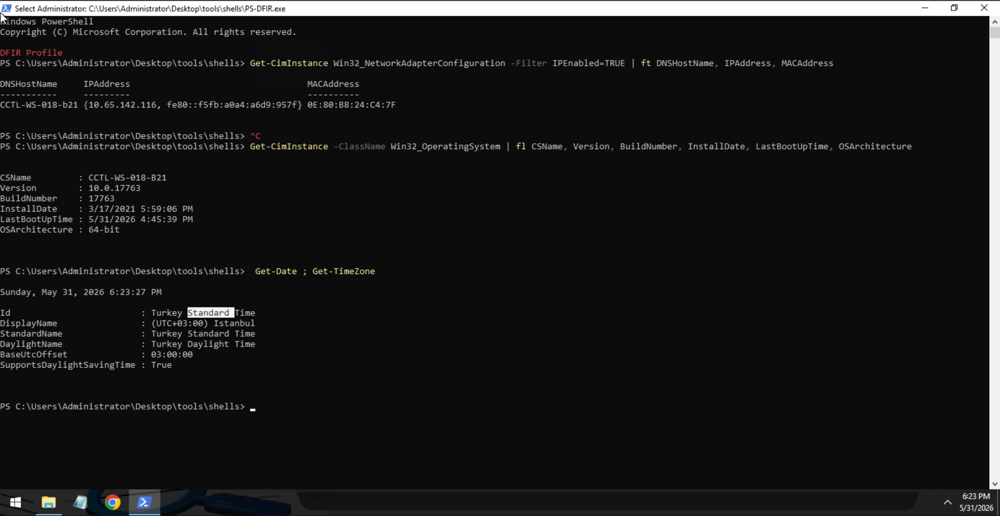

**Q: What is the hostname of the compromised host?**
```
CCTL-WS-018-B21
```

**Q: What is the OS version of the compromised host?**
```
10.0.17763
```

**Q: What is the Time ID of the compromised host?**
```
Turkey Standard Time
```

---

## Task 4 — Users and Sessions

### Concept

Attackers create rogue accounts (ATT&CK: T1136), manipulate existing ones (T1098, T1078), or abuse legitimate accounts with weak configurations. Live session analysis can catch an active attacker connected to the system.

### User Enumeration

```powershell
# List local users
Get-LocalUser | tee l-users.txt

# Password policy details
Get-CimInstance -Class Win32_UserAccount -Filter "LocalAccount=True" | Format-Table Name, PasswordRequired, PasswordExpires, PasswordChangeable | Tee-Object "user-details.txt"

# Group memberships
Get-LocalGroup | ForEach-Object { $members = Get-LocalGroupMember -Group $_.Name; if ($members) { Write-Output "`nGroup: $($_.Name)"; $members | ForEach-Object { Write-Output "`tMember: $($_.Name)" } } } | tee gp-members.txt
```

The investigation found **3 suspicious accounts**:
- Three Admin-named accounts in the Administrators group (only one legitimate)
- One account with a deliberate typo in the name
- Guest account enabled **with no password required**, and an active session

### Session Enumeration

```powershell
# Active sessions via Sysinternals PsLoggedon
.\PsLoggedon64.exe | tee sessions.txt
```

Two active sessions were found: the legitimate Administrator session and a live **Guest** session with no password.

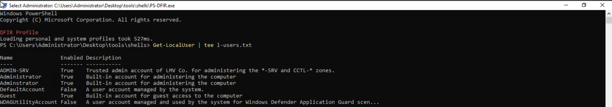

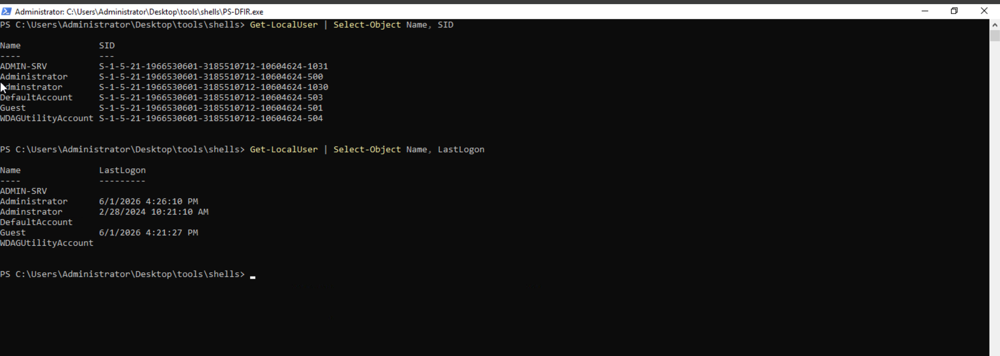

**Q: What is the total number of suspicious accounts?**
```
3
```

**Q: What is the security identifier (SID) of the Guest account?**
```
S-1-5-21-1966530601-3185510712-10604624-501
```

**Q: When was the last time the Admin account (the one with the deliberate typo) was logged in?**
```
2/28/2024 10:21:10 AM
```

---

## Task 5 — Network Scope

### Concept

Active connections reveal C2 channels (ATT&CK: TA0011) and lateral movement (ATT&CK: TA0008). Network shares and firewall rules round out the network surface.

### TCP Connections

```powershell
Get-NetTCPConnection | select Local*, Remote*, State, OwningProcess,`
  @{n="ProcName";e={(Get-Process -Id $_.OwningProcess).ProcessName}},`
  @{n="ProcPath";e={(Get-Process -Id $_.OwningProcess).Path}} | sort State | ft -Auto | tee tcp-conn.txt
```

Key findings from TCP connections:
- Active RDP connection on port 3389 (our session — expected)
- Multiple `ssh.exe` connections — anomalous volume
- AnyDesk connection attempts — potential remote access tool abuse
- **A process launched from a temp path** (`AppData\SpcTmp`) with an active outbound connection

### Network Shares

```powershell
Get-CimInstance -Class Win32_Share | tee net-shares.txt
```

Only default hidden shares found (`ADMIN$`, `C$`, `IPC$`) — nothing suspicious.

### Firewall

```powershell
# Profile status
Get-NetFirewallProfile | ft Name, Enabled, DefaultInboundAction, DefaultOutboundAction | tee fw-profiles.txt

# All rules summary
.\fw-summary.ps1 | tee fw-rules.txt
```

All three firewall profiles (Domain, Private, Public) were **disabled** — a significant defensive gap. The firewall rules revealed AnyDesk entries pointing to two separate drives, and LMV Co. rules on port **5985** (WinRM).

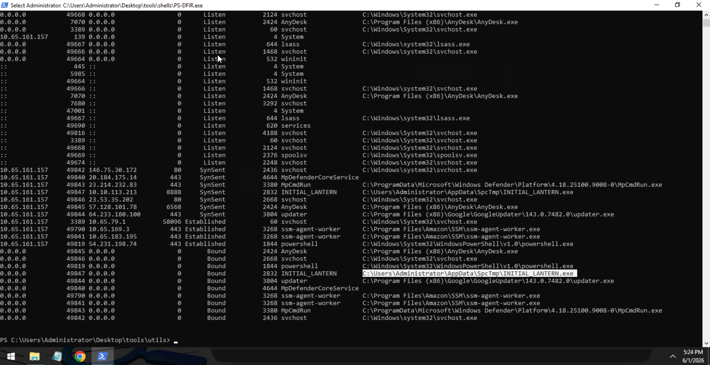

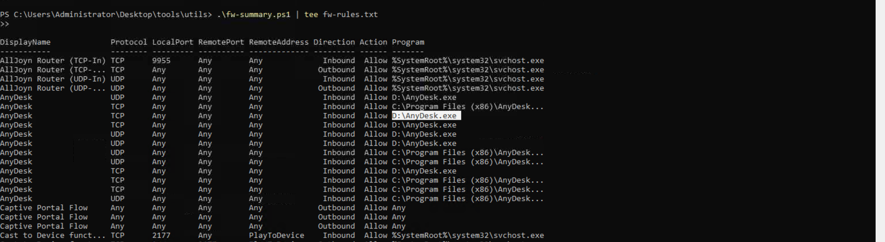

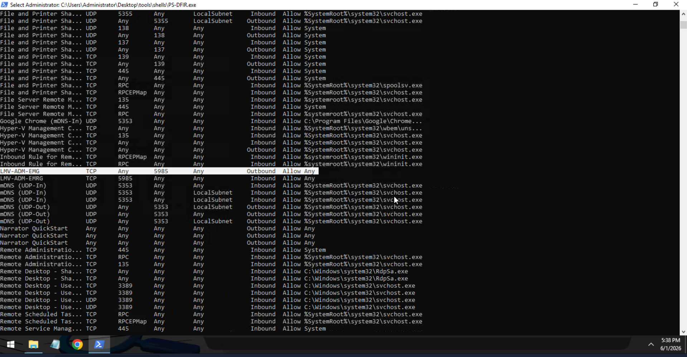

**Q: What is the name of the malicious process? (defanged)**
```
INITIAL_LANTERN[.]exe
```

**Q: What is the directory path where the malicious process is located?**
```
C:\Users\Administrator\AppData\SpcTmp\INITIAL_LANTERN.exe
```

**Q: What is the remote port used by the malicious process?**
```
8888
```

**Q: What is the full path of the suspicious program for AnyDesk? (defanged)**
```
D:\AnyDesk[.]exe
```

**Q: What port is used by the LMV Co. firewall rules?**
```
5985
```

---

## Task 6 — Startup and Registry

### Concept

Startup locations are prime persistence real estate (ATT&CK: TA0003, TA0002). Boot-time and logon-time autostart entries, combined with registry inspection, reveal how attackers maintain access across reboots and user logins.

### Boot-Time Startup

```powershell
# Boot autostart entries with hashes
.\autorunsc64.exe -a b * -h | tee boot.txt

# Startup commands
Get-CimInstance Win32_StartupCommand | Select-Object Name, command, Location, User | fl | tee autorun-cmds.txt
```

Found entries: `RunWallpaperSetup.cmd`, AnyDesk (`--control`), and `SecurityHealthSystray.exe`.

### Logon-Time Startup

```powershell
.\autorunsc64.exe -a l * -h | tee logon.txt
```

🔴 **Malware relevance:** The `HKLM\SOFTWARE\Microsoft\Windows NT\CurrentVersion\Winlogon\Userinit` key was modified to include `cmd.exe` alongside the legitimate `userinit.exe`. This is a classic persistence technique — any executable added here runs for every user logon.

### Registry Investigation

```powershell
# Userinit and Shell values
$winlogonPath = "HKLM:\SOFTWARE\Microsoft\Windows NT\CurrentVersion\Winlogon"
"Userinit: $((Get-ItemProperty -Path $winlogonPath -Name 'Userinit').Userinit)"
"Shell: $((Get-ItemProperty -Path $winlogonPath -Name 'Shell').Shell)"

# NetSh helper DLL registry key
Get-ItemProperty -Path "HKLM:\SOFTWARE\Microsoft\NetSh" | tee netsh-records.txt
```

The `Userinit` value contained:
```
C:\Windows\system32\userinit.exe, cmd.exe /c "start /min netsh.exe -c"
```

Following the chain into `HKLM\SOFTWARE\Microsoft\NetSh` revealed a suspicious entry: `.\fwshield.dll` — a DLL loaded from a relative path, consistent with a NetShell helper DLL persistence technique (ATT&CK: T1546).

💡 **Tip:** The `.\` pattern in a registry DLL path is a strong indicator of something dropped and registered locally via command line — legitimate DLLs use absolute paths.

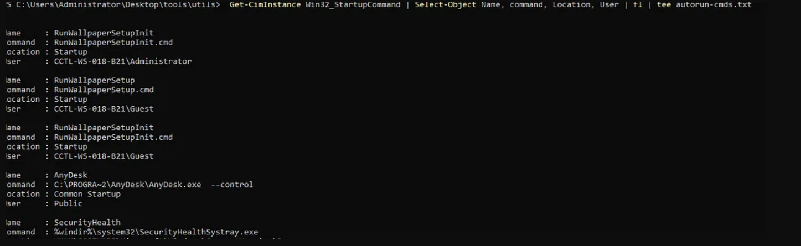

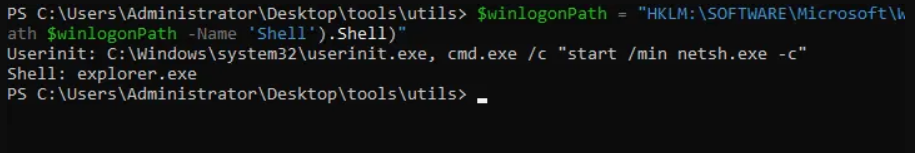

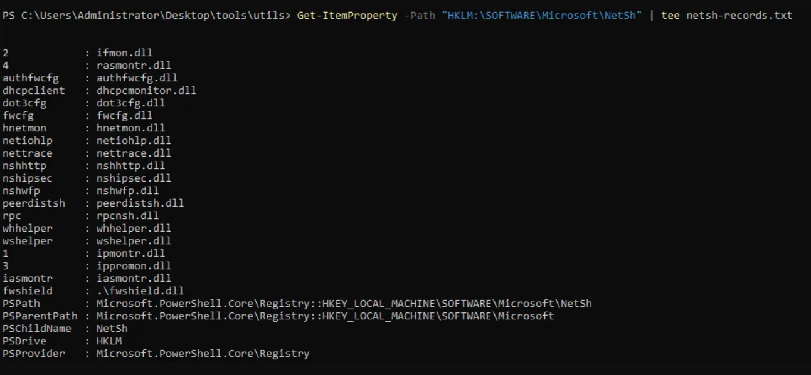

**Q: Which user account will be used to run the AnyDesk application?**
```
Public
```

**Q: What is the value data stored in the "Userinit" key? (defanged)**
```
C:\Windows\system32\userinit[.]exe, cmd[.]exe /c "start /min netsh[.]exe -c"
```

**Q: What is the name of the suspicious DLL linked under the netshell hive key?**
```
.\fwshield.dll
```

---

## Task 7 — Services and Scheduled Items

### Concept

Services load during boot before user interaction — making them ideal for system-level persistence (ATT&CK: TA0003). Scheduled tasks follow and extend persistence into user context. Both are regularly abused for malware execution and C2 maintenance.

### Running Services

```powershell
"Running Services:"
Get-CimInstance -ClassName Win32_Service | Where-Object { $_.State -eq "Running" } |
  Select-Object Name, DisplayName, State, StartMode, PathName, ProcessId | ft -AutoSize | tee services-active.txt
```

The service `LMVCSS` was found running with its executable located in a temp directory — consistent with the `INITIAL_LANTERN.exe` binary seen in network connections and process analysis.

```powershell
# Get SHA256 of suspicious service executable
Get-FileHash <path> -Algorithm SHA256
```

### Non-Running Services

```powershell
"Non-Running Services:"
Get-CimInstance -ClassName Win32_Service | Where-Object { $_.State -ne "Running" } |
  Select-Object Name, DisplayName, State, StartMode, PathName, ProcessId | ft -AutoSize | tee services-idle.txt
```

An `aurora-agent` service was found stopped despite being set to `Auto` start — suggesting defensive tool tampering (ATT&CK: T1562). The executable at `C:\Program Files\Aurora-Agent\aurora-agent-64.exe` was found to be a masqueraded binary.

```powershell
# Reveal original filename
(Get-Item "C:\Program Files\Aurora-Agent\aurora-agent-64.exe").VersionInfo.OriginalFilename
```

### Scheduled Tasks

```powershell
$tasks = Get-CimInstance -Namespace "Root/Microsoft/Windows/TaskScheduler" -ClassName MSFT_ScheduledTask
# ... (full command in task notes)
$results | Format-Table -AutoSize | tee scheduled-tasks.txt
```

Two running Aurora-agent scheduled tasks pointed to the same masqueraded binary — confirming the pattern across services and tasks.

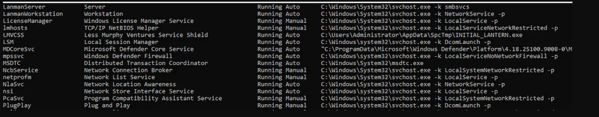

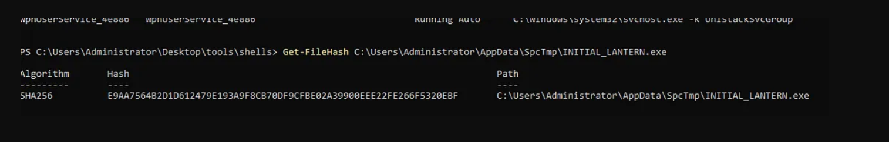

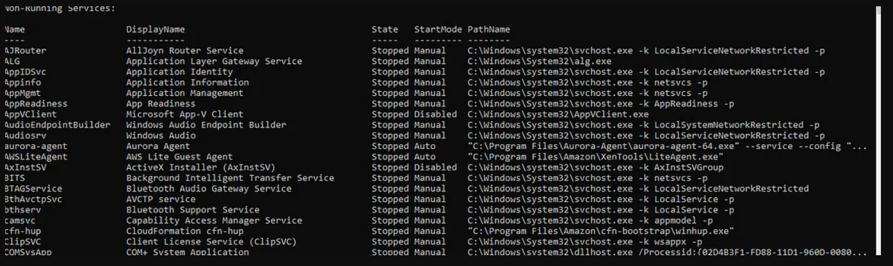

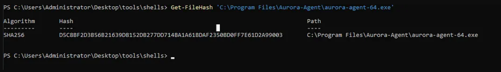

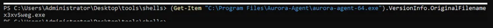

**Q: What is the name of the suspicious active service?**
```
LMVCSS
```

**Q: What is the SHA256 value of the suspicious active service executable?**
```
E9AA7564B2D1D612479E193A9F8CB70DF9CFBE02A39900EEE22FE266F5320EBF
```

**Q: What is the name of the non-running service that caught our attention?**
```
Aurora-agent
```

**Q: What is the SHA256 value of the non-running service executable?**
```
D5C8BF2D3B56B21639D8152DB277DD714BA1A61BDAF2350BD0FF7E61D2A99003
```

**Q: What is the original filename of the non-running service executable? (defanged)**
```
x3xv5weg[.]exe
```

---

## Task 8 — Processes and Directories

### Concept

Processes are the most dynamic artefacts in a live investigation. Analysing parent-child relationships, executable paths, command lines, and owning users can expose process injection (ATT&CK: T1055) and masquerading (ATT&CK: T1036.009). Directory checks on suspicious paths uncover dropped payloads and scripts.

### Process Enumeration

```powershell
Get-WmiObject -Class Win32_Process | ForEach-Object {
  $owner = $_.GetOwner()
  [PSCustomObject]@{
    Name=$_.Name; PID=$_.ProcessId; P_PID=$_.ParentProcessId
    User="$($owner.User)"
    CommandLine=if ($_.CommandLine.Length -le 60) { $_.CommandLine } else { $_.CommandLine.Substring(0, 60) + "..." }
    Path=$_.Path
  }
} | ft -AutoSize | tee process-summary.txt
```

Key findings:
- `INITIAL_LANTERN.exe` running from `AppData\SpcTmp` — parent process was `services.exe`
- Multiple `ssh.exe` instances — some parented to the suspicious `aurora-agent` process, others independent
- The SSH connections were using username `james`

```powershell
# Identify parent process of a specific PID
Get-CimInstance Win32_Process -Filter "ProcessId=<PID>" | ForEach-Object {
  Get-CimInstance Win32_Process -Filter "ProcessId=$($_.ParentProcessId)" | Select Name, ExecutablePath
}
```

### Directory Analysis

```powershell
# Temp folders across all user profiles
Get-ChildItem -Path "C:\Users" -Force | Where-Object { $_.PSIsContainer } |
  ForEach-Object {
    Get-ChildItem -Path "$($_.FullName)\AppData\Local\Temp" -Recurse -Force -ErrorAction SilentlyContinue |
    Select-Object @{Name='User';Expression={$_.FullName.Split('\')[2]}}, FullName, Name, Extension
  } | ft -AutoSize | tee temp-folders.txt

# Contents of suspicious non-default temp path
Get-ChildItem -Path "C:\Users\Administrator\AppData\SpcTmp\" -Recurse -Force | ft FullName, Name, Extension

# SHA256 of files of interest
Get-FileHash C:\Users\Administrator\AppData\SpcTmp\Invoke-SocksProxy.psm1
```

**Default user temp directory** contained `jmp.exe` — the same masqueraded binary found as the Aurora-agent executable (same hash).

**`C:\Users\Administrator\AppData\SpcTmp\`** contained two files:
- `INITIAL_LANTERN.exe` — the active C2 implant
- `Invoke-SocksProxy.psm1` — a PowerShell SOCKS proxy script

🔴 **Malware relevance:** SOCKS proxying via `Invoke-SocksProxy` is a common technique for tunnelling C2 traffic and pivoting through the compromised host to internal network segments. Combined with the active outbound connection on port 8888, this paints a clear C2 tunnelling picture.

### Disk Volumes

```powershell
Get-CimInstance -ClassName Win32_Volume | ft -AutoSize DriveLetter, Label, FileSystem, Capacity, FreeSpace | tee disc-volumes.txt
```

A hidden volume with no drive letter and the label `setups` was found — worth investigating further as a potential staging area.

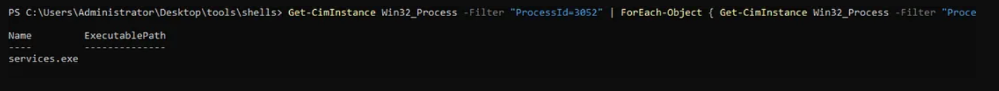

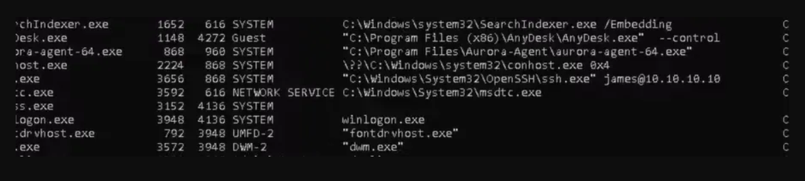

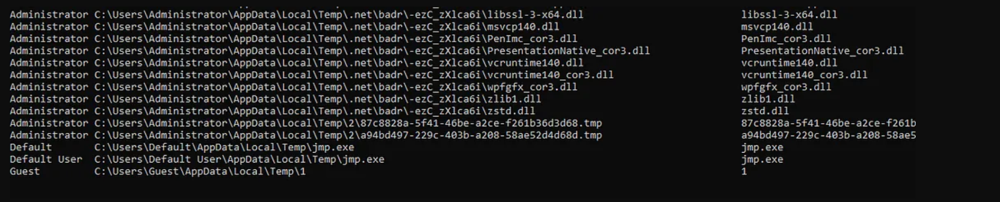

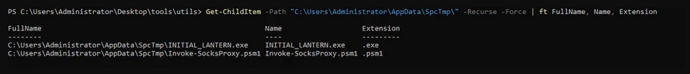

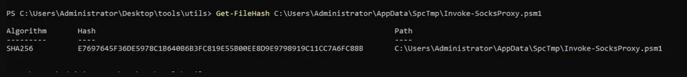

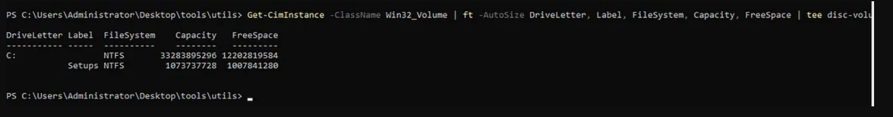

**Q: What is the parent process name of the suspicious executable (INITIAL_LANTERN) process? (defanged)**
```
services[.]exe
```

**Q: Which user name is used for the SSH connection attempts?**
```
james
```

**Q: What is the parent process of the malicious aurora process? (defanged)**
```
svchost[.]exe
```

**Q: What is the file name located in the default user's temp directory? (defanged)**
```
jmp[.]exe
```

**Q: What is the name of the potential proxy script located in the suspicious non-default temp folder? (defanged)**
```
Invoke-SocksProxy[.]psm1
```

**Q: What is the SHA256 value of the potential proxy script located in the suspicious non-default temp folder?**
```
E7697645F36DE5978C1B640B6B3FC819E55B00EE8D9E9798919C11CC7A6FC88B
```

**Q: What is the label of the hidden disc volume?**
```
setups
```

---

## Task 9 — Conclusion

The room wraps up the investigation walkthrough. Key takeaway: **mind-mapping artefacts across investigation areas is how attack chains get reconstructed**. `INITIAL_LANTERN.exe` → `LMVCSS` service → `services.exe` parent → outbound port 8888 → `Invoke-SocksProxy.psm1` is a coherent C2 + proxy chain, and every node in that chain was found by following cross-artefact leads.

---

## Key Takeaways

- **Always validate your tools first** — a malicious PS profile can compromise the entire investigation before it starts; use BYOT CMD before touching PowerShell
- **WDigest registry tampering** (`UseLogonCredential = 1`) is a pre-credential-dump setup step — finding it in a PS profile means the attacker planned ahead
- **Environment variables rarely lie** — mismatched `ComSpec`, rogue `PSModulePath` entries, and temp redirects are easy to spot and high value
- **RSOP reports** are one of the fastest ways to identify GPO-level persistence or policy tampering on a domain-joined endpoint
- **Three-account pattern** (legitimate + duplicate + typo) is a classic account creation evasion tactic — the typo account is the rogue one
- **Userinit + NetSh chaining**: modifying `Userinit` to call `cmd.exe` → `netsh.exe` with a malicious helper DLL is a layered, non-obvious persistence mechanism
- **`.\` in registry DLL paths** is a strong IOC — legitimate system DLLs always use absolute paths
- **Services + Tasks + Processes should always be cross-correlated** — the same binary (`aurora-agent-64.exe` / `jmp.exe`) appeared in all three
- **SOCKS proxy scripts in temp directories** are a reliable indicator of an established C2 with tunnelling capability
- **Hidden disk volumes** (no drive letter) are easy to miss and worth a dedicated follow-up

---

*Write-up by [OPT4RUN](https://tryhackme.com/p/OPT4RUN)*