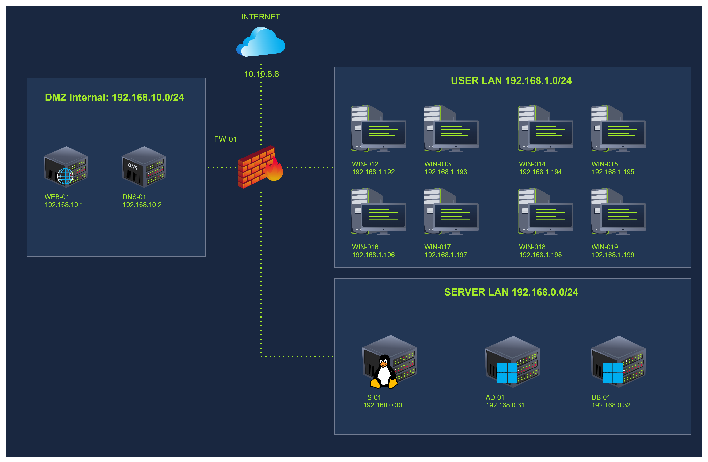
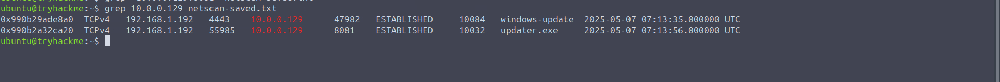
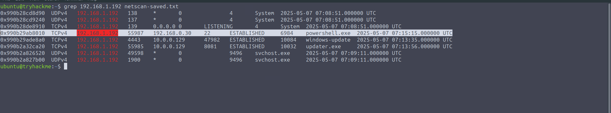
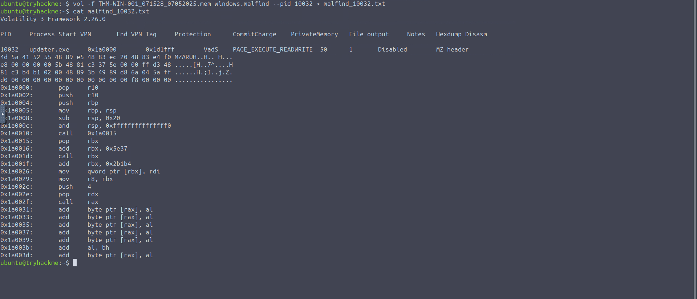
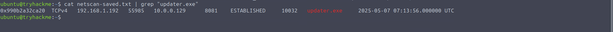
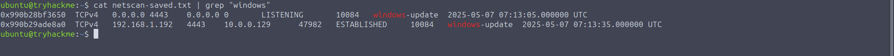
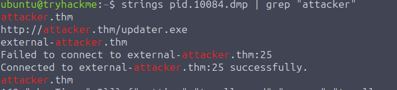

# Windows Memory & Network

| Field | Details |
|---|---|
| **Room** | Windows Memory & Network |
| **Difficulty** | Medium (60 min) |
| **Link** | [tryhackme.com/room/windowsmemoryandnetwork](https://tryhackme.com/room/windowsmemoryandnetwork) |
| **Path** | Advanced Endpoint Investigations |
| **Module** | Memory Analysis |
| **Tools** | Volatility 3, YARA, `strings`, `grep` |
| **Memory Image** | `THM-WIN-001_071528_07052025.mem` |
| **Incident** | THM-0001 (TryHatMe) |

---

## Overview

This is the third and final room of the TryHatMe memory series (Processes → User Activity → Network). It shifts the focus from process and user artifacts to **network activity and post-exploitation behavior captured in RAM**.

From a SOC / DFIR perspective, the room shows how a single memory snapshot can answer the questions an incident responder asks first after confirming execution:

- Who is the host talking to, and over which ports?
- Which process owns each connection?
- Was code injected into a process (Meterpreter / reflective DLL injection)?
- Did the attacker move laterally or attempt exfiltration?

**Learning objectives**

- Identify network connections in a memory dump
- Identify suspicious ports and remote endpoints
- Link connections to processes
- Detect reverse shells and memory injections
- Trace PowerShell and C2 activity in memory

**Prerequisites:** Volatility, YARA, Windows Memory & Processes, Windows Memory & User Activity

---

## Task 1 - Introduction

This room continues the memory investigation from the previous analysis. It examines artifacts from a live attack involving Meterpreter, suspicious child processes, and unusual outbound connections, using Volatility 3 directly against the memory dump. It covers remote shells, persistence via startup folder abuse, and malware attempting outbound communication.

No questions in this task.

---

## Task 2 - Scenario Information

**Scenario:** TryHatMe, a company that exclusively sells hats online, escalated **Incident THM-0001** on **May 5th, 2025 at 07:30 CET**. Triage identified a potentially compromised Windows host, and a full memory dump was taken at 07:45 CET by analyst Steve Stevenson, along with a hash to ensure integrity.

| Item | Value |
|---|---|
| Hostname | `WIN-001` |
| OS | Windows 1022H 10.0.19045 (as written in the room) |
| Dump name (scenario) | `THM-WIN-001_071528_07052025.dmp` |
| MD5 | `78535fc49ab54fed57919255709ae650` |

**Network map**



> 📌 The scenario text lists the dump as `.dmp`, while the lab VM file is `THM-WIN-001_071528_07052025.mem`. The MD5 hash is identical in both places.

No questions in this task.

---

## Task 3 - Environment and Setup

Start the Lab Machine (about 2 minutes to load). The memory image is in `/home/ubuntu`.

| Item | Value |
|---|---|
| File name | `THM-WIN-001_071528_07052025.mem` |
| MD5 | `78535fc49ab54fed57919255709ae650` |
| Location | `/home/ubuntu` |

Volatility is run with the `vol` command:

```
vol -h
```

No questions in this task.

---

## Task 4 - Analyzing Active Connections

### Scanning memory for network evidence

`windows.netscan` scans kernel memory pools for TCP and UDP socket objects **regardless of whether the connection is still active**. Volatility locates the `EPROCESS` structure to extract PIDs and maps them to TCP/UDP endpoint objects, so it also surfaces closed connections, which makes it more useful than `netstat` on a live system.

What to look for:

- Unusual port activity or outbound connections to unfamiliar addresses
- Communication with external IPs on non-standard ports
- Local processes holding multiple sockets
- PIDs tied to previously identified suspicious binaries

```
vol -f THM-WIN-001_071528_07052025.mem windows.netscan > netscan.txt
cat netscan.txt
```

> 💡 The command can be slow depending on CPU and dump size. A pre-saved output is available in `netscan-saved.txt`, along with other pre-saved outputs.

**Key entries from `netscan.txt`**

| Proto | Local | Foreign | State | PID | Owner | Created (UTC) |
|---|---|---|---|---|---|---|
| TCPv4 | `0.0.0.0:4443` | `0.0.0.0:0` | LISTENING | 10084 | windows-update | 2025-05-07 07:13:05 |
| TCPv4 | `192.168.1.192:4443` | `10.0.0.129:47982` | ESTABLISHED | 10084 | windows-update | 2025-05-07 07:13:35 |
| TCPv4 | `192.168.1.192:55985` | `10.0.0.129:8081` | ESTABLISHED | 10032 | updater.exe | 2025-05-07 07:13:56 |
| TCPv4 | `192.168.1.192:55987` | `192.168.0.30:22` | ESTABLISHED | 6984 | powershell.exe | 2025-05-07 07:15:15 |

The findings:

- `updater.exe` (PID 10032) is connected to `10.0.0.129` on port `8081`, which suggests attacker infrastructure.
- `powershell.exe` (PID 6984) reaches out to `192.168.0.30:22`, suggesting lateral movement.
- `windows-update.exe`, the binary placed for persistence in the Startup folder (identified in the previous analysis), listens on port `4443`.

### Listening ports

```
cat netscan.txt | grep LISTENING
```

System processes such as `svchost.exe` and `lsass.exe` listen on common Windows ports (e.g. 445, 3389, 139, 5040, 49671). The **only non-standard listener** is `windows-update.exe` (PID 10084) on port `4443`. It already had an established session with the potential attacker and was accepting inbound connections, which could indicate file staging, secondary payloads, or persistence.

> 💡 As a sanity check, also run `windows.netstat`. It relies on live system structures instead of scanning memory, so it may return fewer results, but it helps show what was still active and lets you check connection order by timestamp.

### Confirmed at this point

- `updater.exe` (PID 10032) was in an active session with a known attacker IP on port `8081`
- `windows-update.exe` (PID 10084) had its own established session and was listening on port `4443`
- `powershell.exe` (PID 6984) connected to `192.168.0.30:22`, likely the next internal target

### Questions

**What is the remote source port number used in the connection between 192.168.1.192 and 10.0.0.129:8081?**

```
55985
```



**Which internal IP address received a connection on port 22 from the compromised host?**

```
192.168.0.30
```



**What is the exact timestamp when the connection from the IP addresses in question 1 was established?**

```
2025-05-07 07:13:56.000000 UTC
```


**What is the local port used by the system to initiate the SSH connection to 192.168.0.30?**

```
55987
```


**What is the protocol used in the connection from 192.168.1.192:55985 to 10.0.0.129:8081?**

```
TCPv4
```


**What is the order in which the potential malicious processes established outbound connections?**

```
windows-update.exe, updater.exe, powershell.exe
```

---

## Task 5 - Investigating Remote Access and C2 Communications

### Confirming process relationships

The process chain from the previous room can be regathered with:

```
vol -f THM-WIN-001_071528_07052025.mem windows.pslist > pslist.txt
vol -f THM-WIN-001_071528_07052025.mem windows.cmdline > cmdline.txt
```

The chain: a Word document opened by the user, followed by three suspicious binaries in sequence, `pdfupdater.exe` → `windows-update.exe` → `updater.exe`.

Checking how `updater.exe` was invoked:

```
cat cmdline.txt | grep 10032
```

```
10032	updater.exe	"C:\Users\operator\Downloads\updater.exe"
```

No arguments were passed. This is common for droppers and loaders, especially those using in-memory injection or reflective loading, which is something Meterpreter is known for.

### Scanning for code injection with malfind

`windows.malfind` flags memory regions with suspicious execution permissions (such as `PAGE_EXECUTE_READWRITE`) or injected shellcode.

```
vol -f THM-WIN-001_071528_07052025.mem windows.malfind --pid 10032 > malfind_10032.txt
cat malfind_10032.txt
```

| PID | Process | Start VPN | End VPN | Tag | Protection | Notes |
|---|---|---|---|---|---|---|
| 10032 | updater.exe | `0x1a0000` | `0x1d1fff` | VadS | PAGE_EXECUTE_READWRITE | MZ header |

The hexdump begins with `4d 5a` (`MZ`), the start of a PE executable. This is consistent with a PE image being reflectively loaded in an RWX region, which is how Meterpreter's reflective DLL injection appears.

> 🔴 An `MZ` header inside a private, `PAGE_EXECUTE_READWRITE` region that is not backed by a file on disk is a strong indicator of runtime injection.

> 💡 To dump the process memory for further inspection:
>
> ```
> vol -f THM-WIN-001_071528_07052025.mem windows.memmap --pid 10032 --dump
> ```
>
> This creates `pid.10032.dmp` in the current directory.

### Confirming Meterpreter with YARA

YARA matches readable string or byte patterns. The following rule targets Metasploit's `reverse_tcp` shellcode and triggers when **at least 5** of the listed patterns are present:

```yara
rule meterpreter_reverse_tcp_shellcode {
    meta:
        description = "Metasploit reverse_tcp shellcode"
    strings:
        $s1 = { fce8 8?00 0000 60 }
        $s2 = { 648b ??30 }
        $s3 = { 4c77 2607 }
        $s4 = "ws2_"
        $s5 = { 2980 6b00 }
        $s6 = { ea0f dfe0 }
        $s7 = { 99a5 7461 }
    condition:
        5 of them
}
```

Scanning only the memory regions of PID 10032:

```
vol -f THM-WIN-001_071528_07052025.mem windows.vadyarascan --pid 10032 --yara-file meterpreter.yar
```

| Offset | Rule | Component | Bytes |
|---|---|---|---|
| `0x140004104` | meterpreter_reverse_tcp_shellcode | `$s3` | `4c 77 26 07` |
| `0x1400040d9` | meterpreter_reverse_tcp_shellcode | `$s4` | `77 73 32 5f` (`ws2_`) |
| `0x140004115` | meterpreter_reverse_tcp_shellcode | `$s5` | `29 80 6b 00` |
| `0x140004135` | meterpreter_reverse_tcp_shellcode | `$s6` | `ea 0f df e0` |
| `0x14000414a` | meterpreter_reverse_tcp_shellcode | `$s7` | `99 a5 74 61` |

Five matches in `updater.exe` (PID 10032) confirm a Meterpreter session.

### Evidence chain for updater.exe

| Evidence | Plugin / tool |
|---|---|
| Live connection to `10.0.0.129:8081` | `windows.netscan` |
| Process ancestry and launch context | `windows.pslist`, `windows.cmdline` |
| Injected RWX region with MZ header | `windows.malfind` |
| Meterpreter shellcode signature | `windows.vadyarascan` |
| Process memory dump for analysis | `windows.memmap --dump`, `strings` |

### Questions

**What Volatility plugin can be used to correlate memory regions showing suspicious execution permissions with processes, helping to detect Meterpreter-like behavior?**

```
windows.malfind
```

**What is the virtual memory address space of the suspicious injected region in updater.exe? Answer format: 0xABCDEF**

```
0x1a0000
```



**What is the first 2-bytes signature found in the shellcode that was extracted from updater.exe using windows.malfind? Answer format: In hex.**

```
4d5a
```


---

## Task 6 - Post-Exploitation Communication

With a reverse shell running, secondary connections are expected for lateral movement, data staging, or command retrieval. Two indicators from `netscan` stand out:

- `powershell.exe` (PID 6984) connected to `192.168.0.30:22`
- `windows-update.exe` (PID 10084) was listening on port `4443` and may also have generated outbound traffic

### PowerShell lateral movement

```
cat netscan.txt | grep powershell
```

```
0x990b29ab8010	TCPv4	192.168.1.192	55987	192.168.0.30	22	ESTABLISHED	6984	powershell.exe	2025-05-07 07:15:15.000000 UTC
```

Dump the process and search its strings for the target IP:

```
vol -f THM-WIN-001_071528_07052025.mem windows.memmap --pid 6984 --dump
strings pid.6984.dmp | grep "192.168.0.30"
```

```
$client=New-Object Net.Sockets.TcpClient; $client.Connect("192.168.0.30",22); while($client.Connected){Start-Sleep 1}
$client=New-Object Net.Sockets.TcpClient; $client.Connect("192.168.0.30",22); while($client.Connected){Start-Sleep 1}
```

Two matches reveal the PowerShell command used to open the TCP connection to the server-network host.

> 🔴 A PowerShell `Net.Sockets.TcpClient` connecting to port 22 and holding the session open is a lateral movement indicator recovered purely from process memory.

### windows-update.exe: C2 and exfiltration attempts

```
vol -f THM-WIN-001_071528_07052025.mem windows.memmap --pid 10084 --dump
strings pid.10084.dmp | grep "attacker.thm"
```

```
attacker.thm
http://attacker.thm/updater.exe
external-attacker.thm
Failed to connect to external-attacker.thm:25
Connected to external-attacker.thm:25 successfully.
```

The domain `attacker.thm` and `external-attacker.thm` appear in process memory, along with a possible connection over port 25 (SMTP).

Searching for `POST` with 8 lines of context on either side:

```
strings pid.10084.dmp | grep "POST" -C 8
```

```
bad cast
attacker.thm
C:\Windows\System32\drivers\etc\hosts
[!] Failed to open hosts file.
Exfiltrator
[!] InternetOpenA failed.
[!] InternetConnectA failed.
Content-Type: application/x-www-form-urlencoded
POST
[!] HttpOpenRequestA failed.
[!] HttpSendRequestA failed.
[+] Hosts file exfiltrated to http://
[*] Executing hello()
```

`windows-update.exe` attempted an HTTP POST, apparently targeting the hosts file (`C:\Windows\System32\drivers\etc\hosts`), but the attempt appears to have failed.

> 📌 `windows-update.exe` is the persistence binary (Startup folder), the port `4443` listener, and the process whose memory holds the attacker domains and the failed POST strings.

### Questions

**Which local port was used by powershell.exe to connect to the internal host 192.168.0.30?**

```
55987
```

**What was the remote IP address targeted by windows-update.exe during its HTTP POST attempt?**

```
10.0.0.129
```



**What port was windows-update.exe listening on, based on the netscan output?**

```
4443
```



---

## Task 7 - Putting It All Together

Across the three rooms, a full attack chain was reconstructed from a phishing-style document to a Meterpreter shell and lateral movement, using Volatility 3 to correlate memory artifacts.

### Attack chain

| Stage | Description |
|---|---|
| **Initial Access** | User opened a macro-enabled `.docm` document in `WINWORD.EXE`. The VBA macro downloaded and executed `pdfupdater.exe`. |
| **Execution & Persistence** | `pdfupdater.exe` launched `windows-update.exe`, placed in the user's Startup folder for persistence. It spawned `updater.exe`. |
| **Remote Access (C2)** | `updater.exe` connected out to `10.0.0.129:8081`. Reflective DLL injection was confirmed with `malfind` and Meterpreter shellcode with `vadyarascan`. |
| **Post-Exploitation** | `cmd.exe` and `powershell.exe` were launched. PowerShell connected to `192.168.0.30:22`, suggesting lateral movement. The PowerShell payload was recovered from memory. |
| **Exfiltration attempts** | Strings in `windows-update.exe` showed attempts to POST data to `attacker.thm` and `external-attacker.thm`. The exfiltration failed. |

### Timeline of network activity (from netscan)

| Time (UTC) | Process | Event |
|---|---|---|
| 07:13:05 | windows-update.exe (10084) | Listener created on `0.0.0.0:4443` |
| 07:13:35 | windows-update.exe (10084) | Session `192.168.1.192:4443` ↔ `10.0.0.129:47982` |
| 07:13:56 | updater.exe (10032) | `192.168.1.192:55985` → `10.0.0.129:8081` |
| 07:15:15 | powershell.exe (6984) | `192.168.1.192:55987` → `192.168.0.30:22` |

### MITRE ATT&CK mapping

| Tactic | Technique | Details | Volatility Plugin & Command(s) Used |
|---|---|---|---|
| Initial Access | T1566.001 - Spearphishing Attachment | Malicious `.docm` file opened in Word | `cmdline`, `handles`, `userassist` |
| Execution | T1059.005 - Visual Basic | Macro downloaded and executed a payload | `dumpfiles`, `olevba` |
| Persistence | T1547.001 - Startup Folder | `windows-update.exe` persisted via Startup folder | `cmdline`, `handles`, `netscan` |
| Command & Control | T1055.002 - Reflective DLL Injection | Meterpreter shellcode injected into `updater.exe` | `malfind`, `memmap`, `yarascan` |
| Command & Control | T1071.001 - Web Protocols | HTTP-based communication with attacker C2 | `strings`, `dumpfiles` |
| Command & Control | T1043 - Commonly Used Port | Outbound to port 8081 (C2) and listening on 4443 | `netscan` |
| Execution | T1059.001 - PowerShell | PowerShell used for command execution and remote connection | `pslist`, `netscan`, `strings` |
| Lateral Movement | T1021.004 - SSH | PowerShell connected to `192.168.0.30:22` internally | `netscan`, `strings`, `memmap` |
| Exfiltration | T1041 - Exfiltration Over C2 Channel | Attempted HTTP POST with `application/x-www-form-urlencoded` content type | `strings`, `grep` |
| Defense Evasion | T1140 - Deobfuscate/Decode Files or Info | Malicious macro downloaded payload with no arguments to evade detection | `cmdline`, `olevba` |

### Questions

**What IP did updater.exe connect to for the reverse shell?**

```
10.0.0.129
```

**Which folder is used for persistence by the attack we analyzed within this memory dump?**

```
C:\Users\operator\AppData\Roaming\Microsoft\Windows\StartMenu\Programs\Startup\
```

**Which MITRE technique matches the reflective DLL injection used by updater.exe?**

```
T1055.002
```

**What is the domain that was discovered within the windows-update.exe file?**

```
external-attacker.thm
```



---

## Task 8 - Conclusion

This room extended the forensic investigation to network activity and post-exploitation behavior captured in memory: attacker infrastructure connections, confirmed malicious payloads, and evidence of lateral movement, all from a single memory snapshot.

**What was practiced**

- Identifying active and closed network connections
- Correlating connections with processes
- Detecting memory injection
- Dumping and analyzing process memory
- Matching Meterpreter shellcode
- Investigating PowerShell-based lateral movement and HTTP activity from memory

No questions in this task.

---

## Key Takeaways

- **`windows.netscan` finds more than `netstat`.** It scans memory pools for socket objects, so it can surface closed connections. Compare it with `windows.netstat` to see what was still live and to order events by timestamp.
- **Start with the odd listener.** Among standard Windows listeners, `windows-update.exe` on port `4443` was the only non-standard one, and it was the persistence binary.
- **Tie every socket to a PID, then to ancestry.** Network output alone is not enough; `pslist` and `cmdline` connect it back to the `.docm` → `pdfupdater.exe` → `windows-update.exe` → `updater.exe` chain.
- **Empty command lines can be a signal.** `updater.exe` ran with no arguments, typical of loaders using in-memory or reflective techniques.
- **`malfind` + YARA confirms injection.** An `MZ` header in a private RWX region (`0x1a0000`) plus 5 matches of the `reverse_tcp` rule confirmed Meterpreter in `updater.exe`.
- **Process dumps plus `strings` recover attacker tradecraft.** The PowerShell TCP client command, `attacker.thm` / `external-attacker.thm`, and the failed POST exfiltration attempt were all recovered this way.
- **One dump covered the full kill chain:** initial access, persistence, C2, lateral movement, and attempted exfiltration.

---

*Write-up by [OPT4RUN](https://tryhackme.com/p/OPT4RUN)*