| Field | Details |
|-------|---------|
| **Room** | [Windows Network Analysis](https://tryhackme.com/room/windowsnetworkanalysis) |
| **Platform** | TryHackMe |
| **Path** | Advanced Endpoint Investigations |
| **Module** | Windows Endpoint Investigation |
| **Difficulty** | Easy |
| **Category** | Digital Forensics / IR |
| **Author** | [OPT4RUN](https://tryhackme.com/p/OPT4RUN) |

---

## Overview

This room covers the network artefacts available on a Windows host and how to analyse them using built-in tooling, without needing to deploy a full forensic toolkit. From a SOC/blue team perspective, this is foundational triage knowledge — when responding to an incident, you often need to build a picture of a host's network activity using only what's already on the box (PowerShell, netstat, pktmon, SRUM, firewall logs).

The room concludes with a practical scenario investigating a Windows host actively communicating with a C2 agent, applying the techniques covered to identify the malicious connection, the responsible process, a hosts file redirection, SRUM-based exfiltration evidence, and an exposed SMB share.

---

## Task 2 — Windows Network Analysis

### Named-Pipes

Named-pipes are used by Windows for inter-process communication and can be local or network-based. Listing network-based named-pipes can reveal processes communicating with another host (e.g. file shares, file uploads).

### System Resource Usage Monitor (SRUM)

SRUM tracks 30–60 days of resource usage, including application/service activity, network activity (packets sent/received), and user activity. The database lives at:

```
C:\Windows\System32\sru\SRUDB.dat
```

🔴 **Malware relevance:** SRUM retains historical network usage data per-process for weeks, making it valuable for spotting exfiltration or beaconing activity even after a process has been terminated or its logs cleared.

Since `SRUDB.dat` is locked during a live acquisition, it must be exported using tooling such as FTK Imager or KAPE.

**Using KAPE's SRUMDump module:**

```
C:\Users\CMNatic\Desktop\kape>.\kape.exe --tsource C:\Windows\System32\sru --tdest C:\Users\CMNatic\Desktop\SRUM --tflush --mdest C:\Users\CMNatic\Desktop\MODULE --mflush --module SRUMDump --target SRUM
```

Once exported, the [srum-dump](https://github.com/MarkBaggett/srum-dump) utility (with the SRUM template) can parse `SRUDB.dat` into an Excel workbook containing tabs such as:

- App Timeline Provider
- Network Data Usage
- Application Resource Usage

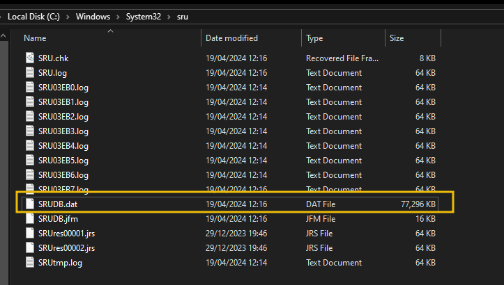
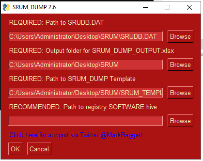
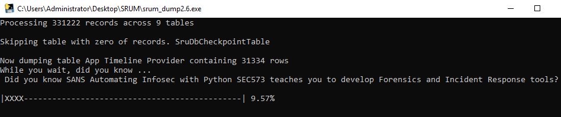
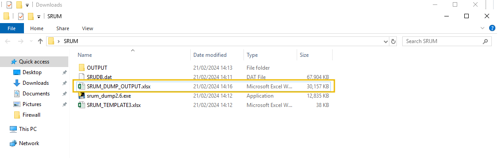

### Windows Firewall Logging

By default, Windows Firewall logs to:

```
C:\Windows\System32\LogFiles\Firewall
```

💡 **Tip:** Firewall logging is not enabled by default — check the logging settings before relying on `pfirewall.log` for evidence.

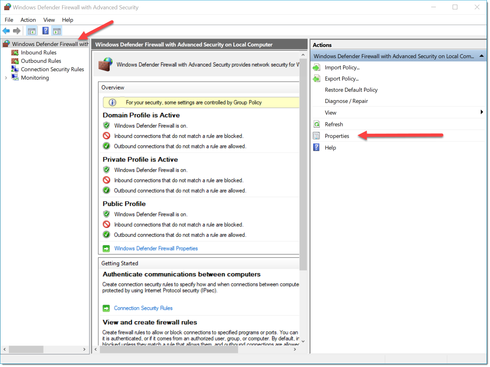
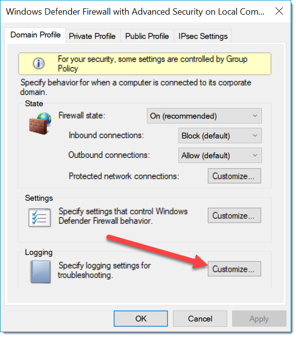
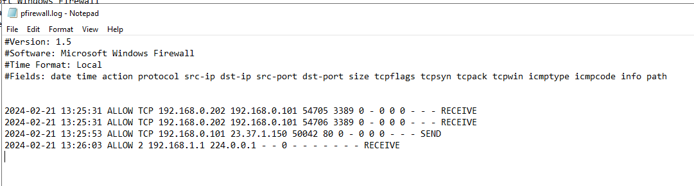

The log can also be viewed via PowerShell:

```powershell
gc C:\Windows\System32\LogFiles\Firewall\pfirewall.log | more
```

Sample output fields: `date time action protocol src-ip dst-ip src-port dst-port size tcpflags tcpsyn tcpack tcpwin icmptype icmpcode info path`

### Answers

**Q: What is the full name of the Windows feature that tracks the last 30 to 60 days of system statistics?**
```
System Resource Usage Monitor
```

**Q: What is the full path to the directory that Windows will output Firewall logs to?**
```
C:\Windows\System32\LogFiles\Firewall
```

---

## Task 3 — Network Analysis via PowerShell

PowerShell provides a fast, no-install way to triage network activity — useful as a first step before deploying additional tooling.

### Show TCP Connections and Associated Processes

```powershell
Get-NetTCPConnection | select LocalAddress,localport,remoteaddress,remoteport,state,@{name="process";Expression={(get-process -id $_.OwningProcess).ProcessName}}, @{Name="cmdline";Expression={(Get-WmiObject Win32_Process -filter "ProcessId = $($_.OwningProcess)").commandline}} | sort Remoteaddress -Descending | ft -wrap -autosize
```

🔴 **Malware relevance:** Mapping connections back to process name *and* full command line in one shot is one of the fastest ways to spot a malicious process masquerading under a legitimate-looking name.

### Show UDP Connections

```powershell
Get-NetUDPEndpoint | select local*,creationtime, remote* | ft -autosize
```

💡 **Tip:** While most malware uses TCP, botnet/flood-style activity often relies on UDP — worth checking even if TCP looks clean.

### Sort and Unique Remote IPs

```powershell
(Get-NetTCPConnection).remoteaddress | Sort-Object -Unique
```

Useful for generating a clean list of remote IPs to cross-reference against threat intel feeds.

### Investigate a Specific IP Address

```powershell
Get-NetTCPConnection -remoteaddress 51.15.43.212 | select state, creationtime, localport,remoteport | ft -autosize
```

### Retrieve DNS Cache

```powershell
Get-DnsClientCache | ? Entry -NotMatch "workst|servst|memes|kerb|ws|ocsp" | out-string -width 1000
```

Indicates recently resolved domains — useful for spotting C2 domain lookups.

### View Hosts File

```powershell
gc -tail 4 "C:\Windows\System32\Drivers\etc\hosts"
```

🔴 **Malware relevance:** Attackers commonly use hosts file entries to redirect legitimate-looking domains to attacker-controlled infrastructure — a technique seen in banking trojans and phishing campaigns, since the URL the victim sees remains unchanged.

### Querying RDP Sessions

```powershell
qwinsta
```

Shows active/recent RDP sessions, session state, and source — a quick win for spotting unauthorised remote access.

### Querying SMB Shares

```powershell
Get-SmbConnection
```

Displays established SMB connections, including server, share name, and credentials used.

### Answers

**Q: What cmdlet can be used to display active TCP connections?**
```
Get-NetTCPConnection
```

**Q: What cmdlet can be used to display the DNS cache on the host?**
```
Get-DnsClientCache
```

**Q: What command can be used to list all active RDP sessions on the host?**
```
qwinsta
```

---

## Task 4 — Internal Tooling

### Packet Monitor (Pktmon)

Pktmon is a built-in packet sniffer for Windows 10 / Server 2019 / Server 2022 that operates on the network stack.

| Command | Description |
|---------|-------------|
| `pktmon start` | Start a capture |
| `pktmon stop` | Stop a capture |
| `pktmon reset` | Reset captured packet counters |
| `pktmon counters` | View packet counts per interface |
| `pktmon etl2txt` | Convert capture to text |
| `pktmon etl2pcap` | Convert capture to pcap |

```
C:\Windows\system32>pktmon start -c
```

### Netstat

| Flag | Description |
|------|-------------|
| `-a` | Display all active TCP connections and TCP/UDP ports |
| `-b` | Display the executable responsible for the connection |
| `-o` | Display all TCP connections including PID |
| `-p` | Filter by protocol (TCP, UDP, ICMP, IPv6 variants) |

Flags can be combined, e.g. `netstat -a -b` to show active connections plus the responsible executable.

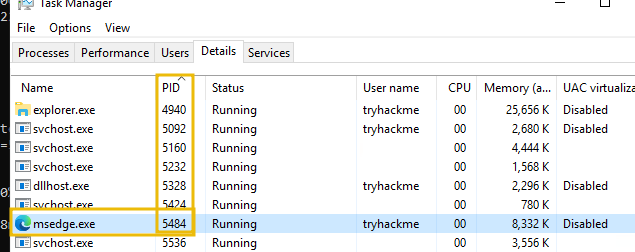

### Exporting Netstat

Output can be redirected to a file for later review or searching:

```
netstat -a -o > netstat.txt
```

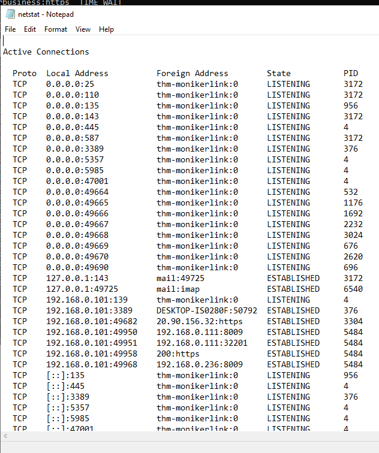

### Answers

**Q: What netstat flag can we use to display the executable responsible for a connection?**
```
-b
```

**Q: If we wanted to display all TCP connections and the associated process ID using netstat, what flag would we use?**
```
-o
```

**Q: What special character can we use to save the output of netstat to a text file?**
```
>
```

---

## Task 5 — Practical: Live C2 Investigation

This practical paired an "Analyst" machine with a separate "C2" machine, simulating a host actively communicating with a command-and-control agent.

### Identifying the C2 Connection

Using `Get-NetTCPConnection`, an active connection on the well-known reverse shell port was identified:

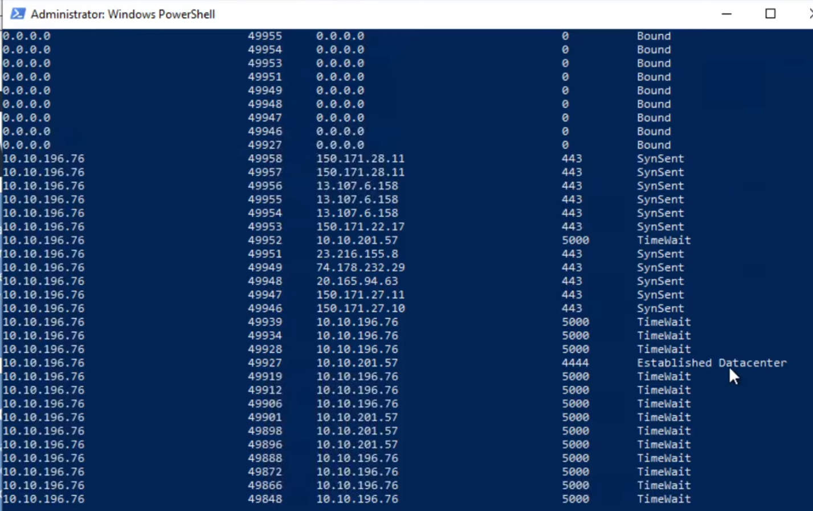

**Q: A popular port for reverse shells is currently active. What is the port number?**
```
4444
```

### Identifying the Responsible Process

Cross-referencing the connection's owning process revealed:

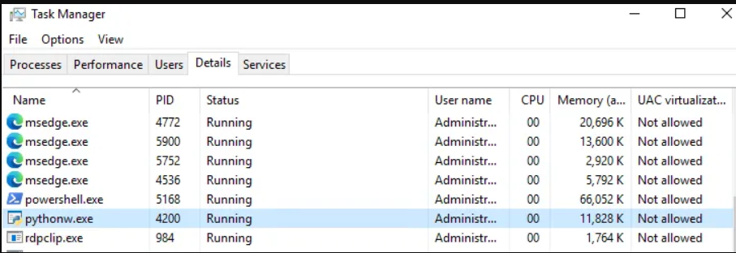

**Q: What is the name of the process that is connecting to the C2 server?**
```
pythonw.exe
```

🔴 **Malware relevance:** `pythonw.exe` is the windowless Python interpreter — commonly abused to run Python-based C2 agents/implants silently in the background with no visible console window, making it a strong indicator of compromise when seen maintaining outbound connections to non-standard ports.

### Hosts File Redirection

Reviewing the hosts file revealed an attacker-controlled domain entry:

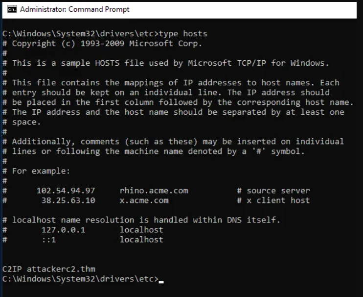

**Q: What is the domain that has been added to the workstation's host file?**
```
attackerc2.thm
```

### SRUM — Identifying Data Exfiltration

Analysis of the SRUM database (Network Data Usage) identified a process that had sent an unusually large volume of bytes, consistent with data exfiltration:

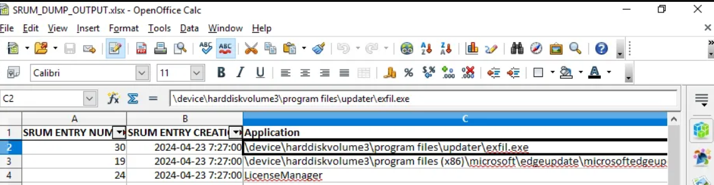

**Q: Analyse the SRUM database. There is another process that has sent a large amount of bytes, indicating data exfil. What is the full path to the process (as listed in SRUM)?**
```
\device\harddiskvolume3\program files\updater\exfil.exe
```

🔴 **Malware relevance:** The path mimics a legitimate "Updater" application — a common masquerading technique to blend in with expected software while running an exfiltration tool.

### SMB Share Enumeration

Using `Get-SmbConnection`, the SMB shares present on the analyst machine were enumerated, revealing an unusual share name:

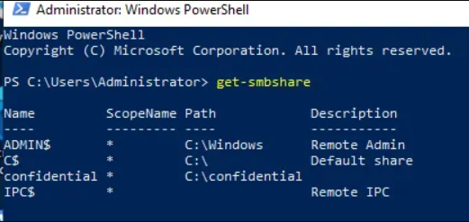

**Q: Finally, analyse the SMB shares present on the analyst machine. What is the name of the share that stands out?**
```
confidential
```

---

## Key Takeaways

- Windows ships with sufficient built-in tooling (PowerShell, netstat, pktmon, qwinsta) to perform meaningful network triage before any external toolset is deployed.
- SRUM retains weeks of per-process network usage data, making it a critical artefact for identifying historical exfiltration even after a process has terminated.
- `Get-NetTCPConnection` combined with process and command-line lookups is one of the fastest ways to correlate suspicious connections to their originating process.
- The hosts file remains a simple but effective technique for traffic redirection and should always be checked during triage.
- **Attack chain reconstruction for this practical:** a `pythonw.exe`-based C2 agent maintained a live connection on port 4444 → a hosts file entry (`attackerc2.thm`) supported C2 domain resolution → SRUM revealed a separate masquerading process (`exfil.exe` under `Program Files\Updater`) responsible for bulk data exfiltration → an exposed `confidential` SMB share indicated the likely target of that exfiltration.
- Firewall logging is disabled by default — verify logging configuration before depending on `pfirewall.log` as an evidence source.

---

*Write-up by [OPT4RUN](https://tryhackme.com/p/OPT4RUN)*