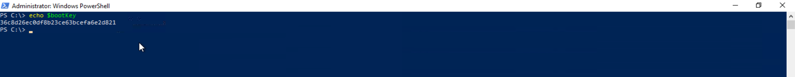
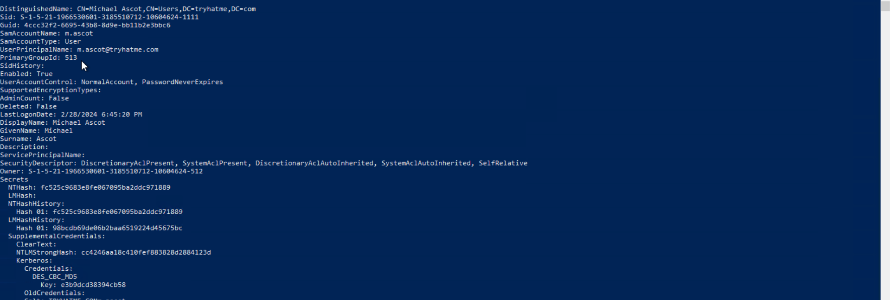
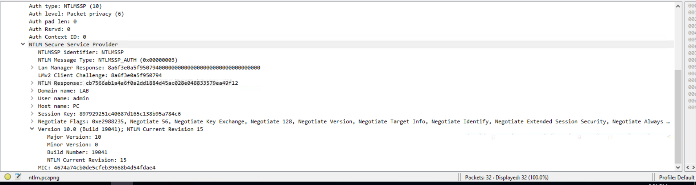
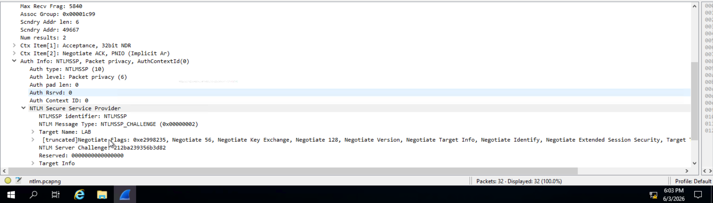
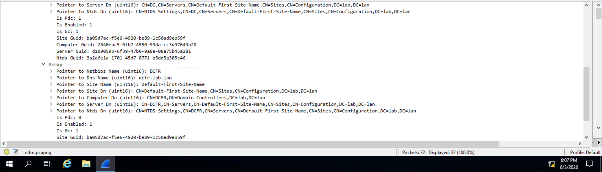
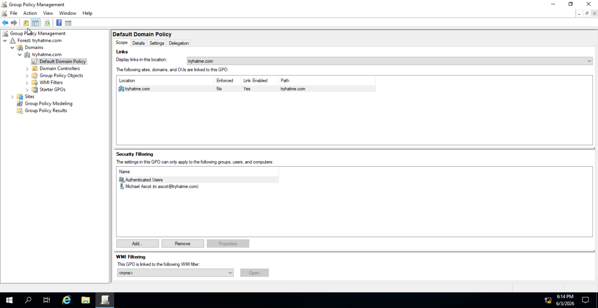
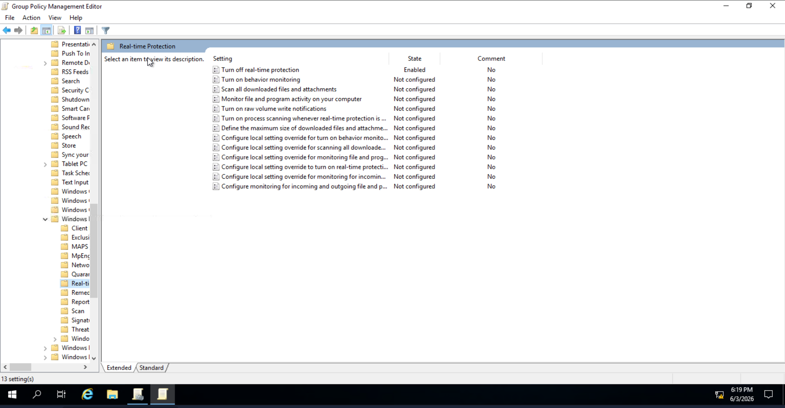
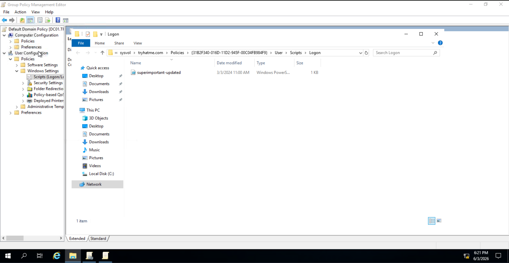
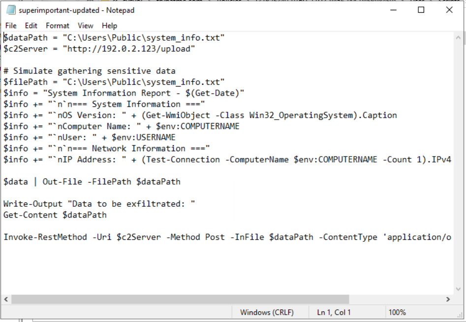

| Field | Details |
|-------|---------|
| **Room** | Windows User Account Forensics |
| **Platform** | TryHackMe |
| **Path** | Advanced Endpoint Investigations |
| **Module** | Windows Endpoint Investigation |
| **Room #** | 3 |
| **Difficulty** | Medium |
| **Category** | Digital Forensics / IR |
| **Room Link** | [tryhackme.com/room/windowsuseraccountforensics](https://tryhackme.com/room/windowsuseraccountforensics) |
| **Author** | [OPT4RUN](https://tryhackme.com/p/OPT4RUN) |

---

## Overview

This room covers Windows forensic artefacts tied to user account activity. It focuses on three main pillars: the account lifecycle (creation, modification, deletion), authentication artefacts (event logs and network traffic), and Group Policy Object (GPO) exploitation. From a SOC perspective, these are critical areas — compromised user accounts and abused GPOs are both common persistence and lateral movement vectors, and knowing where the artefacts live is essential for incident response.

---

## Task 1 — Introduction

No questions. Covers learning objectives and VM credentials.

---

## Task 2 — Windows Account Types

Overview of the four main Windows account categories and their associated security risks:

| Account Type | Description |
|---|---|
| **Local User Accounts** | Machine-specific, no centralized management |
| **Domain Accounts** | Managed via domain controller; network-wide access |
| **System & Service Accounts** | OS-level accounts (Local System, Network Service, Local Service) and app-specific service accounts |
| **MSAs & Virtual Accounts** | Specialized domain/local accounts with automated password rotation |

**Key risk across all types:** Overprivileged accounts and lack of centralized monitoring expand attack surface significantly.

**Q: What type of accounts are used by the Windows operating system and various apps?**
```
System and Service Accounts
```

**Q: What centrally manages local user accounts and domain accounts?**
```
Domain Controller
```

---

## Task 3 — Account Lifecycle Artefacts

### Key Event IDs — Account Lifecycle

| Event ID | Description |
|---|---|
| 4720 | User account created |
| 4722 | User account enabled |
| 4738 | User account modified |
| 4740 | User account locked out |
| 4726 | User account deleted |

These are logged in `Windows Logs > Security` in Event Viewer. Domain account events are logged on the **domain controller**; local account events on the individual machine.

### Artefact Sources

| Source | Location | Key Data |
|---|---|---|
| **SAM** | `%SystemRoot%\system32\config\SAM` | Local account names, SIDs, password hashes, last login, account status |
| **NTDS.dit** | Domain controller | Domain accounts, group memberships, password hashes, login timestamps, trust relationships |

> 💡 **Tip:** The SAM file is locked while Windows is running. Access it from an offline system or forensic backup.

### Analyzing NTDS.dit with DSInternals

Export NTDS.dit + SYSTEM hive:

```powershell
ntdsutil.exe "activate instance ntds" "ifm" "create full C:\Exports" quit quit
```

Extract the boot key (needed to decrypt password hashes):

```powershell
$bootKey = Get-BootKey -SystemHivePath 'C:\Exports\registry\SYSTEM'
```

Dump all domain accounts:

```powershell
Get-ADDBAccount -All -DBPath 'C:\Exports\Active Directory\NTDS.dit' -BootKey $bootKey
```

> 🔴 **Malware relevance:** Attackers dump NTDS.dit to extract domain password hashes offline for pass-the-hash or cracking. The SYSTEM hive boot key is always required alongside it — if you see both being accessed or exfiltrated, that's a strong indicator of credential harvesting.





**Q: How many users were found using the DSInternals command?**
```
5
```

**Q: What is the value of the "bootKey" variable?**
```
36c8d26ec0df8b23ce63bcefa6e2d821
```

**Q: What is the SID of the domain user, m.ascot?**
```
S-1-5-21-1966530601-3185510712-10604624-1111
```

---

## Task 4 — Account Authentication Artefacts

### Key Event IDs — Authentication

| Event ID | Description |
|---|---|
| 4624 | Successful logon |
| 4625 | Failed logon |
| 4768 | Kerberos TGT requested |
| 4771 | Kerberos pre-authentication failed |

> 💡 **Tip:** Correlation matters more than individual events. A burst of 4625 followed by a 4624 is a brute-force pattern. Unusual 4768 spikes may indicate Kerberoasting recon.

### NTLM Traffic Analysis (Wireshark)

NTLM authentication follows a 3-step handshake:

| Step | Frame | Description |
|---|---|---|
| Negotiation | Frame 11 | Client initiates NTLM |
| Challenge | Frame 12 | Server sends challenge string |
| Authentication | Frame 13 | Client responds with NT hash response |

Network artefacts available from NTLM traffic: source/destination IPs, hostnames, domain name, username, challenge string, response hash.

To decrypt NTLMSSP traffic in Wireshark when the password is known:
`Edit > Preferences > Protocols > NTLMSSP > NT Password`







> 🔴 **Malware relevance:** Pass-the-Hash and Kerberoasting attacks will appear as normal authentication traffic on the wire. NTLM and Kerberos artefacts alone won't confirm an attack — they need to be correlated with event logs, anomalous timing, and lateral movement indicators.

**Q: What is the user name used for the NTLM authentication?**
```
admin
```

**Q: What was the Server Challenge sent to the client during the Challenge stage of the NTLM handshake?**
```
212ba239356b3d82
```

**Q: What is the Dns Name of the other result from the DsGetDomainControllerInfo response?**
```
dcfr.lab.lan
```

---

## Task 5 — Group Policy Artefacts

### GPO Attack Scenarios

| Attack Type | What the Attacker Does |
|---|---|
| Privilege Escalation | Modifies GPO to alter user rights or group memberships |
| Persistence / Lateral Movement | Deploys malicious logon scripts via GPO |
| Security Policy Modification | Disables firewall rules, AV, or other security controls |
| Reconnaissance | Embeds scripts that gather network information |

### GPO Forensic Artefact Locations

| Artefact | Location |
|---|---|
| Custom user settings | `HKEY_CURRENT_USER` registry keys, user profile directories |
| Logon scripts | `SYSVOL` folder, user profile execution logs |
| User rights assignments | `%SystemRoot%\security\database\secedit.sdb` |
| Security policy changes | `HKEY_LOCAL_MACHINE\SOFTWARE\Microsoft\Windows\CurrentVersion\Policies` |
| Service configurations | `HKEY_LOCAL_MACHINE\SYSTEM` |
| Network config changes | `HKEY_LOCAL_MACHINE\SOFTWARE\Microsoft\Windows NT\CurrentVersion\NetworkList`, `%SystemRoot%\System32\drivers\etc` |

### Lab: Investigating "Super Important Policy"

The suspicious GPO was found in `Forest: tryhatme.com > Domains > tryhatme.com > Group Policy Objects`. Red flags:

- **Non-standard naming** — doesn't follow company convention
- **Applied to Administrator account** and all authenticated users

Malicious configurations found:

1. `Computer Configuration > Policies > Administrative Templates > Network > Network Connections > Windows Defender Firewall > Domain Profile`
   — Windows Defender Firewall set to **Disabled** for all machines

2. `User Configuration > Policies > Windows Settings > Scripts (Logon/Logoff) > Logon > PowerShell Scripts`
   — Malicious PowerShell script configured to execute on every user logon

> 🔴 **Malware relevance:** GPO-based persistence is highly effective because it reapplies automatically on every login and Group Policy refresh cycle (~90 min default). A malicious logon script embedded in SYSVOL will survive reboots and re-execute across all targeted accounts domain-wide.









**Q: What is the name of the user specified as the apply target for this Policy?**
```
Michael Ascot
```

**Q: Under Computer Configuration > Policies > Administrative Templates > Windows Components > Windows Defender Antivirus > Real-time Protection, what is the setting that was enabled?**
```
Turn off real-time protection
```

**Q: There is an updated malicious startup PowerShell script. What is the filename of this script? (Without file extension)**
```
superimportant-updated
```

**Q: What is the IP address of the C2 server the script would exfiltrate to?**
```
192.0.2.123
```

---

## Task 6 — Conclusion

No questions.

---

## Key Takeaways

- **Account lifecycle events** (4720, 4722, 4738, 4740, 4726) in the Security event log are the primary artefact source for tracking account creation, modification, and deletion
- **SAM** holds local account data; **NTDS.dit** holds domain account data — both store password hashes and require offline/forensic access; NTDS.dit requires the SYSTEM hive boot key to decrypt
- **DSInternals** (`Get-ADDBAccount`) enables offline domain account extraction from exported NTDS.dit + SYSTEM hive
- **NTLM handshake** (Negotiate → Challenge → Authenticate) leaves artefacts in network captures including usernames, hostnames, and challenge/response strings; Wireshark can decrypt NTLMSSP traffic if the NT password is known
- **Authentication event IDs** (4624, 4625, 4768, 4771) need to be correlated — single events are rarely conclusive on their own
- **GPO abuse** is a high-impact persistence technique: malicious logon scripts in SYSVOL re-execute on every login; firewall/AV policy changes persist until explicitly reversed
- Suspicious GPOs can be identified by: non-standard naming, unexpected apply targets (e.g., Administrator), and configurations that weaken security controls

---

*Write-up by [OPT4RUN](https://tryhackme.com/p/OPT4RUN)*