# Windows User Activity Analysis

| Field | Details |
|-------|---------|
| **Room** | Windows User Activity Analysis |
| **Platform** | TryHackMe |
| **Path** | Advanced Endpoint Investigations |
| **Module** | Windows Endpoint Investigation |
| **Room #** | 4 |
| **Difficulty** | Medium |
| **Category** | Digital Forensics / IR |
| **Room Link** | [tryhackme.com/room/windowsuseractivity](https://tryhackme.com/room/windowsuseractivity) |
| **Author** | [OPT4RUN](https://tryhackme.com/p/OPT4RUN) |

---

## Overview

This room walks through a forensic investigation of Windows user activity artifacts using the **Incident Scenario: 36 hours of Rampage** — an HR employee's workstation was accessed without authorisation over a weekend, with files exfiltrated and traces wiped. The investigation covers registry-based artifacts, ShellBags, LNK files, and Jump Lists to reconstruct the suspect's actions.

Key artifacts covered:
- **Registry Hives** — TypedPaths, WordWheelQuery, RecentDocs, Comdlg32, UserAssist, RunMRU
- **ShellBags** — folder navigation history including deleted and network share access
- **LNK Files** — shortcut metadata revealing accessed files and network paths
- **Jump Lists** — per-application recently accessed file history with timestamps

> 💡 **Tip:** On a live system, extract artifacts before analysis to avoid unintentional tampering. FTK Imager is the recommended tool for offline extraction.

---

## Task 1 — Introduction

Sets up the scenario: *Johny*, a recently resigned employee, is suspected of accessing a colleague's workstation over the weekend using a password found on a sticky note. He accessed sensitive documents, ran hacking tools, and attempted to wipe traces before leaving.

No questions.

---

## Task 2 — Lab Connection Instructions

Lab credentials and connection setup. The VM contains pre-extracted artifacts and forensics tools on the Desktop.

| Field | Value |
|-------|-------|
| Username | administrator |
| Password | thm_4n6 |

EZ Tools folder on the Desktop contains all required analysis tools.

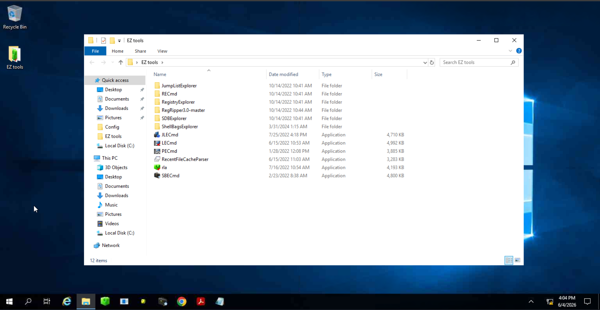

**Q: Connect with the lab. How many tools / folders are in the EZ tools folder on the Desktop?**
```
12
```

---

## Task 3 — Revisiting Registry

### Registry Hive Files

The Windows Registry is stored across multiple Hive files, each serving a distinct purpose:

| Hive File | Mapped Key Path | Purpose |
|-----------|----------------|---------|
| SAM | HKLM\Local_Machine\SAM | User account and security policy data |
| SECURITY | HKLM\SECURITY | Security config, authentication, permissions |
| SYSTEM | HKLM\SYSTEM | Hardware, drivers, startup settings |
| SOFTWARE | HKLM\SOFTWARE | Installed software and system-wide settings |
| DEFAULT | HKU\.DEFAULT | Template for new user profiles |
| NTUSER.DAT | HKCU | User-specific settings and preferences |
| USRCLASS.DAT | HKCU\Software\Class | User-specific class configuration |

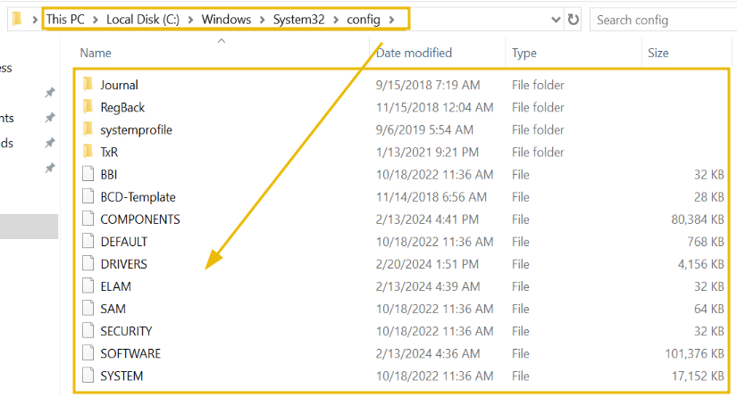

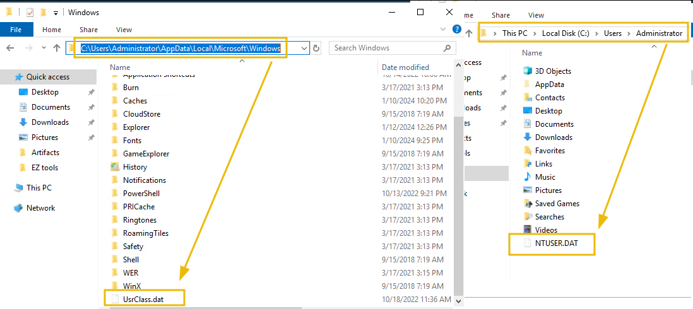

### Registry Hives

| Hive Name | Description |
|-----------|-------------|
| HKEY_CLASSES_ROOT | File associations and OLE object classes |
| HKEY_CURRENT_USER | Settings for the currently logged-in user |
| HKEY_LOCAL_MACHINE | System-wide settings and configurations |
| HKEY_USERS | Settings for all user profiles |
| HKEY_CURRENT_CONFIG | Current hardware profile |

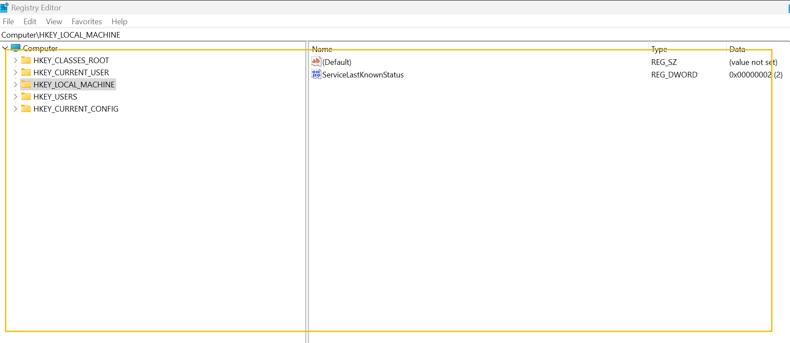

### Dirty Hives and Transaction Logs

When a system shuts down unexpectedly, registry Hives can become *dirty* — inconsistent and not properly closed. Windows uses transaction logs (e.g., `SYSTEM.LOG1`, `SYSTEM.LOG2`) stored in `C:\Windows\System32\config` to track and roll back changes if needed.

Run `dir /a` in the config directory to list hidden transaction log files.

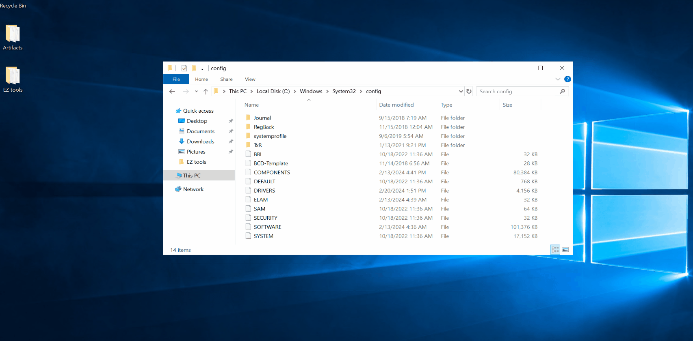

> 💡 **Tip:** Always check if a Hive is dirty before analysis. Dirty Hives require their corresponding transaction logs to produce accurate forensic output.

For offline analysis, use **Registry Explorer** — it handles both live and offline Hive loading and cleanly decodes encoded values that `regedit` shows as hex.

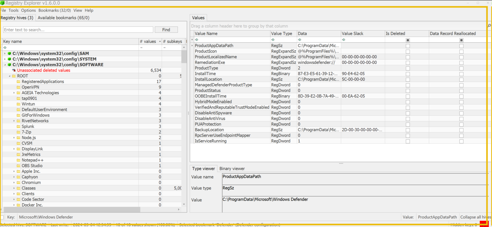

**Q: Which Hive stores information about installed software?**
```
SOFTWARE
```

**Q: What is the current size of the SAM Hive in the attached lab? (In KB)**
```
128
```

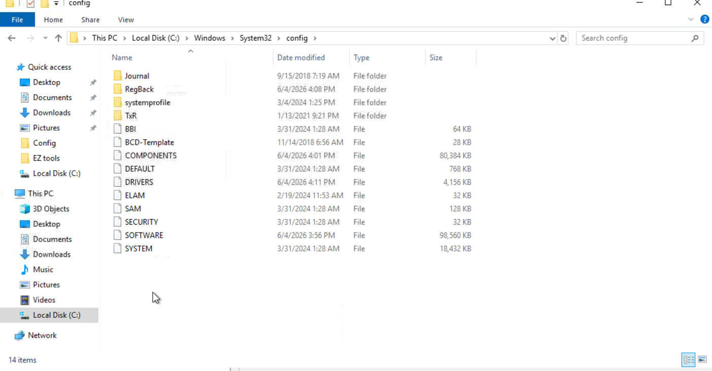

---

## Task 4 — Performing Registry Forensics

### TypedPaths

**Key:** `HKCU\Software\Microsoft\Windows\CurrentVersion\Explorer\TypedPaths`

Stores paths typed directly into File Explorer's address bar or the Run dialogue. Reveals directories the suspect was navigating to.

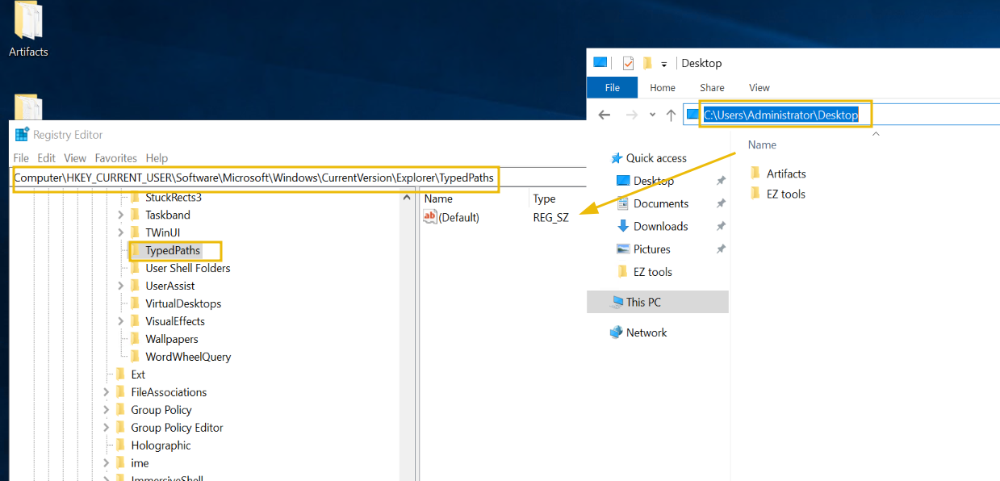

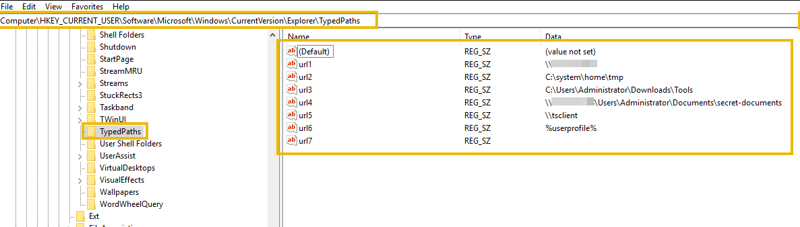

The evidence shows the suspect navigating to sensitive document directories and a suspicious `C:\system\home\tmp` path that does not exist on a standard Windows installation.

### WordWheelQuery

**Key:** `HKCU\Software\Microsoft\Windows\CurrentVersion\Explorer\WordWheelQuery`

Tracks search terms entered in File Explorer's search bar. Values appear as hex in `regedit` — use Registry Explorer for readable output.

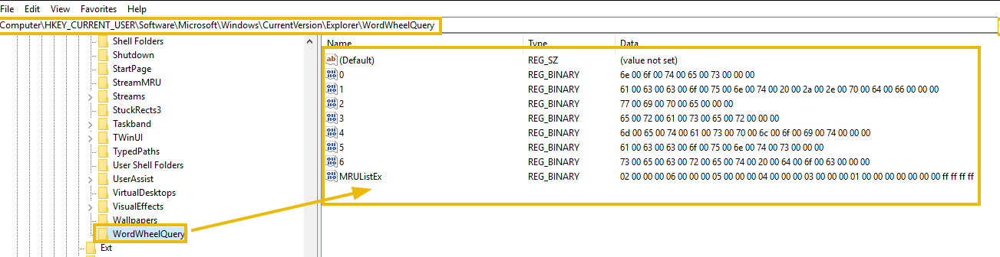

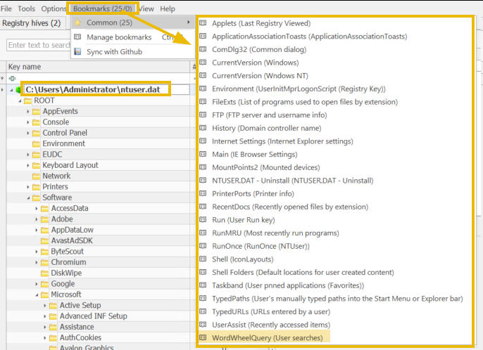

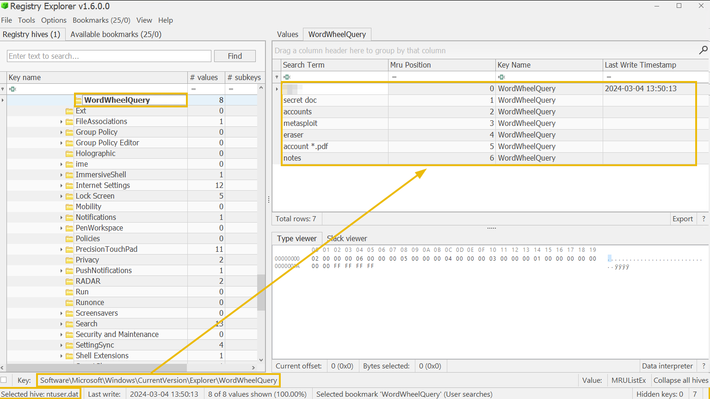

The latest search term indicates the suspect was looking for a disk wiping tool to remove evidence.

### RecentDocs

**Key:** `HKCU\Software\Microsoft\Windows\CurrentVersion\Explorer\RecentDocs`

Tracks recently accessed files and documents. Values are hex-encoded in `regedit` — Registry Explorer decodes them cleanly.

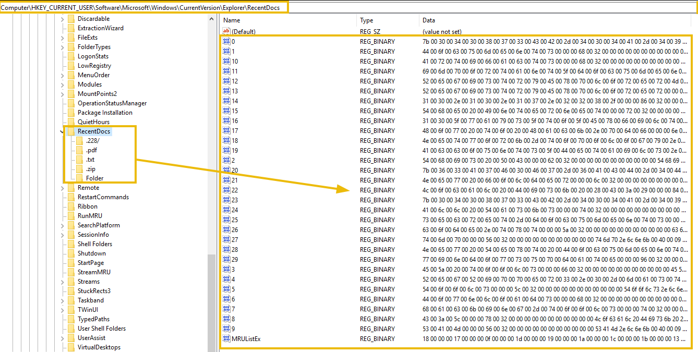

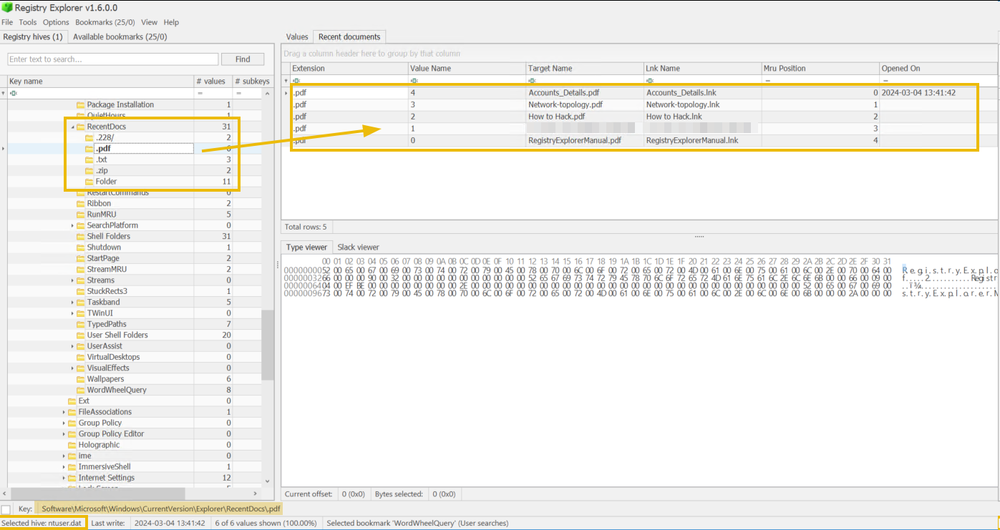

The artifact reveals a list of sensitive files accessed from multiple locations across the system.

### Comdlg32 (Common Dialogue Box)

**Key:** `HKCU\Software\Microsoft\Windows\CurrentVersion\Explorer\ComDlg32`

Tracks the last file opened or saved via any Windows Open/Save dialogue. Two sub-keys of forensic interest:

- **LastVisitedMRU** — most recently visited folder paths in File Explorer
- **OpenSavePidlMRU** — most recently opened or saved files and their locations

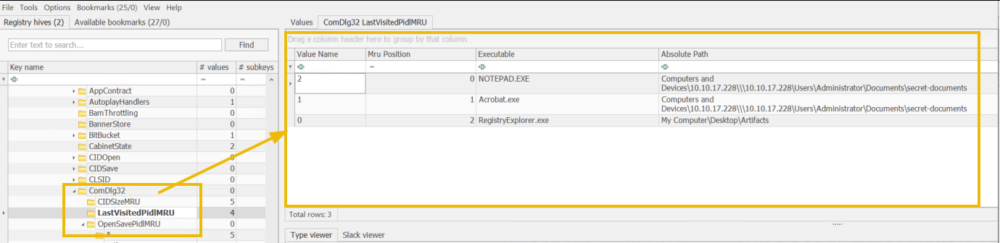

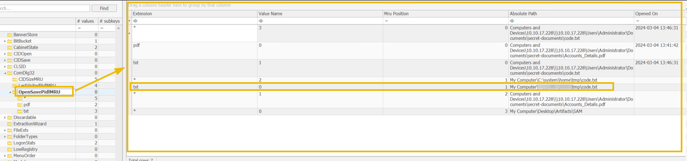

Evidence shows the suspect accessed critical files related to account details via the common dialogue.

### UserAssist

**Key:** `HKCU\Software\Microsoft\Windows\CurrentVersion\Explorer\UserAssist`

Tracks GUI-based program executions. Values are ROT13-encoded — Registry Explorer decodes automatically. Two key GUIDs:

| GUID | Tracks |
|------|--------|
| `{CEBFF5CD-ACE2-4F4F-9178-9926F41749EA}` | Files and folders via Windows Explorer |
| `{F4E57C4B-2036-45F0-A9AB-443BCFE33D9F}` | Shortcut (.LNK) file executions |

Each entry provides: program name, execution count, last execution timestamp, and focus time.

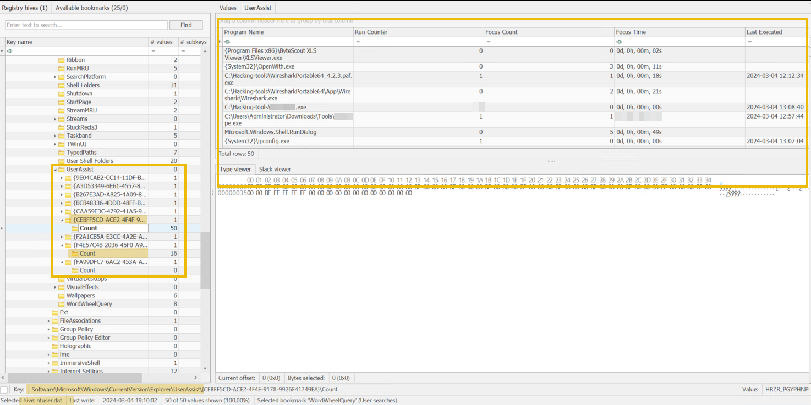

Evidence shows execution of a network sniffing tool and a disk wiping utility from the Hacking-tools folder.

### RunMRU

**Key:** `HKCU\Software\Microsoft\Windows\CurrentVersion\Explorer\RunMRU`

Stores commands run via the Run dialogue (`Win + R`). The MRUList value indicates order — the last character entered is the most recent.

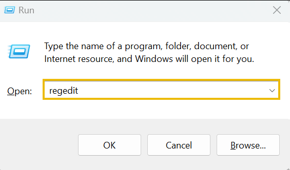

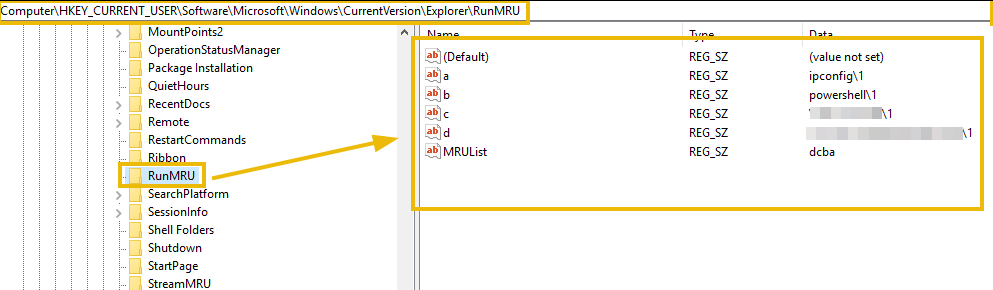

The `dcba` MRUList shows `d` was the most recently executed command.

---

**Q: The suspect typed a suspicious path in Windows Explorer, pointing to a tmp directory in C drive. What is the full path?**
```
C:\system\home\tmp
```

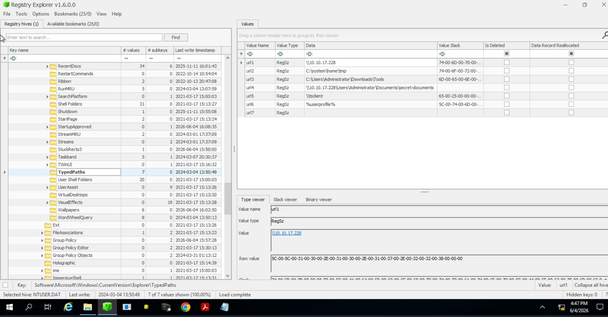

**Q: In the WordWheelQuery search, what was the latest term searched by the user?**
```
wipe
```

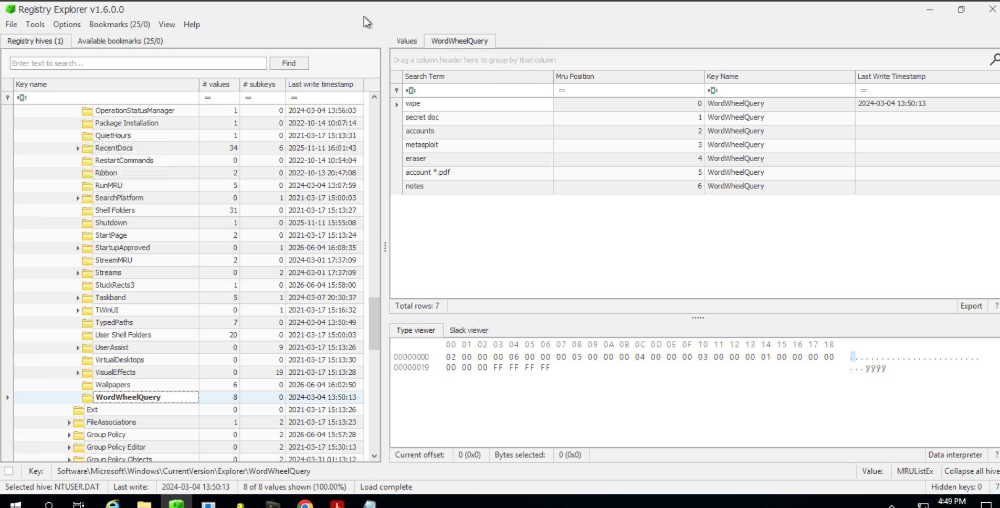

**Q: Where was the last text file saved by the suspect?**
```
C:\system\home\tmp\code.txt
```

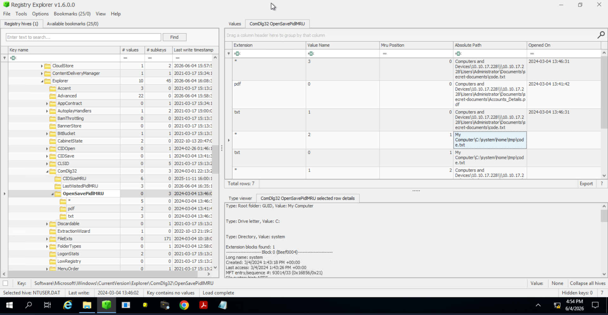

**Q: From the Hacking-tools folder, which suspicious key logging tool was executed 5 times?**
```
keylogger.exe
```

**Q: Which Disk Wiping utility was executed on this host?**
```
DiskWipe.exe
```

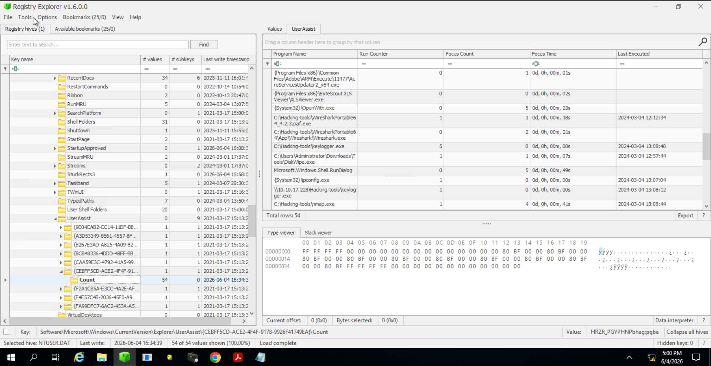

---

## Task 5 — ShellBags: Navigating the Past

ShellBags store metadata about how users interact with folders — view settings, folder paths, timestamps, and even deleted folder history. They persist even after files or folders are removed, making them a powerful forensic artifact.

### Key Hive Locations

| Hive | Path on Disk |
|------|-------------|
| NTUSER.DAT | `%USERPROFILE%\NTUSER.dat` |
| USRCLASS.DAT | `%USERPROFILE%\AppData\Local\Microsoft\Windows\UsrClass.dat` |

The primary ShellBag data lives in `USRCLASS.DAT`, mapped to:
`HKCU\Software\Classes\Local Settings\Software\Microsoft\Windows\Shell`

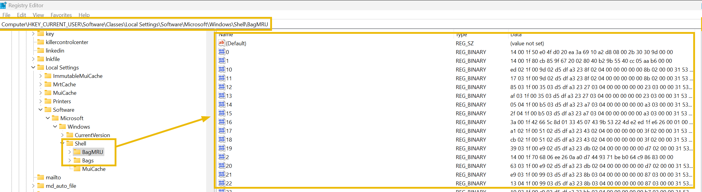

### Analysis with ShellBags Explorer

Launch **ShellBags Explorer** from `C:\Users\Administrator\Desktop\EZ tools\ShellBagsExplorer` as administrator. Use *Load active registry* for live Hive analysis.

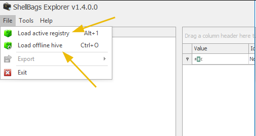

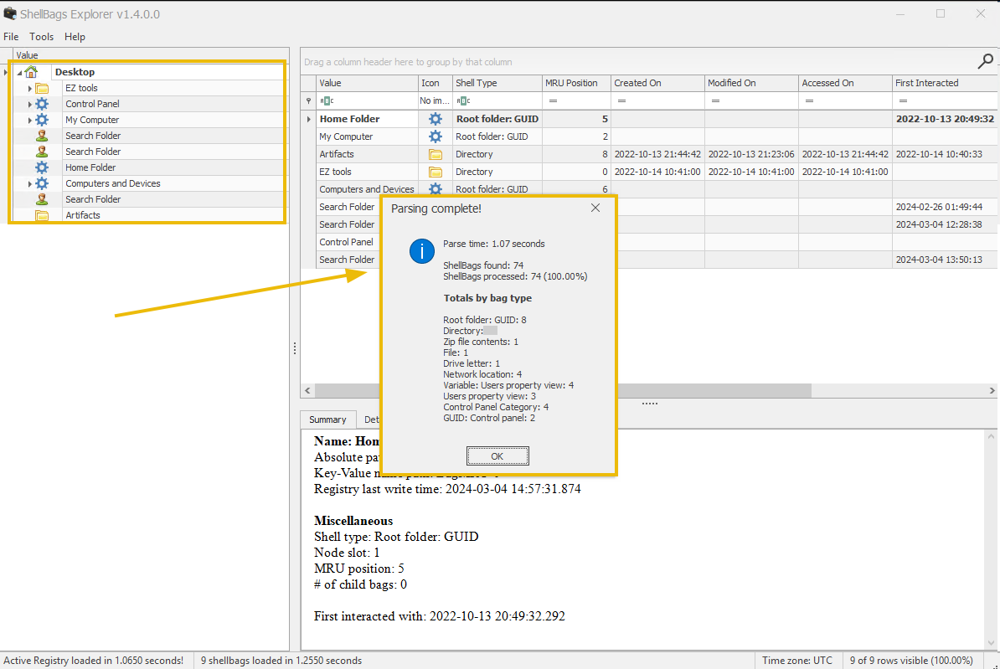

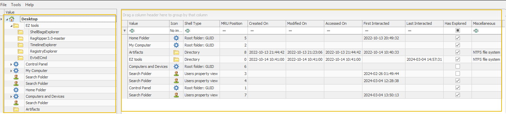

Evidence shows the suspect accessed **two network shares**. One share contains three sub-folders. Tools were copied from the network share and executed on the host. Directories containing confidential documents were also accessed.

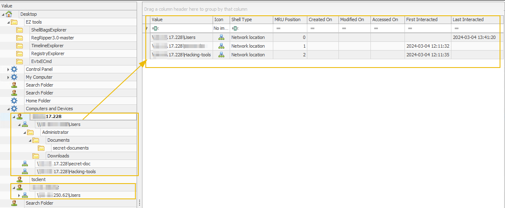

### Key Information in ShellBags

- Folder view settings (list, icons, details)
- Full folder paths including network shares and external drives
- First created, last accessed, and modified timestamps
- Deleted folder history — folders can persist in ShellBags after deletion
- Network and removable drive access history

**Q: What is the IP address of the Network Share where the user accessed three folders?**
```
10.10.17.228
```

**Q: What is the name of the second sub-folder within the Documents folder of the network share that the user accessed?**
```
secret-doc
```

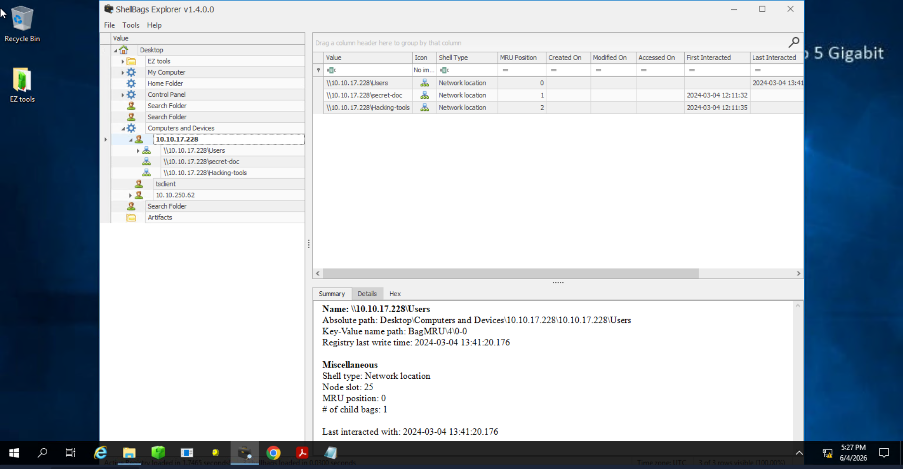

---

## Task 6 — LNK Files (Shortcut Files)

LNK files are Windows shortcut files created automatically when a file is accessed. They contain rich metadata about the original target file — path, timestamps, network share, volume information, and file size — even after the original file is deleted.

### Default LNK File Locations

```
%USERPROFILE%\AppData\Roaming\Microsoft\Windows\Recent
%USERPROFILE%\recent
```

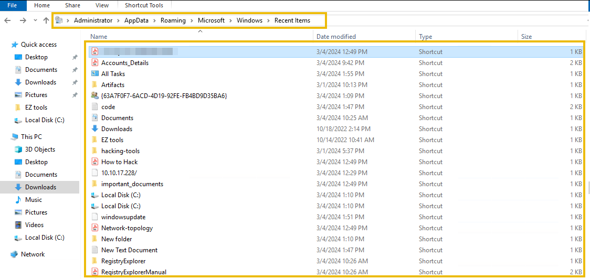

### Analysis with LECmd.exe

`LECmd.exe` (from EZ Tools) parses LNK files and extracts full metadata.

```cmd
LECmd.exe -f "C:\Users\Administrator\AppData\Roaming\Microsoft\Windows\Recent\<file>.lnk"
```

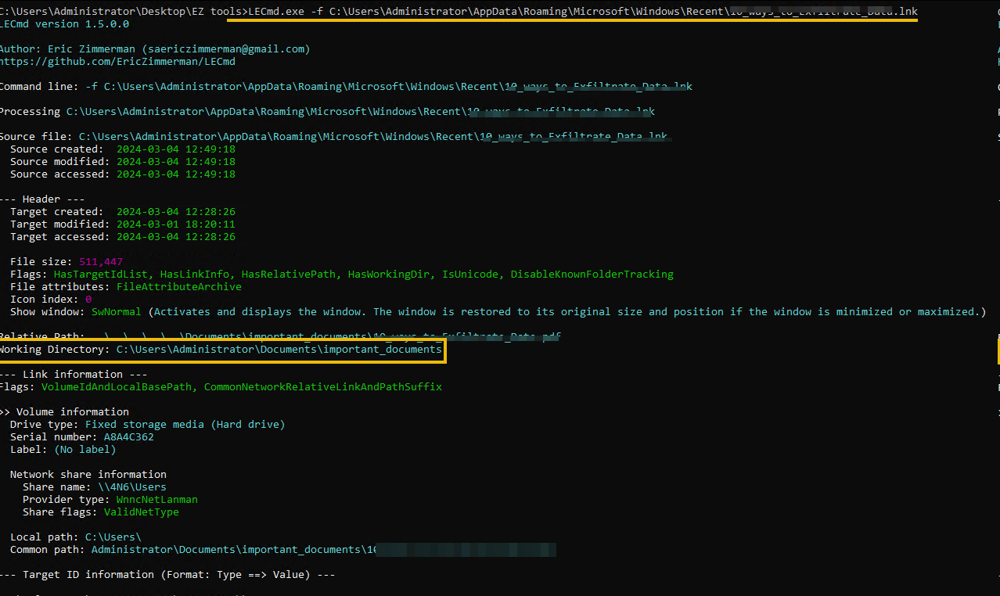

Each LNK file provides:
- Name of the accessed file
- Access, creation, and modification timestamps
- Target path (local or network)
- Network share name and path
- File size

**Q: What is the document that was last opened by the user on this machine?**
```
10_ways_to_Exfiltrate_Data.pdf
```

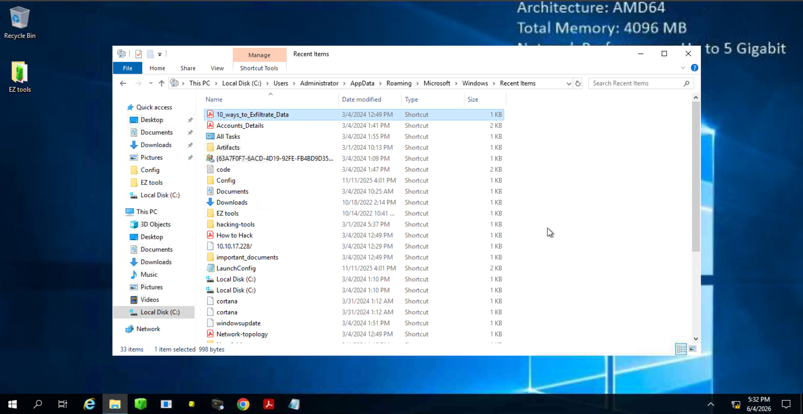

**Q: Analyzing the code.lnk file shows it was accessed from the network shared drive. What is the full path of the network directory?**
```
\\10.10.17.228\Users\Administrator\Documents\secret-documents
```

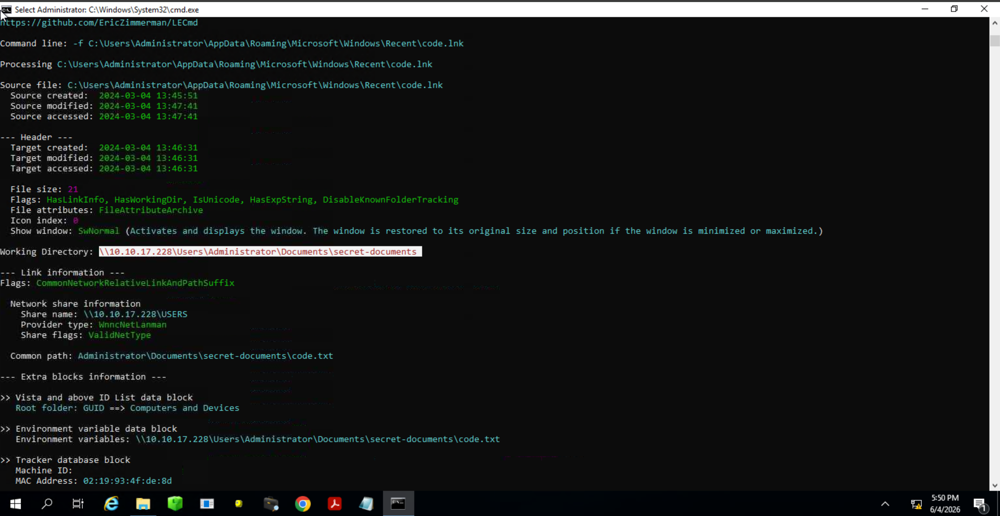

---

## Task 7 — Jump Lists: Leap Through Time

Jump Lists (introduced in Windows 7) track recently and frequently accessed files on a per-application basis. They appear in the Taskbar and Start Menu and are stored as hashed files tied to specific application AppIDs.

### File Types and Locations

| Type | Location |
|------|----------|
| AutomaticDestinations | `%APPDATA%\Microsoft\Windows\Recent\AutomaticDestinations` |
| CustomDestinations | `%APPDATA%\Microsoft\Windows\Recent\CustomDestinations` |

- **AutomaticDestinations** — automatically populated by Windows per application
- **CustomDestinations** — manually added by applications for specific tasks or features

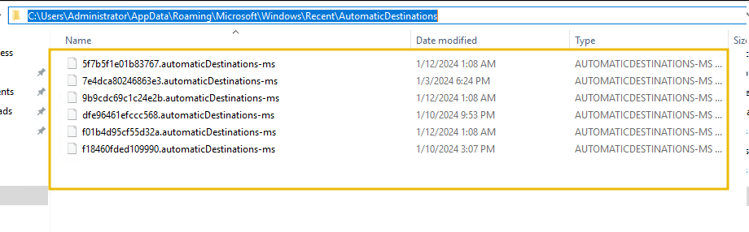

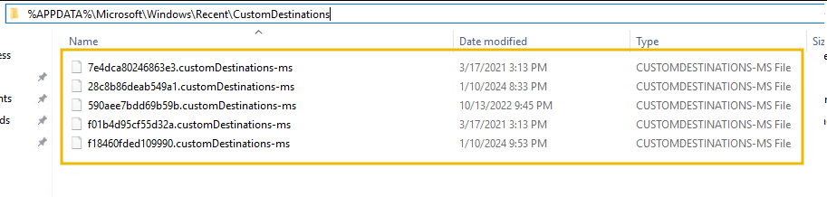

File names are hashed AppIDs — Jump List Explorer decodes these automatically.

### Analysis with Jump List Explorer

Launch **JumpList Explorer** from `C:\Users\Administrator\Desktop\EZ tools\JumpListExplorer`.

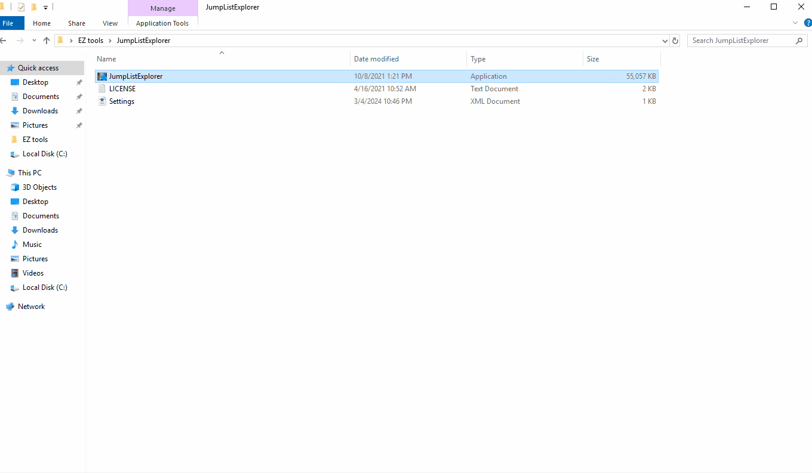

The tool layout provides:
1. Loaded Jump List files (one per application)
2. List of files accessed within that application
3. Metadata — timestamps, absolute target path, access count
4. AppID and resolved application name

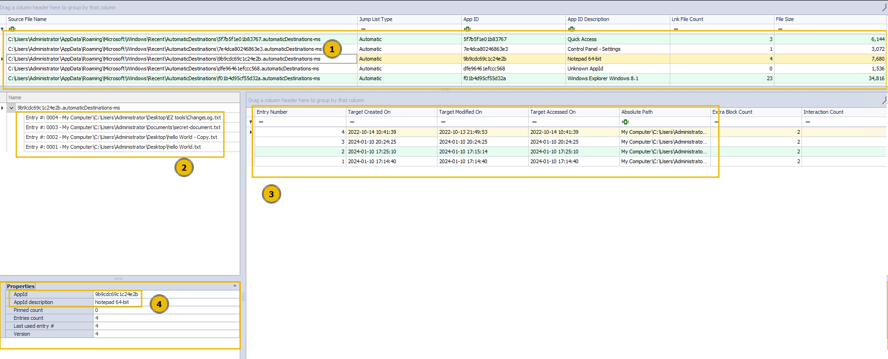

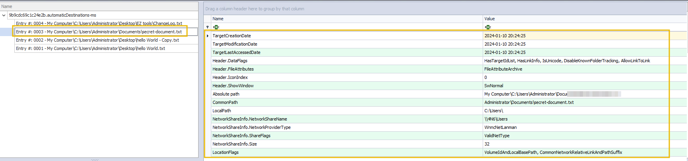

Jump List evidence reveals: recently accessed file list, access timestamps, absolute paths, documents accessed from the network share, sensitive PDF and text files, and access counts per file.

**Q: A text file named code.txt was accessed from a tmp directory. What is the full path of the tmp directory?**
```
C:\system\home\tmp\code.txt
```

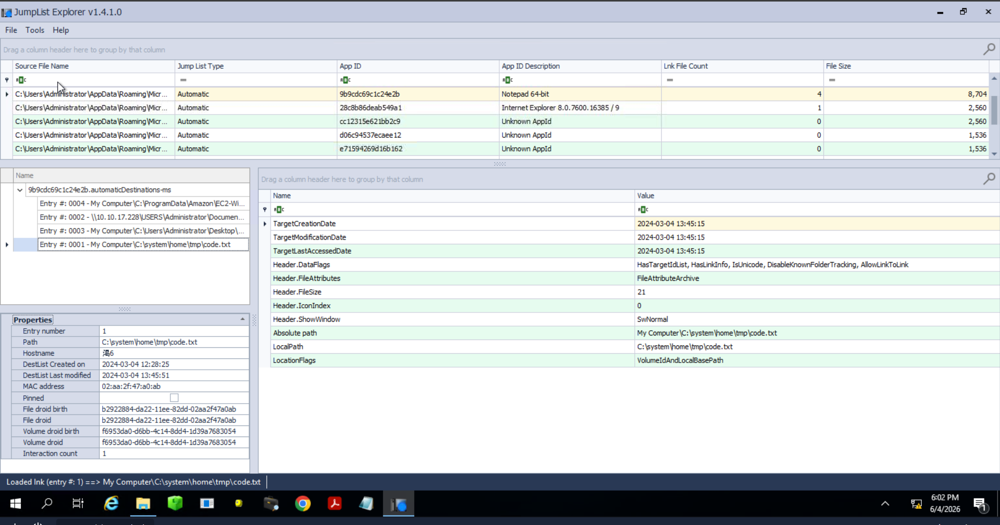

**Q: What URL was accessed using Internet Explorer?**
```
http://10.10.17.228/
```

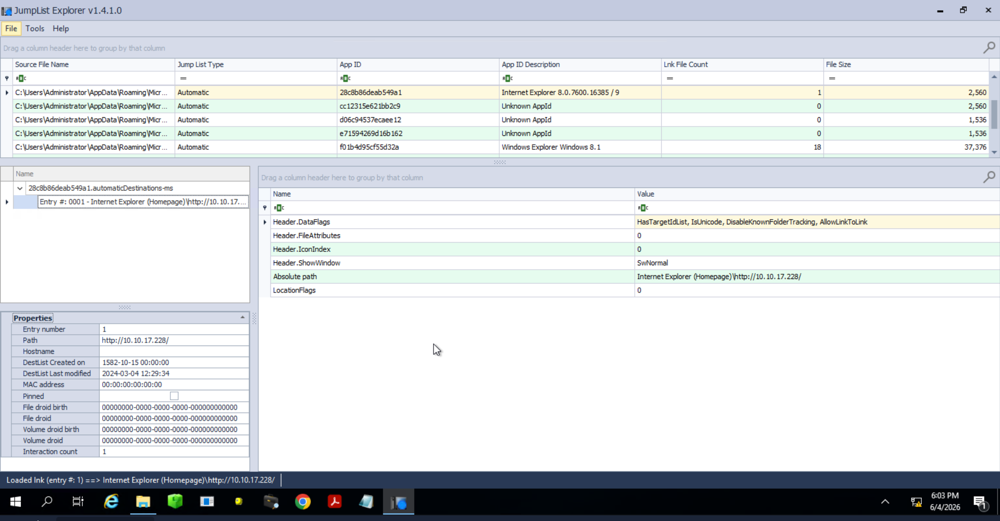

**Q: When did the user access the "How to Hack.pdf" file?**
```
2024-03-04 12:28:26
```

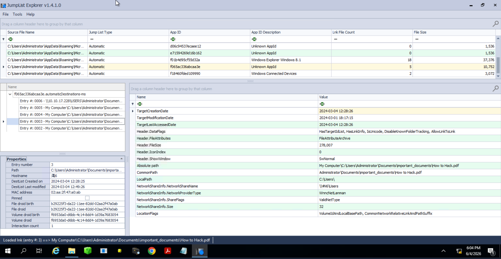

---

## Task 8 — Conclusion

No questions.

---

## Key Takeaways

- **Registry is a goldmine** — TypedPaths, WordWheelQuery, RecentDocs, UserAssist, and RunMRU together reconstruct almost the entire user session without needing any other artifact
- **Registry Explorer over regedit** — many registry values are ROT13-encoded or stored as hex; Registry Explorer decodes these natively
- **Dirty Hives need their transaction logs** — always check for `.LOG1`/`.LOG2` files alongside Hive files before offline analysis
- **ShellBags survive deletion** — folder access history persists in `USRCLASS.DAT` even after the folders themselves are removed; especially useful for network share and external drive access
- **LNK files reveal network paths** — shortcut metadata includes full UNC paths, exposing lateral movement and data staging locations
- **Jump Lists are per-application** — each application's AppID maps to a separate Jump List file; access counts and timestamps help establish frequency and timeline of activity
- **Correlation across artifacts** — the same `C:\system\home\tmp` path appeared in TypedPaths, Comdlg32, and Jump Lists, confirming it as a staging directory used by the suspect

> 🔴 **Malware relevance:** Threat actors routinely target these same artifacts during anti-forensics. Tools like `DiskWipe.exe` are specifically used to destroy Jump Lists, LNK files, and prefetch data. Registry-based artifacts are harder to fully wipe without causing system instability, making them a reliable evidence source.

---

*Write-up by [OPT4RUN](https://tryhackme.com/p/OPT4RUN)*