| Room | Platform | Path | Difficulty | Category | Room Link | Author |
|------|----------|------|------------|----------|-----------|--------|
| iOS Analysis | TryHackMe | Advanced Endpoint Investigations → Mobile Analysis | Easy | Digital Forensics | [tryhackme.com/room/iosanalysis](https://tryhackme.com/room/iosanalysis) | OPT4RUN |

## Overview

This room covers iOS forensic acquisition and analysis — trust/pairing mechanics, iOS lock-state protections, the APFS filesystem and its domain structure, key artefact locations, and acquisition tooling (`libimobiledevice`, 3uTools). It closes with a practical insider-threat scenario against an extracted iPhone backup.

From a SOC/blue-team perspective, iOS's sandboxing and data protection classes shape what's recoverable at rest vs. only after unlock — understanding this is essential for scoping what an insider-threat or BYOD investigation can realistically extract from a work-issued iPhone.

## Task 1 — Introduction

Scenario: an organisation-issued iPhone belonging to an employee (Janet) is being investigated for insider-threat activity. The room explicitly excludes bypassing iOS security, lockout circumvention, and jailbreaking — this is a known-passcode acquisition scenario.

## Task 2 — iOS Pairing

Since 2018, Apple enforces **Restricted Mode**, blocking data I/O over the Lightning port unless the device is unlocked and trust is established — a mitigation for juice-jacking and rogue-device attacks.

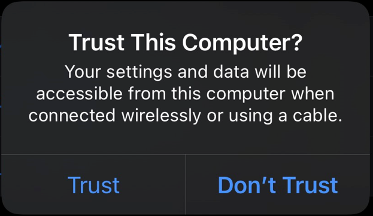

**Trust Certificates**
- Generated via cryptographic exchange using a private key stored in the iPhone's hardware
- Stored on both the iPhone and the paired device (Windows: `C:\ProgramData\Apple\Lockdown`)
- Expire after 30 days
- Contain a unique device identifier

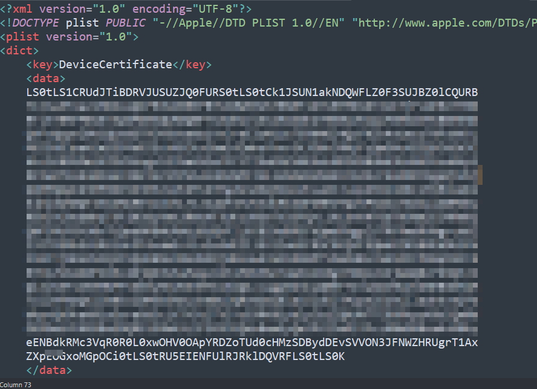

**iOS Locked State Protections**

| Protection | Behaviour |
|---|---|
| File encryption | All files encrypted at rest; auth required to read |
| File accessibility | Only `NSFileProtectionNone` files accessible while locked |
| Hardware access | Mic, camera, new Bluetooth pairings denied by default |
| Application access | Only background-capable apps (music, time-sensitive, maps) run |
| Keychain access | Inaccessible until device is unlocked |
| Trust & pairing | New device pairing requires user authentication |

**Data Protection Classes**

| Class | Example | Required State |
|---|---|---|
| `NSFileProtectionNone` | Cache | Always accessible |
| `NSFileProtectionCompleteUnlessOpen` | Streaming audio/video | Opened while unlocked, stays accessible after lock |
| `NSFileProtectionCompleteUntilFirstUserAuthentication` | Step count, notifications | Unlocked once after boot, then persists |
| `NSFileProtectionComplete` | Credentials, messages, health data | Requires unlocked device |

🔴 The data protection class hierarchy directly determines what's forensically recoverable from a locked seized device — `NSFileProtectionComplete` data (messages, credentials) is off-limits without unlock, while cache and background-service data may still be extractable.

**Q: What is the name of a type of certificate that is used when an iPhone and a device pair together?**
```
Trust Certificate
```

**Q: What is the expiry timer on these certificates?**
```
30 Days
```

## Task 3 — Preserving Evidence

Apple's **Find My** can remotely wipe a stolen/lost device, and iOS can auto-wipe after repeated failed passcode attempts — both are evidence-preservation risks during seizure.

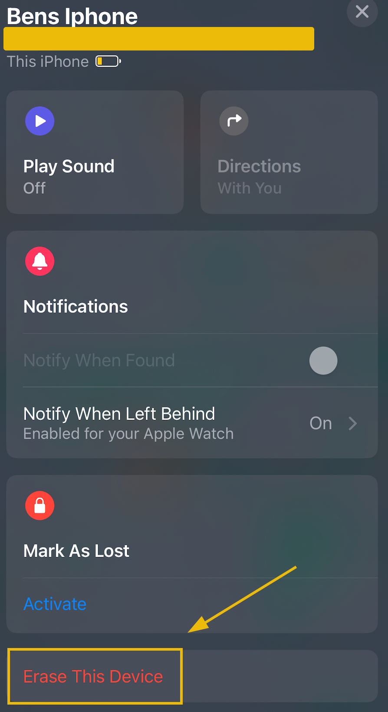

At the lock screen, iOS data is fully encrypted; if presented with an unlocked device, disable **Auto-Lock** immediately to preserve access.

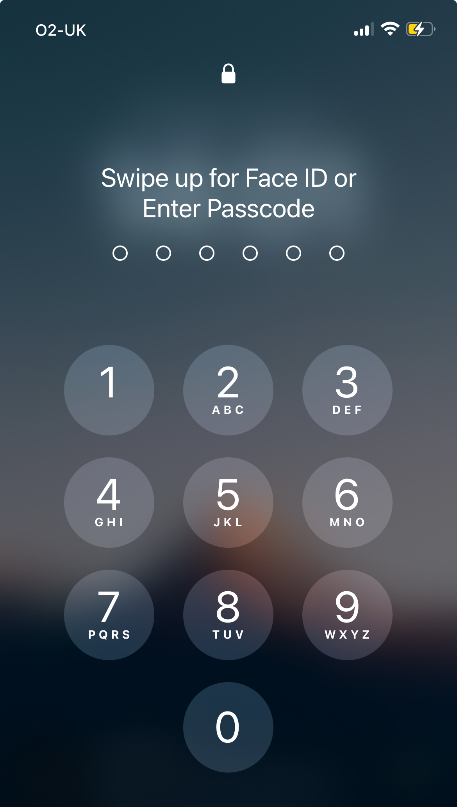

**Backup types:**
- **Encrypted** — full device backup including keychain, health data, passwords, photos, apps
- **Unencrypted** — photos, apps, music only (no credentials)

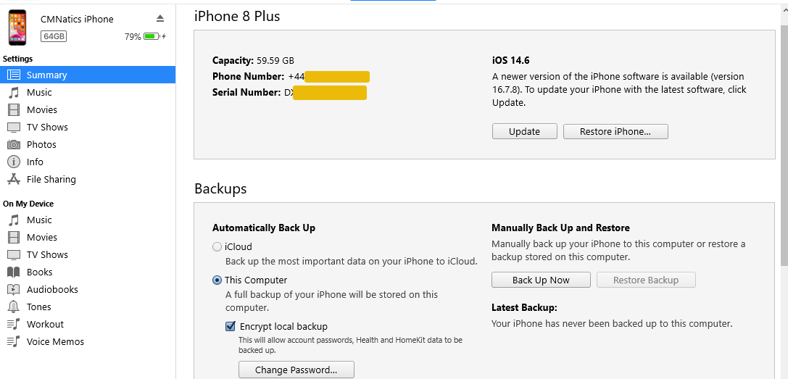

Backups can also be created via GUI tools like 3uTools:


💡 Specialist hardware such as Cellebrite's UFED is used by law enforcement for court-admissible extraction. **Faraday bags** isolate the device from all wireless signals during preservation, preventing both remote wipe and evidence tampering.

**Q: What is the name of the Apple feature that allows a device to be remotely wiped?**
```
Find My
```

**Q: What "type" of backup would we perform if we wanted to backup the entire device?**
```
Encrypted
```

**Q: What is the name of an important piece of equipment that can block all signals, preventing the device from being remotely wiped?**
```
Faraday Bag
```

## Task 4 — The iOS Filesystem

- **HFS+** (legacy, pre-iOS 10.3): unencrypted by default, no integrity checksums
- **APFS** (all devices since March 2017): full-disk encryption, GPT partitioning, checksummed integrity, crash-resilient metadata

**APFS Domains:**

| Domain | Description |
|---|---|
| Data | App data, settings, user files |
| Cache | Temporary/cached files (e.g. browser cache) |
| System | Core OS files — normally read-only |
| Shared | Data shared across apps from the same developer |

**Key Directories:**

| Directory | Context | Description |
|---|---|---|
| `/System/Library/` | System | Fonts, frameworks, UI components |
| `/tmp/` | System | In-progress downloads, logs, crash dumps |
| `/System/Applications/` | System | Pre-installed system app data |
| `/Containers/Data/Application/` | User | Sandboxed App Store app data |
| `/Media/` | User | Camera roll, audio, eBooks |
| `/Library/` | User | Address Book, Calendar, SMS, Safari data |
| `/Documents/` | User | User/app-created files (PDFs, downloads) |

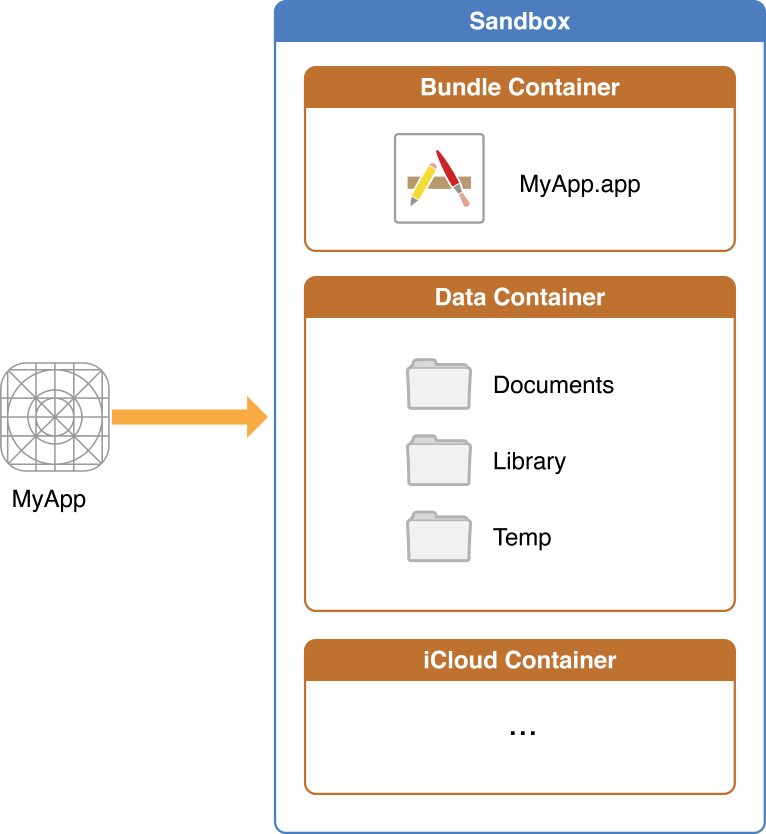

🔴 App sandboxing isolates each app into its own container — cross-app data access requires explicit, user-approved mechanisms (URL schemes, clipboard). This limits lateral data exposure between compromised/malicious apps and the rest of the device.

**File formats:** mostly Plists (XML or binary) and SQLite databases.

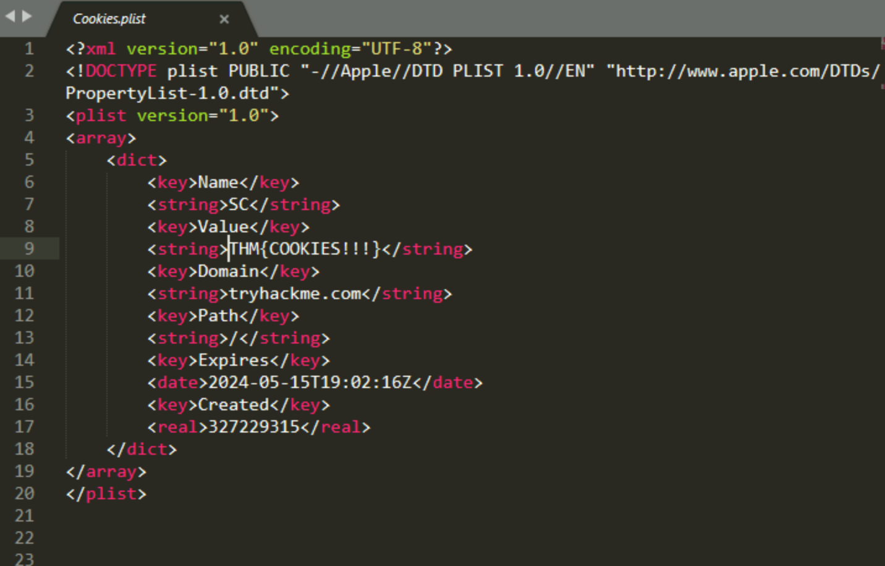

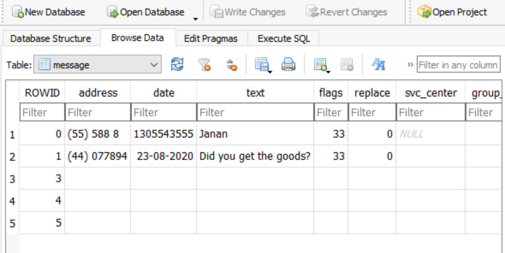

**Q: After March 2017, what filesystem do all iPhones use?**
```
APFS
```

**Q: What is the name of the "domain" that stores all files relating to the operating system?**
```
System
```

## Task 5 — Artefacts

| Artefact | Location (in backup) |
|---|---|
| Contacts | `/HomeDomain/Library/AddressBook` |
| Photos/Camera Roll | `/CameraRollDomain/Media/DCIM` |
| Calendar | `/HomeDomain/Library/Calendar` |
| Wi-Fi networks | `/SystemPreferencesDomain` (`com.apple.wifi.known-networks.plist`) |
| Safari history/bookmarks | `/HomeDomain/Library/Safari` |

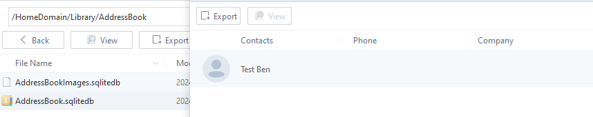

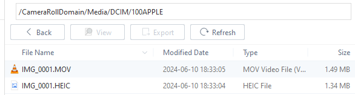

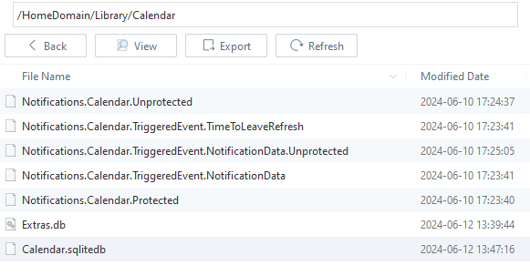

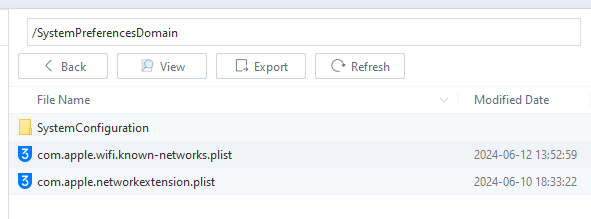

💡 SSIDs in the Wi-Fi known-networks plist are stored in plaintext even though the password is encrypted — useful for placing a device on a specific network at a specific time (`AddedAt` timestamp).

```
cat com.apple.wifi.known-networks.plist
<key>wifi.network.ssid.TryHackMe Wifi</key>
<key>SSID</key> <data>VHJ5SGFja01lIFdpZmk=</data>
<key>AddedAt</key> <date>2024-06-12T12:38:05Z</date>
```

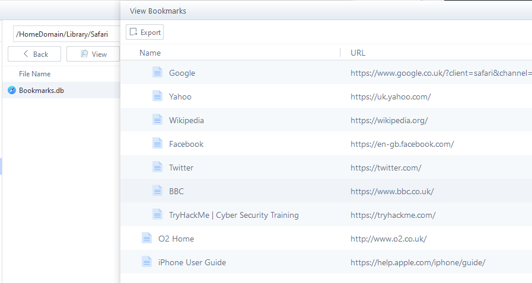

**Key system directories:**

| Directory | Contents |
|---|---|
| `/var/mobile` | User docs, app storage, cache, downloads/media |
| `/var/keychains` | Saved credentials, TLS certs, encryption keys/OAuth tokens |
| `/var/logs` | System, application, debugging, and update logs |
| `/var/db` | SQLite system/app databases and media metadata |

**Q: In what directory of a backup is the Address Book (contacts) stored?**
```
/HomeDomain/Library/AddressBook
```

**Q: In what directory of the iPhone are passwords and certificates stored? This is known as the Keychain.**
```
/var/keychains
```

## Task 6 — Analysis

**libimobiledevice** — cross-platform CLI toolkit for interacting with iOS devices.


```
ideviceinfo

ActivationState: Activated
DeviceClass: iPhone
ProductName: iPhone OS
ProductType: iPhone10,5
ProductVersion: 14.6
```

Full backup: enable encryption first (`idevicebackup2 -i encryption on`), then:
```
idevicebackup2 backup --full ./backup
```

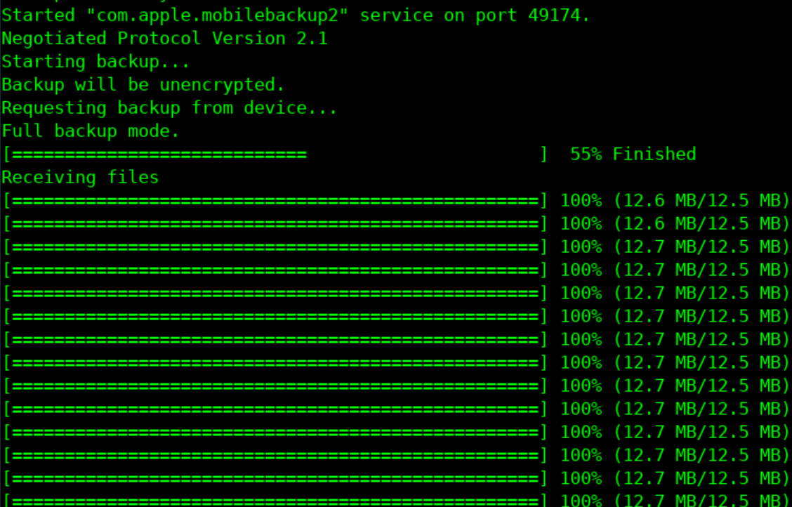

💡 Backups produced this way are non-readable without further tooling (e.g. `ideviceunback`).

**3uTools** — GUI alternative for pairing, backup, and file exploration.

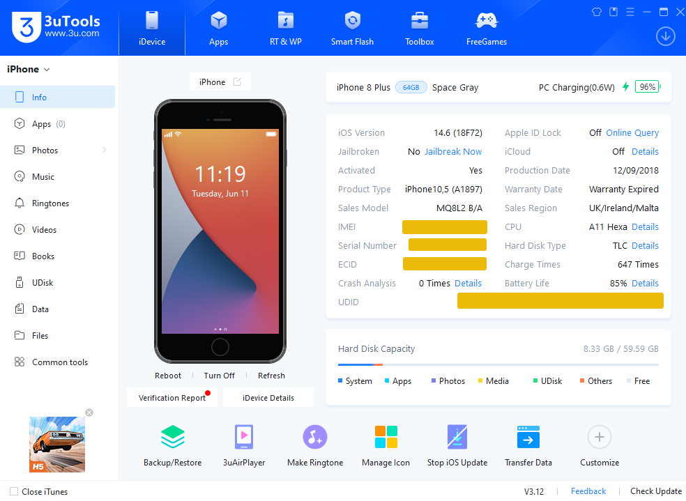

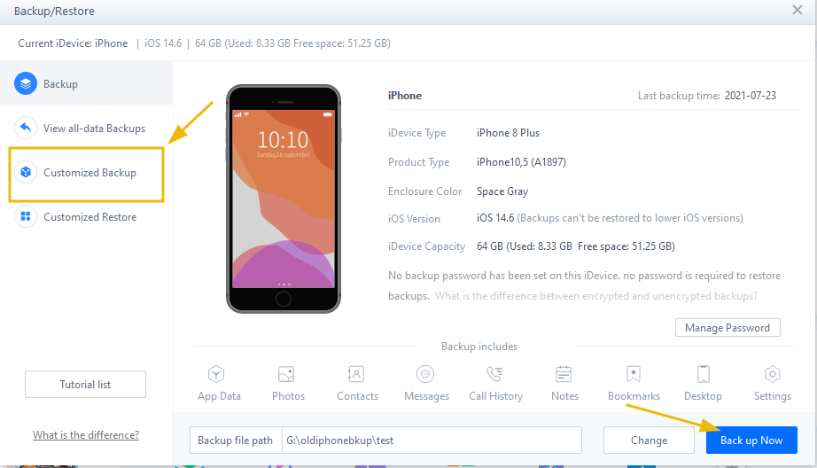

Once complete, backups can be browsed in **Easy Mode** (quick overview) or **Pro Mode** (detailed artefact view).

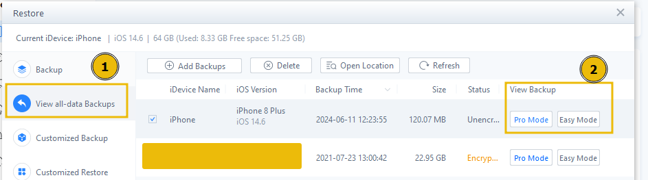

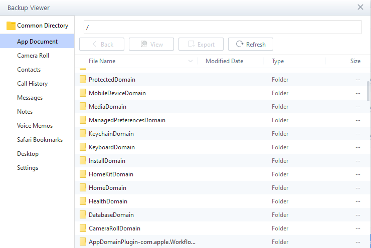

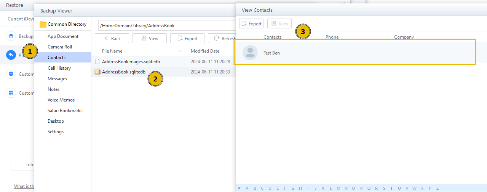

Manual analysis of an extracted backup is also possible with generic text editors and SQLite viewers.

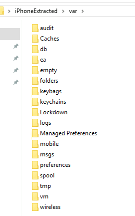

**Q: What is the name of the cross-platform toolkit that can interact with iOS devices? This is a CLI tool.**
```
libimobiledevice
```

**Q: If we wanted to do a full iPhone backup using the aforementioned tool, with the directory being "backup", what would our command look like?**
```
idevicebackup2 backup --full ./backup
```

## Task 7 — Practical: Operation Timely Manner

**Scenario:** Timely Incorporated suspects an insider (Janet) is leaking corporate secrets to competitor OneMinute. Janet's work-issued iPhone backup (passcode known/provided) is analysed to find evidence of contact and meetings with the competitor.

**Q: What is the name (SSID) of the Wi-Fi network the iPhone connected to?**
```
OneMinuteStaff
```
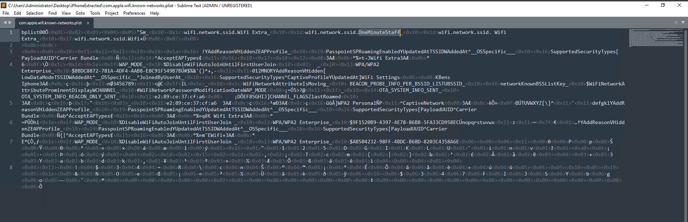

**Q: What are the saved contact details for the competitor?**
```
Wayne,Garcey
```
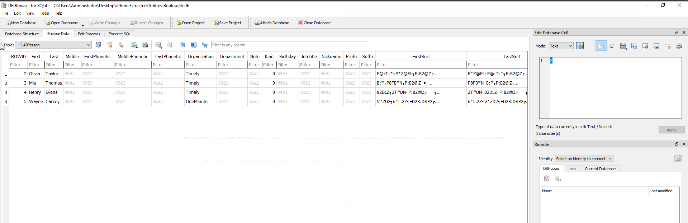

**Q: On what day was the exchange of information to take place?**
```
30/03/2024
```
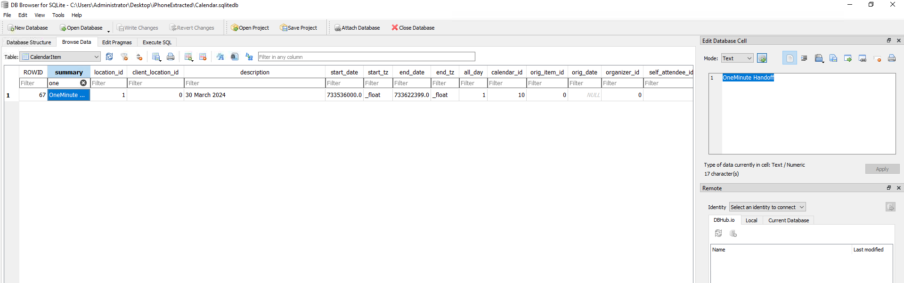

🔴 This confirms the insider-threat hypothesis: Wi-Fi association places the device on the competitor's network, a saved contact ties Janet directly to a named individual at OneMinute, and a dated artefact establishes a planned exchange — a classic triad of network, identity, and timeline evidence in an insider-threat case.

## Key Takeaways

- iOS Restricted Mode + trust certificates gate data I/O over USB; certificates expire after 30 days
- Locked-state protections and data protection classes (`NSFileProtectionNone` → `Complete`) determine what's recoverable without unlocking the device
- Encrypted backups are the only backup type that captures keychain/credential data — critical for full-scope investigations
- APFS domain separation (Data/Cache/System/Shared) plus app sandboxing (containers) limits cross-app data exposure
- Most forensically relevant data lives in SQLite databases and Plists across `/var/db`, `/var/keychains`, `/var/mobile`, and domain-specific paths
- `libimobiledevice` (CLI) and 3uTools (GUI) are both viable acquisition/analysis paths; manual backup review with text editors/SQLite viewers is always an option
- Wi-Fi SSID history, contacts, and dated artefacts together can corroborate an insider-threat timeline

---
*Write-up by [OPT4RUN](https://tryhackme.com/p/OPT4RUN)*