# macOS Forensics: Applications

| Field | Details |
|-------|---------|
| **Platform** | TryHackMe |
| **Path** | Advanced Endpoint Investigations |
| **Module** | macOS Forensics |
| **Difficulty** | Hard |
| **Category** | Digital Forensics |
| **Room Link** | [macOS Forensics: Applications](https://tryhackme.com/room/macosforensicsapplications) |
| **Author** | [OPT4RUN](https://tryhackme.com/p/OPT4RUN) |

---

## Overview

This room extends macOS forensic analysis into the application layer — covering how apps are packaged, installed, and configured to persist across reboots, as well as the artefacts left behind by user-facing applications such as Mail, Calendar, Messages, Notes, Safari, Photos, and Apple Pay.

From a SOC/blue team perspective, this is high-value territory. Application-layer artefacts can reveal:
- **Persistence mechanisms** via LaunchAgents and LaunchDaemons (macOS equivalents of Windows autorun keys and Services)
- **User activity reconstruction** through messaging, call history, browser history, and productivity app data
- **Lateral movement or data exfiltration indicators** through email attachments, file access history, and wallet/payment data
- **Installed tooling** through installation history and saved application states

The analysis is performed against a macOS disk image (`mac-disk.img`) mounted on a Linux VM using `apfs-fuse`, consistent with the previous rooms in this module.

---

## Task 1 — Introduction

This task sets up the lab environment. The attached VM is a Linux machine containing a macOS disk image (`mac-disk.img`) in the home directory, mounted using `apfs-fuse` for offline analysis. The room builds directly on techniques from:
- [macOS Forensics: The Basics](https://tryhackme.com/jr/macosforensicsbasics)
- [macOS Forensics: Artefacts](https://tryhackme.com/jr/macosforensicsartefacts)

No questions in this task.

---

## Task 2 — Common Application Information

### Package Containers

macOS applications reside in `/Applications` as `.app` bundles — directories masquerading as files. Each bundle contains a `Contents/` directory with the following key components:

| Component | Description |
|-----------|-------------|
| `Info.plist` | Required configuration file; contains app metadata and bundle settings |
| `MacOS/` | Contains the actual application executable (same name as the bundle, minus `.app`) |
| `Resources/` | Icons, language packs, images — analogous to the `.rsrc` section in PE files |
| `Frameworks/` | Shared libraries/frameworks — analogous to DLLs in Windows |
| `Plugins/` | Browser extensions or other plugin components |
| `SharedSupport/` | Non-essential resources (templates, clip art, etc.) |

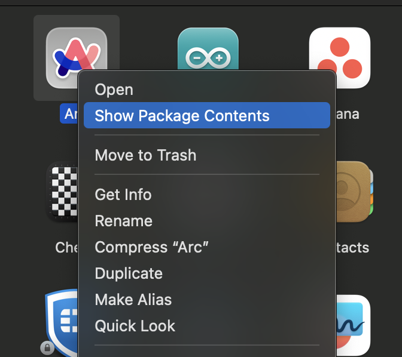

### Application Install History

Three key artefact locations for installation history:

**1. `/Library/Receipts/InstallHistory.plist`**
Records every installation event with: date, display name, version, package identifier, and the process that performed the install.

| `processName` Value | Meaning |
|---|---|
| `macOS installer` | System/OS installer |
| `softwareupdated` | System or security update |
| `storedownloadd` / `appstoreagent` | Installed via App Store |
| `installer` | Installed via external installer package |

**2. `/private/var/db/receipts/<app-name>.plist`**
Per-application receipt file containing install date, package version, install prefix path, and install process name. A companion `<app-name>.bom` file in the same directory can be parsed with `lsbom` for granular install details.

**3. `/private/var/log/install.log`**
Searchable with `grep Installed` to extract install timestamps and version info chronologically.

💡 Cross-referencing all three sources provides a complete picture of the installation timeline and method.

---

**Q: When was Microsoft 365 and Office installed on the disk image in the attached VM? Format in GMT YYYY-MM-DD hh:mm:ss**
```
2025-04-26 06:41:43
```

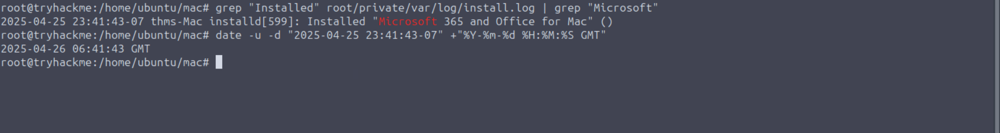

**Q: What is the name of the package used to install Microsoft Word?**
```
Microsoft_Word_Internal.pkg
```

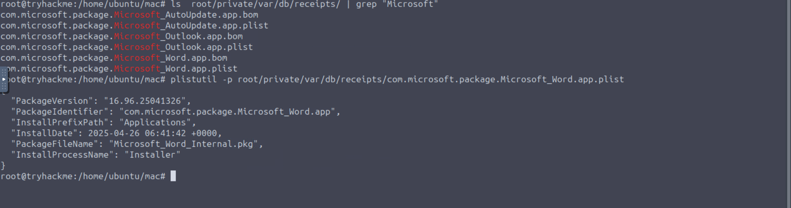

---

## Task 3 — Autostart Items

### LaunchAgents and LaunchDaemons

macOS persistence via autostart is implemented through **LaunchAgents** and **LaunchDaemons** — plist files that instruct `launchd` to start processes at login or boot.

| Type | Scope | Privilege Level | Trigger |
|------|-------|-----------------|---------|
| LaunchAgent | User-specific | User | Login |
| LaunchDaemon | System-wide | Root/elevated | Boot |

Key plist directories:

| Location | Type |
|---|---|
| `~/Library/LaunchAgents/` | User LaunchAgents |
| `/Library/LaunchAgents/` | System-wide LaunchAgents |
| `/Library/LaunchDaemons/` | System-wide LaunchDaemons |
| `/System/Library/LaunchAgents/` | Apple-provided LaunchAgents |
| `/System/Library/LaunchDaemons/` | Apple-provided LaunchDaemons |

Key plist fields to examine during forensic review:

| Field | Significance |
|---|---|
| `ProgramArguments` | Executable path and launch arguments — primary IOC field |
| `RunAtLoad` | `1` = executes at login/boot automatically |
| `ProcessType` | `Interactive` = has a GUI |
| `StartInterval` | Periodic execution interval in seconds |
| `UserName` / `GroupName` | Privilege context for daemons |

🔴 **Malware relevance:** LaunchAgents and LaunchDaemons are the primary persistence mechanism on macOS. Malware commonly drops a plist into `~/Library/LaunchAgents/` pointing to a malicious binary. Any `RunAtLoad = 1` entry with an unexpected `ProgramArguments` path is a high-priority IOC.

macOS also supports cron jobs (inherited from Unix), but persistence via LaunchAgents/LaunchDaemons is far more common in both legitimate software and malware.

### Saved Application State

When a user reboots and selects "Reopen windows when logging back in," macOS saves the application state. These saved states are evidence of prior application use.

| App Type | Location |
|---|---|
| Legacy (non-sandboxed) | `~/Library/Saved Application State/<app>.savedState` |
| Sandboxed | `~/Library/Containers/<app>/Data/Library/Application Support/<app>/Saved Application State/<app>.savedState` |

---

**Q: What arguments does the Microsoft update agent launch with? Format "Argument 1", "Argument 2"**
```
"/Library/Application Support/Microsoft/MAU2.0/Microsoft AutoUpdate.app/Contents/MacOS/Microsoft Update Assistant.app/Contents/MacOS/Microsoft Update Assistant", "--launchByAgent"
```

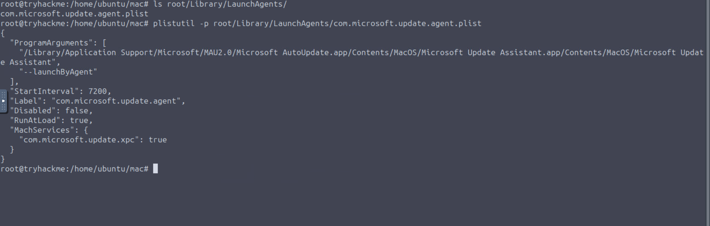

---

## Task 4 — Notifications and Permissions

### Notifications

Application notification history is stored in a SQLite database at:

```
/Users/<user>/Library/Group Containers/group.com.apple.usernoted/db2/db
```

Attachments associated with notifications are in the `attachments/` subdirectory. The database can be browsed with DB Browser (configure it to show all files, not just `.sqlite` files). Use the query from [APOLLO's](https://github.com/mac4n6/APOLLO) `notification_db` module to extract records.

💡 The `data` and `category` fields are stored in hex and must be converted to ASCII (e.g., via CyberChef) and saved as a plist file for human-readable parsing.

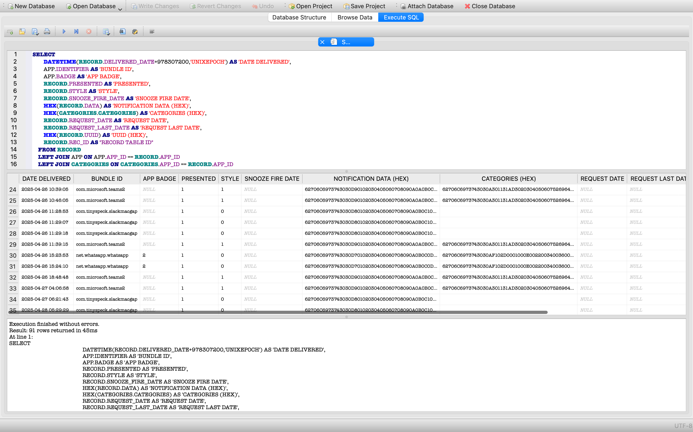

### Permissions (TCC Database)

macOS Transparency, Consent, and Control (TCC) governs application permissions. TCC databases are located at:

```
/Library/Application Support/com.apple.TCC/TCC.db        ← system-wide
~/Library/Application Support/com.apple.TCC/TCC.db       ← per-user
```

Parse using DB Browser with the query from APOLLO's `tcc_db` module.

Key fields:

| Field | Description |
|---|---|
| `SERVICE` | Permission type (e.g., `kTCCServiceSystemPolicyAllFiles` = Full Disk Access) |
| `AUTH_REASON` | `2` = User Consent, `4` = System Set |

🔴 **Malware relevance:** Full Disk Access (`kTCCServiceSystemPolicyAllFiles`) is a high-privilege grant. Any unexpected application holding this permission warrants investigation — it's a common target for privilege escalation and data exfiltration tooling.

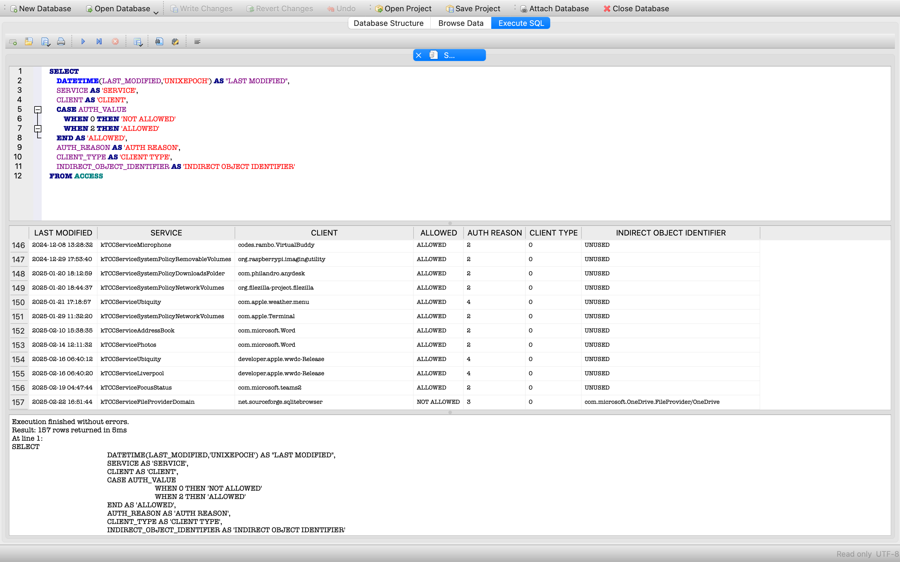

---

**Q: Which application has Full Disk Access permissions?**
```
com.apple.Terminal
```

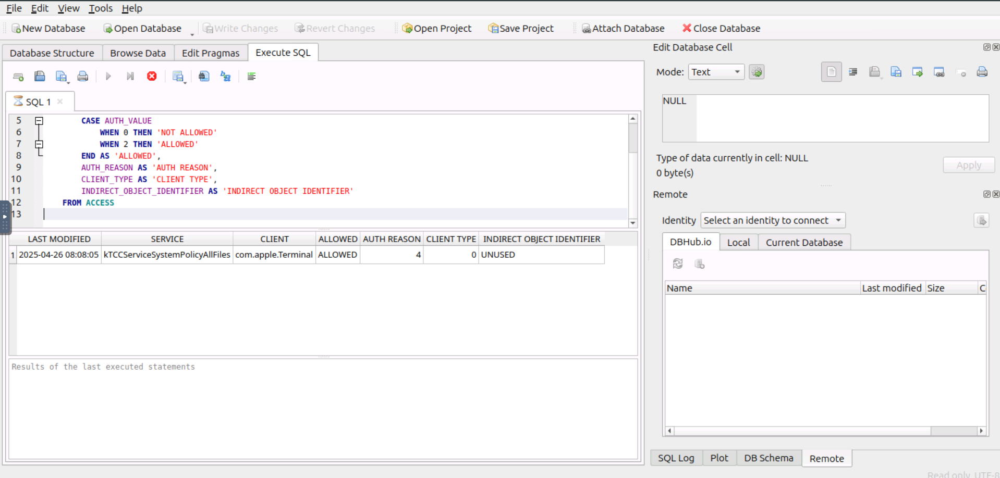

---

## Task 5 — Contacts, Calls and Messages

### Contacts & Interaction History

Raw contact data is scattered across `~/Library/Application Support/AddressBook/`. A more forensically useful source is the interaction database:

```
/private/var/db/CoreDuet/People/interactionC.db
```

This database records interactions with contacts across Mail, Messages, and Phone. Use APOLLO's `interaction_contact_interactions` module for queries.

💡 If iCloud sync is enabled, this database includes interactions from all devices sharing the same iCloud account — iPhone calls and messages may appear here.

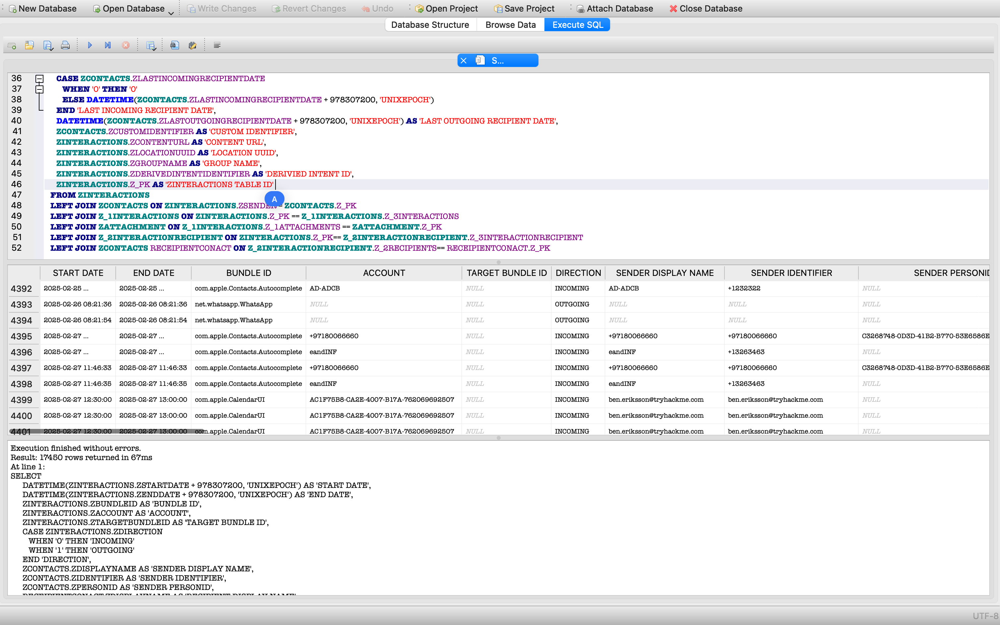

### Call History

```
~/Library/Application Support/CallHistoryDB/CallHistory.storedata
```

Contains records for both phone calls and FaceTime calls. iCloud-synced call records from other devices (e.g., iPhone) are also stored here. Use APOLLO's `call_history` module for queries.

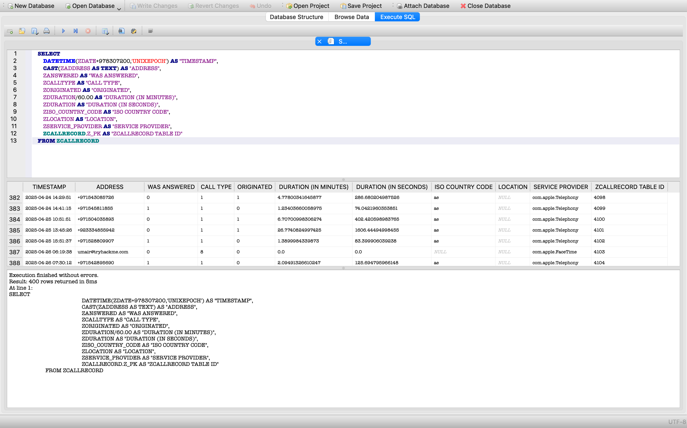

### Messages (iMessage & SMS)

```
~/Library/Messages/chat.db                  ← message database
~/Library/Messages/Attachments/             ← message attachments
```

Contains both iMessage and SMS records, including iCloud-synced messages from other devices. Use APOLLO's `sms_chat` module for queries.

🔴 **Malware relevance:** Message and call history databases can surface C2 communications, social engineering attempts, or evidence of data exfiltration via messaging channels — especially relevant in targeted attacks against executives or privileged users.

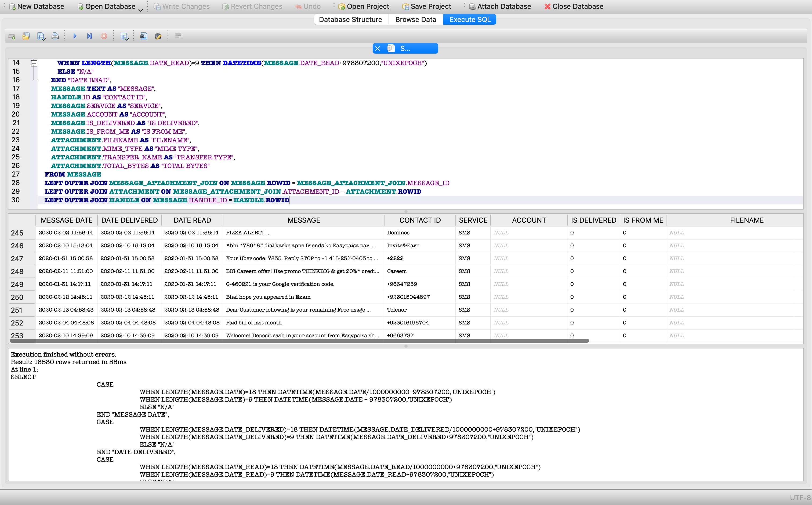

---

**Q: What is the email address of the user using this machine?**
```
thmguy535@gmail.com
```

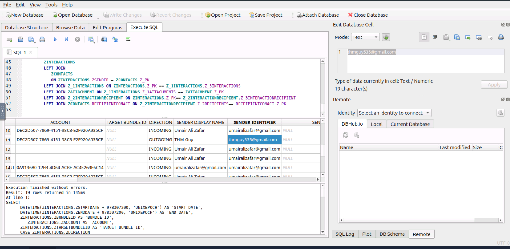

**Q: A call was made using FaceTime on 2025-04-26 05:40:04. Was this call answered? Y/N**
```
N
```

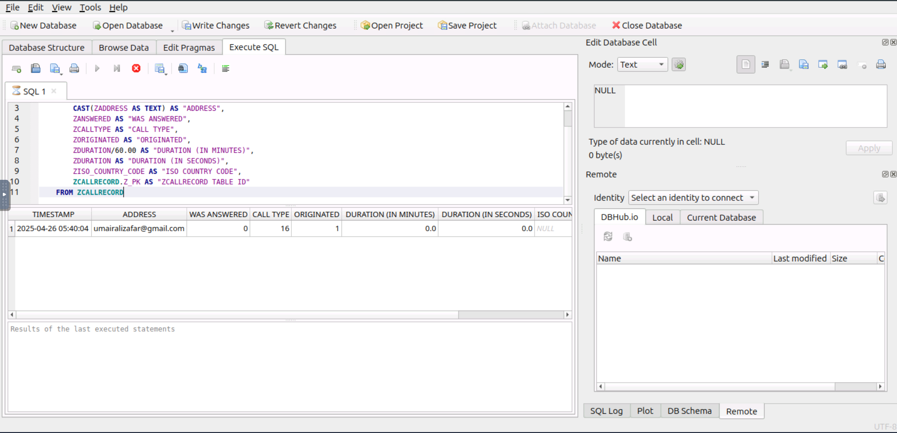

**Q: The user received a message on 2025-04-26 05:38:20. This message contained an image as an attachment. What animal is present in that image?**
```
Dog
```

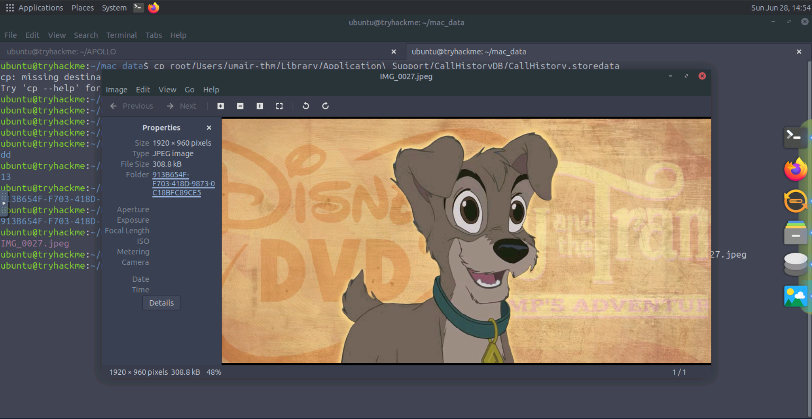

**Q: On what date and time was the previous message read? Format YYYY-MM-DD hh:mm:ss**
```
2025-04-26 05:38:23
```

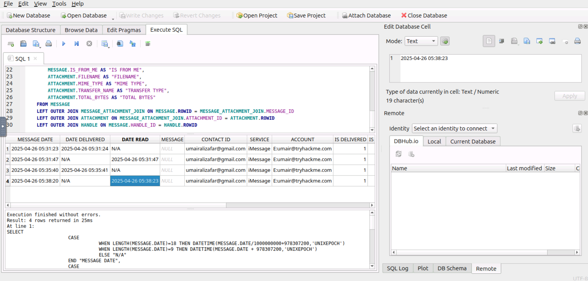

---

## Task 6 — Productivity Apps

### Mail

Mail app data is stored at:

```
~/Library/Mail/V#/<UUID>/*.mbox/
```

Each `.mbox` directory contains an `Info.plist` with mailbox metadata, and a UUID-named subdirectory with a `Data/` folder containing:

| Directory | Contents |
|---|---|
| `Messages/` | Email files in `.emlx` format |
| `Attachments/` | Attachments organised by email ID; meeting invites also land here |

💡 If email `16.emlx` exists in `Messages/`, its attachments will be in a directory named `16/` inside `Attachments/`.

### Calendar

```
~/Library/Group Containers/group.com.apple.calendar/Calendar.sqlitedb
```

Browse with DB Browser; the `CalendarItem` table contains start/end dates, modification timestamps, event summaries, and meeting links. Timestamps are in **Mac Epoch** format.

```
Unix Epoch = Mac Epoch + 978307200
```

Use [epochconverter.com](https://www.epochconverter.com/) to convert to human-readable time.

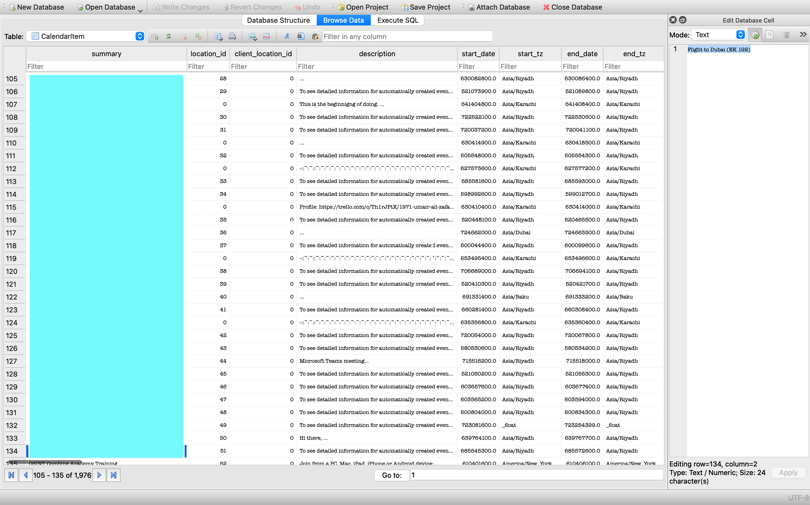

### Notes

```
~/Library/Group Containers/group.com.apple.notes/NoteStore.sqlite
```

Best parsed using `mac_apt`'s NOTES module against the disk image:

```bash
python3 mac_apt.py -o <output_path> -c DD <path_to_disk_image> NOTES
```

This produces a CSV with note content and metadata. Attachments are in:

```
~/Library/Group Containers/group.com.apple.notes/Accounts/<UUID>/Media/<AttachmentID>/
```

Thumbnails are in the `Previews/` directory at the same level.

### Reminders

```
~/Library/Group Containers/group.com.apple.reminders/Container_v1/Stores/
```

Multiple databases, one per source. Key table: `ZREMCDREMINDER` — contains title, creation date, display date, modified date, and completion status. Timestamps use the same Mac Epoch format as Calendar.

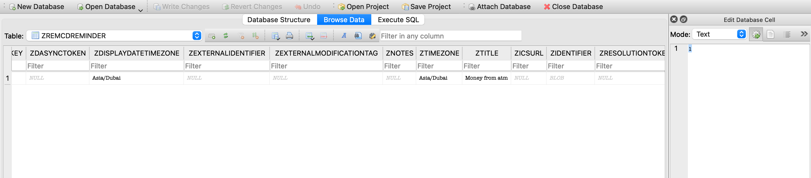

### Microsoft Office Applications

Office app data lives under `~/Library/Containers/com.microsoft.<app>/Data/`.

Key forensic files in `~/Library/Containers/com.microsoft.<app>/Data/Library/Preferences/`:

| File | Contents |
|---|---|
| `com.microsoft.Word.plist` | General Word settings |
| `com.microsoft.Word.securebookmarks.plist` | Most recently used documents with timestamps |
| `com.microsoft.Outlook.Hx.plist` | Outlook network/account configuration |
| `com.microsoft.Outlook.plist` | General Outlook application settings |

🔴 **Malware relevance:** Recently opened document paths in `securebookmarks.plist` can confirm access to sensitive files or reveal the initial access vector (e.g., a malicious `.docx` delivered via phishing).

---

**Q: The user received a calendar invite in the mail from someone. What date is the calendar invite for? Format YYYY-MM-DD hh:mm:ss**
```
2025-04-27 11:00:00
```

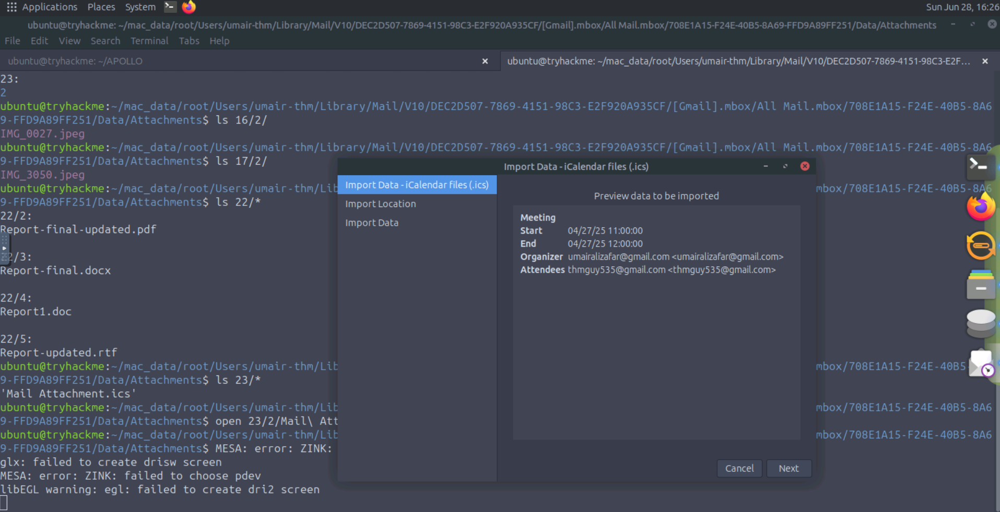

**Q: What was the timezone of the sender of the email invite? Format: GMT+XX:XX**
```
GMT+03:00
```

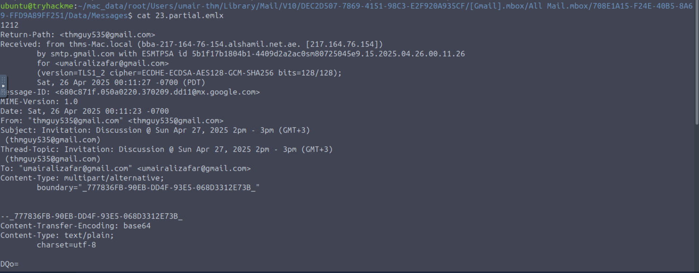

**Q: The user's calendar has another entry named "Jungle cruise". When is this event going to start? Format in GMT YYYY-MM-DD hh:mm:ss**
```
2025-04-25 16:00:00
```

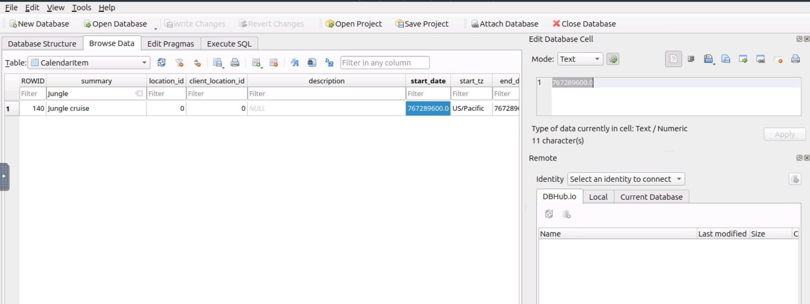

**Q: The user saved two notes. Both have the same title. What is the title?**
```
Aquickbrownfoxjumpedoverthelazydog
```

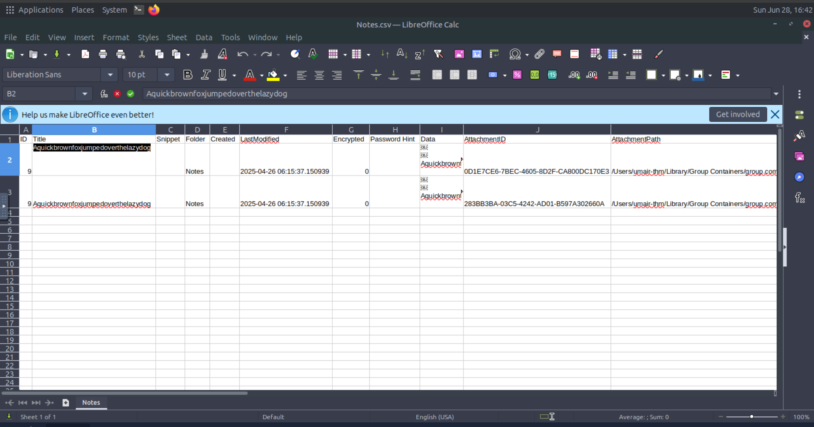

**Q: One of the notes has an attachment we already viewed while analysing iMessage. What animal is present in the other attachment?**
```
Giraffe
```

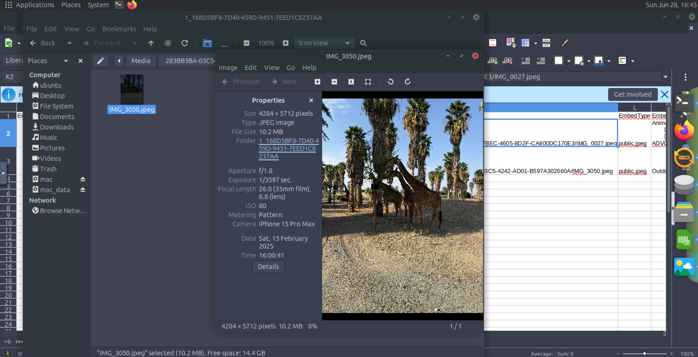

**Q: The user has saved a reminder that has not been completed yet. What is the due date of this reminder? Format in GMT YYYY-MM-DD hh:mm:ss**
```
2025-04-26 21:00:00
```

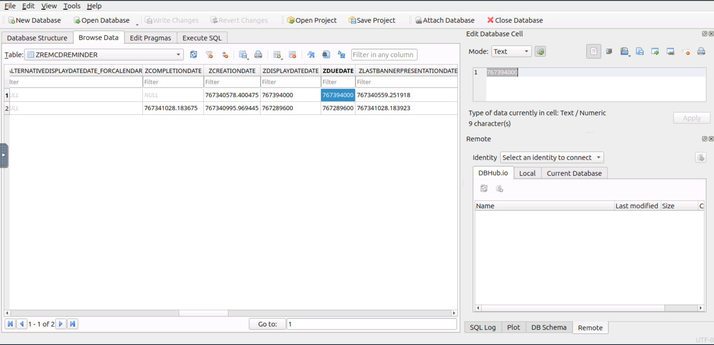

**Q: What is the complete path of the last file opened using Microsoft Word?**
```
/Users/umair-thm/Downloads/Report-final-updated.pdf
```

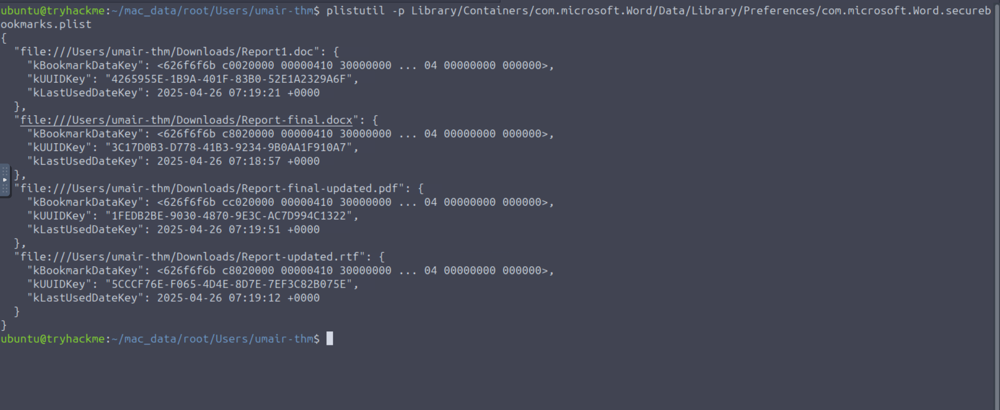

---

## Task 7 — Browsing History, Downloads and Bookmarks

### Safari

Safari artefacts are in `~/Library/Safari/`. Key files:

| File | Contents |
|---|---|
| `History.db` | Full browsing history (use APOLLO's `safari_history` module) |
| `Downloads.plist` | Files downloaded via Safari |
| `Bookmarks.plist` | Saved bookmarks |
| `UserNotificationPermissions.plist` | Per-site notification preferences |

Additional cache data including session restore (`TabSnapshots`) and browser cache (`WebKitCache`) is in:

```
~/Library/Containers/com.apple.Safari/Data/Library/Caches/
```

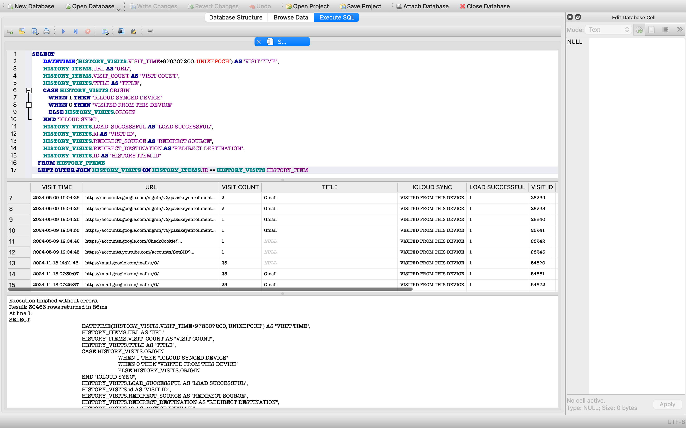

### Other Browsers

Chrome, Brave, Arc, and Firefox follow a similar directory structure. For Chrome:

| Artefact | Location |
|---|---|
| Browsing history | `~/Library/Application Support/Google/Chrome/Default/History` |
| Session restore | `~/Library/Application Support/Google/Chrome/Default/Sessions/` |
| Extensions | `~/Library/Application Support/Google/Chrome/Default/Extensions/` |

💡 The `visited_links` table in the `History` database does not contain visit timestamps — those must be correlated from a separate table using the visit `id` and converted from Mac Epoch time.

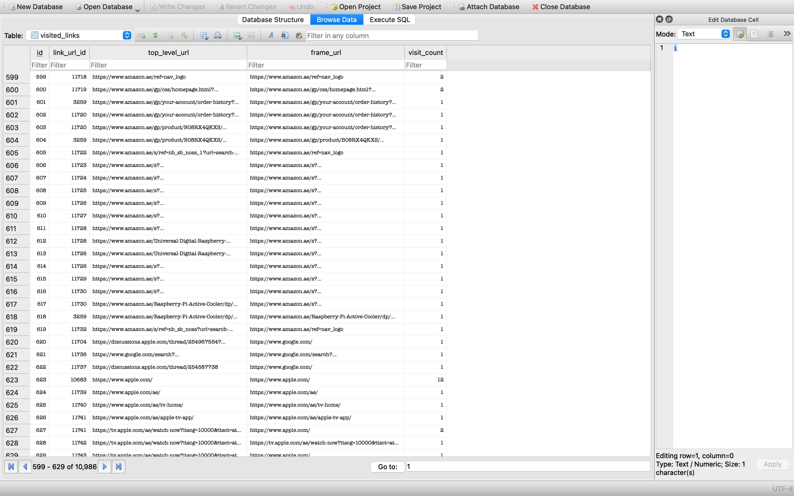

---

**Q: The user seems to be a fan of TryHackMe. What is the URL of the THM room the user visited using Safari?**
```
https://tryhackme.com/room/macosforensicsartefacts
```

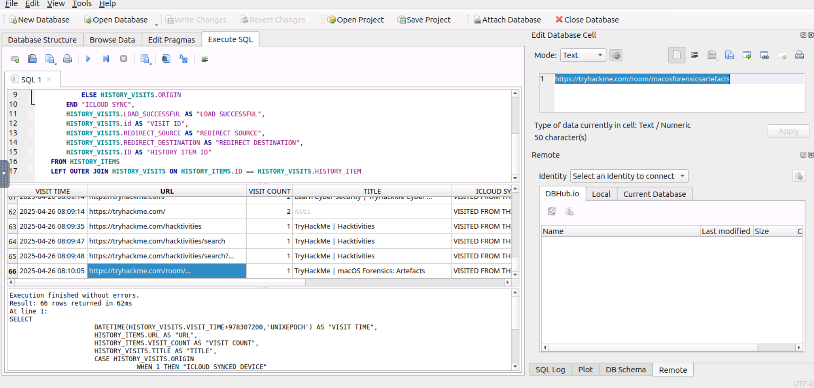

---

## Task 8 — Photos and Apple Pay

### Photos

Photos app data is at `~/Pictures/Photos Library.photoslibrary/`.

| Directory/File | Contents |
|---|---|
| `originals/` | Original images in HEIC or JPG format |
| `database/Photos.sqlite` | Metadata for all images: location, detected persons, capture date, album info |

This library also contains screenshots and files synced from other iCloud-connected devices (iPhone, iPad).

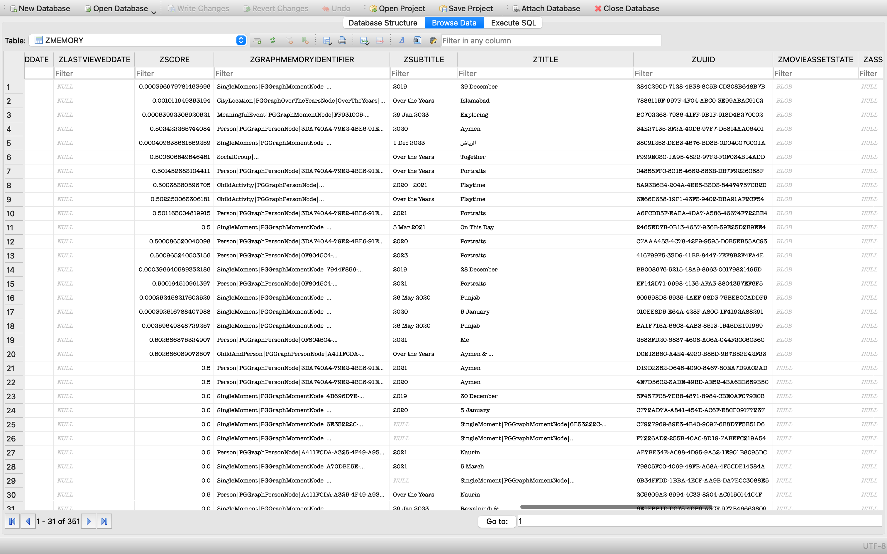

### Wallet and Apple Pay

Pass and card data is at `~/Library/Passes/`.

| Location | Contents |
|---|---|
| `~/Library/Passes/Cards/` | Apple Pay card data; each card is a `*.pkpass` package directory |
| `*.pkpass/pass.json` | Actual card/pass data in JSON format |
| `~/Library/Passes/passes23.sqlite` | Apple Pay transaction history |

Use APOLLO's `passes23_*` modules for queries against the transaction database.

⚠️ APOLLO's query templates use the legacy field name `PAYMENT_TRANSACTION.PASS_PID`. On newer macOS versions this field has been renamed.

---

**Q: When using APOLLO queries to parse passes, to what should we change the field `PAYMENT_TRANSACTION.PASS_PID` on newer macOS versions?**
```
PAYMENT_TRANSACTION.PID
```

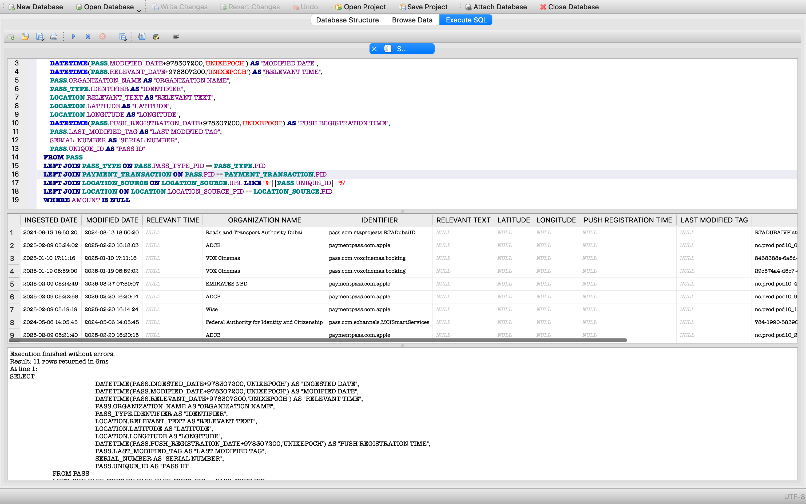

---

## Task 9 — Conclusion

This room completed the application-layer analysis component of macOS forensics, covering:

- App packaging structure and installation history via `InstallHistory.plist`, receipt plists, and `install.log`
- Persistence mechanisms via LaunchAgents and LaunchDaemons, with key fields (`RunAtLoad`, `ProgramArguments`) as primary IOC sources
- Notification history and TCC permission grants (including Full Disk Access)
- Contact interaction, call history (FaceTime + phone), and iMessage/SMS databases — all potentially iCloud-synced across devices
- Productivity app artefacts: Mail (`.emlx`), Calendar (Mac Epoch timestamps), Notes (`mac_apt` NOTES module), Reminders, and Microsoft Office MRU files
- Browser history across Safari and Chromium-based browsers
- Photos metadata and Apple Pay/Wallet pass data

---

## Key Takeaways

- **LaunchAgents/LaunchDaemons are the macOS persistence mechanism** — equivalent to Windows autorun keys and Services. Any `RunAtLoad = 1` entry with an anomalous `ProgramArguments` path is a high-priority IOC.
- **Three installation history sources** — `InstallHistory.plist`, per-app receipt plists in `/private/var/db/receipts/`, and `install.log` — should be cross-referenced for a complete picture of software installed on the system.
- **TCC database** governs application permissions. Full Disk Access (`kTCCServiceSystemPolicyAllFiles`) grants are high-value targets for attackers and warrant scrutiny during investigation.
- **iCloud sync amplifies forensic reach** — call history, messages, and contact interactions may contain records from iPhones and iPads using the same Apple ID, not just the Mac being examined.
- **Mac Epoch time** (`Unix Epoch = Mac Epoch + 978307200`) is used across Calendar, Reminders, and browser history databases — always convert before interpreting timestamps.
- **`interactionC.db`** at `/private/var/db/CoreDuet/People/` is a single, powerful source for reconstructing cross-app contact interactions (Mail, Messages, Phone) without needing to parse each app's database individually.
- **Microsoft Office `securebookmarks.plist`** reveals recently accessed document paths with timestamps — useful for confirming file access or identifying a phishing-delivered document as the initial access vector.
- **APOLLO query compatibility** — some APOLLO module queries use legacy field names (e.g., `PAYMENT_TRANSACTION.PASS_PID`) that may need updating for newer macOS versions.

---

*Write-up by [OPT4RUN](https://tryhackme.com/p/OPT4RUN)*