# macOS Forensics: Artefacts

| Field | Details |
|-------|---------|
| **Platform** | TryHackMe |
| **Path** | Advanced Endpoint Investigations |
| **Module** | macOS Forensics |
| **Difficulty** | Hard |
| **Category** | Digital Forensics |
| **Room Link** | [macOS Forensics: Artefacts](https://tryhackme.com/room/macosforensicsartefacts) |
| **Author** | [OPT4RUN](https://tryhackme.com/p/OPT4RUN) |

---

## Overview

This room builds directly on the foundations laid in macOS Forensics: The Basics, shifting focus to practical artefact extraction and analysis. It covers the full breadth of forensically relevant data sources on a macOS system — from system metadata and network configuration through to account activity, evidence of execution, file system events, and connected device history.

From a SOC and DFIR perspective, this room is highly practical. macOS endpoints are increasingly common in enterprise environments, and the artefact locations here map directly to investigation workflows: establishing a forensic baseline (system info, time zone, boot times), pivoting through user activity (login history, terminal commands, application usage), and reconstructing attacker behaviour (file system events, mounted volumes, SSH known hosts). The room uses a Linux VM with an APFS disk image, reinforcing cross-platform analysis workflows that are common in real investigations where you won't always have a live Mac to work with.

---

## Task 1 — Introduction

The attached VM is a Linux machine containing a macOS disk image (`mac-disk.img`) in the home directory. The image is mounted using `apfs-fuse`, targeting the Data volume (`-v 4`) which holds user data and most forensically relevant artefacts.

**Q: What command can be used to mount the image named mac-disk.img to the directory ~/mac in the attached VM, making sure the Data volume is mounted?**
```
apfs-fuse -v 4 mac-disk.img ~/mac
```

---

## Task 2 — Before We Begin

Before diving into individual artefacts, this task establishes the tooling required to parse the three dominant data formats encountered in macOS forensics.

**Plist Files**

Property list files are ubiquitous in macOS. XML plists are human-readable and can be viewed with `cat`. Binary (BLOB) plists require a dedicated parser:
- On macOS: `plutil -p <file>.plist`
- On Linux: `plistutil -p <file>.plist` (from the `libplist` package)

**Database Files**

Many artefacts — browsing history, chat logs, application usage — are stored in SQLite databases. **DB Browser for SQLite** provides a GUI for exploring these. The `knowledgeC.db` database (covered in Task 6) is a primary target for application usage queries.

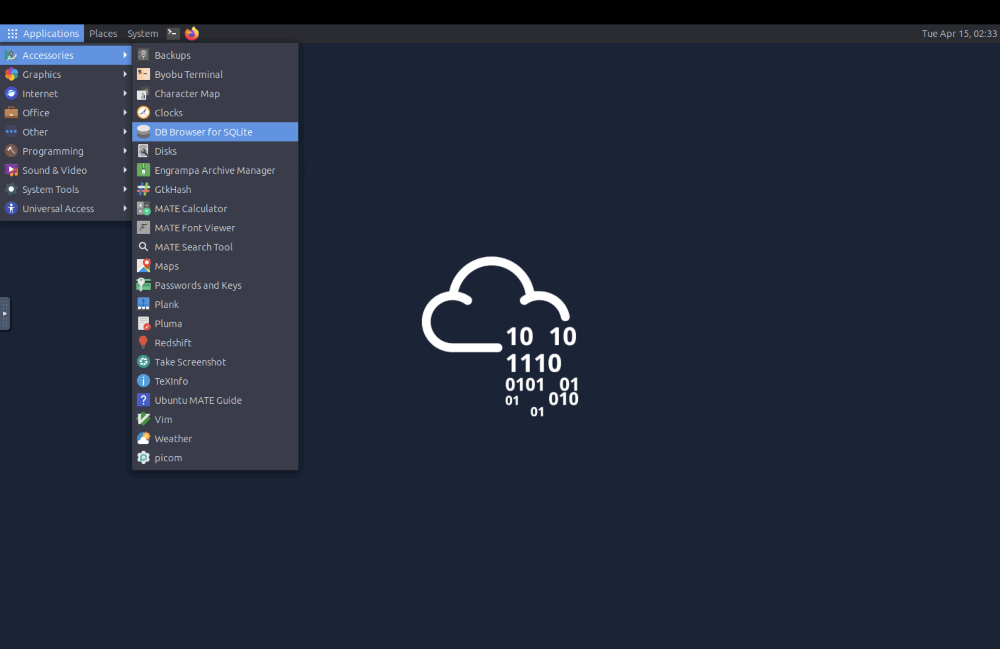

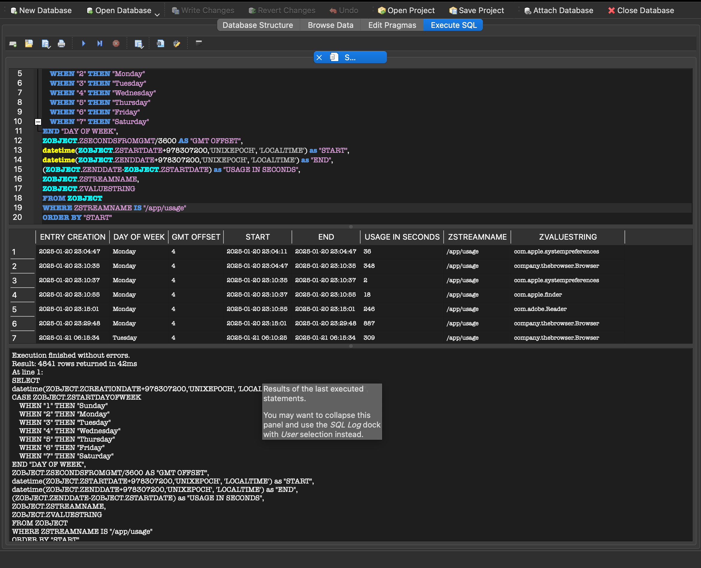

**APOLLO** (by Sarah Edwards) is a Python-based framework that provides pre-built SQL modules for extracting structured data from macOS databases and correlating artefacts into a timeline.

**Logs**

Three log types are relevant:

| Type | Location | Parser |
|------|----------|--------|
| Apple System Logs (ASL) | `/private/var/log/asl/` | `mac_apt` (Linux/Windows), Console app (live macOS) |
| System Logs | `/private/var/log/system.log` | `cat`, `grep`, `zgrep` (for rotated `.gz` files) |
| Unified Logs | `/private/var/db/diagnostics/*.tracev3` + `/private/var/db/uuidtext` | `log` utility (live), `mac_apt`, Mandiant Unified Log Parser |

💡 Unified Logs are the richest source but generate enormous volume. Apple's `--predicate` flag allows filtering by `subsystem`, `category`, and `eventMessage` to narrow results on a live system.

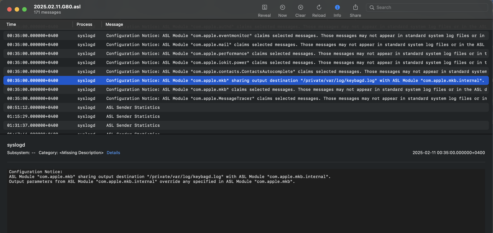

**Q: In the attached VM, which utility can we use to parse plist files?**
```
plistutil
```

---

## Task 3 — System Information

Establishing verified system metadata is the first step of any forensic investigation — confirming you are analysing the correct machine before drawing any conclusions.

**OS Version**

Located at `/System/Library/CoreServices/SystemVersion.plist`. This is an XML plist, readable with `cat`. Requires mounting the **System volume**, not the Data volume.

**Serial Number**

Found in SQLite databases at:
- `/private/var/folders/*/<DARWIN_USER_DIR>/C/locationd/consolidated.db`
- `/private/var/folders/*/<DARWIN_USER_DIR>/C/locationd/cache_encryptedA.db`

Open in DB Browser → Browse Data tab → `TableInfo` table.

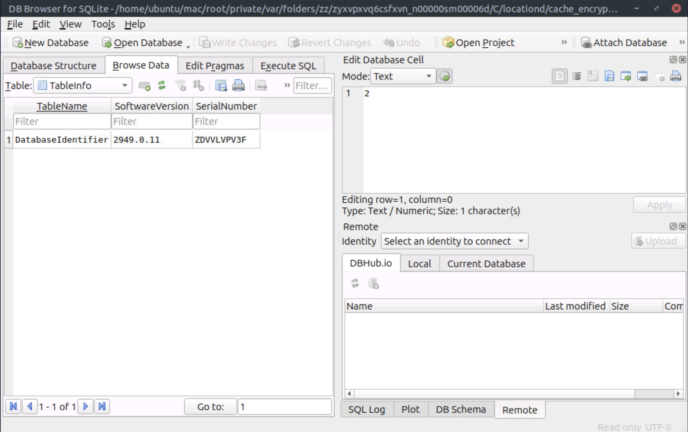

**OS Installation and Update Dates**

Two sources:

1. `stat /private/var/db/.AppleSetupDone` — `Birth` timestamp = OS install date; `Change` timestamp = last update
2. `/private/var/db/softwareupdate/journal.plist` — provides a full history of macOS versions installed with dates

**Time Zone**

- Current time zone: `ls -la /etc/localtime` (symlink target reveals the zone)
- Historical time zones and language settings: `/Library/Preferences/.GlobalPreferences.plist`
- Auto time zone status: `/Library/Preferences/com.apple.timezone.auto.plist`

💡 If location services are active, `.GlobalPreferences.plist` may not reflect the current time zone — check `localtime` first.

**Boot, Reboot, and Shutdown Times**

System logs at `/private/var/log/system.log` (use `zgrep` for rotated logs):
- `zgrep BOOT_TIME system.log*` — last boot
- `zgrep SHUTDOWN_TIME system.log*` — last shutdown

Unified Logs also capture screen lock/unlock and login events — filter by `loginwindow` subsystem in DB Browser.

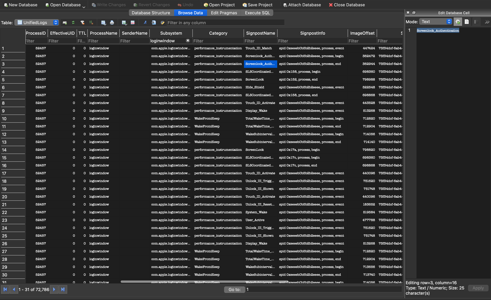

**Q: When was the OS installed on the disk image present in the attached VM? Write your answer in the format: YYYY-MM-DD hh:mm:ss**
```
2024-12-08 17:42:28
```

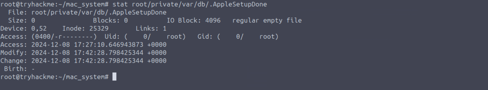

**Q: What is the country code for this machine?**
```
AE
```

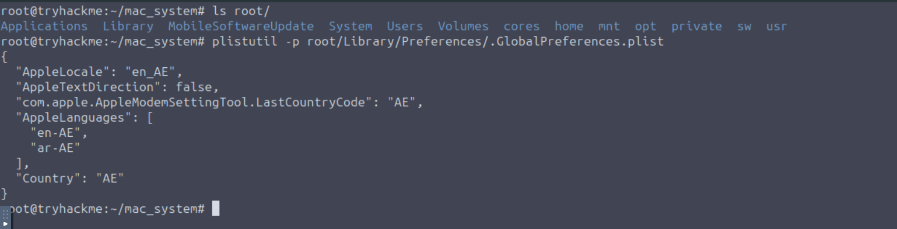

**Q: When was the last time this machine booted up? Write your answer as GMT in the format: YYYY-MM-DD hh:mm:ss**
```
2025-01-19 15:47:05
```

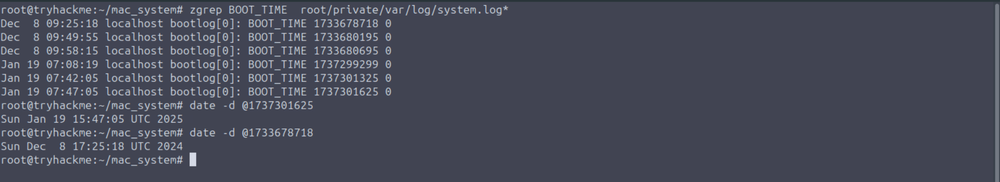

---

## Task 4 — Network Information

Network artefacts help verify machine identity and reconstruct connectivity history, which is valuable when correlating C2 communications or lateral movement.

**Network Interfaces**

`/Library/Preferences/SystemConfiguration/NetworkInterfaces.plist` lists all network interfaces. Each `<dict>` block contains the BSD name (e.g. `en0`), MAC address, interface type (`IEEE80211` for Wi-Fi, `Ethernet` for wired), and user-visible name.

**DHCP Settings**

`/private/var/db/dhcpclient/leases/en0.plist` (replace `en0` with the target interface name) contains the assigned IP address, lease start date, lease length, router IP, and SSID of the connected network.

**Wireless Connection History**

`/Library/Preferences/com.apple.wifi.known-networks.plist` records every previously joined Wi-Fi network. Each entry includes:
- `AddedAt` / `JoinedByUserAt` — when the network was first joined
- `SupportedSecurityTypes` — network security type
- `CaptiveProfile` — whether a captive portal login occurred and when
- `BSSList` — per-access-point records including BSSID, channel, and GPS coordinates

🔴 For mobile users, cross-referencing `LocationLatitude`/`LocationLongitude` from `BSSList` with timestamps can place a device at a physical location at a specific time — significant for establishing presence during an incident.

**Network Usage (Unified Logs)**

On a live system, filter with:
```
log show --info --predicate 'senderImagePath contains "IPConfiguration" and (eventMessage contains "SSID" or eventMessage contains "Lease" or eventMessage contains "network changed")'
```
On an acquired image, convert Unified Logs to CSV with the Unified Log Parser and search for `IPConfiguration`, `SSID`, or `network changed`.

**Q: What is the name of the machine's built-in network interface?**
```
en0
```

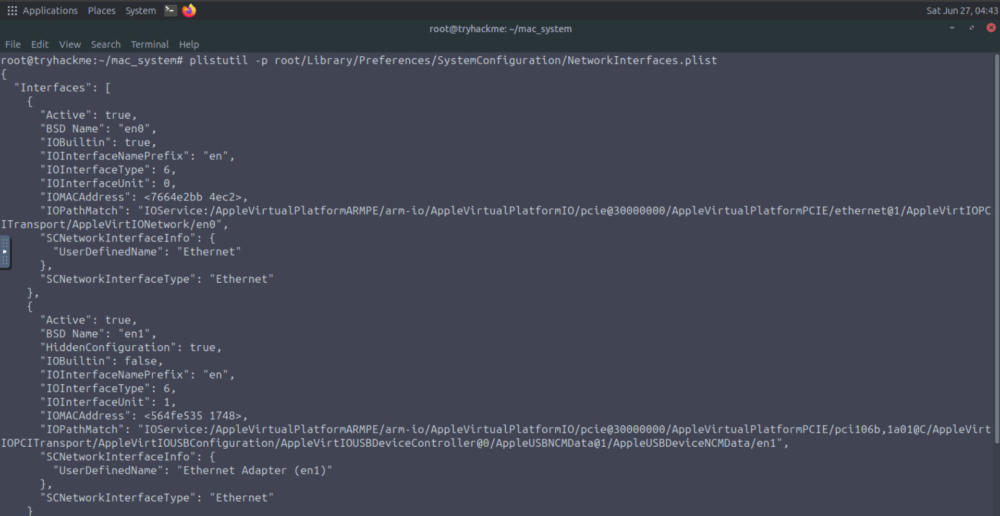

**Q: What is the IP address of the router this machine was last connected to?**
```
192.168.64.1
```

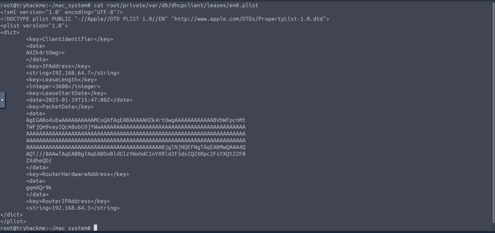

---

## Task 5 — Account Activity

User account artefacts establish who was active on the system and when — foundational for attributing actions to specific users during an investigation.

**User Accounts and Passwords**

`/private/var/db/dslocal/nodes/Default/users/<user>.plist` — one file per user. Contains (in Unix Epoch format):
- `creationTime`
- `passwordLastSetTime`
- `failedLoginTimestamp`
- `failedLoginCount`

Also includes associated iCloud account data and password hints.

**User Login History**

`/Library/Preferences/com.apple.loginwindow.plist` records:
- `lastUserName` — most recently logged-in user
- `RecentUsers` — ordered list of recent users
- `GuestEnabled` — whether guest account is active
- `FirstLogins` — first login per user

**SSH Connections**

`/Users/<user>/.ssh/known_hosts` — same format as Linux. Contains IP addresses and public keys of hosts the user has connected to via SSH. Useful for identifying lateral movement targets or C2 infrastructure.

**Privileged Accounts**

`/etc/sudoers` — identical function to Linux. On macOS, members of the `admin` group can escalate via sudo, subject to macOS SIP restrictions.

**Login and Logout Events**

System logs — `zgrep login system.log*`:
- `USER_PROCESS` = login event
- `DEAD_PROCESS` = logout event

ASL (parsed to CSV via `mac_apt`) provides richer data including username, PID, and terminal line.

**Screen Lock/Unlock**

Search converted Unified Logs CSV for:
- `com.apple.sessionagent.screenIsLocked` — lock events
- `com.apple.sessionagent.screenisUnlocked` — unlock events

**Q: What is the name of the last logged in user?**
```
thm
```

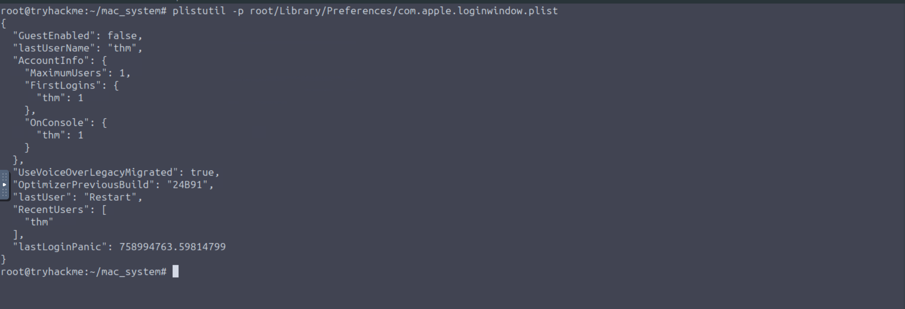

**Q: What is the password hint for the user?**
```
count to 5
```

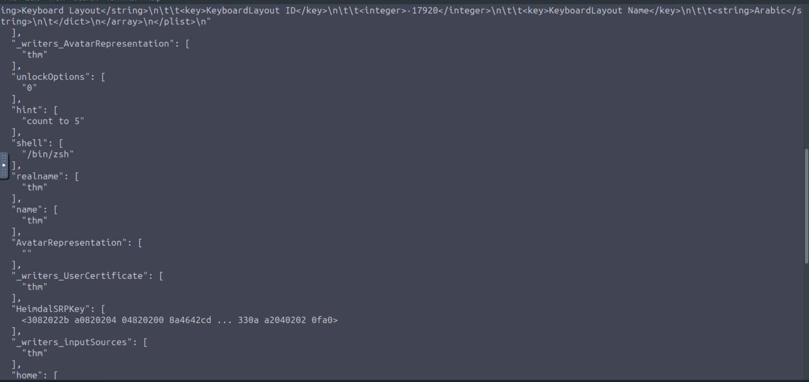

**Q: When was the last time a user logged out of the machine? Format MMM DD hh:mm:ss**
```
Jan 19 07:52:43
```

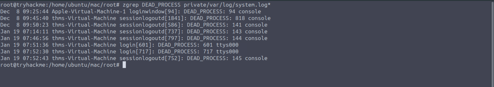

---

## Task 6 — Evidence of Execution

Evidence of execution artefacts are critical for reconstructing what an attacker (or legitimate user) ran on the system — analogous to Prefetch, Shimcache, or Amcache on Windows.

**Terminal History**

Default shell in macOS is Zsh. History files per user:
- `~/.zsh_history` — persistent command history (up to 1000 entries)
- `~/.zsh_sessions/<GUID>.history` — per-session history, keyed by terminal session GUID

💡 On a live system, history for the current open session is not yet flushed to disk — use the `history` command to capture it before logout. Files are written on session termination.

🔴 From a DFIR perspective, `.zsh_history` and session history files are high-value targets. Attackers may attempt to clear these, but partial entries or session files may survive.

**Application Usage — knowledgeC.db**

The `knowledgeC.db` database tracks application start/end times and in-app activity:
- User copy: `/Users/<user>/Library/Application Support/Knowledge/knowledgeC.db`
- System copy: `/private/var/db/CoreDuet/Knowledge/knowledgeC.db` (restricted on live systems)

Use APOLLO's `knowledge_app_usage` module SQL query in DB Browser's Execute SQL tab to extract structured results from the `/app/usage` stream. The query converts Apple Epoch timestamps (seconds since 2001-01-01) and calculates usage duration. The `knowledge_app_intents` module covers the `/app/intents` stream for in-app activity (e.g. messages sent in WhatsApp).

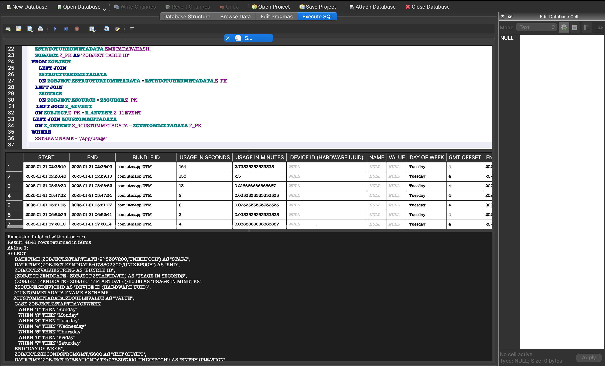

An additional source is `/private/var/db/powerlog/Library/BatteryLife/CurrentPowerlog.PLSQL`, which contains similar application usage data.

**Q: What was the last command executed by the user on the machine?**
```
vim creds.txt
```

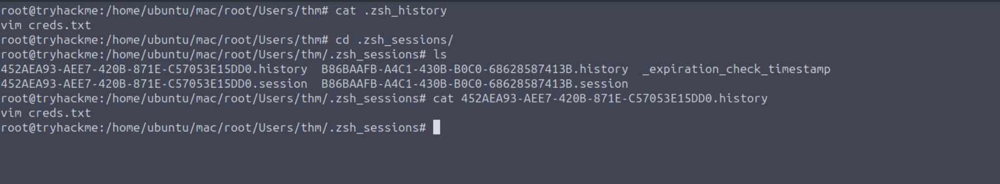

**Q: What is the GUID of the terminal session in which this command was executed?**
```
452AEA93-AEE7-420B-871E-C57053E15DD0
```


**Q: When was the last time the user closed the terminal? Format YYYY-MM-DD hh:mm:ss**
```
2025-01-19 15:52:33
```

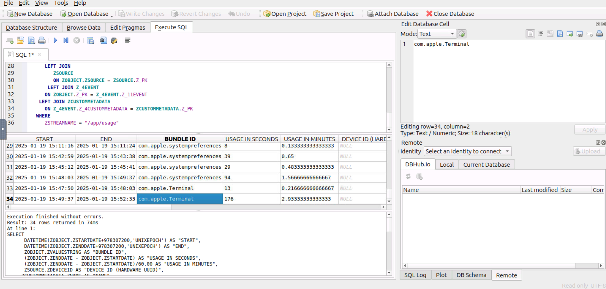

**Q: For how many seconds was the terminal in focus during this session?**
```
176
```


---

## Task 7 — File System Activity

File system activity artefacts reveal what files and folders were accessed, created, renamed, or deleted — key for establishing attacker footprint and data access.

**File System Events Store (fseventsd)**

Location: `/.fseventsd` or `/System/Volumes/Data/.fseventsd` (version-dependent). Functions similarly to the NTFS USN Journal — records all file system changes including creation, deletion, rename, and volume mount/unmount events.

Parse with `mac_apt`:
```
python3 mac_apt.py -o . -c DMG ~/mac-disk.img FSEVENTS
```

Output is a CSV with columns for `EventType`, `EventFlags`, `Filepath`, `File_ID`, and `SourceModDate`. Event flags include `Created`, `Removed`, `Modified`, `InodeMetaMod`, and `EndOfTransaction`.

🔴 fseventsd is a high-signal source for detecting file staging, exfiltration prep, or artefact deletion — look for `Removed` flags on sensitive file paths or mass creation/deletion patterns.

**DS_Store**

A hidden `.DS_Store` file is created in every directory opened via Finder. Its forensic value is confirming that a specific folder was browsed through the GUI. Parse with the DS_Store parser utility:
```
python3 parse.py <path-to-.DS_Store>
```

Output includes icon positions, window bounds, view style, and logical/physical file sizes for each item in the directory at the time of access.

💡 Run the DS_Store parser from its own directory and provide the absolute path to the target `.DS_Store` file to avoid path errors.

**Most Recently Used (MRU) Folders**

`/Users/<user>/Library/Preferences/com.apple.finder.plist` — `FXRecentFolders` key. Item 0 is the most recent. The `file-bookmark` BLOB encodes the full folder path, volume name, and volume GUID.

For Microsoft Office applications, per-app MRU lists are at:
`/Users/<user>/Library/Containers/com.microsoft.<app>/Data/Library/Preferences/com.microsoft.<app>.securebookmarks.plist`

Each entry includes the file URI, `kLastUsedDateKey` timestamp, and a bookmark BLOB resolvable via hex editor.

**Q: What are the viewing options for the Users/thm folder?**
```
Open in list view
```

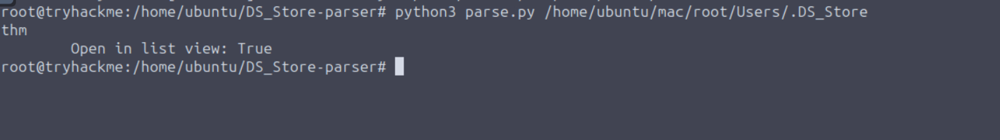

**Q: What is the last directory visited by the user using the Finder application?**
```
Recents
```

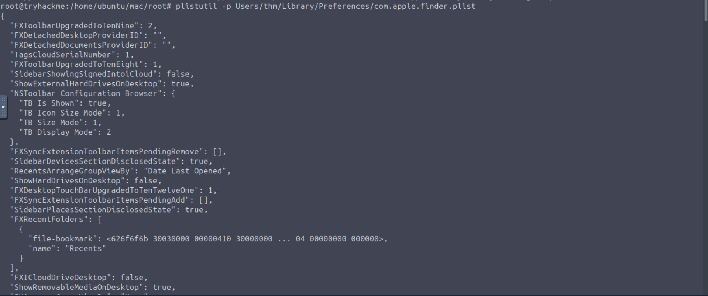

---

## Task 8 — Connected Devices

Connected device artefacts help identify data exfiltration vectors (USB drives, iDevices) and communications channels (Bluetooth, printers).

**Mounted Volumes**

`/Users/<user>/Library/Preferences/com.apple.finder.plist` — `FXDesktopVolumePositions` key. Lists all volumes that appeared on the desktop, including USB drives and mounted DMG/IMG files. Each entry is keyed by `<VolumeName>_<hex-identifier>`.

💡 DMG and IMG files mounted by the user also appear here — useful for detecting installer packages or disk images opened by an attacker.

**Connected iDevices**

`/Users/<user>/Library/Preferences/com.apple.iPod.plist` — records each connected Apple device with:
- Device class (iPhone, iPad)
- Product type and firmware version
- IMEI / IMEI2
- Serial number
- `Connected` timestamp and `Use Count`

**Bluetooth Connections**

The `knowledgeC.db` database contains Bluetooth connection history in the `/Bluetooth/isConnected` stream. Use APOLLO's `knowledge_audio_bluetooth_connected` module SQL query in DB Browser to extract device names, connection timestamps, disconnection timestamps, and duration in minutes.

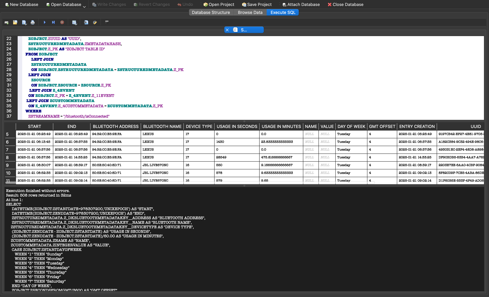

**Connected Printers**

`/Users/<user>/Library/Preferences/org.cups.PrintingPrefs.plist` — `LastUsedPrinters` array. Each entry includes the `PrinterID` and `Network` (IP or link-local address), confirming whether it is a network printer.

**Q: Which stream in the knowledgeC database contains information about connected Bluetooth devices?**
```
Bluetooth/isConnected
```

---

## Task 9 — Conclusion

This room covered the primary forensic artefact categories present in macOS environments:

- **System information** — OS version, serial number, install date, time zone, boot/shutdown times
- **Network configuration** — interface details, DHCP leases, Wi-Fi connection history with geolocation data
- **Account activity** — user account metadata, login/logout events, SSH known hosts, screen lock events
- **Evidence of execution** — Zsh history files (persistent and per-session), application usage via knowledgeC.db
- **File system activity** — fseventsd (analogous to USN Journal), DS_Store (Finder access evidence), MRU folder lists
- **Connected devices** — mounted volumes, iDevices, Bluetooth connections, printers

---

## Key Takeaways

- **Plist files are everywhere** — understanding when to use `cat` (XML) vs. `plistutil`/`plutil` (binary) is fundamental to efficient macOS forensic triage.
- **knowledgeC.db is a primary pivot point** — it surfaces application usage, in-app activity, and Bluetooth connections in a single database. APOLLO's SQL modules make extraction systematic.
- **Zsh session history files survive partial shell history clearing** — even if `~/.zsh_history` is wiped, per-session files under `.zsh_sessions/` may retain command history keyed to a specific terminal session GUID.
- **DS_Store files prove Finder access** — their presence in a directory is evidence the folder was GUI-browsed, regardless of whether the user claims otherwise.
- **fseventsd is macOS's USN Journal equivalent** — mass `Removed` events, unexpected renames, or volume mount/unmount activity are red flags for data staging or anti-forensics.
- **Wi-Fi known-networks plist can geolocate a device** — BSSID-level GPS coordinates in the `BSSList` key allow physical placement of a machine at a specific time, which is highly significant for establishing presence.
- **Cross-platform analysis is standard** — this room reinforces that macOS forensics is frequently performed on Linux using `apfs-fuse`, `plistutil`, `mac_apt`, and DB Browser. Knowing the tool equivalents for each platform is operationally essential.

---

*Write-up by [OPT4RUN](https://tryhackme.com/p/OPT4RUN)*