| Field | Details |
|-------|---------|
| **Room** | macOS Forensics: The Basics |
| **Platform** | TryHackMe |
| **Path** | Advanced Endpoint Investigations |
| **Module** | macOS Forensics |
| **Difficulty** | Easy |
| **Category** | Digital Forensics |
| **Room Link** | [tryhackme.com/room/macosforensicsbasics](https://tryhackme.com/room/macosforensicsbasics) |
| **Author** | [OPT4RUN](https://tryhackme.com/p/OPT4RUN) |

---

## Overview

This room introduces macOS from a forensic investigator's perspective. It covers the history and evolution of macOS, the HFS+ and APFS file systems, the macOS directory structure and domain model, common macOS-specific file formats, and the practical challenges involved in acquiring forensic images from Apple devices. The room concludes with a hands-on exercise mounting an APFS disk image on Linux using `apfs-fuse` to extract user data.

From a SOC/blue team standpoint, macOS endpoints are increasingly present in enterprise environments, and understanding their forensic surface — especially the layered encryption model (hardware + FileVault) and the APFS container/volume architecture — is essential for IR planning and evidence acquisition workflows.

---

## Task 1 — Introduction

macOS is Apple's desktop/laptop operating system. Apple has historically resisted efforts by law enforcement — including the FBI — to unlock or image its devices, reinforcing the perception of Apple as a security-first platform. This tension between device security and forensic investigability is the central theme of the room.

**Prerequisites:** Digital Forensics and Incident Response module.

---

## Task 2 — A Brief History of macOS

Apple was founded in 1976 by Steve Jobs, Steve Wozniak, and Ronald Wayne. Early Apple systems — Apple I, II, III, and Lisa — culminated in the Macintosh, which initially sold well but was later overtaken by other PC vendors. Jobs was forced out of Apple and founded Pixar and NeXT Computer. Apple's decline was reversed when it acquired NeXT in 1998, bringing Jobs back.

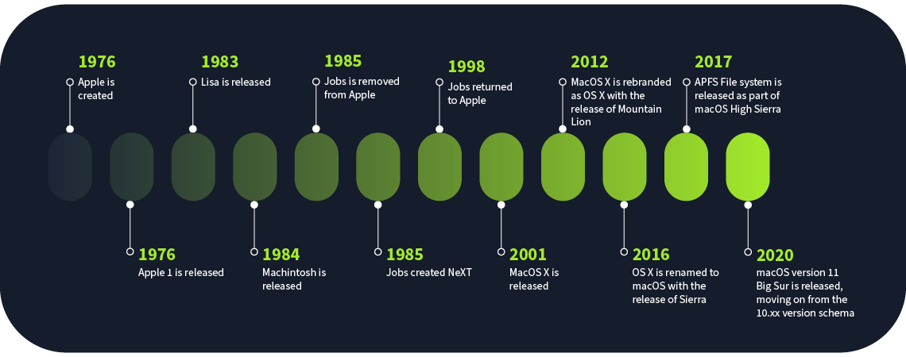

**Key milestones:**

| Year | Event |
|------|-------|
| 1976 | Apple founded |
| 1984 | Macintosh released |
| 1998 | Apple acquires NeXT; HFS+ introduced (macOS 8.1) |
| 2001 | macOS X released — Unix-like OS derived from NeXTSTEP |
| 2012 | Rebranded as OS X (version 10.8 Mountain Lion) |
| 2016 | Rebranded as macOS (version 10.12 Sierra) |
| 2017 | APFS introduced as default file system (macOS 10.13 High Sierra) |
| 2020 | macOS Big Sur — version number jumps from 10.x to 11 |

**Q: In which year was the APFS file system introduced by Apple?**
```
2017
```

**Q: Which file system is common amongst all Apple devices, including iOS, watchOS, and tvOS?**
```
APFS
```

---

## Task 3 — HFS+ File System

HFS+ (Hierarchical File System Plus), also called **macOS Extended**, was the default macOS file system from 1998 until it was replaced by APFS in 2017. It was not originally designed for Unix-like systems, so features such as hard linking and permissions were retrofitted when macOS X was introduced in 2001.

### Structure

HFS+ is built on sectors (typically 512 bytes) and allocation blocks (one or more sectors). It uses 32-bit block addressing, giving a maximum of 2³² allocation blocks.

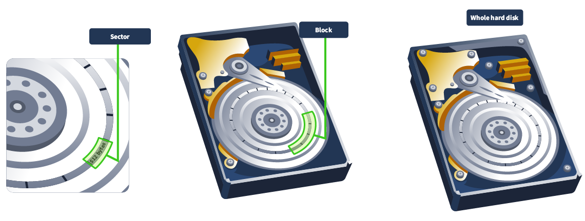

| Component | Description |
|-----------|-------------|
| Boot Volume (sectors 0–1) | Used to boot the volume |
| Volume Header (sector 2) | Metadata: allocation block size, creation timestamp |
| Allocation File | Tracks used and unused allocation blocks |
| Catalog File | B-tree listing of all files and directories |
| Extents Overflow File | Tracks allocation blocks assigned to each file |
| Attributes File | Stores file attributes |

File names are encoded in **UTF-16** and can be up to 255 UTF-16 code units in length.

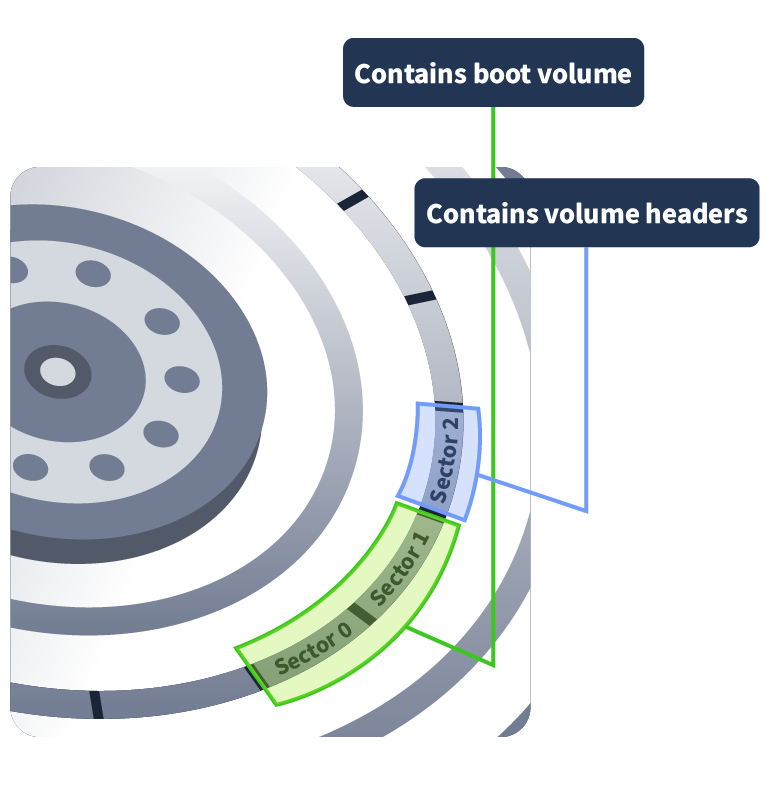

### Limitations

| Limitation | Detail |
|------------|--------|
| Missing Unix features | Hard links and permissions had to be retrofitted |
| Date ceiling | Does not support dates beyond **6 February 2040** |
| No concurrent access | Single-process file system; causes SSD performance issues |
| Timestamp resolution | Maximum 1-second resolution (modern FSes support nanoseconds) |
| No snapshots | No equivalent to NTFS Volume Shadow Copies |

**Q: What is the latest date that the HFS+ file system supports? Format DD/MM/YYYY**
```
06/02/2040
```

**Q: In the HFS+ file system, which file contains a list of all the files and directories present in the file system?**
```
Catalog file
```

---

## Task 4 — APFS File System

APFS (Apple File System) was previewed in macOS 10.12 Sierra and became the default in macOS 10.13 High Sierra (2017). It is now used across all Apple platforms: macOS, iOS, watchOS, tvOS, and iPadOS.

### Key Improvements Over HFS+

| Feature | Detail |
|---------|--------|
| Timestamps | Nanosecond precision; supports dates beyond 2040 |
| Encryption | Native full disk encryption |
| Snapshots | Read-only, point-in-time file system instances |
| Crash protection | Redirect-on-write — new blocks written before old ones released |
| File capacity | Maximum 2⁶³ files |
| SSD optimisation | Designed natively for flash storage |

> 💡 Full disk encryption and hardware encryption in APFS make forensic acquisition significantly harder compared to HFS+.

### Structure

APFS uses **GPT (GUID Partition Table)**. Inside each partition is one or more **containers**, each of which can hold multiple **volumes**. Free space within a container is shared across all its volumes.

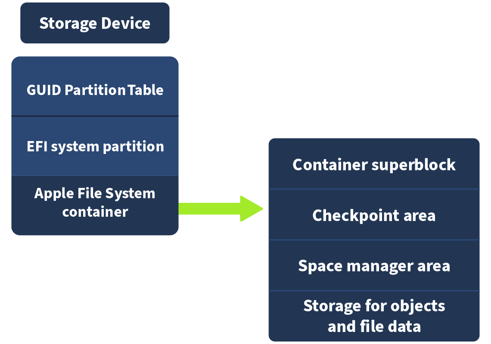

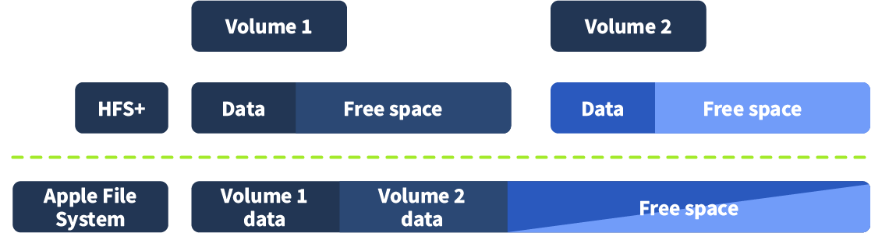

### diskutil

The `diskutil` command-line tool manages disks and APFS volumes on macOS:

```bash
# List all APFS volumes and containers
diskutil apfs list
```

Sample output shows volumes by role (System, Preboot, Recovery, Data, VM), their UUIDs, mount points, capacity consumed, and FileVault status.

**Q: In macOS, which command can be used to list all available APFS volumes?**
```
diskutil apfs list
```

---

## Task 5 — macOS Directory Structure and Domains

macOS is Unix-derived, so its root directory structure has significant overlap with Linux.

### Root Directory

```
/Applications   User applications (Discord, Python, etc.)
/Library        Shared configuration files across all users
/System         Apple-managed OS files (protected)
/Users          User home directories
/Volumes        Mount points for volumes
/bin            Core binaries (chmod, rm, echo)
/sbin           System binaries (launchd, ping, mount)
/dev            Device files (Bluetooth, etc.)
/opt            Optional software (e.g., Homebrew)
/private        Contains /var, /etc, /tmp (symlinked from root)
/etc → /private/etc    Configuration files (e.g., hosts)
/var → /private/var    Variable data (e.g., logs)
/tmp → /private/tmp    Temporary files
```

### Domains

macOS organises files into four domains:

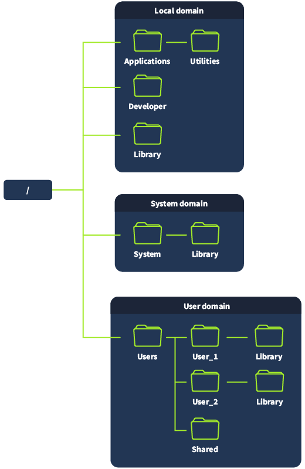

| Domain | Maps To | Description |
|--------|---------|-------------|
| **Local** | `/Applications`, `/Library` | Resources shared across all local users; manageable by admins |
| **System** | `/System` | Apple-managed OS files; read-only even for root |
| **User** | `/Users/<username>` | Per-user data and configuration; includes hidden `~/Library` |
| **Network** | Network resources | Printers, SMB shares; managed by network admins |

> 💡 The hidden `~/Library` directory within the User domain (at `/Users/<user>/Library`) contains user-specific application data and configurations — high forensic value.

**Q: Files in which domain can't be modified even by using sudo privileges?**
```
System
```

**Q: Which domain is the most forensically important domain from a user activity point of view?**
```
User
```

---

## Task 6 — macOS File Formats

macOS uses several proprietary and platform-specific file formats relevant to forensic analysis.

### .plist (Property List)

The macOS equivalent of the Windows Registry — stores system and application configurations. Exists in two formats:

| Format | Readable With |
|--------|--------------|
| XML | Any text editor |
| BLOB (Binary) | Xcode or `plutil` |

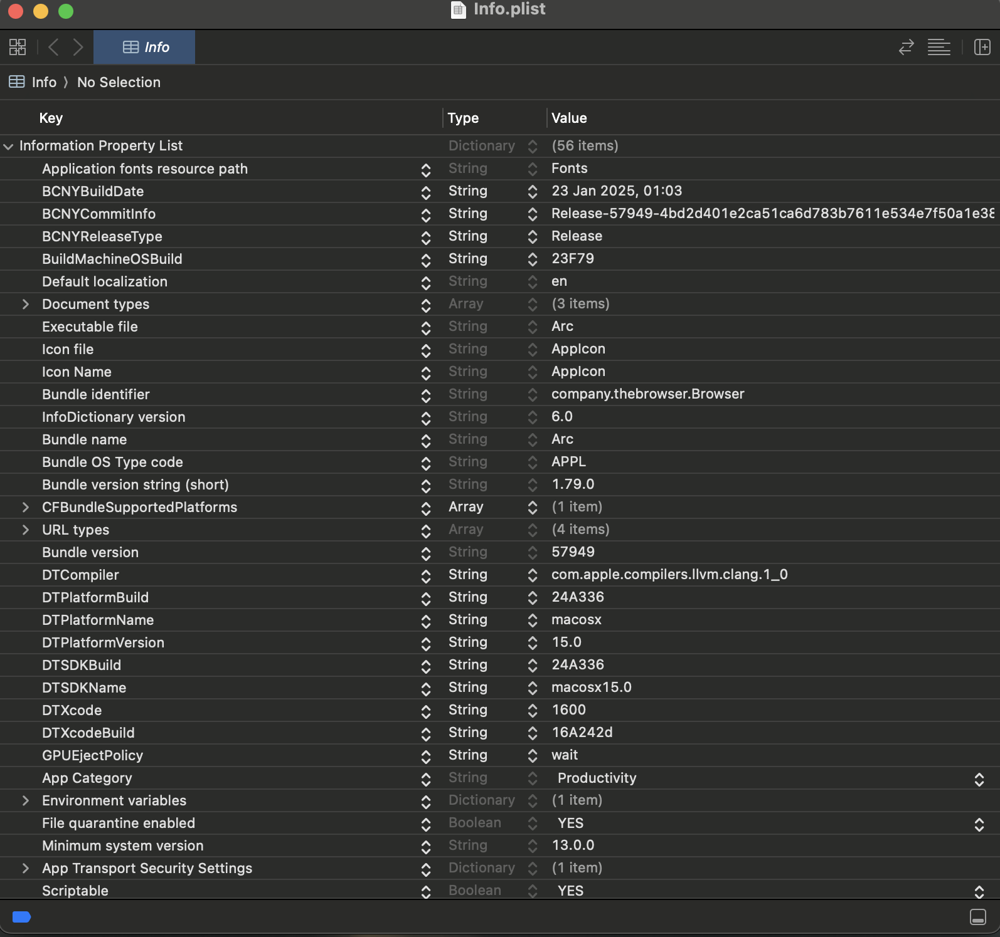

> 🔴 `.plist` files are forensically significant — they store launch agents, application preferences, recently accessed files, and other artefacts analogous to Registry keys in Windows IR.

### .app (Application Bundle)

Application executables found in `/Applications`. Despite appearing as a single file, `.app` files are bundles (directories). Right-click → **Show Package Contents** reveals the internal structure.


### .dmg (Disk Image)

macOS disk image format. Mountable directly in macOS. Used by installers. Can be formatted as APFS, HFS+, or FAT.

### .kext (Kernel Extension)

Equivalent to Windows device drivers — provides third-party access to the OS kernel. Deprecated in newer macOS versions. From macOS Big Sur onward, loading a third-party `.kext` requires user permission, a recovery boot, and explicit enablement.

> 🔴 Malicious `.kext` files have been used for kernel-level rootkits on macOS. Their deprecation is a security improvement, but legacy systems remain a concern.

### .dylib (Dynamic Library)

Equivalent to Windows DLLs or Linux `.so` files — shared code libraries loaded at runtime.

### .xar (eXtensible ARchive)

Archive format used for installers and browser extensions. Replaced the older `.pkg` format.

**Q: Which of the file types discussed above are similar to device drivers in Windows?**
```
.kext files
```

---

## Task 7 — Challenges in Data Acquisition

Apple's design decisions create significant barriers to forensic acquisition of macOS devices.

### Barriers

| Challenge | Detail |
|-----------|--------|
| **Physical disk access** | SSDs are soldered to the motherboard on newer Macs; older removable SSDs use proprietary interfaces |
| **Hardware encryption** | T2 chip and Apple Silicon store encryption keys in a secure enclave; removing the SSD is useless without the key |
| **FileVault encryption** | Ties volume encryption to the user's password; data remains encrypted until the user authenticates |
| **Full Disk Access (FDA)** | Live imaging tools must be explicitly granted FDA via Settings → Privacy & Security → Full Disk Access |
| **System Integrity Protection (SIP)** | Protects the kernel from modification, code injection, and debugging — even with root access |

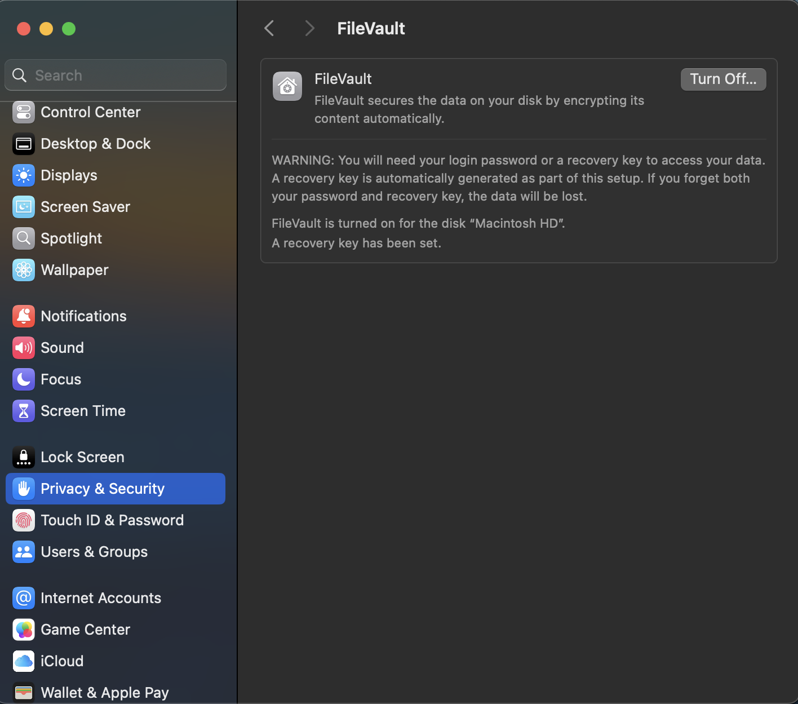

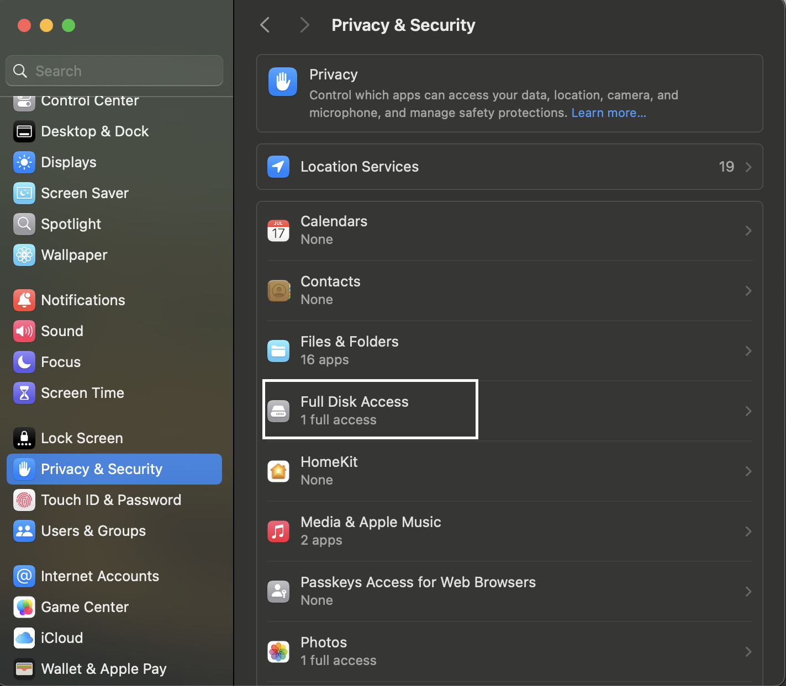

### Acquisition Options

1. **Proprietary tools** (Magnet AXIOM, Cellebrite) — grant FDA and image a live system.
2. **Manual recovery boot** — if user password is known, boot into recovery, disable SIP/FileVault, and image using `dd`, `hdiutil`, or `dc3dd`.
3. **Target/Sharing mode** — boot into recovery, unlock with password, then connect via Thunderbolt/Firewire for logical (sharing mode) or full (Target mode) acquisition. Target mode is unavailable on Apple Silicon Macs.

> 💡 SIP can be disabled by booting into recovery and running `csrutil disable` in the terminal. Note that this changes volatile state and modifies the disk — document carefully before proceeding.

**Q: Which command can be used to disable SIP?**
```
csrutil disable
```

---

## Task 8 — Mounting APFS Disk Image

### Tool: apfs-fuse

`apfs-fuse` is an open-source Linux utility for mounting APFS images. It mounts read-only. Available at: [github.com/sgan81/apfs-fuse](https://github.com/sgan81/apfs-fuse)

### Workflow

**Step 1 — Inspect the image with `apfsutil`:**

```bash
apfsutil mac-disk.img
```

This lists all volumes in the container with their UUIDs, roles, capacity, and FileVault status.

**Step 2 — Attempt initial mount (System volume):**

```bash
sudo su
apfs-fuse mac-disk.img mac/
ls mac/root/Users
# Returns empty — wrong volume mounted
```

The default mount targets the System volume. User data lives in the **Data volume**.

**Step 3 — Mount the Data volume (volume 4):**

```bash
apfs-fuse -v 4 mac-disk.img mac
ls mac/root/Users
# Shared  thm
```

The `-v` flag specifies the volume index. Volume 4 is the Data volume (`84E5F2BD-503F-4E3A-8105-EEBEBC1925B4`).

> 💡 Always cross-reference `apfsutil` output to identify the correct volume index before mounting. Mounting the System volume is a common mistake — user artefacts are in the Data volume.

**Step 4 — Explore user data:**

```bash
ls mac/root/Users/thm
```

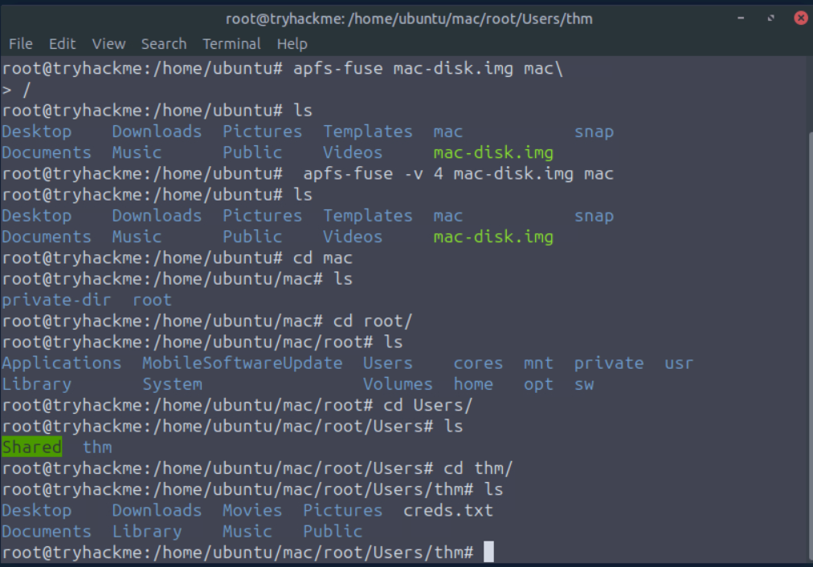

A file named `creds.txt` is present in the user directory.

```bash
cat mac/root/Users/thm/creds.txt
```

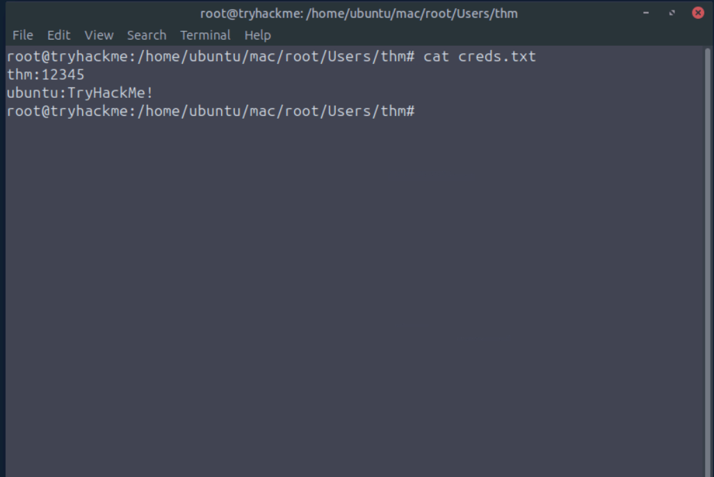

The file contains credentials for multiple users.

**Q: In the disk image provided in the attached VM, what is the UUID of the volume containing user data?**
```
84E5F2BD-503F-4E3A-8105-EEBEBC1925B4
```

**Q: What is the name of the user who used this Mac device?**
```
thm
```

**Q: There is a text file in the User directory of the above-mentioned user. What is the name of this file?**
```
creds.txt
```

**Q: It looks like the file contains credentials for different users and their passwords. What is the password of the user we identified above?**
```
12345
```

---

## Task 9 — Conclusion

The room covered macOS history, the HFS+ and APFS file systems, the macOS directory and domain structure, macOS-specific file formats, acquisition challenges, and hands-on APFS image mounting with `apfs-fuse`.

The follow-on room is **macOS Forensics: Artefacts** (`macosforensicsartefacts`), which covers forensic artefact analysis on macOS.

---

## Key Takeaways

- **APFS replaced HFS+ in 2017** and is now universal across all Apple platforms. Its container/volume model — where free space is shared across volumes — differs significantly from traditional partition schemes and affects how images must be mounted and analysed.
- **Mounting the correct volume matters.** The System and Data volumes are separate in APFS. User artefacts live in the Data volume; mounting the System volume will show an empty `/Users` directory.
- **`apfs-fuse -v <id>`** is the key flag for targeting a specific volume when mounting on Linux. Always run `apfsutil` first to map volume indices to roles.
- **`.plist` files are the macOS Registry equivalent.** XML plists are human-readable; binary BLOBs require `plutil` or Xcode. These contain launch agents, app preferences, and usage history — high-value forensic artefacts.
- **`.kext` files** are kernel-level extensions analogous to Windows drivers. Their deprecation in newer macOS versions is a security improvement, but they remain a relevant threat vector on older systems.
- **The acquisition challenge is layered:** hardware encryption (T2/Apple Silicon secure enclave) + FileVault (user-password-tied volume encryption) + SIP + FDA requirements mean a cold acquisition of a modern Mac is effectively impossible without the user's credentials or organisational recovery key.
- **SIP disablement** (`csrutil disable` from recovery) and granting FDA are pre-requisites for many acquisition paths but introduce changes to the system state — document all actions before proceeding.
- The **`~/Library`** directory (hidden, within the User domain) is the primary location for per-user application data, preferences, and cached artefacts — the macOS equivalent of `AppData` on Windows.

---

*Write-up by [OPT4RUN](https://tryhackme.com/p/OPT4RUN)*