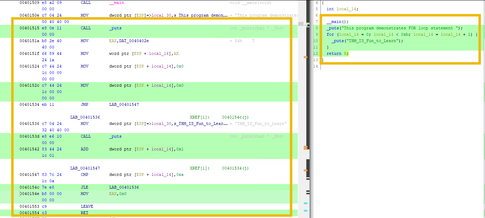
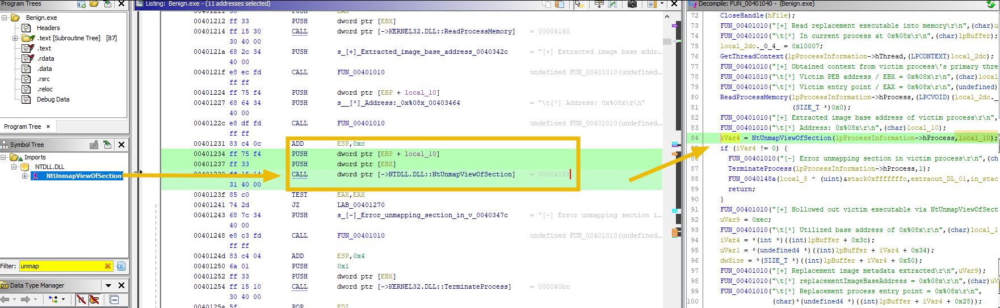
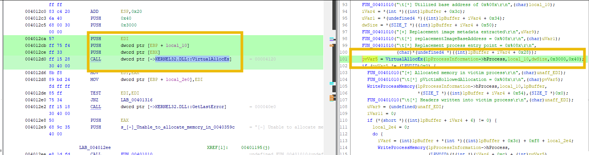
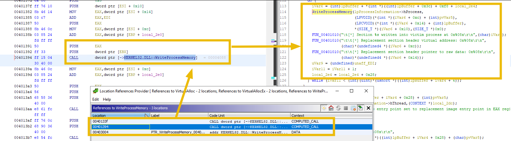

# Advanced Static Analysis

| Field | Details |
|-------|---------|
| **Room** | Advanced Static Analysis |
| **Platform** | TryHackMe |
| **Path** | SOC Level 2 |
| **Module** | Malware Analysis |
| **Difficulty** | Medium |
| **Category** | Malware Analysis |
| **Room Link** | [tryhackme.com/room/advancedstaticanalysis](https://tryhackme.com/room/advancedstaticanalysis) |
| **Author** | [OPT4RUN](https://tryhackme.com/p/OPT4RUN) |

---

## Overview

Building on the foundations of Basic Static Analysis — strings, hashes, PE headers, import tables — this room moves into **reverse engineering**: reading compiled assembly and decompiled pseudo-C to understand malware behavior without ever executing it.

The primary tool throughout is **Ghidra**, an open-source reverse engineering framework developed by the NSA. The room covers:
- Setting up Ghidra projects and navigating its core panels
- Recognizing common C code constructs (loops, conditionals, functions) in assembly
- Identifying categories of suspicious Windows API calls
- End-to-end analysis of a **process hollowing** sample (`Benign.exe`)

🔴 **Malware relevance:** Advanced static analysis is the technique used when malware is obfuscated, packed, or too complex for basic static tools to reveal intent. Reading disassembly and decompiled pseudo-C is a core skill for any SOC L2 analyst performing triage on suspicious binaries.

---

## Task 1 — Introduction

This room is a direct continuation of the SOC Level 2 Malware Analysis path. Prerequisites:
- [x86 Architecture Overview](https://tryhackme.com/room/x8664arch)
- [x86 Assembly Crash Course](https://tryhackme.com/room/x86assemblycrashcourse)
- [Basic Static Analysis](https://tryhackme.com/room/staticanalysis1)

---

## Task 2 — Malware Analysis: Overview

The four stages of malware analysis:

| Stage | Executes Malware? | Focus |
|-------|-------------------|-------|
| Basic Static | ❌ | File structure, strings, hashes, imports |
| Basic Dynamic | ✅ | Runtime behavior in a sandbox |
| Advanced Static | ❌ | Disassembly, decompilation, deobfuscation |
| Advanced Dynamic | ✅ | Complex evasion, detailed runtime tracing |

Advanced static analysis aims to uncover **hidden or obfuscated code** by analyzing the compiled binary directly with disassemblers and decompilers. Common tools: IDA Pro, Binary Ninja, radare2, Ghidra.

**Q: Does advanced static analysis require executing the malware in a controlled environment?**
```
nay
```

---

## Task 3 — Connecting to the VM

The VM comes pre-loaded with a full reverse engineering toolkit:


| Tool | Purpose |
|------|---------|
| Ghidra | Primary disassembler / decompiler (used in this room) |
| x32dbg / x64dbg | Debuggers for dynamic analysis |
| IDA Free | Alternative disassembler |
| Cutter | GUI frontend for radare2 |
| PE-bear / pestudio | PE header and import analysis |

**Q: I have successfully connected to the VM.**
```
No answer needed
```

**Q: How many files are present in the Code_Constructs folder on the Desktop?**
```
5
```

---

## Task 4 — Ghidra: A Quick Overview

### Setting Up a Project

Ghidra requires a project before any binary can be loaded for analysis.

**Step 1 — Ghidra opens with no active project**


**Step 2 — File → New Project**


**Step 3 — Select Non-Shared Project**


💡 **Tip:** Non-Shared keeps analysis local. Shared Project enables collaborative analysis — useful when multiple SOC analysts are working the same incident.

**Step 4 — Name the project**


**Step 5 — Drag & Drop the target executable into the project**


**Step 6 — Review the Import Results Summary**

Ghidra auto-detects file format, architecture, language ID, and hashes before any analysis begins.


**Step 7 — Open in Code Browser and click Yes to analyze**


**Step 8 — Leave analysis options at defaults and click Analyze**


---

### Exploring the Ghidra Layout


| # | Panel | Purpose |
|---|-------|---------|
| 1 | Program Trees | PE sections (`.text`, `.data`, `.rdata`, etc.) — click any section to jump to it |
| 2 | Symbol Tree | Imports, Exports, Functions — the starting point for most analysis |
| 3 | Data Type Manager | Data structures and types found in the binary |
| 4 | Listing | Disassembly view — virtual address, opcode, instruction, operands, comments |
| 5 | Decompiler | Pseudo-C translation of the selected function |
| 6 | Toolbar | Graph view, memory map, navigation controls |

**Function Graph** — visualizes the control flow graph (CFG) of a function, showing how basic blocks connect:


**Memory Map** — shows all PE sections with virtual addresses, sizes, and RWX permissions:


**Navigation Toolbar** — back/forward navigation through the code, similar to a browser:


**Search for Strings** (`Search → For Strings`) — extracts human-readable strings from the binary:


🔴 **Malware relevance:** String search is often the fastest path to C2 addresses, file paths, registry keys, mutex names, and hardcoded credentials embedded in malware.

---

### Analyzing HelloWorld.exe in Assembly

Clicking `.text` in Program Trees and scrolling to the MessageBox call shows both the disassembly and its decompiled equivalent:


The decompiler translates the argument pushes into a clean `MessageBoxA((HWND)0x0, "Hello World", "Hello World", 0)` call, confirming the binary simply displays a popup.

---

### Task 4 Questions

**Q: How many function calls are present in the Exports section?**


```
1
```

**Q: What is the only API call found in the User32.dll under the Imports section?**


```
MessageBoxA
```

**Q: How many times can the "Hello World" string be found with the Search for Strings utility?**


```
1
```

**Q: What is the virtual address of the CALL function that displays "Hello World" in a messagebox?**


```
004073d7
```

---

## Task 5 — Identifying C Code Constructs in Assembly

Rather than reading every instruction, experienced analysts look for **structural patterns** in assembly — loop signatures, conditional branches, function prologues — to understand logic at a higher level quickly.

All sample programs from the `Code_Constructs` folder are imported into the Ghidra project:


---

### Hello World (Console)

`Hello_World.exe` pushes `"HELLO WORLD!!\n"` onto the stack before calling the print function. The decompiler translates this instantly:


---

### For Loop

`for-loop.exe` shows the typical loop assembly pattern: initialize a counter, compare against a limit, perform work, increment, conditional jump back.



💡 **Tip:** The `CMP` + conditional `JMP` pair is the assembly signature of any loop or branch. A backwards jump means you're inside a loop; a forwards jump means a branch.

---

### While Loop

`while-loop.exe` main function as loaded in Ghidra, with the decompiled C visible on the right:


Examining the full assembly reveals the do-while structure — `iVarl` is initialized to `4` and decremented each iteration until it reaches `0`:


🔴 **Malware relevance:** Loops are commonly used in malware for: retrying C2 connections, iterating over files during exfiltration, decryption routines, and anti-debug timing checks.

---

### If-Else

`if-else.exe` in Ghidra with the decompiled pseudo-C visible, showing the program's string and conditional structure:


---

### Task 5 Questions

**Q: What value gets printed by the while loop in the while-loop.exe program?**

*(The string pushed before each loop iteration, visible in both the listing and decompiler)*

```
_ITs_Fun_to_Learn_at_THM_
```

**Q: How many times will the while loop run until the condition is met?**

*(`iVarl` is initialized to `4` and decremented by 1 per iteration; loop exits when `iVarl == 0`)*

```
4
```

**Q: Examine the while-loop.exe in Ghidra. What is the virtual address of the instruction that CALLS to print out the sentence "That's the end of while loop .."?**


```
00401543
```

**Q: In the if-else.exe program, examine the strings and complete the sentence "This program demonstrates..........."**

```
this program demonstrates if-else statement
```

**Q: What is the virtual address of the CALL to the main function in the if-else.exe program?**


```
00401509
```

---

## Task 6 — An Overview of Windows API Calls

Windows APIs are the interface between user-mode code and the OS. Understanding which APIs malware commonly calls — and why — makes import table analysis during basic static analysis far more actionable.

### CreateProcess API

`CreateProcessA` creates a new process and its primary thread. Its full signature:


The `dwCreationFlags` parameter controls how the new process starts. The flag critical to injection techniques:

| Flag | Value | Meaning |
|------|-------|---------|
| `CREATE_SUSPENDED` | `0x00000004` | Creates the process with its primary thread in a suspended state — does not execute until `ResumeThread` is called |

🔴 **Malware relevance:** `CREATE_SUSPENDED` is the first step of **process hollowing**. By launching a legitimate process in a suspended state, the attacker can manipulate its memory before a single instruction executes. From the OS perspective, the process looks completely normal.

**Q: When a process is created in suspended state, which hexadecimal value is assigned to the dwCreationFlags parameter?**

```
0x00000004
```

---

## Task 7 — Common APIs Used by Malware

A reference map of Windows APIs commonly found in malware imports. Seeing these during basic static analysis tells you what the malware is *capable of* before you open a disassembler.

| Malware Category | Key APIs |
|-----------------|----------|
| Keylogger | `SetWindowsHookEx`, `GetAsyncKeyState`, `GetKeyboardState`, `GetKeyNameText` |
| Downloader | `URLDownloadToFile`, `WinHttpOpen`, `WinHttpConnect`, `WinHttpOpenRequest` |
| C2 Communication | `InternetOpen`, `InternetOpenUrl`, `HttpOpenRequest`, `HttpSendRequest` |
| Data Exfiltration | `InternetReadFile`, `FtpPutFile`, `CreateFile`, `WriteFile`, `GetClipboardData` |
| Dropper | `CreateProcess`, `VirtualAlloc`, `WriteProcessMemory` |
| API Hooking | `GetProcAddress`, `LoadLibrary`, `SetWindowsHookEx` |
| Anti-Debug / VM Detection | `IsDebuggerPresent`, `CheckRemoteDebuggerPresent`, `GetTickCount`, `GetSystemMetrics` |

🔴 **Malware relevance:** Seeing `WriteProcessMemory` + `VirtualAllocEx` + `CreateProcessA` together in an import table is a strong indicator of **process injection or hollowing** — even before opening a disassembler. Import analysis is not just a box-ticking exercise; it directly shapes what you look for in Ghidra.

💡 **Tip:** [malapi.io](https://malapi.io) maps Windows APIs to the malware families that use them — useful as a quick reference during triage.

---

## Task 8 — Process Hollowing: Overview

**Process hollowing** (MITRE ATT&CK: [T1055.012](https://attack.mitre.org/techniques/T1055/012/)) is a code injection technique where malware creates a legitimate process, empties its memory, and replaces it with malicious code. The injected code then runs inside the context of the legitimate process.

### The Hollowing API Chain

| Step | API | Purpose |
|------|-----|---------|
| 1 | `CreateProcessA` | Spawn a legitimate process (e.g., `iexplore.exe`) in `CREATE_SUSPENDED` state |
| 2 | `NtUnmapViewOfSection` | Unmap the legitimate process's image from its own memory |
| 3 | `VirtualAllocEx` | Allocate new memory in the hollowed process |
| 4 | `WriteProcessMemory` | Write the malicious binary into the allocated memory |
| 5 | `SetThreadContext` | Redirect the suspended thread's entry point to the malicious code |
| 6 | `ResumeThread` | Resume the process — it now executes the injected code |

🔴 **Malware relevance:** From the OS and most security tools' perspective, the malicious code runs inside a recognized, legitimate process. Process-based detection sees `iexplore.exe` — not malware. This is precisely why static analysis of imports and disassembly is needed to expose what's really happening.

**Q: Which API is used to write malicious code to the allocated memory during process hollowing?**

```
WriteProcessMemory()
```

---

## Task 9 — Analyzing Process Hollowing

The target sample is `Benign.exe` located on the Desktop. Despite the name, this binary implements process hollowing — injecting `evil.exe` into a suspended `iexplore.exe` process.

---

### Step 1: Load and Analyze the Sample

Import `Benign.exe` into Ghidra. The Import Results Summary gives immediate context:


💡 **Tip:** The PDB filename `simplehollow.pdb` is an immediate red flag — it leaks the original Visual Studio project name, confirming this is a process hollowing sample before a single line of code is read.

Analyze the sample when prompted:


---

### Step 2: Locate CreateProcessA — Creating the Victim Process

Search `create` in the Symbol Tree filter. Two `Create*` APIs appear under KERNEL32.DLL — exactly 2 results:


Right-click `CreateProcessA` → **Show References to**:


The references window returns 2 locations — one actual `COMPUTED_CALL` in `.text` and one `DATA` entry in the IAT:


Clicking the first reference (`0040108f`) jumps to the call site. The disassembly shows arguments being pushed in reverse order before the `CALL`:


The decompiler (line 41–43) makes the intent clear: `CreateProcessA` is called with `"C:\\Program Files (x86)\\Internet Explorer\\iexplore.exe"` and `dwCreationFlags = 0x4` (`CREATE_SUSPENDED`).

---

### Step 3: Function Graph — Success and Failure Branches

Opening the Function Graph at this code block reveals the conditional branches following the `CreateProcessA` call:


| Branch | Condition | Target Block |
|--------|-----------|-------------|
| 🔴 Red (failure) | `CreateProcessA` returns 0 — victim process not created | `00401099` |
| 🟢 Green (success) | Victim process created in suspended state | `004010c2` |

---

### Step 4: Locate CreateFileA — Opening the Malicious Binary

Still filtered on `create`, click `CreateFileA` → **Show References to**. First reference is at `004010f0`:


Jumping to `004010f0`, the decompiler on line 52 shows `CreateFileA` being called on `evil.exe`:


If `CreateFileA` fails (returns `INVALID_HANDLE_VALUE`), the program jumps to the failure block. The Function Graph shows this branch:


---

### Step 5: Hollow the Process — NtUnmapViewOfSection

Search `unmap` in the Symbol Tree filter. `NtUnmapViewOfSection` appears under NTDLL.DLL:


The call at `0040123f` takes two arguments — the process handle and base address — and unmaps the legitimate `iexplore.exe` image from memory:



---

### Step 6: Allocate Memory — VirtualAllocEx

With the process now hollowed, the malware allocates memory to hold the replacement image:



---

### Step 7: Write the Malicious Code — WriteProcessMemory

Search `write` in the Symbol Tree filter, then **Show References to** `WriteProcessMemory`. Three locations are returned:


The `DATA` entry (`00403004`) is the import table pointer — not an actual call. The two `COMPUTED_CALL` entries in `.text` are the active calls that write PE sections of `evil.exe` into the hollowed `iexplore.exe` memory:



---

### Step 8: Resume Execution — SetThreadContext + ResumeThread

Once all sections are written, the malware redirects the entry point and resumes the process:


The hollowing chain is complete. `iexplore.exe` resumes execution — but it's now running `evil.exe`.

---

### Task 9 Questions

**Q: What is the MD5 hash of the benign.exe sample?**


```
e60a461b80467a4b1187ae2081f8ca24
```

**Q: How many API calls are returned if we search for the term 'Create' in the Symbol Tree section?**

*(CreateFileA + CreateProcessA = 2)*

```
2
```

**Q: What is the first virtual address where the CreateProcessA function is called?**

```
0040108f
```

**Q: Which process is being created in suspended state by using the CreateProcessA API call?**

```
iexplore.exe
```

**Q: What is the first virtual address where the CreateFileA function is called?**

```
004010f0
```

**Q: What is the suspicious process being injected into the victim process?**

```
evil.exe
```

**Q: Based on the Function Graph, what is the virtual address of the code block that will be executed if the program doesn't find the suspicious process?**

```
00401101
```

**Q: Which API call is found in the import functions used to unmap the process's memory?**

```
NtUnmapViewOfSection
```

**Q: How many calls to the WriteProcessMemory function are found in the code? (.text section)**

*(3 total references — 1 is a DATA entry in the IAT, 2 are COMPUTED_CALLs in .text)*

```
2
```

**Q: What is the full path of the suspicious process shown in the strings?**


```
C:\Users\THM-Attacker\Desktop\Injectors\evil.exe
```

---

## Task 10 — Conclusion

This room walked through the full advanced static analysis workflow: setting up Ghidra, recognizing C constructs in assembly, understanding malware API categories, and performing a complete analysis of a process hollowing sample.

The next step in the SOC Level 2 path is **Advanced Dynamic Analysis** — observing the same techniques at runtime.

---

## Key Takeaways

- **Advanced static analysis** never executes the malware — it reverses compiled code to understand behavior from disassembly and decompiled pseudo-C alone
- **Ghidra's analysis workflow:** Import → Analyze → Symbol Tree (Imports/Exports) → String Search → Listing + Decompiler → Function Graph
- **C constructs in assembly** follow consistent patterns: loops use `CMP` + conditional backward `JMP`; if-else uses forward conditional `JMP`; functions use the `PUSH EBP / MOV EBP, ESP` prologue
- **The process hollowing API chain in order:** `CreateProcessA (0x4)` → `NtUnmapViewOfSection` → `VirtualAllocEx` → `WriteProcessMemory` → `SetThreadContext` → `ResumeThread`
- **`CREATE_SUSPENDED` (`0x00000004`)** in `dwCreationFlags` is the key indicator that a process is being set up for injection — spotting this during import analysis flags the binary before disassembly even begins
- **`NtUnmapViewOfSection`** (from NTDLL.DLL, not KERNEL32.DLL) is the hollowing step — it strips the legitimate image from the victim process before the malicious one is written in
- **Import table analysis is not just preliminary** — `WriteProcessMemory` + `VirtualAllocEx` + `NtUnmapViewOfSection` appearing together in imports is sufficient to classify a sample as a process injector before reading a single instruction
- **PDB filenames** in the import summary can expose the original project name — `simplehollow.pdb` gave away this sample's purpose instantly, a common OPSEC failure in malware developed in Visual Studio

---

*Write-up by [OPT4RUN](https://tryhackme.com/p/OPT4RUN)*