# Anti-Reverse Engineering

| Field | Details |
|-------|---------|
| **Room** | Anti-Reverse Engineering |
| **Platform** | TryHackMe |
| **Path** | SOC Level 2 |
| **Module** | Malware Analysis |
| **Difficulty** | Medium |
| **Category** | Malware Analysis |
| **Room Link** | [tryhackme.com/room/antireverseengineering](https://tryhackme.com/room/antireverseengineering) |
| **Author** | [OPT4RUN](https://tryhackme.com/p/OPT4RUN) |

---

## Overview

Malware authors and security professionals are locked in a continuous arms race. As analysts develop better tools and techniques to reverse engineer malware, malware authors respond with increasingly sophisticated methods to resist that analysis. This room focuses on three major categories of anti-reverse engineering techniques used in the wild:

- **Anti-Debugging** — preventing debuggers from functioning correctly
- **VM Detection** — identifying and evading analysis environments
- **Obfuscation via Packers** — hiding malware capabilities through compression and encryption

For each technique, the room covers both how it works under the hood (with source code) and how to circumvent it using tools like x32dbg, DetectItEasy, PEStudio, and Scylla.

**Prerequisites:** Familiarity with basic and advanced dynamic analysis, x86 assembly, and basic C programming concepts.

---

## Task 2 — Anti-Debugging: Overview

Debugging is the process of stepping through software execution using a debugger to understand its inner workings. Common debuggers used in malware analysis include:

| Tool | Type |
|------|------|
| x64dbg | Dynamic debugger (user-mode) |
| OllyDbg | Dynamic debugger (legacy) |
| IDA Pro | Static + dynamic disassembler |
| Ghidra | Static disassembler / decompiler |

Malware authors counter debugging using several techniques:

**Checking for debugger presence** — The most common approach uses the Windows API function `IsDebuggerPresent()` to query whether the process is being debugged. This was covered in the Advanced Dynamic Analysis room.

**Tampering with debug registers** — Malware may corrupt or modify debug registers to prevent the debugger from functioning correctly.

**Self-modifying code** — The malware rewrites its own instructions at runtime, making it difficult for a debugger to follow the code flow accurately.

> 🔴 **Malware relevance:** Anti-debugging is one of the first defences you will encounter when analyzing real-world samples. Knowing which API calls to look for (`IsDebuggerPresent`, `CheckRemoteDebuggerPresent`, `NtQueryInformationProcess`) is essential for recognising when a sample is checking for your presence.

**Q: What is the name of the Windows API function used in a common anti-debugging technique that detects if a debugger is running?**
```
IsDebuggerPresent
```

---

## Task 3 — Anti-Debugging: SuspendThread

### How It Works

`SuspendThread` is a Windows API function that pauses the execution of a specific thread. Malware abuses this by enumerating all threads on the system, checking if any belong to a debugger process, and suspending them — effectively freezing the debugger without crashing the target process.

The logic in the provided sample (`suspend-thread.exe`) works as follows:

1. Enumerate all threads on the system using `CreateToolhelp32Snapshot`
2. For each thread, call `EnumWindows` to check visible window titles
3. If any window title contains `dbg`, `debugger`, or `debug` — the process is flagged as a debugger
4. Call `SuspendThread` on the flagged process's threads
5. Continue with the malicious payload

When you load `suspend-thread.exe` in x32dbg and press F9 twice, the debugger becomes unresponsive — the suspended threads are visible in Task Manager.

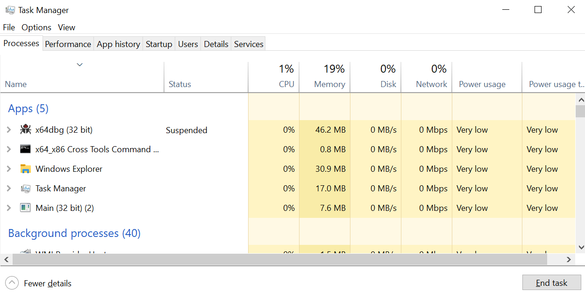

> 🔴 **Malware relevance:** This is an evasive technique that doesn't rely on detecting the debugger by name or PID — it uses the window title as a heuristic, making it harder to bypass by simply renaming the debugger process.

### Patching SuspendThread with NOPs

To neutralise this technique, patch the `SuspendThread` call so it does nothing:

1. Open `suspend-thread.exe` in x32dbg and press F9 to reach the EntryPoint

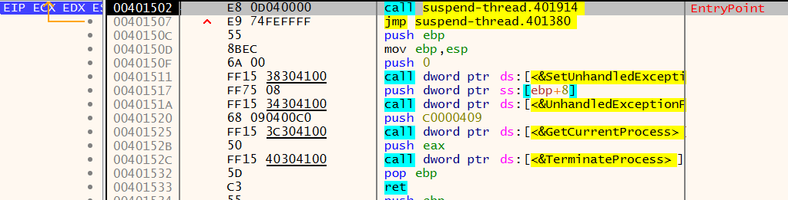

2. Right-click the main window → **Search for > Current Module > Intermodular calls**
3. Search for `SuspendThread` in the filter. Double-click the result.

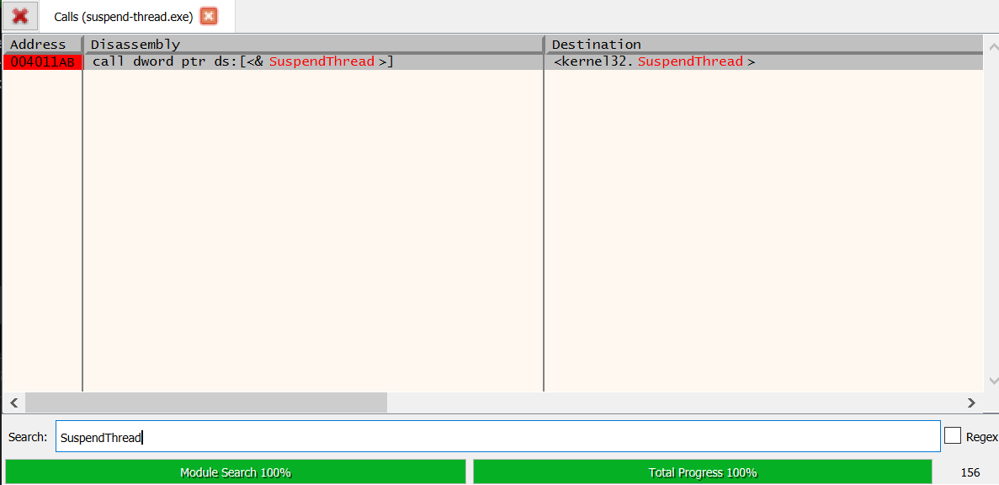

4. Right-click the `SuspendThread` line → **Binary > Fill with NOPs** → press OK

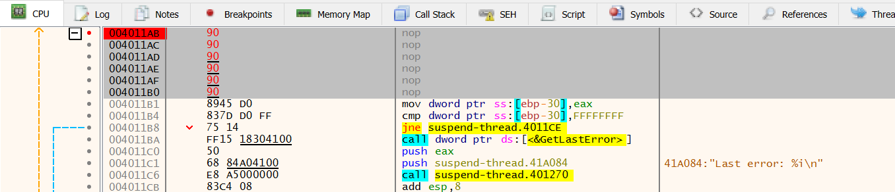

5. Press F9 — debugging continues without crashing. The console prints `"Debugger found with PID XXXX! Suspending!"` but the function does nothing.

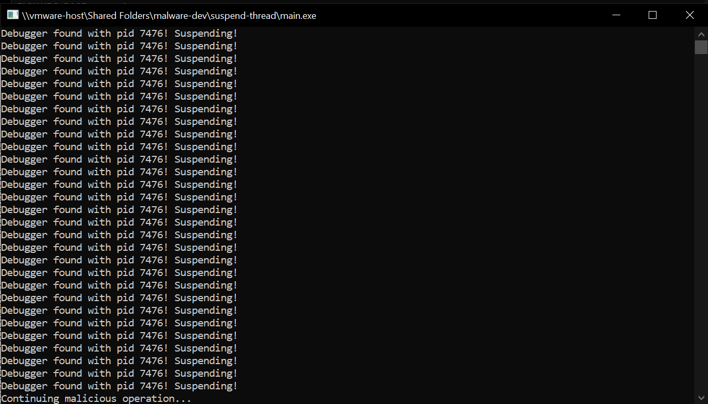

> 💡 **Tip:** Memory locations `004011AB` through `004011B0` are now all `0x90` (NOP). The `SuspendThread` call is completely skipped.

### Exporting and Importing Patches

Patches applied in x32dbg are lost when you restart the debugger. To persist them:

1. Go to **View > Patch file...** — the right panel shows all 6 patched memory locations
2. Click **Export** → confirm → save the file

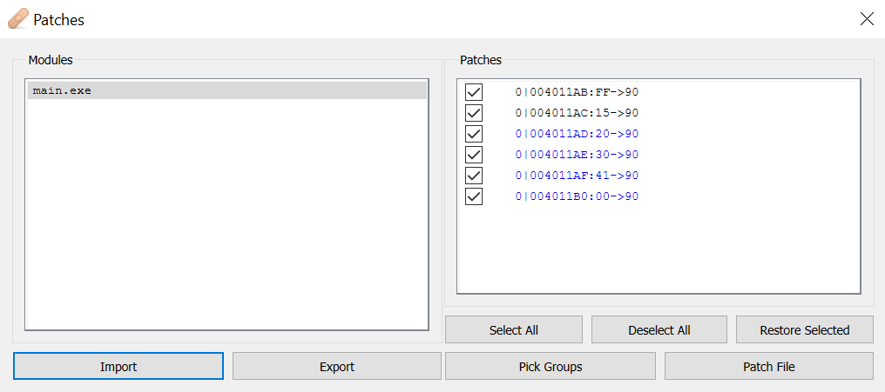

3. When you restart debugging and patches are gone, go back to **View > Patch file...** → **Import** → select the saved file

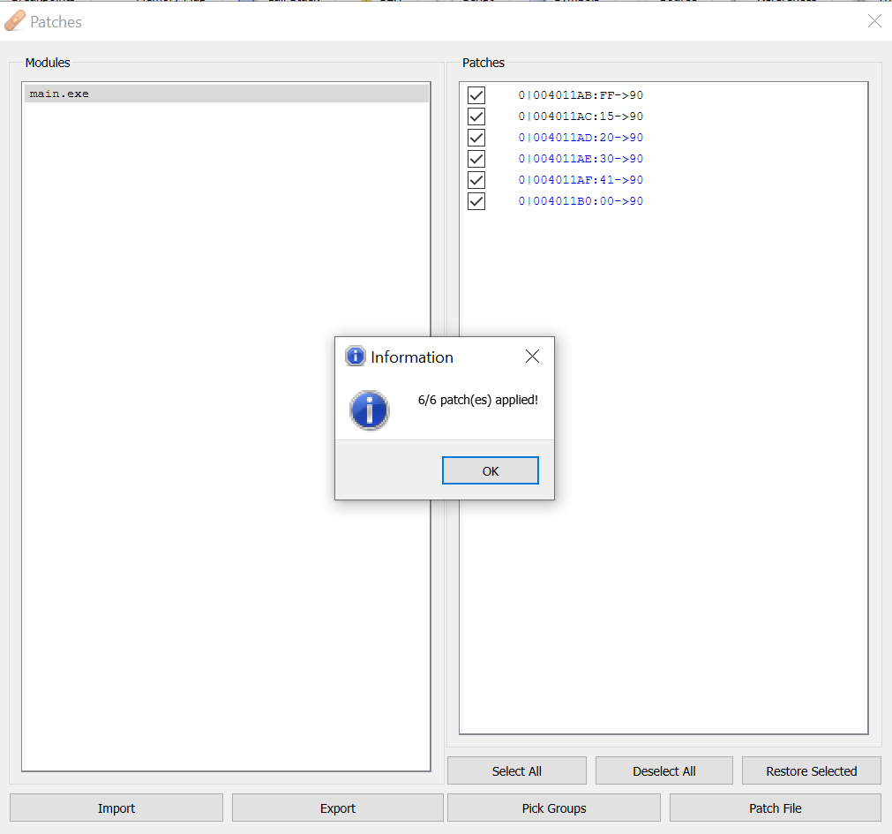

4. Press F9 — patches are re-applied automatically.

> 💡 **Tip:** Exporting patches is good practice on any sample you plan to revisit. It saves you from re-doing the same patching work across multiple sessions.

**Q: What is the Windows API function that enumerates windows on the screen so the malware can check the window name?**
```
EnumWindows
```

**Q: What is the hex value of a NOP instruction?**
```
90
```

**Q: What is the instruction found at memory location 004011CB?**
```
add esp,8
```

---

## Task 4 — VM Detection: Overview

Virtual Machines are the standard environment for malware analysis — they're isolated, snapshotable, and disposable. Malware authors know this and use VM detection to change behaviour when they suspect they're being analysed.

### Behavioural Changes When a VM is Detected

- Execute only a minimal subset of functionality
- Self-destruct (delete itself or overwrite code)
- Cause damage to obscure analyst focus
- Not execute at all

### Detection Techniques

| Technique | Detail |
|-----------|--------|
| **Process enumeration** | Uses `EnumProcesses` to look for `vmtools.exe` (VMware) or `vboxservice.exe` (VirtualBox) |
| **Registry inspection** | Checks `SOFTWARE\Microsoft\Windows\CurrentVersion\Uninstall` for installed debuggers/forensics tools |
| **Network fingerprinting** | Looks for VM-assigned MAC OUIs: `00-05-69`, `00-0c-29`, `00-1c-14`, `00-50-56` |
| **Resource checks** | Low RAM (< 8GB) may indicate a VM |
| **Peripheral detection** | Checks for connected printers — rarely configured on VMs |
| **Domain membership** | Checks `LogonServer` and `ComputerName` env variables for AD membership |
| **Timing attacks** | Measures instruction execution time — VMs are typically slower |

> 🔴 **Malware relevance:** Real-world malware commonly combines multiple techniques to improve detection accuracy. A single technique (e.g. checking RAM) is unreliable, but combining it with process enumeration and MAC fingerprinting significantly increases confidence.

### Anti-VM Hardening

Scripts like [VMwareCloak](https://github.com/d4rksystem/VMwareCloak) and [VBoxCloak](https://github.com/d4rksystem/VBoxCloak) automate the removal of VM artefacts. However, some architectural checks (like hardware-level queries) cannot be patched by scripts alone.

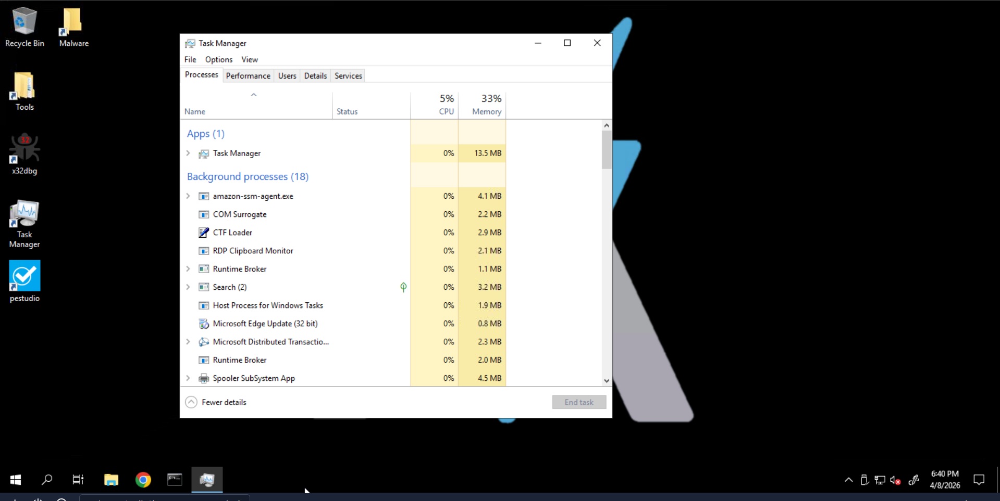

**Q: What is the name of the identifiable process used by malware to check if the machine is running inside VirtualBox?**
```
vboxservice
```

**Q: What is the OUI automatically assigned specifically to VMware?**
```
00:50:56
```

**Q: Using Task Manager, what process indicates that the machine for this room is an Amazon EC2 Virtual Machine?**
```
amazon-ssm-agent.exe
```

---

## Task 5 — VM Detection: Temperature Check

### The Technique

`Win32_TemperatureProbe` is a WMI class that queries real-time hardware temperature data via SMBIOS. In a virtualised environment, the hardware sensor is not accessible, so the query returns `Not Supported`. Malware uses this as a VM indicator.

The sample `vm-detection.exe` queries the `MSAcpi_ThermalZoneTemperature` WMI class. If no temperature data is returned (`uReturn == 0`), it knows it's in a VM and pivots to non-malicious behaviour.

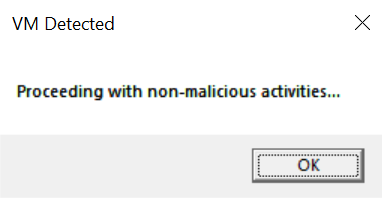

On a physical machine, the WMI query succeeds and temperature data is returned — the malware proceeds with its actual payload.

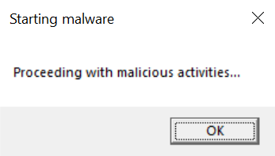

> 🔴 **Malware relevance:** Hardware-level checks like this are difficult to fake. Unlike process names or registry keys, you can't simply rename or delete a hardware sensor. This class of VM detection requires patching or redirecting execution in the debugger rather than modifying the environment.

### Bypassing: Direct Memory Manipulation

The goal is to make `uReturn == 0` evaluate to `False` so the malware doesn't exit.

1. Open `vm-detection.exe` in x32dbg, press F9 to reach EntryPoint

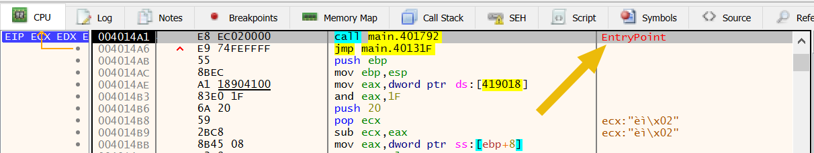

2. Press `Ctrl+G`, enter `004010E0`, press OK. Set a breakpoint with F2, then press F9.

3. The block from `004010E0` to `004010F8` corresponds to the `pEnumerator->Next(...)` call. The `uReturn` parameter is mapped to `[ebp-18]`.

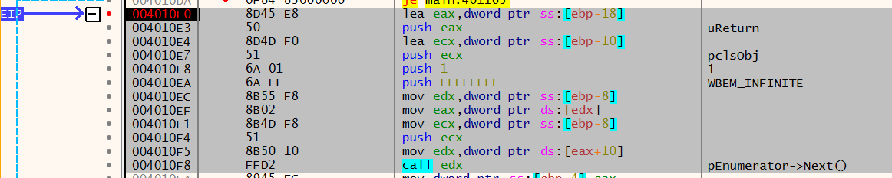

4. Step through with F8 until you reach `004010FD` (the `cmp [ebp-18], 0` instruction). Right-click the `[ebp-18]` line → **Follow in dump > [ebp-18]**

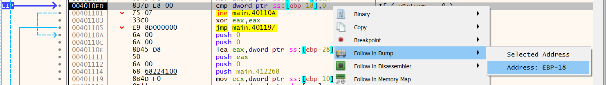

5. In the Dump 1 panel, the memory location `0019FF08` holds `uReturn` (currently `00`).

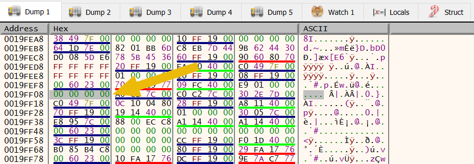

6. Double-click the `00` value → **Modify Value** → enter `01` → OK

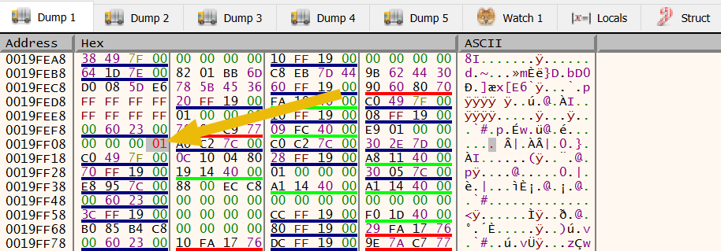

7. Press F8 — execution no longer exits at the `uReturn == 0` check.

### Bypassing: Changing EIP Directly

If the program crashes after the memory manipulation (because we skipped the intended exit path), we can jump directly to the desired instruction by modifying the EIP register.

The target: `printf("Thermal Zone Temperature: %d\n", vtProp.intVal)` at instructions `00401130`–`00401139`.

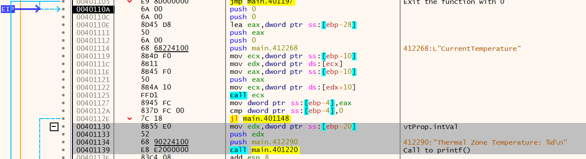

1. In the Registers panel, right-click **EIP** → **Modify Value**

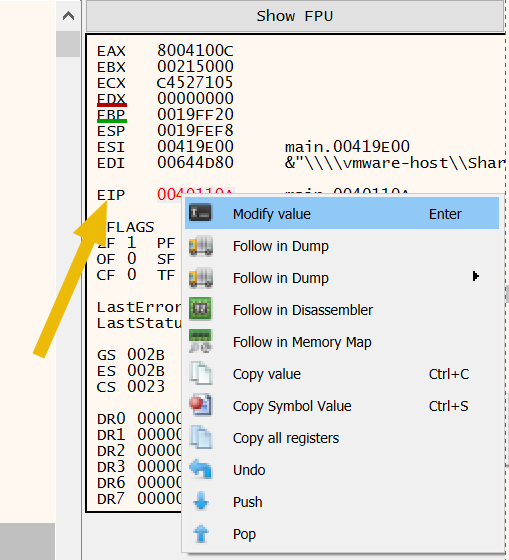

2. Enter `00401134` → OK. The EIP marker jumps to that location.

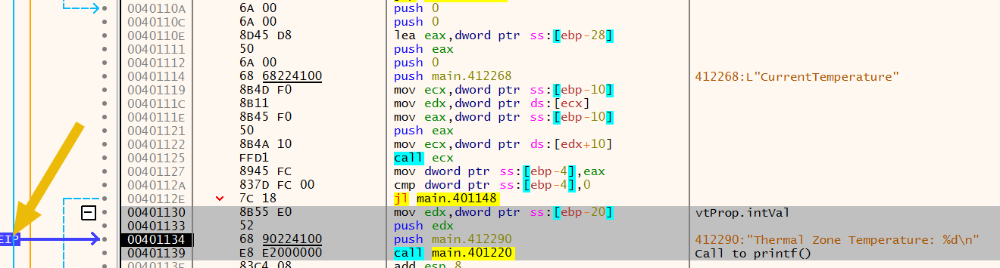

3. Press F9 — the program outputs the temperature and shows the malicious activity message box, as if running on a physical machine.

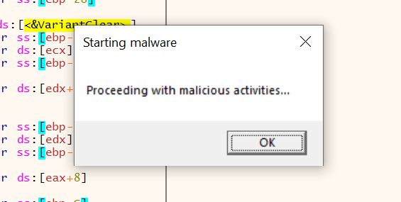

> 💡 **Tip:** Modifying EIP is one of the most powerful tools in dynamic analysis. It lets you skip entire code blocks, re-execute functions, and force execution paths that the malware would not normally take — all without touching the binary on disk.

![Memory dump showing [ebp-4] value at 0019FF1C](task5-12.png)

**Q: In the C code snippet, what is the full WQL query used to get the temperature from the Win32_TemperatureProbe class?**
```
SELECT * FROM MSAcpi_ThermalZoneTemperature
```

**Q: What register holds the memory address that tells the debugger what instruction to execute next?**
```
EIP
```

**Q: Before uReturn is compared to zero, what is the memory location pointed to by [ebp-4]?**
```
0019FF1C
```

---

## Task 6 — Packers: Overview

### Obfuscation Techniques

Malware uses obfuscation to make static analysis and signature-based detection ineffective:

| Technique | Description |
|-----------|-------------|
| **Encoding** | XOR, Base64 encoding of strings, C2 domains, config data |
| **Encryption** | Symmetric or asymmetric encryption of communications and payloads |
| **Code obfuscation** | Renaming functions, splitting code, altering syntax/structure |

### What Are Packers?

Packers compress and encrypt an executable, embedding it inside a wrapper executable. When the packed file runs, the wrapper decrypts and decompresses the original payload in memory before executing it.

Benefits for malware authors:
- Reduced file size for easier distribution
- Encrypted content defeats static analysis and signature detection
- Many packers include additional anti-debugging and anti-analysis features

Common packers seen in the wild:

| Packer | Notes |
|--------|-------|
| UPX | Open-source, most common, easiest to unpack |
| Themida | Commercial, used by both legitimate software and malware |
| VMProtect | Converts code to custom VM bytecode |
| ASPack | Compression-focused packer |
| PELock | License protection + packing |
| hXOR-Packer | XOR-based open-source packer |

> 🔴 **Malware relevance:** A packed sample essentially reveals nothing useful to static analysis. You cannot extract meaningful strings, imports, or code structure until it is unpacked. Identifying the packer is always the first step — even that limited information can guide your unpacking approach.

**Q: What is the decoded string of the base64 encoded string `VGhpcyBpcyBhIEJBU0U2NCBlbmNvZGVkIHN0cmluZy4=`?**
```
This is a BASE64 encoded string.
```

> 💡 **Tip:** Use [CyberChef](https://gchq.github.io/CyberChef/) with the "From Base64" operation for quick decoding.

---

## Task 7 — Identifying and Unpacking

### Identifying the Packer

#### DetectItEasy (DIE)

Right-click `packed.exe` → **Detect it easy (DIE)**. DIE uses packer signatures to identify the tool used.

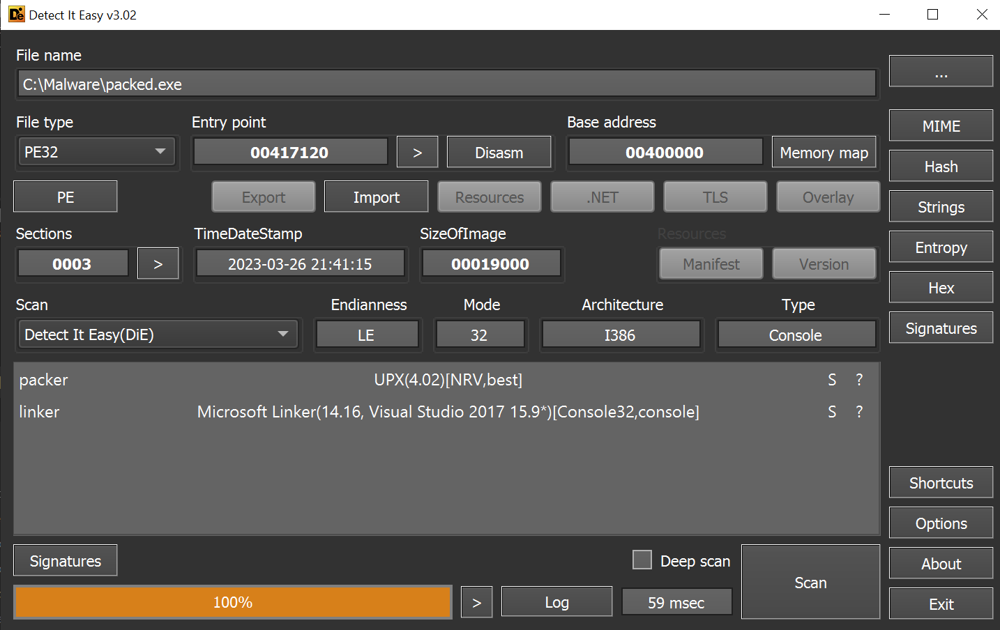

Click **Entropy** to open the entropy view. High entropy sections indicate packed/encrypted content.

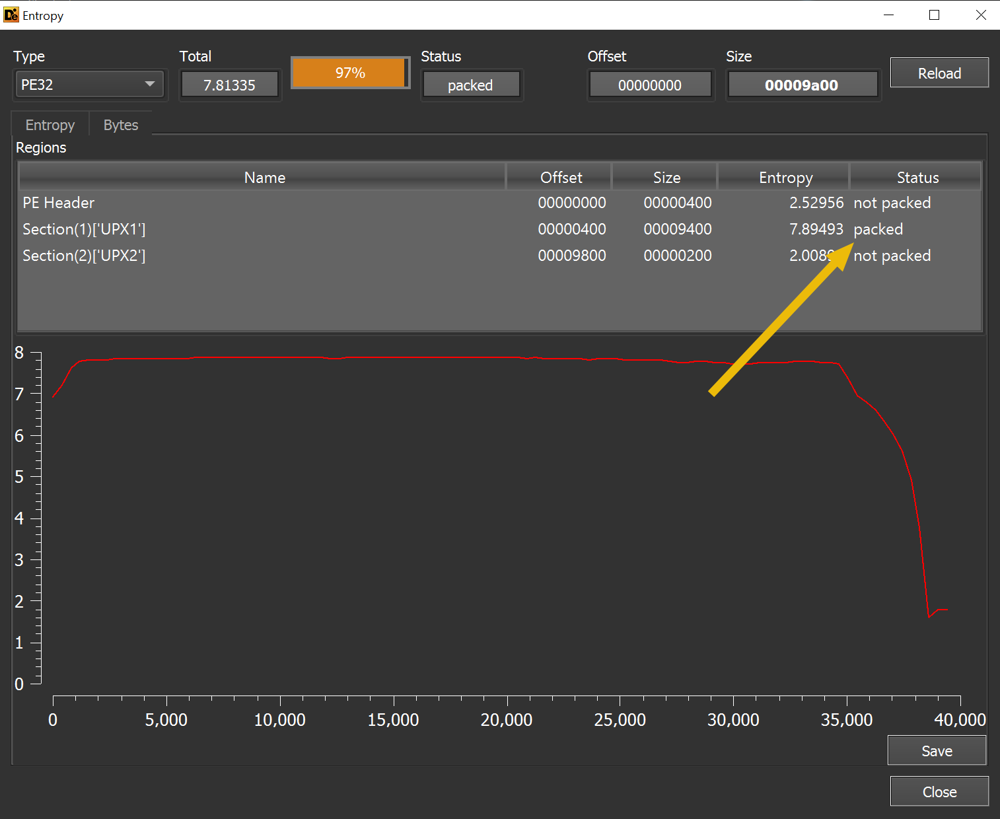

#### PEStudio

Open `packed.exe` in PEStudio → click **sections (self-modifying)** in the left panel.

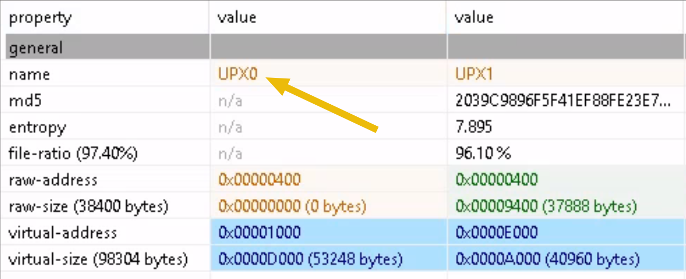

Standard PE section names are `.text`, `.data`, and `.rsrc`. The presence of `UPX0`, `UPX1`, and `UPX2` is a clear artefact left by the UPX packer.

> 💡 **Tip:** Not all packers rename sections. But checking section names is always a fast first step — it costs nothing and sometimes immediately identifies the packer.

### Automated Unpacking

Once the packer is identified, use the appropriate tool:

| Packer | Unpacking Approach |
|--------|--------------------|
| UPX | `upx -d packed.exe` (same tool used for packing) |
| Themida | [Magicmida](https://github.com/Hendi48/Magicmida) |
| Enigma Protector | [OllyDbg script](https://github.com/ThomasThelen/OllyDbg-Scripts) |
| MPress | [RetDec unpacker plugin](https://github.com/avast/retdec) |
| Unknown / modified | [unpac.me](https://www.unpac.me/) — automated cloud unpacking service |

### Manual Unpacking and Dumping

When automated tools fail, execute the malware in a debugger and dump it from memory once fully unpacked.

For this UPX sample:

1. Open `packed.exe` in x32dbg. Press `Ctrl+G`, enter `004172D4`, set a breakpoint with F2, then press F9 twice to reach the breakpoint.

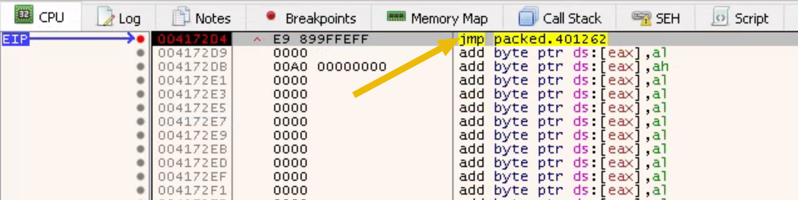

2. Press F7 to step into the `jmp` — this lands at `00401262`, the Original Entry Point (OEP) of the legitimate unpacked program.

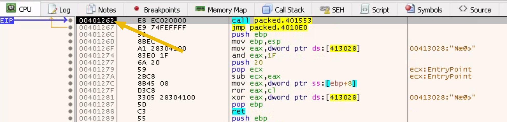

> 🔴 **Malware relevance:** At this point, the packer has finished its job. The legitimate payload is now fully decrypted in memory. `004172D4` is the tail of the UPX stub — reaching it means unpacking is complete. Other packers use different approaches, so locating the OEP varies per sample.

3. Go to **Plugins > Scylla** → click **Dump**. Save the dump to the same directory as `packed.exe`.

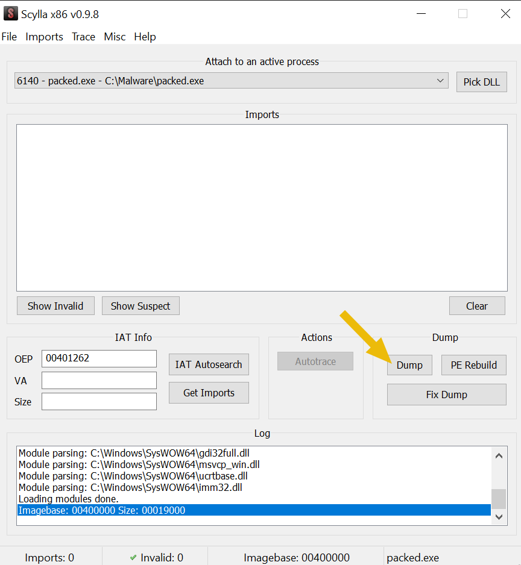

4. Running the dumped file fails — the IAT (Import Address Table) is not yet fixed.

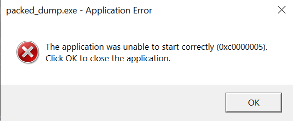

5. In Scylla, click **IAT Autosearch**. If prompted about the advanced result, select **No**.

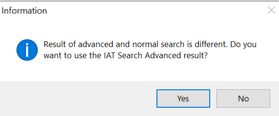

6. Click **Get Imports** — the list populates with all DLLs used by the unpacked program.

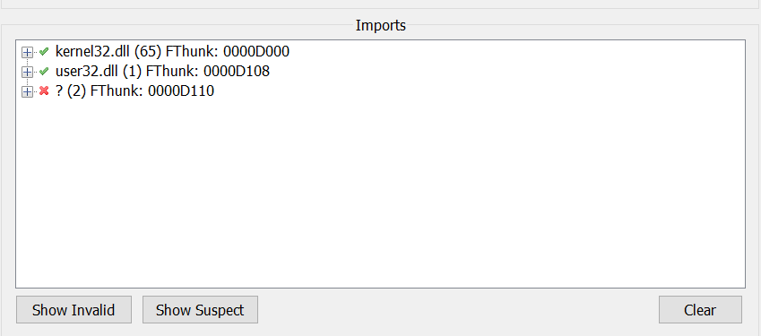

7. Delete any invalid entries (marked with `X`) by right-clicking → **Cut thunk**. Then click **Fix Dump** and select your previously saved dump file.

8. A new file with `_SCY` appended to the filename is created. This is the fully repaired, unpacked executable.

9. Open the `_SCY` file in DIE — the packer is no longer detected.

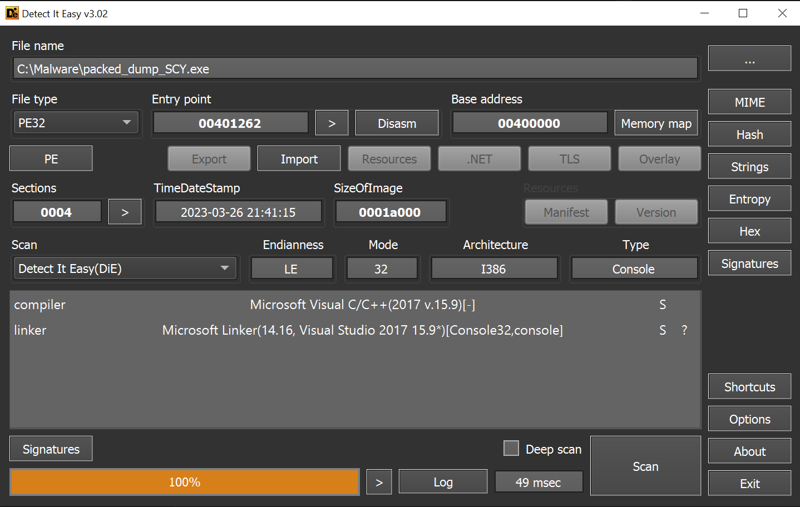

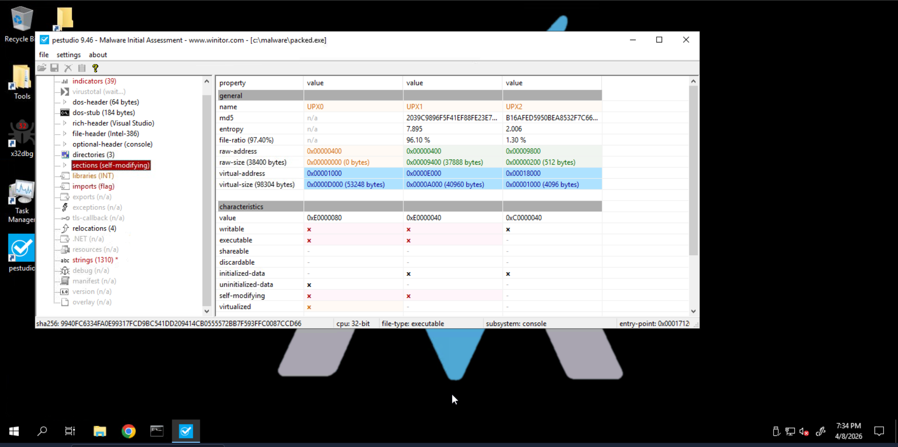

> 💡 **Tip:** Always verify your unpacked dump with both DIE and PEStudio. A successful unpack should show normal section names (`.text`, `.data`, `.rsrc`) and a clean entropy profile.

**Q: According to DetectItEasy, what is the version of the Microsoft Linker used for linking packed.exe?**
```
14.16
```

**Q: According to pestudio, what is the entropy of the UPX2 section of packed.exe?**
```
2.006
```

---

## Key Takeaways

- **Anti-debugging** techniques like `SuspendThread` enumerate system threads and freeze any process with debugger-like window titles — NOP patching neutralises the call; export patches to avoid repeating the work
- **`EnumWindows`** is used to iterate visible window titles and identify debugger processes by name
- **VM detection** techniques range from trivial (process names, MAC OUIs) to architectural (hardware temperature via WMI) — the latter cannot be patched by environment hardening alone
- **Direct memory manipulation** in x32dbg lets you change variable values at runtime to influence conditional logic without modifying the binary on disk
- **Modifying EIP** allows jumping to any arbitrary instruction, bypassing entire code blocks — one of the most versatile techniques in dynamic analysis
- **Packers** encrypt and compress malware, rendering static analysis and signature detection unreliable until unpacked
- **DIE** identifies packer signatures; **PEStudio** reveals packer artefacts in section names and entropy
- **Manual unpacking** with x32dbg + Scylla involves locating the OEP, dumping from memory, running IAT Autosearch, and fixing the dump — UPX is the simplest case; commercial packers like Themida are significantly more involved

---

*Write-up by [OPT4RUN](https://tryhackme.com/p/OPT4RUN)*