| Field | Details |
|-------|---------|
| **Room** | Basic Dynamic Analysis |
| **Platform** | TryHackMe |
| **Path** | SOC Level 2 |
| **Module** | Malware Analysis |
| **Difficulty** | Medium |
| **Category** | Malware Analysis |
| **Room Link** | [tryhackme.com/room/basicdynamicanalysis](https://tryhackme.com/room/basicdynamicanalysis) |
| **Author** | [OPT4RUN](https://tryhackme.com/p/OPT4RUN) |

---

## Overview

Where static analysis examines a binary without running it, dynamic analysis takes the opposite approach — execute the malware in a controlled environment and observe what it actually does. No matter how obfuscated or packed a sample is, it must eventually execute, and when it does, it leaves traces. This room covers the foundational toolset for that process: sandboxing, process monitoring, API inspection, and registry diffing.

From a SOC/blue team perspective, these techniques directly inform detection engineering. Understanding what registry keys a piece of malware creates, which APIs it calls, and how it tries to masquerade as a legitimate process translates directly into IOC extraction and SIEM/EDR rule development.

**Tools covered:** ProcMon, API Logger, API Monitor, Process Explorer (ProcExp), Regshot — all part of or complementary to the Sysinternals suite.

---

## Task 1 — Introduction

Dynamic analysis complements the static techniques covered in the Basic Static Analysis room. Malware can hide strings, pack code, and obfuscate imports to defeat static analysis — but it cannot hide from its own runtime behaviour. When it executes, it must interact with the OS, make network connections, write files, and touch the registry. This room teaches how to capture and interpret those interactions.

**Learning objectives:** sandboxing, ProcMon, API Logger, API Monitor, Process Explorer, Regshot.

**No questions.**

---

## Task 2 — Sandboxing

A sandbox is a purpose-built environment for executing untrusted code safely. For dynamic malware analysis, this means more than just "run it in a VM" — it requires a deliberate setup with four key components.

**Isolated machine** — A VM not connected to live or production systems, dedicated solely to malware analysis.

**Snapshot capability** — The ability to save a clean state and revert after every sample. This is critical: analysis of sample B must not be contaminated by infection from sample A. VMware Player lacks snapshot support, making it unsuitable. VMware Workstation and VirtualBox both support snapshots; VirtualBox is free while Workstation requires a license.

**Monitoring tools** — Either automated (e.g. Cuckoo's `cuckoomon`) or manual (the tools covered in this room). Tools must be installed before the clean snapshot is taken.

**File-sharing mechanism** — A way to get the malware sample into the VM and extract analysis reports. Common options include shared folders, ISO mounting, and clipboard. The more isolated the sharing method, the safer — shared directories should be unmounted during execution to prevent ransomware from encrypting them.

🔴 **Malware relevance:** The OS of the sandbox VM must match the target OS of the malware being analysed. Linux malware must be executed on a Linux VM; running it in a Windows VM will yield no useful behavioural data.

**Q: If an analyst wants to analyze Linux malware, what OS should their sandbox's Virtual Machine have?**
Linux

---

## Task 3 — ProcMon

Process Monitor (ProcMon) is a Sysinternals utility that captures real-time events across the filesystem, registry, network, and process/thread activity system-wide. It is one of the most versatile tools in the dynamic analysis toolkit.

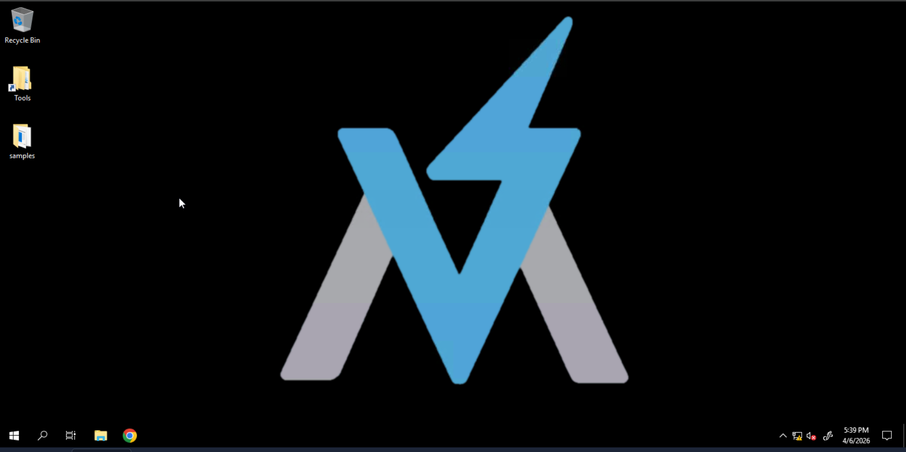

Once launched, ProcMon presents a live event stream with labelled controls:

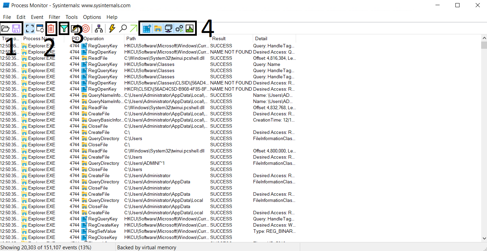

The key controls are: **1** Open/Save (load or export event logs), **2** Clear (wipe current events — useful to clear noise before executing a sample), **3** Filter (define conditions to narrow results), **4** Event type toggles (Registry, FileSystem, Network, Process/Thread, Profiling).

### Filtering Events

ProcMon captures everything on the system, which quickly becomes overwhelming. Effective filtering is essential for isolating malware activity. Right-clicking a value in any column exposes include/exclude options for that specific value.

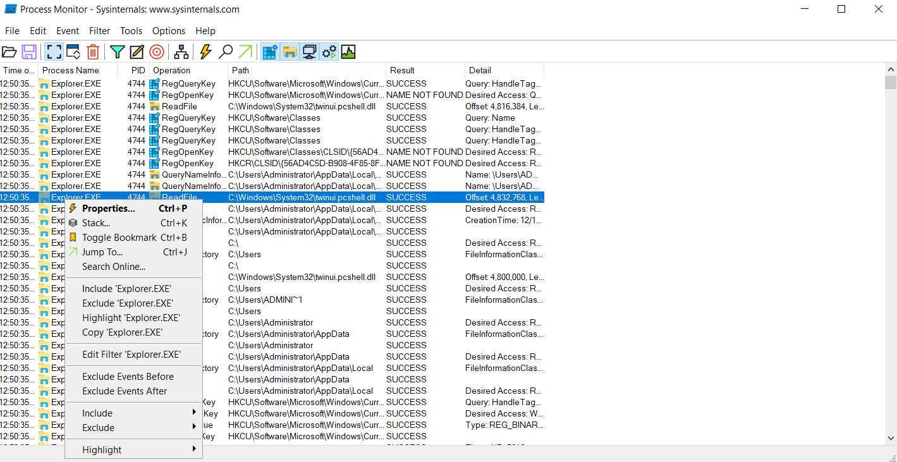

Multiple filters stack — for example, including `1.exe` by process name and then including only `TCP` operations isolates network activity from that specific process.

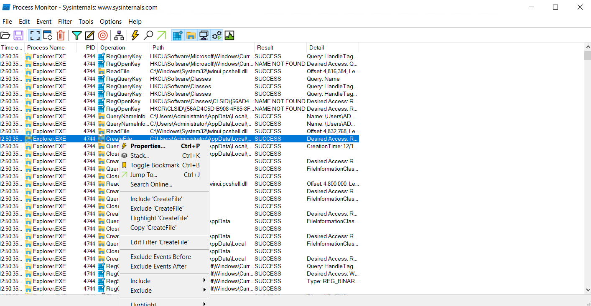

### Advanced Filtering

The Filter menu opens a dedicated filter window where conditions can be set as `Column → Relation → Value → Action`. Checked filters are active; unchecked are ignored.

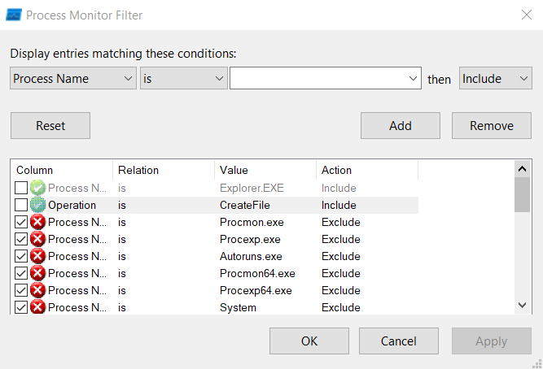

🔴 **Malware relevance:** Note the preset exclusions for `Procmon.exe`, `Procexp.exe`, and `Autoruns.exe`. Some malware actively checks for running analysis tools and exits if found. These exclusions prevent ProcMon from showing events about itself — but they don't hide ProcMon's presence from the malware.

### Process Tree

The process tree icon opens a parent-child view of all processes seen during the capture window, showing image paths, lifetimes, and ownership.

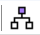

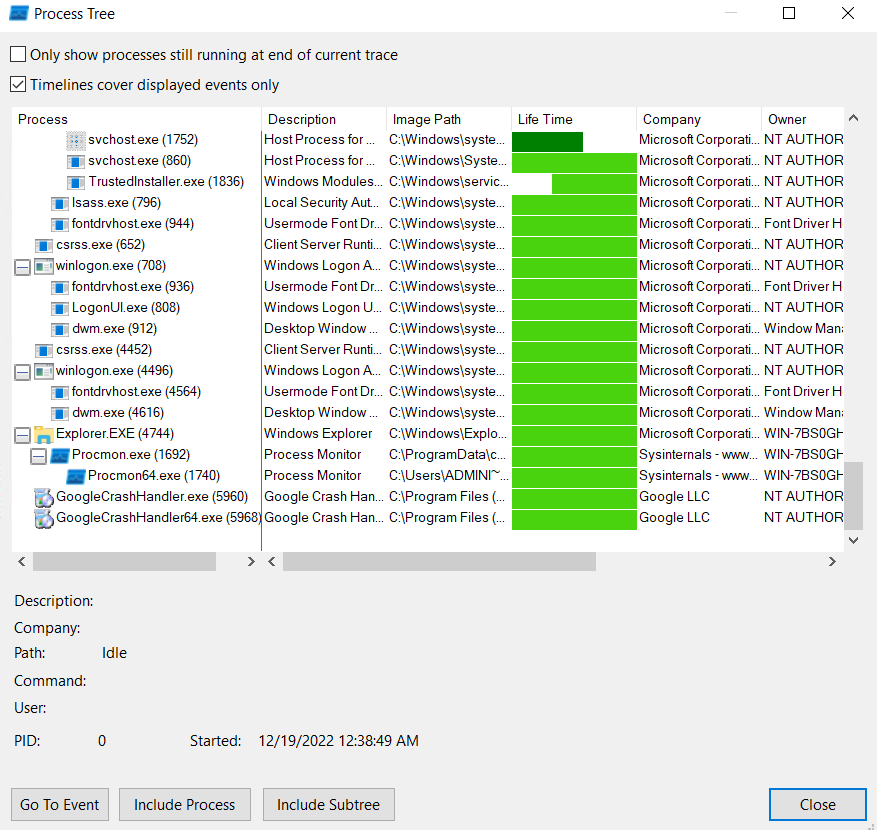

### Hands-on: Analysing `1.exe`

Filtering ProcMon to `Process Name is 1.exe` and looking at network events reveals the sample actively making outbound TCP connections. Opening the Event Properties for the first network event shows the full connection details including the destination.

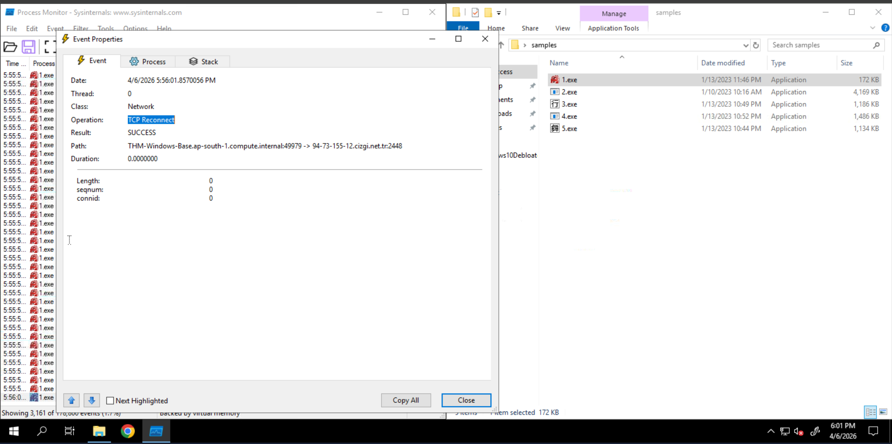

Switching the filter to show Process activity (specifically `Process Start`) reveals the first child process spawned by the sample.

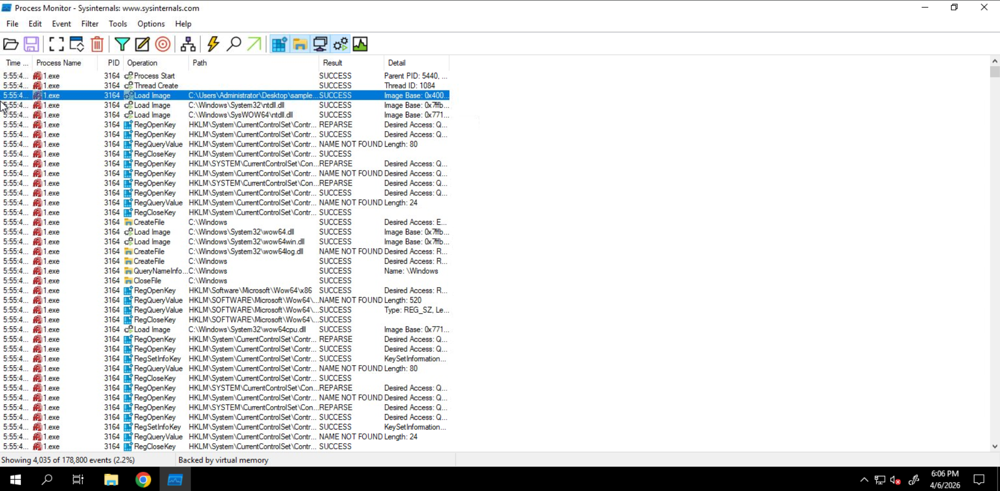

**Q: Monitor the sample `~Desktop\Samples\1.exe` using ProcMon. This sample makes a few network connections. What is the first URL on which a network connection is made?**
94-73-155-12.cizgi.net.tr:2448

**Q: What network operation is performed on the above-mentioned URL?**
TCP Reconnect

**Q: What is the name with the complete full path of the first process created by this sample?**
C:\Users\Administrator\Desktop\samples\1.exe

> ⚠️ Revert the VM to a clean snapshot before proceeding to the next task.

---

## Task 4 — API Logger and API Monitor

The Windows OS provides a comprehensive API for all system interactions — file creation, process spawning, network connections, registry operations, and more. Monitoring which APIs a malware sample calls gives direct insight into its behaviour without needing to reverse the binary's logic.

### API Logger

API Logger is a lightweight tool that hooks into a target process and logs every API call it makes, along with basic metadata in the `msg` field.

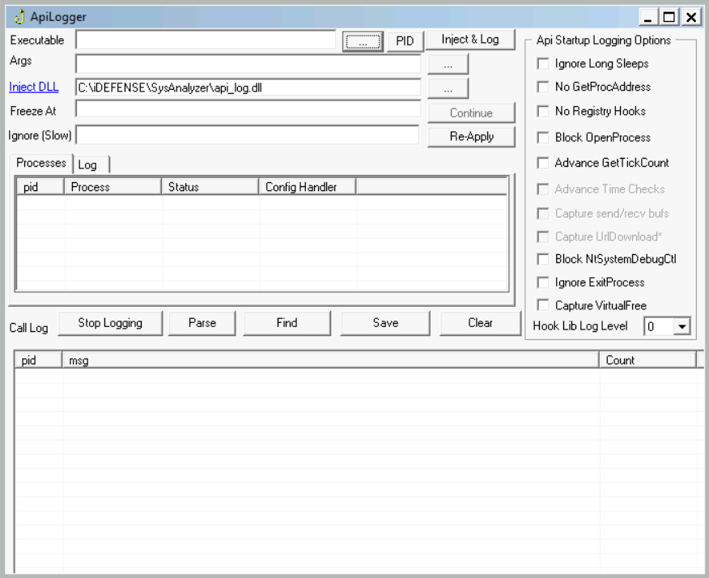

Selecting an executable and clicking **Inject & Log** starts the logging process. The upper pane lists monitored processes; the lower pane streams the API call log.

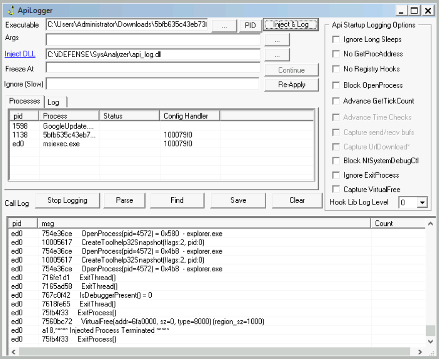

The **PID** button allows attaching to an already-running process rather than launching a new one.

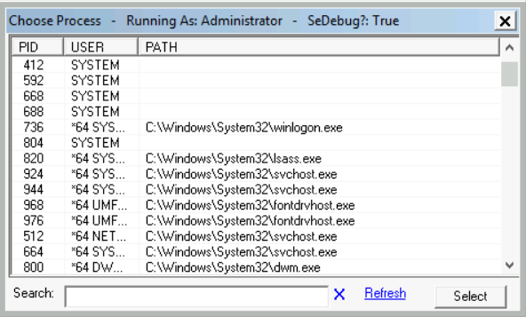

### API Monitor

API Monitor provides significantly richer information — parameters (pre- and post-call), return values, error codes, hex buffers, and call stacks. It comes in 32-bit and 64-bit variants.

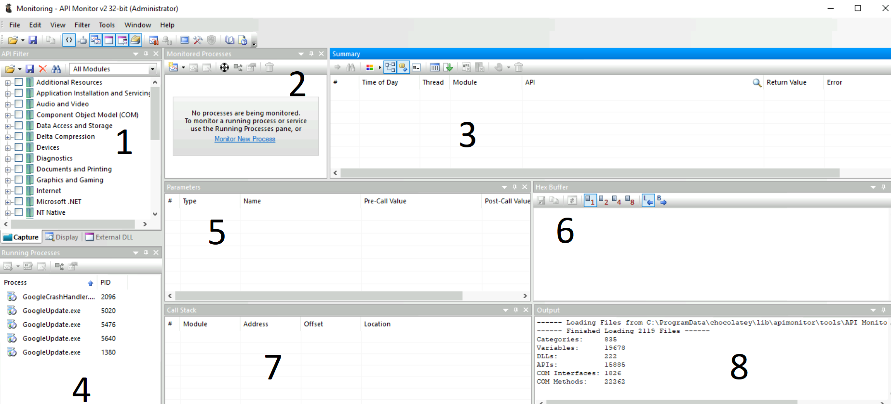

Clicking **Monitor New Process** opens a dialog to specify the executable, optional arguments, working directory, and attach method.

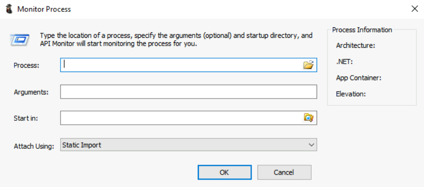

With a process loaded, all panes populate. The Summary tab shows each API call with its module, thread, return value, and error code. The Parameters tab shows argument values before and after the call.

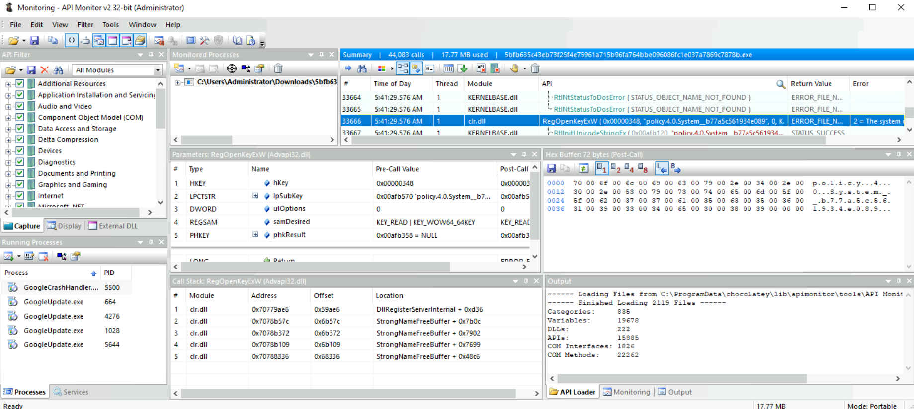

💡 **Tip:** Use API Logger for a quick overview of what APIs a sample is calling. Switch to API Monitor when you need to inspect specific call parameters — for example, to see the exact filename passed to `CreateFileA` or the server address passed to `InternetConnectW`.

### Hands-on: Analysing `1.exe`

Running `1.exe` through API Logger and scanning the log reveals the sample calling `CreateFileA` with `C:\myapp.exe` as the target path — indicating it drops a file to disk.

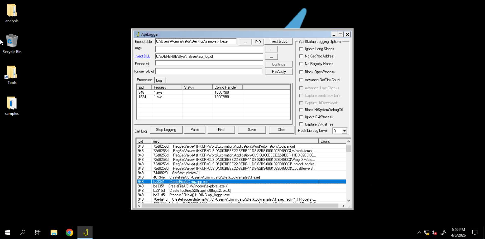

Searching the log for the IP from Task 3 (`94.73.155.12`) surfaces the API responsible for the network connection.

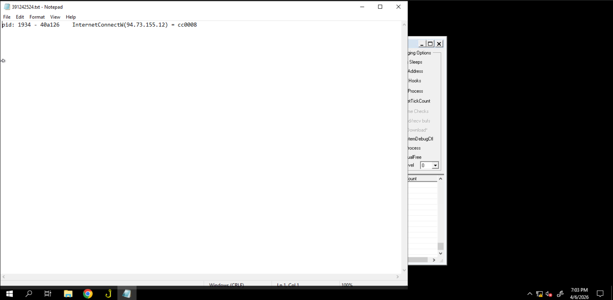

After the initial burst of activity, the sample's output slows significantly. Inspecting the log around that point shows repeated `Sleep` calls — a common technique malware uses to delay activity or evade sandboxes with short execution windows.

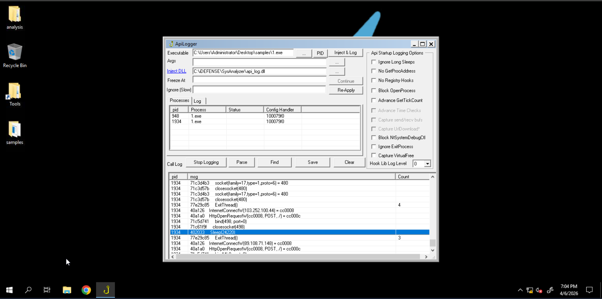

🔴 **Malware relevance:** The `Sleep` API is heavily abused by malware to bypass automated sandboxes. Many sandboxes enforce a maximum execution time; a sample that sleeps for long periods may never reach its malicious payload within that window. Seeing repeated `Sleep` calls is a red flag worth noting in any analysis report.

**Q: The sample `~Desktop\samples\1.exe` creates a file in the `C:\` directory. What is the name with the full path of this file?**
C:\myapp.exe

**Q: What API is used to create this file?**
CreateFileA

**Q: In Question 1 of the previous task, we identified a URL to which a network connection was made. What API call was used to make this connection?**
InternetConnectW

**Q: We noticed in the previous task that after some time, the sample's activity slowed down such that there was not much being reported against the sample. Can you look at the API calls and see what API call might be responsible for it?**
Sleep

---

## Task 5 — Process Explorer

Process Explorer (ProcExp) is an advanced process viewer from Sysinternals — think Task Manager with full process tree visibility, handle/DLL/thread inspection, and signature verification. It is particularly useful for detecting two malware evasion techniques: **process masquerading** and **process hollowing**.

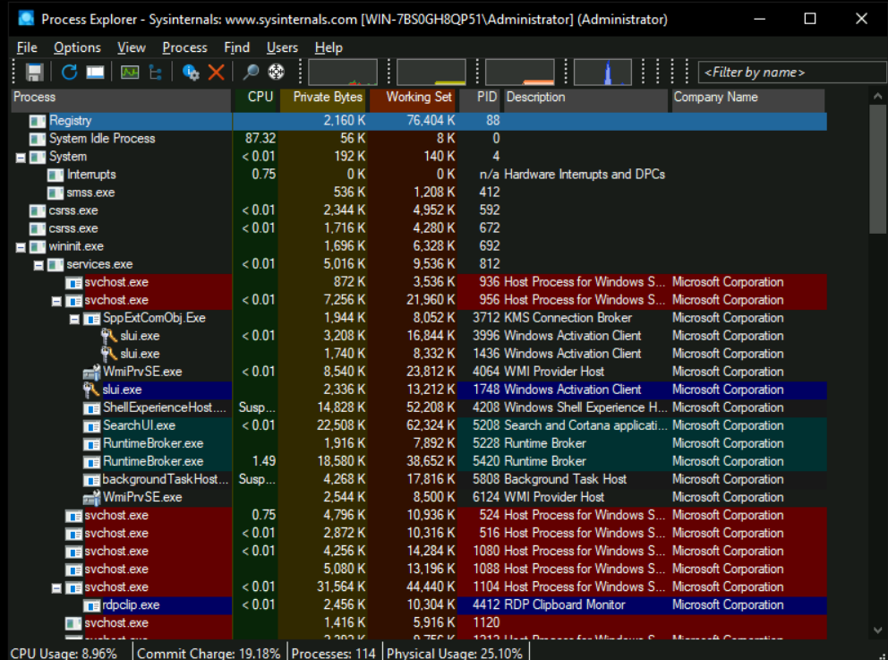

Enabling the lower pane (View menu) splits the display: the upper pane shows the process tree; the lower pane shows handles, DLLs, or threads for the selected process. Handles reveal which resources a process has open — files, mutexes, registry keys, other processes, and threads.

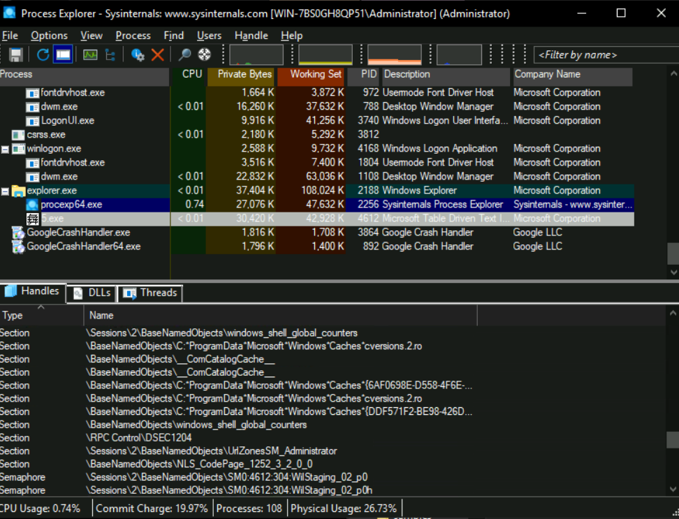

🔴 **Malware relevance:** If a process holds an open handle to another process or its threads, it may be injecting code into it. Mutexes (listed as Mutant type in the handles pane) are frequently created by malware as a mechanism to ensure only one instance runs at a time — making them useful, stable IOCs.

### Process Masquerading

Malware sometimes names itself after legitimate Windows processes (e.g. `svchost.exe`, `lsass.exe`) or uses metadata that claims a Microsoft identity. The **Image** tab in process Properties → **Verify** button checks whether the on-disk executable is genuinely signed by the claimed organisation.

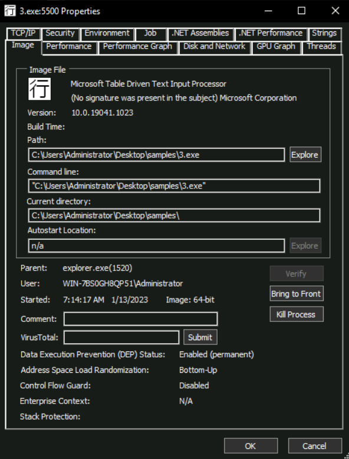

The text `(No signature was present in the subject) Microsoft Corporation` means the binary claims to be Microsoft software but is not digitally signed — a strong masquerading indicator.

> ⚠️ Signature verification only applies to the on-disk image. A legitimately signed process that has been hollowed will still pass verification here.

### Process Hollowing

Process hollowing involves launching a legitimate process (e.g. `svchost.exe`), unmapping its code from memory, and injecting malicious code in its place. The process tree still shows a trusted name, but it's running attacker code.

ProcExp exposes this via the **Strings** tab in process Properties. Comparing **Image** strings (from the on-disk binary) against **Memory** strings (from the live process) reveals discrepancies if hollowing has occurred.

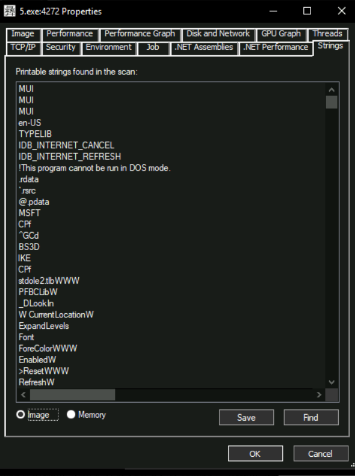

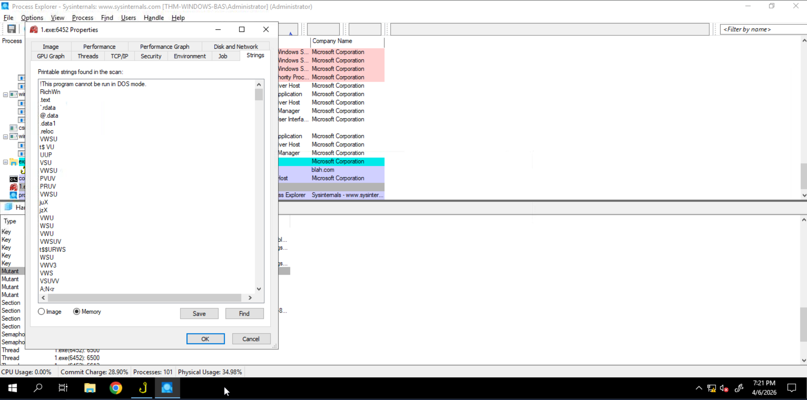

A significant mismatch between Image and Memory strings confirms the process in memory is not the same as what's stored on disk — classic process hollowing.

### Hands-on: Analysing `1.exe`

With `1.exe` running, the Handles pane for the process lists its mutexes. The first Mutant-type handle visible is the mutex created by the sample.

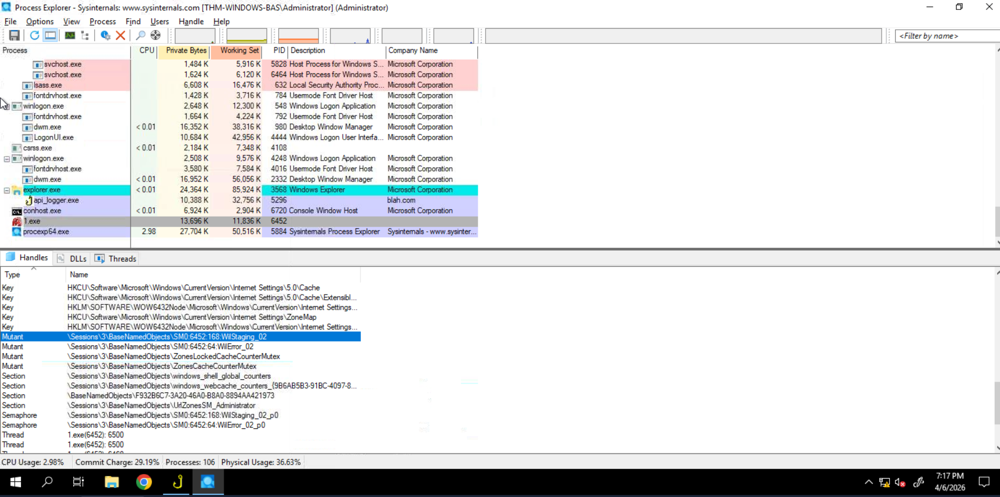

Opening Properties → Image tab and clicking Verify shows no valid signature, confirming the binary is not signed by any known organisation.

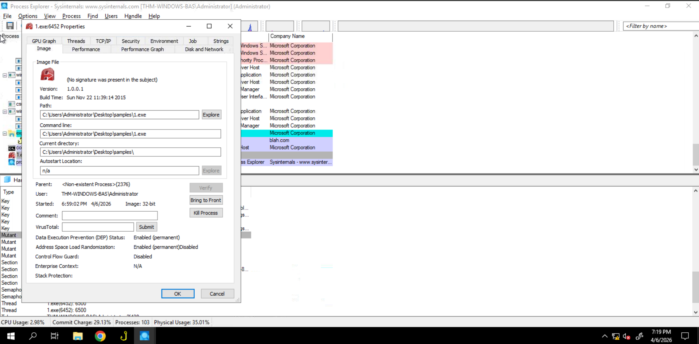

Comparing the Strings tab with Image vs Memory selected confirms the on-disk and in-memory content are substantially different.

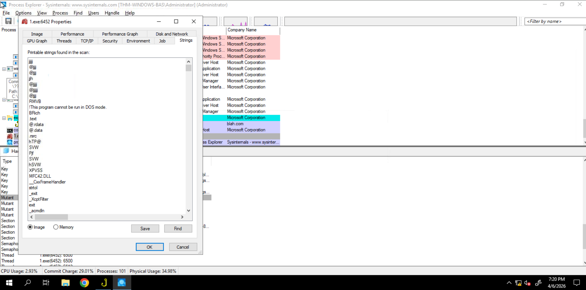

**Q: What is the name of the first Mutex created by the sample `~Desktop\samples\1.exe`? If there are numbers in the name of the Mutex, replace them with X.**
\Sessions\X\BaseNamedObjects\SMX:XXXX:XXX:WilStaging_XX

**Q: Is the file signed by a known organization? Answer with Y for Yes and N for No.**
N

**Q: Is the process in the memory the same as the process on disk? Answer with Y for Yes and N for No.**
N

> ⚠️ Revert the VM to a clean snapshot before proceeding to the next task.

---

## Task 6 — Regshot

Regshot takes a before-and-after snapshot of the registry (and optionally the filesystem) and diffs them to show exactly what a malware sample added, deleted, or modified. Unlike ProcMon, Regshot does not need to be running during malware execution — it only needs to be present for the two snapshot moments.

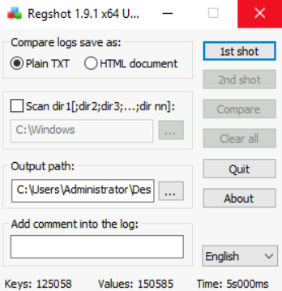

### Workflow

**Step 1 — Take the 1st shot** before executing any malware. Regshot will prompt whether to take a shot only or take and save.

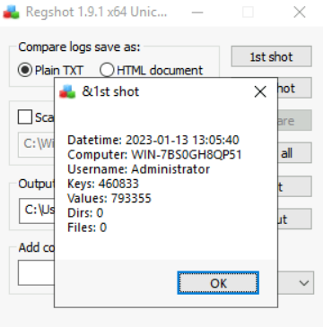

**Step 2 — Execute the malware** and allow it sufficient time to complete its activity.

**Step 3 — Take the 2nd shot** once the sample has run.

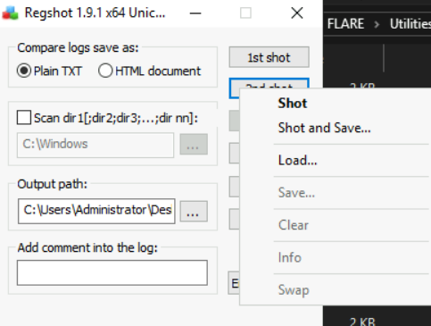

**Step 4 — Compare.** Regshot presents a summary of all changes.

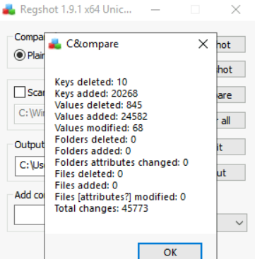

**Step 5 — Output the results** (Compare → Output) to get the full diff as a text file.

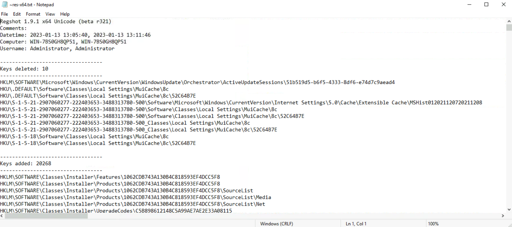

🔴 **Malware relevance:** Regshot's key advantage over ProcMon for registry analysis is that it requires no active monitoring process during execution. Malware that terminates when it detects ProcMon or API Monitor running will still leave registry traces that Regshot captures. The downside is no filtering — any background system activity between the two shots will appear in the diff as false positives, so the VM should be as quiet as possible during analysis.

### Hands-on: Analysing `3.exe`

Running `3.exe` between the two shots and comparing the output reveals registry values added by the sample. Searching through the Values added section of the output identifies an entry under the AppCompatFlags Compatibility Assistant hive that records the full path of the executed sample.

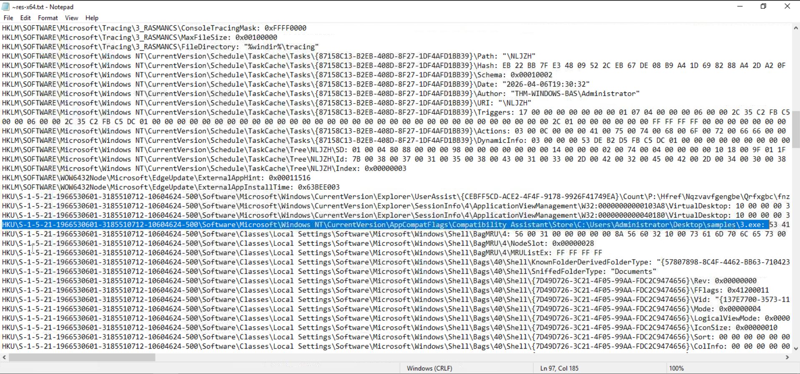

🔴 **Malware relevance:** The `AppCompatFlags\Compatibility Assistant\Store` key is written by Windows automatically when a program runs for the first time — it is not something the malware intentionally creates. However, it is a reliable execution artefact and a useful IOC for confirming that a binary was executed on a system, even if it has since been deleted.

**Q: Analyze the sample `~Desktop\Samples\3.exe` using Regshot. There is a registry value added that contains the path of the sample in the format `HKU\S-X-X-XX-XXXXXXXXXX-XXXXXXXXXX-XXXXXXXX-XXX\`. What is the path of that value after the format mentioned here?**
Software\Microsoft\Windows NT\CurrentVersion\AppCompatFlags\Compatibility Assistant\Store\C:\Users\Administrator\Desktop\samples\3.exe

---

## Task 7 — Conclusion

No questions. The room wraps up with a summary of what was covered and a note that more advanced anti-analysis techniques (packing, anti-debugging, evasion) will be addressed in upcoming rooms.

---

## Key Takeaways

- A proper malware analysis sandbox requires isolation, snapshot capability, monitoring tools, and a safe file-sharing mechanism — and the VM OS must match the malware's target platform.
- **ProcMon** captures all system activity in real time. Filtering by process name is essential to isolate the sample's behaviour from background noise. The process tree shows parent-child relationships that can reveal spawned processes.
- **API Logger** provides a quick, lightweight view of API calls. **API Monitor** provides richer parameter-level detail including pre/post call values, return codes, and call stacks. Choose based on the depth of analysis required.
- **Process Explorer** is the go-to tool for detecting masquerading (unsigned binaries claiming a known identity) and process hollowing (Image vs Memory string divergence). Mutexes visible in the Handles pane are reliable, stable IOCs.
- **Regshot** diffs the registry before and after execution without needing to run during the malware's activity — making it resilient against tools that detect and evade active monitoring processes.
- `Sleep` calls in API logs are a sandbox evasion signal. Long sleep periods can push malicious activity beyond automated sandbox execution windows.
- `AppCompatFlags\Compatibility Assistant\Store` entries confirm execution of a binary and persist as useful forensic artefacts even if the malware is removed.

---

*Write-up by [OPT4RUN](https://tryhackme.com/p/OPT4RUN)*
