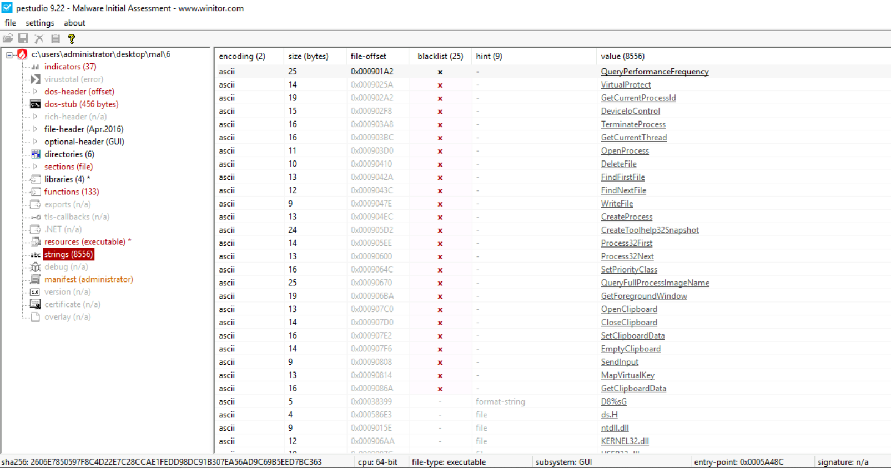
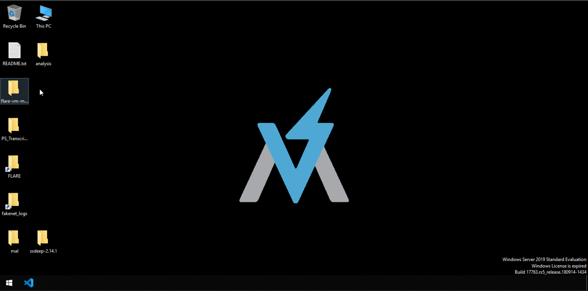
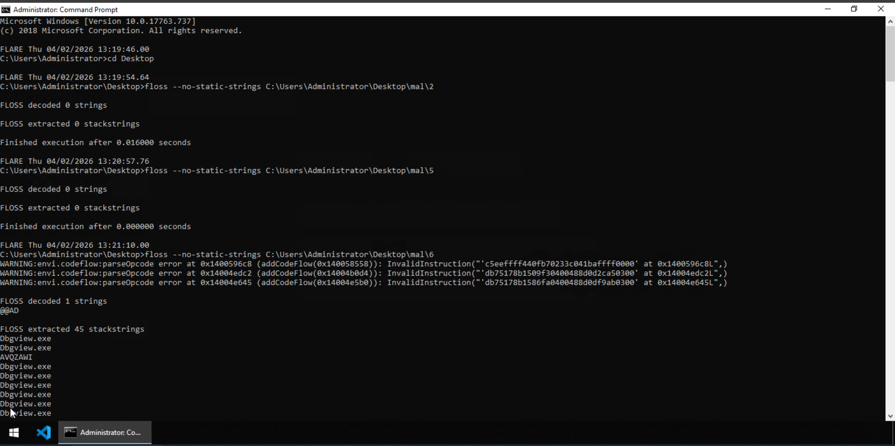
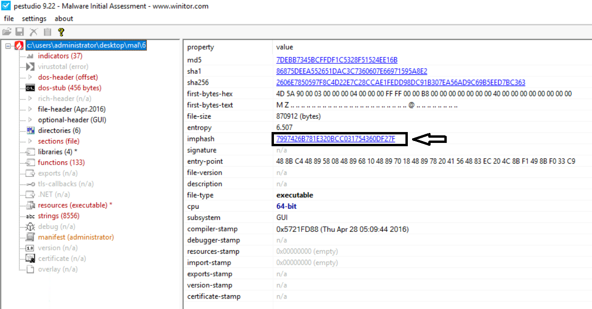
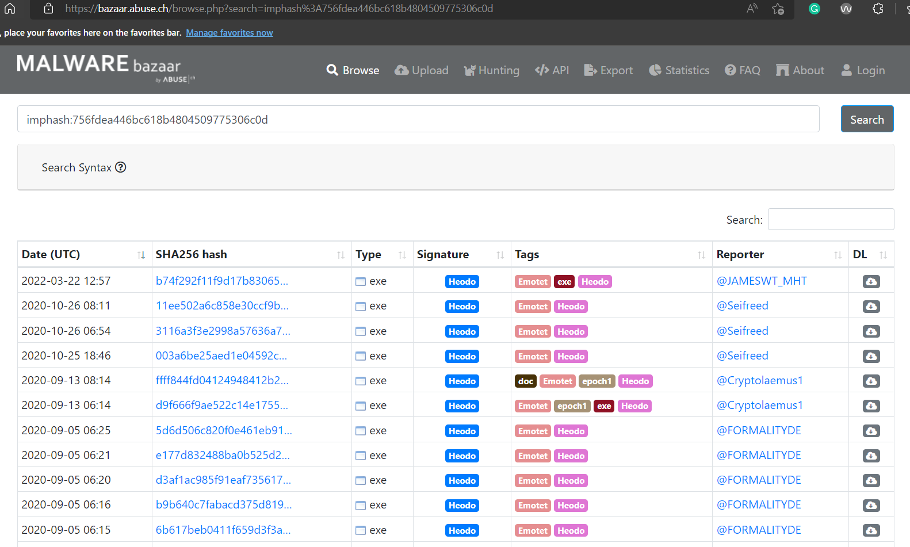
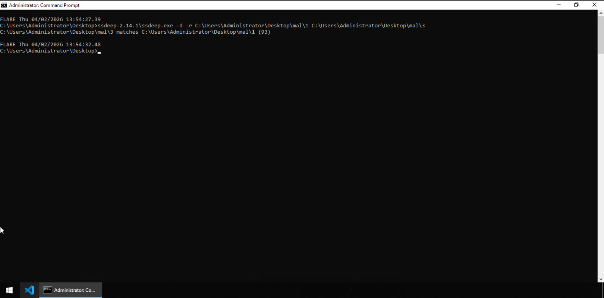
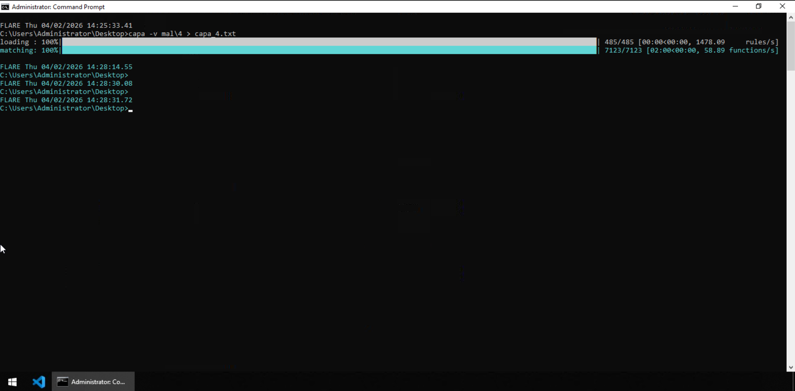
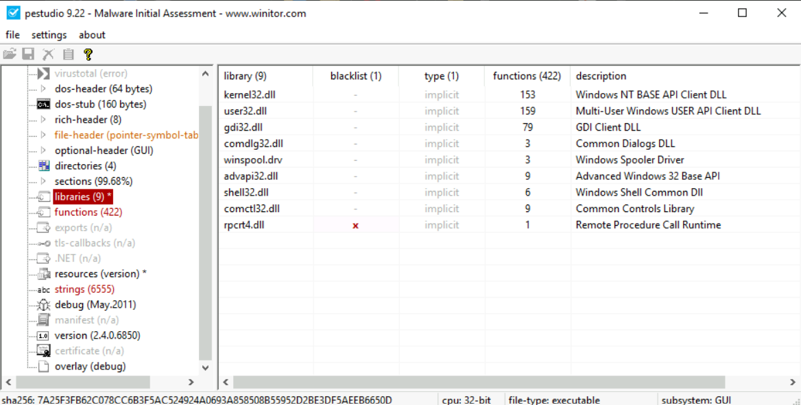
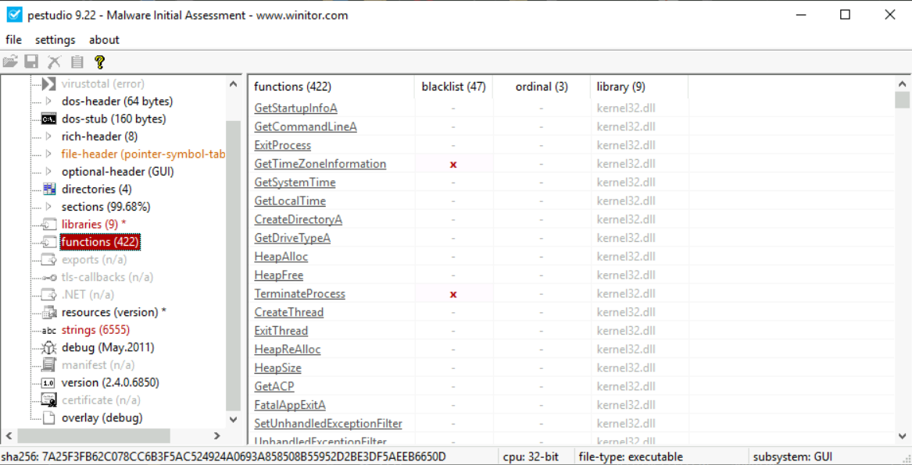
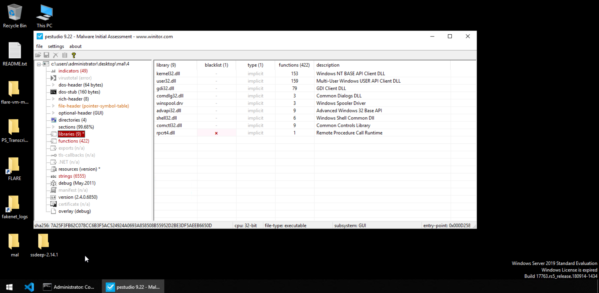

# Basic Static Analysis

| Field | Details |
|-------|---------|
| **Room** | Basic Static Analysis |
| **Platform** | TryHackMe |
| **Path** | SOC Level 2 |
| **Module** | Malware Analysis |
| **Difficulty** | Medium |
| **Category** | Malware Analysis |
| **Room Link** | [tryhackme.com/room/staticanalysis1](https://tryhackme.com/room/staticanalysis1) |
| **Author** | [OPT4RUN](https://tryhackme.com/p/OPT4RUN) |

---

## Overview

This room introduces the fundamentals of **basic static analysis** — examining a malware sample without executing it. The techniques covered here form the first layer of any malware triage workflow: extracting strings, fingerprinting via hashes, running signature-based detection, and reading PE headers for structural clues.

From a SOC/blue team perspective, these techniques let you quickly profile a suspicious binary, generate IOCs, and determine whether it warrants deeper dynamic analysis — all without ever detonating it.

The room uses a **FLARE VM** (Windows-based analysis environment by Mandiant) as the primary analysis platform, with six neutralised malware samples located at `Desktop\mal\`.

---

## Task 1 — Introduction

Static analysis examines a malware sample while it is at rest — no execution, no detonation. This is always the safest first step. The room covers:

- Lab setup for malware analysis
- String searching (basic and obfuscated)
- Fingerprinting via file hashes (MD5, SHA256, imphash, ssdeep)
- Signature-based detection (Yara, Capa)
- PE header analysis using PEstudio

No questions for this task.

---

## Task 2 — Lab Setup

Before any malware analysis begins, a controlled and resettable environment is non-negotiable. Malware is often destructive — contaminating a host, establishing persistence, or corrupting data. Running samples in a snapshotted VM means you can revert to a clean baseline after every analysis session.

### FLARE VM

**FLARE VM** is a Windows-based malware analysis distribution created by Mandiant (formerly FireEye). It ships with the community's most-used analysis tools pre-installed and is compatible with Windows 7 and Windows 10. The attached THM machine uses FLARE VM.


The typical VM-based analysis workflow:
1. Fresh VM install with all tools configured
2. Snapshot taken of the clean state
3. Malware sample copied in and analysed
4. VM reverted to snapshot after analysis

### REMnux

**REMnux** (Reverse Engineering Malware Linux) is a Linux-based malware analysis distro created by Lenny Zeltser in 2010. It includes the same class of pre-installed tooling as FLARE VM but is Linux-based — meaning it cannot perform dynamic analysis of Windows PE binaries. REMnux is used in earlier and upcoming rooms in this path.


> 💡 **Tip:** The THM-attached VM credentials are: **Username:** `Administrator` / **Password:** `letmein123!`. The malware samples are located at `Desktop\mal\` (samples 1–6).

No questions for this task.

---

## Task 3 — String Search

### How String Search Works

A string search scans the raw bytes of a binary and extracts sequences of ASCII or Unicode characters terminated by a null byte. It doesn't care about file type — it works purely on byte patterns. The trade-off is a high false-positive rate: memory addresses and assembly operands can look like strings. An analyst has to separate signal from noise.

### Useful Artifacts to Look For

| Artifact Type | Examples | Why It Matters |
|---------------|----------|----------------|
| Windows APIs | `CreateProcess`, `InternetOpen`, `SetWindowsHook` | Reveals likely functionality |
| IPs / URLs / Domains | C2 endpoints, killswitch domains | Direct network IOCs |
| Miscellaneous | Bitcoin addresses, message box text | Context for attribution |

🔴 **Malware relevance:** The WannaCry killswitch domain was identified via a basic string search — a real-world example of how impactful this technique can be.

### Basic String Search

The FLARE VM includes `strings.exe` from the Sysinternals suite. Run it from the Desktop:
```
strings <path to binary>
```

PEstudio also provides string extraction with additional metadata: encoding, size, file offset, and a blacklist column that flags strings matching known malicious patterns.



### Obfuscated Strings — FLOSS

Malware authors obfuscate strings to defeat basic `strings` output. Mandiant's **FLOSS** (FireEye Labs Obfuscated String Solver) uses deobfuscation techniques — including stack string reconstruction and decoding routine emulation — to recover strings that a basic search would miss.
```
floss --no-static-strings <path to binary>
```

The `--no-static-strings` flag suppresses regular string output and shows only the obfuscated strings FLOSS was able to recover.



Running FLOSS against samples 2, 5, and 6:
```
floss --no-static-strings C:\Users\Administrator\Desktop\mal\2
floss --no-static-strings C:\Users\Administrator\Desktop\mal\5
floss --no-static-strings C:\Users\Administrator\Desktop\mal\6
```



- `mal\2` → 0 decoded strings, 0 stackstrings
- `mal\5` → 0 decoded strings, 0 stackstrings
- `mal\6` → 1 decoded string (`@@AD`), **45 stackstrings** — including repeated occurrences of `Dbgview.exe`

🔴 **Malware relevance:** `DbgView.exe` (DebugView) is a Sysinternals tool used to monitor debug output. Malware referencing it as a stackstring is often checking for or targeting debugger activity — a classic anti-analysis behaviour.

### Questions

**Q: On the Desktop in the attached VM, there is a directory named 'mal' with malware samples 1 to 6. Use floss to identify obfuscated strings found in the samples named 2, 5, and 6. Which of these samples contains the string 'DbgView.exe'?**
```
6
```

---

## Task 4 — Fingerprinting Malware

File names are trivially changed and duplicated, so hashes are the standard way to uniquely identify a malware sample. A hash is a fixed-length output derived from a file's contents — even a one-byte change produces a completely different hash, but the hash stays identical as long as the content stays identical. File name is not part of content and does not affect the hash.

### Standard File Hashes

| Hash Type | Notes |
|-----------|-------|
| MD5 | Fast, widely used, vulnerable to collision attacks |
| SHA1 | Stronger than MD5, also considered weak now |
| SHA256 | Current standard — most secure for file identification |

### Imphash — Import Hash

The **imphash** is a hash of the functions a PE file imports and the order those imports appear. Two samples with the same imphash are importing the same functions in the same order — a strong signal they come from the same threat actor, compiler, or malware family, even if their SHA256 hashes differ.

PEstudio exposes the imphash in the indicators panel.



Searching an imphash on **Malware Bazaar** reveals all known samples sharing that import profile:



🔴 **Malware relevance:** As shown above, all results for the searched imphash belong to the **Emotet** (Heodo) family. This is how imphash clustering enables rapid attribution — even when threat actors modify code, they often reuse the same toolchain and libraries, leaving the imphash unchanged.

### SSDEEP — Fuzzy Hashing

**ssdeep** implements **Context Triggered Piecewise Hashing (CTPH)**. Instead of hashing the whole file, it hashes chunks of the file and compares those chunks across samples. The result is a percentage similarity score — useful for detecting variants of the same malware even when the binary has been modified.
```
ssdeep-2.14.1\ssdeep.exe -d -r C:\Users\Administrator\Desktop\mal\1 C:\Users\Administrator\Desktop\mal\3
```



`mal\3 matches mal\1 (93)` — a 93% similarity score confirms these two samples are closely related variants.

### Questions

**Q: In the samples located at `Desktop\mal\` directory in the attached VM, which of the samples has the same imphash as file 3?**
```
1
```

**Q: Using the ssdeep utility, what is the percentage match of the above-mentioned files?**
```
93
```

---

## Task 5 — Signature-Based Detection

### Signatures

A signature is a byte pattern — or a combination of strings, imports, and other artifacts — that identifies a particular characteristic in a file. Where hashes tell you *what* a file is, signatures tell you *what it contains or can do*.

### Yara Rules

Yara is the de facto signature language for malware research. Rules match on binary patterns, text strings, hex sequences, or combinations thereof. The community maintains an open-source Yara rule repository at [github.com/Yara-Rules/rules](https://github.com/Yara-Rules/rules). A rule hit is not a definitive verdict — context matters, and false positives exist. Always read the rule's intent before acting on it.

### Capa

**Capa** (Mandiant) goes further than string or hash matching. It reads a PE file and maps its observable characteristics — imports, strings, mutexes, byte sequences — to a library of capability rules, then presents the results against both the **MITRE ATT&CK** framework and the **Malware Behavior Catalog (MBC)**.
```
capa -v mal\4 > capa_4.txt
```



🔴 **Malware relevance:** Capa's ATT&CK and MBC mappings let a SOC analyst immediately understand *what* a sample can do and map it to known adversary techniques — without running the malware. The verbose flag (`-v`) adds function addresses for each capability, enabling targeted disassembly in the next analysis stage.

> 💡 **Tip:** If capa reports `contain obfuscated stackstrings`, that's a direct signal to run FLOSS against the sample — they work best in combination.

### Questions

**Q: How many matches for anti-VM execution techniques were identified in the sample?**
```
86
```

**Q: Does the sample have the capability to suspend or resume a thread? Answer with Y for yes and N for no.**
```
Y
```

**Q: What MBC behavior is observed against the MBC Objective 'Anti-Static Analysis'?**
```
Disassembler Evasion::Argument Obfuscation [B0012.001]
```

**Q: At what address is the function that has the capability 'Check HTTP Status Code'?**
```
0x486921
```

---

## Task 6 — Leveraging the PE Header

The techniques in previous tasks work on any file type. PE header analysis is specific to Windows executables but yields far more structured, deterministic information — section layout, compile timestamps, linked libraries, imported functions, and packing indicators.

### Libraries and Imports

A PE file doesn't contain all the code it needs. It imports functions from DLLs — most commonly Microsoft system libraries. The import table in the PE header lists exactly which DLLs and which functions are used. This gives an analyst a functional profile of the sample before any execution.

PEstudio's **libraries** view shows all linked DLLs, with a blacklist column flagging any that are associated with suspicious behaviour:



The **functions** view exposes the specific calls imported from those libraries:





🔴 **Malware relevance:** `rpcrt4.dll` (Remote Procedure Call Runtime) is flagged because RPC is commonly abused for lateral movement and remote execution. Seeing it imported by a suspicious binary — especially alongside network-related functions — should elevate analyst interest.

### Identifying Packed Executables

Packing wraps the actual malware in a shell that obfuscates the real PE's properties. Indicators of packing in the PE header include:
- Unusually high section entropy (compressed or encrypted data)
- Section names that don't match standard conventions
- Sections with both read and execute permissions and near-zero raw size
- Very few imports (the packer stub loads everything at runtime)

PEstudio surfaces section entropy and permissions, making packed sample identification straightforward without running the binary.

### Questions

**Q: Open the sample `Desktop\mal\4` in PEstudio. Which library is blacklisted?**
```
rpcrt4.dll
```

**Q: What does this dll do?**
```
Remote Procedure Call Runtime
```

---

## Task 7 — Conclusion

No questions for this task.

---

## Key Takeaways

- **Static analysis = no execution** — all techniques here work without running the sample, minimising risk
- **Strings reveal intent** — Windows API imports, URLs, and miscellaneous strings are your first IOC layer
- **FLOSS recovers what strings misses** — stackstrings and decoded obfuscated strings are only visible through emulation
- **SHA256 identifies; imphash clusters** — use standard hashes for unique identification and imphash/ssdeep for family correlation
- **Capa maps capabilities to ATT&CK** — gives immediate behavioural context with no execution required
- **PE header imports are a functional fingerprint** — blacklisted DLLs and functions expose what a sample intends to do
- **Packing defeats many static techniques** — high entropy sections and minimal imports are red flags worth investigating further
- **Always work in a snapshotted VM** — FLARE VM is the standard Windows analysis platform; REMnux for Linux-side tooling

---

*Write-up by [OPT4RUN](https://tryhackme.com/p/OPT4RUN)*