````markdown
# Dissecting PE Headers

| Field | Details |
|-------|---------|
| **Room** | Dissecting PE Headers |
| **Platform** | TryHackMe |
| **Path** | SOC Level 2 |
| **Category** | Malware Analysis |
| **Difficulty** | Easy |
| **Room Link** | [tryhackme.com/room/dissectingpeheaders](https://tryhackme.com/room/dissectingpeheaders) |
| **Author** | [OPT4RUN](https://tryhackme.com/p/OPT4RUN) |

---

## Overview

The Portable Executable (PE) format is the standard executable format for Windows — every `.exe`, `.dll`, and `.sys` file you encounter during malware analysis is a PE file. Understanding its structure is foundational to static malware analysis: headers tell you what a binary is, where it loads, what APIs it calls, and whether it's been packed to resist analysis.

This room walks through the major PE headers using `wxHexEditor` and `pe-tree` on real malware samples (`redline` and `zmsuz3pinwl`), covering everything from the DOS stub to identifying packed executables via entropy and import analysis.

---

## Task 1 — Introduction

PE files are the Windows implementation of the Common Object File Format (COFF). The COFF family also includes Linux ELF binaries and shared objects, but this room focuses exclusively on Windows PE files.

Key concepts introduced:
- Structure of PE headers
- Reading headers with tooling
- Identifying packed executables
- Using PE metadata for malware analysis

> **Prerequisites:** [Intro to Malware Analysis](https://tryhackme.com/room/intromalwareanalysis)

---

## Task 2 — Overview of PE Headers

On disk, a PE file is just bytes. Opening one in a hex editor gives you raw hex — meaningful only when interpreted through the PE format specification.

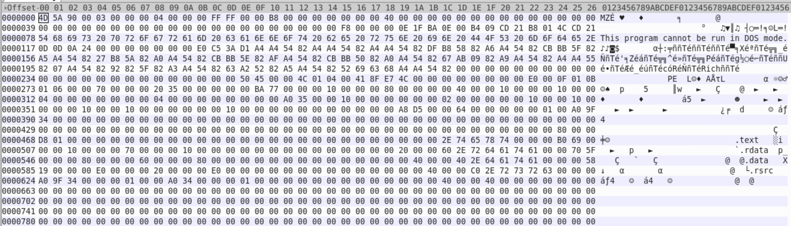

The room uses two tools to navigate PE structure:
- **`wxHexEditor`** — for viewing raw bytes and correlating hex offsets
- **`pe-tree`** — for structured, parsed output of all headers

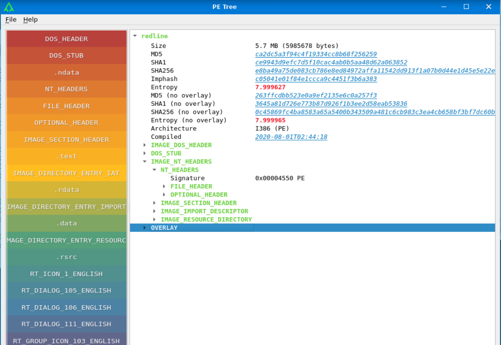

The major headers covered in this room:

| Header | Purpose |
|--------|---------|
| `IMAGE_DOS_HEADER` | Legacy DOS compatibility, points to NT headers |
| `IMAGE_NT_HEADERS` | Core PE metadata container |
| `FILE_HEADER` | Architecture, section count, compile timestamp |
| `OPTIONAL_HEADER` | Entry point, image base, subsystem, magic |
| `IMAGE_SECTION_HEADER` | Per-section metadata (permissions, sizes, RVAs) |
| `IMAGE_IMPORT_DESCRIPTOR` | Imported DLLs and functions (Windows API usage) |

All PE headers are defined as C-style `STRUCT` types. Full field definitions are documented on [MSDN](https://docs.microsoft.com/en-us/windows/win32/api/winnt/).

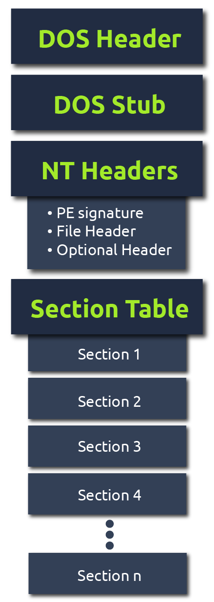

**Q: What data type are the PE headers?**
````
STRUCT
````

---

## Task 3 — IMAGE\_DOS\_HEADER and DOS\_STUB

### Setup

The attached VM provides the sample files at `Desktop/Samples/`. Use the application menu to launch `wxHexEditor`:

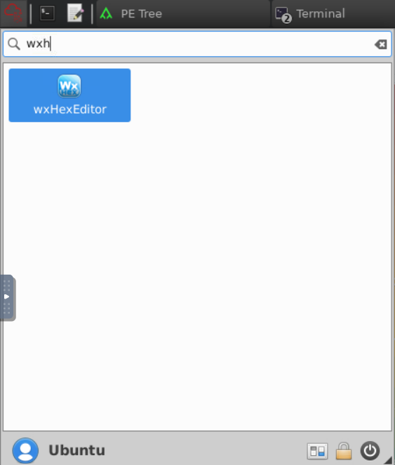

Open `redline` in wxHexEditor to see the raw binary:

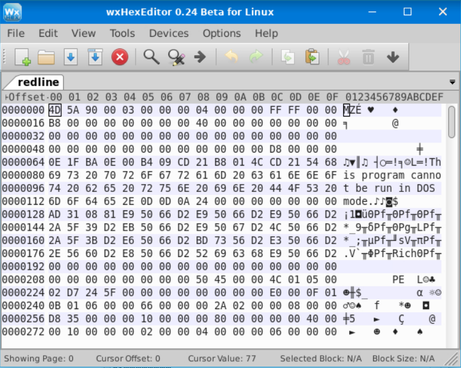

Then run pe-tree for structured output:
```bash
pe-tree Desktop/Samples/redline
```

> 💡 pe-tree takes ~8 minutes to load the redline sample. Start it and continue reading while it loads.

### IMAGE\_DOS\_HEADER

The IMAGE\_DOS\_HEADER occupies the **first 64 bytes** of every PE file.

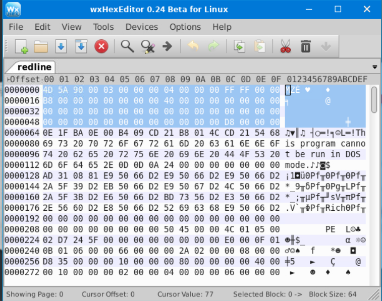

Two fields matter most:

**`e_magic` (bytes `4D 5A` = ASCII `MZ`)**
The magic bytes that identify a file as a PE executable. `MZ` are the initials of **Mark Zbikowski**, one of the architects of the original MS-DOS executable format. Windows uses this signature to recognize PE files.

**`e_lfanew`**
The last field in the IMAGE\_DOS\_HEADER. Contains the file offset of `IMAGE_NT_HEADERS`. For `redline`, this value is `0x000000D8`.


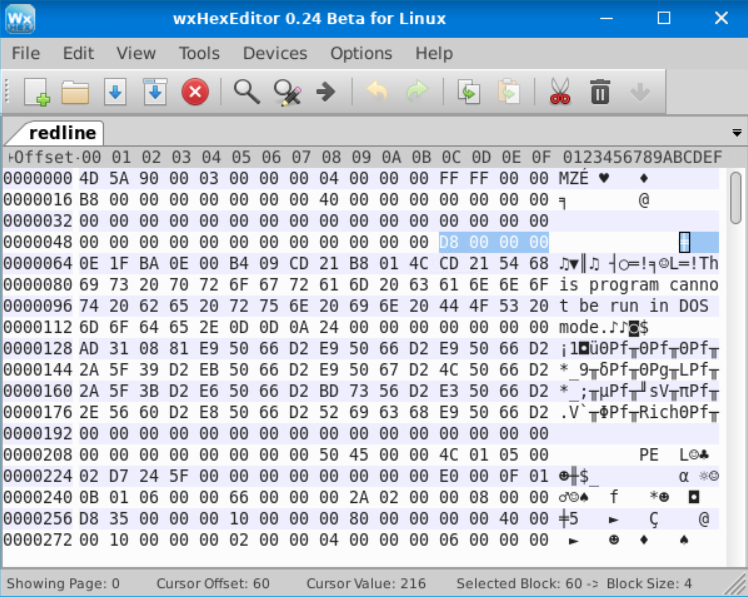

> 🔴 **Malware relevance:** Beyond `e_magic` and `e_lfanew`, the rest of IMAGE\_DOS\_HEADER is mostly irrelevant for malware analysis. It exists purely for backward compatibility with MS-DOS. During reverse engineering, you'll typically jump straight to `e_lfanew` to find the NT headers.

> 💡 Note the byte order: pe-tree reports `e_magic` as `0x5a4d` while the hex editor shows `4D 5A`. This is **little-endian** byte ordering — x86 architecture stores the least significant byte first.

### DOS\_STUB

The DOS\_STUB is a small legacy code block that runs only if the PE is executed on MS-DOS (not Windows). It simply prints:
````
!This program cannot be run in DOS mode.
````

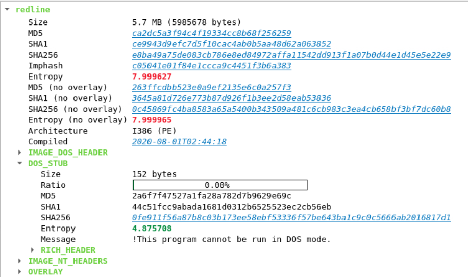

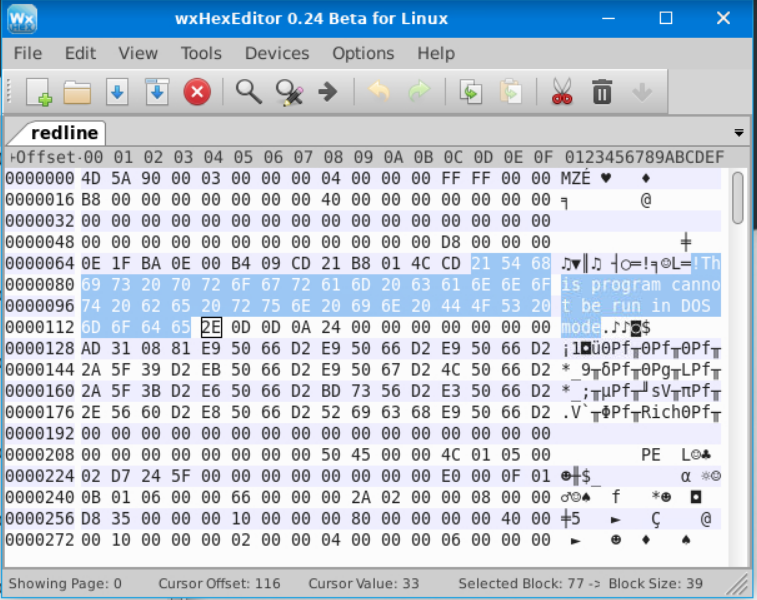

> 🔴 **Malware relevance:** The DOS\_STUB message can be modified or removed by packers and custom compilers. An unusual or missing DOS\_STUB message is a weak indicator of binary manipulation, though not conclusive on its own.

**Q: How many bytes are present in the IMAGE\_DOS\_HEADER?**
````
64
````

**Q: What does MZ stand for?**
````
Mark Zbikowski
````

**Q: In what variable of the IMAGE\_DOS\_HEADER is the address of IMAGE\_NT\_HEADERS saved?**
````
e_lfanew
````

**Q: In the attached VM, open the PE file `Desktop/Samples/zmsuz3pinwl` in pe-tree. What is the address of IMAGE\_NT\_HEADERS for this PE file?**
````
0x000000f8
````

---

## Task 4 — IMAGE\_NT\_HEADERS

The `IMAGE_NT_HEADERS` starts at the offset stored in `e_lfanew`. It consists of three components:

| Component | Description |
|-----------|-------------|
| Signature | 4-byte `PE\0\0` marker |
| FILE\_HEADER | Architecture, section count, timestamp |
| OPTIONAL\_HEADER | Entry point, image base, subsystem (covered in Task 5) |

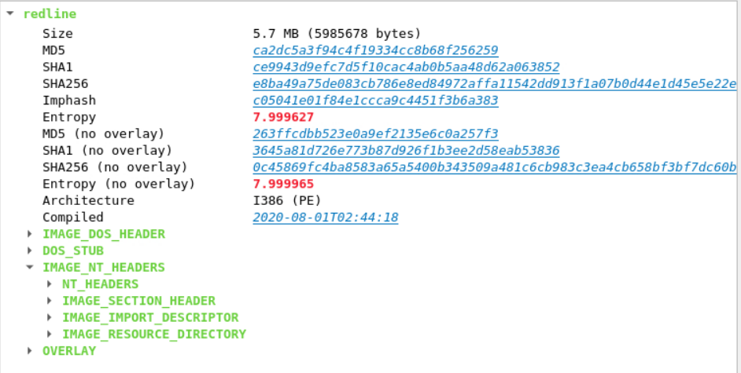

### Navigating to the NT Headers in the Hex Editor

Use `Ctrl+G` (Go to Offset) in wxHexEditor, enter the `e_lfanew` value `000000D8`, set **From beginning** and type **Hex**:

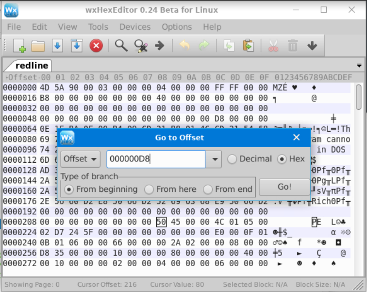

### Signature

The first 4 bytes at this offset are `50 45 00 00` — ASCII `PE` followed by two null bytes. This marks the start of the NT headers.

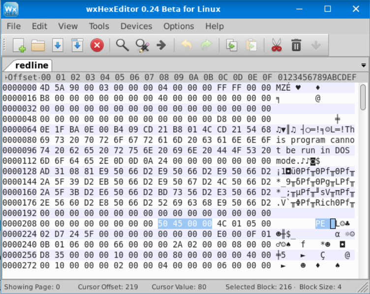

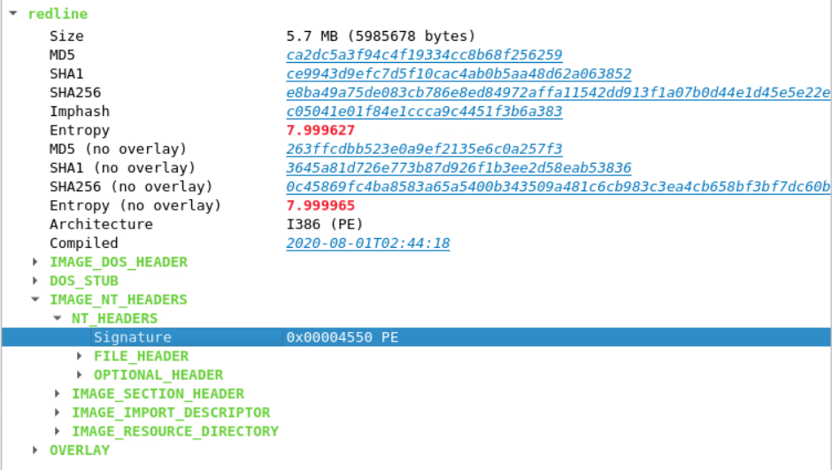

### FILE\_HEADER

The FILE\_HEADER immediately follows the signature. Key fields:

| Field | Value (redline) | Notes |
|-------|-----------------|-------|
| `Machine` | `0x014c I386` | Compiled for 32-bit Intel |
| `NumberOfSections` | `0x0005` | 5 sections |
| `TimeDateStamp` | `0x5f24d702 Sat Aug 1 02:44:18 2020 UTC` | Compile timestamp |
| `SizeOfOptionalHeader` | `0x00e0` (224 bytes) | Size of the next header |
| `Characteristics` | `0x010f` | RELOCS\_STRIPPED, EXECUTABLE\_IMAGE, LINE\_NUMS\_STRIPPED |

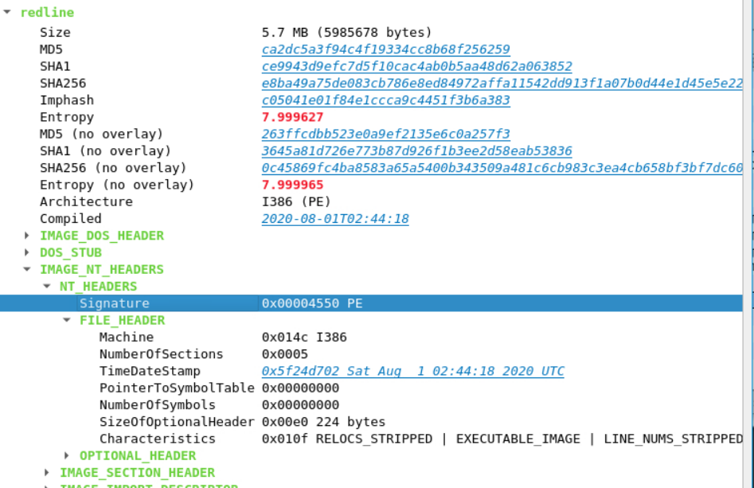

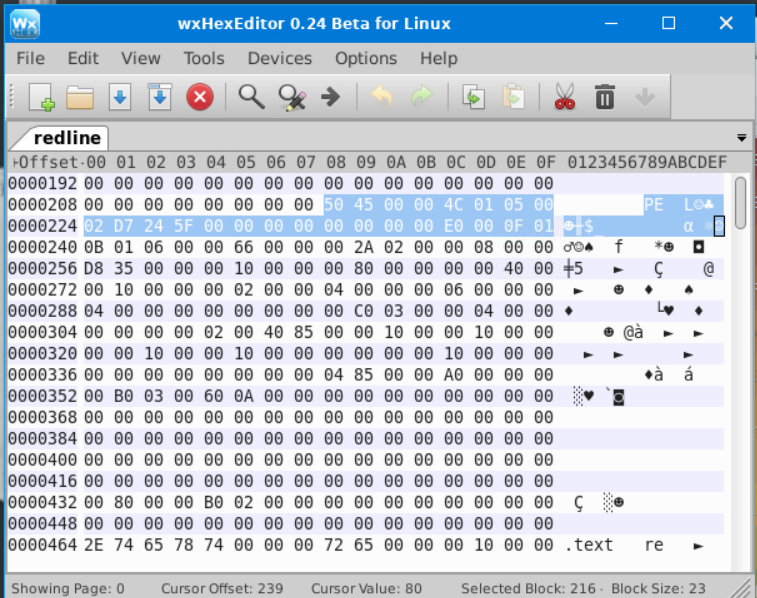

> 🔴 **Malware relevance:** `TimeDateStamp` can indicate when a sample was compiled — useful for attribution and campaign correlation. However, it's trivially forgeable, so treat it as a hint rather than ground truth. `Characteristics` flags can tell you if the binary is an EXE vs DLL, 32 vs 64-bit, and whether debug symbols were stripped.

**Q: Is the file `Desktop\Samples\zmsuz3pinwl` compiled for a 32-bit machine or a 64-bit machine?**
````
32-bit machine
````

**Q: What is the TimeDateStamp of this file?**
````
0x62289d45 Wed Mar  9 12:27:49 2022 UTC
````

---

## Task 5 — OPTIONAL\_HEADER

Despite the name, the OPTIONAL\_HEADER is mandatory for PE executables. It contains some of the most operationally significant fields for malware analysis.

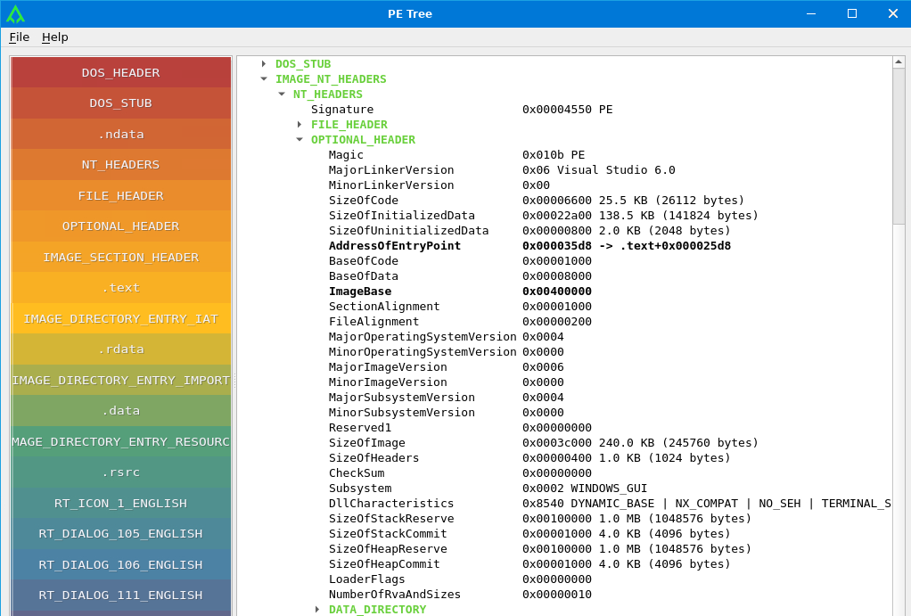

Key fields:

| Field | Value (redline) | Notes |
|-------|-----------------|-------|
| `Magic` | `0x010b` | `0x010b` = 32-bit, `0x020b` = 64-bit |
| `AddressOfEntryPoint` | `0x000035d8 → .text+0x000025d8` | First instruction executed — RVA |
| `ImageBase` | `0x00400000` | Preferred load address in memory |
| `Subsystem` | `0x0002 WINDOWS_GUI` | Runs as a GUI application |

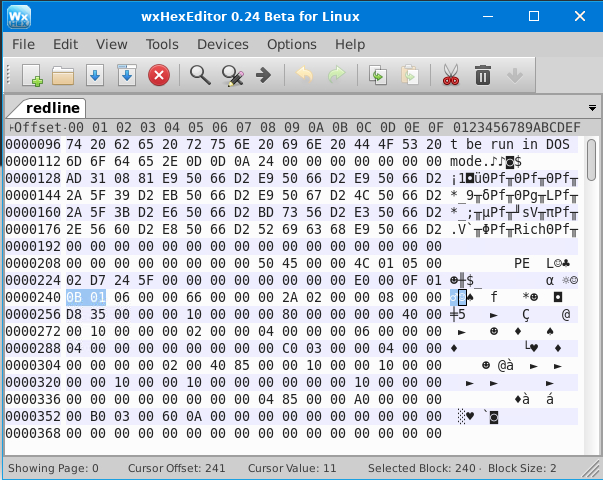

> 🔴 **Malware relevance:** `AddressOfEntryPoint` is where execution begins — critical for setting breakpoints during dynamic analysis. `ImageBase` is the preferred base address; ASLR may relocate it, but the default `0x00400000` is a common indicator of a basic 32-bit PE. A `Subsystem` of `WINDOWS_CUI` (0x0003) rather than `WINDOWS_GUI` (0x0002) means the binary runs as a console application — many malware samples use CUI to avoid spawning a visible window.

**Q: Which variable from the OPTIONAL\_HEADER indicates whether the file is a 32-bit or a 64-bit application?**
````
Magic
````

**Q: What Magic value indicates that the file is a 64-bit application?**
````
0x020B
````

**Q: What is the subsystem of the file `Desktop\Samples\zmsuz3pinwl`?**
````
0x0003 WINDOWS_CUI
````

---

## Task 6 — IMAGE\_SECTION\_HEADER

PE files are divided into sections — each storing a different type of data with its own memory permissions.

### Common Sections

| Section | Contents | Permissions |
|---------|----------|-------------|
| `.text` | Executable code | READ, EXECUTE |
| `.data` | Initialized global/static variables | READ, WRITE |
| `.rdata` / `.idata` | Import/export tables, read-only data | READ |
| `.ndata` | Uninitialized data | READ, WRITE |
| `.reloc` | Relocation information | READ |
| `.rsrc` | Icons, UI resources, embedded files | READ |

### Section Header Fields

| Field | Description |
|-------|-------------|
| `VirtualAddress` | RVA of the section in memory |
| `VirtualSize` | Size of section when loaded in memory |
| `SizeOfRawData` | Size of section on disk |
| `Characteristics` | Memory permissions (READ / WRITE / EXECUTE) |

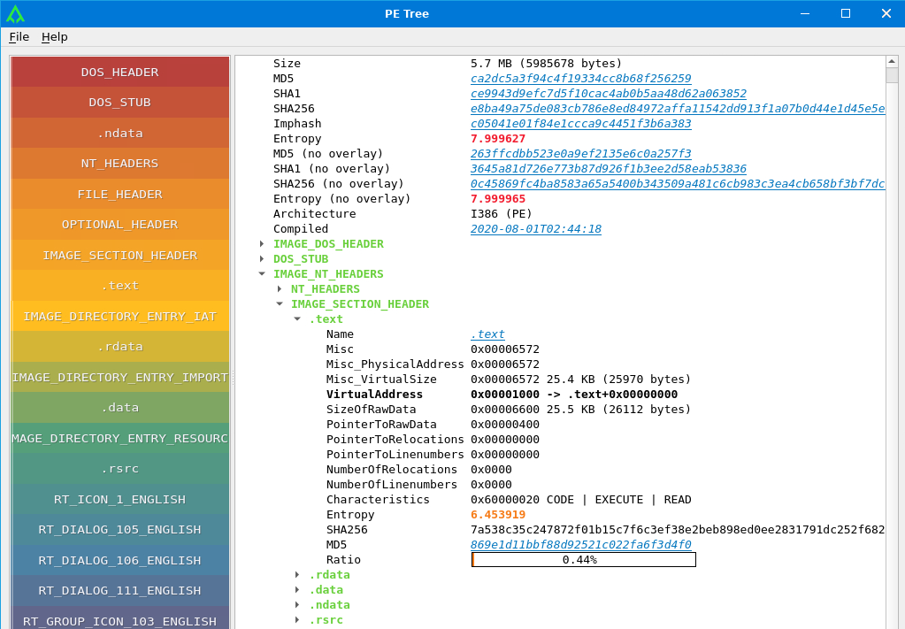

> 🔴 **Malware relevance:** In a legitimate binary, only `.text` has the EXECUTE flag. Multiple sections with EXECUTE + WRITE permissions is a strong indicator of packing or self-modifying code. The `VirtualSize` vs `SizeOfRawData` ratio is also significant — covered in Task 8.

**Q: How many sections does the file `Desktop\Samples\zmsuz3pinwl` have?**
````
7
````

**Q: What are the characteristics of the `.rsrc` section of the file `Desktop\Samples\zmsuz3pinwl`?**
````
0xe0000040 INITIALIZED_DATA | EXECUTE | READ | WRITE
````

---

## Task 7 — IMAGE\_IMPORT\_DESCRIPTOR

PE files don't implement all their functionality from scratch — they import functions from Windows DLLs at runtime. The `IMAGE_IMPORT_DESCRIPTOR` lists every DLL the binary imports from, and which functions it uses from each.

This is one of the most useful pieces of static analysis data: imports directly hint at a binary's capabilities without executing it.

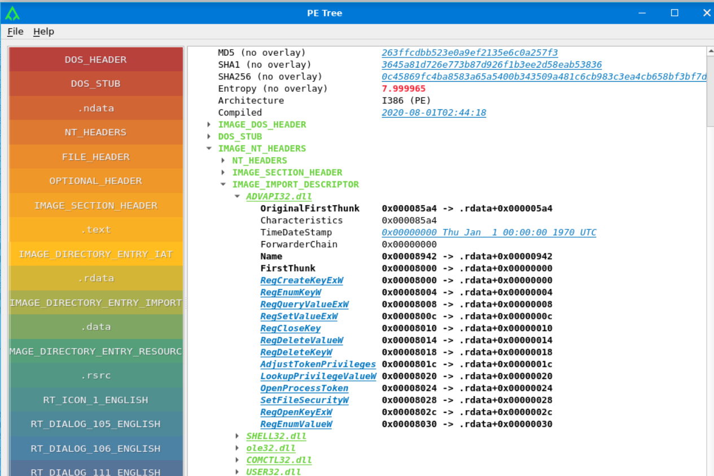

The `redline` sample imports from `ADVAPI32.dll`, `SHELL32.dll`, `ole32.dll`, `COMCTL32.dll`, and `USER32.dll`. The registry-focused imports from ADVAPI32 (`RegCreateKeyExW`, `RegQueryValueExW`, `RegSetValueExW`) alone suggest this binary performs registry manipulation — consistent with Redline Stealer's known behaviour.

From `kernel32.dll`, notable imports include:

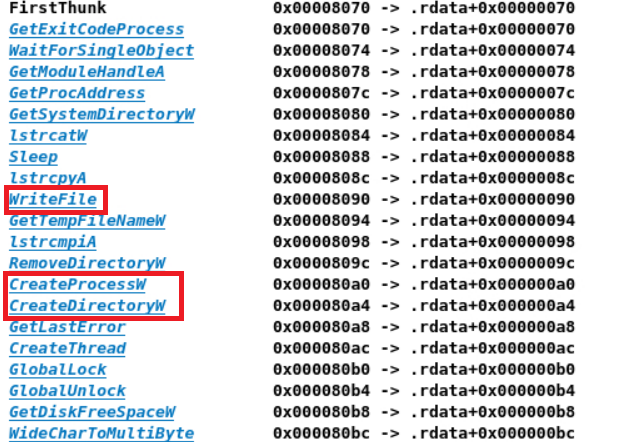

| Import | Capability |
|--------|-----------|
| `CreateProcessW` | Spawns new processes |
| `CreateDirectoryW` | Creates directories on disk |
| `WriteFile` | Writes data to files |

> 🔴 **Malware relevance:** Import analysis is a core part of static triage. Functions like `CreateRemoteThread`, `VirtualAllocEx`, `WriteProcessMemory` suggest process injection. `CryptEncrypt` / `CryptDecrypt` suggest crypto operations (common in ransomware). `InternetOpenW` / `HttpSendRequestW` suggest C2 communication. Building a mental map of import → capability is an essential analyst skill.

> 💡 The `OriginalFirstThunk` (INT) and `FirstThunk` (IAT) fields in each descriptor are used by the Windows loader to resolve function addresses at runtime. You'll explore these in detail in upcoming rooms.

**Q: The PE file `Desktop\Samples\redline` imports the function `CreateWindowExW`. From which dll file does it import this function?**
````
User32.dll
````

---

## Task 8 — Packing and Identifying Packed Executables

Packers wrap a PE file in a layer of obfuscation. The original code is encrypted or compressed; a stub unpacks it at runtime before execution. This defeats static analysis and evades signature-based detection.

### Indicators of a Packed Executable

**1. Unconventional or missing section names**

Normal PE files have named sections (`.text`, `.data`, etc.). `zmsuz3pinwl` has mostly unnamed sections — confirmed by both pe-tree and `pecheck`:

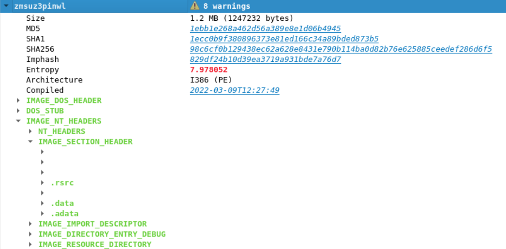
```bash
pecheck zmsuz3pinwl
```

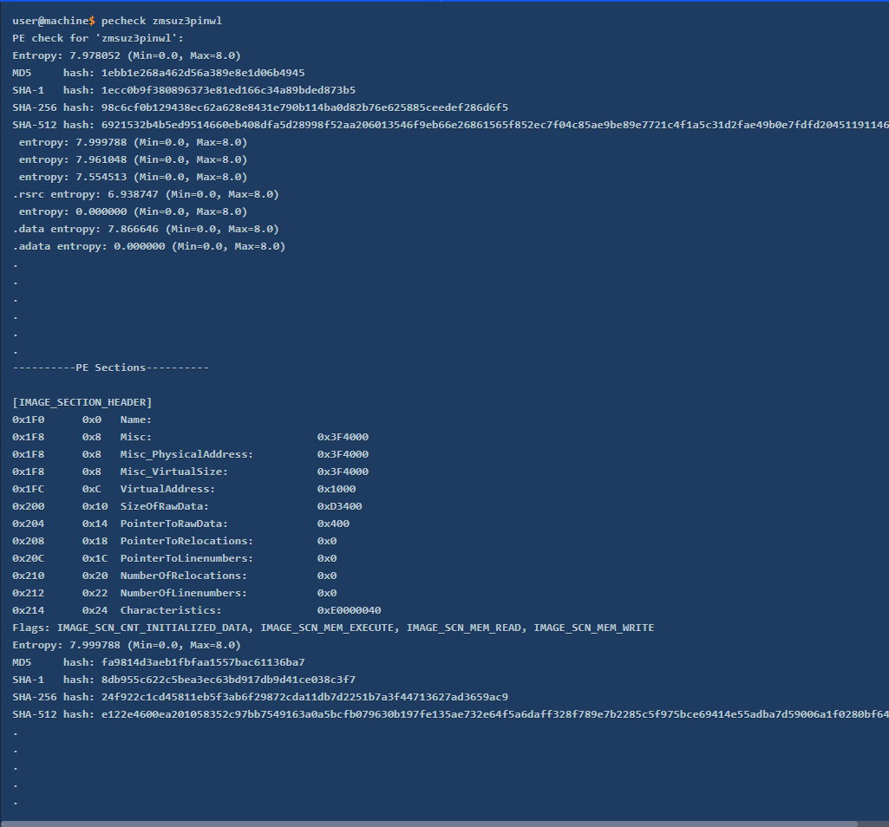

**2. High entropy (approaching 8.0)**

Entropy measures data randomness. Normal code has moderate entropy (~5–7). Compressed or encrypted data approaches 8.0. The unnamed sections in `zmsuz3pinwl` show entropy of `7.999788` and `7.961048` — essentially maximum randomness, consistent with packed/encrypted content.

**3. EXECUTE permissions on multiple sections**

In a normal PE, only `.text` has EXECUTE. `zmsuz3pinwl` has `INITIALIZED_DATA | EXECUTE | READ | WRITE` on its unnamed sections — the packer needs to write and execute the unpacked payload from the same memory region.

**4. SizeOfRawData ≪ Misc\_VirtualSize**

In `zmsuz3pinwl`'s first section: `SizeOfRawData = 0xD3400` vs `Misc_VirtualSize = 0x3F4000`. The in-memory size is far larger than the on-disk size — the packed code expands when unpacked into memory.

**5. Minimal imports**

A packed binary only needs enough imports to run the unpacking stub. `zmsuz3pinwl` imports exactly three functions from `kernel32.dll`:

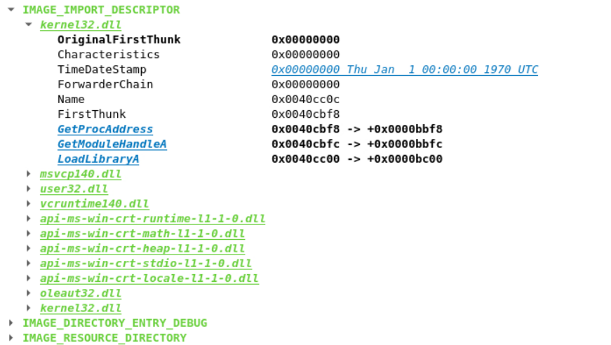

| Import | Purpose |
|--------|---------|
| `LoadLibraryA` | Load additional DLLs at runtime |
| `GetModuleHandleA` | Get handle to already-loaded DLL |
| `GetProcAddress` | Resolve function addresses dynamically |

These three functions are sufficient to dynamically load any DLL and resolve any function — allowing the unpacked payload to reconstruct its full import table at runtime, invisible to static analysis.

> 🔴 **Malware relevance:** Packing is near-universal in modern malware. Recognising a packed sample early prevents wasted time on static analysis of stub code. The five indicators above — combined — give you high confidence. A single indicator (e.g. high entropy alone) isn't conclusive, but multiple indicators together are.

**Q: Which of the files in the attached VM in the directory `Desktop\Samples` seems to be a packed executable?**
````
zmsuz3pinwl
````

---

## Task 9 — Conclusion

This room covered the full anatomy of the Windows PE format from a malware analysis perspective.

---

## Key Takeaways

- The **MZ magic bytes** (`4D 5A`) at offset 0 identify every PE file; `e_lfanew` in the IMAGE\_DOS\_HEADER points to where the real headers begin
- The **PE signature** (`50 45 00 00`) marks the start of `IMAGE_NT_HEADERS`
- `FILE_HEADER` gives you architecture, section count, and compile timestamp — the timestamp is useful but forgeable
- `OPTIONAL_HEADER` contains the **entry point** (first instruction executed), **image base** (preferred load address), and **Magic** value (32 vs 64-bit)
- Section headers define the **memory permissions** for each segment — EXECUTE on `.data` or unnamed sections is anomalous
- `IMAGE_IMPORT_DESCRIPTOR` is your static analysis shortcut: imports directly reveal **what a binary is capable of** without executing it
- A **packed executable** shows: missing/unusual section names, high entropy (>7.5), multiple sections with RWX permissions, large VirtualSize vs SizeOfRawData gap, and minimal imports limited to `LoadLibraryA`, `GetModuleHandleA`, `GetProcAddress`
- Tools used: `wxHexEditor` (raw bytes), `pe-tree` (structured parsing), `pecheck` (CLI alternative)

---

*Write-up by [OPT4RUN](https://tryhackme.com/p/OPT4RUN)*
````