| Field | Details |
|-------|---------|
| **Room** | Dynamic Analysis: Debugging |
| **Platform** | TryHackMe |
| **Path** | SOC Level 2 |
| **Module** | Malware Analysis |
| **Difficulty** | Medium |
| **Category** | Malware Analysis |
| **Room Link** | [tryhackme.com/room/advanceddynamicanalysis](https://tryhackme.com/room/advanceddynamicanalysis) |
| **Author** | [OPT4RUN](https://tryhackme.com/p/OPT4RUN) |

---

## Overview

This room builds on top of Basic Dynamic Analysis by introducing **interactive debugging** as a technique for gaining deeper control over malware execution. Basic dynamic analysis can be defeated by malware that detects the analysis environment — timing attacks, VM fingerprinting, process enumeration — and takes a benign execution path in response. Debugging lets us step through execution instruction by instruction, inspect and modify registers and memory at runtime, and permanently patch binaries to neutralise evasion logic before analysis.

From a SOC and malware analysis perspective, this is a critical skill. When a sample refuses to detonate in a sandbox, or behavioural tools show nothing interesting, a debugger is the next escalation point — it lets you force the malware past its own defences.

The room uses **x32dbg** on a FLARE VM and walks through a real crackme sample (`crackme-arebel.exe`) that implements a TLS callback-based anti-debugging technique, which we then bypass both at runtime and permanently through patching.

---

## Task 1 — Introduction

This room is a continuation of the malware analysis path. Where Basic Dynamic Analysis focuses on observing malware behaviour during execution using monitoring tools, this room introduces **advanced dynamic analysis** via debuggers — giving analysts direct control over execution flow.

**Learning objectives:**
- Evasion techniques used to defeat static and basic dynamic analysis
- Introduction to debuggers and execution control
- Manipulating registers and flags at runtime
- Patching malware to permanently bypass evasion code

**Pre-requisites:** Basic Static Analysis, Basic Dynamic Analysis, Advanced Static Analysis

**Q: Complete the pre-requisite rooms.**
```
No answer needed
```

---

## Task 2 — The Need for Advanced Dynamic Analysis

Malware analysis is a cat-and-mouse game. As analysts develop new techniques, malware authors counter them. This task covers the two main fronts: evading static analysis and evading basic dynamic analysis.

### Evasion of Static Analysis

Because static analysis never executes the malware, the goal is to hide functionality until runtime. Common techniques include:

| Technique | Description |
|-----------|-------------|
| **Hash manipulation** | Changing even a single bit (e.g. adding a NOP) alters the file hash, defeating hash-based detection. Fuzzy hashes like CTPH are more resilient. |
| **AV signature defeat** | Modifying static byte patterns that AV engines use as signatures, often combined with code obfuscation. |
| **String obfuscation** | Encoding or encrypting strings (C2 domains, URLs) that are only decoded at runtime, so string searches during static analysis yield nothing useful. |
| **Runtime DLL loading** | Using `LoadLibrary`/`LoadLibraryEx` to load DLLs at runtime rather than listing them in the import table, hiding capabilities from PE header analysis. |
| **Packing** | Wrapping malware in a packer that decodes and loads the actual payload into memory at runtime. Static analysis only sees the unpacker stub. |

> 🔴 **Malware relevance:** Packing is one of the most common obfuscation techniques encountered in the wild. When static analysis tools show minimal strings and a high-entropy section, suspect packing.

### Evasion of Basic Dynamic Analysis

When running in a monitored environment, malware uses these techniques to detect the analysis context and take a benign execution path:

| Technique | Description |
|-----------|-------------|
| **VM identification** | Checking for registry keys, device drivers, or resource constraints (single CPU, low RAM) associated with VMware/VirtualBox. |
| **Timing attacks** | Calling `Sleep()` for extended periods to outlast automated sandbox timeouts. Newer sandboxes accelerate time; malware counters this by checking elapsed time before and after the sleep call. |
| **User activity checks** | Looking for lack of mouse/keyboard movement, empty browser history, no recently opened files, or low system uptime — all indicators of a fresh analysis VM. |
| **Analysis tool detection** | Enumerating running processes with `Process32First`/`Process32Next` and checking window titles for tools like ProcMon, ProcExp, or OllyDbg. |

> 🔴 **Malware relevance:** When a sandbox report comes back clean, it doesn't always mean the sample is benign — it may have detected the sandbox and gone dormant. This is where a debugger becomes essential.

**Q: Malware sometimes checks the time before and after the execution of certain instructions to find out if it is being analysed. What type of analysis technique is bypassed by this attack?**
```
Basic Dynamic Analysis
```

**Q: What is a popular technique used by malware authors to obfuscate malware code from static analysis and unwrap it at runtime?**
```
Packing
```

---

## Task 3 — Introduction to Debugging

Debuggers give a malware analyst direct, instruction-level control over a running program — the ability to pause, step, inspect memory and registers, modify values, and redirect execution. They are the primary tool for defeating runtime evasion.

### Types of Debuggers

| Type | Level | Use Case | Key Characteristic |
|------|-------|----------|--------------------|
| **Source-Level** | High | Used by developers during code writing | Shows local variables; requires source code |
| **Assembly-Level** | Medium | Used for malware RE on compiled binaries | Shows CPU registers, memory, disassembly |
| **Kernel-Level** | Low | Kernel/driver debugging | Requires two machines; halting the kernel halts the whole system |

For malware analysis, **assembly-level debuggers** are the tool of choice. Compiled malware has no source code — we only have the binary. Assembly-level debuggers attach to the process, load the binary's instructions, and let us step through them one at a time.

> 💡 **Tip:** Popular assembly-level debuggers used in malware analysis include x32dbg/x64dbg, OllyDbg, and WinDbg. IDA Pro and Ghidra are primarily disassemblers but also offer debugging capabilities.

**Q: Can we recover the pre-compilation code of a compiled binary for debugging purposes? Write Y for Yes or N for No**
```
N
```

**Q: Which type of debugger is used for debugging compiled binaries?**
```
Assembly-Level Debuggers
```

**Q: Which debugger works at the lowest level among the discussed debuggers?**
```
Kernel-Level Debuggers
```

---

## Task 4 — Familiarisation With a Debugger

The attached VM is a **FLARE VM** — Mandiant's (previously FireEye) purpose-built reverse engineering environment with all major analysis tools pre-installed.

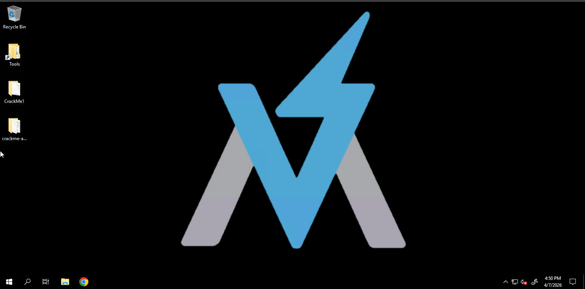

The debugger used in this room is **x32dbg** (for 32-bit samples) and **x64dbg** (for 64-bit samples). Navigate to `Desktop > Tools > debuggers > x32dbg.exe`.

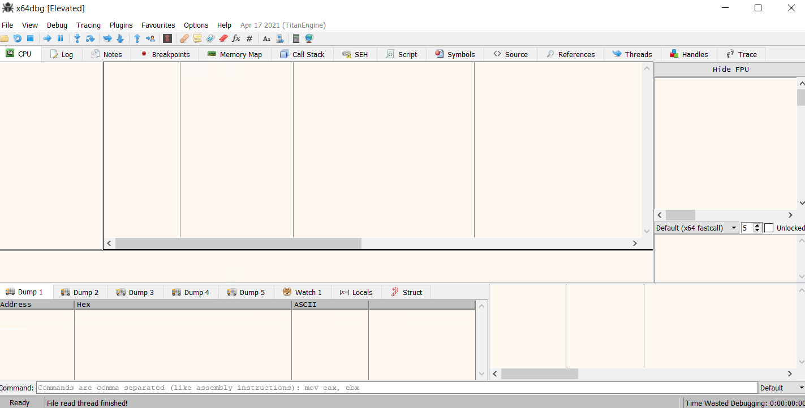

After opening a file via `File > Open`, the debugger attaches to the process and immediately pauses at a **System Breakpoint**. The interface on the **CPU tab** shows:

- **Disassembly pane** (centre) — instructions at and around the current EIP
- **Registers pane** (right) — current values of all CPU registers including flags
- **Dump pane** (bottom left) — raw memory view
- **Stack pane** (bottom right) — current call stack
- **Timer** (bottom right corner) — time spent debugging the sample

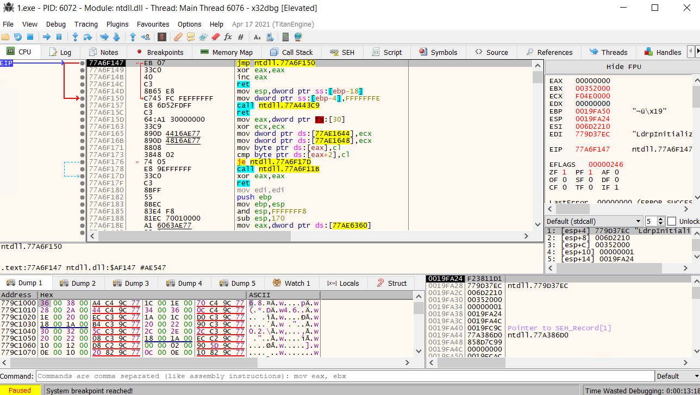

The **Breakpoints tab** lists all active breakpoints — points where execution is automatically paused. A breakpoint on any instruction can be toggled by clicking the dot to its left in the CPU tab.

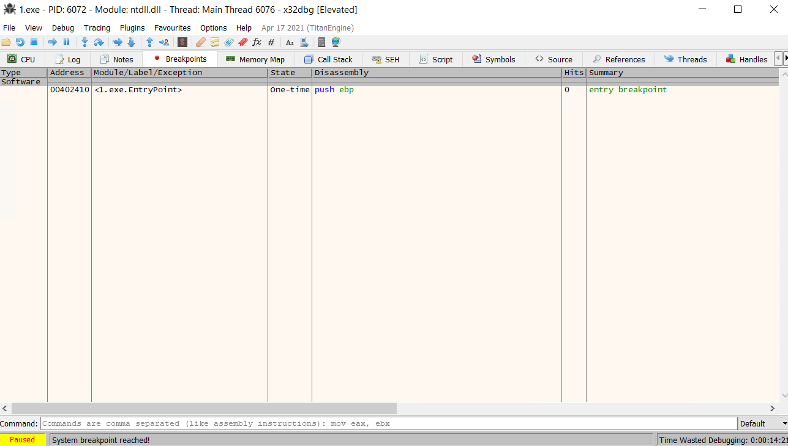

The **Memory Map tab** shows the full virtual memory layout of the process — all loaded modules, their sections (.text, .data, .rdata), permissions, and addresses.

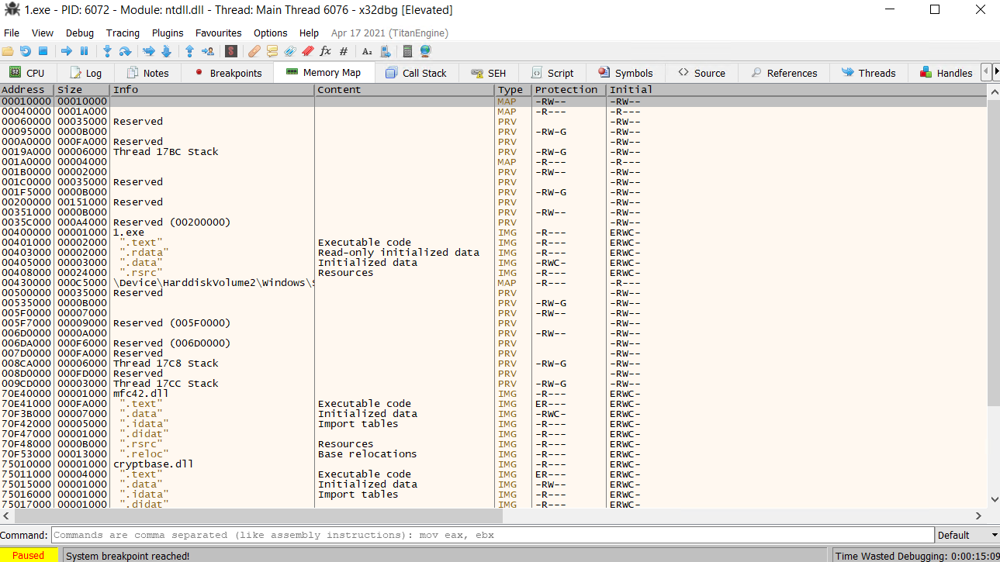

The **Call Stack tab** shows the current call chain — which functions called the current one, useful for tracing execution context.

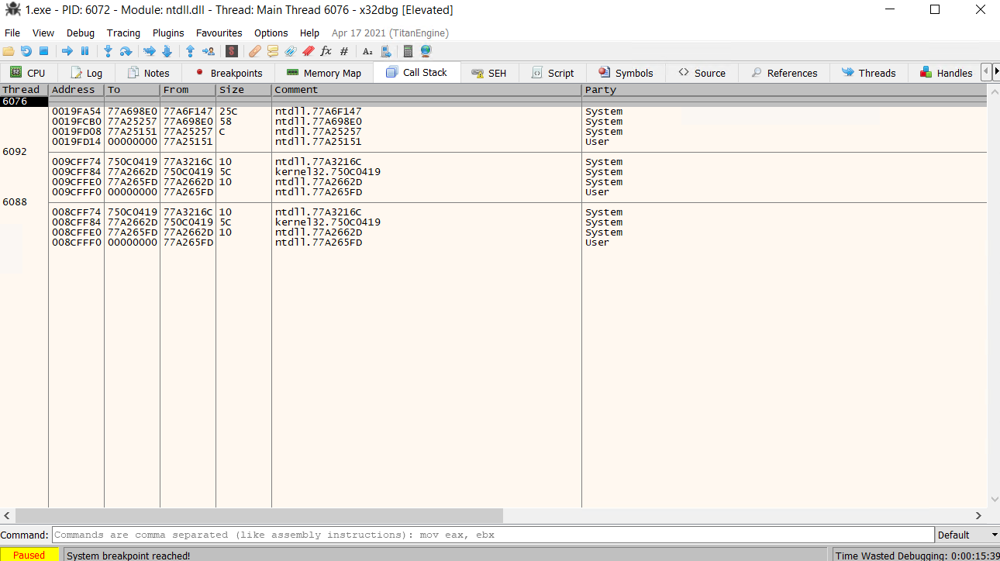

The **Threads tab** lists all threads running in the process along with their IDs, entry points, current EIP, and suspend counts.

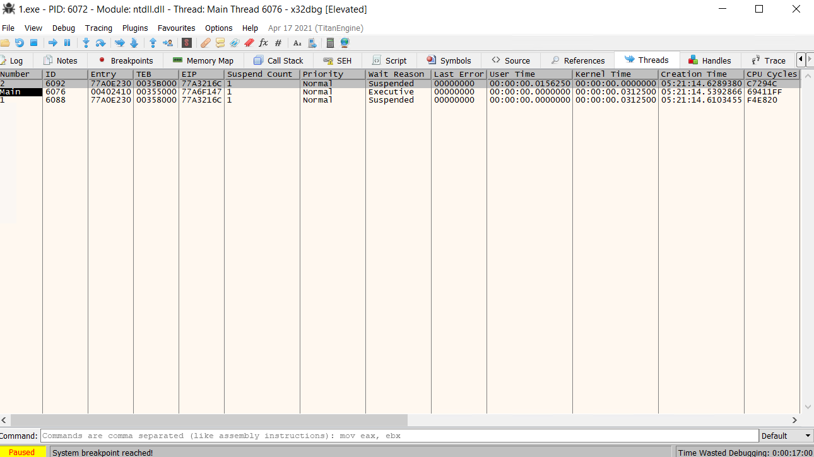

The **Handles tab** displays all open handles — files, registry keys, processes, or other resources the process has opened. This is particularly useful for detecting malware that opens handles to other processes or sensitive files.

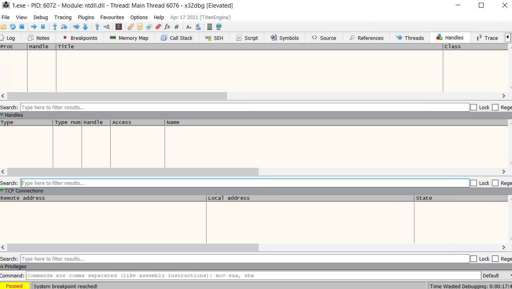

**Q: In which tab is the disassembly view shown in x32dbg?**
```
CPU Tab
```

**Q: If a process opens a file or a process, where can we see information regarding that opened file or process?**
```
Handles tab
```

---

## Task 5 — Debugging in Practice

With the UI understood, we now debug an actual sample: `crackme-arebel.exe`, located at `Desktop > crackme-arebel`.

### Loading the Sample

Open x32dbg, navigate to `File > Open`, browse to the crackme-arebel folder, and select `crackme-arebel.exe`.

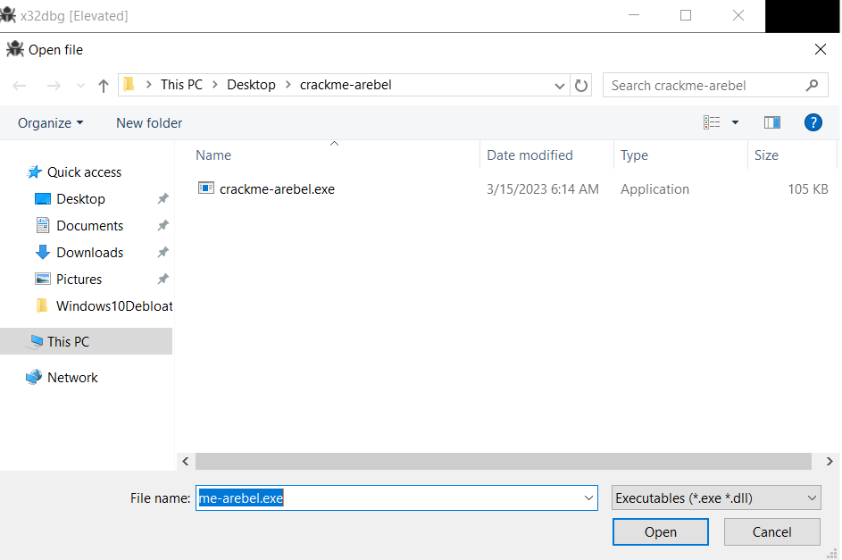

The debugger attaches to the process and pauses it before any user code runs. A blank command window appears in the background — the process has started but is suspended.

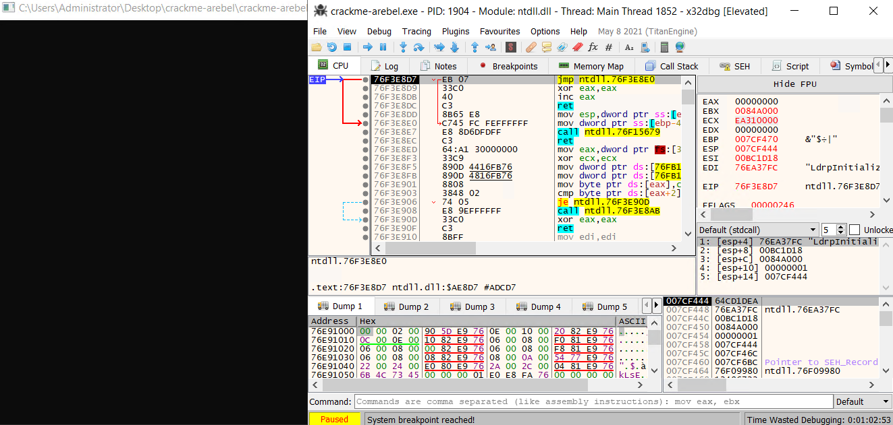

### Execution Controls

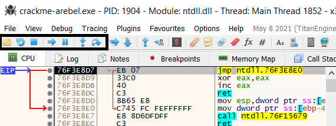

The key controls used in this room, from left to right:

| Control | Action |
|---------|--------|
| **Open** | Load a new file |
| **Restart** | Restart execution from the beginning |
| **Stop** | Terminate the process |
| **Run (arrow)** | Execute until the next breakpoint or pause |
| **Pause** | Suspend execution |
| **Step Into** | Execute one instruction, following calls into functions |
| **Step Over** | Execute one instruction, treating calls as a single step |

> 💡 **Tip:** Do not press Run immediately on an unknown sample without understanding what it will do. TLS callbacks can execute before the main entry point and may freeze the debugger.

### Hitting the TLS Callback

Pressing Run once causes the status to change to **Running**, then **Paused**. The status bar shows: `INT3 breakpoint "TLS Callback 1"`.

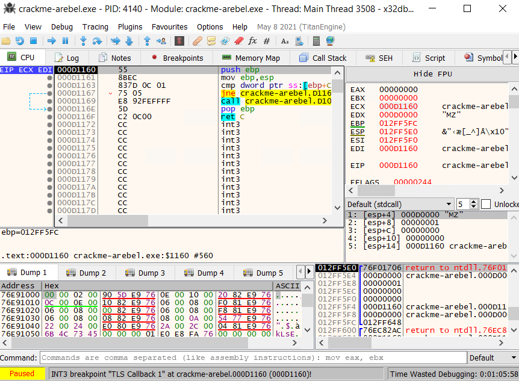

This is a **Thread Local Storage (TLS) callback** — code that runs before the main entry point. It's commonly used as an anti-debugging technique. x32dbg breaks on TLS callbacks by default, which can be verified in `Options > Preferences > Events`.

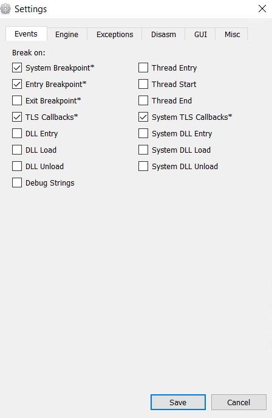

> 🔴 **Malware relevance:** TLS callbacks are a classic anti-reverse engineering technique. Because they execute before the program's main function, analysts who jump straight to the entry point miss this code entirely. Always check for TLS callbacks when loading a sample.

### Stepping Through the Callback

Using **Step Into**, we advance through each instruction in the TLS callback. After a few steps, we arrive at a **conditional jump** instruction (`jne`). The status bar confirms: `Jump is not taken`.

The registers pane shows **ZF = 1** — since `jne` jumps only when ZF is 0, the jump is not taken and execution falls through to the next instruction.

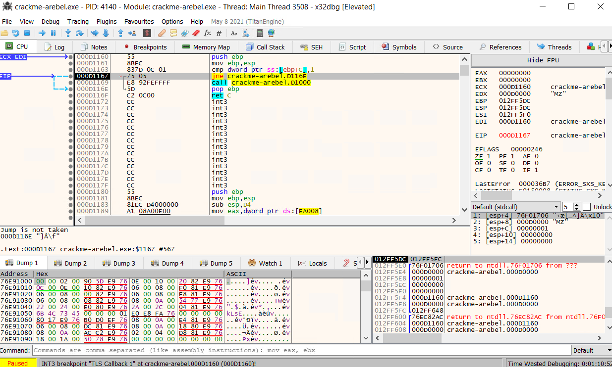

### Analysing Both Paths

If the jump **were** taken, execution would go to address `D116E` — which just pops EBP and returns (a clean exit from the callback). The path where the jump is **not** taken leads to address `D1000`. Following that address in the disassembler reveals calls to `CreateToolhelp32Snapshot` and `LoadLibrary`.

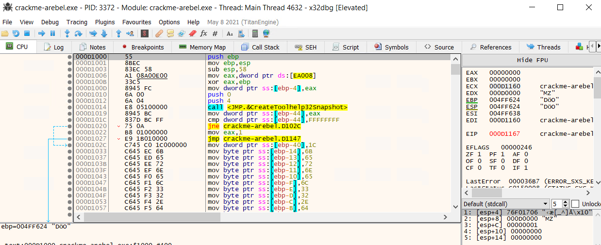

`CreateToolhelp32Snapshot` is used to enumerate running processes. Continuing down this code path, we see a `LoadLibrary` call loading a specific string — **SuspendThread** from `kernel32.dll`.

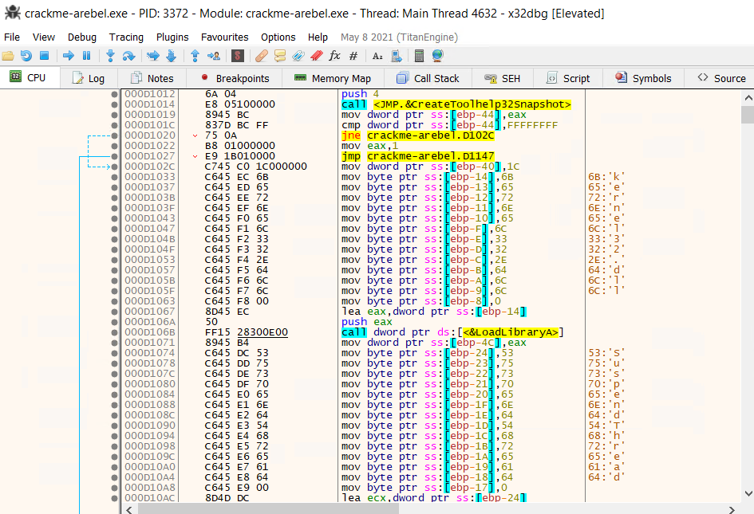

> 🔴 **Malware relevance:** This is a textbook anti-debugging technique: enumerate processes, detect a debugger, then call `SuspendThread` to freeze the analysis environment. The TLS callback runs this check before the malware's main logic even begins.

This confirms the `not taken` path is an **evasion code path**. The goal for the next task is to force the jump to be taken, bypassing this evasion entirely.

**Q: The attached VM has a crackme in the directory Desktop > crackme-arebel. In that crackme, there is a TLS callback with a conditional jump. Is this conditional jump taken? Write Y for Yes or N for No**
```
N
```

**Q: What is the value of the Zero Flag in the above-mentioned conditional jump?**
```
1
```

**Q: Which API call in the mentioned sample is used for enumerating running processes?**
```
CreateToolhelp32Snapshot
```

**Q: From which Windows DLL is the API SuspendThread being called?**
```
kernel32.dll
```

---

## Task 6 — Bypassing Unwanted Execution Paths

With the evasion path identified, we now have two options: bypass it at runtime by modifying registers, or permanently remove it by patching the binary.

### Method 1: Runtime Register Manipulation

Restart the sample and let it run until it hits the TLS Callback 1 breakpoint again.

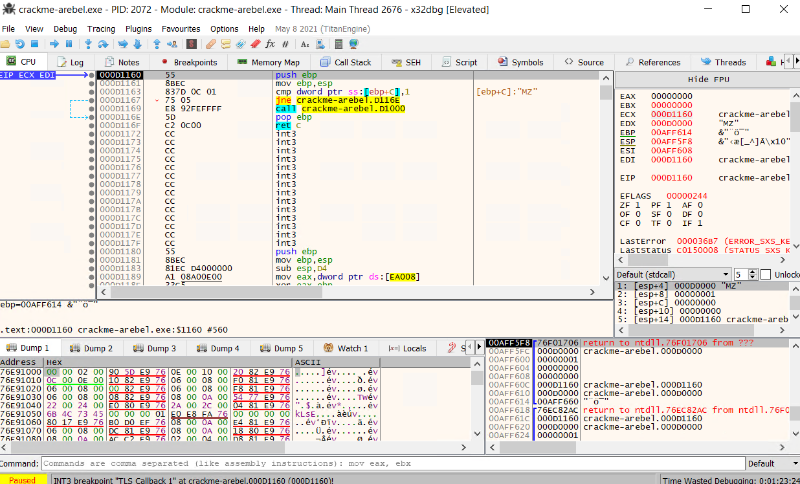

Step through the instructions until reaching the conditional jump. The status bar again shows `Jump is not taken` with ZF = 1.

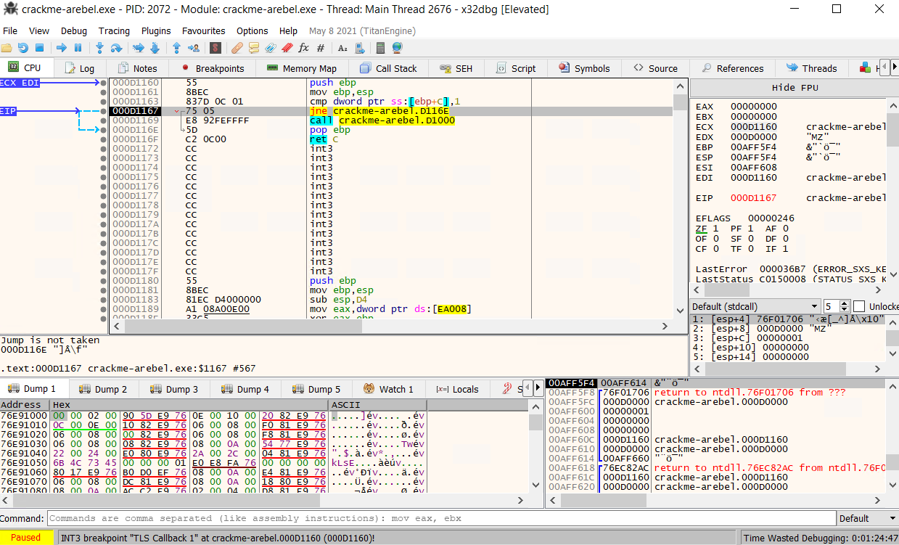

Double-click **ZF** in the registers pane to toggle it from 1 to 0. With ZF = 0, the `jne` condition is satisfied and the jump is taken.


Execution now redirects to address `D116E` — the clean return path — bypassing the `SuspendThread` evasion code entirely. This works for the current session only. Restarting the sample resets the registers.

### Method 2: Permanent Patching

To defang the binary so it always bypasses the evasion path, we need to permanently alter the binary on disk. Right-click the `jne` instruction and navigate to `Binary > Edit`.

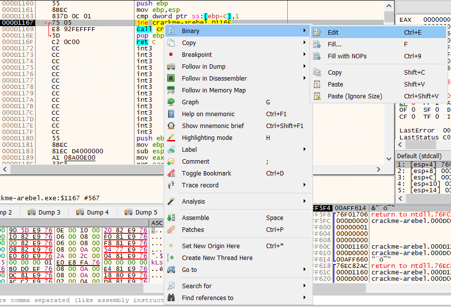

The Edit Code window shows the raw hex of the instruction: **75 05** — the opcode for `jne` (jump if not equal, i.e. jump if ZF=0) with a 5-byte offset.

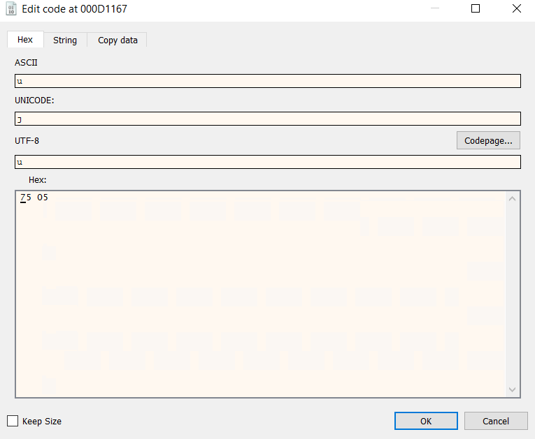

We have three patching options:

| Option | Method | Notes |
|--------|--------|-------|
| Change `jne` to `je` | Modify opcode `75` → `74` | Jump is now taken when ZF=1. Simple but fragile. |
| Change to unconditional `jmp` | Modify opcode `75` → `EB` | Jump always taken regardless of flags. More reliable. |
| **NOP out the call** | Right-click → `Binary > Fill with NOPs` | Eliminates the instruction entirely. Cleanest approach. |

The NOP approach is applied to the `call` at address `D1169` — right-clicking and selecting `Binary > Fill with NOPs`.

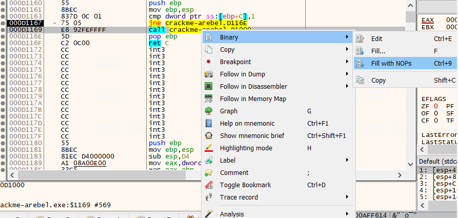

Once patched in memory, navigate to `File > Patch File` to write the changes to disk. The Patches window lists every modified byte.

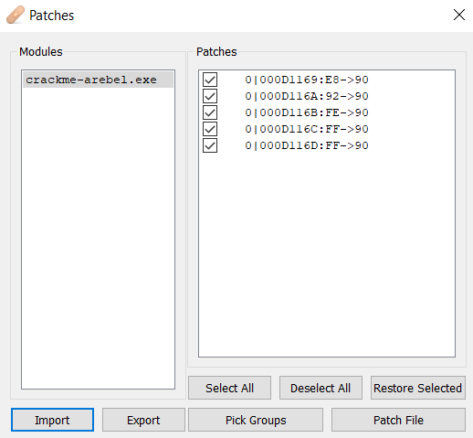

Click **Patch File** and save. The disassembly now shows the original 5-byte `call` instruction replaced with **five NOP instructions** — one per byte.

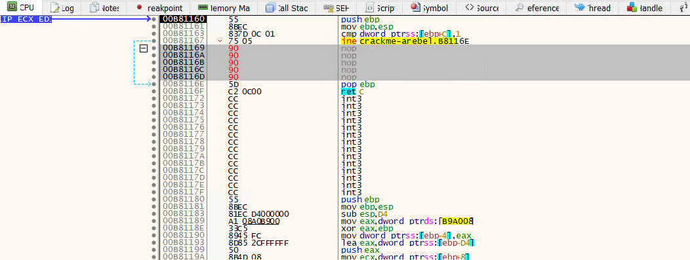

Loading the saved patched binary (`crackme-arebel1.exe`) confirms the patch — the same region now shows the `jne` instruction followed by five NOPs, with the evasion code path permanently neutralised.

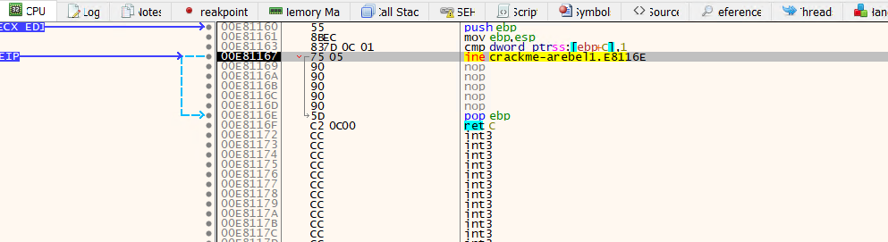

> 🔴 **Malware relevance:** Patching is a key technique in malware analysis. When a sample is packed or has anti-analysis logic gating its payload, patching lets you remove those gates so behavioural analysis can proceed. The patched binary can then be run in a monitored environment to observe the actual malicious behaviour without the evasion code interfering.

> 💡 **Tip:** Always work on a copy of the original sample. Keep the unpatched binary intact for reference. Maintain hash records of both the original and patched versions in your case notes.

**Q: What is it called when a binary's assembly code is permanently altered to get the desired execution path?**
```
Patching
```

---

## Task 7 — Conclusion

This room covered the full workflow of advanced dynamic analysis using a debugger:

**Q: Head over to our social channels for further discussion.**
```
No answer needed
```

---

## Key Takeaways

- **Static and basic dynamic analysis have limits** — malware authors actively counteract both using packing, obfuscation, VM detection, timing attacks, process enumeration, and user activity checks.
- **TLS callbacks execute before the entry point** — always break on them and inspect them before running the main program. They are a common location for anti-debugging logic.
- **Assembly-level debuggers give instruction-level control** — x32dbg/x64dbg let you pause, step, inspect registers and memory, and redirect execution flow at any point.
- **ZF manipulation is a quick runtime bypass** — toggling the Zero Flag with a double-click in x32dbg is often all it takes to redirect a conditional jump and bypass an evasion routine.
- **Patching makes bypasses permanent** — NOPing out instructions or changing jump opcodes writes the fix to disk so the sample can be run directly without needing a debugger present.
- **`CreateToolhelp32Snapshot` is a red flag** — when seen in a TLS callback or early execution path, it almost always signals process enumeration for debugger/tool detection.
- **Know your patching options** — `jne` → `je`, `jne` → `jmp` (unconditional), or NOP fill. The NOP approach is the cleanest as it removes the instruction entirely rather than inverting its logic.

---

*Write-up by [OPT4RUN](https://tryhackme.com/p/OPT4RUN)*