| Field | Details |
|-------|---------|
| **Room** | MalBuster |
| **Platform** | TryHackMe |
| **Path** | SOC Level 2 |
| **Module** | Malware Analysis |
| **Difficulty** | Medium |
| **Category** | Challenge |
| **Room Link** | [tryhackme.com/room/malbuster](https://tryhackme.com/room/malbuster) |
| **Author** | [OPT4RUN](https://tryhackme.com/p/OPT4RUN) |

---

## Overview

MalBuster is a pure challenge room — no guided tasks, just four unknown malware samples and a set of questions that simulate a real triage workflow. The scenario puts you in the role of a Malware Reverse Engineer supporting the SOC team after an analyst flags binaries with unusual behaviour.

The four samples (`malbuster_1` through `malbuster_4`) are analysed entirely through static methods — no execution, no dynamic analysis. The workflow mirrors what a real analyst would do when a sample lands on their desk: check the architecture, hash it, cross-reference threat intel platforms, inspect PE headers, enumerate imports and strings, and finally run capability analysis with capa to map behaviour to MITRE ATT&CK.

> 🔴 **Malware relevance:** This room is a compressed version of the static triage loop that SOC/RE teams run on every unknown binary. Getting fast at this workflow — hash → VT/abuse.ch → PE inspection → strings → capa — is one of the most transferable skills in malware analysis.

Two investigation platforms are provided: a Windows-based **FLARE VM** and a Linux-based **REMnux VM**. This write-up uses the FLARE VM.

---

## Task 1 — Introduction

Task 1 sets the scenario and spins up the investigation platform. Samples are located at:

- **FLARE VM:** `C:\Users\Administrator\Desktop\Samples`
- **REMnux:** `/home/ubuntu/Desktop/Samples`

> ⚠️ The room explicitly warns against downloading the malware samples to your host machine. Always analyse in the provided VM.

No questions in this task.

---

## Task 2 — Challenge Questions


The FLARE VM desktop. The `Samples` folder contains all four binaries. `capa.exe` is available directly on the desktop for capability analysis.

---

### Q1 — Architecture of malbuster_1

**Approach:** Opened `malbuster_1` in PEStudio. The status bar at the bottom immediately reports `cpu: 32-bit`. In the optional header view, the `magic` field shows `0x010B`, which corresponds to a 32-bit PE (`PE32`), as opposed to `0x020B` for PE32+ (64-bit).

> 🔴 **Malware relevance:** Architecture matters for tool selection and analysis context. A 32-bit binary running on a modern 64-bit system uses WoW64 (Windows 32-bit on Windows 64-bit) — a compatibility layer that can itself be abused by some malware families for injection and evasion.

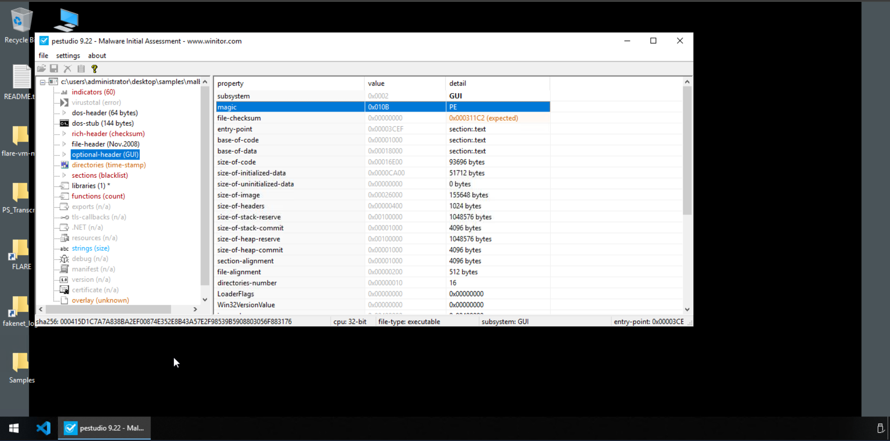

**Q: Based on the ARCHITECTURE of the binary, is malbuster_1 a 32-bit or a 64-bit application?**

32-bit

---

### Q2 — MD5 hash of malbuster_1

**Approach:** Still in PEStudio, navigated to the top-level file view. PEStudio computes and displays the MD5, SHA1, and SHA256 hashes automatically on load.

> 💡 **Tip:** PEStudio is the fastest way to grab hashes on FLARE VM — no need to drop to the command line with `md5sum` or `CertUtil`. The hash is ready the moment you open the file.

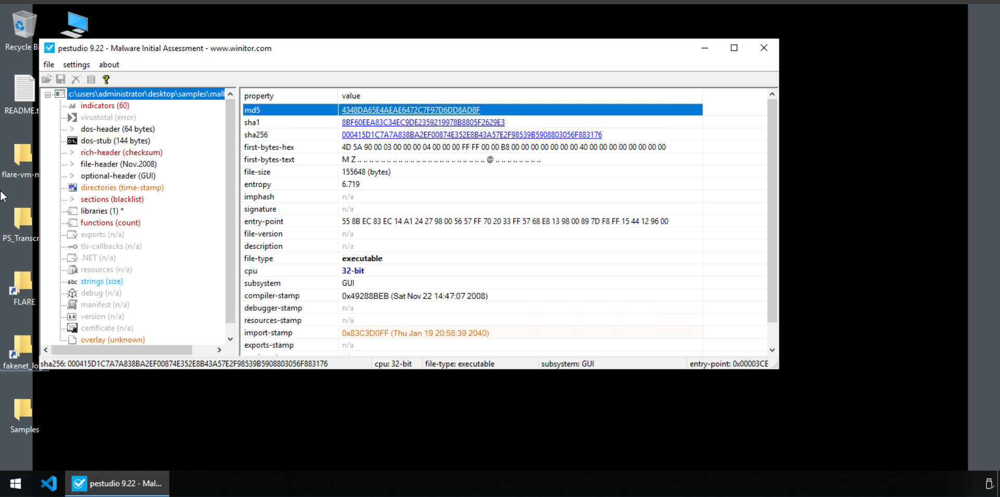

**Q: What is the MD5 hash of malbuster_1?**

4348da65e4aeae6472c7f97d6dd8ad8f

---

### Q3 — VirusTotal threat label for malbuster_1

**Approach:** Submitted the MD5 hash to [VirusTotal](https://www.virustotal.com). 59/72 vendors flagged the sample. The **Popular threat label** field at the top of the Detection tab identifies the consensus family name.

> 🔴 **Malware relevance:** The ZBot (Zeus) and Razy family labels are significant. ZBot is a well-documented banking trojan known for credential theft via browser hooking, form grabbing, and keylogging. The `trojan.zbot/razy` label tells the SOC team what category of threat they're dealing with before any deep analysis begins.

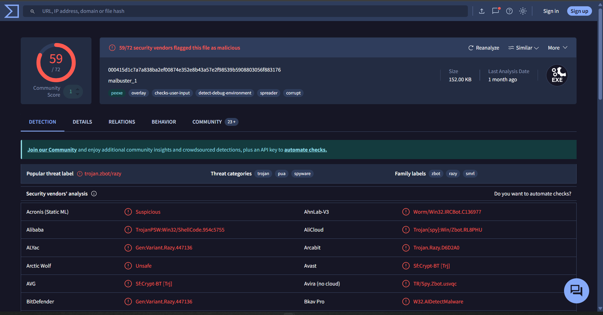

**Q: Using the hash, what is the popular threat label of malbuster_1 according to VirusTotal?**

trojan.zbot/razy

---

### Q4 — Avira signature for malbuster_2

**Approach:** Opened `malbuster_2` in PEStudio to extract its MD5 hash, then submitted the hash to VirusTotal. On the Detection tab, located the **Avira (no cloud)** row in the security vendors table.

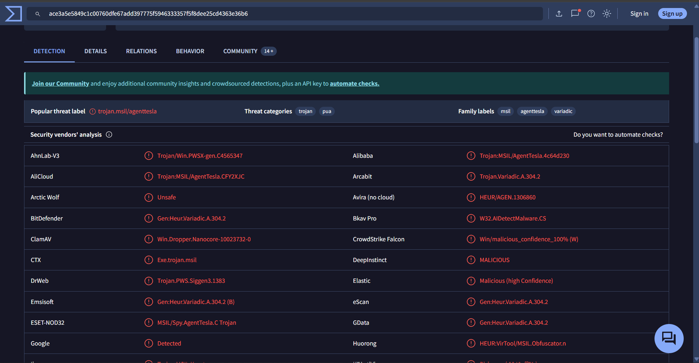

> 💡 **Tip:** Avira's `HEUR/AGEN` prefix indicates a heuristic detection — the engine flagged the file based on behavioural patterns rather than a known signature match. Heuristic labels are less specific but useful for catching novel variants.

**Q: Based on VirusTotal detection, what is the malware signature of malbuster_2 according to Avira?**

HEUR/AGEN.1306860

---

### Q5 — DLL source of `_CorExeMain` in malbuster_2

**Approach:** In PEStudio, navigated to the **functions** section of `malbuster_2`. The functions view lists each imported function alongside the DLL it originates from. `_CorExeMain` is the very first entry and is flagged with `mscoree.dll` as its library.

> 🔴 **Malware relevance:** `_CorExeMain` from `mscoree.dll` (Microsoft Component Object Runtime Execution Engine) is the entry point signature of a **.NET executable**. This single import is all a .NET PE needs — the CLR takes over from there. Knowing a sample is .NET-based changes your tooling choices: you'd reach for dnSpy or ILSpy for decompilation rather than a disassembler like Ghidra or IDA.

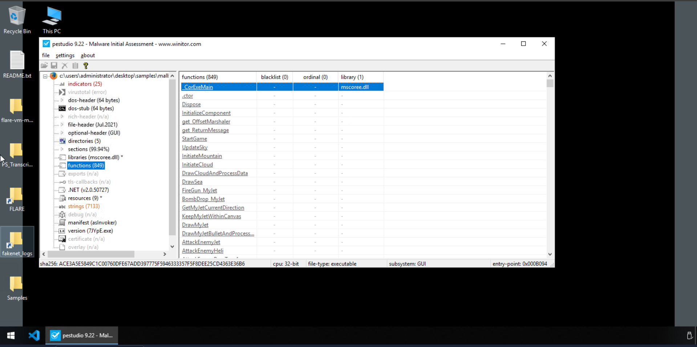

**Q: malbuster_2 imports the function `_CorExeMain`. From which DLL file does it import this function?**

mscoree.dll

---

### Q6 — Original filename of malbuster_2 from VS_VERSION_INFO

**Approach:** In PEStudio, navigated to the **version** section (shown in the tree as `version (7JYpE.exe)` — PEStudio helpfully names the node with the value it found). The `VS_VERSION_INFO` resource block contains metadata the developer embedded at compile time, including the `OriginalFilename` field.

> 🔴 **Malware relevance:** The `OriginalFilename` field in `VS_VERSION_INFO` is attacker-controlled and often used for masquerading. In this case the name `7JYpE.exe` is clearly randomly generated — a common tactic to avoid signature matching on filenames. Correlating the original name against threat intel can reveal campaign infrastructure or tooling reuse.

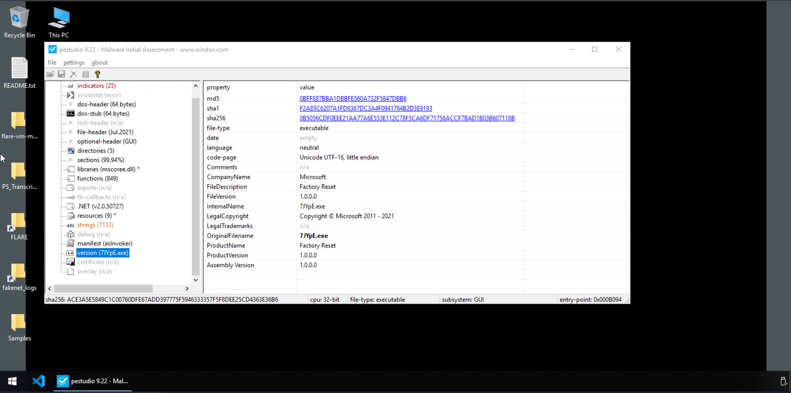

**Q: Based on the VS_VERSION_INFO header, what is the original name of malbuster_2?**

7JYpE.exe

---

### Q7 — abuse.ch signature for malbuster_3

**Approach:** Opened `malbuster_3` in PEStudio to grab its MD5 hash, then searched the hash on [MalwareBazaar (abuse.ch)](https://bazaar.abuse.ch). The result returned a single entry with the **Signature** column populated.

> 🔴 **Malware relevance:** TrickBot is a sophisticated modular banking trojan that evolved from Dyre. Beyond credential theft, it's been used as a loader for secondary payloads including Ryuk ransomware, making it a high-severity detection in any SOC environment.

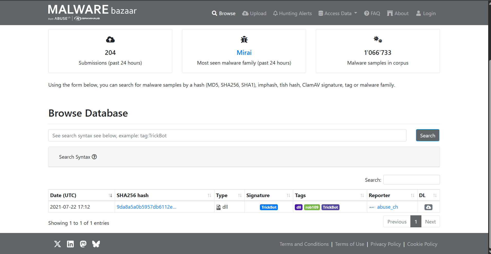

**Q: Using the hash of malbuster_3, what is its malware signature based on abuse.ch?**

TrickBot

---

### Q8 — abuse.ch signature for malbuster_4

**Approach:** Same process as Q7 — MD5 hash from PEStudio, searched on MalwareBazaar.

> 🔴 **Malware relevance:** ZLoader (a descendant of the ZBot/Zeus lineage) is a banking trojan and downloader known for abusing legitimate tools and living-off-the-land techniques. Its presence alongside TrickBot in the same sample set suggests a related campaign or threat actor tooling overlap.

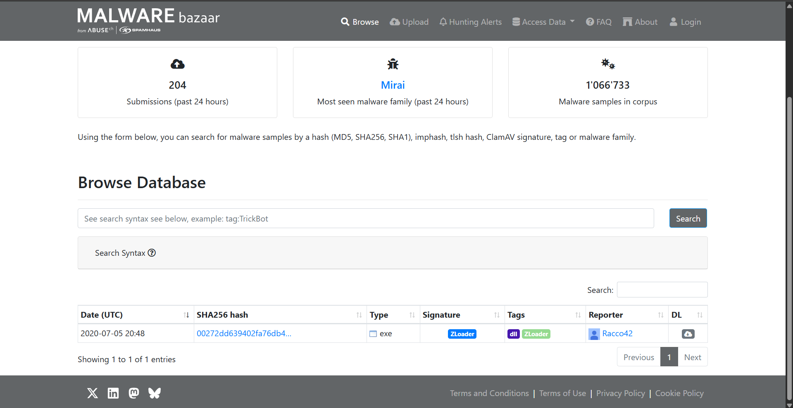

**Q: Using the hash of malbuster_4, what is its malware signature based on abuse.ch?**

Zloader

---

### Q9 — DOS_STUB message in malbuster_4

**Approach:** PEStudio couldn't parse the DOS stub for this sample, so switched to **PE-bear**. Opened `malbuster_4`, selected the **DOS stub** node in the tree on the left, and read the human-readable text from the hex dump panel on the right.

> 💡 **Tip:** The DOS stub is a small 16-bit program that normally prints `"This program cannot be run in DOS mode."` The fact that this sample says `"Salfram"` instead of `"program"` is a deliberate modification — a known artefact used for sample correlation and attribution across the ZLoader family.

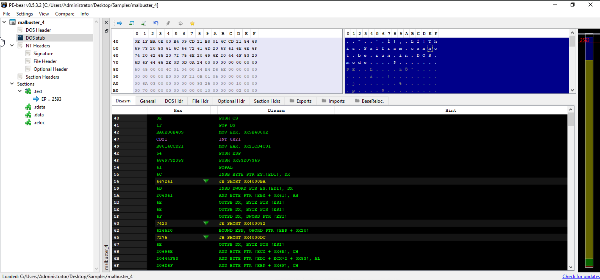

**Q: What is the message found in the DOS_STUB of malbuster_4?**

!This Salfram cannot be run in DOS mode.

---

### Q10 — DLL source of `ShellExecuteA` in malbuster_4

**Approach:** In PE-bear (already open from Q9), clicked the **Imports** tab. The imports are grouped by DLL. Located `shell32.dll` in the table and confirmed `ShellExecuteA` is listed under it.

> 🔴 **Malware relevance:** `ShellExecuteA` from `shell32.dll` is a red flag in malware analysis. It's used to open, run, or launch files and URLs — commonly abused by droppers and loaders to execute secondary payloads, open malicious URLs, or launch system binaries with elevated context.

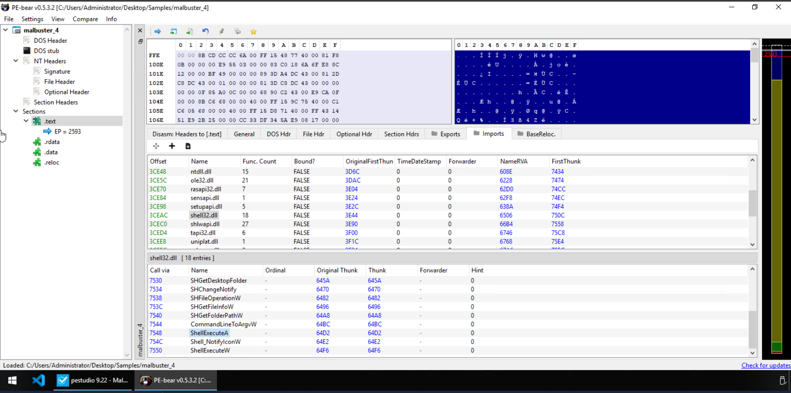

**Q: malbuster_4 imports the function `ShellExecuteA`. From which DLL file does it import this function?**

shell32.dll

---

### Q11 — capa anti-VM instruction count for malbuster_1

**Approach:** Ran capa against `malbuster_1` from the command line:

```cmd
capa Samples\malbuster_1
```

In the output, under the **CAPABILITY** section, `reference anti-VM strings` is listed. The ATT&CK mapping shows `Virtualization/Sandbox Evasion::System Checks T1497.001` under DEFENSE EVASION. The count of matched anti-VM instructions is reported as **3**.

> 🔴 **Malware relevance:** Anti-VM checks are used by malware to detect sandboxed analysis environments and alter behaviour accordingly — typically going dormant or exiting cleanly to avoid automated detection. Identifying these checks early tells the SOC that the sample is sandbox-aware, and that dynamic analysis results from automated platforms may be incomplete or misleading.

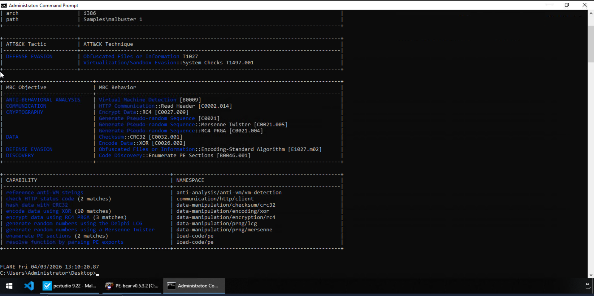

**Q: Using capa, how many anti-VM instructions were identified in malbuster_1?**

3

---

### Q12 — Which binary can log keystrokes?

**Approach:** Ran capa against each of the four samples in turn. `malbuster_3` produced output showing two keylogging capabilities: `log keystrokes via application hook` and `log keystrokes via polling`, both mapped to the `collection/keylog` namespace.

> 🔴 **Malware relevance:** This aligns with the TrickBot attribution from Q7 — TrickBot modules are known to include keylogging functionality for credential harvesting. The two methods (hook-based and polling-based) suggest the sample uses both techniques to maximise coverage across different application types.

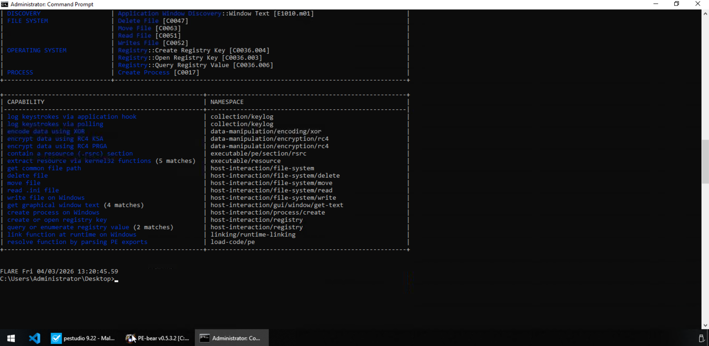

**Q: Using capa, which binary can log keystrokes?**

malbuster_3

---

### Q13 — MITRE DISCOVERY technique ID for malbuster_4

**Approach:** Ran capa against `malbuster_4`:

```cmd
capa Samples\malbuster_4
```

The ATT&CK section of the output shows a single tactic: `DISCOVERY`, mapped to the technique `File and Directory Discovery` with ID **T1083**.

> 🔴 **Malware relevance:** T1083 (File and Directory Discovery) is used by malware during the reconnaissance phase after initial access — enumerating files and directories to locate valuable targets such as documents, credentials, or configuration files. For ZLoader, this is consistent with its file-searching behaviour prior to data exfiltration.

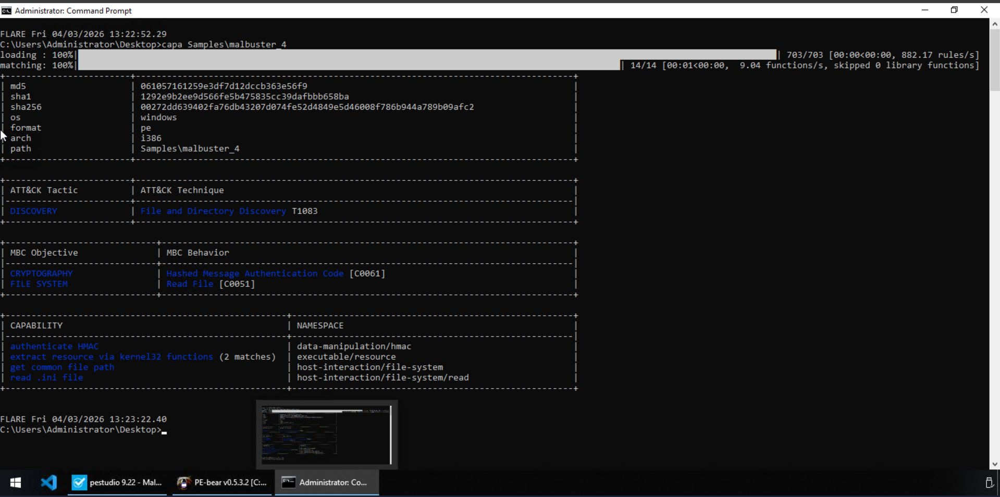

**Q: Using capa, what is the MITRE ID of the DISCOVERY technique used by malbuster_4?**

T1083

---

### Q14 & Q15 — String hunting: GodMode and Mozilla User-Agent

**Approach:** Used the Windows `strings` utility piped through `findstr /i` (case-insensitive) to search across all four samples. Checked each binary individually:

```cmd
strings Samples\malbuster_2 | findstr /i "godmode"
strings Samples\malbuster_1 | findstr /i "mozilla"
```

`malbuster_2` returned `get_GodMode`, `set_GodMode`, and `GodMode` — confirming the string is present. `malbuster_1` returned the full User-Agent string.

> 🔴 **Malware relevance:** The `GodMode` string in `malbuster_2` is likely an internal label within the .NET codebase — method names like `get_GodMode` and `set_GodMode` suggest a property, possibly controlling an elevated or unrestricted operational mode. The `Mozilla/4.0 (compatible; MSIE 6.0; Windows NT 5.1; SV1)` User-Agent in `malbuster_1` is a classic ZBot artefact — it masquerades as Internet Explorer 6 on Windows XP to blend in with older expected traffic patterns or bypass basic User-Agent filtering.

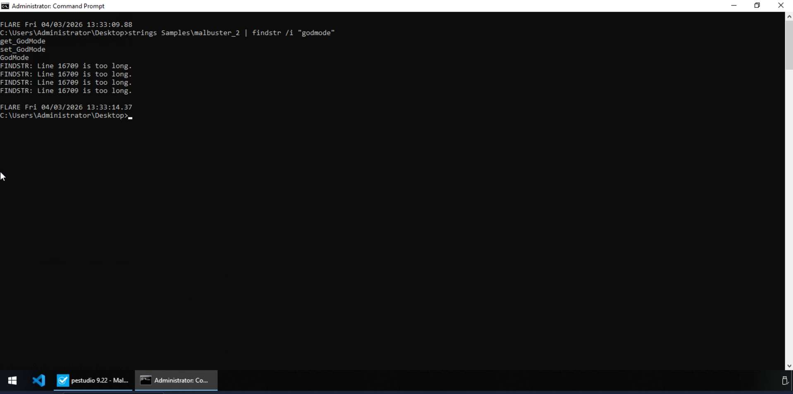

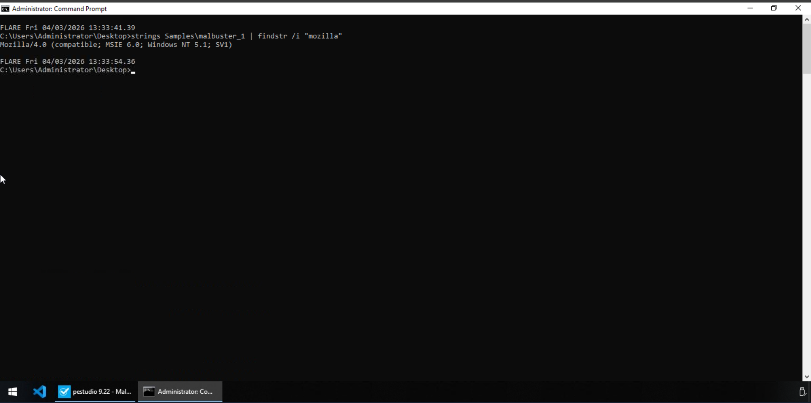

**Q: Which binary contains the string GodMode?**

malbuster_2

**Q: Which binary contains the string `Mozilla/4.0 (compatible; MSIE 6.0; Windows NT 5.1; SV1)`?**

malbuster_1

---

## Key Takeaways

- **Hash first, always** — MD5/SHA256 lookups on VirusTotal and MalwareBazaar give instant family attribution and vendor detection context before touching the binary any further.
- **A single import can fingerprint a runtime** — `_CorExeMain` from `mscoree.dll` immediately identifies a .NET binary, changing the entire analysis toolchain.
- **`VS_VERSION_INFO` is attacker-controlled** — randomly generated `OriginalFilename` values are a masquerading technique; always cross-reference against threat intel.
- **Tampered DOS stubs are attribution artefacts** — the `"Salfram"` string in `malbuster_4`'s DOS stub is a known ZLoader family marker, demonstrating how small deviations from the standard PE template can be used for cluster correlation.
- **capa maps code to intent** — without executing a single instruction, capa identified anti-VM evasion, keylogging, file discovery, and more across the sample set. This is essential when sandbox results may be suppressed by the malware's own evasion logic.
- **String hunting with `strings` + `findstr`** — a fast, low-overhead technique for finding hardcoded indicators like C2 User-Agents, internal labels, or configuration values embedded in the binary.
- **The four samples map to real malware families:** `malbuster_1` → ZBot/Razy trojan, `malbuster_2` → AgentTesla (.NET), `malbuster_3` → TrickBot, `malbuster_4` → ZLoader.

---

*Write-up by [OPT4RUN](https://tryhackme.com/p/OPT4RUN)*
