# MalDoc: Static Analysis

| Field | Details |
|-------|---------|
| **Platform** | TryHackMe |
| **Path** | SOC Level 2 |
| **Module** | Malware Analysis |
| **Difficulty** | Medium |
| **Category** | Malware Analysis |
| **Room Link** | [tryhackme.com/room/maldoc](https://tryhackme.com/room/maldoc) |
| **Author** | [OPT4RUN](https://tryhackme.com/p/OPT4RUN) |

---

## Overview

This room focuses on static analysis of malicious documents — one of the most common initial access vectors used by threat actors. Documents like PDFs, Word files, and OneNote notebooks are regularly weaponized to deliver malware, execute scripts, or establish C2 connections through phishing campaigns.

From a SOC/blue team perspective, understanding how these documents are structured and how to extract IOCs from them is critical — whether you're triaging a phishing alert, hunting for indicators, or writing detection rules.

The room covers:
- PDF structure and analysis (`pdfid.py`, `pdf-parser.py`, `peepdf`)
- JavaScript deobfuscation (`box-js`)
- OLE-based Word document analysis (`oleid`, `olevba`, `oledump.py`, `ViperMonkey`)
- OneNote document analysis (`onedump.py`, `strings`, CyberChef)

---

## Task 1 — Introduction

The room opens by framing malicious documents as a key threat vector. The expected outcome is to analyze a document and extract IOCs such as:

- Malicious URLs
- File names / API function references
- IP addresses and domains
- Malicious scripts (PowerShell, JavaScript, VBScript macros)

No questions.

---

## Task 2 — Connecting with the Lab

Standard lab setup task. Connect via split screen or RDP.

| Field | Value |
|-------|-------|
| **Username** | remnux |
| **Password** | malware |

No questions.

---

## Task 3 — Initial Access: Spearphishing Attachment

### Concept

Malicious documents are among the most common methods used for initial access. [Spearphishing with attachments](https://attack.mitre.org/techniques/T1566/001/) (MITRE T1566.001) targets specific individuals with crafted emails carrying weaponized documents.

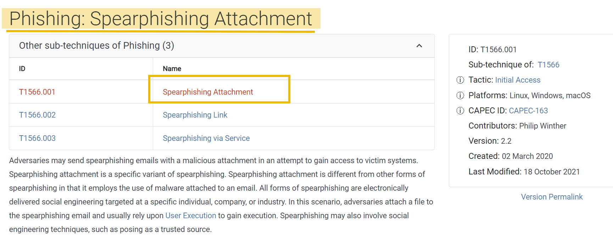

### Notable APT Groups Using This Technique

| APT Group | Origin | Notable Campaign |
|-----------|--------|-----------------|
| APT28 (Fancy Bear) | Russia | 2016 DNC hack |
| APT34 (OilRig) | Iran | Middle East targeting via malicious Excel |
| APT29 (Cozy Bear) | Russia | 2020 Norwegian Parliament attack |
| APT10 (MenuPass) | China | Aerospace & government espionage |

### Malware Families Distributed via Malicious Docs

| Family | Type | Distribution Method |
|--------|------|---------------------|
| Emotet | Banking Trojan | Word documents |
| Trickbot | Banking Trojan | Email attachments (modular) |
| QakBot | Banking Trojan | Email attachments |
| Dridex | Banking Trojan | Email attachments (active since 2014) |
| Locky | Ransomware | Word documents |
| Zeus | Banking Trojan | Email attachments (active since 2007) |
| Petya | Ransomware | Email attachments (encrypts entire HDD) |

> 🔴 **Malware Relevance:** Emotet and Trickbot are frequently chained — Emotet acts as a loader and drops Trickbot, which then delivers ransomware. Recognizing document-based delivery is key to breaking that kill chain early.

### Questions

**Q: From which family does the Locky malware belong to?**
```
ransomware
```

**Q: What is the Sub-technique ID assigned to Spearphishing Attachment?**
```
T1566.001
```

---

## Task 4 — Documents and Their Malicious Use

### Threat Surface by Document Type

| Format | Abuse Method |
|--------|-------------|
| PDF | Embedded JavaScript, exploit links, `/Launch` actions |
| DOCX | Malicious VBA macros triggered on open |
| XLSX | Macro-enabled spreadsheets downloading payloads |
| PPTX | Embedded links or exploit code |
| XML | Code injection via malformed XML |
| OneNote | Embedded scripts/links; `.one` files used in phishing |

> 🔴 **Malware Relevance:** The shift to OneNote as a delivery mechanism became prominent after Microsoft disabled auto-execution of macros in Office documents downloaded from the internet (Mark-of-the-Web policy change, 2022). Threat actors quickly pivoted to formats not covered by that policy.

No questions.

---

## Task 5 — PDF Documents: Structure

### PDF Structure Overview

A PDF is made up of four core sections:

**Header** — identifies the file type and PDF specification version:
```
%PDF-1.7
```

**Body** — contains numbered objects (the actual content):
```
1 0 obj
<< /Type /Catalog
   /Pages 2 0 R
>>
endobj
```

**Cross-reference Table** — maps object locations for fast lookup:
```
xref
0 14
0000000000 65535 f
0000000015 00000 n
...
```

**Trailer** — points to the cross-reference table and contains encryption/security metadata:
```
trailer
<< /Size 14 /Root 1 0 R >>
startxref
788
%%EOF
```

### Dangerous PDF Keywords

| Keyword | Purpose |
|---------|---------|
| `/JavaScript` / `/JS` | Executes JavaScript when the document opens |
| `/OpenAction` / `/AA` | Triggers an action automatically on open |
| `/EmbeddedFile` | Contains files embedded within the PDF |
| `/URI` / `/SubmitForm` | Links to external URLs |
| `/Launch` | Runs embedded scripts or downloaded files |
| `/Names` | References internal file names |

> 💡 **Tip:** `/OpenAction` combined with `/JavaScript` is the classic combo for auto-executing malicious JS when a PDF is opened — flag these immediately in `pdfid.py` output.

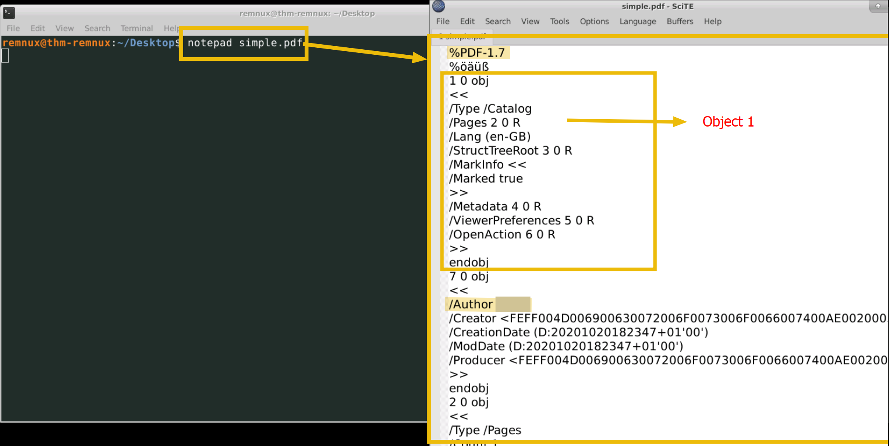

### Questions

**Q: Who is the author of the simple.pdf document?**
```
Ben
```

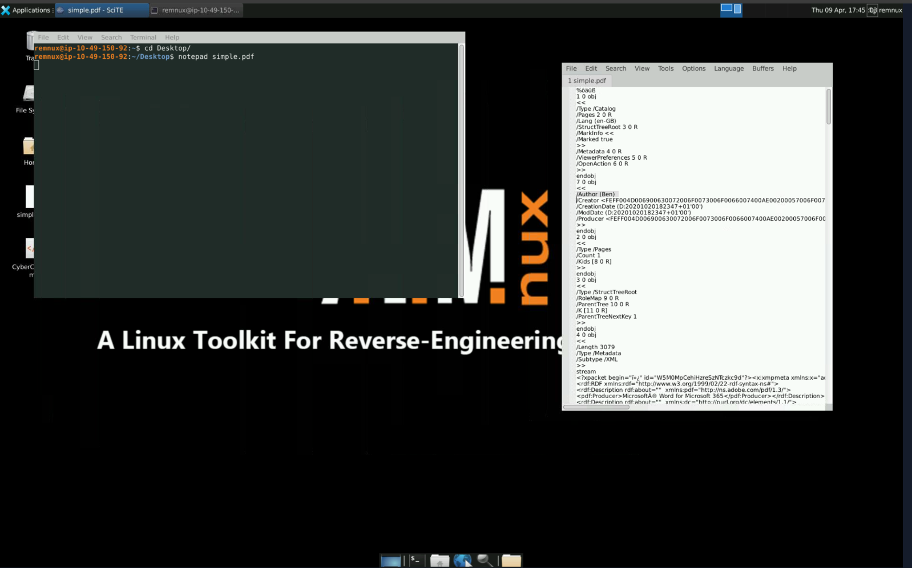

---

## Task 6 — Analyzing a PDF Document

### Toolchain

**Tool: `pdfid.py`**

Summarizes objects and suspicious keywords found in the PDF:

```bash
pdfid.py simple.pdf
```

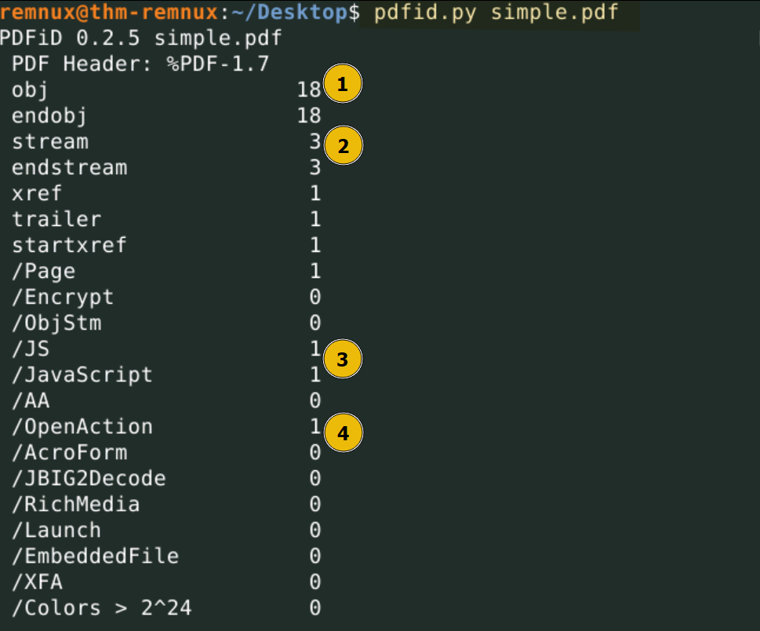

Key findings from `pdfid.py`:
- **18 objects** total
- **3 streams** to examine
- **1 `/JavaScript`** and **1 `/JS`** instance — code will execute
- **1 `/OpenAction`** — something triggers automatically on open

---

**Tool: `pdf-parser.py`**

Parses the PDF and allows searching/filtering by keyword or object number.

```bash
pdf-parser.py --help
```

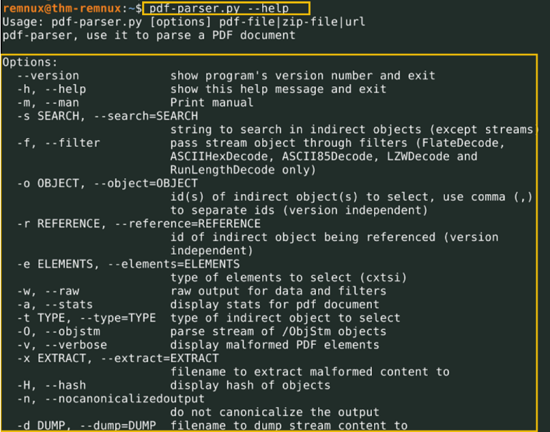

```bash
pdf-parser.py simple.pdf
```

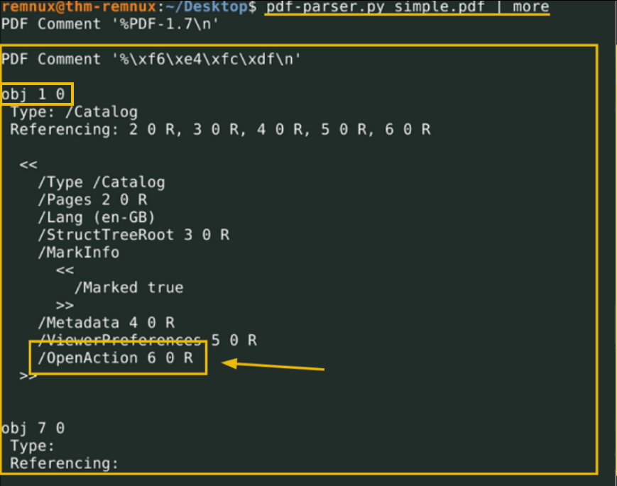

Search for `OpenAction` keyword:

```bash
pdf-parser.py --search OpenAction simple.pdf
```

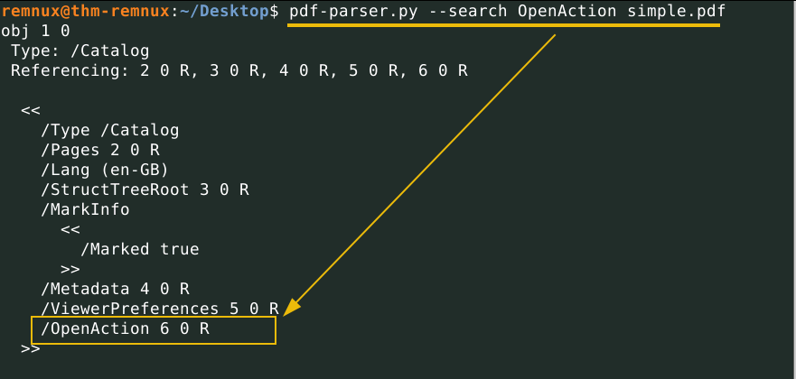

Object 1 contains `/OpenAction` pointing to Object 6. Dump it:

```bash
pdf-parser.py --object 6 simple.pdf
```

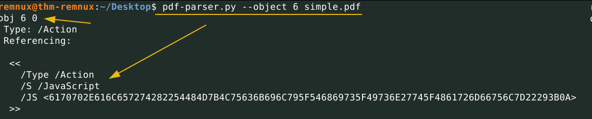

Object 6 holds the JavaScript payload. When the PDF opens, `/OpenAction` fires and executes this code.

Search by `/JavaScript` keyword:

```bash
pdf-parser.py --search Javascript simple.pdf
```

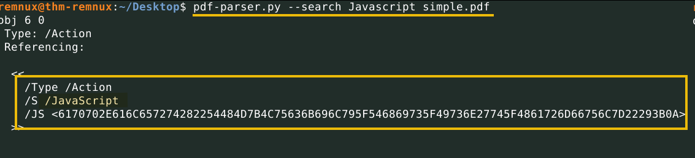

---

**Tool: `peepdf`**

Provides a higher-level summary and an interactive interface for deeper inspection:

```bash
peepdf simple.pdf
```

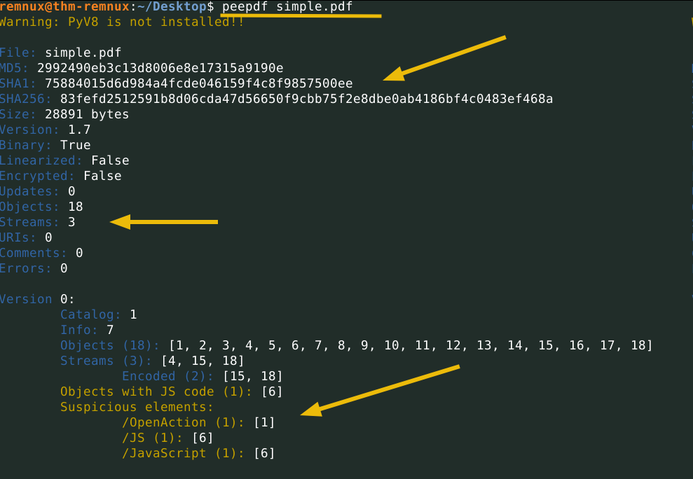

Output includes hashes, object/stream counts, and a list of suspicious elements (JavaScript, OpenAction).

Interactive mode:

```bash
peepdf -i simple.pdf
```

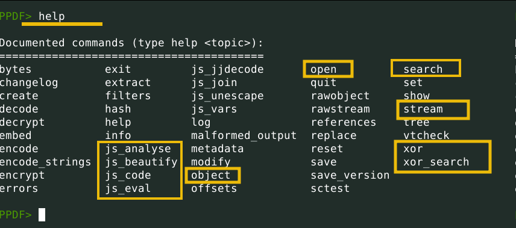

Dump Object 6:

```bash
PPDF> object 6
```

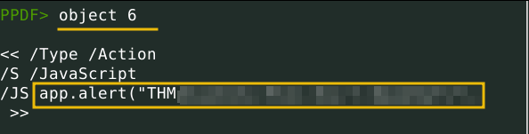

`peepdf` decodes the object and renders the actual JavaScript — no manual base64 stripping needed.

Extract the JavaScript and URIs:

```bash
PPDF> extract js
PPDF> extract uri
```

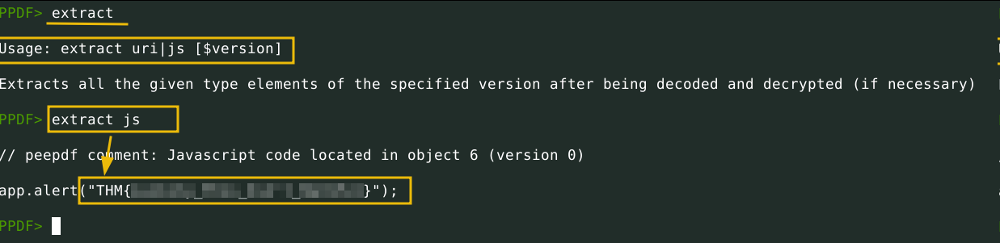

> 🔴 **Malware Relevance:** The full analysis chain here mirrors real-world PDF malware triage. `/OpenAction` → `/JavaScript` → encoded payload is the standard pattern used by PDF exploit kits (e.g., Blackhole). Always enumerate these keywords first before diving into object-level analysis.

### Questions

**Q: What is the flag found inside the JavaScript code?**
```
THM{Luckily_This_Isn't_Harmful}
```

**Q: How many OpenAction objects were found within the document?**
```
1
```

**Q: How many Encoded objects were found in the document?**
```
2
```

**Q: What are the numbers of encoded objects? (Separate with a comma)**
```
15,18
```

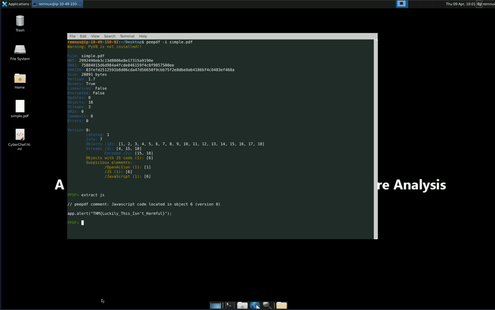

---

## Task 7 — Analyzing Malicious JavaScript

### Scenario

A junior analyst has extracted embedded JavaScript from a malicious PDF and escalated it for deeper analysis. The code is heavily obfuscated with randomized variable names — manual analysis would be extremely time-consuming.

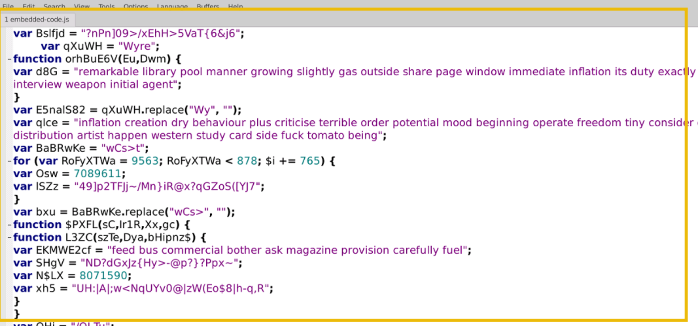

### Tool: `box-js`

`box-js` executes JavaScript in a sandboxed environment, monitors its behavior, and extracts IOCs without risking the host system.

```bash
box-js embedded-code.js
```

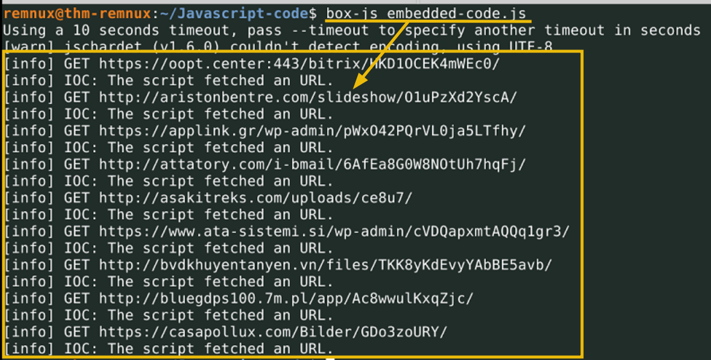

`box-js` also creates a results subfolder containing structured output files:

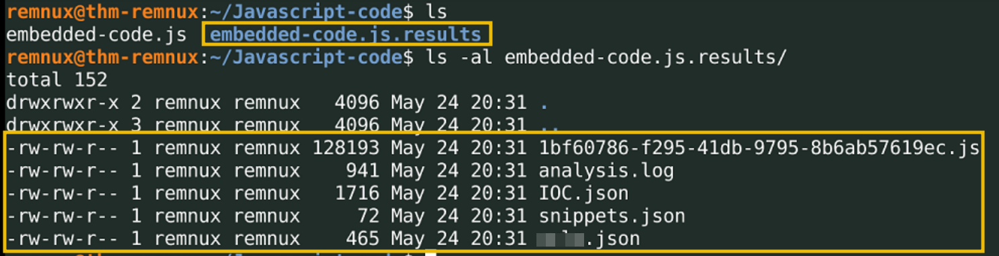

Key output files include:
- `urls.json` — all URLs contacted or referenced
- `snippets.json` — code snippets executed at runtime
- `resources/` — any files written or downloaded during execution

> 💡 **Tip:** `box-js` is especially useful for Emotet/QakBot JS droppers, which typically have multiple layers of obfuscation. It cuts through all of it in a single run.

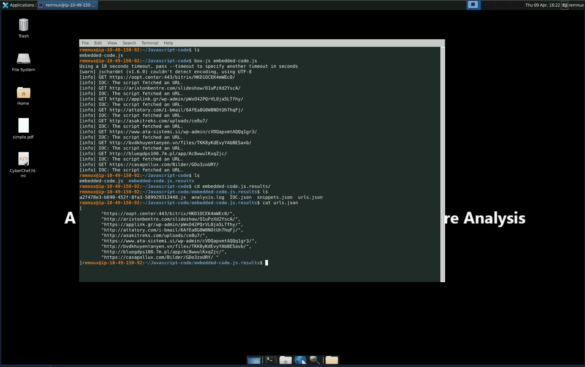

### Questions

**Q: What is the name of the dumped file that contains information about the URLs?**
```
urls.json
```

**Q: How many URLs were extracted from JavaScript?**
```
9
```

**Q: What is the full URL which contains the keyword slideshow? (defang the URL)**
```
hxxp://aristonbentre[.]com/slideshow/O1uPzXd2YscA/
```

---

## Task 8 — Office Document Analysis

### Word Document Formats

| Format | Standard | Extensions | Notes |
|--------|----------|------------|-------|
| Structured Storage (OLE) | Word 97–2003 | `.doc`, `.ppt`, `.xls` | Binary format |
| Office Open XML (OOXML) | Word 2007+ | `.docx`, `.docm` | ZIP archive containing XML files |

> 💡 **Tip:** OOXML files (`.docx`, `.docm`) are just ZIP archives. Rename to `.zip` and unzip to inspect XML content directly — useful for finding embedded URLs or macros without specialized tools.

### What Makes a Document Malicious

- **Macros** — VBA scripts that auto-execute on open (`AutoOpen`, `Document_Open`)
- **Embedded objects** — files designed to exploit the host application
- **Links** — URLs pointing to malware or phishing pages
- **Exploits** — code targeting vulnerabilities in Office/the OS
- **Hidden content** — invisible elements that trigger execution

### Analysis Walkthrough: `suspicious.doc`

**File identification with `trid`:**

```bash
trid suspicious.doc
```

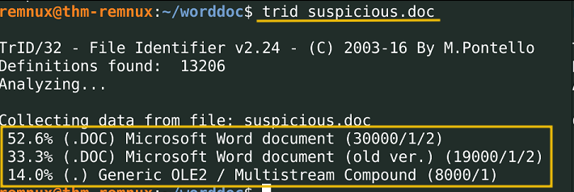

---

**`oleid` — document overview:**

```bash
oleid suspicious.doc
```

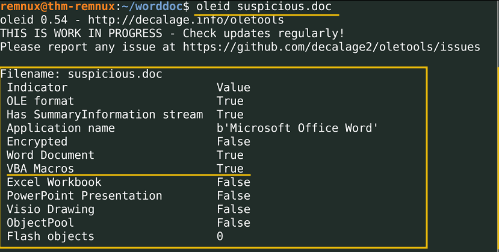

Confirms: not encrypted, VBA macros present, Word document format.

---

**`olemeta` — document metadata:**

```bash
olemeta suspicious.doc
```

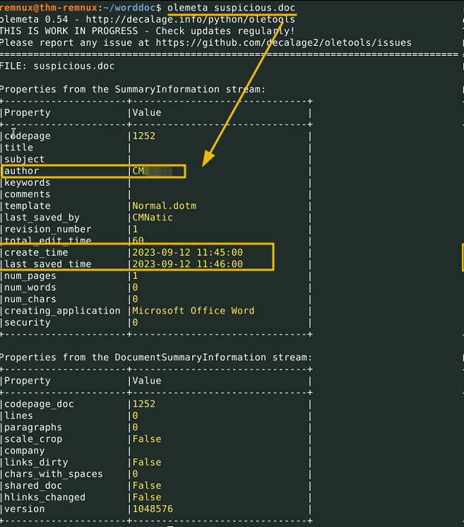

Key metadata: author name, creation date, last saved timestamp.

---

**`oletime` — stream timestamps:**

```bash
oletime suspicious.doc
```

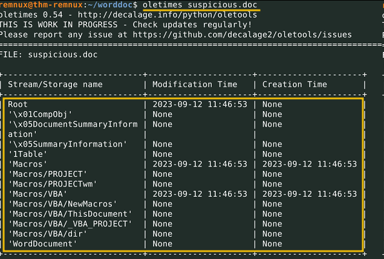

---

**`olemap` — sector map:**

```bash
olemap suspicious.doc
```

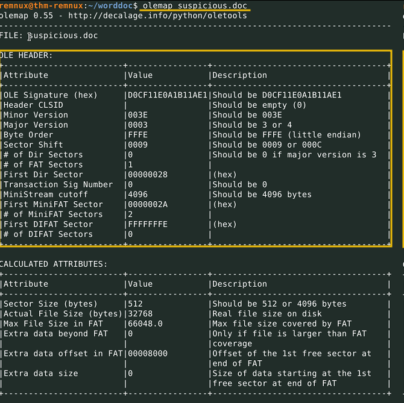

---

**`olevba` — VBA macro extraction:**

```bash
olevba suspicious.doc
```

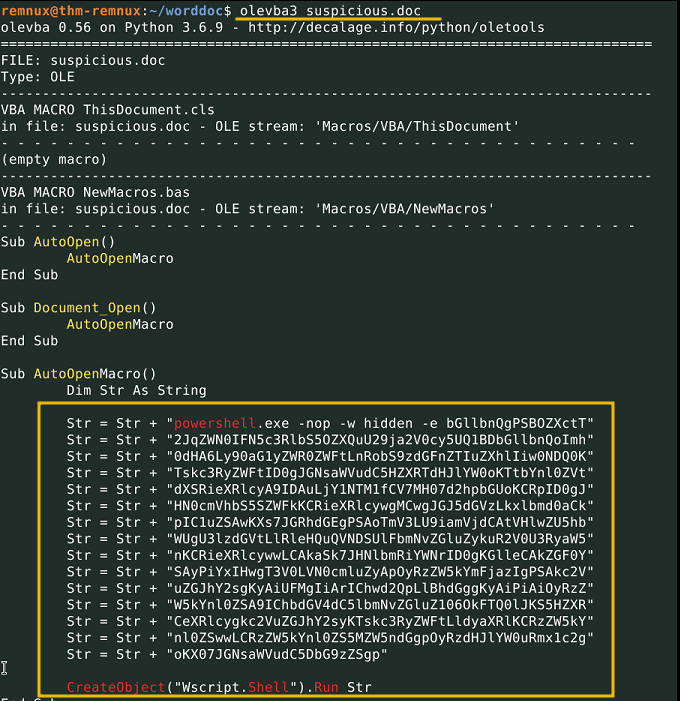

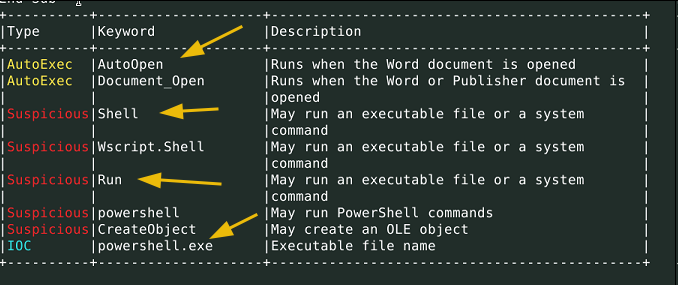

`olevba` summary flags:
- **AutoOpen** — macro executes automatically when document opens
- **Base64 encoded strings** — payload is obfuscated
- **PowerShell** — execution engine for the malicious code

> 🔴 **Malware Relevance:** `AutoOpen` + Base64 + PowerShell is the classic Emotet/Dridex macro pattern. The base64 hides the actual PowerShell command from simple string-based detection — this is why decoding the payload is a required step.

---

**`oledump.py` — stream-level macro inspection:**

```bash
oledump.py suspicious.doc
```

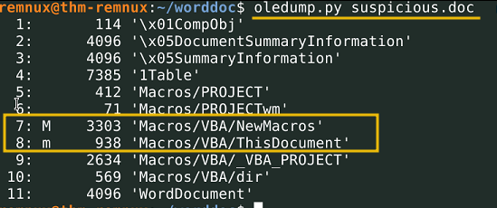

Streams marked `M` contain macros. Objects 7 and 8 are the targets.

```bash
oledump.py -M suspicious.doc
```

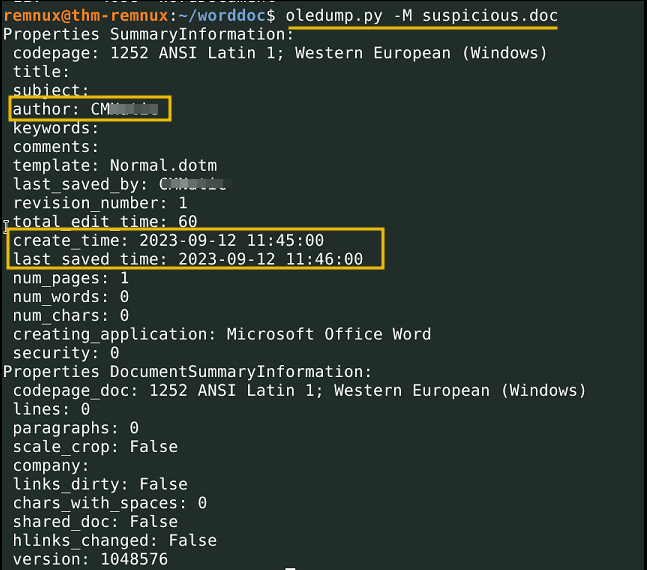

Extract macro from stream 7:

```bash
oledump.py -s 7 suspicious.doc
```

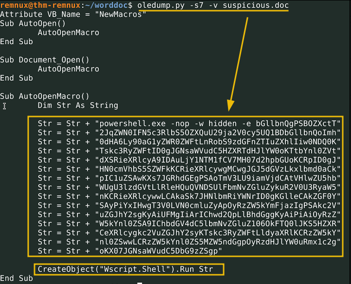

Stream 7 contains a PowerShell command with a base64-encoded payload that executes on document open.

---

**`ViperMonkey` — macro emulation:**

```bash
vmonkey suspicious.doc
```

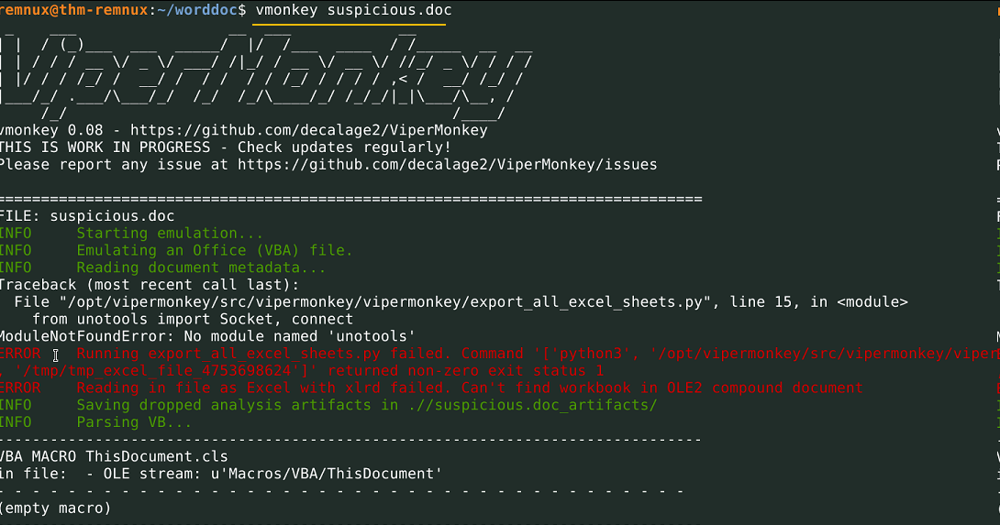

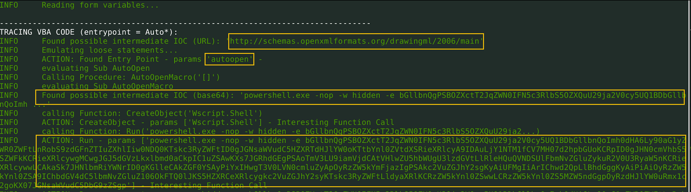

ViperMonkey emulates the macro and extracts the PowerShell script. The URL it surfaces is a false positive, but the PowerShell payload is real.

---

**CyberChef — base64 decode:**

Decode the base64 string extracted from the macro:

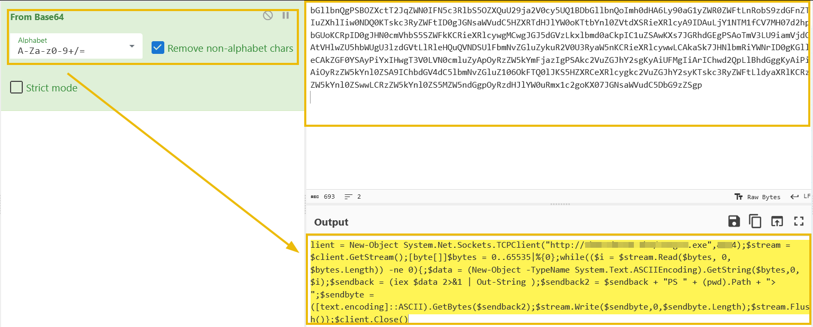

The decoded PowerShell clearly shows a connection attempt to a C2 server on port 4444, fetching `stage2.exe`.

Extract the URL using CyberChef's **Extract URLs** recipe:

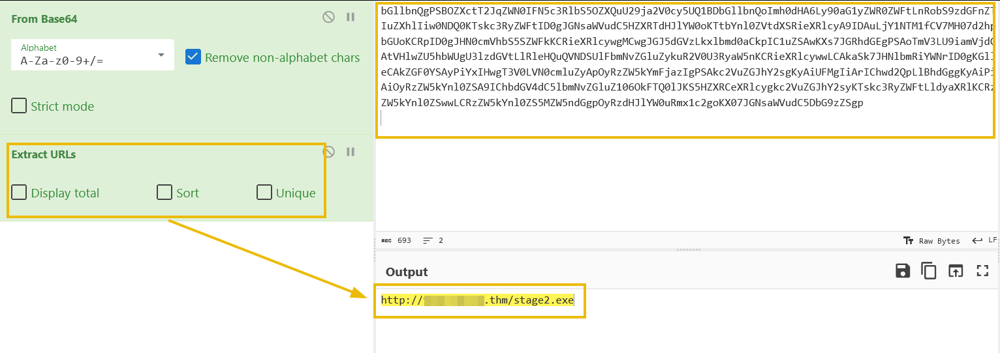

**Extracted C2 IOC:** `hxxp://thmredteam[.]thm/stage2.exe`

> 🔴 **Malware Relevance:** From a SOC perspective, this IOC goes straight into an outbound traffic detection rule. Any internal host communicating with `thmredteam[.]thm:4444` should be treated as compromised and isolated immediately for incident response.

### Questions

**Q: What is the author name of the document found during the analysis?**
```
CMNatic
```

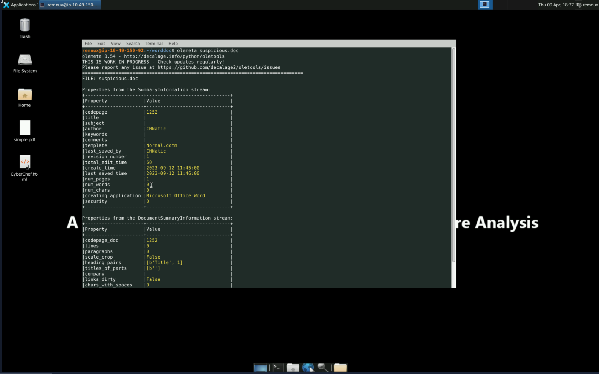

**Q: How many macros are embedded in the document?**
```
2
```

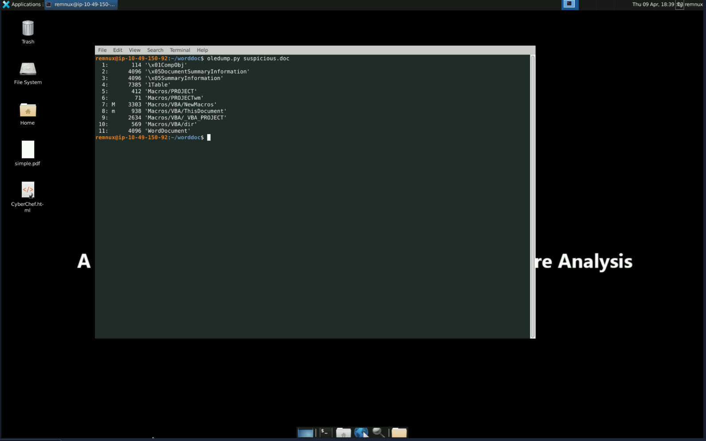

**Q: What is the URL extracted from the suspicious.doc file?**
```
hxxp://thmredteam[.]thm/stage2.exe
```

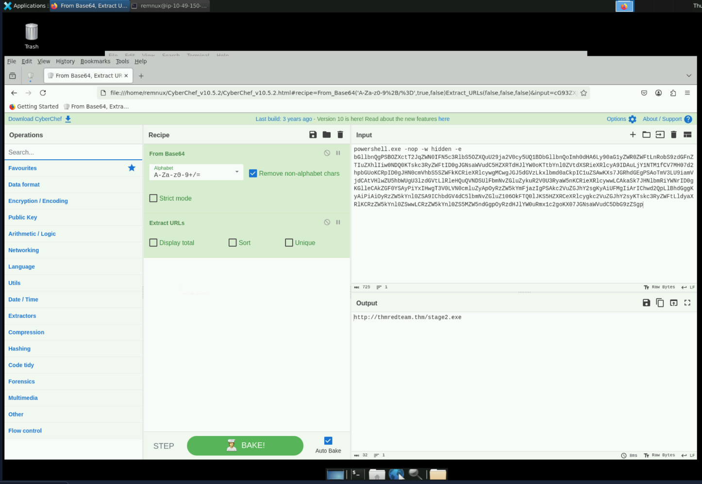

---

## Task 9 — OneNote Analysis

### Background

OneNote (`.one` / `.onenote`) emerged as a preferred phishing delivery format after Microsoft's 2022 macro-blocking policy forced threat actors to pivot away from `.docm` files. OneNote documents can embed files, scripts, and executables that execute when a user interacts with them.

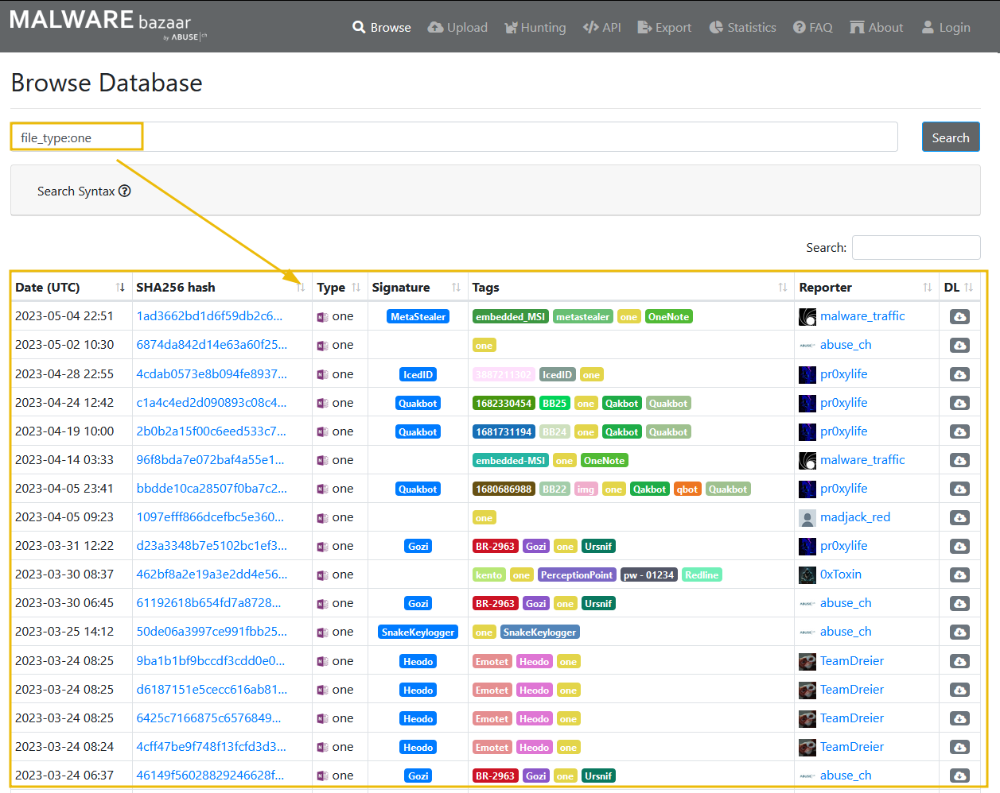

### Analysis Walkthrough: `invoice.one`

**File identification:**

```bash
trid invoice.one
```

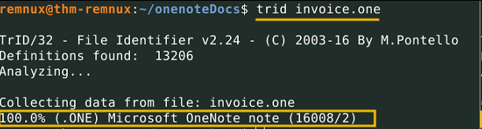

---

**String extraction:**

```bash
strings invoice.one
```

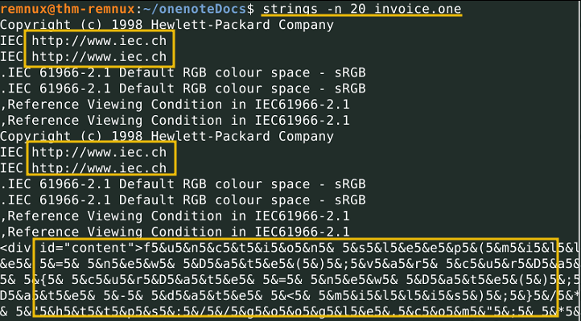

`strings` immediately surfaces suspicious domain references and fragments of embedded code — a strong indicator of malicious content.

---

**`onedump.py` — object enumeration:**

```bash
python3 onedump.py -h
```

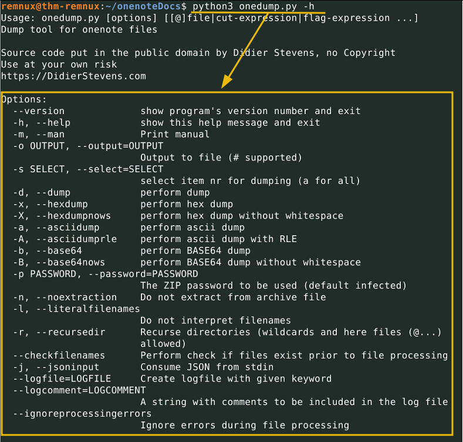

```bash
python3 onedump.py invoice.one
```

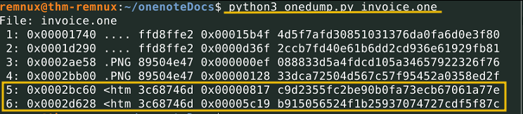

6 objects found. Objects 5 and 6 are identified as HTML files — the primary targets for analysis.

---

**Dump and inspect Object 5:**

```bash
python3 onedump.py -s 5 -d invoice.one
```

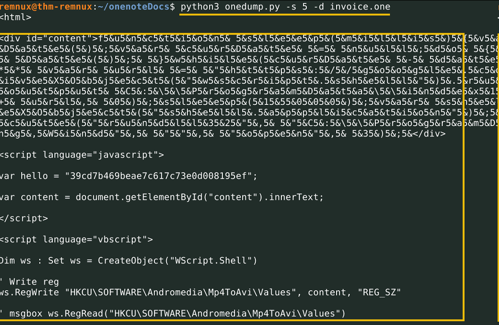

Save and open for detailed inspection:

```bash
python3 onedump.py -s 5 -d invoice.one > obj5
notepad obj5
```

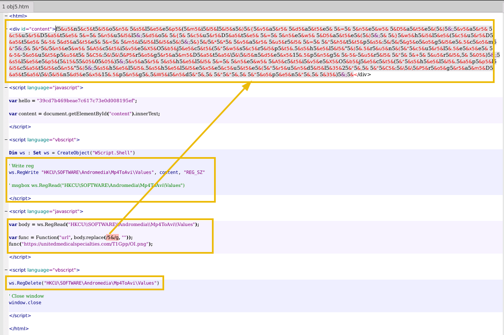

The obfuscation technique here is simple but effective: the string `5&` is sprinkled throughout the code to break up keywords and prevent static pattern matching. A CyberChef `Find/Replace` operation removes it entirely.

---

**CyberChef deobfuscation:**

Use **Find/Replace** to strip `5&` from the code:

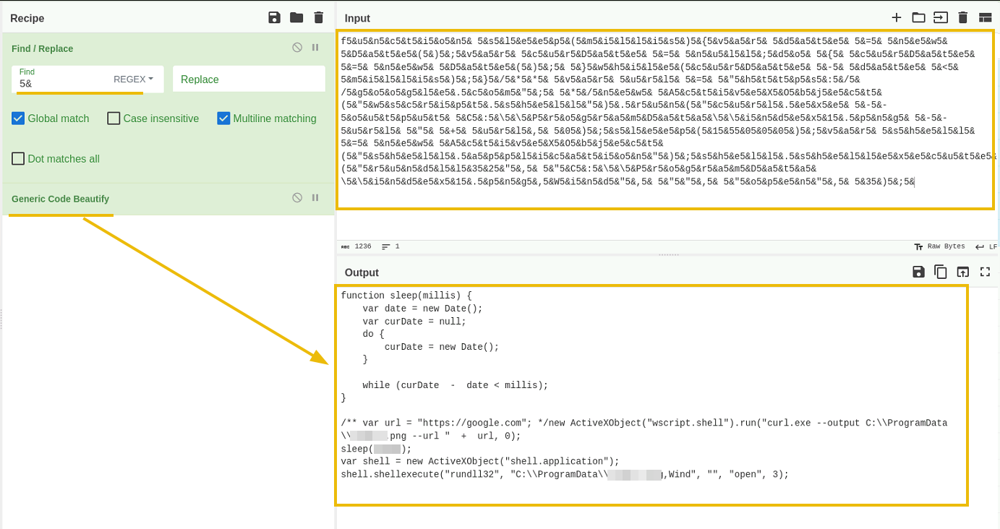

### IOCs Extracted

| Indicator | Value |
|-----------|-------|
| **C2 Domain** | `hxxps[:]//unitedmedicalspecialties[.]com/T1Gpp/OI.png` |
| **Payload filename** | `index1.png` |
| **Payload path** | `C:\ProgramData\index1.png` |
| **Execution method** | `rundll32 C:\ProgramData\index1.png,Wind` |
| **Registry persistence** | `HKCU\SOFTWARE\Andromedia\Mp4ToAvi\Values` |
| **Sleep duration** | `15000 ms` |

> 🔴 **Malware Relevance:** Storing a `.png` file and executing it with `rundll32` is a classic DLL-disguise technique — the payload is actually a DLL renamed to look like an image to bypass extension-based detections. The registry key is used to temporarily stage and run the script before self-deleting to reduce forensic footprint.

### Questions

**Q: What is the value used in the sleep function?**
```
15000
```

**Q: The cURL command is being used to download from a URL and save the payload in a png file. What is that file name?**
```
index1.png
```

**Q: How many objects are found in the invoice.one document?**
```
6
```

---

## Task 10 — Conclusion

No questions.

---

## Key Takeaways

- **PDF analysis** starts with `pdfid.py` to surface dangerous keywords (`/OpenAction`, `/JavaScript`, `/Launch`) before drilling into individual objects with `pdf-parser.py` or `peepdf`
- **`box-js`** sandboxes and executes obfuscated JavaScript automatically — far faster than manual deobfuscation for complex dropper scripts
- **OLE document analysis** follows a layered approach: metadata first (`oleid`, `olemeta`), then macro extraction (`olevba`, `oledump.py`), then emulation (`ViperMonkey`)
- **Base64-encoded PowerShell** in macros is a staple of commodity malware (Emotet, Dridex) — always decode and extract the C2 URL for detection rule creation
- **OneNote** documents weaponize embedded HTML/script objects; `onedump.py` + CyberChef is the standard triage workflow
- **DLL-as-PNG** is a common evasion technique — `rundll32` executing a `.png` file is always suspicious and worth alerting on

---

*Write-up by [OPT4RUN](https://tryhackme.com/p/OPT4RUN)*