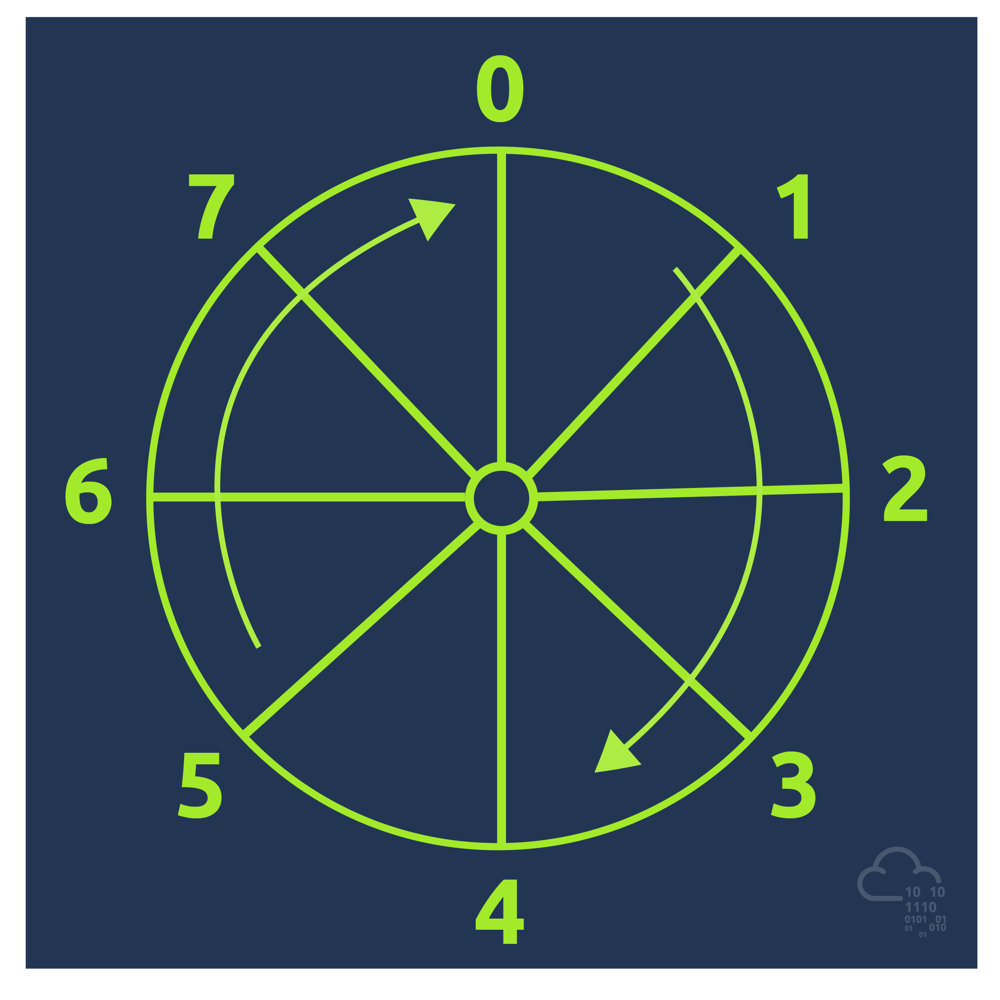
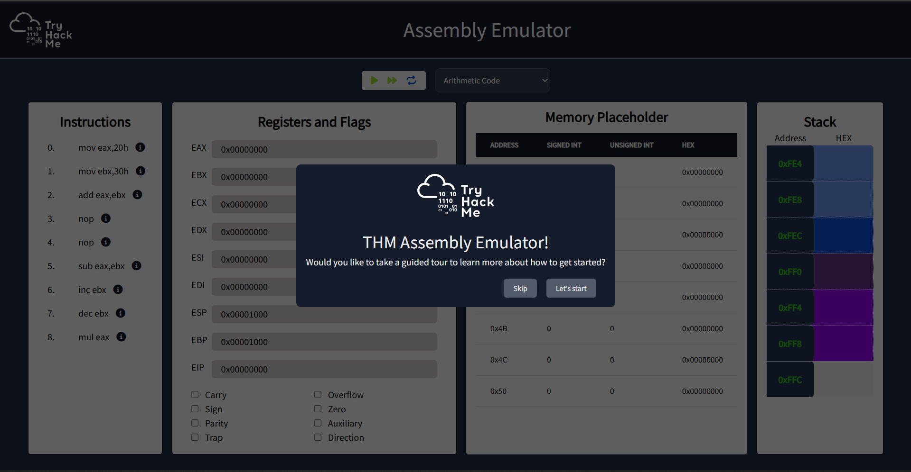
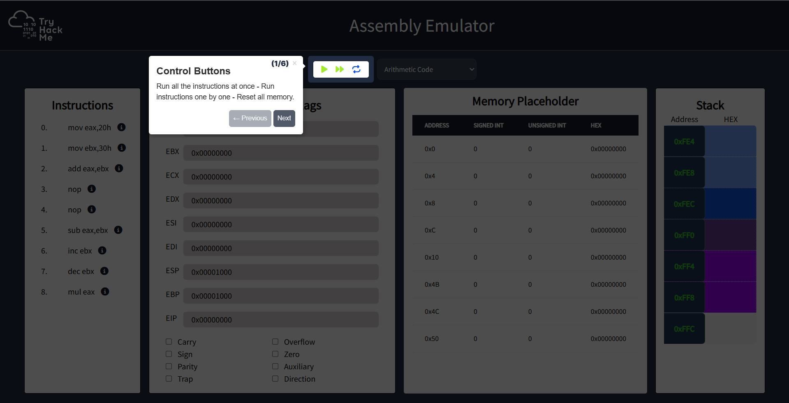
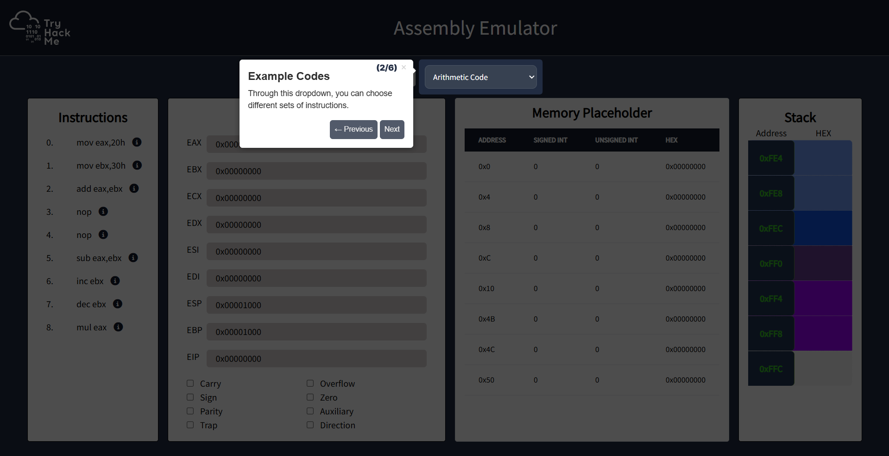
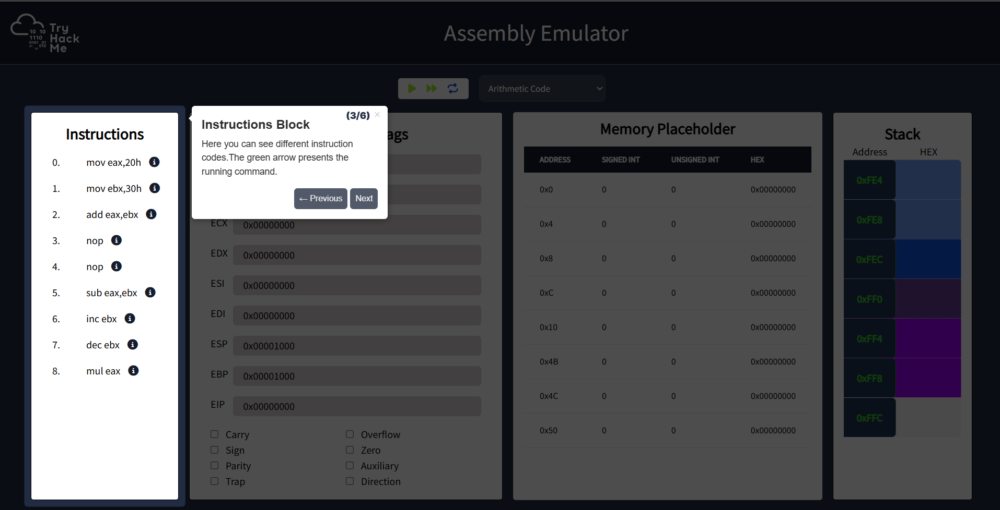
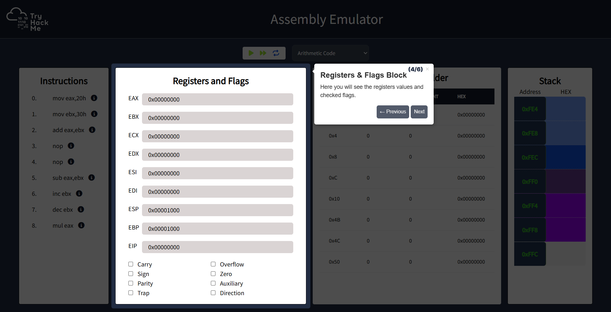
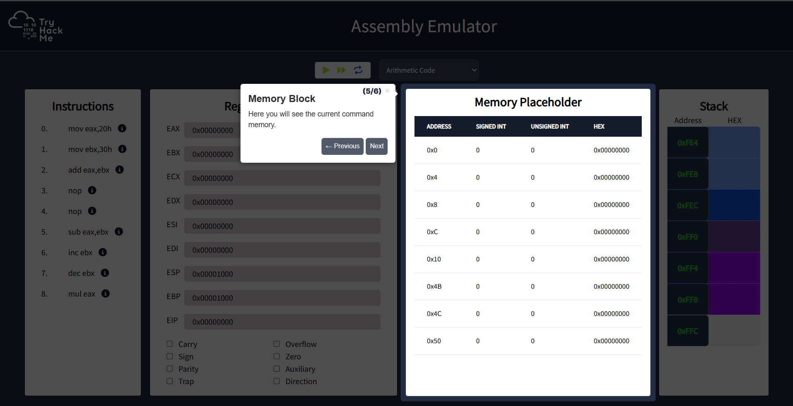
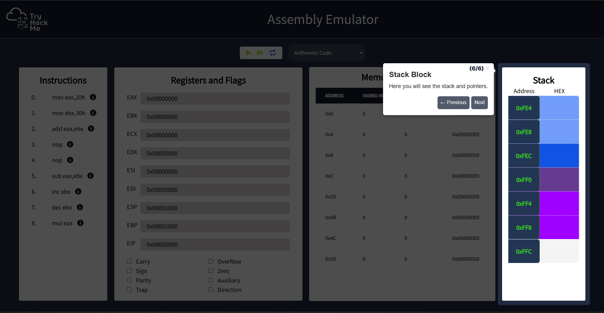

# x86 Assembly Crash Course

| Field | Details |
|-------|---------|
| **Room** | x86 Assembly Crash Course |
| **Platform** | TryHackMe |
| **Path** | SOC Level 2 |
| **Module** | Malware Analysis |
| **Difficulty** | Easy |
| **Category** | Malware Analysis |
| **Room Link** | [tryhackme.com/room/x86assemblycrashcourse](https://tryhackme.com/room/x86assemblycrashcourse) |
| **Author** | [OPT4RUN](https://tryhackme.com/p/OPT4RUN) |

---

## Overview

Assembly language is the lowest level of human-readable code and the highest level to which a compiled binary can be reliably decompiled. As a malware analyst, you'll rarely have access to the original C/C++ source — what you get is a compiled binary. Disassemblers can convert that binary back into assembly, but source-level information like variable names and function names is lost during compilation. Assembly is therefore the most reliable view into what a malware sample is actually doing.

This room covers the foundational assembly concepts needed to start reading and reasoning about disassembled malware: opcodes and operands, general and arithmetic instructions, logical operations, conditionals, branching, and stack/function mechanics. Hands-on practice is done via a built-in assembly emulator.

**Prerequisites:** [x86 Architecture Overview](https://tryhackme.com/room/x8664arch)

---

## Task 1 — Introduction

Assembly is the bridge between raw binary and something a human analyst can actually read. When a malware sample lands on your desk, it's typically a compiled binary with no source code attached. A disassembler reconstructs the assembly from the binary's opcodes, but source-level metadata — variable names, function names, comments — is gone. What remains is the assembly, and being able to read it is a non-negotiable skill in malware analysis.

**Topics covered in this room:**
- Opcodes and operands
- General assembly instructions
- Arithmetic and logical instructions
- Conditionals
- Branching instructions

---

## Task 2 — Opcodes and Operands

At the lowest level, program code stored on disk and loaded into memory is a sequence of 0s and 1s. To make this readable, 8 bits are grouped into a byte and represented as a hex value (e.g., `0x5F`). Within these sequences, there are **opcodes** and **operands**.

**Opcodes** are hex values that map directly to CPU instructions. A disassembler reads these opcodes and translates them into human-readable assembly mnemonics.

For example, the instruction `mov eax, 0x5f` appears in a disassembler as:
```
040000:    b8 5f 00 00 00    mov eax, 0x5f
```

Here `040000:` is the instruction address, `b8` is the opcode for `mov eax`, and `5f 00 00 00` is the operand `0x5f` in little-endian notation (stored as `5f 00 00 00`, meaning `00 00 00 5f` in big-endian).

**Operands** are the targets on which the opcode operates. There are three types:

| Type | Description | Example |
|------|-------------|---------|
| Immediate | A constant value hardcoded directly | `0x5f` |
| Register | A CPU register used as a value | `eax` |
| Memory | Square brackets denote a memory address — the value *at* that address is used | `[eax]` |

> 💡 **Tip:** `[eax]` means "go to the memory address stored in `eax` and fetch the value there" — it's a dereference, not the register value itself.

**Q: What are the hex codes that denote the assembly operations called?**
```
Opcodes
```

**Q: Which type of operand is denoted by square brackets?**
```
memory operand
```

---

## Task 3 — General Instructions

General instructions perform simple data movement and bit manipulation operations. These are among the most frequently encountered instructions when reverse engineering malware.

### MOV

Copies a value from source to destination. The source can be an immediate value, a register, or a memory location.
```nasm
mov eax, 0x5f        ; immediate → register
mov ebx, eax         ; register → register
mov eax, [0x5fc53e]  ; memory → register
mov eax, [ebp+4]     ; memory with offset → register
```

> 🔴 **Malware relevance:** `mov eax, [ebp+4]` is a classic function argument access pattern — you'll see this constantly when reading malware prologue/epilogue code.

### LEA (Load Effective Address)

`lea` loads the *address* of the source expression into the destination — it does not dereference memory. Often used by compilers as a fast single-instruction arithmetic trick.
```nasm
lea eax, [ebp+4]   ; eax = ebp + 4 (the address, not the value at that address)
mov eax, [ebp+4]   ; eax = value stored at memory address (ebp + 4)
```

> 💡 **Tip:** `lea` vs `mov` is a common gotcha. If you see `lea`, the register gets the *computed address*. If you see `mov` with brackets, it gets the *value at that address*.

### NOP (No Operation)

Executes nothing — the CPU moves to the next instruction with no side effects.
```nasm
nop
```

> 🔴 **Malware relevance:** Malware authors use long sequences of `nop` instructions called a **NOP sled** to pad shellcode. Because the exact redirect address is often unknown, a sled of `nop`s ensures execution slides into the shellcode regardless of the exact landing point.

### Shift Instructions

Shifts bits left or right. Bits that overflow are discarded (filled with zeroes). The last bit to overflow goes into the Carry Flag (CF).
```nasm
shl destination, count   ; shift left
shr destination, count   ; shift right
```

Shifting is an optimised substitute for multiplication or division by powers of 2:
- `shl eax, 1` → `eax * 2`
- `shr eax, 1` → `eax / 2`

### Rotate Instructions

Similar to shift, but overflowing bits wrap around to the other end of the register rather than being discarded.
```nasm
rol destination, count   ; rotate left
ror destination, count   ; rotate right
```



As shown above, `ror al, 1` on `10101010` produces `01010101`. Rotating back left by 1 restores the original value.

> 🔴 **Malware relevance:** Rotate operations are commonly used in obfuscation routines and custom encryption/decryption algorithms in malware.

**Q: In `mov eax, ebx`, which register is the destination operand?**
```
eax
```

**Q: What instruction performs no action?**
```
nop
```

---

## Task 4 — Flags

The **EFLAGS register** is a special-purpose register where each bit acts as a flag indicating the result of the most recent arithmetic or logical operation. Flags drive conditional branching — they're what the CPU checks to decide whether to take a jump.

| Flag | Abbreviation | Set When... |
|------|-------------|-------------|
| Carry | CF | A carry-out or borrow is required from the MSB in an arithmetic operation; also used in bit shifts |
| Parity | PF | The least significant byte of the result has an even number of 1 bits |
| Auxiliary | AF | A carry or borrow occurs from bit 3 to bit 4 (used in BCD arithmetic) |
| Zero | ZF | The result of the operation is zero |
| Sign | SF | The result is negative (MSB is 1) |
| Overflow | OF | A signed arithmetic overflow occurred |
| Direction | DF | Controls string processing direction: 0 = forward, 1 = backward |
| Interrupt Enable | IF | 1 = maskable hardware interrupts enabled; 0 = disabled |

> 🔴 **Malware relevance:** Malware frequently manipulates flags to control execution flow — for example, `xor eax, eax` zeroes `eax` and sets ZF in one instruction, which can then be used to drive a conditional jump. Understanding flag state is critical to following malware logic.

**Q: Which flag will be set if the result of the operation is zero? (Answer in abbreviation)**
```
ZF
```

**Q: Which flag will be set if the result of the operation is negative? (Answer in abbreviation)**
```
SF
```

---

## Task 5 — Arithmetic and Logical Instructions

### Arithmetic Instructions

**ADD / SUB**
```nasm
add destination, value   ; destination = destination + value
sub destination, value   ; destination = destination - value
```

For `sub`: ZF is set if the result is zero; CF is set if the destination is smaller than the subtracted value (underflow/borrow).

**MUL / DIV**

These implicitly use `eax` and `edx`:
```nasm
mul value   ; edx:eax = eax * value  (64-bit result split across two registers)
div value   ; eax = edx:eax / value, edx = remainder
```

> 💡 **Tip:** When reversing, always check what `eax` and `edx` held *before* a `mul` or `div` — the result depends on their prior state.

**INC / DEC**
```nasm
inc eax   ; eax = eax + 1
dec eax   ; eax = eax - 1
```

### Logical Instructions

| Instruction | Operation | Returns 1 when... |
|-------------|-----------|-------------------|
| `and` | Bitwise AND | Both bits are 1 |
| `or` | Bitwise OR | At least one bit is 1 |
| `not` | Bitwise NOT | — (inverts all bits) |
| `xor` | Bitwise XOR | Both bits are *different* |
```nasm
and al, 0x7c    ; mask bits
or  al, 0x7c    ; set bits
not al          ; flip all bits
xor al, 0x7c    ; toggle bits
xor eax, eax    ; zero eax (common compiler optimisation)
```

> 🔴 **Malware relevance:** `xor` is the backbone of simple XOR encryption — one of the most common obfuscation techniques in malware. XORing a register with itself (`xor eax, eax`) is also a compiler-preferred way to zero a register, marginally faster than `mov eax, 0`.

**Q: In a subtraction operation, which flag is set if the destination is smaller than the subtracted value?**
```
Carry Flag
```

**Q: Which instruction is used to increase the value of a register?**
```
inc
```

**Q: Do the following instructions have the same result? (yea/nay)**
```nasm
xor eax, eax
mov eax, 0
```
```
yea
```

---

## Task 6 — Conditionals and Branching

### Conditional Instructions

**TEST**

Performs a bitwise AND but discards the result — only sets ZF if the result is zero. Commonly used to check for NULL or zero values.
```nasm
test destination, source
```

> 💡 **Tip:** `test eax, eax` is the canonical way to check if `eax` is zero. It's more space-efficient than `cmp eax, 0`.

**CMP**

Performs a subtraction but discards the result — only sets flags. Equivalent in effect to `sub` without modifying the operands.
```nasm
cmp destination, source
```

| Result | ZF | CF |
|--------|----|----|
| `destination == source` | 1 | 0 |
| `source > destination` | 0 | 1 |
| `destination > source` | 0 | 0 |

### Branching

Without branching, EIP increments linearly through instructions. Branching instructions change EIP directly, altering the execution path.

**JMP** — unconditional jump:
```nasm
jmp location   ; EIP = location
```

**Conditional Jumps** — check flag state before jumping:

| Instruction | Condition |
|-------------|-----------|
| `jz` | Jump if ZF = 1 |
| `jnz` | Jump if ZF = 0 |
| `je` | Jump if equal (ZF = 1, after CMP) |
| `jne` | Jump if not equal |
| `jg` | Jump if destination > source (signed) |
| `jl` | Jump if destination < source (signed) |
| `jge` | Jump if destination ≥ source (signed) |
| `jle` | Jump if destination ≤ source (signed) |
| `ja` | Jump if above (unsigned) |
| `jb` | Jump if below (unsigned) |
| `jae` | Jump if above or equal (unsigned) |
| `jbe` | Jump if below or equal (unsigned) |

> 🔴 **Malware relevance:** Conditional jumps are how malware implements anti-analysis checks, licence validation bypasses, and control flow obfuscation. A common pattern is `cmp` / `jz` or `test` / `jnz` — recognising these pairs quickly is essential for following malware logic in a disassembler.

**Q: Which flag is set as a result of the test instruction being zero?**
```
Zero flag
```

**Q: Which of the below operations uses subtraction to test two values? 1 or 2?**
```
1
```

**Q: Which flag is used to identify whether a jump will be taken or not after a jz or jnz instruction?**
```
Zero Flag
```

---

## Task 7 — Stack and Function Calls

The stack is a **Last In, First Out (LIFO)** memory region. ESP (stack pointer) always points to the top of the stack and is decremented on `push` and incremented on `pop`.

### PUSH / POP
```nasm
push source       ; store value at [ESP], decrement ESP
pop  destination  ; load value from [ESP] into destination, increment ESP
```

**Push/pop all variants:**

| Instruction | Operation |
|-------------|-----------|
| `pusha` | Push all 16-bit general-purpose registers (AX, BX, CX, DX, SI, DI, SP, BP) |
| `pushad` | Push all 32-bit general-purpose registers (EAX, EBX, ECX, EDX, ESI, EDI, ESP, EBP) |
| `popa` | Pop in order: DI, SI, BP, BX, DX, CX, AX |
| `popad` | Pop in order: EDI, ESI, EBP, EBX, EDX, ECX, EAX |

> 🔴 **Malware relevance:** Seeing `pusha` / `pushad` followed by `popa` / `popad` is a strong indicator of manually injected shellcode — it's a pattern used to preserve register state before executing shellcode and restore it afterward.

### CALL
```nasm
call location
```

Pushes the return address onto the stack, then jumps to `location`. The **function prologue** at the call target adjusts EBP and ESP; the **epilogue** restores the caller's stack frame before returning. These conventions will be covered in depth in upcoming rooms.

**Q: Which instruction is used for performing a function call?**
```
call
```

**Q: Which instruction is used to push all registers to the stack?**
```
pusha
```

---

## Task 8 — Practice Time

This task uses the **THM Assembly Emulator** to run code blocks and observe how each instruction affects registers, flags, memory, and the stack in real time.



The emulator interface has four panels — Instructions, Registers & Flags, Memory Placeholder, and Stack. The guided tour walks through each:













### CMP and TEST Flag Behaviour

| Condition | Flags set by CMP | Flags set by TEST |
|-----------|-----------------|-------------------|
| `eax == ebx` | PF, ZF | — (no flag) |
| `eax > ebx` | — (no flag) | PF, ZF |
| `eax < ebx` | CF, SF | PF, ZF |

> 💡 **Tip:** `test` always produces a non-negative result in this context (AND of equal values = same value ≠ 0 unless both are 0), so ZF is often not set for `test` when values are non-zero. The emulator makes this flag behaviour immediately visible.

**Q: While running the MOV instructions, what is the value of [eax] after running the 4th instruction? (in hex)**
```
0x00000040
```

**Q: What error is displayed after running the 6th instruction from the MOV instruction section?**
```
Memory to memory data movement is not allowed.
```

**Q: Run the instructions from the stack section. What is the value of eax after the 9th instruction? (in hex)**
```
0x00000025
```

**Q: Run the instructions from the stack section. What is the value of edx after the 12th instruction? (in hex)**
```
0x00000010
```

**Q: Run the instructions from the stack section. After POP ecx, what is the value left at the top of the stack? (in hex)**
```
0x00000010
```

**Q: Run the cmp and test instructions. Which flags are triggered after the 3rd instruction?**
```
PF,ZF
```

**Q: Run the test and the cmp instructions. Which flags are triggered after the 11th instruction?**
```
CF,SF
```

**Q: Run the instructions from the lea section. What is the value of eax after running the 9th instruction? (in hex)**
```
0x0000004B
```

**Q: Run the instructions from the lea section. What is the final value found in the ECX register? (in hex)**
```
0x00000045
```

---

## Task 9 — Conclusion

This room covered the foundational assembly instructions needed to begin reading disassembled malware:

- **Opcodes and operands** — how binary instructions are structured and read by a disassembler
- **General instructions** — `mov`, `lea`, `nop`, shift, and rotate
- **Arithmetic instructions** — `add`, `sub`, `mul`, `div`, `inc`, `dec`
- **Logical instructions** — `and`, `or`, `not`, `xor`
- **Conditionals and branching** — `test`, `cmp`, `jmp`, and conditional jumps driven by EFLAGS
- **Stack and function calls** — `push`, `pop`, `pusha`/`pushad`, `call`

More instructions will be introduced in subsequent rooms as the module progresses into hands-on malware analysis.

---

## Key Takeaways

- Assembly is the most reliable view into a compiled binary — source code is not available in real malware analysis scenarios
- Opcodes are hex values that map to CPU instructions; operands are the registers, immediates, or memory locations they act on
- `[register]` = dereference (value at that memory address); `register` = the register's value directly
- `lea` loads an *address*; `mov` with brackets loads a *value from memory*
- NOP sleds (`nop` padding) are a classic shellcode delivery technique
- `xor reg, reg` is a common compiler-optimised zero pattern — also the basis of XOR encryption in malware
- `pusha`/`pushad` at the start of a code block signals manually injected shellcode preserving register state
- Flags (ZF, CF, SF, PF) are set by arithmetic/logical operations and consumed by conditional jumps — this mechanism implements all branching logic in malware
- `cmp` uses subtraction internally; `test` uses AND — both discard the result and only set flags
- Memory-to-memory data movement is not allowed in x86 — always requires a register as an intermediate

---

*Write-up by [OPT4RUN](https://tryhackme.com/p/OPT4RUN)*