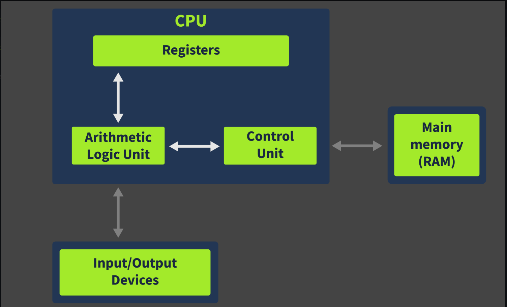
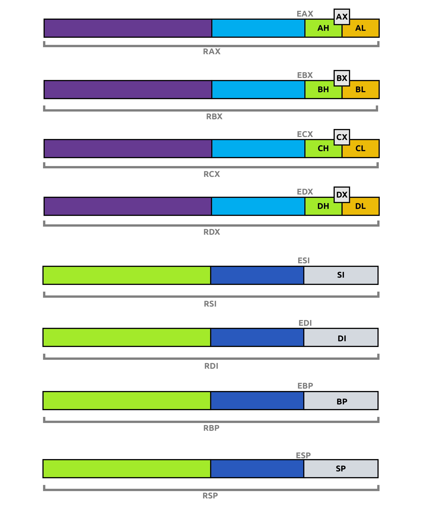
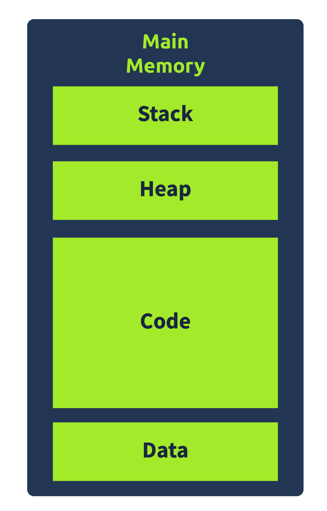
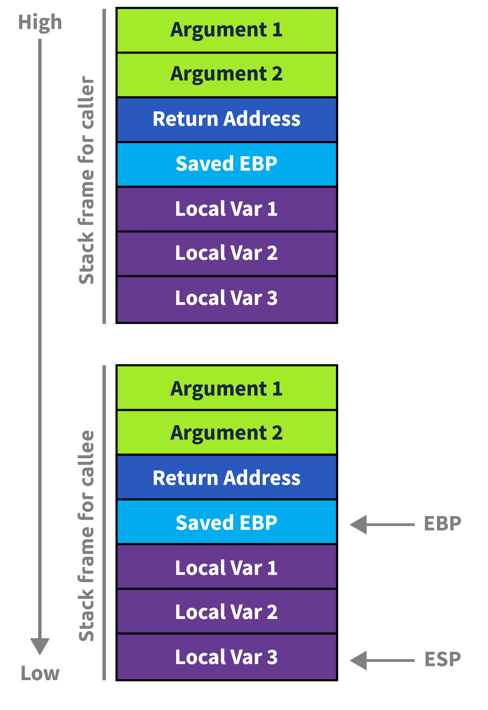
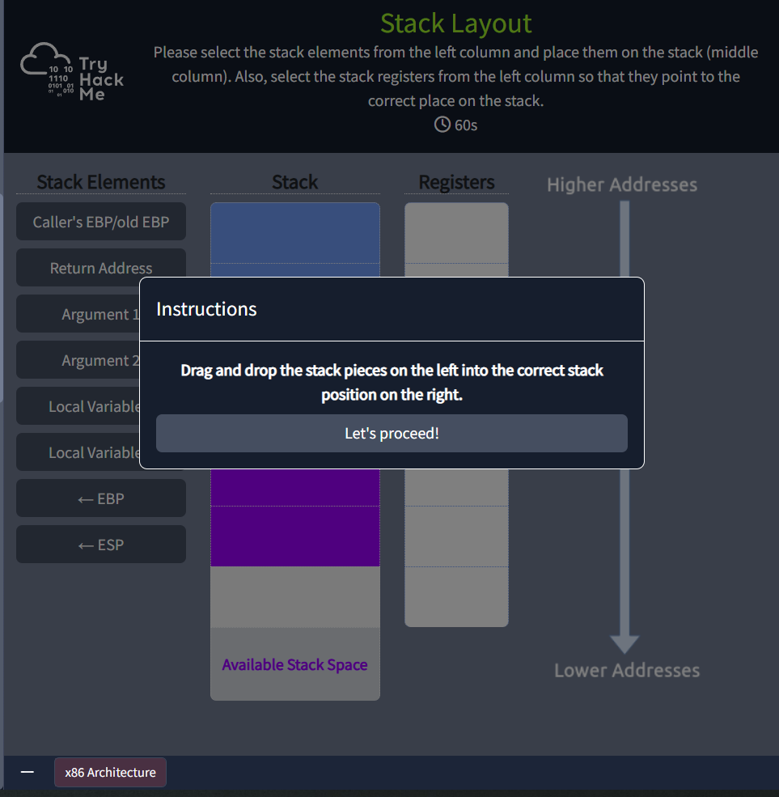
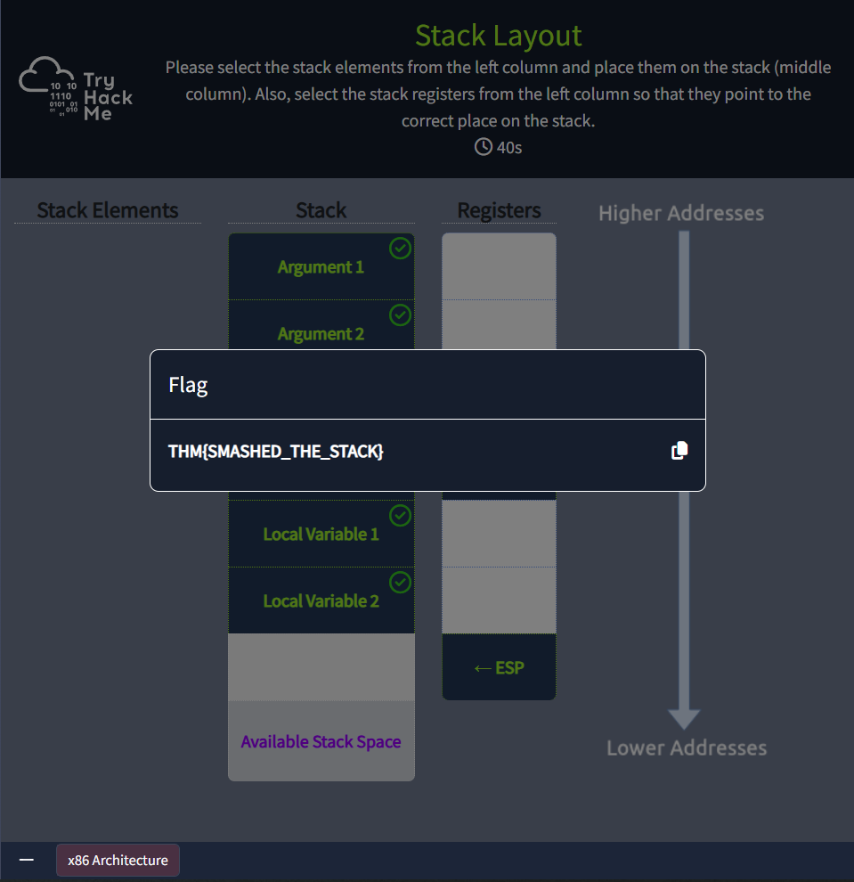

# x86 Architecture Overview

| Field | Details |
|-------|---------|
| **Room** | x86 Architecture Overview |
| **Platform** | TryHackMe |
| **Path** | SOC Level 2 → Malware Analysis |
| **Difficulty** | Easy |
| **Category** | Malware Analysis / Blue Team |
| **Room Link** | [tryhackme.com/room/x8664arch](https://tryhackme.com/room/x8664arch) |
| **Author** | [OPT4RUN](https://tryhackme.com/p/OPT4RUN) |

---

## 📌 Overview

This room provides a foundational understanding of the x86 CPU architecture — a critical concept for malware analysis. As a SOC analyst, understanding how the CPU works, how registers function, and how the stack is managed helps in reverse engineering malware behavior, identifying exploits, and analyzing memory dumps.

**Topics Covered:**
- Von Neumann CPU architecture and its components
- CPU registers — types, naming conventions, and usage
- Memory layout as seen by a running program
- Stack layout and how it can be abused by malware

---

## Task 1 — Introduction

This task sets the stage. The room is approached from a **malware analysis perspective**, focusing on how understanding CPU architecture helps analysts reverse engineer and analyze malicious software.

**Key learning objectives:**
- CPU architecture and its components
- Types of CPU registers and their usage
- Memory layout as viewed by a program
- Stack layout and stack registers

> ✅ No answer required.

---

## Task 2 — CPU Architecture Overview



The most widely used CPU architecture is derived from the **Von Neumann architecture**, which consists of the following components:

- **Control Unit** — Fetches instructions from main memory. The address of the next instruction to be fetched is stored in a register called the **Instruction Pointer** (EIP in 32-bit, RIP in 64-bit systems).
- **Arithmetic Logic Unit (ALU)** — Performs arithmetic and logical operations. Results are stored back in registers.
- **Registers** — Fast, small storage units inside the CPU used for temporary storage and special tasks.
- **Memory Unit (RAM)** — Stores the running program's code and data.
- **I/O Devices** — Handle input and output operations.

### Questions

**Q: In which part of the Von Neumann architecture are the code and data required for a program to run stored?**
```
Memory
```

**Q: What part of the CPU stores small amounts of data?**
```
Registers
```

**Q: In which unit are arithmetic operations performed?**
```
Arithmetic Logical Unit
```

---

## Task 3 — Registers Overview



Registers are storage units inside the CPU with the fastest access time of any storage medium. However, due to their limited size, they must be used effectively. There are four types of registers:

### 🔹 Instruction Pointer (IP)
Also called the **Program Counter**, it stores the address of the next instruction the CPU will execute.
- 16-bit: `IP`
- 32-bit: `EIP` (E = Extended)
- 64-bit: `RIP` (R = Register)

### 🔹 General Purpose Registers (GPRs)
Used during general execution of instructions. In x86, they are 32-bit; in x86-64, they are extended to 64-bit.

| Register (32/64-bit) | Name | Purpose |
|----------------------|------|---------|
| EAX / RAX | Accumulator | Stores ALU results |
| EBX / RBX | Base | Stores base address with offset |
| ECX / RCX | Counter | Used in loop/counting operations |
| EDX / RDX | Data | Used in multiplication, division, I/O |
| ESP / RSP | Stack Pointer | Points to the top of the stack |
| EBP / RBP | Base Pointer | References local variables on the stack |
| ESI / RSI | Source Index | Used in string operations |
| EDI / RDI | Destination Index | Used in string operations |
| R8–R15 | — | 64-bit only; not present in 32-bit systems |

> 💡 **Addressing sub-registers (example using EAX/RAX):**
> - 64-bit: `RAX`
> - 32-bit: `EAX`
> - Lower 16-bit: `AX`
> - Lower 8-bit: `AL`
> - Upper 8-bit of AX: `AH`
>
> The same pattern applies to RBX, RCX, RDX. For R8–R15: use `R8D` (32-bit), `R8W` (16-bit), `R8B` (8-bit).

### Questions

**Q: Which register holds the address to the next instruction that is to be executed?**
```
Instruction Pointer
```

**Q: Which register in a 32-bit system is also called the Counter Register?**
```
ECX
```

**Q: Which registers from the ones discussed above are not present in a 32-bit system?**
```
R8-R15
```

---

## Task 4 — Registers Continued

### 🔹 Status Flag Registers
The status register (`EFLAGS` in 32-bit, `RFLAGS` in 64-bit) is a single register made up of individual flag bits (0 or 1) that reflect the status of the last executed instruction.

| Flag | Notation | Set When |
|------|----------|----------|
| Zero Flag | ZF | Result of last instruction is zero |
| Carry Flag | CF | Result is too large or too small for the destination |
| Sign Flag | SF | Result is negative (MSB = 1) |
| Trap Flag | TF | CPU is in debugger/single-step mode |

> 🔴 **Malware relevance:** The **Trap Flag** is particularly important — malware can check if this flag is set to detect whether it's being run in a debugger, and alter its behavior accordingly (anti-debugging technique).

### 🔹 Segment Registers
These 16-bit registers divide flat memory space into distinct segments for easier addressing. There are 6 segment registers:

| Register | Notation | Points To |
|----------|----------|-----------|
| Code Segment | CS | Code section in memory |
| Data Segment | DS | Data section in memory |
| Stack Segment | SS | Program's stack in memory |
| Extra Segments | ES, FS, GS | Additional memory segments |

### Questions

**Q: Which flag is used by the program to identify if it is being run in a debugger?**
```
Trap Flag
```

**Q: Which flag will be set when the most significant bit in an operation is set to 1?**
```
Sign Flag
```

**Q: Which Segment register contains the pointer to the code section in memory?**
```
Code Segment
```

---

## Task 5 — Memory Overview



When a program is loaded into memory, it does **not** see the full system memory. Instead, it sees an **abstracted view** — only its own allocated portion. This memory is divided into four sections:

| Section | Description |
|---------|-------------|
| **Code** | Stores the program's executable instructions (from the PE file). Has execute permissions. |
| **Heap** | Dynamic memory — variables created and destroyed during runtime. |
| **Data** | Stores global variables and constants that don't change during execution. |
| **Stack** | Stores local variables, function arguments, and return addresses. Most important from a malware analysis perspective. |

> 🔴 **Malware relevance:** The **Stack** is the most critical section for malware analysts — it can be hijacked to cause **buffer overflow**, allowing attackers to redirect program execution.

### Questions

**Q: When a program is loaded into Memory, does it have a full view of the system memory? Y or N?**
```
N
```

**Q: Which section of the Memory contains the code?**
```
Code
```

**Q: Which Memory section contains information related to the program's control flow?**
```
Stack
```

---

## Task 6 — Stack Layout







The stack operates on a **LIFO (Last In, First Out)** principle. The CPU uses two registers to manage it:

- **Stack Pointer (ESP/RSP)** — Always points to the top of the stack. Adjusts dynamically as items are pushed or popped.
- **Base Pointer (EBP/RBP)** — Remains constant throughout a function's execution. Used as a fixed reference point to access local variables and arguments.

### Stack Structure (Top to Bottom)
```
[ Local Variables  ]  ← ESP points here (top of stack)
[ Base Pointer     ]  ← EBP points here
[ Old Base Pointer ]  ← Saved EBP of the calling function
[ Return Address   ]  ← Where EIP goes after function returns
[ Arguments        ]  ← Passed before function call
```

### Function Prologue & Epilogue

**Prologue** — Executes when a function is called:
1. Arguments are pushed onto the stack
2. Return address is pushed
3. Old base pointer is pushed
4. Base pointer is set to current stack pointer

**Epilogue** — Executes when a function returns:
1. Old base pointer is popped back into EBP
2. Return address is popped into EIP
3. Stack pointer is restored

> 🔴 **Malware relevance:** Attackers exploit the stack by **overflowing a buffer** to overwrite the **return address** with a malicious address — redirecting execution to their own code. This is the classic **stack-based buffer overflow** technique.

### Questions

**Q: Follow the instructions in the attached static site and find the flag. What is the flag?**
```
THM{SMASHED_THE_STACK}
```

---

## Task 7 — Conclusion

> ✅ No answer required.

---

## 🧠 Key Takeaways

- The **Von Neumann architecture** forms the basis of modern CPUs, with the Control Unit, ALU, Registers, Memory, and I/O devices working together.
- **Registers** are the fastest storage in the CPU. Knowing their naming conventions (E-prefix for 32-bit, R-prefix for 64-bit) is essential for reading disassembly.
- The **Trap Flag** is a key anti-debugging indicator — malware uses it to detect sandbox/debugger environments.
- A program only sees a **virtual, abstracted view** of memory — divided into Code, Heap, Data, and Stack sections.
- The **Stack** is the most critical memory section from a malware analysis standpoint — understanding its layout is foundational for analyzing buffer overflows and shellcode execution.

---

*Write-up by [OPT4RUN](https://tryhackme.com/p/OPT4RUN)*